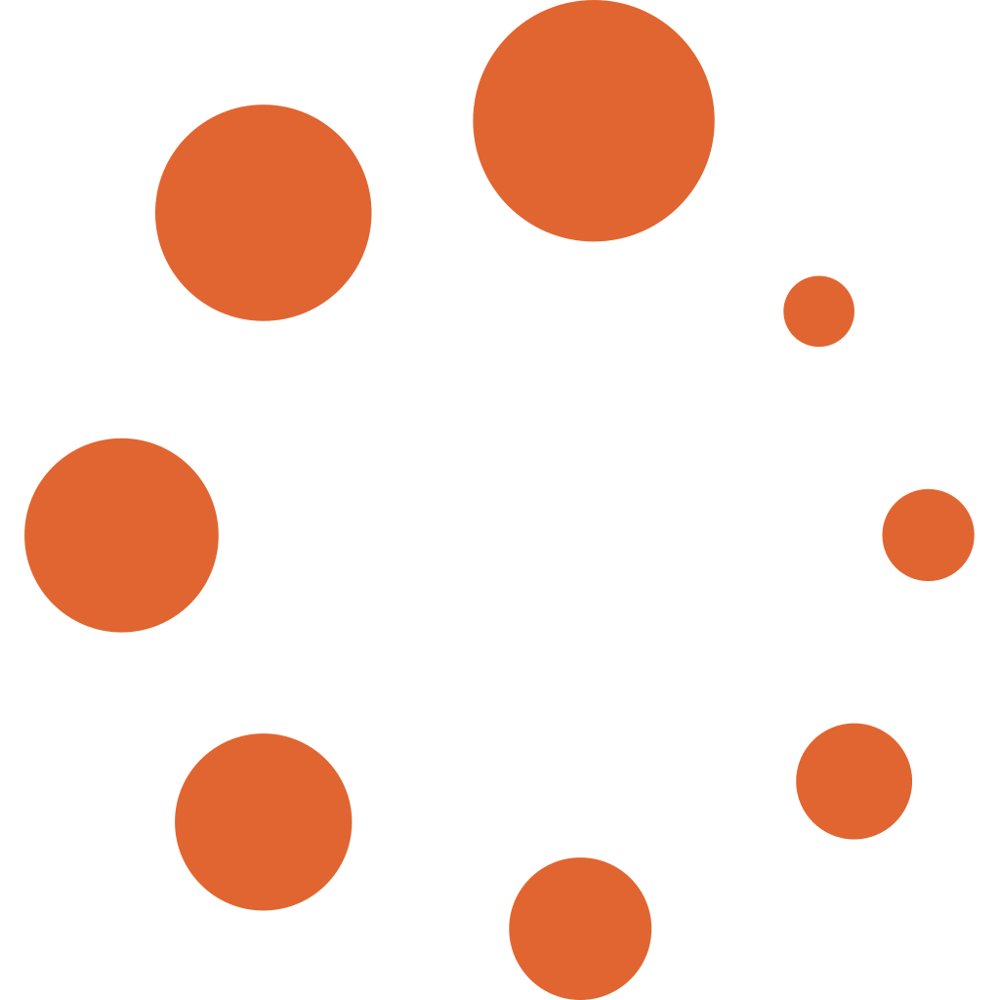

[English](README.md) | [中文](README.zh.md)

<p align="center"></p>
<p align="center">  </p>

# Hello Economics · An Economics Knowledge Base

A knowledge-organization site for economics enthusiasts. Rather than piling up points for rote memorization, it answers three questions:

1. **Why** did a theory emerge — what problem was it meant to solve at the time?
2. **How** did it develop — who revised it, and what new questions did that leave open?
3. **How** has it been tested — where do real-world data and later research stand?

Knowledge notes: [docs/knowledge.md](https://cuihairu.github.io/hello-economics/knowledge) — which standard textbook frames each course, the classics timeline, and the site's dating conventions.

## Site Content

An interactive site built on VitePress, with entry points including:

- **Six courses**: Western Economics, Money and Banking, Public Finance, International Economics, Socialist Economic Theory, and Mathematical Foundations (tab switching)
- **Theory timeline**: the emergence and development of economic theories from the 16th century to the present
- **Notable economists**: influence networks of economists — who proposed what, whom they influenced, and by whom they were influenced
- **Glossary**: a dictionary of technical terms, with search and catalog browsing
- **Classics**: a bookshelf of classic works in economics, browsable by publication year and school of thought

## Repository Structure

| Path | Contents |
| :--- | :--- |
| `docs/` | The VitePress site: course texts and introduction pages for the six courses (`docs/western/` `docs/math/` etc.), the timeline / notable economists / glossary / classics pages, theme data, and Vue components |
| `scripts/` | Gate scripts (broken-link, LaTeX, typography, and rendered-formula checks) and `build-glossary` term generation |
| `tests/` | Black-box tests for data and gates (`node --test`) plus component mounting (`vitest`) |
| `经济学-术语.md` `经济学-名人.md` | Root-level source material: glossary entries and the economists skeleton (entry backlinks are written as `docs/`-relative paths, for the generation chain to consume) |

## Local Development

```bash
pnpm install
pnpm dev       # local preview
pnpm glossary  # regenerate glossary data after editing 经济学-术语.md
pnpm test      # node --test (data/gate black-box) + vitest (theme component mounting)
pnpm build     # build (includes broken-link check)
```

Gate scripts: `pnpm check:links` (internal links), `pnpm check:latex` (formula syntax), `pnpm check:typography` (layout rules), `pnpm check:sidebar` (navigation coverage). CI regenerates the glossary, runs the tests and all four gates, then builds and deploys.

Component testing stack: Vitest + @vue/test-utils + happy-dom, reusing the site's single Vite toolchain to compile .vue SFCs (`vitest.config.ts`, including the vitepress client alias); test cases live in `tests/vue/`.

## Course Entry Points

- Western Economics: [Course introduction](docs/western/Readme.md) · [Theory progression chain](docs/western/History.md)
- Money and Banking: [Course introduction](docs/monetary/Readme.md) · [Historical process](docs/monetary/History.md)
- Public Finance: [Course introduction](docs/finance/Readme.md) · [Historical process](docs/finance/History.md)
- International Economics: [Course introduction](docs/international/Readme.md) · [Historical process](docs/international/History.md)
- Socialist Economic Theory: [Course introduction](docs/socialist/Readme.md) · [Historical process](docs/socialist/History.md)
- Mathematical Foundations: [Course introduction](docs/math/Readme.md)

## Public Materials

- [Unified Economics Glossary](经济学-术语.md)
- [Notable Economists](经济学-名人.md)
- [Overview of Western Economics Formulas](docs/western/西方经济学公式总览.md)
- [Evolution of Macroeconomic Models](docs/western/宏观经济模型演进.md)

## License

This work is licensed under the [Creative Commons Attribution 4.0 International (CC BY 4.0)](https://creativecommons.org/licenses/by/4.0/) license.
