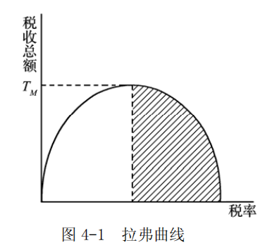
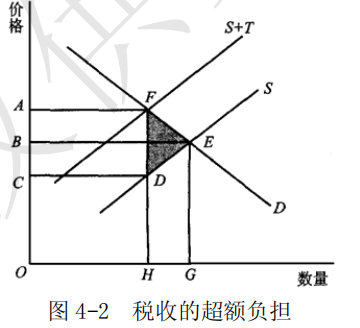

# 第 4 章 税收原理

> **本章核心问题**：税收应遵循哪些原则（公平、效率）？什么是税收中性？税负如何转嫁与归宿？

## 核心概念

### 累进税率

累进税率是指按课税对象数额的大小，划分若干等级，每个等级由低到高规定相应的税率，课税对象数额越大税率越高，数额越小税率越低。累进税率因计算方法的不同，又分为全额累进税率和超额累进税率两种。

全额累进税率是把课税对象的全部按照与之相对应的税率征税，即按课税对象适应的最高级次的税率统一征税。
超额累进税率是把课税对象按数额大小划分为不同的等级，每个等级由低到高分别规定税率，各等级分别计算税额，一定数额的课税对象同时使用几个税率。一般认为，累进税率有助于体现量能课税的原则，从而有利于实现收入的公平再分配。

---

**【通俗理解：赚得多交得多】**

**核心问题**：税率怎么设计才公平？

---

**【什么是累进税率？】**

**通俗理解**：赚得越多，交税比例越高

| 收入级别 | 税率 | 例子 |
|----------|------|------|
| **低收入** | 3% | 赚3000，交90 |
| **中等收入** | 10% | 赚10000，交1000 |
| **高收入** | 20% | 赚50000，交10000 |
| **超高收入** | 45% | 赚100万，交45万 |

**原则**：量能课税（能力大的多贡献）

---

**【两种累进方式】**

| 类型 | 怎么算 | 问题 |
|------|--------|------|
| **全额累进** | 全部收入按最高税率算 | 赚1万10%，赚10001变20% |
| **超额累进** | 分段算，每段不同税率 | 更公平 |

---

**【一句话记忆】**

> **累进税率** = "赚得越多交得越多" = 穷人少交，富人多交

---

### 价内税与价外税

以税收与价格的关系为标准，税收可分为价内税和价外税。
价内税是指税额包括在商品价格之中，购买者在购买商品时即缴纳应缴的税。
在这一类税收中，若税率既定，则商品价格越高，税收量越大；当税率变化，商品的价格保持不变时，高税率带来高税收。价内税是依托价格实现的税收，与价格高低关系密切。消费税即属于价内税。
价外税是指在商品的价格之外对商品的购买者所征的税。因为商品的价格之中不含税金，商品的生产者和经营者要在价格实现之后再行向政府纳税，所以价格中不含税的商品的购买者除了支付购买商品的价款之外，还要依据其所支付的价格再行纳税。在这种税制下，税收是在价格之外征收的。

---

**【通俗理解：税含在价格里还是外？】**

**核心问题**：你付的钱，税是含在内还是另外算？

---

**【价内税 vs 价外税】**

| 类型 | 含义 | 例子 | 体验 |
|------|------|------|------|
| **价内税** | 价格里包含税 | 消费税 | 100元商品，税在里面 |
| **价外税** | 价格外加税 | 增值税 | 100元商品+13元税 |

---

**【区别】**

| 对比 | 价内税 | 价外税 |
|------|--------|--------|
| **税额** | 含在价格里 | 价格外加 |
| **消费者感知** | 不明显 | 明显（发票上显示） |
| **价格调整** | 涨税即涨价 | 税价分离 |

**例子**：
- 价内税：加油100元，税已包含
- 价外税：买东西100元，发票显示商品88.5元+税11.5元

---

**【一句话记忆】**

> **价内税** = "税藏在价里" | **价外税** = "税明码标价"

---

### 税收中性

税收中性是指政府课税不扭曲市场机制的运行，或者说不影响私人部门原有的资源配置状况。
如果政府课税改变市场活动中以获取最大效用为目的的消费者的消费行为，或以获取最大利润为目的生产者的生产行为，就会改变私人部门原来的（税前）资源配置状况，这些改变效果即税收的非中性。

---

**【通俗理解：收税别添乱】**

**核心问题**：收税能不能不影响市场正常运行？

---

**【什么是税收中性？】**

**通俗理解**：收税就像收过路费，别影响交通

| 税收中性 | 税收非中性 |
|----------|-----------|
| 收钱，但不改变行为 | 收钱，改变行为 |
| 市场该怎么运行还怎么运行 | 市场行为被扭曲 |

---

**【例子】**

| 情况 | 结果 |
|------|------|
| **中性** | 对所有商品征同样税率，不改变消费选择 |
| **非中性** | 对A商品征高税，大家改买B商品 |

---

**【现实】**

完全的税收中性很难做到，但尽量接近。

---

**【一句话记忆】**

> **税收中性** = "收税别添乱" = 只收钱，不改变市场行为

---

### 税负转嫁

税负转嫁是指在商品交换过程中，纳税人通过提高销售价格或压低购进价格的方法，将税负转移给购买者或供应者的一种经济现象。在广义上，税负转嫁包括税收负担转移和最终归宿两个部分。税负转嫁与价格的升降直接相关，是税收负担在各经济主体之间的重新分配，也是纳税人维护和增加自身利益的自主行为。税负转嫁式的方式有前转、后转、消转和资本化。

---

**【通俗理解：税负转来转去，最后谁买单？】**

**核心问题**：政府找你收税，你能转给别人吗？

---

**【什么是税负转嫁？】**

**通俗理解**：税负接力棒

| 链条 | 税负转嫁过程 |
|------|-------------|
| **政府** | 对工厂收税 |
| **工厂** | 涨价，转给消费者 |
| **消费者** | 最终买单 |

---

**【税负转嫁方式】**

| 方式 | 含义 | 例子 |
|------|------|------|
| **前转** | 涨价转给消费者 | 厂家涨价，消费者买单 |
| **后转** | 压价转给供应商 | 超市压低进货价 |
| **混转** | 前转+后转 | 一部分前转，一部分后转 |
| **消转** | 自己消化 | 通过技术进步消化成本 |

---

**【一句话记忆】**

> **税负转嫁** = "税负接力棒" = 政府收谁的税，不一定是谁最终买单

---

### 拉弗曲线



拉弗曲线是指反映税率与税收总额之间关系的曲线。它是供给学派关于降低税率以刺激生产和经济增长的理论依据之一，由美国供给学派经济学家阿瑟·拉弗提出。如图 4-1 所示，拉弗曲线以税率为横轴，政府的税收总额为纵轴，是一个向下的抛物线曲线。它表示，税收总额先是随着税率的增加而增加，但税率增至一定程度后，二者即呈负相关关系。拉弗曲线反映了如下一些经济思想：

- （1）高税率不一定取得高收入，高税收不一定就是高效率。高税率往往会挫伤生产者和经营者的积极性，引起生产的下降，减少税基。
- （2）取得同样多的税收可以采取不同的两种税率。其中低税率从长远看可以促进生产的发展。
- （3）从理论上说明了税率与税收存在最优组合。

---

**【通俗理解：税率不是越高越好】**

**核心问题**：税率定多少，政府收的税最多？

---

**【拉弗曲线 = 抛物线】**

**形状**：像一座山

| 税率 | 税收收入 | 通俗理解 |
|------|----------|----------|
| **0%** | 0 | 不收税当然没钱 |
| **低税率** | 增加 | 收点税，大家还愿意干活 |
| **最优点** | 最多 | 税率合适，税收最多 |
| **高税率** | 减少 | 税太高，大家不干活了 |
| **100%** | 0 | 全没收，谁还干？ |

---

**【核心含义】**

| 想法 | 现实 |
|------|------|
| 税率越高税收越多 | ❌ 错！太高反而少收 |
| 要收最多的税 | ✅ 找到最优点（中间） |

**通俗理解**：
- 税率太低 → 收不到多少钱
- 税率太高 → 大家不干了，税基减少
- 税率合适 → 税收最多

---

**【一句话记忆】**

> **拉弗曲线** = "税率太高反而少收" = 找到最优点，税收最多

---

## 问题与分析

### 简述税收的基本特征。

税收的基本特征包括三个方面：
- 税收的强制性
- 无偿性
- 固定性

这“三性”是税收区别于其他财政

收入的基本特征，不同时具备“三性”的财政收入就不称其为税收。
- （1）税收的强制性。它指的是征税凭借国家政治权力，通常颁布法令实施，任何单位和个人都不得违抗。
- （2）税收的无偿性。它指的是国家征税以后，税款即为国家所有，既不需要偿还，也不需要对纳税人付出任何代价。
- （3）税收的固定性。它指的是征税前就以法律的形式规定了征税对象以及统一的税率比例或数额，并只能按预定的标准征税。

---

**【通俗理解：税收的三性】**

**核心问题**：税收跟别的收入有啥不同？

---

**【税收三大特征】**

| 特征 | 通俗理解 | 例子 |
|------|----------|------|
| **强制性** | 不交不行 | 依法纳税，不交要处罚 |
| **无偿性** | 交了不还 | 交税不是借钱，不还本 |
| **固定性** | 按规矩收 | 税率多少、怎么收，法律定好了 |

---

**【与债务收入对比】**

| 对比 | 税收 | 国债 |
|------|------|------|
| **强制性** | ✅ 强制 | ❌ 自愿购买 |
| **无偿性** | ✅ 不还 | ❌ 要还本付息 |
| **固定性** | ✅ 法定 | ❌ 卖多少算多少 |

---

**【一句话记忆】**

> **税收三性** = "强制+无偿+固定" = 不交不行，交了不还，按规矩收

---

### 借助图形解释税收的超额负担。

税收的超额负担理论是哈伯格首先利用马歇尔的基数效用理论作为超额负担的基本理论说明，后称之为马歇尔—哈伯格超额负担理论。税收的超额负担如图 4-2 所示。



图 4-2 表示一种商品的市场，D 是这种商品的需求曲线，S 是供给曲线。征税前的均衡点是 E ，产量为OG ，价格为OB 。假定政府对这种商品课征 FD 的从量税，供给曲线 S 将向左上方移动至  $S+T$，税后市场均衡点为 F ，产量减少至OH ，价格上升至OA 。这种税的税收收入是CD （销售量）乘以 DF （税率），即 ACDF 的面积。消费者因课税而损失的消费者剩余是 ABEF 的面积，生产者因课税而损失的生产者剩余是 BCDE 的面积。这两种损失合计为 ACDEF 的面积，显然大于政府的税收收入（ ACDF 的面积）。二者间的差额 FDE 就是课税的超额负担。

这说明，纳税人不仅向政府纳税 ACDF ，而且还因商品价格上升、产量（消费量）减少，消费者可能要转向消费其他商品，使消费者在商品间的选择受到扭曲。税收的经济效率就是要求政府在征税过程中尽量使 FDE 这个”哈伯格三角”的面积最小化。

为此，可通过如下三种方法避免或减少超额负担：
- ①对供求弹性为零的商品征税；
- ②对所有商品等量（从价）征税；
- ③对所得征税。

---

**【通俗理解：税收的”副作用”】**

**核心问题**：收税除了给政府带来收入，还有什么影响？

---

**【什么是税收超额负担？】**

**通俗理解**：收税造成的额外损失

```
政府收到的税：100块
社会总损失：130块
超额负担：30块
```

**来源**：消费者剩余+生产者剩余 > 政府税收收入

---

**【图解理解】**

| 要素 | 含义 |
|------|------|
| **E点** | 征税前的均衡 |
| **F点** | 征税后的均衡 |
| **ACDF** | 政府税收收入 |
| **FDE** | 超额负担（哈伯格三角） |

**通俗理解**：大家损失的总和比政府收到的税多，多出来的就是超额负担。

---

**【超额负担的来源】**

| 来源 | 说明 |
|------|------|
| **价格上升** | 消费者买不起那么多 |
| **产量减少** | 生产者赚不到那么多 |
| **选择扭曲** | 消费者被迫换商品 |

**通俗理解**：税收改变了人们的行为，造成额外损失。

---

**【三种减少超额负担的方法】**

| 方法 | 通俗理解 |
|------|----------|
| **对弹性为零的商品征税** | 反正你离不开盐，征税也不会改变你的行为 |
| **对所有商品等量征税** | 大家都涨，不存在替代问题 |
| **对所得征税** | 直接收所得税，不影响消费选择 |

---

**【一句话记忆】**

> **税收超额负担** = “哈伯格三角” = 收税造成的额外损失，越小越好

---

### 简述税负转嫁的条件。

在价格可以自由浮动的前提下，税负转嫁的程度，还受诸多因素的制约，主要有供求弹性的大小、税种的不同、课税范围的宽窄以及税负转嫁与企业利润增减的关系等。

- （1）供求弹性的大小。供给弹性较大、需求弹性较小的商品的课税较易转嫁，供给弹性较小、需求弹性较大的商品的课税不易转嫁。

- （2）税种的性质不同。商品课税较易转嫁，所得课税一般不能转嫁。税负转嫁的最主要方式是变动商品的价格，因而，以商品为课税对象，与商品价格关系密切的增值税、消费税、关税等比较容易转嫁，而与商品及商品价格关系不密切或距离较远的所得课税往往难以转嫁。

- （3）课税范围的宽窄。课税范围宽的商品较易转嫁，课税范围窄的难以转嫁。因为课税范围宽，消费者难以找到应税商品的替代品，只能购买因征税而加了价的商品。

- （4）税负转嫁与经营者利润的增减关系。生产者利润目标与税负转嫁也有一定关系。经营者为了全部转嫁税负必须把商品售价提高到一定水平，而售价提高就会影响销量，进而影响经营总利润。此时，经营者必须比较税负转嫁所得与商品售量减少的损失，若后者大于前者，则经营者宁愿负担一部分税款以保证商品售量。

---

**【通俗理解：税负能不能转嫁，看什么？】**

**核心问题**：政府找你收税，你能转给别人吗？

---

**【四大条件】**

**① 供求弹性 = 谁更着急**

| 情况 | 谁能转嫁 |
|------|----------|
| **需求弹性小（必需品）** | 卖方容易转嫁给买方 |
| **供给弹性小（稀缺资源）** | 买方容易转嫁给卖方 |

**通俗理解**：谁离不开谁，谁就得多承担。

---

**② 税种性质 = 与价格的关系**

| 税种 | 能否转嫁 |
|------|----------|
| **商品税（增值税、消费税）** | 容易转嫁 |
| **所得税** | 难以转嫁 |

**通俗理解**：能涨价转出去的税就能转嫁，直接从收入扣的税转不了。

---

**③ 课税范围 = 有没有替代品**

| 情况 | 能否转嫁 |
|------|----------|
| **范围宽（大家都征）** | 容易转嫁 |
| **范围窄（只有部分征）** | 难以转嫁 |

**通俗理解**：大家都涨，你没地方跑，只能接受。

---

**④ 利润考虑 = 转嫁划不划算**

| 情况 | 结果 |
|------|------|
| **转嫁所得>销量损失** | 全部转嫁 |
| **转嫁所得<销量损失** | 自己承担一部分 |

**通俗理解**：涨价太狠没人买，不如自己承担点税。

---

**【一句话记忆】**

> **税负转嫁条件** = "弹性+税种+范围+利润" = 能转就转，转不了就自己扛

---

### 用拉弗曲线简要说明税率与税收收入之间的关系。

拉弗曲线对说明税率与税收以及经济增长之间的一般关系，有一定的参考价值：

- （1）该曲线说明高税率不一定取得高收入，高税收不一定是高效率。
   
   
	如图 4-1 所示，税收总额先是随着税率的增加而增加，但税率增至一定程度后，二者却呈负相关关系。因为高税率会挫伤生产者和经营者的积极性，削弱经济主体的活力，导致生产的停滞或下降；高税率还往往存在过多的减免或扣除优惠，造成税制不公平。

- （2）图 4-1 还说明，基于上面同样的理由，取得同样多的税收，可以采取两种不同税率。适度的低税率，从当前看可能减少收入，但从长远看却可以促进生产，扩大税基，反而有利于收入的增长。

- （3）税率与税收以及经济增长之间的最优结合虽然在实践中是少见的，但曲线从理论上证明了这是可能的，它是税制设计的理想目标模式，亦即最佳税率。在图 4-1 中，即可找到唯一的适度税率（亦即最佳税率），使得税收总额最大。

---

**【通俗理解：拉弗曲线说明了啥？】**

**核心问题**：税率越高，政府收的税越多吗？

---

**【三大结论】**

**① 高税率≠高收入**

| 想法 | 现实 |
|------|------|
| 税率越高税收越多 | ❌ 错！太高反而少收 |

**通俗理解**：税率太高，大家不干活了，税基少了。

---

**② 同样的税，两种税率**

```
低税率：促进生产→扩大税基→税收增加
高税率：打击生产→缩小税基→税收减少
```

**通俗理解**：低税率养鸡生蛋，高税率杀鸡取卵。

---

**③ 存在最适税率**

```
0%税率 → 没税收
100%税率 → 没税收
中间有个点 → 税收最多
```

**通俗理解**：税率要适中，太高太低都不行。

---

**【一句话记忆】**

> **拉弗曲线启示** = "税率不是越高越好" = 找到最优点，税收才能最大化

---

## 综合论述

### 什么是最适课税理论？该理论的主要内容有哪些？

- （1）最适课税理论是以资源配置的效率性和收入分配的公平性为准则，对构建经济合理的税制体系进行分析的理论。理想的最优课税理论是假定政府在建立税收制度和制定税收政策时，对纳税人的信息（包括纳税能力、偏好结构等）是无所不知的，而且政府具有无限的征管能力。但现实中政府对纳税人和课税对象等的了解并不完全，征管能力也有限，在这种信息不对称的情况下，最适课税理论研究的是政府如何征税才能既满足效率要求，又符合公平原则。
	
	最适课税理论的基石包括三个方面：
	- ①个人偏好、技术（一般可获得连续规模效益）和市场结构（通常是完全竞争的）要明确地表现出来；
	- ②政府必须通过一套管理费用低廉的有限的税收工具体系来筹措既定的收入。其中，纳税义务与其经济决策无关的一次总付税一般不予考虑，而且，在对经济作出某些假定的情况下，税收工具的任何选择都将与个人的消费情况相关；
	- ③在多人模型中，效用的社会福利函数（对个人的效用水平进行加总，用来测定社会福利）作为标准函数，计算出各种结果，据此在有限的税收工具体系中选择最适税制。

- （2）最适课税理论的观点主要体现在直接税与间接税的搭配理论、最适商品课税理论和最适所得课税理论上。最适课税理论的主要内容包括以下几个方面：
	- ①直接税与间接税应当是相互补充的而非相互替代，因为这两大税系各自都有优缺点。
	- ②税制模式的选择取决于政府的政策目标。如果政府的政策目标以分配公平为主，就应选择以所得税为主体税种的税制模式；如果政府的政策目标以经济效率为主，就应选择以商品税为主体税种的税制模式。
	- ③逆弹性命题。也称为拉姆斯法则，指在最适商品课税体系中，当各种商品的需求相互独立时，对各种商品课征的各自的税率必须与该商品自身的价格弹性呈反比。
	- ④最适商品课税要求开征扭曲性税收，这是因为政府在大多数情况下不能获得完全的信息，而且征税能力受到限制，因此，按拉姆斯法则课征商品税不能保证生产高效率，还必须课征其他扭曲性税收。同时，要使商品税具有再分配功能，也必须征收扭曲性商品税。
	- ⑤所得税的边际税率不能过高。为使社会福利函数最大化，社会完全可以采用较低累进程度的所得税来实现收入再分配，过高的边际税率不仅会导致效率损失，而且对公平分配目标的实现也无益。
	- ⑥最适所得税率应当呈倒”U”型。从社会公平与效率的总体角度来看，中等收入者的边际税率可适当高些，而低收入者和高收入者应适用相对较低的税率。

---

**【通俗理解：啥样的税制最合理？】**

**核心问题**：收税要讲公平也要讲效率，怎么设计才好？

---

**【最适课税理论 = 完美的税制？】**

**通俗理解**：在现实约束下，找到最合理的税制

| 理想 | 现实 |
|------|------|
| 政府全知 | 政府信息有限 |
| 无限征管能力 | 征管能力有限 |
| 完美税制 | 找个”最不坏”的 |

---

**【六大主要内容】**

**① 直接税+间接税 = 搭配使用**

| 直接税（所得税） | 间接税（商品税） |
|------------------|------------------|
| 公平好 | 效率高 |
| 不好征 | 容易征 |

**结论**：两种税都要有，互补短板。

---

**② 税制模式看目标**

| 目标 | 选择 |
|------|------|
| **要公平** | 以所得税为主 |
| **要效率** | 以商品税为主 |

---

**③ 逆弹性命题 = 弹性小的税率高**

| 商品弹性 | 应设税率 | 例子 |
|----------|----------|------|
| 小（必需品） | 高税率 | 盐、粮食 |
| 大（奢侈品） | 低税率 | 名牌包 |

**通俗理解**：反正你离不开盐，就多征点税。

---

**④ 边际税率别太高**

| 问题 | 后果 |
|------|------|
| 边际税率太高 | 富人不干活了 |
| 适度的累进 | 效率+公平兼顾 |

---

**⑤ 所得税税率呈倒U型**

| 收入级别 | 税率 | 理由 |
|----------|------|------|
| **低收入** | 低 | 穷人交不起 |
| **中等收入** | 高 | 税收主力 |
| **高收入** | 中等 | 太高不干了 |

---

**【一句话记忆】**

> **最适课税** = “公平+效率权衡” = 直接间接搭配，弹性税率，边际别太高

---

---
