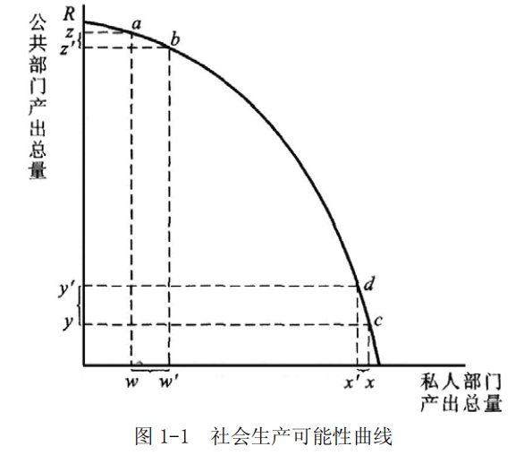
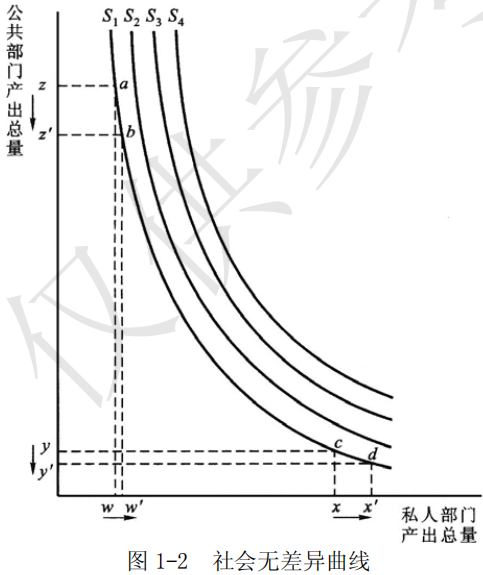
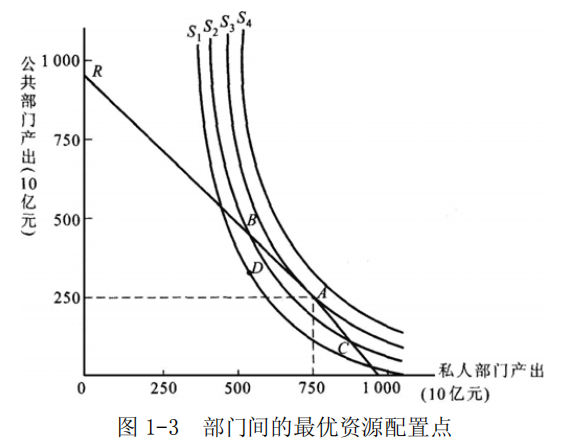

# 第 1 章 财政职能

> **本章核心问题**：市场经济已经用价格把大部分事情安排好了，为什么还需要政府收税花钱？财政到底该干哪些事——这些事为什么恰好是「市场干不了的」？以及最尖锐的一问：政府介入之后，谁来纠正政府的失灵？

## 本章脉络

本章是全书的总纲，它要回答的问题在财政学史上恰好对应两次立场相反的胜利。第一次是市场失灵概念的胜利。亚当·斯密 1776 年给国家规定的任务还只有国防、司法与少量公共工程（《国富论》第五篇），此后一百多年，「小政府、窄财政」是主流共识。转折发生在 19 世纪末到 20 世纪中叶：庇古 1920 年《福利经济学》把外部性写成了正式理论，证明价格机制会在污染、公共物品这类场合给出错误的信号；大萧条又让「经济总量可以长期失衡」成为无法否认的事实。到马斯格雷夫 1959 年出版《财政学理论》，财政不再只是「给国家筹钱的会计」，而被明确赋予三项职能——资源配置、收入分配、经济稳定。中国教材在此基础上加了第四项「经济发展职能」，这个 addition 不是点缀：对发展中国家而言，财政支出结构本身就是产业政策与增长战略的一部分，稳定与发展需要分开表述。第二次是公共选择理论的胜利。前一次胜利把政府请上了台，但 1960 年代起，以布坎南、塔洛克为代表的公共选择学派追问：凭什么假设上台之后的政府一定按公共利益行事？政治家、官僚、选民、利益集团，个个都在约束条件下追求自身利益。这一追问的源头其实可以追溯到维克塞尔 1896 年的博士论文传统——他坚持「好财政规则必须先经得起一致同意的检验」，布坎南把它发展成完整的研究纲领，并于 1986 年获诺贝尔经济学奖。所以本章的内部顺序是刻意安排的：先用四个概念（免费搭车、投票规则、寻租、政府失灵）搭起「市场为什么缺不了政府、政府为什么靠不住」的双重追问，再借「社会公共需要」与「财政职能」给出正面回答，最后用两部门无差异分析把「政府与市场的边界」变成一张可画的几何图。政府的必要性来自市场失灵，政府的边界来自政府失灵——两句话合起来，才是现代财政学的完整出发点。

## 核心概念

### 免费搭车行为

免费搭车行为是指不承担任何成本而消费或使用公共物品的行为；有这种行为的人，即具有让别人付钱而自己享受公共物品收益动机的人，称为免费搭车者。免费搭车现象缘于公共物品生产和消费的非排他性与非竞争性，其后果往往是公共物品供应不足。

这个概念之所以必要，是因为它揭示了市场价格机制的一个盲区：价格之所以能引导资源流动，前提是「不付钱就拿不到货」——排他性。而公共物品恰恰做不到这一点。国防是最极端的例子：一支军队保护的是国境线内的所有人，多保护一个人不增加任何成本（非竞争性），也无法把某个拒缴者单独排除在保护之外（非排他性），于是每个理性人都会等着别人出钱，自己白享收益。萨缪尔森 1954 年《公共支出的纯理论》把这个特性写成正式模型，结论是分散定价无法让公共物品达到有效供给水平；奥尔森 1965 年《集体行动的逻辑》补上了行为层面的一环：群体越大，单个成员的贡献占比越小，「没人出力、人人受益」的僵局越顽固——小区楼道的灯泡坏几年没人换、公海的鱼被过度捕捞、公共广播靠少数捐赠者支撑，都是同一机制的日常版本。由此得出财政学的关键推论：这类物品只能靠强制的、普遍的资金来源（税收）由政府提供。但要注意概念的适用边界——非排他性可以随技术改变：有线电视出现后，「电视信号」从公共物品变成了可排他的收费品，收费公路与可寻址收费把道路、广播的排他成本降了下来；「政府提供」也不等于「政府生产」（国防由政府提供，装备却由企业制造）。把免费搭车当成一切场合的万能理由，会同时误判技术与制度的可能性。

### 投票规则

投票规则是通过投票进行集体决策的一种公共选择程序规则，有两类：一致同意规则与多数票规则。一致同意规则是指一项政策或议案须经全体投票人一致赞同才能通过，这是最符合公共利益要求的规则——能全票通过的议案不可能让任何人受损——但其实质是一票否决制，决策成本极高，现实中很难实施；多数票规则是指一项政策或议案须经半数以上投票人赞同才能通过，又分为简单多数票规则与比例多数票规则（如超过 2/3 或 3/4），它决策成本低，却可能导致循环投票，且不能反映个人偏好的强度。

为什么公共财政非要依赖投票，而市场价格不够用？因为公共物品没有「一物一价」的决策通道：你不能只买国防中的防空部分而不为陆军付款。所以公共决策必须把千差万别的个人偏好压缩成一个统一的选择，投票就是这个压缩器。而压缩必然丢失信息，两类规则各自丢失的方式值得看清。一致同意规则最早由维克塞尔 1896 年作为「公正税收」的判准提出，布坎南与塔洛克 1962 年《同意的计算》又给它一个精确的经济学解读：一致同意把「外部成本」（别人替你做主让你受损的可能）压到零，但决策成本随人数急剧上升——联合国安理会五个常任理事国的一票否决，代价是任何实质行动都可能瘫痪。多数票规则是日常现实（议会表决、村委会决议），它的两个毛病在本章可以推演出来。其一是循环投票（孔多塞 1785 年就发现的悖论）：三人三种偏好——甲排序为公园、海边、山里，乙为海边、山里、公园，丙为山里、公园、海边——两两表决时公园胜海边、海边胜山里、山里又胜公园，多数决没有一个确定的答案。更麻烦的是议程操纵：既然结果随表决顺序循环，谁有权决定先表决哪一对，谁就实际上决定结果——阿罗 1951 年的不可能定理把这推到尽头：任何满足几条基本公平要求的投票规则都必然在某些偏好组合下自相矛盾。其二是偏好强度不可见：无论你多强烈地反对，你只有一张票。作为补充，中位投票人定理（布莱克 1948 年证明、唐斯 1957 年《民主的经济理论》推广）指出多数决下最终胜出的是中位选民的偏好——这解释了为什么政党纲领总是向中间靠拢，也预示了第 2 章「财政支出偏向中位收入者关心的项目」的分配后果。现实制度是在两类规则之间找折中：修宪用 2/3 多数、欧盟理事会用「55% 成员国加 65% 人口」的双重比例多数，都是既想避开一票否决的瘫痪、又想抬高通过门槛保护少数的设计。

### 寻租行为

寻租行为是指通过游说政府等活动获得某种垄断权或特许权，以赚取超常利润或租金的行为。政府的某些干预形式——颁发许可证、授权书、批文、特许经营等——为寻租行为的产生创造了条件。寻租行为越多，社会资源的浪费就越大。

「租」这个词本是古典经济学的遗产：李嘉图的地租理论里，租是土地这种供给不变要素的报酬，与劳动和资本的所得性质完全不同。寻租理论把这个词一般化了——凡是不经由生产与交换、而是靠人为稀缺赚到的超额利润，都是租。它尖锐的地方在于一个会计事实：企业家花在改进产品上的每一小时创造新价值，花在拿到批文上的每一小时只是把别人的价值转移给自己，而且被转移的往往少于消耗的——游说成本、疏通成本、维持关系的成本全部沉没，社会净损失为正。塔洛克 1967 年分析垄断与关税的福利成本时第一次算出这笔账（垄断的社会成本远大于三角形无谓损失，因为争夺垄断地位的资源投入也该算进去），克鲁格 1974 年研究外贸管制的论文直接发明了 rent-seeking 这个词。现实中最典型的场景是牌照与许可：出租车牌照把行业准入变成人为稀缺，牌照价格可以炒到天价，而这张纸对乘客没有任何直接好处；印度独立后的「许可证统治」（License Raj）把工业投资的每一步都变成审批，一代人的企业家才能耗在了排队与打点上。中国 2001 年启动行政审批制度改革、2015 年起推行「放管服」改革、2018 年全面实施市场准入负面清单制度，其理论根据正在这里：政府每多造一种准入限制，就多造一块潜在租金，寻租与腐败的资源消耗随之而来。需要区分的是，并非一切许可都是寻租温床——安全、环保、金融审慎等领域的准入有其正当理由；寻租批判针对的是那种以稀缺换租金、而非以外部性为据的管制。

### 政府失灵

政府失灵是指政府的活动或干预措施缺乏效率，或者说，政府作出了降低经济效率的决策、或不能实施改善经济效率的政策。主要表现在五方面：

- 短缺与过剩。若政府把价格固定在非均衡水平上，不是产生短缺就是产生过剩——限价过低导致买不到（如房租管制下的房源萎缩），限价过高导致卖不掉。
- 信息不足。政府不一定知道其政策的全部成本和收益，也不十分清楚政策的后果，难以进行政策评价。哈耶克 1945 年指出，分散在无数市场参与者手中的局部知识，本来就无法被任何一个中央机构完整汇集。
- 官僚主义。政府决策过程可能高度僵化，存在大量重复劳动与繁文缛节。
- 缺乏市场激励。政府干预消除或冲抵了市场力量，也就可能消除了某些有益的激励——科尔奈在分析社会主义短缺经济时提出的「软预算约束」（1980 年《短缺经济学》）是极端版本：亏损由财政兜底的单位没有节约成本的理由；政府部门「节约了预算明年反而被砍」是同一逻辑的温和版本。
- 政府政策频繁变化。政策措施变动太频繁，企业难以规划生产经营活动，经济效率蒙受损失。

这个概念的功能是给上一句话配平。市场失灵证明了政府介入的必要，但「必要」不等于「介入就更好」——纠正市场失灵的手术本身有失败率。把市场失灵与政府失灵并列，财政学的问题就从「要不要政府」变成了「什么该给政府、什么不该、怎么给」：只有当政府纠错的预期收益超过其自身的失灵成本时，干预才站得住。这一框架也解释了 1980 年代以来全球性的私有化、放松管制与政府再造浪潮：不是重返自由放任，而是在每一项具体职能上做市场与政府的成本收益比较。

## 问题与分析

### 社会公共需要「公共」在哪里？——五个特征及其来历

社会公共需要是相对于私人个别需要而言的，指向社会提供安全、秩序、公民基本权利和经济发展条件等方面的需要。它包括政府执行职能及某些社会职能的需要，如国防、文教、卫生、生态环境保护，以及基础设施、基础产业和支柱产业、风险产业的投资；广义上还包括为调节市场经济运行而采取的各种措施。它有五个特征：

- 非加总性。社会公共需要是社会公众在生产、生活和工作中的共同需要，不是个人需要或个别需要的数学加总。
- 无差异性。为满足社会公共需要而提供的公共物品，可以无差别地由每个社会成员共同享用，一个或一些社会成员的享用并不排斥其他成员。
- 代价的非对称性。社会成员享用公共物品无需付出代价，或只支付与提供成本不对称的少量费用。
- 外部性。公共物品一般具有外部效应——一个消费者的消费行为或生产者的生产行为给他人带来利益或损失，并因此导致公共物品供给的过度或不足。
- 社会剩余产品性。满足社会公共需要的物质手段只能来自社会产品的剩余部分；若剩余产品表现为价值形态，就只能是对「M」部分的抽取。

五个特征各有它要排除的误解。「非加总性」排除的是把公共需要理解成个人需要简单相加的算法——全国人民需要的国防，不是每人一把枪的总和，它是「作为一个整体的社会」才产生的需要，这决定了它只能通过政治程序表达，而不能通过市场加总（这正是投票规则那一节存在的原因）。「无差异性」与「代价的非对称性」说的是同一种产品关系：你家的苹果吃掉就没了，路灯却照你也照邻居；亿万富翁与低收入者享受同一条国防防线，而他们为此支付的成本（税收）与其享用的收益并不成比例——市场里「一分钱一分货」的对应关系在这里整体失效。「外部性」把上面几点连到经济分析：公共物品的收益外溢给未付费者，供给者收不回成本，于是供给不足；反之负外部性产品会供给过度。「社会剩余产品性」则是一条来自马克思再生产公式的硬约束——社会总产品必须先补偿生产资料耗费（C）与劳动力再生产（V），剩下的 M 才可能拿去供养军队、学校与政府本身；它提醒一个朴素的道理：财政收入规模的上限不由政府的主观愿望决定，而由生产率的剩余决定，这也是后面讲税收原则与财政规模时反复出现的底线。

### 政府财政到底该干哪些事？——四项职能的划分与它们的理由

财政职能是指财政作为一个经济范畴所固有的功能。在社会主义市场经济条件下，财政职能可概括为四个方面：

- 资源配置职能。政府主要通过税收动员社会资源，通过财政支出提供公共物品，实现经济资源的合理流动和配置。
- 收入分配职能。政府通过对不同收入阶层征税或不征税、多征税或少征税，并从事增加低收入阶层收入的支出项目，矫正市场活动产生的收入分配状况。
- 经济稳定职能。政府在失业和经济萧条时期实行赤字财政，在充分就业和通货膨胀压力很大时期实行盈余财政，熨平经济波动。
- 经济发展职能。政府主要通过税收优惠政策、调整支出结构，以经济增长为核心、以结构调整为重点，促进社会经济持续发展。

这四项不是随手罗列，而是与四类市场失灵一一对应的：资源错配对应公共物品与外部性（所以配置职能的对象是「市场不提供的东西」）；分配恶化对应市场按要素禀赋分配、不问公平的结果；经济波动对应总量失衡——价格机制能调节相对价格，却不能保证总需求恰好等于总供给（凯恩斯 1936 年的诊断）；发展缺口对应发展中国家特有的结构性问题——基础产业投资周期长、外部性大，市场自发配置会系统性低估。这个四分法有明确的家谱：马斯格雷夫 1959 年提出的是前三项，第四项是中国财政学界针对发展中国家的现实追加的——理由是，对发达国家而言「发展」大多被包含在稳定政策里，而对中国这样的经济体，财政支出结构（教育、科研、基础设施的比重）本身就是增长叙事的主角。理解职能划分还要注意它的反面含义：四项职能之外的一切，原则上都应留给市场。「财政不做什么」同样是职能理论的内容，而且是最容易被遗忘的一半。

### 政府机构为什么运转无效率？——竞争与激励的双重缺失

公共选择理论认为，政府机构运转无效率的原因主要有缺乏竞争、缺乏降低成本的激励两个方面。

- 缺乏竞争导致的无效率。其一，政府工作人员之间缺乏竞争：大部分官员和一般工作人员是逐级任命和招聘的，且「避免错误或失误」成为行为准则，没有人像竞争性企业里的员工那样承受效率压力。其二，政府部门之间缺乏竞争：各部门提供的服务是特定的，既无法直接评估部门内部的行为效率，也难以设计出让部门之间相互竞争的机制——你没法「选择不去民政局办事而改用另一家」。
- 缺乏降低成本的激励导致的无效率。客观上，政府部门的活动大多不计成本，即使计算也很难准确，加上政府机构内在的扩张冲动，往往出现公共物品的过度提供，造成资源浪费；主观上，各部门对其提供的服务一般具有垄断地位，没有提高质量的激励，甚至可以利用垄断地位隐瞒真实成本信息，使外部监督难以进行。

这段分析的分量在于它与尼斯坎南 1971 年官僚预算最大化模型的呼应：官僚的效用（薪金、声望、管辖范围）随预算增长，而预算审批所需要的信息恰恰握在官僚自己手里——于是政府规模有一种自我膨胀的倾向，「花钱证明存在」的循环很难靠内部监督打破。私企员工的「干不好被辞退」与政府部门的「编制内稳定」、企业「节约成本有分成」与部门「今年结余明年核减」，对比之下两条机制（竞争、激励）的缺失就不再是抽象论断。但要补一句公道话：这套诊断描述的是无问责机制下的政府，而非一切政府。绩效预算、信息公开、公共服务外包、独立评估机构，都是围绕重建竞争与激励的制度实验；它们的成效参差，恰好说明问题不是「政府天然低效」一句话能了结的，而是「如何让不通过市场检验的组织也有成本意识」这个治理难题。

## 综合论述

### 整个社会的资源，多少给政府、多少给市场？——两部门最优配置的无差异分析

整个社会可分为政府部门（公共部门）与市场部门（私人部门）。在社会经济资源既定且稀缺的情况下，两大部门各自配置多少资源，不仅关系到政府经济活动的界限，还关系到整个社会的资源配置效率。在社会成员的偏好格局与有效需求既定时，两大部门间的资源配置可能存在某种最优组合。用无差异分析方法分析如下。

**（1）社会生产可能性曲线**

图 1-1 中，R 代表整个社会的生产可能性曲线，它把私人物品与公共物品生产之间的边际转换率同该社会可利用的稀缺生产性资源联系在一起：它表明在既定时点上，该社会数量与质量都有限的土地、劳动和资本得到充分利用时，所能生产出来的私人物品与公共物品的各种组合。曲线位置越高，社会的生产潜能越大。

**（2）社会无差异曲线**

图 1-2 中，每一条社会无差异曲线 S1、S2、S3、S4 都代表一定的满足水平，表明社会对私人物品与公共物品消费的边际替代率；位置越高的曲线代表的社会福利水平越高。

**（3）部门间的最优资源配置点**

把 R 与 S 放进同一坐标系（图 1-3），R 与 S3 相切于 A 点，即部门间最优资源配置：市场部门产出 7500 亿元、政府部门产出 2500 亿元（此为教材设例）。在 A 点，私人物品生产与公共物品生产的边际转换率等于社会消费的边际替代率，社会获得最大福利。

**（4）现实配置可以偏离最优点。** B 点资源过度配置到公共部门，C 点过度配置到私人部门，但 B、C 都在 R 上，代表资源已充分利用；D 点在 R 之内，表明资源利用不足。

**（5）配置会随时间变化。** 其一，最优配置不变而现实配置移动（如从最优点滑向非最优点，或相反）；其二，R 与 S 本身移动（资源数量质量变化推动 R，偏好或收入分配变化推动 S），形成新的最优配置点。

这张图的价值不在它的答案（7500 与 2500 只是教学数字），而在它把一个政治哲学问题翻译成了一道几何题。「政府与市场的边界」不再是口号之争，而是「边际转换率等于边际替代率」的切点条件——多一单位税收交给政府生产公共物品，与这单位资源留在市场生产私人物品，社会效用的边际评价恰好相等之处就是边界。它同时给出三种病的坐标：B 型病（政府过大，如计划经济把几乎全部资源划入公共部门）、C 型病（公共品欠账，如基础设施与公共服务长期落后）、D 型病（资源闲置，如严重失业）。任何一个经济体的财政规模争论，本质上都在问：我们此刻在哪一点，又该往哪边移。

### 政府为什么会失灵？——公共选择理论的完整诊断

政府失灵是指政府的活动或干预措施缺乏效率，或者说政府作出了降低经济效率的决策、或不能实施改善经济效率的政策。公共选择理论把原因归为三类：政府决策的无效率、政府机构运转的无效率、政府干预的无效率。

**（1）政府决策的无效率。** 公共选择理论用经济模型分析政治决策，指出民主程序不一定产生最优的政府效率。

- 投票规则的缺陷。多数票规则未必是有效的集体决策方法：其一，提案超过两个时会出现循环投票，表决没有最终结果；其二，为消除循环而规定投票程序，可「确定投票程序的权力恰恰是决定投票结果的权力」——议程操纵者决定结果；其三，多数票规则不能反映偏好强度，无论偏好多强烈，一人只能投一票。
- 政治市场行为主体的动机。政府由政治家与官员组成，而政治家的基本行为动机也是追求个人利益最大化（连任、权力、声望）。追求个人目标未必符合公共利益，广大选民的利益可能因此受损。
- 利益集团的存在。利益集团（压力集团）是有共同目标并试图影响公共政策的组织化团体。政府政策常在多个强大利益集团的相互作用下作出；它们通过竞选捐款、院外游说等手段左右议案与投票，使政府作出不利于公众的决策。

**（2）政府机构运转的无效率。** 表现在缺乏竞争与缺乏降低成本的激励两个方面，机制见上一节分析：工作人员之间与部门之间都缺乏竞争，客观上不计成本、主观上垄断服务又使质量改进与成本节约都失去动力。

**（3）政府干预的无效率。** 为确保社会经济秩序，政府必须制定和实施法律法规，但某些干预形式——颁发许可证、配额、执照、授权书、批文、特许经营证——同时为寻租行为创造了条件：制度人为制造稀缺，稀缺产生潜在租金，租金引来寻租，寻租消耗本可用于生产的社会资源。政府管得越多，人为稀缺越多，寻租的机会面越大。

把三类原因连起来读，公共选择理论的贡献是一个「人的连续性」假设：政治家、官僚、选民与企业里的人是同一种人，都在约束下趋利避害；区别不在动机的善恶，而在约束的结构——市场里追逐私利受竞争与价格纪律约束，政治过程里同样的私利面对的是软化的约束。因此「政府失灵」不是对政府的道德指控，而是对约束设计的工程学提问：什么样的规则（预算硬约束、任期与问责、决策程序透明、准入与管制的成本收益审查）能让政治过程里的人受到类似市场的纪律？这也是它继市场失灵理论之后，为「有限而有效的政府」提供的第二个理论支点。

## 局限与后续

本章的框架——市场失灵证明政府必要、政府失灵限定政府边界——是 20 世纪财政学最耐用的一对概念，但它自身经受了三轮重要的修正与批评。

第一轮针对「市场失灵」的规范性质。萨缪尔森 1954 年的模型证明了公共物品的分散供给无效率，但它假定存在一个知道所有人偏好的裁判；按这个标准衡量出的市场失败，未必保证现实政府能做得更好——这就是「涅槃谬误」的批评（德姆塞茨等人对标准竞争模型批判的推广）：拿理想状态去比现实制度，永远会得出「干预」的结论，而干预本身也是现实制度。校准的方法是把真实可行的制度与真实可行的替代制度比较，这一原则后来成为制度比较分析（比较制度经济学）的起点。

第二轮针对公共选择学派自身的偏颇。把政治家与官僚一律建模为自利最大化者，同样是以偏概全：北欧国家的财政质量、东亚发展型国家（日本通产省、韩国计划部门）的产业政策绩效，都难以塞进「官僚必然无效率」的模型。修正的方向是把「政府质量」内生化——制度与约束的差异决定同一动机产生不同结果；阿西莫格鲁与罗宾逊 2012 年《国家为什么失败》把「包容性制度与攫取性制度」的对照推为解释框架，本质上是对布坎南问题（规则优先于在规则下的选择）的历史学延伸。

第三轮来自证据方法与行为科学的改造。传统职能理论说「政府应提供公共物品」，却很少回答「花多少钱、什么项目才真的有效」。1990 年代起，发展经济学把随机对照实验引入公共项目评估（班纳吉、迪弗洛、克雷默，2019 年诺贝尔奖），让「财政支出的边际效用」第一次可以按项目逐一测量；行为经济学则指出真实选民既非全然理性也非全然自私，「助推」（塞勒与桑斯坦，2008）展示了低成本地改善公共政策的可能——行为公共经济学由此成为增长最快的分支。对中国而言，这条线索的现实版本是预算绩效管理改革（2018 年《关于全面实施预算绩效管理的意见》）与财政事权和支出责任划分改革：本书后面各章讲的支出、税收、国债、预算，都是在这一总体框架下展开的具体机制。
