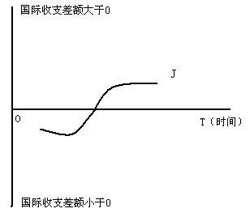

# 第 5 章 国际收支分析

> **本章核心问题**：一国对外经济往来的总账怎么记？账面上的「顺差」「逆差」到底意味着什么？出现失衡时，贬值、紧缩、管制哪条路走得通、代价是什么？

## 本章脉络

国际收支调节理论的历史是一部「每一代理论统治一代人」的接力史。价格-铸币流动机制（休谟 1752）是金本位时代的答案：贸易顺差使金银流入、物价上涨、竞争力下降，失衡自动回摆——调节全部经由价格，政府无须作为。金本位崩溃后自动机制失灵，二十世纪三十年代的弹性分析法应运而生：罗宾逊 1937 年把马歇尔的弹性工具引入外汇市场，系统化出「进出口需求弹性之和大于 1 贬值才能改善收支」的马歇尔-勒纳条件，调节的责任落在汇率上。第二次世界大战后凯恩斯宏观盛行，亚历山大 1952 年的吸收分析法把国际收支改写为国民收入恒等式的一部分——逆差即国内吸收超过产出，调节手段从「调价格」扩展为「调收入与吸收」（需求管理）。1960 年代货币主义复兴，蒙代尔与约翰逊的国际收支货币分析法宣称：国际收支顺逆差本质是国内货币供给与货币需求的失衡，逆差是「货币过多的溢出」，控制国内信贷才是治本。三代理论不是彼此取代而是层层补充：弹性法看局部价格，吸收法看总体需求，货币法看货币存量，本章按此逻辑展开。与理论并行的是统计口径的制度化：IMF 自 1948 年起发布《国际收支手册》（BPM），1993 年的第五版与 2009 年的第六版（BPM6）划定了今天各国国际收支平衡表的标准格式——读懂概念部分的概念，须记得它们都嵌在这套手册的框架里。

## 核心概念

### 国际收支

国际收支的概念有狭义和广义之分。狭义的国际收支指一国在一定时期（一般为一年）内，同其他国家由于贸易、劳务、资本等往来而引起的资产转移，其特点是仅计入现在或将来有外汇收支的交易。广义的国际收支指在特定时期内，一个经济体与世界其他地方的各项经济交易，包括货物、服务与收入交易；金融资产和负债交易；无偿转让（一方向另一方无偿提供的实物和金融资产）。如今各经济体使用的基本上是广义概念。

从狭义到广义的演变本身是理解这个概念的钥匙：狭义定义流行于外汇管制普遍、国际交易几乎必然伴随外汇结算的年代，「有没有外汇进出」就是记账边界；战后资本流动、易货贸易、无偿援助等不即时结汇的交易规模日增，若仍以「外汇收支」为界，账本将严重失真——IMF 的手册因此把边界改为「经济交易」本身（居民与非居民之间的一切交易），无论是否涉及外汇。注意两个易混点：其一，国际收支是「流量」不是「存量」——它记录一段时期内的交易，与「国际借贷」（某时点的对外债权债务存量）相对，正如利润表之于资产负债表；其二，「居民」按居住地而非国籍划分——外资在华子公司的贸易是中国的国际收支，中国公司海外子公司的贸易不是。

### 贷方与借方项目

贷方项目是指在国际收支平衡表中表示一国资产减少或负债增加的项目，意味着本国商品、劳务的输出或外国金融资产的流入。借方项目表示一国资产增加或负债减少，意味着本国商品、劳务的进口或外国金融资产的流出。

复式记账是读表的基本功：每笔交易同时记入两个方向——出口一批货物，货物账户记贷方（输出商品），同时按对方付款方式记入外汇资产增加（借方）或对方负债增加（贷方）。因此整个平衡表在会计意义上永远平衡（「有借必有贷，借贷必相等」的国际版），所谓「顺差」「逆差」从来不是全表的不平衡，而是人为划定的「线上项目」（如经常账户）与「线下项目」（融资手段）之间的不平衡——划线位置的选择是分析立场的选择（看贸易竞争用经常账户，看资金流动用综合差额）。快速判断方向的口诀：凡引起本国外汇收入的记贷方（出口、外国人买本国股票），凡引起外汇支出的记借方（进口、本国买外国债券）。

### 官方储备

官方储备是指一个国家的中央银行或其他官方货币机构所掌握的外币储备资产及其对外债权，包括货币性黄金、外汇、在 IMF 的特别提款权（SDR）及普通提款权（储备头寸）。

官方储备在表中的角色是「结算项目」：当私人部门的交易净额不平衡时，差额最终由官方储备的增减吸收——顺差积累储备、逆差消耗储备。四类资产的可比性各有讲究：外汇储备占绝对大头但承担汇率与信用风险（储备货币贬值即账面缩水）；黄金按市场价值重估、波动剧烈；SDR 是 IMF 创设的记账单位（2016 年起定值为美元、欧元、人民币、日元、英镑五货币篮子，人民币 2016 年入篮），不能直接用于私人交易，只能通过 IMF 安排的兑换使用；储备头寸则是成员在 IMF 的「活期存款」性质的提款权利。储备规模的适度性问题（多少才算够）在本章问题与分析部分展开。

## 问题与分析

### J 曲线效应：货币贬值为什么先恶化后改善收支？

J 曲线效应是指货币贬值后先使贸易差额恶化、经过一段时间后才使贸易差额改善的现象——贬值对国际收支先降后升的动态轨迹形如字母 J。

如图 5-1 所示，由于时滞效应，进出口对贬值引起的相对价格变化反应缓慢：贬值后短期内以外币计的出口收入反而减少（出口量尚未增加而折价已发生），以本币计的进口支出立即上升（进口量尚未压缩而价格已涨），贸易收支因此先恶化。经过一段时间，当贸易数量对价格变动的调整完成——出口上升、进口受到抑制，出口收入的增加超过贬值引起的外汇收入减少时，贸易收支才逐渐改善。时滞的微观结构可拆为四段：认识滞后（买卖双方察觉价格变化需要时间）、决策滞后（重签合同、更换供应商）、交货滞后（订单到交付的周期）、替代滞后（生产调整与消费习惯转换），其经验长度约六个月至一年（马吉 1973 年的系统研究）。1967 年英镑贬值 14% 后贸易收支先恶化约一年再改善，是 J 曲线的经典实证；1985 年广场协议后日元大幅升值、日本顺差不降反升（时滞加「J 曲线反向」效应），则是升值方向的同构案例。

应对措施有三条：其一，贬值国须有充足的外汇储备以渡过时滞期，避免在收支恶化的谷底被迫二次贬值或求助外部救助；其二，加强信息传递，及时向进出口企业披露汇率与市场信息，压缩认识与决策滞后的长度；其三，对出口企业实行税收优惠等激励，缩短替代滞后、加快供给调整。

### 本币对外贬值影响进出口的机制与条件

**（1）促进出口的机制**：贸易逆差时本币法定贬值，本国出口商品以外币计的价格下降，有利于扩大出口：

$$贸易逆差→本币对外贬值→本国出口价格下降→出口量上升→国际收支改善$$

**（2）抑制进口的机制**：贬值使进口商品以本币计的价格上升，高价限制消费，有利于压缩进口：

$$贸易逆差→本币对外贬值→本国进口价格上升→进口量下降→国际收支改善$$

一增一减双向作用，出口扩大、进口受压，国际收支改善。

**（3）生效的限制条件**：对方不报复（竞相贬值将互相抵消，1930 年代的货币战是反面教材）；本币对外贬值要快于对内贬值（若国内通胀把成本优势吞掉，贬值归于无效）；满足马歇尔-勒纳条件——出口需求价格弹性与进口需求价格弹性之和的绝对值大于 1，即进出口对价格变化的反应足够敏感（弹性不足时贬值反而恶化收支，因为量的调整跟不上价的折损）。此外贬值存在 J 曲线效应；且在多数情况下，贬值会使一国贸易条件趋于恶化（同量出口换回更少进口），只有需求弹性大于供给弹性时贸易条件才会改善——「贬值调收支」从来不是免费的。

### 吸收分析法的推导与政策含义

**符号**：$Y$ 国民收入，$C$ 消费，$I$ 投资，$G$ 政府支出，$X$ 出口，$M$ 进口，$BOP$ 国际收支差额，$A$ 吸收（国内总需求）。

**推导**：从开放经济国民收入恒等式出发

$$Y = C + I + G + (X - M)$$

移项得 $X - M = Y - (C + I + G)$。令 $BOP = X - M$（不考虑资本流动与转移支付），$A = C + I + G$，即得吸收法核心公式：

$$BOP = Y - A$$

**含义**：国际收支差额等于国民收入减国内吸收。$Y > A$（产出超过国内需求）则盈余——多余产出只能出口；$Y < A$ 则逆差——超出的需求只能靠进口弥补。收支失衡被重新表述为总量失衡：逆差不是「贸易问题」，是「花得比产得多」的宏观问题。

**政策含义**：两条调整路径对应两种情形。调整收入 $Y$：将闲置资源重新配置到出口部门、提高生产力——适用于存在闲置资源的经济，但结构调整有较长时滞。调整吸收 $A$：紧缩（逆差时压缩消费投资与政府开支）或扩张（顺差时）的财政货币政策——见效快，但压吸收往往连带压产出（失业、增长下降），且未触及「进口生产设备提高生产力与短期收支恶化」的矛盾。亚历山大 1952 年提出该框架时还给出贬值的吸收解释：贬值改善收支的途径不只是相对价格（弹性法所强调），还在于贬值对收入与吸收的再分配效应——这是对弹性法的直接扬弃。吸收法与宏观经济政策结合紧密，但它偏重商品市场、忽视货币因素，也不考虑资本流动，适合分析无资本流动情形下的需求管理型调节。

### 经常账户的基本内容

按 IMF 口径，经常账户包括货物、服务、收入和经常转移四项。货物：一般货物、用于加工的货物、货物修理、各种运输工具在港口购买的货物、非货币黄金（作为储藏手段持有的黄金）。服务：运输（海运、空运及其他）、旅游（因公与因私）、通讯、建筑、保险、金融、计算机和信息服务、专有权使用费和特许费（版权等）、其他商业服务（转手买卖及与贸易有关的服务、经营性租赁、其他商业专业技术服务）、个人文化娱乐服务及别处未涵盖的政府服务。收入：职工收入（职工报酬）与投资收入（直接投资、证券投资和其他投资形成的收益）两个子项。经常转移：各级政府转移与其他部门转移（如侨汇、工人汇款）。口径提示：1993 年第五版《国际收支手册》用「收入」一词，2009 年第六版已改称「初次收入」并把经常转移改称「二次收入」，各经济体已按 BPM6 编表——读旧表新表须先对口径。

## 综合论述

### 国际收支状况反映的经济含义

**（1）反映一国经济实力与世界经济地位。** 从交易规模看，经济规模巨大、对外交流量大的经济体在国际经济中的地位自然较高；流量有限的经济体调整余地小，容易陷入困境。从顺逆差角度，持续较大顺差通常被视为竞争力较强的信号，持续逆差则被解读为经济存在问题——但这一解读要看顺逆差的构成：靠竞争性出口挣来的顺差与靠大量举债（借入资金流入）形成的顺差，可持续性天差地别，后者意味着未来还本付息的负担与汇价波动的隐患。

**（2）决定一国货币与汇率的变化。** 逆差时外汇需求大于供给、本币供大于求，本币汇率趋降；顺差则相反。分析时格外要重视顺逆差的「成因结构」：基于竞争力和经常盈余的汇率有基本面的支撑，基于短期资本流入的「强币」随时可能逆转——1997 年前后的东南亚各国汇率正是后一种情形。

**（3）决定一国的融资能力与资信地位。** 国际资本市场上的借贷能力与偿还能力成正比，而偿还能力取决于经常账户、资本与金融账户及官方储备状况：两账户有较大盈余者借款容易、渠道多、资信高；反之则告贷困难，极端情形下陷入完全的融资断供——主权债务危机中的市场排斥就是这种状态。

**（4）反映经济结构的情况与变化。** 一国对外交易的内容（有形产出为主还是无形产出为主）显示其经济结构；无形产出（服务与投资收益）在交易中比重的持续上升，反映着国际经济结构的服务化与金融化趋势。

**（5）影响国内经济增长与发展。** 产出输出使国内资源流出、市场供给下降，换回的外汇增加国内货币供给，可能加大物价上涨压力，同时刺激经济扩张；大量输入产出则效果相反。「出口是输出失业、进口是输入失业」的说法由此而来，但实际效果取决于边际进口倾向：倾向越大，出口的外贸乘数效应越小。此外，长短期资本的大进大出是当代国际收支中绝不能忽视的部分——资本流动给经济体带来的利益与风险（流动性便利与突然停摆）并存，对引进国际资本的认识因此须更加全面。

### 国际收支失衡的调整

国际收支失衡是指经常账户的余额无法由资本与金融账户的余额平衡、不得不动用外汇储备资产进行调整的状态——对外经济出现了必须调节的问题。调节理论主要有三代，各有适用边界。

**（1）弹性法。** 在局部均衡框架内，利用本币对外汇率的变化调整进出口的相对价格：逆差时使本币贬值，出口的外币价下降促出口上升、进口的本币价上升压进口。发挥作用的条件：对方不报复；本币对外贬值快于对内贬值（通胀）；满足马歇尔-勒纳条件（进出口需求弹性之和的绝对值大于 1）。弹性法存在 J 曲线效应；多数情况下贬值使贸易条件恶化，只有需求弹性大于供给弹性时才改善。方法本身与国民收入结合不好——属局部均衡分析，看不到贬值通过收入渠道的反馈。

**（2）吸收法。** 凯恩斯宏观框架内的分析（推导见问题与分析），核心是 $BOP = Y - A$：或调收入（资源重新配置、提高总产力，须有闲置资源），或调吸收（逆差时压缩消费投资与政府开支）。与宏观经济政策结合较好，但压缩吸收涉及产出与就业的代价、进口生产设备提高生产力与短期收支的矛盾，以及时滞问题；理论和政策上忽视了货币在调节中的作用。

**（3）货币法。** 核心思想：国际收支本质上是货币现象，国内货币供给由国内信贷与国际储备两部分构成（$MS = DC + R$），储备的变动（即国际收支的变动）等于货币需求超过国内信贷创造的部分——信贷发行超过货币需求则储备外流、收支恶化；控制信贷发行与出售储备资产是调节的两大途径。货币法把三代理论中最深层的问题摆上台面：逆差不是贸易部门的病，而是货币部门的病——压信贷治本，但副作用是增长放缓与就业承压（紧缩的代价）。1970 年代它一度成为 IMF 项目贷款的标准药方（「紧缩换救助」），其增长代价正是此后历次危机中「紧缩与增长能否兼得」争论的源头。

除理论方法外，实际运行中还有两类直接调节工具。外汇管制：政府以法令对国际结算与外汇买卖实行管制（出口所得按官价售给指定银行、进口用汇须经批准、本币出入境与个人用汇受限），目的在于集中使用外汇、控制进口、维持收支平衡与汇率稳定——见效直接，但以扭曲资源配置与滋生黑市为代价，长期实行的国家趋于减少。其他政策措施：自动出口限制、进口押汇、进口许可与审批、卫生检疫制度、进口垄断、歧视性采购与税收等（从贸易角度鼓励出口、限制进口）；优惠政策吸引外资流入（从资本金融项目入手平衡收支）；以及超贸易保护主义等非常规手段。工具箱越全，越要注意组合使用的代价核算——每一件工具都在用某种国内扭曲换取对外平衡。

## 局限与后续

本章三代调节理论在当代共同面对一个「资本流动第一」的世界。第一，**金融账户已成为收支变动的主体**：全球外汇日交易量数倍于全年贸易额（以 BIS 三年一度调查为准），汇率的日常波动由资产交易而非贸易流量决定——1990 年代以来两次大危机（1997 亚洲、2008 全球）的收支失衡都是资本账户事件，弹性法与吸收法的「贸易视角」只能解释其慢变量。第二，**全球失衡与「储蓄过剩」之争**：2000 年代美国经常账户逆差峰值占 GDP 约 6%，伯南克 2005 年把它归因于新兴市场的「全球储蓄过剩」——顺差国与逆差国谁该调整，从技术问题上升为国际宏观政策协调的政治问题；对顺差一方的中国而言，2005 年汇改、2008 年后再平衡与「双顺差」的终结（经常账户顺差占 GDP 之比从 2007 年约 10% 降至 2% 上下，以国家外汇管理局公布为准）是吸收法逻辑的一次现实重演：调吸收（扩内需）与调汇率并用。第三，**货币法在「资本自由流动」条件下的复活形态**是第一代货币危机模型（克鲁格曼 1979：信贷持续超发与固定汇率的组合必然以储备耗尽告终）——它与第 8 章的三元悖论共同构成理解当代货币危机（1994 墨西哥、1997 泰国、2018 土耳其）的理论底座。读表的习惯也须更新：BPM6 把「误差与遗漏」与「净误差遗漏占比」视为资本外逃的晴雨表，数据本身已成为监管对象——国际收支分析正在从「贸易经济学」变成「资产负债表经济学」。
