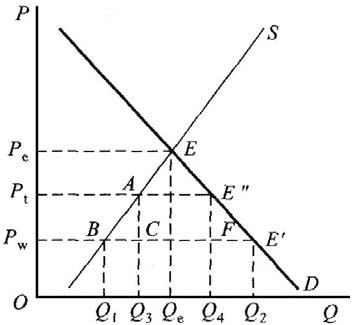
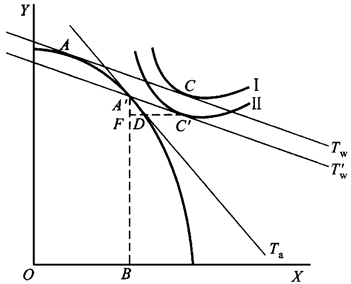
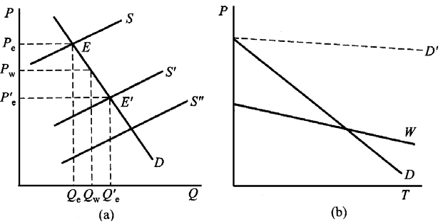
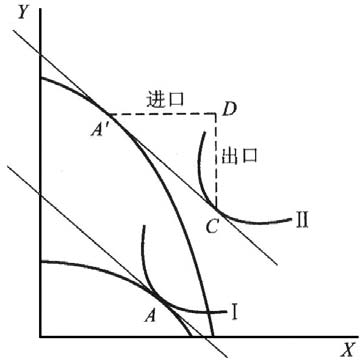

# 第 4 章 国际贸易政策分析

> **本章核心问题**：既然自由贸易互利，为什么几乎所有国家都在不同程度上搞保护？关税到底让谁受损、让谁受益？保护「幼稚产业」的理由经得起推敲吗？

## 本章脉络

自由贸易理论与保护贸易实践并存的格局，从理论诞生的第一天就开始了。斯密与李嘉图为自由贸易立论的同时，保护主义也在为自己找理论：美国首任财政部长汉密尔顿 1791 年的《制造业报告》针对新生的美国制造业主张关税保护——这是幼稚产业论的最早系统表述（比李斯特早半个世纪，对象是当时「相对落后」的美国）；德国历史学派的李斯特 1841 年《政治经济学的国民体系》把这个论点发展成体系，他以「国民经济学」对抗斯密的「世界主义经济学」，主张按发展阶段实行有梯度的保护，其直接受众是工业化前夜的德国。保护论点的经济学化由穆勒完成：1848 年他给出幼稚产业的判别条件（现在劣势、将来优势），巴斯塔布尔 1891 年加上成本-收益检验（将来利润的现值须能补偿当前保护成本），肯普 1964 年再区分内部与外部经济（外部经济的产业即使自身不赚钱也值得保护，因为它教会整个社会）。现代形式则是「边干边学」外部性（阿罗 1962）：学习效应只在干中产生，没有初始保护就永远干不起来——保护的正当性从「民族情感」变成了「市场失灵」。本章的技术核心是小国关税的局部与一般均衡福利分析：它用最简洁的几何证明保护的代价，也为评估任何贸易政策的福利后果提供了模板。

## 核心概念

### 关税壁垒与非关税壁垒

关税壁垒是指为保护本国市场、扶持本国产业发展，对进口商品征收关税（特别是高额关税）以限制进口的贸易措施。通过征收高额进口税提高进口商品成本、削弱其竞争力，起到保护国内生产与市场的作用。

非关税壁垒是「关税壁垒」的对称，指除关税以外的一切限制进口措施，分为直接与间接两大类：直接的非关税壁垒由进口国直接规定进口商品的数量或金额，如进口配额制、进口许可证制和「自动」出口限制；间接的非关税壁垒不直接规定数量金额，而是制定各种严格的条例间接影响进口，如进口押金制、最低限价制、海关估价制、繁杂苛刻的技术标准、卫生安全检验与包装标签要求等。

两类壁垒的经济学差别不止于形式。关税是「价格型」工具：它通过价格机制起作用，政府获得关税收入，保护成本以价格形式显性化，且受 WTO 约束需写进关税减让表、透明可谈判。非关税壁垒多数是「数量型」或「隐蔽型」工具：配额把租金交给了 whoever 拿到许可证（进口商或外国出口商——「自动」出口限制的租金干脆流向外国，如 1981 年美国对日本汽车的自愿出口限制使日本厂商转向高档车、单位利润反升）；技术标准与检验则隐身在「安全」「卫生」的名义下，测量与起诉都困难——正因为关税在 GATT/WTO 框架下被一轮轮削平，非关税壁垒才成为当代保护主义的主战场（以技术性贸易壁垒通报量计，已占全部贸易措施通报的大头，以 WTO 年度统计为准）。

### 倾销

倾销是指出口商以低于国内市场的价格、甚至低于成本的价格在国际市场销售商品的行为。倾销实质上是价格歧视的一种：厂商对不同市场的消费者制定不同价格以获取最大收益，只要某商品在国内与国际市场具有不同需求弹性，厂商就有倾销的动力。

倾销的发生需满足两个基本条件：市场是不完全竞争的，厂商是价格制定者而非接受者；市场相互分割，一国居民不能以低成本回购出口商品套取差价（否则两市场价格自动拉平，歧视无以为继）。按目的与持续时间分三种：偶发性倾销（处理积压或试销）、短期或间歇性倾销（打垮对手后再提价的掠夺性策略）、长期或连续性倾销（持续的价格歧视，多见于国内外市场弹性差异稳定的厂商）。倾销对进口国的危害：阻碍相关产业发展、扭曲市场秩序、威胁和抑制产业结构调整与新兴产业建立。需要补上制度一环：WTO 框架下的反倾销不是「反低价」而是有严格程序的三要件认定——倾销存在（出口价低于正常价值）、损害存在（对进口国产业造成实质损害或威胁）、因果关系成立——但实践中反倾销已被广泛用作战略性保护工具（各国对中国钢铁、光伏的大规模反倾销），其「防御工具变成进攻工具」的异化是当代贸易摩擦的核心议题之一。

### 幼稚产业

如果某种产业因技术不足、劳动生产率低下、成本高于世界市场而无法与国外产业竞争，但在关税、补贴等保护下继续生产一段时间后，能够在自由贸易条件下获利自立、形成比较优势并良性发展，这类产业就是幼稚产业。

定义中最关键的词是「能够」：保护的正当性完全取决于将来自立这个条件是否成立。穆勒标准检验「现在劣势、将来优势」（将来它能变强吗），巴斯塔布尔标准检验「值不值」（将来利润的现值能否补偿现在的保护成本——如果将来自立后赚的钱折现回来还填不平保护期间的损失，全社会倒贴就不划算），肯普标准则指出外部经济的关键作用：先行企业「学会的本领」如果会外溢给后来的模仿者（工人跳槽、技术扩散），先行者自己可能永远收不回学习成本，此时即便巴斯塔布尔检验通不过，社会仍值得补贴——因为受益的是整个产业而非先行者。三个标准层层递进，也层层暴露操作难度：将来优势需要预测，利润现值依赖贴现率，外部经济需要识别——「哪些产业是幼稚产业」这个问题在每一国的产业政策争论中都重新问一遍。

## 问题与分析

### 小国关税的福利分析：谁为关税买单？

小国是指在国际市场中只是价格接受者而非价格决定者的国家——它的进出口变化不影响世界价格。

**（1）局部均衡分析**

图 4-1 中 $P_e$ 与 $Q_e$ 是封闭条件下的均衡价格与产量，$P_w$ 是自由贸易价格，$P_t$ 是征收关税后的国内价格，$Q_1Q_2$ 为自由贸易下的进口量，$Q_3Q_4$ 为征税后的进口量。经济效应：保护效应 $Q_1Q_3$（国内生产在保护下增长，大小取决于供给弹性）；消费效应 $Q_2Q_4$（国内价格上升、需求收缩）；贸易效应为两者之和；税收效应为关税收入 $ACFE^{''}$；国际收支效应为进口下降带来的对外支付减少 $(Q_1Q_3+Q_2Q_4)\cdot OP_w$。

**（2）福利变化**

消费者剩余下降 $P_wP_tE^{''}E^{'}$，其去向构成保护的完整账本：$P_wP_tAB$ 转为生产者剩余（补贴了国内生产者），$Q_3Q_4\cdot P_wP_t$（即 $ACFE^{''}$）成为政府税收，剩余的 $ABC$ 与 $FE^{''}E^{'}$ 两块三角形无人获得——它们是无谓损失（生产扭曲与消费扭曲的代价）。结论：小国征收进口关税必然降低该国福利，且收入再分配的净流向是「消费者付账、生产者与政府收款」。

**（3）一般均衡分析**

对 X 产品征税后，生产点从 $A$ 移至 $A^{'}$（X 价格上升，资源转向 X），国家按国际价格交换、消费者按税后国内价格交换。如图 4-2 所示，征税前生产点 $A$、消费点 $C$；征税后生产点 $A^{'}$、消费点 $C^{'}$。$A^{'}F$ 的 Y 按国际价格本可换 $FC^{'}$ 的 X，因关税只能换 $FD$，$DC^{'}$ 即关税，福利水平（无差异曲线）下降。一般均衡视角补上了局部均衡看不到的一课：关税不仅扭曲被保护产品的市场，还通过资源再配置与实际交换条件的恶化波及整个经济。

这套几何在今天最好的实证注脚是美国 2018 年对华 301 关税：Amiti-Redding-Weinstein 与 Fajgelbaum 等人的研究一致发现，关税几乎完全传导到美国进口价格与消费者端，历史罕见的「本国消费者买单」的教科书案例；而 1930 年的斯莫特-霍利关税法（将两万余种商品的平均税率推高至历史峰值）引发各国报复、加剧 1930 年代世界贸易崩溃，则是关税一般均衡负外部性的历史注脚。

## 综合论述

### 幼稚产业论的基本内容与评价

**（1）基本内容**

具有潜在比较利益的产业处于幼稚状态时经过保护得以发展，将获得现实的比较利益并在自由市场中自立。判断标准有穆勒标准、巴斯塔布尔标准和肯普标准（见概念部分——三者的递进关系是：能否变强、值不值、外溢是否使私人收不回学习成本）。

**（2）局部均衡分析**

图 4-3（a）中幼稚产业初始供给曲线位置很高（成本高），在自由贸易的低国际价格下国内生产完全无法供应市场，需求全由进口满足；经有效保护，国内生产力提高、供给曲线右移——移到一定程度国内生产开始进入市场，与进口共同满足需求；继续右移则进口停止；生产能力再提高，该产业便可能进入出口行列。图 4-3（b）则表明成本递增型产业不能作为幼稚产业保护：若成本曲线与世界价格线的关系决定了国内成本永远降不到国际价格之下（需求曲线 $D$ 高于或贴合世界价格线的情形），保护就只有成本、没有前途。

**（3）一般均衡分析**

图 4-4 中 X 为劳动密集型产品、Y 为资本密集型产品。保护之前该国的比较利益在生产、出口 X；保护使生产可能性曲线扩张后，比较利益转换为生产、出口 Y，产业结构完成升级，保护目的达到。转换后生产点在 $A^{'}$、消费点在 C，该国出口 CD 的 Y、进口 $A^{'}D$ 的 X，福利因无差异曲线外移而提高。一般均衡图景与第 3 章的产品生命周期论相接：幼稚产业保护的宏观目标就是「把比较优势造出来」，使静态禀赋逻辑让位于动态积累逻辑。

**（4）政策含义与评价**

对相对落后国家而言，给予幼稚产业保护有其必要：在同样的游戏规则下各国生产力不同，过分的自由贸易可能固化落后国家的低端分工地位。但保护的目的在于使受保护者最终自立——幼稚产业保护不是保护落后。这条原则的历史成绩单两面都很有名：韩国 1970 年代对钢铁（浦项制铁建成时曾遭世界银行「无竞争力」的评估）、汽车与造船的重保护最终换来世界级产业，常被视为成功案例；而拉美的进口替代工业化在长期封闭保护下滋生高成本、低效率与寻租，1980 年代以债务危机收场，是失败的一面。两相对照的教训不是「保护行不行」，而是保护的设计：有无明确的退出时间表与绩效标准（韩国以出口业绩为补贴条件——干不好就撤）、保护的是「学习」还是「企业」（补贴与出口挂钩保护的是能力，与亏损挂钩保护的是惰性）、以及国内有无竞争（在受保护市场内部维持多家竞争，防止保护变成垄断的温床）。当代的对应物是中国的新能源汽车与光伏：产业政策与补贴争议不断，但两者都以国内惨烈竞争+全球出口扩张的方式完成了成本学习，说明「保护+竞争」的组合远比单纯筑墙有效。

## 局限与后续

保护理论的边界在三个方向上被当代研究重新刻画。其一，**保护的分配政治学**：Stolper-Samuelson 定理预言贸易损害稀缺要素所有者，Autor-Dorn-Hanson 等对「中国冲击」的研究证实了美国进口竞争地区的就业与工资损失集中而持久——自由贸易的总量收益是真的，但收益与损失在不同人群间的分配不对称，这正是保护主义政治能量的来源；对受损者的补偿（贸易调整援助）在实践中规模太小、效果太弱，总量效率与个体公平的张力是当代贸易政策的核心难题。其二，**政策工具的军备竞赛**：关税被 WTO 锁死后，产业补贴、本地含量要求、数据本地化、出口管制等「后关税时代」工具成为大国竞争的主战场（美国的《芯片与科学法》《通胀削减法》，欧盟的碳边境调节机制），WTO 现行规则对它们的约束力有限——补贴规则的重构是未来十年多边体制的最大悬念。其三，**不确定性环境的理论回归**：Melitz 框架下贸易政策的福利效应比传统模型更微妙（关税同时改变出口企业的选择集合与行业生产率分布），而供应链韧性、关键矿产安全等「非效率目标」进入了政策函数——教科书里「小国关税必损福利」的结论没有错，但它回答的是效率问题；当政策目标函数里加入安全与韧性权重时，「最优政策」的答案就不再唯一。理解这层限定，才不会把本章的几何图形当成对现实的全部裁决。
