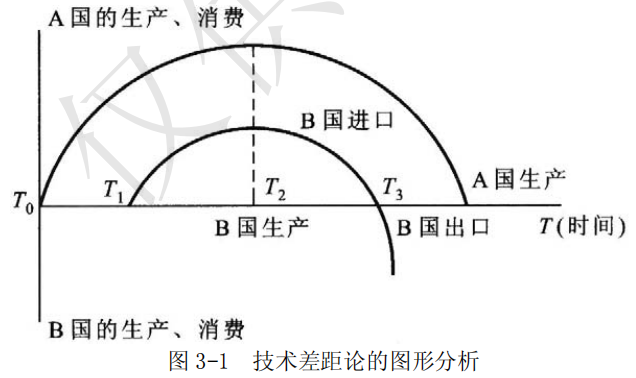
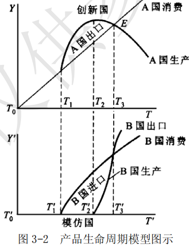
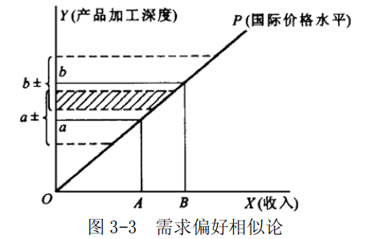
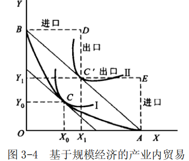

# 第 3 章 国际贸易的现代与当代理论

> **本章核心问题**：如果各国技术水平相同，贸易还由什么决定？为什么世界上最发达的国家之间贸易量最大？为什么同一个国家既出口又进口同一种产业的产品？

## 本章脉络

李嘉图把贸易归因于技术（劳动生产率）差异，二十世纪的新古典改造把注意力转向另一处差异：要素禀赋。赫克歇尔 1919 年的论文提出问题，其学生奥林 1933 年在《区际贸易与国际贸易》中完成体系（后获 1977 年诺贝尔奖）：在两国技术水平相同、只有要素存量不同的世界里，一国出口密集使用本国相对丰裕要素的产品——H-O 模型由此成为「现代」贸易理论的主流。萨缪尔森 1948—1949 年证明要素价格均等化定理（贸易可使两国工资与利率趋同），斯托尔珀-萨缪尔森 1941 年定理则揭示贸易的分配效应（丰裕要素受益、稀缺要素受损——关税保护名义上帮的是稀缺要素），贸易理论第一次与国内政治经济学正面相连。随后整个理论史转向「检验与修补」：列昂惕夫 1953 年用投入产出表检验美国贸易，发现美国出口的资本密集度反而低于进口替代品——反论引出人力资本、自然资源、需求逆转、要素密集度逆转等一串解释，也宣告纯禀赋论不足以覆盖现实。修补的方向是把被 H-O 冻结的变量重新「解冻」：波斯纳 1961 年的技术差距论与弗农 1966 年的产品生命周期论把技术变成动态变量；林德 1961 年的需求偏好相似说从需求侧解释发达国家之间的相互贸易；克鲁格曼 1979—1980 年的新贸易理论引入不完全竞争、规模经济与差异产品，正面回答产业内贸易（与迪克西特-斯蒂格利茨 1977 年的垄断竞争框架结合），布兰德-斯宾塞 1985 年的战略贸易政策理论又把不完全竞争引向政策；梅利茨（Melitz）2003 年的异质企业模型开启「新新贸易理论」，把分析的颗粒度从产业细化到企业。本章按此顺序展开：H-O 模型及其反论，技术差距论，产品生命周期论，产业内贸易理论。

## 问题与分析

### 列昂惕夫反论：美国为什么出口「劳动密集型」产品？

**（1）反论的提出**

H-O 模型自提出后逐渐成为国际贸易理论的主流。第二次世界大战后，学者们开始用经验数据检验该模型能否反映贸易的实际情况，若干检验结果不支持模型，与模型相悖的结论相继出现，列昂惕夫反论即是其中最著名的一个。

**（2）反论的基本内容**

列昂惕夫（投入产出模型的创造者，1973 年诺贝尔奖得主）用投入产出法分析了美国 1940—50 年代的对外贸易，比较美国出口产品的资本-劳动比与进口替代产品（美国既进口又自己生产的产品）的资本-劳动比，发现美国出口部门的资本-劳动比低于进口替代部门——美国参与国际分工的基础是劳动密集型专业化，即美国是通过对外贸易「安排剩余劳动力、节约资本」的。这与 H-O 模型「美国资本丰裕、应出口资本密集品」的预测正相反，引起经济学界巨大争议。

**（3）围绕反论的争论**

多种解释相继提出。列昂惕夫本人的解释：美国工人具有其他国家工人约 3 倍的劳动生产率，用工人数乘以 3 折算，美国反而是劳动相对丰富的国家——这实质上已引出「人力资本」概念（后来的肯宁、基辛等把它形式化：教育与技术训练是嵌入人身的资本）。要素密集度逆转说：同一产品在资本丰裕国属资本密集型、在劳动丰裕国属劳动密集型（小麦在非洲是劳动密集生产、在美国是机械化资本密集生产），H-O 的预测前提失效。此外还有需求偏好逆转说、关税结构说（美国的关税恰恰偏向保护劳动密集产业，扭曲了贸易构成）、自然资源说（美国进口大量资源密集产品，其资本投入高是采矿本身需要资本，剔除自然资源行业后反论显著减弱）。反论的理论史价值在于：它开启了贸易理论的实证传统——此后的每一次「修补」都伴随着新的数据与新模型，这一「理论—检验—修补」的循环一直延续到今天的 HOV（要素含量）检验：特雷夫勒（Trefler）1995 年发现经典模型与数据偏差巨大，但加入各国生产率差异与「本地偏好」修正后，要素含量框架大体成立。

### 技术差距论：模仿滞后如何创造贸易？

技术差距论认为，贸易国之间技术差异的存在是解释某类贸易发生的原因。各国技术革新进展不一，新产品总是在发达国家率先诞生，其他国家因技术差距要等一段时间才能模仿生产，这段时间内便存在贸易机会。

图 3-1 中 A 国为技术创新国，B 国为模仿国。$T_0 \sim T_1$ 为需求滞后：A 国发明新技术后，由于收入水平与消费者对新产品的认知，生产和消费仅在 A 国进行。$T_1 \sim T_2$ 为反应滞后：A 国开始出口，B 国开始进口；滞后长短取决于模仿国厂商的反应速度及规模经济、价格、市场、关税等条件。$T_2 \sim T_3$ 为掌握滞后：B 国开始自行生产，但因获取技术与消化技术的能力所限，生产小于消费，仍需继续进口。$T_3$ 之后 B 国完全掌握技术，产量大增，最终成为出口国。$T_0 \sim T_3$ 总称模仿滞后，$T_1 \sim T_3$ 为两国贸易期间。技术差距论的洞见在于把「技术」从比较优势的静默前提变成动态变量——贸易来自技术扩散的时间差，它为下一节的产品生命周期论搭好了台阶。

### 要素密集度逆转：H-O 模型何时失灵？

要素密集度逆转是指同一产品在不同要素禀赋的国家呈现不同的要素密集度：某产品在资本丰富国属资本密集型，在劳动丰富国属劳动密集型（小麦在美国靠大机器与化肥、属资本密集，在非洲靠人工、属劳动密集）。

其发生条件：两种产品的要素替代弹性差异很大，以致两条等产量线相交两次。此时 H-O 的贸易模式预测失效——同一产品在两国「密集使用」的要素不同，可能出现两国出口同一产品，或一国反而出口密集使用本国稀缺要素的产品；两国要素价格的变动也将同向发展而非趋向均等化。要素密集度逆转在经验上的重要性存在争议（明哈斯 1962 年基于 CES 生产函数的早期检验认为它相当普遍，后续研究则认为典型产业中并不常见），但它提醒：任何以「要素密集度不随禀赋改变」为前提的理论预测，都要先过这一关。

## 综合论述

### H-O 模型的主要内容与评价

**（1）假设前提**

H-O 模型（赫克歇尔-奥林模型，又称要素禀赋理论或要素比例理论）的核心是要素禀赋差异决定贸易模式。假设前提：2×2×2 结构（A、B 两国，劳动与资本两种要素，X、Y 两种产品）；两国生产函数相同（技术水平一致）；商品与要素市场完全竞争，要素国内自由流动、国际间不能流动；A 国资本相对丰富（利率低）、B 国劳动相对丰富（工资低）；不考虑运输、需求偏好与贸易壁垒。

**（2）基本论点与逻辑链条**

核心定理：一国出口密集使用其相对丰富要素的产品，进口密集使用其相对稀缺要素的产品。展开为三个论点：以相对丰富要素从事专业化生产者处于有利地位；要素存量比例不同导致生产成本差异，成本差异导致价格差异并引发贸易；贸易的结果是要素报酬差异缩小，产生要素价格均等化趋势。

内在逻辑链条：要素禀赋 → 要素供给 → 要素价格 → 生产成本 → 产品价格 → 国际贸易。要素禀赋决定要素的相对丰裕程度，相对供给影响相对价格，要素价格差决定成本差，成本差形成产品价格的绝对差——价格绝对差是国际贸易的直接基础。整条链是纯粹的新古典一般均衡推理，这正是它与李嘉图模型的分野所在。

**（3）与李嘉图比较利益说的区别**

四个维度：贸易原因上，李嘉图归于劳动生产率（技术）差异，H-O 归于要素禀赋差异；要素数量上，前者单要素（劳动），后者双要素（劳动、资本）；生产率假设上，前者各国不同、后者各国相同（差异全部来自禀赋）；价值基础上，李嘉图框架内国内等价交换而国际贸易呈现不等价（劳动价值论的内在矛盾），H-O 框架内两者本质相同、交换原则一致（新古典框架消解了这一矛盾）。

**（4）政策含义与案例**

政策指向「发挥固有优势、从禀赋出发开展贸易」：马来西亚出口锡（资源禀赋）、中东国家出口石油（能源禀赋）、中国与东南亚在 1980—90 年代以服装轻工产品出口发挥劳动禀赋优势——各国按禀赋定位自己的比较优势链条。

**（5）评价**

贡献：从一国基本经济资源禀赋解释贸易的原因与模式，以新古典一般均衡替代劳动价值论，为贸易的分配效应分析（要素价格均等化、斯托尔珀-萨缪尔森定理）搭好框架，是传统贸易理论的重要发展。局限：禀赋并非贸易的充分条件（技术、需求、规模经济都在起作用）；静态分析排除技术进步与禀赋自身的动态演化（资本在积累、人力资本在形成——「禀赋」本身是发展的函数）；对需求因素重视不足（列昂惕夫之谜的需求解释、林德的相似需求说都打在这块短板上）；列昂惕夫反论与模型的经典预测相悖。

### 产品生命周期论：比较优势如何在国家间「接力」？

**（1）主要内容**

产品生命周期指产品经历投入、成长、成熟与衰退的时期。弗农 1966 年把周期理论与国际贸易结合，认为不同国家之间的技术差距会改变比较利益，使比较利益从静态发展为动态——从一个（类）国家转移到另一个（类）国家，产品的生产优势随之转移，国际贸易格局因此改变。四阶段为：第一阶段，创新国凭借广大市场、高水平科技人员与高研发投入完成创新，垄断生产与市场；第二阶段，外国开始模仿，创新国产品在该国竞争力下降；第三阶段，外国模仿者开始向第三国出口，创新国出口大幅下降；第四阶段，外国产品进入创新国市场，创新国从出口国转为进口国，该产品在创新国完成周期，而在模仿国开始新的周期。

**（2）图形说明**

如图 3-2 所示：$T_0$ 创新国开始生产并消费，$T_1$ 生产超过消费、开始出口，$T_2$ 达到出口高峰，此后因他国模仿而下降，$T_3$ 出口归零，随后转为进口。模仿国的曲线滞后：$T_1^{'}$ 之前不认识或不消费该产品，$T_1^{'}$ 开始进口消费，$T_2^{'}$ 厂商认定有利可图开始模仿生产，$T_3^{'}$ 自给并停止进口，$T_3^{'}$ 之后凭借规模或其他比较优势以更低成本出口。$T_1$ 与 $T_1^{'}$ 的水平距离取决于创新、模仿国的收入差距；$T_3$ 与 $T_3^{'}$ 之间的距离表明模仿国先向第三国出口、再反向出口创新国。产品的生命周期如接力棒：从先进国家的创新生产开始，转移到相对落后国家，再传导到更落后的国家，在周期的延长过程中尽可能创造利润。

**（3）动态意义**

其一，考察了技术差距下比较利益在国家间的转移，使比较利益学说与 H-O 模型摆脱静态分析进入动态阶段。其二，隐含着产品要素密集度随周期阶段变化的思想：创新期需要大量研发投入（技术知识密集），成熟期转向规模扩张（资本密集），标准化后竞争集中于成本（劳动密集）——这为相对落后国家确定自己参与国际分工的时机与升级路径提供了坐标：在周期的哪个阶段切入、何时向下一阶段爬升。其三，落后国家须不断检视本国要素优势的变化以应对新挑战：随着经济进步，原有比较优势会改变，不按动态视角调整参与方式，发展就会受阻。二十世纪后半叶的收音机、便携计算器、彩色电视机都走过了这条路径——美国发明与率先生产，日本接棒出口，韩国与东南亚再接棒。

**（4）评价**

生命周期理论把管理、科技、外部经济等因素引入贸易模型，是静态理论动态化的重要一步。但经济生活充满不确定性，各国产业环境不同，生命周期的循环并非普遍必然的现象；理论还有一个隐含的「地位固定」倾向——美国总被设定为创新者——而现实是创新来源多元化（日本、韩国、中国先后成为创新主体）。更根本的修正来自当代生产组织的变革：跨国公司全球布局使研发、生产、销售同时分散在多国，「产品在哪个国家走完周期」的叙事被全球价值链取代——产品的「周期」不再在国家间依次传递，而是在企业内同时展开，周期本身也大幅压缩（半导体两年一代、快时尚数周上新）。

### 产业内贸易论：为什么相似国家交换相似产品？

产业内贸易是指一国既出口又进口同一产业产品的现象，是现代贸易理论的重要组成部分。

**（1）假设前提**

产业内贸易理论从静态出发，侧重分析产业内贸易发生的原因与结果而非过程；以不完全竞争市场为前提（更接近现代世界经济的现实）；经济具有规模收益，并将其作为国际贸易发生后利益的重要来源；比较其他理论更重视需求方面的作用，考虑需求相同与不同两种情况。

**（2）同质产品的产业内贸易**

产品同质性指产品间可完全相互替代（需求交叉弹性极高，消费偏好完全一样）。这类产品一般属产业间贸易的对象，但因市场区位、进入市场的时间等因素，现实中存在相同产品间的贸易，包括大宗产品的交叉型贸易（如电力在边境两侧的往返输送）、合作或技术因素的贸易（合资生产各按份额交换产品）、转口贸易、进出口同种产品（规格品位不同，如石油按辛烷值分档）、季节性产品贸易（南北半球水果反季对流）、跨国公司内部的产业内贸易等。

**（3）异质产品的产业内贸易**

产品异质性指产品相似但不完全相同：不能完全替代但尚可替代，交叉弹性小于同质产品，生产中要素投入具有相似性——产业内贸易的大多数属此类。差异产品分三种：水平差异（相同属性的不同组合，如同样品质的香烟不同牌号）、技术差异（新技术制造的新产品）、垂直差异（质量上的差异，如同类产品的不同档次）。

**（4）基于需求偏好相似论的产业内贸易**

林德 1961 年的需求偏好相似论从需求侧解释产业内贸易：国际贸易是国内贸易的延伸，厂商首先满足国内熟悉的市场；人均收入决定一国的需求结构，收入相似则市场隔阂小、易发生贸易。

图 3-3 中，在一定的国际价格水平下，收入相似的国家之间需求发生重叠：A、B 是两国不同的收入水平，OP 是世界价格线，a、b 是两国收入水平下典型的加工深度（消费是多样的，加工深度是一个区域），消费交叉区域即双方都消费的加工深度——需求重叠是产业内贸易的基础。这一理论直接解释了上一章留下的疑问：为什么贸易主要发生在发达国家之间——不是因为它们禀赋差异大，而恰恰因为它们需求结构相似、可交换的差异产品多。

**（5）基于规模经济的产业内贸易**

图 3-4 中 A、B 两国具有相同的、凸向原点的生产可能性曲线（规模经济特征），分工完全随意：设 A 国专业化生产 X、B 国专业化生产 Y，产量为 OA 和 OB；B 国出口 $C^{'}D$ 的 Y 换取 BD 的 X，A 国出口 $C^{'}E$ 的 X 换取 AE 的 Y，无差异曲线从Ⅰ移至Ⅱ，福利提高——但这一提高源于规模生产，而非资源禀赋差异。这正是克鲁格曼新贸易理论的核心：在规模经济与差异产品并存的不完全竞争中，即使两国一切条件相同，专业化分工与相互贸易仍能提高双方福利——贸易的来源可以是「后天选择的专业化」而不必是「先天差异」。克鲁格曼 1980 年进一步证明「本地市场效应」：大市场国家会成为差异产品的净出口国，这解释了产业区位向大市场集聚的现象。

**（6）评价**

产业内贸易理论是对传统贸易理论的批判与拓展：假定更符合实际（不完全竞争、规模经济），把需求侧引入分析，规模经济是各国都在追求的现实利益来源，因而较贴近战后发达国家之间贸易激增的实际；它是对比较利益学说的补充和发展。局限在于基本停留在静态分析，且对贸易福利的分配（哪些企业、哪些工人受益或受损）要到 Melitz 之后的异质企业模型才得到正面处理：梅利茨 2003 年证明，贸易自由化使高生产率企业出口扩张、低生产率企业收缩退出，行业平均生产率提高——贸易的好处部分来自企业间的重新洗牌，这一「扩展边际」视角已成为当代贸易政策的分析基座（贸易协定的竞争政策效应、企业异质性与出口固定成本）。

## 局限与后续

本章理论群在两个方向上继续生长。其一，**禀赋、技术与规模经济的综合定量模型**：H-O 框架的现代表述（Vanek 1968 年的 HOV 要素含量模型）与 Eaton-Kortum 的技术异质性模型已在同一方程体系内兼容，Antweiler-Trefler 2002 年发现约半数产业的贸易数据支持「禀赋逻辑」，规模经济递增的产业同样可按禀赋逻辑运行——「哪个理论对」正在让位于「哪些行业按哪个逻辑运行」。其二，**从产业到企业的「新新」视角**：Melitz 之后，出口的固定成本、企业的生产率分布、跨国公司内部贸易成为分析焦点（Antràs 把产权理论引入企业边界，解释为什么有些环节留在企业内、有些外包）；引力模型（丁伯根 1962 年首创，Anderson-van Wincoop 2003 年给出结构基础）则以其惊人的解释力（距离每翻倍、贸易约降至三分之一）成为政策评估的实证工作马。战略贸易政策理论（布兰德-斯宾塞 1985：在寡头竞争中，补贴本国企业可把垄断租金转移过来）虽然逻辑漂亮，但对信息的要求近乎苛刻、且必然引发对方报复与 WTO 规则约束——空客与波音持续三十年的补贴争端最终在 2021 年以双方暂停报复性关税的休战告终，是这一理论「看起来可行、用起来烫手」的最好注脚。
