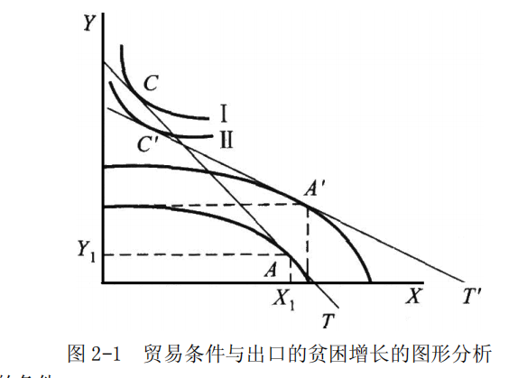
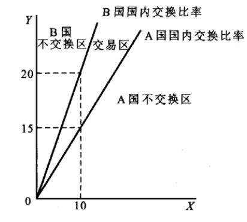

# 第 2 章 国际贸易纯理论

> **本章核心问题**：一个国家样样产品都比别国贵，它还有资格参与国际贸易吗？贸易的好处有多大、怎么分？为什么有些国家出口越多反而越穷？

## 本章脉络

贸易纯理论的源头是对重商主义的清算。重商主义（十五至十八世纪的主导信条）把金银视为财富的唯一形态，主张多出口、少进口、积累顺差；休谟 1752 年的「价格-铸币流动机制」第一次证明顺差不可能无限积累（金银流入抬升物价、削弱出口竞争力，自动回摆），而斯密 1776 年《国富论》则从分工原理正面出击：如果每个国家都有的产品成本比别国低——绝对优势——那么各国专业化生产自己最擅长的产品再交换，贸易双方都获利，重商主义的「贱卖贵卖才是得利」就此瓦解。真正的理论飞跃是李嘉图 1817 年《政治经济学及赋税原理》：托伦斯（Torrens）1815 年已先提出比较优势的思想，李嘉图用英国毛呢换葡萄牙葡萄酒的数字例把它锤炼成完整学说——即使一国样样都落后，只要相对成本有差异，两国按「两优取其重、两劣取其轻」分工仍能互利。这个结果如此反直觉又如此坚实，成为经济学中最经得起时间考验的命题之一（萨缪尔森曾转述：若要举一个「既是真、又不平凡」的社会科学命题，他会选比较优势）。但李嘉图只说了「交换比率落在某个区间内」，贸易条件究竟定在哪里，穆勒 1848 年的相互需求原理给出答案，马歇尔与埃奇沃思再以提供曲线将其几何化；哈伯勒 1936 年用机会成本替代劳动价值论，让整个学说摆脱了李嘉图框架中最脆弱的一环。本章概念的排列即沿此线索：绝对利益（斯密的分工普遍化）、比较利益（李嘉图的相对差异）、提供曲线与贸易条件（穆勒-马歇尔的利益分配），最后用出口贫困化增长说明贸易利益的分配也可以走向反面。

## 核心概念

### 绝对利益

绝对利益是指贸易双方根据各自的绝对优势进行生产，然后交换产品而取得的贸易利益。斯密认为，每个国家都有其适宜于生产某些特定产品的绝对有利生产条件，在这种条件下生产的产品成本比外国低；各国专门生产自己占据绝对优势的产品再相互交换，便可各自获益，世界总体福利水平得到提高。

绝对利益学说「划时代」之处不在结论而在战场：它把国际贸易从重商主义的「零和游戏」重新定义为分工的延伸——贸易不是一方赚了另一方就亏，而是像国内分工一样使双方都增产。但要看到它的解释盲区：斯密要求各国「都有」绝对优势产品，那么对于样样落后的国家，这个理论暗示它不该参与国际分工——这既不符合事实（最落后的国家也在大量贸易），也无法解释先进国家之间的相互贸易。补上这块拼图的正是比较利益。

### 比较利益

比较利益是指贸易双方根据各自的比较优势进行生产、交换产品而取得的贸易利益。比较利益理论由托伦斯首先提出，李嘉图将其发展为完整学说。李嘉图指出：若甲国生产任何产品成本均低于乙国（绝对优势），乙国任何产品均处绝对劣势，此时甲国专门生产优势较大的产品、乙国专门生产劣势较小的产品，两国仍都可从分工与贸易中获益——「两利相权取其重，两弊相衡取其轻」。

比较优势的本质是机会成本的相对差异。用李嘉图式的数字说明：英国生产 1 单位毛呢需要 100 人劳动一年、1 单位葡萄酒需要 120 人；葡萄牙分别只需 90 人和 80 人。葡萄牙两样都强，但毛呢成本只比英国低一成（90/100），酒的成本低三分之一（80/120）——毛呢的相对成本在葡萄牙更高。于是最优安排是葡萄牙全力酿酒、英国全力织呢：因为「葡萄牙多产 1 单位酒」牺牲的毛呢比英国少，酒的相对价格在两国间存在落差，交换使双方用同样劳动得到更多两种产品。注意这个推理完全不需要「劳动是唯一要素」或「劳动决定价值」这类强假设——它只需要机会成本递增差异，这正是哈伯勒 1936 年用机会成本重构该学说的意义：把理论的坚实部分（相对成本差）与脆弱部分（劳动价值论）剥离开。

### 提供曲线

提供曲线又称供应条件曲线或相互需求曲线，由马歇尔与埃奇沃思提出，表明一个国家为了进口一定量的商品，愿意向其他国家出口的量的轨迹——即对应每一进口量所愿提供的出口量。两国提供曲线的交点决定国际商品交换价格（交换比率）。

提供曲线是穆勒「相互需求原理」的几何化：贸易条件的确定既不取决于成本（供给）单方面，也不取决于需求单方面，而取决于两国相互需求的强度对比——一国对另一国产品的需求越旺盛，交换比率越向不利于自己的方向移动。提供曲线的形状由替代效应与收入效应共同决定（价格变化时出口量的增减方向取决于两者孰强），因此它可能向后弯曲；两国曲线的交点即均衡贸易条件，需求移动或经济增长会使曲线移动从而改变贸易条件——这正是下文出口贫困化增长的图形机制：经济增长使提供曲线移动，若移动后的均衡贸易条件恶化得足够厉害，增长反而降低福利。

### 贸易条件

贸易条件又称「交换比价」或「贸易比价」，是指一个国家在一定时期内出口商品价格与进口商品价格之间的比例关系，一般用出口价格指数与进口价格指数之比计算：

$$贸易条件系数=\frac{出口价格指数}{进口价格指数}\times 100$$

系数大于 100 表明贸易条件改善，同量出口可换回更多进口；小于 100 表明贸易条件恶化。

贸易条件之所以是国际经济学最常用的「裁判指标」，因为它把贸易利益分配压缩成了一个数字：交换比率越有利于一国，其贸易条件越高。但解读时要警惕三个口径陷阱：其一，这是「价格」指标而非「福利」指标——贸易条件恶化可能源于本国出口生产率提高（出口价格下降但利润率不变），福利未必受损；其二，总值口径的贸易条件在价值链时代会高估进口中间品涨价的影响（进口零部件涨价同时抬高出口价格，分子分母互相抵消）；其三，普雷维什与辛格 1950 年提出的假说——初级产品相对制成品的贸易条件存在长期恶化趋势——使贸易条件成为南北争论的核心指标，虽然后续经验研究对趋势存在与否及其原因（技术进步在两类产品间的分布差异、恩格尔法则对初级品需求的影响）争论至今，但「发展中国家应警惕以量补价的恶性循环」这一政策直觉已经写进了多数发展政策。

## 问题与分析

### 出口的贫困增长：为什么多出口反而变穷？

出口的贫困增长是指在大国经济中，出口部门的经济增长使贸易条件大幅恶化，恶化对福利的负效应超过增长本身的正效应，该国的社会净福利因增长而下降的情况。

**（1）图形分析**

如图 2-1 所示，生产可能性曲线外移意味着生产能力扩大，生产点从 $A$ 移到 $A^{'}$，生产从第一条曲线移至第二条；但世界价格线 $T$ 随出口激增而旋转为 $T^{'}$——出口增加压低了本国出口品的相对价格，斜率变小。结果出口数量增加了，同量出口换回的进口却减少，新均衡点所在的无差异曲线低于原来的水平：增长的全部好处被贸易条件恶化吞没，净福利下降。机制上这是「大国提供曲线移动」的后果：出口占世界市场很大份额时，本国供给扩张就是世界价格的下行压力。

**（2）出口贫困化增长发生的条件**

四条条件缺一难成：出口国是发展中国家且为单一经济结构；出口品为初级产品或劳动密集型产品，且在世界市场占据很大份额，任何出口增加都会压低世界价格；产品需求弹性小，价格下降换不来销量的相应增加；国民经济高度依赖该出口品，价格下跌后还需靠更大出口量弥补收入损失。

**（3）政策含义与评价**

其一，产品结构单一的国家走出口导向道路时，可能出现「出口越多价格越低」的局面，说明产业结构从长远看必须调整升级。其二，出口贫困增长只是经济发展特定阶段的一种可能情形，不是普遍规律，更不是增长的必然产物——现实中更常见的对应物是资源出口国面对世界价格波动的脆弱性（石油、矿产的「资源诅咒」讨论），政策答案是出口多元化与国内产业的升级，而不是退回封闭。

### 两国贸易价格的可能区域与利益分配（2×2 模型）

**（1）贸易价格的可能区域**

设世界上只有 A、B 两国，各生产 X、Y 两种产品，实行自由贸易；劳动一国内自由流动、国际间不能流动；成本不变、无规模经济，不考虑运输保险成本；收入分配不受贸易影响。分工之前两国单位劳动的产量为：

|       | X  | Y  |
|:-----:|:--:|:--:|
| A     | 10 | 15 |
| B     | 10 | 20 |

A 国 X、Y 都不占绝对优势，但 A 国生产 X 的相对成本更低（1 单位 X 只需放弃 1.5 单位 Y，B 国需放弃 2 单位 Y），故 A 国比较优势在 X，B 国在 Y。贸易后 A 国以 X 换 Y、B 国以 Y 换 X。价格区域由两国国内交换比率界定：A 国国内比价是 $10X :15Y$，若国际市场上 10 单位 X 能换到多于 15 单位 Y，A 国才愿意进入市场；B 国国内比价是 $20Y :10X$，若换 10 单位 X 少于 20 单位 Y，B 国才愿意进入市场。两条国内比价线之间的区域（图 2-2）就是贸易可能发生的价格区间——比价落在区间之外时必有一国宁可在国内交换而不参与贸易。

**（2）利益分配**

如图 2-2 所示，实际交换比率必然落在两国国内交换比率界定的区间内，贸易条件线穿过 $AB$ 开区间线段；具体落在哪一条射线上，取决于双方相互需求的强度（穆勒原理）。交换比率越接近 A 点（A 国国内比价），利益分配越偏向 B 国——A 国所得接近于零；越接近 B 点则反之。这个「区间内分配」的框架解释了现实中贸易谈判的核心：谈判就是争夺交换比率在区间内的位置。

## 综合论述

### 李嘉图比较利益学说的基本内容与评价

**（1）假设条件**

六条假设勾勒出模型的边界：世界由 A、B 两国构成，各生产 X、Y 两种产品，唯一投入要素是劳动；要素与产品市场完全竞争，两国自由贸易；要素一国内自由流动、国际间完全不能流动；以劳动价值论为基础，劳动力同质、充分就业、报酬相同；单位生产成本不变、无规模经济，不考虑运输保险成本；收入分配不受贸易影响。在这些前提下，学说试图证明：国际贸易的基础是比较利益而非绝对利益。

**（2）基本内容**

生产力水平不相等的两国——甲国任何产品成本都低、乙国都高——之间贸易依然可能发生，因为两国劳动生产率的差距并非在任何产品上都一样。绝对优势国不必生产全部产品，应集中生产本国优势最大的产品；绝对劣势国也不必全部停产，只应停产本国劣势最大的产品。通过自由交换，各参与国节约社会劳动、增加消费，世界总产出因分工而提高。

**（3）评价**

从国际贸易实际出发的评价：比较利益学说揭示了贸易的互利性，证明各国出口相对成本低的产品、进口相对成本高的产品即可互利，这是主要贡献。但其假设前提过于苛刻，与国际现实不符（如要素国际间完全不能流动）；按该学说比较利益相差越大贸易越可能发生，那么当今贸易应主要发生在发达与发展中国家之间，而事实是国际贸易的大部分长期发生在收入与发展水平相近的发达经济体之间（历史上曾达约七成，近年新兴经济体崛起后比重已明显下降，以 WTO 统计为准）——理论与格局的错位引出了后面的需求相似说（第 3 章）；学说主张自由贸易即互利，但现实各国都在不同程度上实行保护，说明互利总量与国内分配是两回事（贸易有赢家有输家，Stolper-Samuelson 定理是这一批评的现代严格化）。

从劳动价值论出发的评价：其一，同一商品在国内与国际市场出现两个交换比率，与李嘉图自己坚持的劳动价值论相矛盾——国际交换中「等价交换」似乎失灵，这一矛盾在马克思「国际价值」的讨论中被系统处理；其二，学说未从根本上揭示贸易发生的原因：无论有无比较利益，只要商品能实现价值、厂商能收回成本获得平均利润，贸易就会发生，把它归结为追逐超额（比较）利益不符合厂商决策的实际顺序；其三，学说暗含「越落后国家参与贸易越受益」，忽视了国际交换中的价值流向与不等价交换问题，这也是它难以被相对落后国家的经济学界全盘接受的深层原因。

## 局限与后续

李嘉图框架的当代命运是一段「简化被证明是力量」的历史。单一要素、连续商品的现代重构（Dornbusch-Fischer-Samuelson 1977）让比较优势可以处理任意多种商品，Eaton-Kortum 2002 年模型进一步引入各国技术分布的随机差异，成为当代定量贸易分析（测算关税、地理壁垒的福利损失）的主力框架——两位作者沿用的仍然是李嘉图的相对生产率逻辑，只是把「两个国家两种产品」换成了「世界各国的技术参数」。而它的两个关键假设在现实中反向演化：要素不流动的假设被资本流动、跨国公司与全球价值链瓦解——出口商品里嵌着进口中间品，「比较优势」越来越多地由跨国公司「配置」而非由国家「禀赋」决定（任务贸易与增加值贸易研究）；技术不变的假设则被内生增长与干中学推翻——比较优势可以在政策扶植与积累中动态生成（韩国从纺织到半导体的路径），这也为第 4 章的幼稚产业保护提供了理论接口。最后，「比较优势理论的实证检验」本身就是一门独立文献：对李嘉图模型的直接检验（MacDougall 1951 年的美英出口对比）方向上成立，而更精细的检验揭示生产率差异对出口的解释力远超要素禀赋——这位两百岁的老先生，至今仍是贸易实证研究绕不开的基准。
