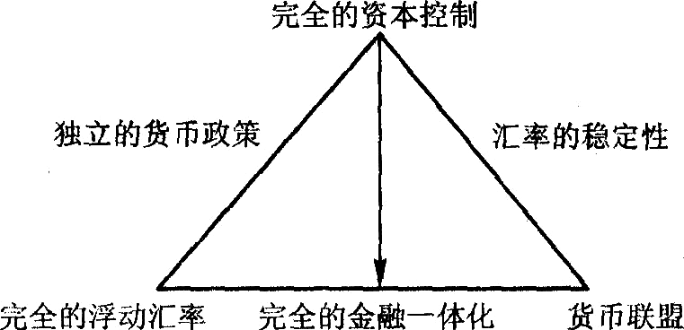
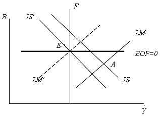
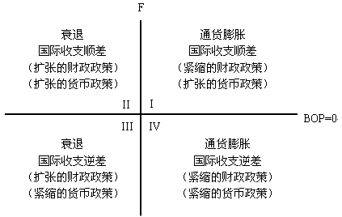

# 第 8 章 宏观经济的内外均衡

> **本章核心问题**：开放经济下如何同时实现内部均衡（充分就业、物价稳定）和外部均衡（国际收支平衡）？蒙代尔-弗莱明模型如何分析政策效果？

## 核心概念

### 贸易乘数

**【核心思想】**

$$出口增加 → 国民收入成倍增加$$

**通俗理解**：卖东西给外国人，赚回来的钱会在中国"多轮循环"，创造更多财富。

---

**【通俗例子：卖苹果的故事】**

假设你把苹果卖给美国，赚了100元：

| 轮次 | 交易 | 收入 |
|------|------|------|
| **第1轮** | 你卖苹果赚100元 | +100元 |
| **第2轮** | 你用80元买衣服（20元存起来） | +80元 |
| **第3轮** | 服装店老板用64元买菜 | +64元 |
| **第4轮** | 菜农用51.2元买米 | +51.2元 |
| **...** | ... | ... |
| **合计** | | **约500元** |

**结论**：100元出口 → 创造约500元GDP → **贸易乘数约等于5**

---

**【为什么会有"倍数"效应？】**

$$每一轮都有人存钱或买进口商品 → 钱会"漏掉"一部分$$

| 漏掉的途径 | 含义 |
|----------|------|
| **储蓄** | 存起来，不消费 |
| **进口** | 买外国商品，钱流到国外 |

**漏得越少，乘数越大**！

---

**【贸易乘数公式】**

$$K_T = \frac{1}{MPS + MPM}$$

| 符号 | 含义 |
|------|------|
| $K_T$ | 贸易乘数 |
| $MPS$ | 边际储蓄倾向（每多赚1元，存多少） |
| $MPM$ | 边际进口倾向（每多赚1元，买进口多少） |

**简化版**（当没有储蓄时）：

$$K_T = \frac{1}{MPM} = \frac{1}{边际进口倾向}$$

---

**【直观理解】**

| 情况 | MPS（储蓄倾向） | MPM（进口倾向） | 贸易乘数 | 含义 |
|------|----------------|----------------|----------|------|
| **A国** | 0.1（10%） | 0.2（20%） | $\frac{1}{0.1+0.2}=3.33$ | 出口1元 → GDP增加3.33元 |
| **B国** | 0.3（30%） | 0.1（10%） | $\frac{1}{0.3+0.1}=2.5$ | 出口1元 → GDP增加2.5元 |

**结论**：储蓄和进口越少，贸易乘数越大！

---

**【政策含义】**

| 政策 | 效果 |
|------|------|
| **鼓励出口** | 直接刺激经济，有乘数效应 |
| **国货替代** | 降低MPM → 提高乘数 |
| **刺激消费** | 降低MPS → 提高乘数 |

---

**【与投资乘数的区别】**

| 乘数类型 | 关注点 | 漏出渠道 |
|----------|--------|----------|
| **投资乘数** | 国内投资 | 储蓄 |
| **贸易乘数** | 出口 | 储蓄 + 进口 |

**贸易乘数通常更小**（因为漏出更多）！

---

**【一句话记忆】**

> **贸易乘数** = "卖东西给外国人，钱会多轮循环" = 出口1元，GDP增加好几元

---

贸易乘数指乘数理论在对外贸易研究中的作用，探讨对外贸易与国民收入和就业之间的关系。
在贸易乘数公式中，它是边际储蓄倾向与边际进口倾向的和的倒数。贸易乘数原理主要分析在边际储蓄倾向和边际进口倾向之和小于 1 的条件下，增加出口有利于提高有效需求、增加国民收入和就业量。

### 边际进口倾向

**【核心思想】**

$$收入增加 → 进口也增加$$

**通俗理解**：你赚得越多，越会买外国货。

---

**【通俗例子：加薪的故事】**

假设你月薪从5000元涨到10000元：

| 收入变化 | 买国货 | 买进口货 | 边际进口倾向 |
|----------|--------|----------|--------------|
| **原来月薪5000元** | 买国产手机、国产衣服 | 偶尔买进口零食 | 0.1（10%） |
| **现在月薪10000元** | 买更好的国货 | 经常买进口化妆品、进口车 | 0.2（20%） |

**含义**：每多赚1元，你会花2毛钱买进口商品 → **边际进口倾向 = 0.2**

---

**【为什么收入高了会买进口？】**

| 收入水平 | 消费特点 | 进口倾向 |
|----------|----------|----------|
| **低收入** | 满足基本需求（吃穿住行） | 低（国货够用） |
| **中等收入** | 追求品质（更好的家电、手机） | 中（开始买进口品牌） |
| **高收入** | 追求档次（奢侈品、进口车） | 高（大量进口消费） |

**结论**：**越有钱，越爱买进口货**！

---

**【与贸易乘数的关系】**

$$边际进口倾向越大 → 钱流到国外越多 → 贸易乘数越小$$

| 国家 | MPM | 含义 | 贸易乘数 |
|------|-----|------|----------|
| **A国** | 0.1（10%） | 赚1元，花1毛买进口 | 乘数大（钱留在国内多） |
| **B国** | 0.4（40%） | 赚1元，花4毛买进口 | 乘数小（钱流走多） |

**直观理解**：
- MPM低 = 漏水少 → 贸易乘数大
- MPM高 = 漏水多 → 贸易乘数小

---

**【一句话记忆】**

> **边际进口倾向** = "赚得越多，越买洋货" = 每多赚1元，花多少买进口

---

边际进口倾向是指进口量的变动对引起这种变动的收入变动的比率，即每增加一单位国民收入的变动量所能引起进口变动的比率。
边际进口倾向是国际贸易理论中的一个重要的概念。国民收入变动之所以能影响进口量，是因为，如果一国的国民收入增加，那么该国的消费，特别是对奢侈品的消费将增加，于是将向外国购买更多的商品，即进口量增加；反之，则进口量减少。边际进口倾向反映了国民收入对进口量的影响程度。边际进口倾向通常在公式中用 m 来表示。边际进口倾向大，则每一单位增量国民收入中用于进口的比重大，乘数效应对于经济的刺激作用就会较小，反之则较大。

## 问题与分析

### 试推导贸易乘数公式。

**【符号说明】**
| 符号 | 英文全称 | 中文含义 |
|------|----------|----------|
| $Y$ | National Income | 国民收入 |
| $C$ | Consumption | 消费 |
| $I$ | Investment | 投资 |
| $G$ | Government Spending | 政府支出 |
| $X$ | Exports | 出口 |
| $M$ | Imports | 进口 |
| $S$ | Saving | 储蓄 |
| $T$ | Tax | 税收 |
| $K_T$ | Trade Multiplier | 贸易乘数 |
| $MPS$ | Marginal Propensity to Save | 边际储蓄倾向 |
| $MPM$ | Marginal Propensity to Import | 边际进口倾向 |

---

**【一、推导步骤】**

**步骤1**：写出开放经济国民收入恒等式

$$总需求 = 总供给$$

$$总需求：Y = C + I + G + X$$

$$总供给：Y = C + S + T + M$$

**步骤2**：令税收等于政府支出（$T = G$），简化均衡条件

$$C + I + X = C + S + M$$

$$\boxed{I + X = S + M}$$

| 含义 | 投资注入口 | 储蓄漏出口 | 出口注入口 | 进口漏出口 |
|------|-----------|-----------|-----------|-----------|
| **均衡** | $I + X = S + M$ | |||

**步骤3**：求微分（分析增量变化）

$$dI + dX = dS + dM$$

| 符号 | 含义 |
|------|------|
| $dI$ | 投资增量 |
| $dX$ | 出口增量 |
| $dS$ | 储蓄增量 |
| $dM$ | 进口增量 |

**步骤4**：引入边际倾向

$$dS = MPS \cdot dY$$（储蓄随收入变化）

$$dM = MPM \cdot dY$$（进口随收入变化）

代入上式：

$$dI + dX = MPS \cdot dY + MPM \cdot dY$$

$$dI + dX = (MPS + MPM) \cdot dY$$

**步骤5**：求出国民收入变化

$$\boxed{dY = \frac{dI + dX}{MPS + MPM}}$$

**步骤6**：假设投资和储蓄不变（$dI = dS = 0$），仅考虑出口变化

$$dY = \frac{dX}{MPS + MPM}$$

$$\boxed{dY = \frac{dX}{MPM}}$$（当无储蓄时，$MPS = 0$）

**步骤7**：得到贸易乘数

$$K_T = \frac{dY}{dX} = \frac{1}{MPS + MPM}$$

$$\boxed{K_T = \frac{1}{MPM}}$$（简化版，无储蓄时）

---

**【二、公式含义】**

$$贸易乘数 = \frac{1}{边际储蓄倾向 + 边际进口倾向}$$

| 变量 | 变化 | 对乘数的影响 |
|------|------|-------------|
| $MPS↑$ | 储蓄漏出增加 | $K_T↓$ |
| $MPM↑$ | 进口漏出增加 | $K_T↓$ |
| $MPS↓、MPM↓$ | 漏出减少 | $K_T↑$ |

---

**【三、与投资乘数的对比】**

| 乘数类型 | 公式 | 漏出渠道 |
|----------|------|----------|
| **投资乘数** | $K_I = \frac{1}{MPS}$ | 储蓄 |
| **贸易乘数** | $K_T = \frac{1}{MPS + MPM}$ | 储蓄 + 进口 |

**结论**：贸易乘数通常**小于**投资乘数（漏出更多）！

---

**【四、记忆要点】**

$$出口变化 → 收入变化 → 储蓄+进口漏出 → 最终收入变化$$

| 记忆方式 | 内容 |
|----------|------|
| **公式** | $K_T = \frac{1}{漏出}$ |
| **逻辑** | 漏出越少，乘数越大 |
| **应用** | 促进出口 + 减少漏出 = 经济增长 |

---

贸易乘数是指国民收入的变动额与引起国民收入变动的贸易收支变动额之比。

### 试用图形解释三元悖论的含义。

不可能三角定律的主要内容如下：
三角的每一边都表示一种政策选择——独立的货币政策、汇率的稳定性（实践操作中指固定汇率）以及完全的金融一体化，政策各有其吸引力。
三角的任何两边可以进行组合，组合的结果分别由三角形的三个顶角表示，即完全的资本控制、货币联盟和完全的浮动汇率，然而，三边不可能同时实现。



图 8-1 为不可能三角定律图解。如果一国货币政策是完全独立的，资本又是自由跨国流动的，便不能够实行固定汇率，汇率必须要浮动。也就是说，固定汇率和货币政策的独立在资本完全自由流动的条件给定以后，这二者只能取其一。

---

**【通俗理解：买房的故事】**

**核心思想**：三个目标，最多只能同时实现两个！

---

**【三样东西想要全有？不可能！】**

想象你买房时想要的三个条件：

| 想要的条件 | 含义 |
|----------|------|
| **① 房价稳定** | 汇率稳定（固定汇率） |
| **② 自己做主** | 货币政策独立 |
| **③ 随时买卖** | 资本自由流动 |

**现实**：这三样不可能同时拥有！

---

**【通俗例子：家庭理财】**

| 组合 | 选择 | 后果 |
|------|------|------|
| **组合1** | 自己做主 + 随时买卖 | 房价**波动大**（浮动汇率） |
| **组合2** | 房价稳定 + 随时买卖 | **失去控制权**（货币政策不独立） |
| **组合3** | 房价稳定 + 自己做主 | **不能随便买卖**（资本管制） |

---

**【各国实际选择】**

| 国家/地区 | 选择① | 选择② | 放弃③ | 模式 |
|-----------|-------|-------|-------|------|
| **美国** | ✅ 货币独立 | ✅ 资本自由 | ❌ 汇率稳定 | 浮动汇率 |
| **中国香港** | ❌ 货币独立 | ✅ 资本自由 | ✅ 汇率稳定 | 联系汇率制（盯住美元） |
| **中国大陆** | ✅ 货币独立 | ✅ 汇率稳定 | ❌ 资本自由 | 资本管制 |

---

**【不可能三角示意图】**

```
         货币政策独立
             /\
            /  \
           /    \
          /      \
         /        \
        /          \
       /            \
资本自由流动 —————— 汇率稳定
```

**只可选两边！**

---

**【一句话记忆】**

> **三元悖论** = "好事不能占全" = 三样好事最多只能拿两样

---

## 综合论述

### 试用分析一国宏观经济内外均衡的过程及其政策搭配。

- （1）宏观经济内外均衡的过程

- ①宏观经济内外均衡的含义

一国宏观经济内部均衡是指国内的总供给等于总需求，即实现资源的充分就业，物价稳定，同时可以获得有保证的增长；对外均衡是指一国与外部经济体之间的经济流入量和流出量相等，国际收支处于平衡状况。一国经济实现内外经济均衡是比较困难的，出现失衡状态时，就需要进行调整，以恢复经济对内和对外均衡，以求经济的平衡增长。

- ②宏观经济内外均衡的调节政策

为了达到经济的对内和对外均衡，一国可以采取诸如支出变化政策、支出转换政策和经济管制的方法。支出变化政策强调通过政府改变社会总支出对总需求进行调节，具体的做法包括财政手段、货币手段、汇率政策。支出转换政策指能够影响贸易商品的国际竞争力，通过改变支出构成而使本国收入相对于支出增加的政策，如汇率调整、关税、出口补贴、进口配额限制等都属于支出转换政策范畴。经济管制是采取各种法律法规等手段，直接控制经济的运行，以使经济向预定的方向发展。

③宏观经济内外均衡的调节过程

a．固定汇率制下内外均衡的调节过程

假设一国经济的内外均衡只取决于有形商品贸易的变化，那么可以利用 $IS-LM-BP$ 模型来调整经济的对内、对外均衡。首先考察固定汇率的条件下，运用财政政策与货币政策使经济恢复对内、对外均衡的过程。



如图 8-2 所示，假设经济存在通货膨胀与国际收支逆差的状况，这时运用紧缩的财政政策手段来克服通货膨胀，即使得 $IS$ 曲线向左移动到 $E$ 点为 $IS^{'}$ ，达到国内均衡，但此时由于利率的下降，资本会流出，反而加大了国际收支的逆差，这需要采用紧缩的货币政策来进行调整，即使得 $LM$ 曲线向左移动到 $E$ 点成为 $LM^{'}$ ，于是经济恢复了同时的对内、对外的均衡。

b．浮动汇率制下内外均衡的调节过程

如果该国实行浮动汇率制，则调整的过程与实行较为严格的固定汇率时是不同的。当经济发生对内、对外的不均衡时，浮动汇率制度可以产生自动调节过程，汇率的变化能够产生商品、资本市场的变化，即浮动汇率可以使得商品、资本和外汇三个市场经过一定的过程自动达到均衡，从而实现对内、对外的均衡。

- （2）内外均衡的政策搭配

a．斯旺图图形分析



一国内外经济失衡的情况以及出现失衡时的政策选择可以采用斯旺图表来表示，如图 8-3 所示。在斯旺图表中， BOP 代表的是在一定的汇率与国内支出下的一国对外的均衡， BOP 线以上代表的是该国存在着对外的顺差状况，而 BOP 线下面代表的是该国存在着对外的逆差状况。 F 线代表在一定的汇率与国内支出情况下的国内经济均衡的情况，在 F 线的左边意味着存在衰退和失业，在 F 线的右面则意味着过度就业与通货膨胀的情况。只有在 BOP 线与 F 线的交点，才是一国经济对内对外均衡同时达到的情况。

b．运用斯旺图分析内外均衡的政策搭配

按照蒙代尔的搭配主张，采用财政手段来调节国内的均衡，即当经济出现衰退时，采用扩张的财政政策治理；当经济出现通货膨胀时，采用紧缩的财政政策来治理。采用金融手段来调控对外均衡，即当国际收支出现顺差时，采用扩张的货币政策来调整；当国际收支出现逆差时，采用紧缩的货币政策来调整，这样比较容易达到内外的同时均衡。

图 8-3 中，第Ⅰ象限的经济状况是通货膨胀与国际收支顺差并存，按照蒙代尔的政策搭配，应该采用紧缩的财政政策与扩张的货币政策。在第Ⅱ象限，经济状况是衰退与国际收支顺差并存，按照蒙代尔的政策搭配，应该采用扩张的财政政策和扩张的货币政策。在第Ⅲ象限，按照蒙代尔的政策搭配，应该是扩张的财政政策与紧缩的货币政策并用。在第Ⅳ象限，应该是紧缩的财政政策与紧缩的货币政策并用，在这种政策搭配下，经济的内外均衡是可以达到的。

---

**【通俗理解：家庭理财的故事】**

**核心问题**：一个家庭要做到**家庭内部收支健康**，同时**与外界的资金往来平衡**。

---

**【一、什么是内外均衡？】**

| 均衡类型 | 家庭比喻 | 经济含义 |
|----------|----------|----------|
| **内部均衡** | 收入稳定，开支合理，生活水平稳步提升 | 充分就业 + 物价稳定 + 经济增长 |
| **外部均衡** | 与银行、亲戚的资金往来平衡 | 国际收支平衡（出口=进口，资本流入=流出） |

**核心矛盾**：家里日子要过好，外面账也要平，**两件事常常冲突**！

---

**【二、四种"失衡"情况（斯旺图四象限）】**

| 象限 | 家庭情况 | 经济情况 |
|------|----------|----------|
| **第Ⅰ象限** | 买太多（物价涨），但外面总欠你钱 | 通胀 + 顺差 |
| **第Ⅱ象限** | 没钱花（失业），但外面总欠你钱 | 衰退 + 顺差 |
| **第Ⅲ象限** | 没钱花（失业），总欠外面钱 | 衰退 + 逆差 |
| **第Ⅳ象限** | 买太多（物价涨），总欠外面钱 | 通胀 + 逆差 |

---

**【三、怎么调？（蒙代尔政策搭配）】**

**基本原则**：**财政管家里，货币管外面**

| 政策工具 | 作用 | 家庭比喻 |
|----------|------|----------|
| **财政政策** | 调节内部均衡（国内经济） | 调整家庭开支计划（多花/少花） |
| **货币政策** | 调节外部均衡（国际收支） | 调整与银行往来（多存/少存） |

---

**【四、四种情况的处理方案】**

| 情况 | 问题 | 解决方案（财政 + 货币） |
|------|------|------------------------|
| **第Ⅰ象限** | 通胀 + 顺差 | 减少家庭开支（紧缩财政）+ 多往外借钱（扩张货币） |
| **第Ⅱ象限** | 衰退 + 顺差 | 增加家庭开支（扩张财政）+ 多往外借钱（扩张货币） |
| **第Ⅲ象限** | 衰退 + 逆差 | 增加家庭开支（扩张财政）+ 少往外借钱（紧缩货币） |
| **第Ⅳ象限** | 通胀 + 逆差 | 减少家庭开支（紧缩财政）+ 少往外借钱（紧缩货币） |

---

**【五、一个例子：第Ⅲ象限（衰退 + 逆差）】**

**问题**：
- **内部**：经济不景气，失业率高（家里没钱花）
- **外部**：进口 > 出口，外汇流出（总欠外面钱）

**解决方案**：
1. **扩张财政政策**（管家里）：政府增加支出、减税 → 刺激经济、创造就业
2. **紧缩货币政策**（管外面）：提高利率 → 吸引外资流入、改善国际收支

**结果**：内外均衡恢复！

---

**【六、固定汇率 vs 浮动汇率】**

| 汇率制度 | 调节方式 | 优缺点 |
|----------|----------|--------|
| **固定汇率** | 政府主动用政策调节 | 稳定但需要不断调整政策 |
| **浮动汇率** | 汇率自动调节 | 自动调节但汇率波动大 |

**固定汇率**：像主动管理家庭收支，辛苦但可控
**浮动汇率**：像让市场自动调节，省心但起伏大

---

**【一句话记忆】**

> **内外均衡** = "家里日子好 + 外面账目平" = 财政管家里，货币管外面

---

---
