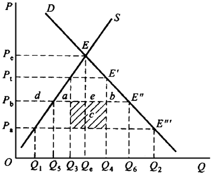

# 第 9 章 经济一体化与国际经济秩序分析

> **本章核心问题**：几个国家结成关税同盟、互相免关税，一定是好事吗？为什么 WTO 要把「最惠国待遇」立为第一原则、却又给区域贸易协定开例外？多边贸易体制现在的麻烦在哪里？

## 本章脉络

经济一体化的理论起点是一篇「泼冷水」的论文。第二次世界大战后的欧洲以一体化求和平与重建：1951 年煤钢共同体、1957 年《罗马条约》建立欧洲经济共同体，关税同盟成为一体化的核心装置。当时的主流直觉认为「走向自由贸易」必然增进福利，但维纳（Viner）1950 年的《关税同盟问题》证明：关税同盟「对内自由+对外统一关税」是次优安排而非自由贸易——它同时产生贸易创造（成员国间的低成本生产替代本国高成本生产，福利改善）与贸易转移（成员国间的生产替代原来与非成员国的更低成本贸易，福利受损），净效应取决于两者的对比。这一「次优」洞察（与利普西-兰开斯特 1956 年的一般化表述相呼应）奠定了此后全部区域一体化福利分析的基础。一体化的形式按深度递进：特惠贸易安排→自由贸易区（对内免关税但各自保留对外关税，须以原产地规则防止「贸易偏转」）→关税同盟（统一对外关税，无需原产地证明）→共同市场（要素自由流动）→经济与货币联盟（政策协调乃至统一货币），巴拉萨 1961 年的分类框架沿用至今。实践在 1990 年代掀起区域主义浪潮（北美自由贸易区 1994 年生效），区域协定激增形成「意大利面碗」式的规则重叠，而多边体制这边：GATT 1947 年「临时适用」了 47 年，经八轮谈判（尤其乌拉圭回合 1986—1994）关税大幅削减并扩围到服务与知识产权，1995 年 WTO 成立并建立准司法的争端解决机制。国际经济秩序的另一面是南北关系：普雷维什的中心-外围论、1974 年联合国大会的《建立新的国际经济秩序宣言》与普惠制（GSP）的设立，是发展中国家争取规则改写的历史节点。本章概念部分给出贸易创造/转移与关税同盟两个支点，综合论述展开关税同盟的福利与动态效应、WTO 的原则与内容。

## 核心概念

### 贸易创造与贸易转移

贸易创造是「贸易转移」的对称：两国或两国以上结成关税同盟后，成员国之间的贸易代替了过去各自的国内生产和消费——创造出新的贸易。贸易转移是「贸易创造」的对称：同盟成员之间的特惠安排使成员国之间的贸易代替了原来它们同非成员国之间的贸易，而非创造出新的贸易。

用数字把两者分开。设本国对苹果征每单位 3 元关税：世界最低成本国 A 报价 5 元（含税 8 元），同盟候选国 B 报价 7 元（含税 10 元），本国自产成本 10 元。同盟前的进口选择是 A（8 元最便宜），本国自产者也被压在 10 元以下无利可图。与 B 结盟后 B 免税变 7 元、A 仍含税 8 元：其一，本国从自产转向 B 进口的部分是贸易创造——高效的外部生产替代了低效的国内生产，纯福利改善；其二，从 A 进口转向 B 进口的部分是贸易转移——生产从真正的低成本国挪到了「靠关税优惠取胜」的次低成本国，全球资源配置效率下降（本国消费者因免税仍受益，但 A 国产出与全球效率受损，政府还失去了关税收入）。判别同盟的福利符号就看两者之比：创造大于转移则净福利为正，反之则负。经验规律：同盟前的成员国之间贸易占比越高、成员国的平均关税越高、成员国与非成员国的成本差距越小，贸易创造越占上风——「朋友圈」本来就在生意里占大头时，扩圈创造大于改道转移。

### 关税同盟

关税同盟是指两个或两个以上国家结盟划为一个关税区域，区域内相互取消关税与非关税壁垒、实行自由贸易，对非加盟国实行统一关税与贸易限制。它是区域经济一体化中比自由贸易区程度更高的形式，特点是在相互取消进口关税的同时设立共同关税，成员经济体之间的产品流动无须再附加原产地证明。

「无须原产地证明」正是关税同盟与自由贸易区的本质分界，其道理在于「贸易偏转」问题：自由贸易区（如北美自由贸易协定）各成员对外关税不同，若不加限制，进口商可从对外关税最低的成员入境（比如经墨西哥以低关税进口）再免关税转卖到高关税成员（美国），使整个区域的对外贸易政策被最低壁垒「稀释」——原产地规则（货物须在成员国内达到一定增值比例或加工标准才能享受区内免税）就是防偏转的闸门，代价是证明合规的行政成本与新型保护主义（原产地标准本身可被设计得苛刻）。关税同盟统一对外关税，偏转问题消失，原产地证明随之不必——但代价是成员让渡了贸易政策主权（关税是主权象征性最强的税种）。一体化的每升一级，都在用一层主权换一层效率，这条「主权-效率交易线」贯穿欧盟从共同市场到欧元的全部历史，也是 Brexit 争论的实质。

## 综合论述

### 关税同盟的内容与经济作用

**（1）内容**

关税同盟是成员国之间减低乃至免除彼此关税，成员国居民可以更低成本消费商品、获得更多选择，成员国乃至同盟整体福利可能提高；对外则采取统一（或逐步统一）的对外关税，关税收入按既定比例分配。主要政策措施：统一海关税则、取消内部关税；实行出口补贴政策增强产品国际竞争力；统一对外贸易政策，以同盟名义发展同非成员国的贸易关系；同盟内取消贸易限制实行自由贸易，对非成员国实行统一关税与配额制度。

**（2）图形分析**

如图 9-1 所示，设某国为小国，$D$、$S$ 为需求与供给曲线。无关税时该国从低成本国 A 进口，价格 $P_a$ 下进口 $Q_1Q_2$，高成本的 B 国被排除在贸易之外。征收使价格升至 $P_t$ 的关税后，进口减为 $Q_3Q_4$。若此时该国与 B 国结成关税同盟，两国间无关税，A 国反被排除，该国以 $P_b$ 价格从 B 国进口 $Q_5Q_6$。

**（3）福利分析**

与 B 国结盟后，价格从关税价 $P_t$ 降至 $P_b$：消费者剩余增加 $a+b+d+e$（即 $P_bP_tE^{'}E^{''}$），其中 $d$ 是本国生产者剩余的减少，$e$ 是关税收入的转移，净福利为 $a+b$（贸易创造部分）。但与 A 国结盟相比：从 A 进口必须转向 B，消费者少得 $P_aP_bE^{''}E^{'''}$，且原有关税收入中的 c 部分损失（转移到 B 国生产者）——若该国与成本最低的 A 国结盟，则只有贸易创造而无贸易转移。图形给出的决策准则：优先与最高效率的伙伴结盟。

**（4）经济作用：静态效应与动态效应**

静态效应即贸易创造与贸易转移的对比（见概念与图形分析）。动态效应有四方面：促进成员国经济发展——市场规模与生产规模扩大带来规模效益、成本下降；贸易障碍拆除后成员国可进行更广泛的国际分工，货物自由流动改善资源配置，促进增长。改善市场结构——同盟内自由贸易加强竞争，促进企业为提高竞争力而联合与合并，生产集中度与市场结构随之演化（竞争加强是收益，垄断加深是风险，须以竞争政策对冲）。刺激投资——市场规模大、风险与不稳定性下降，成员国企业增加投资；同盟内外贸易环境反差大，非成员企业为绕过壁垒进入大市场也会加大对成员国的投资（这正是 1980—90 年代美国企业大举投资欧洲单一市场的动因）。外溢效应——成员国经济增长带动进口需求增长，反过来推动非成员国对成员国的出口（一体化的红利并不完全锁在圈内）。

### WTO 的原则与基本内容

**（1）六项原则**

非歧视原则：也称「无差别原则」，体现在最惠国待遇与国民待遇两个条款上。最惠国待遇指缔约一方现在和将来给予任何第三方的优惠和豁免也给予缔约对方，WTO 实行的是无条件最惠国待遇，目的是防止成员间歧视、保证同等的贸易机会；国民待遇指缔约国保证对方自然人、法人和商人在本国境内享有与本国主体同等的待遇（WTO 的国民待遇只适用于进口商品在国内市场的经销环节），目的是使外国产品在平等条件下与国内产品竞争、保障关税减让的成果真正兑现。两项合成的精神是「内外无歧视、成员无差别」——把国际贸易从强权双边主义改为规则多边主义。

关税减让原则：各缔约国通过谈判在互惠让步基础上逐步降低关税，达成关税减让表，任何缔约国不得单方面修改税率。这条把「关税约束」制度化：减让表经谈判锁定后成为法律承诺，回调须谈判补偿——贸易政策由此获得了可预期的法律边界。

取消数量限制原则：缔约国只能通过关税保护本国产品，一般不得实行进出口限制，主要针对禁止进口、配额管理、进口许可证等做法——数量限制比关税更有隐蔽性与破坏性（完全切断价格机制的调节功能），故被原则上禁止。

反倾销与限制出口补贴原则：禁止出口倾销，允许受损害成员在倾销造成重大损害或威胁时征收反倾销税；出口补贴被禁止（制成品），初级产品出口补贴仅限于承诺限制。这条是「自由贸易原则的例外条款」——它把报复性措施关进程序与标准的笼子（三要件认定、透明程序），防止其沦为任意保护。

透明度原则：缔约国政府必须公布有关外贸的基本法规条例，使其他缔约国政府和商人得以了解，防止不公开的歧视性贸易——透明是执行其他一切原则的前提。

磋商调解原则：一缔约国就协定的执行向另一缔约方提出抗议时，后者应充分考虑并协商；争端解决不是对违约行为的法律制裁，而是通过协商解决争端、保持权利与义务的平衡。（乌拉圭回合后争端解决机制大幅司法化：专家组与上诉机构两级审理、裁决有强制约束力、败诉不执行可获授权报复——这是 GATT 临时体制与 WTO 常设体制的最大差别。）

**（2）基本内容**

核心条款：缔约国在关税与贸易方面相互提供无条件最惠国待遇和关税减让。主要制度规范：国民待遇、海关估价、补贴、外汇安排、进口数量限制等贸易政策的规则。程序性规定：文件适用范围、加入退出手续、关税谈判与减让的修改等。特殊与差别待遇：对发展中国家贸易与发展尽量给予关税和其他方面的优惠（普惠制的法律基础由此而来）。

**（3）体制的现状**

WTO 体制当前的麻烦集中于三处：争端解决上诉机构自 2019 年起因成员遴选被阻而停摆，争端可上诉至「无裁决」状态，多边纪律的牙齿暂时钝化；多哈回合（2001 年启动，以发展为主题）因发达成员农业补贴与发展中成员市场准入的分歧长期停滞，大规模多边谈判时代暂告段落，规则制定转移到场外（区域与诸边协定）；产业补贴、国有企业、数字贸易等新议题缺乏现行规则，与大国产业政策竞争正面相撞。多边体制的「规则赤字」正是区域协定（下一章的 RCEP、CPTPP）与单边工具（关税、出口管制）回流的土壤。

## 局限与后续

一体化与多边体制的分析框架正被三个趋势重写。其一，**区域主义的「深水区」**：新世代协定（CPTPP 2018、欧日 EPA 2019、美墨加协定 2020）的覆盖面从边境措施（关税）深入边境后（国企规则、数据流动、劳工环境标准），「深度一体化」的福利分析不能再只用维纳框架——规则协调的收益（降低合规成本、锁定国内改革）与主权成本（政策空间收缩）需要新的评估维度；RCEP 2022 年生效（15 国，全球人口与 GDP 约三成的最大自贸区）标志着亚洲以「浅规则、广覆盖」路径给出的另一答案。其二，**「友岸」重构**：2018 年以来的大国贸易战与 2022 年以来的制裁实践显示，一体化正从「效率逻辑」转向「效率×安全」双目标——供应链的「去风险」（欧盟表述）与友岸外包把地缘政治变量写进区位选择，关税同盟理论的「成本最小化」世界中出现了新的约束函数；这一转向对多边最惠国原则构成根本挑战（歧视重新成为政策工具）。其三，**WTO 的改革议程**：上诉机构恢复（多方临时上诉仲裁安排 MPIA 是过渡替代）、渔业补贴协定（2022 年通过，WTO 首个以可持续发展为核心的新协定）、电子商务诸边谈判与补贴规则的现代化——多边体制若不能更新规则以覆盖新贸易形态，区域协定的意大利面碗只会更密。对这个格局的判断决定了对下章的判断：全球化是继续深化、放缓（slowbalisation）还是分叉（friend-shoring blocs），一半取决于这些制度在未来的演化。
