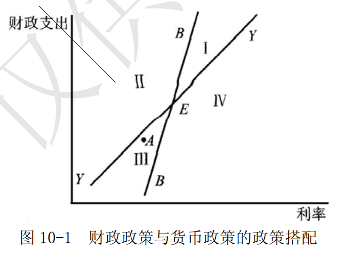

# 第 10 章 内外均衡理论

> **本章核心问题**：如何同时实现内部均衡和外部均衡？丁伯根法则和米德冲突有何含义？政策如何配合？

## 本章脉络

战后头二十年的宏观经济学是封闭经济的学问：布雷顿森林体系把汇率钉住，凯恩斯的需求管理只管国内一摊事。但 1950 年代欧洲复兴、美元先是短缺后是过剩，国际收支重新变成每天要面对的政策问题——于是出现了本章的三步推进。第一步是米德（1951）发现问题：固定汇率下，用财政货币两件总量工具同时追求内部与外部均衡，经常遇到「一松一紧左右为难」的困境，即米德冲突。第二步是丁伯根（1952）给出计数原则：有几个独立目标，就至少要有几件独立工具——「两种目标，两种工具」由此成为政策搭配的宪章。第三步是蒙代尔（1962）解决配对：不仅要有两件工具，还要配得对——把内部均衡分派给财政政策、外部均衡分派给货币政策，经济才会收敛而不是发散。本章站在第 7 章货币政策与第 8 章汇率理论的交汇处：正是固定汇率捆住汇率工具，才逼出了这一整套搭配学问。

## 核心概念

### 支出调整政策

支出调整政策是指通过影响国内收入和国内总支出，或者通过控制货币供给量、收缩或扩张国内投资和消费总需求来调控国内总供给与总需求以达到内部均衡目标的宏观经济政策。
支出调整政策主要由凯恩斯理论所表明的需求管理政策，即财政政策和货币政策组成。通过实施支出调整政策可达到相对于收入而改变支出水平的目的。
若为调节国际收支，财政政策与货币政策仍需通过改变整个宏观经济来影响进出口需求和出口供给，以达到外部的均衡目标。显然，支出调整政策为实现外部均衡所做的努力将会对国内经济形成较大的冲击，调整的代价过大。

### 支出转换政策

支出转换政策是指能够影响贸易商品的国际竞争力、通过改变支出构成而使本国收入相对于支出增加的政策。
主要包括：汇率政策和关税、出口补贴、进口配额限制等直接管制措施。狭义的支出转换政策专指汇率政策。

它与支出调整政策的分工是本章的支点：调整政策改变支出的「总量」（花多少），转换政策改变支出的「构成」（花在国产还是进口上）。内外均衡之所以需要两件工具，正是因为总量与构成是两个独立维度。

### 丁伯根法则

丁伯根法则是由荷兰经济学家扬·丁伯根提出的政策目标与政策工具配置原则。丁伯根是 1969 年首届经济学奖共同得主之一。
其基本内容是，为实现一个独立的经济目标，至少需要一种独立且有效的政策工具；为实现 n 个彼此独立的目标，至少需要 n 种独立且有效的政策工具。这一原则为用不同政策配合同时实现内外均衡提供了依据。

### 米德冲突

米德冲突是指在某些情况下，单独使用支出调整政策——货币政策和财政政策追求内、外部均衡，将会导致一国内部均衡与外部均衡之间的冲突。在开放的经济环境中，宏观经济政策不仅要实现内部均衡，即稳定通货，还须实现外部均衡，即保持国际收支平衡，以实现经济增长和充分就业。一般地，是以财政政策和货币政策实现内部均衡，以汇率政策实现外部均衡。固定汇率制度下，汇率工具无法使用。要运用财政政策和货币政策来达到内外部同时均衡，在政策取向上，常常存在冲突。但国际收支逆差与国内经济疲软并存，或是国际收支顺差与国内通货膨胀并存时，财政、货币政策都会左右为难，经济学上称之为米德冲突。为避免米德冲突，需要为不同的目标制定不同的政策，即满足所谓的丁伯根法则：要实现 n 个经济目标，必须具备 n 种政策工具。则为解决米德冲突，同时实现内外均衡，两种政策工具必须配合使用。

### 内外均衡

内外均衡是指经济的对内与对外均衡。
所谓实现经济的对内均衡，主要是指国内的总供给等于总需求，既实现资源的充分配置、物价稳定，同时可以获得有保证的经济增长。
所谓实现经济的对外均衡，主要是指一国与外部经济体之间的经济流入量和流出量相等，国际收支处于平衡状态。但一国同时实现内外均衡是较为困难的。
当一国经济失衡时就需要调整，以恢复经济的对内和对外的均衡，以求经济的平稳增长。

## 问题与分析

### 内外均衡理论的基本思想是什么？

内外均衡理论，是指英国米德的「两种目标，两种工具」的理论模式，即一国如果希望同时达到内部均衡和外部均衡的目标，则必须同时运用支出调整政策和支出转换政策两种工具。

- （1）内部均衡和外部均衡的含义

假设一国经济分为生产贸易品的贸易部门和生产非贸易品的非贸易部门，则内部均衡被定义为国内商品和劳务的需求足以保证非通货膨胀下的充分就业，也即非贸易市场处于供求相等的均衡状态；外部均衡指经常项目收支平衡，也即贸易商品的供求处于均衡状态。

- （2）要实现内外均衡，两种政策工具必须配合

央行调控的最终目标在于内部均衡和外部均衡的实现。然而，宏观政策有可能导致内外均衡的冲突。为避免「米德冲突」，需要为不同的目标制定不同的政策，即满足丁伯根法则，要实现几个经济目标，必须具备几种政策工具，并相互配合。

- （3）支出调整政策和支出转换政策的组合

支出调整政策主要由凯恩斯理论所表明的需求管理政策组成，用于调整支出水平。支出转换政策指能够影响贸易品竞争力、能够通过调整支出构成而增加本国收入的政策，如汇率、关税、出口补贴、进口配额限制等。狭义的支出转换政策专指汇率政策。

- （4）实践中的操作

多数国家以货币政策维持内部均衡，用汇率政策和直接管制的结合来维持外部均衡。因为：
- ①财政与货币政策相对于支出转换政策于达到内部均衡更有利，而汇率政策与直接控制对外部均衡的调节更有效。
- ②直接控制与汇率政策的结合能够实现总量与结构调整的统一。

- （5）评价

应当注意的是，汇率、利率作为经济杠杆调节内外均衡，能否实现预期的效果取决于诸多因素。其中进出口商品的价格弹性、利率市场化程度、资本市场开放程度是比较关键的三个因素。一国货币的升贬值能否改善贸易收支，利率的变动能否引起投资需求的变动以及国际资本的流动对于上述政策和效力具有决定性作用。在市场不发达、经济中行政干预较多的国家，上述以市场传导机制为基础的政策搭配的效力将大打折扣。

## 综合论述

### 蒙代尔的政策配合说讲了什么？

1962 年，在蒙代尔向国际货币基金组织提交的题为《恰当运用财政货币政策以实现内外稳定》的报告中，正式提出了「政策配合说」。其特色在于它强调以货币政策促进外部均衡，以财政政策促进内部均衡的政策主张。

- （1）政策配合说的主要内容

蒙代尔认为，财政政策与货币政策对国际收支与名义收入有着相对不同的影响。因此，在固定汇率制度下，一国也存在两种独立的政策工具来实现内外两方面的经济目标。比如，紧缩性财政政策趋于降低利率，而紧缩性货币政策则会提高利率。在其他条件不变的情况下，本国利率提高会改善资本账户收支，而本国利率下降则会恶化资本账户收支。由此可见，财政政策与货币政策的取向如果都是紧缩的，对国际收支也会分别有不同的作用。所以，只要对财政政策与货币政策合理搭配使用，就有可能同时实现内外均衡。

- （2）政策搭配原理的图形分析

政策搭配原理如图 10-1 所示，横轴表示利率水平，代表货币政策；纵轴表示政府财政支出水平，代表财政政策。 BB 线为外部均衡线，该线上任意一点都代表由一定的利率水平与财政支出的组合而达成的国际收支均衡状态。YY 为内部均衡线，线上任意一点都代表使国内均衡得以实现的利率水平与财政支出的组合。在图 10-1 中Ⅰ：国际收支盈余、通货膨胀；Ⅱ：国际收支赤字、通货膨胀；Ⅲ：国际收支赤字、失业；Ⅳ：国际收支盈余、失业。

现假定一国经济处于 A 点，即处于失业与国际收支赤字并存的失衡状态——内外部都不均衡。有一种政策搭配方案，可以将经济调整到内外部均衡状态。即以货币政策来解决国际收支赤字问题，以财政政策来解决失业问题。从 A 点开始，先实行紧缩性货币政策，提高利率，使之逼近 BB 线，国际收支平衡；接着，实行扩张性财政政策，增加财政支出，使之逼近YY ，缓解国内失业。如此交替使用紧缩性货币政策和扩张性财政政策，就可以一步一步地向内外全面均衡状态逼近，并最终达到全面均衡点。

- （3）最佳政策配合设计

由此，蒙代尔得出了他的政策「分派原则」：在固定汇率制下，只有把内部均衡目标分派给财政政策，外部均衡目标分派给货币政策，方能达到经济的全面均衡。这即是蒙代尔的「政策搭配理论」（见表 10-1）。依据这样的思路，有一个最佳政策配合的设计：

| 经济失衡状态 | 通货膨胀国际收支盈余 | 失业国际收支盈余 | 通货膨胀国际收支赤字 | 失业国际收支赤字 |
|:-----------:|:------------------:|:---------------:|:------------------:|:---------------:|
| 最佳政策配合 | 1.紧缩性财政政策 2.扩张性货币政策 | 1.扩张性财政政策 2.扩张性货币政策 | 1.紧缩性财政政策 2.紧缩性货币政策 | 1.扩张性财政政策 2.紧缩性货币政策 |

## 局限与后续

- **丁伯根法则被后来的分析放松了。** 布兰查德和索洛（1968）指出，工具数等于目标数并非硬约束：一件工具可以同时影响多个目标，只要把不同目标分派给对各自反应最灵敏的那件工具即可——这正是蒙代尔分派原则的一般化形式，也说明「几种工具配几个目标」的算术本身不解决问题，关键在于工具的相对效果。
- **分派原则依赖资本流动性这个前提。** 蒙代尔的结论建立在「利率变动通过资本账户强烈影响外部均衡」之上。1960 年代西欧资本管制仍普遍时，这个前提在多数国家并不成立；而资本高度流动的今天，同一逻辑又导致政策空间被压缩。实践中央行还能动用冲销操作（Sterilization）对冲外汇占款，财政与货币的「分工」远不像表格那样清晰——中国的经验就是一个明显例子。
- **固定汇率这个舞台本身消失了。** 整章的问题意识来自布雷顿森林体系下汇率不能作为工具使用。1973 年主要货币转向浮动之后，米德冲突的表现形式变了：汇率可以自己动，内外均衡的冲突部分被汇率波动吸收，剩下的则被重新表述为「不可能三角」——货币政策独立性、汇率稳定、资本自由流动三者的取舍（详见第 8 章汇率理论与第 9 章国际货币体系）。蒙代尔因这套搭配理论获得 1999 年诺贝尔经济学奖，其模型也早已从「如何搭配」演进为「如何取舍」。
