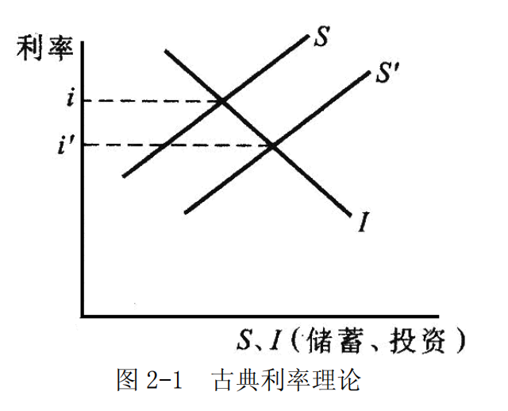
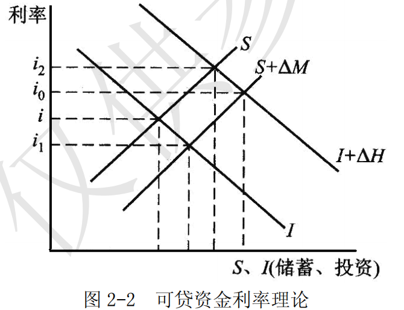
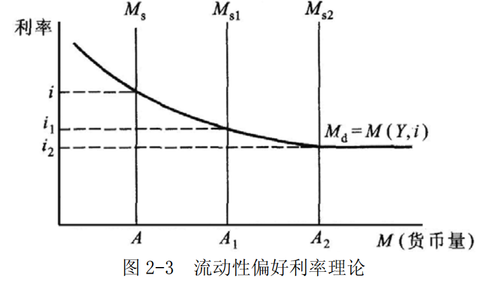
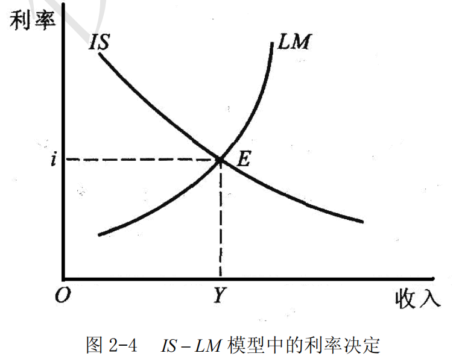

# 第 2 章 利率理论

> **本章核心问题**：利率如何决定？利率有哪些类型和结构？利率变动如何影响经济？

## 本章脉络

本章先给五个概念、再讲四段理论，这个顺序不是编排上的方便，而是利率这个对象本身决定的：「利率」从来不是一个数，而是一族价格——不同期限、不同风险、不同币种各有一个利率，它们之间还需要有一个能互相牵动的锚。所以必须先说清「一笔收益怎么折算成资本额」（收益的资本化）、「契约上写的利率和真实负担的利率是不是一个东西」（名义与实际）、「这一族价格里哪一个是被政策拧动的」（基准利率）、「利率和持有债券实际赚到的收益率差在哪」（利率与收益率）、「短长两个期限上为什么各有行情」（短期与长期）。词汇表立起来之后，理论部分才是可理解的：四段理论实际是三次追问的接力。第一次追问发生在 19 世纪末到 20 世纪初——利息是不是放弃消费的报酬？古典理论（庞巴维克、马歇尔、费雪《利息理论》1930）回答「是」，利率由储蓄与投资这两条实际力量的均衡决定。第二次追问由大萧条逼出来：1930 年代利率跌到历史低位，投资却依然萎缩，说明「利率低自然有人借」这条链条断了。罗伯逊在 1930 年前后把银行创造的货币与窖藏加进供求（可贷资金理论），凯恩斯 1936 年《通论》第 13—15 章走得更远，主张利率根本不是储蓄的报酬，而是放弃流动性的报酬，由货币的存量供求决定。第三次追问是两条线索怎么合并：希克斯 1937 年《凯恩斯先生与古典学派》把储蓄—投资与货币供求写进同一方程组，汉森在 1949 年前后把它普及为教科书图形，这就是 IS-LM。至于本章末尾「利率如何影响经济、需要什么条件」一节，它的现实背景是战后各国把利率当成调控枢纽，以及 1970 年代滞胀暴露出的一个难堪事实——以名义利率衡量「资金贵不贵」会得出完全相反的结论（1970 年代名义利率高达两位数，实际利率却接近零甚至为负）。今天各国央行以短期政策利率作为操作锚（美联储的联邦基金目标利率、中国人民银行的 7 天期逆回购操作利率），本章的概念与理论正是理解这套锚机制的准备工作。

## 核心概念

### 收益的资本化

收益的资本化是指，由于利息已转化为收益的一般形态，于是任何有收益的事物，即使它并不是一笔贷放出去的货币，甚至不是真正有一笔实实在在的资本存在，也可以通过收益与利率的对比而倒过来算出它相当于多大的资本金额。

这个看似迂回的命题是整章的地基，因为它把「利率」从一个借贷条款变成了通用的定价工具。逻辑是：如果一笔货币无论投向何处都能得到利率 i，那么任何年收益为 R 的东西——一块地、一张债券、一家企业、一项专利——其市价必然趋向 R/i，否则资金会流向回报更高的一方。19 世纪的经济学家已经注意到这个换算的荒谬之处：土地并不是资本，地租也不是利息，可土地价格确实按这个公式形成。所以资本化不说明土地本身在生息，而说明在借贷关系普遍化的社会里，一切收益都会被折算成「相当于多少货币」。它的实用后果贯穿后面各章：第 8 章用汇率与利率比较两国资产收益、第 10 章用贴现思路评估股票与债券的价值，都是这一公式的应用；而在政策上，它意味着利率变动会直接改变一切资产的估值——2022 年美联储加息压平全球风险资产价格，机制正是分母上的 i 抬高了。

### 名义利率和实际利率

名义利率是指以名义货币表示的利率，是借贷契约和有价证券上载明的利息率，也就是金融市场表现出的利率。
实际利率是指名义利率剔除了物价变动（币值变动）因素之后的利率，是债务人使用资金的真实成本。
当一般物价水平不变时，名义利率与实际利率是等量的。在名义利率不变的情况下，物价水平的波动会导致实际利率的反向变动。
关系式为：
$$名义利率=实际利率+通货膨胀率$$或者：
$$实际利率=名义利率-通货膨胀率$$

需要立刻补一句：这是近似式。准确的费雪关系是 $(1+名义利率)=(1+实际利率)(1+通货膨胀率)$，低通胀时两者差别可以忽略，通胀达到两位数时误差不小。之所以仍普遍写成加减式，是因为它把关键结论说得最清楚：决定真实成本的是实际利率，而实际利率无法从任何行情板上直接读到——它要用一个尚未公布的通胀预期去减。这正是它在政策上争议不断的原因。1970 年代美国名义利率升到两位数，企业和居民感觉「钱不贵」，因为通胀预期更高，实际利率接近零，于是借钱与囤积实物都划算；等到沃尔克把通胀压下来，才暴露出此前实际利率长期被低估、投资被过度刺激。中国的对应经验是 1988 与 1994 年两轮高通胀期间的「保值储蓄」：当通胀率超过一年期定存利率时，存款实际利率为负，居民转向实物与保值贴补，银行长期存款无人问津，最后由保值贴补率把实际利率补回正值。这个案例最能说明本章为什么要单列这一对概念：名义利率是政治可观察的量，实际利率才是经济决策所依据的量，两者一旦背离，政策的信号就失真了。

### 基准利率

基准利率是指带动和影响其他利率的利率，也称为「中心利率」。
基准利率主要表现为中央银行的再贴现率，即中央银行向其借款的银行收取的利率。基准利率的变动是货币政策的主要手段之一，是各国利率体系的核心。中央银行一般通过改变该利率影响银行的借贷成本，进而影响市场利率。

这一概念要处理的问题是：一个经济体里有几百种利率，货币当局若要撬动它们，必须知道从哪一处下手。教科书以再贴现率为典型，反映的是 20 世纪中叶以前的现实——当时再贴现是央行主要的调控手段，且贴现窗口是商业银行获取准备金的常规渠道。1951 年美联储与财政部达成协议、独立决定利率之后，公开市场操作逐渐成为主导工具，锚的位置随之移到联邦基金利率：央行不再规定银行贷款利率的上下限，而是把银行间隔夜资金的价格钉在目标上，让其他利率自己重排。中国的轨迹同向：2024 年中国人民银行明确以 7 天期逆回购操作利率为主要政策利率，利率走廊宽度收窄到围绕该利率各 50 个基点，中期借贷便利（MLF）的政策色彩淡去，贷款端则通过贷款市场报价利率（LPR）与政策利率挂钩。读这一段时应把「再贴现率」替换为自己所在市场的「隔夜政策利率」，但概念不变：基准利率的本质是当局唯一能直接设定的那一个价格，其他利率靠传导机制跟随——传导是否顺畅，正是本章「问题与分析」第三节与第 7 章货币政策要检验的事。

### 利率与收益率

利率是利息率的简称，是一定时期内利息额与贷出资本额的比率。利率体现着生息资本额的增殖程度，是衡量利息量与本金之比的尺度。
收益率是向证券持有者支付的利息加上以购买价格百分比表示的价格变动率。持有债券从时间 $t$  到时间 $t+1$ 的收益率公式为：

$RET = \frac{C + P_{t+1} -P_{t}}{P_{t}}$

其中, $RET$  为债券持有时间 $t$  到时间 $t +1$ 的回报率，
$P_{t}$  为 $t$  时该债券的价格；
$P_{t+1}$  为 $t +1$ 时该证券的价格;
$C$ 为息票利息。

利率是利息与本金的比率，但这不能准确衡量在一定时期内投资人持有证券所能得到的收益状况。收益率能准确衡量在一定时期内投资人持有证券所能得到的收益状况。

分开这两个概念的实际用途，是防止一类常见误判：一只票面利率 3% 的十年期国债，在市价跌到 90 元时，持有者当年可能既拿到 3 元利息又亏掉 3 元本金，收益率为负；而一个新买进的投资者，预期收益率却高于 3%。前者是事后会计量，后者是事前决策量，两者符号都可能相反。市场评论常用「收益率上升」描述债市暴跌，若把它读成「利率上升对投资者有利」，就会得出完全错误的结论。本章后面各理论与第 10 章债券定价，实际都在同一个式子上打转：把 $P_{t+1}$ 用未来现金流折现代替，收益率就变成了到期收益率，价格则成为利率的倒数函数——利率与债券价格反向变动这条规则，来源即在此。

### 短期利率和长期利率

金融市场上的利率种类根据期限可分为短期利率和长期利率。
短期利率反映的是货币市场上各种借贷利率，长期利率反映的是资本市场上各种借贷利率，因此利率在两个市场上形成不同的利率水平，短期利率一般低于长期利率。但是，由于两个市场是密切联系的，利率的变动会导致资金在各个市场间的流动，同时资金的流动又会引起利率的变动，因而，利率在两个市场是被联系在一起的，短期利率和长期利率同时升降，但短期利率的波动幅度往往大于长期利率。

「短期一般低于长期」要加一个限定：这是正常条件下的经验规律，其理由有三种说法——预期未来短期利率上升、长期借贷要补偿流动性牺牲（流动性升水）、借款人与贷款人在期限上本就分居两端（市场分割与期限选择）。三种说法分别在第 3 章的预期理论与第 10 章的收益率曲线中各自成为分析对象。限定必须写清，因为倒挂是真实存在的现象：美国在 1969、1973、1981、1989、2000、2006、2019、2022 年多次出现十年期国债收益率低于短期利率的情形，成因通常是央行把短期利率抬到高于市场认可的长期水平；「倒挂预示衰退」在这些年份大多成立，但把它当作可靠预言并不稳妥——1969 年的倒挂对应的是短暂衰退，2022 年起的倒挂在此后两年内也没有伴随深度衰退。至于「短期波动幅度大于长期」，其算术理由很干脆：长期利率近似于未来一串短期利率的平均，平均值的波动必然小于分量的波动，因此短端反映政策动作，长端反映预期与风险补偿——这为下面凯恩斯理论把重点全放在短端提供了理由，也为后来「央行只能控制前端」的现实留了伏笔。

## 问题与分析

### 利率真能只由储蓄与投资决定吗？古典理论的机制与它的漏洞

古典利率理论的主要思想为：利率由投资需求与储蓄意愿的均衡所决定。
投资是对资金的需求，随利率上升而减少，储蓄是对资金的供应，随利率上升而增加，利率就是资金需求和供给相等时的价格，如图 2-1 所示。

一般情况下，一方面，利率越高，储蓄越多。储蓄是利率的递增函数： $S=f(i)$ 。
另一方面，利率越低，投资量越大，投资是利率的递减函数： $I=q(i)$  。
储蓄和投资都是利率的函数。
i 为储蓄与投资相等时所表示的均衡利率水平。
如果储蓄增加，而投资不变，均衡利率水平就会降低至  $i^{'}$  。

这套分析的价值在于它给出了利率的实证含义：均衡利率不是当局规定的，而是两条意愿曲线的交点，任何抬高或压低它的做法都会造成储蓄与投资的缺口。它的漏洞在 1930 年代被指出两处。第一处是循环论证：投资不仅取决于利率，也取决于企业预期与产能利用率，储蓄主要取决于收入而非利率——而收入水平又反过来由投资决定；要在收入未定时画出两条只随利率移动的曲线，逻辑上不闭合。第二处是经验：1933 年美国长期利率已低至 3% 上下，投资几乎停摆，「利率够低自然有人借」在数据上站不住。这两处批评分别由凯恩斯（收入与预期）与罗伯逊（货币因素）提出，正是下面两个理论的起点。今天看，古典理论仍被保留的部分是它对实际因素的强调——人口结构、财政赤字、技术进步速度决定长期实际利率走向，这一思路在 2000 年后关于「全球储蓄过剩」与「长期停滞」的辩论中复活（伯南克 2005、萨默斯 2014），用来解释为什么发达国家长期利率在低通胀年代持续下行，而这不是任何央行能决定的。

### 把货币因素加进来，答案会怎样改变？

可贷资金利率理论是古典利率理论的逻辑延伸和理论发展，创立于 20 世纪三四十年代。可贷资金利率理论一方面继承了古典利率理论基于长期实际经济因素分析的理论传统，另一方面开始注意货币因素的短期作用，并以流量分析为线索。

可贷资金利率理论认为，利率由可贷资金的供求决定。可贷资金的供给包括：
	- 总储蓄 $S$
	- 银行新创造的货币量 $\Delta{M}$ 。

可贷资金的需求包括：
	- 总投资 $I$ ；
	- 因投机动机而发生的闲置货币储存金额的增加 $\Delta{H}$ 。

而利率会使资金供需相等，即：

$$I+\Delta{H}=S+\Delta{M}$$

图 2-2 中的 $i$ 为古典利率均衡水平。
当可贷资金供给增加，而可贷资金需求不变时，利率下降至 $i_1$ ；
当可贷资金需求增加，而可贷资金供给不变时，利率上升至 $i_2$ ；
$i_0$  为全部可贷资金供给与可贷资金需求的新的均衡利率水平。
可贷资金总量在很大程度上受中央银行的控制，因此政府的货币政策便成为利率的决定因素而必须考虑。

关键改动在 $\Delta M$ 与 $\Delta H$ 两项。$\Delta M$ 承认银行可以在储蓄之外凭信贷创造新的购买力，因此利率并不受当期储蓄的硬约束，这一点在战时融资与后发国家的投资扩张中尤其明显；$\Delta H$（窖藏）则承认人们可能既不消费也不投资，而是把钱按住不动——古典体系里没有这个位置。把这两项写进等式后，央行进入利率决定式，这是理论史上第一次把货币政策列为利率的内生因素，其政策含义在第 7 章会全面展开。这个理论也有一个被托宾等人指出的结构缺陷：等式左边是流量、右边混着存量调整，$\Delta H$ 与 $\Delta M$ 本身又取决于利率和收入，于是「谁决定谁」的问题并未真正解决，只是把古典的循环扩大了一圈。它更适合作为理解「信贷市场资金松紧」的语言，而不是一个自洽的均衡理论——日常所说的「银根松紧」「资金面」，用的正是这套流量语汇。

### 利率是放弃流动性的报酬吗？凯恩斯的回答

流动性偏好利率理论是由凯恩斯在 20 世纪 30 年代提出的，是一种偏重短期货币因素分析的货币利率理论。

- （1）根据流动性偏好利率理论，货币需求分为三部分：
	- ①交易性货币需求，是收入的函数，随收入的增加而增加；
	- ②预防性货币需求，随着收入的增加而增加，随着利率的提高而减少；
	- ③投机性货币需求，是利率的递减函数。货币需求 Md 可表示为收入Y 和利率i 的函数，即 $M_d=M(Y,i)$  。

	货币供给为政策变量，取决于货币政策。

如图 2-3 所示，在未达到充分就业条件下，增加货币供应量，利率将从 $i$  降至 $i_1$ 。
当货币供应量为 $A_2$  时，利率为 $i_2$ ，此时货币需求曲线呈水平状，货币需求无限大，即处于流动性陷阱。此时即使货币供给不断增加，利率也不会再降低。

凯恩斯回答的问题是：为什么人们会愿意持有不生息的现金？他的答案是「流动性本身有价值」——能随时应付意外、能抓住未来的机会，这份便利需要用放弃的利息来衡量其成本。于是持币是资产选择行为，而利率是这种行为的代价，不再储蓄的报酬。理论的重心因此从借贷契约移到「货币供求在某一时点上的存量相等」，收入只决定交易需求，利率则由整个货币量与流动性偏好共同决定。三点需要补注：其一，把预防性需求写成利率的函数是较晚的结论（惠伦 1951 的证明），凯恩斯本人倾向把它归入收入函数；其二，投机需求依赖一个隐含判断——每个人心中有一个「正常利率」，高于它则预期债券价格下跌而持有现金，低于它则反之，这条逻辑把第 4 节的收益率公式变成了利率决定的微观基础；其三，图 2-3 中的水平段（流动性陷阱）不是理论装饰，而是 1990 年代后日本与 2008 年后欧美反复出现的现实：短期利率贴近零，此时新增货币被自愿持有，扩张无法再压低利率。顺带一提，$A_2$ 是图上的货币供给量标号，读作「货币供给增至该水平」即可。

- （2）流动性偏好利率理论与可贷资金利率理论之间的区别是：
	- ①流动性偏好利率理论是短期货币利率理论，强调短期货币供求因素的决定作用；可贷资金利率理论是长期实际利率理论，强调实际经济变量对利率的决定作用。
	- ②流动性偏好利率理论中的货币供求是存量；而可贷资金利率理论则注重对某一时期货币供求流量变化的分析。
	- ③流动性偏好利率理论主要分析短期市场利率；而可贷资金利率理论则将研究的重点放在实际利率的长期波动上。

流动性偏好利率理论与可贷资金利率理论之间并不矛盾。可贷资金利率理论中使利率变动的全部因素，在流动性偏好理论中也会促使利率变动。同样，流动性偏好理论中的货币供求构成了可贷资金利率理论的一部分。

## 综合论述

### 两个市场怎么同时给出一个利率？新古典综合的分析

利率水平是研究利率量的决定，即利率究竟是多少的问题。英国著名经济学家希克斯和美国经济学家汉森，在总结古典利率理论和可贷资金利率理论以及凯恩斯的利率理论基础上提出了著名的 $IS-LM$ 分析法。

西方经济学家在运用 $IS-LM$ 型分析法分析经济时，是将国民经济的均衡看成是实物方面的均衡与货币方面的均衡，即市场被划分为商品市场及货币市场。 $IS$  线表示使商品市场的供求相均衡的利率与收入组合； $LM$  线表示货币市场的供求均衡时的利率与收入组合； $IS$  线与 $LM$ 线的交点就是同时使商品市场和货币市场相均衡时的利率与收入组合。在这点所决定的利率为均衡利率，所决定的收入为均衡收入，在均衡利率和均衡收入支配下，整个国民经济实现了均衡。

图 2-4 中， $IS$  线表示商品市场的均衡 $I = S$ ； $LM$  曲线表示货币市场的均衡 $L=M$ ；将这两条曲线放在同一坐标系内，两条曲线相交的均衡点 $E$  同时满足两个条件：
	- $I=S$
	- $L=M$

因此，只有在 $E$  点上两个市场才能同时达到均衡，此点决定的利率 $i$ 是同时满足两个市场均衡条件的均衡利率； $Y$  是同时考虑两个市场均衡条件下的均衡国民收入。

当  $IS$  和  $LM$  曲线发生移动时，均衡利率必然也发生相应变动。由于 $IS$  的变动是由投资或储蓄的变动引起的，$LM$  的变动是由货币供给或货币需求的变化引起的，因此，这些变量的改变都将改变均衡利率。

希克斯的贡献不在于发明新机制，而在于承认前两个理论各说了一半：古典与可贷资金说的是商品市场，凯恩斯说的是货币市场，而两个市场的共同解必须同时给出利率与收入。这正好补上第一节指出的循环论证——收入不再被当作给定，它和利率由两个方程联立求出。要留意这一合并的代价：IS-LM 把三种期限不同、性质不同的价格压成了一个 $i$，现实里短端由政策决定、长端由预期与风险补偿决定，两者可以朝相反方向移动（2022 年短端急升而长端平稳正是典型），静态交叉图对此无能为力。此外，被合并进来的凯恩斯部分是 1937 年希克斯对《通论》的解读版本——把预期写成了确定性的函数关系，而《通论》第 12 章反复强调的「根本的不确定性」在图中消失了；这也是 1960—70 年代英国后凯恩斯学派（卡尔多的学银委员会论文、伊迪瑟里与伍德）攻击 IS-LM 的主要阵地，以及希克斯本人在 1980 年撰文《IS-LM：一个解释》时对这张图表示不满的原因。

### 利率对一国经济会产生怎样的影响？其制约条件是什么？

利率是一定时期内利息额与贷出资本额的比率，是金融活动中的一个重要变量。它的变化可以通过影响借贷双方的利益影响经济活动的其他变量，而对经济活动产生影响。

- （1）利率对一国经济的影响具体表现为：
	- ①利率对消费和储蓄的影响
		由于利率是储蓄者提供生息资产的收益，当利率较高时，生息资产的收益提高，即期消费的机会成本增加，居民就会减少即期消费，增加储蓄；同时，也会减少手持现金量，增加生息资产的供给。而高利率也会缩减企业的生产规模，这会导致居民收入下降，购买力减少，消费减少。

	这里要防止把结论说成单向。利率上升同时产生替代效应（未来消费变便宜，转向储蓄）与收入效应（储蓄者未来收入更厚，反而敢多消费），两者方向相反，净效应在经验上难以判定。跨国家庭数据的共识是储蓄对利率的弹性很小：1980 年代多国加息并未带来储蓄率的显著上升，1990—2010 年发达国家长期利率持续下行期间家庭储蓄率也没有如古典理论预期的那样收缩（美国个人储蓄率反而在 2005 年后大幅走高）。承认弹性小，反而能理解政策为什么必须靠更硬的渠道起作用——不是「让居民多存钱」，而是让借钱买房办厂变贵，见下面的投资与金融渠道。

	- ②利率对投资的影响
		 利率是企业投资的成本，利率越高，成本越大，生产和投资收益越低，投资规模会缩小。反之，低利率则会减少投资成本，使投资量增加。

	- ③利率对通货膨胀的影响
		 在一个市场化程度较高的社会中，运用高利率可抑制投资的过度，因此可以防止通货膨胀的发生；当经济萧条时，通过降低利率，可防止过度紧缩。

	- ④利率与金融机构
		利率的变动会促使银行等金融机构调整其资产负债结构，以求在利率变动的情况下增加收益或控制成本。这种影响使中央银行利用利率影响信贷量和流向进而调控宏观经济成为可能。

	第 ④ 点在 2008 年后有了具体的教训：银行资产端多为中长期固定利率贷款、负债端为短期浮动存款，低利率环境压窄净息差，同时鼓励银行「借短投长」以挣期限利差。美国硅谷银行 2022—2023 年的倒闭正是这个结构的反面：加息使资产端长期证券浮亏、负债端存款成本上升并同时流失，利率变动不再只是「调整结构的机会」，而直接成了清偿力问题。第 6 章的金融监管与本章这一段，接合点就在这里。

	- ⑤利率与对外经济活动
		在一个对外开放的国家中，经济是与世界市场紧密相联的，利率的变动将影响一国对外经济活动，这表现在两个方面：
		- 一是对进出口的影响；
		- 二是对资本输出输入的影响。

		当利率水平较高时，企业生产成本增加，产品价格提高，出口竞争能力下降，出口量减少，从而会引起一国对外贸易的逆差。
		相反，降低利率会增强出口生产企业的竞争能力，改善一国对外贸易收支状况。从资本输出输入看，在高利率的诱惑下，外国资本会迅速地流入，特别是短期套利资本，这虽然可以暂时缓解一国国际收支的紧张状况，但在高利率情况下的外国资本注入也会带来许多不良后果。如通货膨胀的输入、沉重的还本付息负担等，有可能会造成国际收支状况的恶化。利率对经济的调控和影响作用由于其决定因素的复杂多样性而难以用以上几个方面给予全面解释，只能择其要点而概之。

	资本流动这一支的实际力量在 1997 年之后远超教科书想象：利差与汇率预期共同决定短期资本的来去，而它的速度使「先加息吸引资金、再保汇率」的组合可能同时失败（第 1 章内外均衡理论与第 8 章的危机案例）。1990 年代初俄罗斯与阿根廷为稳汇率把利率抬到数百个百分点、1997 年东南亚各国为守住钉住而大幅加息、2024 年日本央行缓慢退出负利率导致日元与套息交易剧烈重定价，这些案例都说明第 ⑤ 点不是五个影响中的最后一个, 而常是最先发作的那一个。

- （2）制约利率发挥作用的条件

	利率以上作用的发挥及作用的大小，取决于是否具备或在多大程度上具备利率有效发挥作用的条件。这些条件是复杂的，可概括为以下主要方面：

	- ①一国经济中微观主体的独立性程度，及其对利率的敏感程度。
		利率调节是通过影响微观主体的利益来实现的，因而微观主体是否是独立决策的经济实体，关系到它们预算约束的有效性，对利率变动能否做出及时快速反映。

	- ②金融市场的发达程度。
		一国金融市场的发达程度是利率能否在各市场间迅速传导信息并引导资金流动的前提。

	- ③利率结构和利率决定的市场化程度，以及中央银行是否以利率作为宏观调控的工具等因素也会影响利率作用的发挥。
		利率能否直接真实反映市场供求，中央银行能否借助工具影响市场利率，决定利率是否可以作为调节宏观经济工具，和发挥调节作用的程度。

这三条约束条件在中国 1980—90 年代的争论中有确切对应：当时国有企业与地方政府对利率极不敏感（预算软约束，科尔奈的概念），利率一升便要求财政贴息，于是「用利率调节投资」在微观层面无法成立；改革的路径因此不是先调利率，而是先硬化约束、发展银行间与债券市场、再逐步放开利率管制——1996 年放开银行间同业拆借、2007 年上海银行间同业拆放利率（Shibor）报价运行、2013 年 7 月取消贷款利率下限、2015 年 10 月放开存款利率浮动上限、2019 年 8 月贷款市场报价利率（LPR）改为「政策利率加点」形成机制。这条时间线正好是上述三个条件依次被创造出来的过程，也说明本章末节为什么重要：利率理论的机制写在纸上，能不能用则取决于一套制度是否已就位。

## 局限与后续

- **四段理论并没有被合成一个被普遍接受的模型，今天仍按用途分工。** 现代央行实践与主流教材（如米什金《货币金融学》）大致这样用它们：解释政策能直接控制什么用流动性偏好（短端由货币供求与政策决定），解释资金松紧与信贷扩张用可贷资金（流量视角），解释长期利率的漂移用实际因素（储蓄—投资、人口与技术，即「自然利率」谱系，从维克塞尔经哈维·莫迪利亚尼到 2005 年后伯南克的「全球储蓄过剩」与萨默斯的「长期停滞」）。分歧集中在长端：2000—2015 年发达国家长期利率持续下行，是储蓄过剩、安全资产短缺（劳罗盖蒂等）、还是量化宽松压低期限溢价，各派证据至今互不承认。
- **IS-LM 在教科书中心化的同时被其发明者否定。** 希克斯 1980 年后多次表示不满，理由是这个框架把时间、生产结构与不确定性都抹掉了。1970 年代的滞胀暴露出更直接的问题：静态联立解预设通胀率不外生，而在通胀高企时名义利率与实际利率的差别（本章第二个概念）会决定整个图形是否移动——多恩布什与费希尔 1986 年的教科书把通胀预期正式写进 IS-LM，正是为了补这一课；而卢卡斯 1976 年的批判则从根基上质疑这类含历史回归系数的政策分析能否在政策规则改变后仍然成立。
- **流动性陷阱从假设变成过观测，因此利率政策的边界被重新划定。** 日本 1999 年起推行零利率政策、2016 年引入负利率与收益率曲线控制，欧元区 2014 年起存款便利利率为负，美国 2008—2015 年与 2020—2022 年在零利率上停留——这些经验给出的不是「利率理论失效」，而是本章「短期与长期」一节的结论被放大：央行能压住短端，长端要靠预期承诺与资产购买影响期限溢价。围绕非常规工具是否抬高通胀预期、其副作用（对银行息差、对资产价格、对财政纪律）是否值得，学界与各国央行的争论仍在继续，这已超出利率理论本身，进入第 7 章货币政策与第 6 章金融监管的范围。
- **中国的利率体系在十余年间换了一套结构，本章的「基准」定义需要就地更新。** 教材把再贴现率当作基准利率的典型形态，而今天的链条是：政策利率（7 天期逆回购操作利率，2024 年起明确为主要政策利率、利率走廊收窄至围绕它各 50 个基点）→ 货币市场利率（DR007、Shibor）→ 债券收益率曲线 → LPR（贷款市场报价利率，1 年期与 5 年期以上两个品种，按「政策利率加点」每月报价）→ 存款利率（2022 年 9 月起参考 10 年期国债收益率与活期利率确定上限）。数量型工具（存款准备金率）的调控色彩明显淡于 2003—2015 年。因此读本章时应把「基准利率即再贴现率」读作「基准利率即央行可控的短期政策利率」，而本章末节所说「利率市场化程度」这一约束条件，在中国已进入「形式上放开、传导仍在建设」的新阶段——2023 年以来关于存款利率下调、存量房贷利率调整与 LPR 非对称下降的争论，争的正是本章这条传导链上还缺哪一环。
