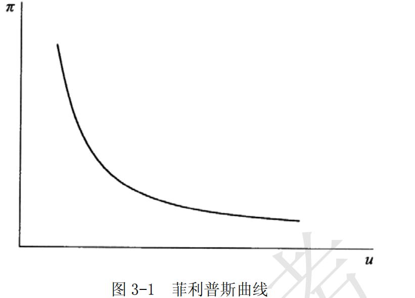

# 第 3 章 通货膨胀与通货紧缩

> **本章核心问题**：通货膨胀和通货紧缩如何衡量？其成因是什么？对经济有何影响？如何治理？

## 本章脉络

通货膨胀在二十世纪才成为常规现象，本章的四问（衡量、成因、效应、治理）就是沿着这条时间线长出来的。衡量之所以要单列一节，是因为指数选择本身决定结论：物价指数最早用于工会谈判（英国 1744、美国劳工统计局 1913 年起编制 CPI），而 CPI、PPI、GDP 平减指数三者的口径差异，直接决定了同一年的「通胀率」可以相差一个百分点以上。成因之争则跟着时代的病灶走：战后重建期物价上涨被归为需求拉上（「过多的货币追求过少的商品」），凯恩斯主义因此把菲利普斯曲线（1958 年的工资数据，1960 年由萨缪尔森与索洛改写成通胀—失业菜单）当作政策工具；1970 年代石油冲击下物价涨而失业也涨，成本推动与通胀惯性成为主流解释，弗里德曼与费尔普斯（1968）的「自然率」假说也在此时被数据证实。治理方案的演变同样由失败推动：收入政策（工资—物价管制）在 1971 年尼克松冻结工资物价后昙花一现，沃尔克 1979 年转向货币紧缩并用严重衰退换回信誉，此后各国改以通胀目标制为默认配置。通货紧缩是这套框架的反面教材：费雪（1933）的债务—通缩理论解释了大萧条中物价下跌如何加重实际债务，日本 1990 年代之后的长期通缩与中国的 1998—2002 年（通缩却保持高增长）则说明「物价跌必然经济差」需要修正——这也是本章第（5）点特意留出例外的原因。

## 核心概念

### 菲利普斯曲线

菲利普斯曲线由英国经济学家 A.W. 菲利普斯首先提出，故得名。菲利普斯 1958 年的原始研究描述的是失业率与货币工资增长率之间的负相关关系；后来经济学界才常将其引申为通货膨胀率与失业率之间的短期替代关系，并用于说明一般价格水平、失业率和总需求之间的关系。

对于菲利普斯曲线具体的形状，不同学派对此有不同的看法。
普遍接受的观点是：
- 在短期内，短期菲利普斯曲线向右下方倾斜
- 长期菲利普斯曲线是一条垂直线，表明失业率与通货膨胀率之间不存在替代关系。

这里要留意曲线经历了两次身份转换。第一次是从工资增长率换成物价上涨率——因为企业把工资成本转嫁到价格，两者近似可比，但这一转换把一条统计规律变成了政策菜单（萨缪尔森与索洛 1960 年的用途正在于此）。第二次是加上预期：弗里德曼与费尔普斯（1968）指出，工人最终会要求名义工资追上物价，于是任何稳定的通胀率都只对应同一个失业率，短期曲线可以移动、长期曲线垂直。这条曲线的历史价值不在方程，而在它说明了一件事——统计规律如果没有微观机制（预期如何形成）托底，就会被政策制定者用到自己反噬为止。
### 通货膨胀

在西方经济学教科书中，通常将通货膨胀定义为商品和服务的货币价格总水平持续上涨的现象。
这个定义包含以下几个要点：
- （1）强调把商品和服务的价格作为考察对象，目的在于与股票、债券以及其他金融资产的价格相区别。
- （2）强调「货币价格」，即每单位商品、服务用货币数量标出的价格，是要说明通货膨胀分析中关注的是商品、服务与货币的关系，而不是商品、服务与商品、服务相互之间的对比关系。
- （3）强调「总水平」，说明这里关注的是普遍的物价水平波动，而不仅仅是地区性的或某类商品及服务的价格波动。
- （4）关于「持续上涨」，是强调通货膨胀并非偶然的价格跳动，而是一个「过程」，并且这个过程具有上涨的趋势。

这四个要点其实是在给「通胀」画边界，每一条都对应一类常见的误判。排除资产价格，是为了不把股价与房价泡沫算进生活成本（这也是 2008 年前「通胀还是资产泡沫」之争的口径问题）；强调货币标价，是因为相对价格变化（某类商品变贵）与整体物价上涨的含义完全不同；强调「总水平」，是为了区分结构性涨价与普遍上涨；强调「持续」，则把一次性价改、税调、灾害冲击与真正意义上的通胀分开——中国在 1988 年与 2007 年都出现过单年 CPI 冲高，判断它是一次性冲击还是通胀过程，直接决定该用紧缩政策还是等待调整。按上涨幅度，通行的分类是温和通胀（一位数）、加速或奔跑的通胀（galloping，几十到几百个百分点）与超级通胀（hyperinflation，物价以日为单位翻倍），后者在 1920 年代的德国、1940 年代的中国、2008 年的津巴布韦与 2017 年后的委内瑞拉都出现过，也最能说明通胀的核心机制是货币与信心的同时崩溃。
### 居民消费物价指数

居民消费物价指数是综合反映一定时期内居民生活消费品和服务项目价格变动的趋势和程度的价格指数。由于直接与公众的日常生活相联系，这个指数在检验通货膨胀效应方面有其他指标难以比拟的优越性。

但它是固定篮子的价格指数，因此带有三类系统性偏差：替代偏差（相对价格变化后消费者会改买便宜货，指数仍按老篮子计）、新品偏差（新商品进入篮子之前不被计入）、质量偏差（涨价可能对应质量提升）。博斯金（Boskin）委员会（1996，美国）估计当时 CPI 每年高估生活成本约 0.8—1.1 个百分点，这个数字直接影响美国社会保障指数化与退休年龄的推算。与它并列的还有两个指标：GDP 平减指数覆盖全部国产商品与服务、篮子随产出结构自动调整，但没有月度频率；生产者物价指数（PPI）反映出厂环节，通常早于 CPI，但能否传导取决于竞争格局。各国央行的操作目标也在这一步分化：美联储盯个人消费支出平减指数（PCE，链式加权、含医疗保险的隐性支出），欧元区与英国盯调和 CPI（HICP，不含自有住房折算租金），中国以 CPI 涨幅为主要调控目标——同一句「保持物价稳定」在不同指数上含义并不相同。此外，中国 CPI 中食品权重高（约三成），猪肉与蔬菜的价格波动就能显著拉动同比读数，这也解释了为什么「食品通胀」在中国常成为政策讨论的焦点。
### 强制储蓄效应

政府如果通过向中央银行借债，从而引起货币增发这类办法筹措建设资金，就会强制增加全社会的投资需求，结果将是物价上涨。在公众名义收入不变的条件下，按原来的模式和数量进行的消费和储蓄，两者的实际额均随物价的上涨而相应减少，其减少的部分大体相当于政府运用通货膨胀实现政府收入的部分。如此实现的政府储蓄是强制储蓄。

这个概念的另一名字是「通货膨胀税」：政府以创造货币的方式取得实际资源，其税基是公众持有的货币，税率就是通胀率。它成立的前提是公众没有把物价上涨要回来——即存在货币幻觉或合同调整滞后。这也解释了它在高通胀下会自我瓦解：卡根（1956）对六次超级通胀的研究发现，物价上涨时人们会立刻抛掉货币换取实物，实际货币余额迅速缩小，于是通胀税的税基随税率提高而坍塌，政府反而收不到多少实际资源。发展中国家 1980 年代关于「通胀是否有助于积累」的争论，以及中国 1980 年代末期关于财政向央行透支的讨论，争的都是这条效应到底有多强。
### 收入分配效应

由于社会各阶层收入来源极不相同，因此，在物价总水平上涨时，有些人的实际收入水平会下降，有些人的实际收入水平反而会提高。这种由物价上涨造成的收入再分配，就是通货膨胀的收入分配效应。

具体到谁赢谁输，规律可以按「合同是否写死」来排：靠固定名义收入生活的人（领退休金者、领取固定工资的职员、持有现金者）最先受损；债务人以贬值的货币还债，债权人收回同样的钱却买回更少的东西，因此财富从债权人向债务人转移；有议价能力、能把工资追上物价的人与能快速调整产品价格的部门几乎不受影响；持有房产等实物资产者则随物价同步升值。由此可以看出，通胀真正的杀伤力不在「大家都变穷」，而在把收入从最没有能力谈判、最没有能力调整的那部分人手里转移出去——这也是它在政治上比税收更隐蔽、也更不公平的原因。
### 滞胀

滞胀是指经济过程所呈现的并不是失业和通货膨胀之间的相互「替代」，而是经济停滞和通货膨胀相伴随，高的通货膨胀率与高的失业率相伴随。这就说明，菲利普斯曲线的描述和推导并非总能成立。

1970 年代的滞胀是宏观经济学最重要的经验事件之一：在旧曲线只能给出「要么通胀、要么失业」的选项时，现实同时给出两者，需求管理因此失灵——刺激会加剧通胀，紧缩会加剧失业。理论上的出路有两条：一条承认供给冲击（石油涨价、粮价冲击使总供给曲线左移），另一条承认预期（通胀预期一旦抬高，短期曲线整体右移，同样的失业率需要更高的通胀）。这两条分别进入了 AD—AS 框架与附加预期的菲利普斯曲线，也直接催生了沃尔克式的信誉重建与后来的通胀目标制。
### 资产结构调整效应

资产结构调整效应也称财富分配效应，是指由物价上涨所带来的家庭财产不同构成部分的价值有升有降的现象。
一个家庭的财富或资产由两部分构成：
- 实物资产
- 金融资产

许多家庭同时还有负债，如借有汽车抵押贷款、房屋抵押贷款和银行消费贷款等。
因此，一个家庭的财产净值是它的资产价值与债务价值之差。
在通货膨胀环境下，实物资产的货币值大体随通货膨胀率的变动而相应升降；
金融资产则比较复杂，如其中的股票与通货膨胀的相关关系极不确定。货币债权债务的各种金融资产，其共同特征是有确定的货币金额。
物价上涨，实际的货币额减少；物价下跌，实际的货币额增多。在这一领域之中，防止通货膨胀损失的办法，通常是提高利息率或采用浮动利率。一般地说，小额存款人和债券持有人最易受通货膨胀的打击。至于大的债权人，不仅可以采取各种措施避免通货膨胀带来的损失，而且，他们往往同时是大的债务人，可以享有通货膨胀带来的巨大好处。
## 问题与分析

### 需求拉上型通胀是怎么形成的？该如何治理？

- （1）需求拉上型通货膨胀的成因

需求拉上或需求拉动型通货膨胀假说，是用经济体系存在对产品和服务的过度需求来解释通货膨胀形成的机理。其基本要点是当总需求与总供给的对比处于供不应求状态时，过多的需求拉动价格水平上涨。由于在现实生活中，供给表现为市场上的商品和服务，而需求则体现在用于购买和支付的货币上，所以对这种通货膨胀也有通俗的说法：「过多的货币追求过少的商品」。

- （2）需求拉上型通货膨胀的治理对策

	- ①针对需求拉动型通货膨胀的成因，治理对策无疑是宏观紧缩政策：
		紧缩性货币政策和紧缩性财政政策。紧缩性货币政策，在银行业中的行业术语叫抽紧银根或紧缩银根。至于紧缩性财政政策的基本内容是削减政府支出和增加税收。

	- ②面对需求拉动型通货膨胀，增加有效供给也是治理之途。
		有些国家采取的「供给政策」，其主要措施是减税，即降低边际税率以刺激投资，刺激产出。
### 没有过度需求，物价还能涨吗？成本推动型通胀的机理与对策

成本推动型通货膨胀也称成本推进型通货膨胀，是一种侧重从供给或成本方面分析通货膨胀形成机理的假说。
其成因可以归结为两点：

- （1）工资推进型通货膨胀
	工资推进型通货膨胀是以存在强大的工会组织，从而存在不完全竞争的劳动力市场为假定前提的。当工资是由工会和雇主集体议定时，这种工资则会高于竞争的工资。面对高工资，企业就会因人力成本的加大而提高产品价格，以维持盈利水平。这就是从工资提高开始而引发的物价上涨。工资提高引起物价上涨，价格上涨又引起工资的提高，在西方经济学中将此称为工资—价格螺旋上升。

	针对工资推进型通货膨胀的成因，治理对策是紧缩性的收入政策：确定工资—物价指导线并据以控制每个部门工资增长率；管制或冻结工资；按工资超额增长比率征收特别税等。如果把工资提高的原因从「存在不完全竞争的劳动力市场」扩展为不论任何原因，则这一说法更具有普遍意义。

- （2）利润推进型通货膨胀
	利润推进型通货膨胀的前提条件是存在着物品和服务销售的不完全竞争市场。如在煤气、电力、电话、铁路、通信等公用事业领域，卖方有可能操纵价格，以赚取垄断利润，这就会增大一般部门的成本开支。不少发达工业国家的价格政策，就包括制定反托拉斯法以限制垄断高价的基本内容。无论是工资推进型还是利润推进型通货膨胀，提出这类理论模型，目的都在于解释在不存在需求拉上的条件下也能产生物价上涨。
## 综合论述

### 物价持续下跌会怎样伤害经济？

通货紧缩是指经济过程大多是伴随有经济负增长的物价水平持续下降，通货紧缩也是不稳定的，物价疲软趋势将从以下几个方面影响实体经济：

- （1）对投资的影响

	通货紧缩会使得实际利率有所提高，社会投资的实际成本随之增加，从而产生减少投资的影响。同时在价格趋降的情况下，投资项目预期的未来重置成本会趋于下降，就会推迟当期的投资。这对许多新开工项目所产生的制约较大。
	
	另一方面，通货紧缩使投资的预期收益下降。在通货紧缩情况下，理性的投资者预期价格会进一步下降，公司的预期利润也将随之下降。这就使投资倾向降低。通货紧缩还经常伴随着证券市场的萎缩。公司利润的下降使股价趋于下探，而证券市场的萎缩又反过来加重了公司筹资的困难。

- （2）对消费的影响

物价下跌对消费有两种效应：
- 一是价格效应。
	物价的下跌使消费者可以用较低的价格得到同等数量和质量的商品和服务，而将来价格还会下跌的预期促使他们推迟消费。
- 二是收入效应。
	就业预期和工资收入因经济增幅下降而趋于下降，收入的减少将使消费者缩减消费支出。

- （3）对收入再分配的影响

	通货紧缩时期的财富分配效应与通货膨胀时期正好相反。在通货紧缩情况下，虽然名义利率很低，但由于物价呈现负增长，实际利率会比通货膨胀时期高出许多。高的实际利率有利于债权人，不利于债务人。

- （4）对工人工资的影响

	在通货紧缩情况下，如果工人名义工资收入的下调滞后于物价下跌，那么实际工资并不会下降；如果出现严重的经济衰退，往往会削弱企业的偿付能力，也会迫使企业下调工资。

- （5）通货紧缩与经济成长

	大多情况下，物价疲软、下跌与经济成长乏力或负增长是结合在一起的，但也非必然。如中国就存在通货紧缩与经济增长并存的现象。

中国 1998—2002 年的经验值得单独说清楚：那是需求不足（亚洲金融危机后出口下滑、国企改革与下岗、消费品供给过剩）与增长并存的一段，物价下跌主要来自供给端的相对改善与短缺经济的终结，而实际 GDP 仍保持 8% 左右的增长。这说明「通缩必然萧条」的命题有条件——只有当物价下跌由债务收缩与预期恶化驱动时，自我强化的螺旋才会启动。费雪（1933）的债务—通缩理论描述的正是后一种情形：物价下跌 → 名义债务不变而实际债务加重 → 债务人被迫抛售资产 → 价格进一步下跌；辜朝明以「资产负债表衰退」解释日本 1990 年代，其机理与费雪一致——企业与家庭的目标从利润最大化转为债务最小化，于是货币政策无论多松都借不出钱，这正是零下限与量化宽松出现的场景。

## 局限与后续

- **衡量本身会影响结论。** 博斯金委员会指出的 CPI 高估意味着「通胀率」这个数并不是客观给定；能源与食品是否计入（核心通胀）、自有住房如何处理（CPI 用租金等价或不含自有住房，各国不同）、权重如何更新（链式加权与否），都会让同一年出现不同的通胀读数。政策因此必须先声明盯哪个指数，否则「稳定物价」无从验证。这也是 2021—2022 年「通胀是暂时性的吗」之争难以调和的深层原因：供给冲击推高的部分确实会回落，而指数权重与合同调整会把一部分暂时冲击固化为预期。
- **菲利普斯曲线的斜率随年代变化，政策不能依赖一条固定的菜单。** 1968 年弗里德曼与费尔普斯的预期修正已被 1970 年代滞胀证实；而 1990 年代中期到 2010 年代，多数发达经济体出现「低失业而不通胀」，曲线明显变平——多项估计把斜率压到接近零，2021—2022 年的通胀反弹又使它重新陡峭起来（对曲线的解释从「全球化与劳动力市场弱化」转向「供给冲击与预期脱锚」）。这意味着把通胀—失业替代关系当成永久性政策工具，是本章最需要警惕的用法。
- **治理方案的证据主要来自两次实验。** 一次是收入政策：尼克松 1971—1974 年的工资—物价冻结初期压住了读数，解冻后通胀报复性回升，普遍认为它只推迟而未解决问题；但 1980 年代挪威、荷兰等国以社会对话达成的「工资节制」配合央行紧缩，效果相对好——差别在于有没有可信的货币紧缩作后盾（这一点在学理上对应「通胀是一场需要共识才能结束的博弈」）。另一次是沃尔克紧缩：以 1980 年与 1981—1982 年两次衰退、失业率一度达 10% 为代价，把美国通胀从 1980 年的约 13% 压到 1983 年的 3% 左右，牺牲率之争（每压低 1 个百分点通胀需放弃多少比例的年度 GDP，各派估计大致落在 1.5 到 5 之间，且取决于信誉是否先行建立）至今没有共识，但央行独立性与信誉的价值由此确立。
- **通缩治理的常规工具箱在零下限处失效，因此现代分析转向了预期管理。** 名义利率无法降到零以下太多，央行只能改用量化宽松、负利率与收益率曲线控制，其核心机制都是把「未来会长期宽松」的承诺做实，从而抬高预期通胀、压低实际利率——这被普遍视为对本章「需求拉上」逻辑的逆向运用。中国的 1998—2002 年则给出了另一条路径：以基础设施投资、住房商品化与加入 WTO 后的外需同时扩张供给与需求，物价低迷而未陷入债务—通缩螺旋，这段经验通常被读作「增长本身就是最好的反通缩政策」。
