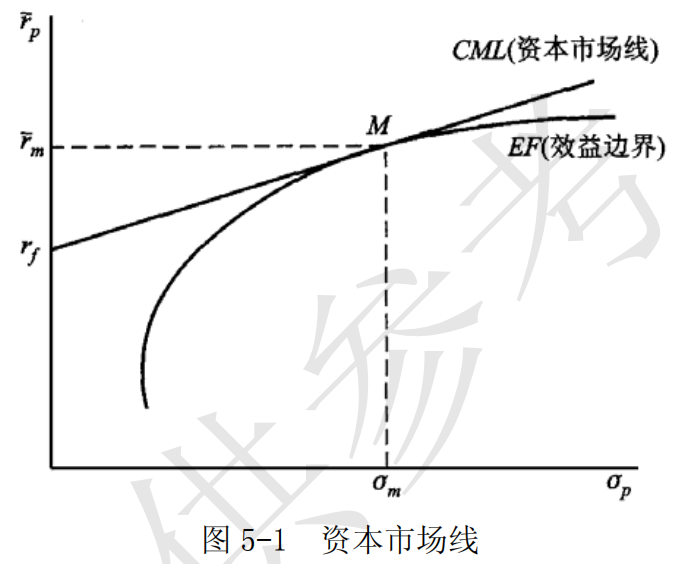

# 第 5 章 金融市场

> **本章核心问题**：金融市场有哪些类型和功能？货币市场和资本市场有何区别？金融工具如何创新？

## 一、名词解释

### 1．金融工具

金融工具又称金融资产，它是一种能够证明金融交易的金额、期限以及价格的书面文件，对于债权、债务双方的权利和义务具有法律上的约束意义。
金融工具一般应具有流动性、风险性和收益率等基本特征。
流动性是指一种金融工具在不遭受损失的情况下迅速变现的能力；
风险性是指金融工具在受信用风险和市场风险的影响下导致金融工具的购买者在经济上受到损失的可能性；
收益率则是指持有金融工具所取得的收益与本金的比率。

---

**【通俗理解：金融工具 = 钱的凭证】**

**核心问题**：怎么证明借钱和投资的关系？

---

**【什么是金融工具？】**

**通俗理解**：证明金融交易的书面文件

| 特征 | 含义 | 通俗理解 |
|------|------|----------|
| **流动性** | 迅速变现的能力 | 随时能换成钱 |
| **风险性** | 受损失的可能性 | 可能亏钱 |
| **收益率** | 收益与本金的比例 | 能赚多少 |

---

**【金融工具的三性权衡】**

```
流动性强 → 风险小 → 收益低（如银行存款）
流动性弱 → 风险大 → 收益高（如股票）
```

**通俗理解**：想要收益高就得承担风险，想要灵活就得接受低收益。

---

**【一句话记忆】**

> **金融工具** = "钱的凭证" = 证明借钱或投资关系的文件，有流动性、风险性、收益率三个特征

---

### 2．货币市场

货币市场是一年和一年以内短期资金融通的市场，包括同业拆借市场、银行间债券市场、大额可转让存单市场、商业票据市场和国库券市场等子市场。这一市场的金融工具期限很短，近似货币，所以称之为货币市场。货币市场是金融机构调节流动性的重要场所，是中央银行货币政策操作的基础。

---

**【通俗理解：货币市场 = 短期钱的市场】**

**核心问题**：哪里可以借短期钱？

---

**【什么是货币市场？】**

**通俗理解**：一年以内的短期资金借贷市场

| 特点 | 说明 |
|------|------|
| **期限短** | 一年以内 |
| **近似货币** | 很快能变现 |
| **风险低** | 时间短，不确定性小 |

---

**【货币市场包括哪些？】**

| 子市场 | 干什么的 |
|--------|----------|
| **同业拆借市场** | 银行之间借钱 |
| **银行间债券市场** | 银行之间买卖债券 |
| **大额存单市场** | 买卖大额存单 |
| **商业票据市场** | 企业短期融资 |
| **国库券市场** | 政府短期融资 |

---

**【一句话记忆】**

> **货币市场** = "短期钱市场" = 一年以内的短期资金融通，近似货币

---

### 3．资本市场

资本市场一般指交易期限在一年以上的市场，主要包括股票市场和债券市场，满足工商企业的中长期投资需求和政府财政赤字的需要。
由于交易期限长，资金主要用于形成实际资本，所以称之为资本市场。

---

**【通俗理解：资本市场 = 长期钱的市场】**

**核心问题**：哪里可以借长期钱？

---

**【什么是资本市场？】**

**通俗理解**：一年以上的长期资金借贷市场

| 特点 | 说明 |
|------|------|
| **期限长** | 一年以上 |
| **形成实际资本** | 用于投资建厂等 |
| **风险较高** | 时间长，不确定性大 |

---

**【资本市场包括哪些？】**

| 市场 | 干什么的 |
|------|----------|
| **股票市场** | 买卖股票，企业融资 |
| **债券市场** | 买卖债券，长期借贷 |

---

**【货币市场 vs 资本市场】**

| 对比 | 货币市场 | 资本市场 |
|------|----------|----------|
| **期限** | 一年以内 | 一年以上 |
| **风险** | 低 | 高 |
| **收益** | 低 | 高 |
| **用途** | 调节流动性 | 实际投资 |

---

**【一句话记忆】**

> **资本市场** = "长期钱市场" = 一年以上的长期资金融通，用于实际投资

---

### 4．远期

远期是指在确定的未来某一时期，按照确定的价格买卖一定数量的某种资产的协议。
在远期合约中，双方约定买卖的资产称为标的资产，约定的价格称为协议价格，同意以约定的价格卖出标的资产的一方称为空头，同意以约定的价格买人标的资产的一方称为多头。远期合约在外汇市场应用非常广泛，因为它能够比较有效地防止汇率波动的风险。

---

**【通俗理解：远期 = 约定以后买卖】**

**核心问题**：怎么锁定未来的价格？

---

**【什么是远期合约？】**

**通俗理解**：现在约定，以后按固定价格买卖

| 要素 | 含义 |
|------|------|
| **标的资产** | 约定买卖的东西 |
| **协议价格** | 约定的价格 |
| **多头** | 约定买入的一方 |
| **空头** | 约定卖出的一方 |

---

**【远期合约的作用】**

```
担心价格上涨？
    ↓
现在签远期合约，锁定买入价
    ↓
以后价格涨了也不怕
```

**通俗理解**：现在约好以后的价格，不管以后市场怎么变，按约定的来。

---

**【一句话记忆】**

> **远期合约** = "锁定未来价格" = 现在约定，以后按固定价格买卖

---

### 5．期货

期货合约是在远期合约的基础上发展起来的一种标准化的买卖合约。
两者的主要区别在于，期货合约是由交易所推出的标准化合约，在交易所集中交易，并且由交易所保证合约的履行。

---

**【通俗理解：期货 = 标准化的远期】**

**核心问题**：远期合约有什么问题？怎么改进？

---

**【什么是期货？】**

**通俗理解**：在交易所交易的标准化远期合约

| 对比 | 远期 | 期货 |
|------|------|------|
| **交易场所** | 场外（私下） | 交易所 |
| **合约** | 非标准化 | 标准化 |
| **履约保证** | 双方信用 | 交易所担保 |
| **流动性** | 差 | 好 |

---

**【为什么需要期货？】**

**远期合约的问题：**
1. 每笔合约不一样，难以转让
2. 靠双方信用，风险大

**期货的解决方案：**
1. 标准化合约，可以自由买卖
2. 交易所担保，履约有保障

---

**【一句话记忆】**

> **期货合约** = "标准化远期" = 在交易所交易的标准化远期合约，交易所保证履约

---

### 6．互换

互换是指互换双方达成协议并在一定的期限内转换彼此货币种类、借贷利率基础及其他资产的一种交易。
互换协议主要有货币互换和利率互换两种。货币互换是指交易双方按照既定的汇率交换两种货币，并约定在将来一定期限内按照该汇率相互购回原来的货币。利率互换是指交易双方将自己所拥有的债权（债务）的利息收入（支出）相交换。这两笔债权（债务）的本金价值是相同的，但利息支付条款却是不同的，通过交换可以满足双方的不同需要。

---

**【通俗理解：互换 = 交换好处】**

**核心问题**：怎么发挥各自的优势？

---

**【什么是互换？】**

**通俗理解**：双方交换各自的货币或利率

| 类型 | 通俗理解 |
|------|----------|
| **货币互换** | 我有美元，你有人民币，咱们互换 |
| **利率互换** | 我有固定利率，你有浮动利率，咱们互换 |

---

**【利率互换举例】**

```
公司A：能借到固定利率5%
公司B：能借到浮动利率LIBOR+1%

但A想要浮动，B想要固定
    ↓
利率互换：各取所需
```

**通俗理解**：各自发挥优势，然后互换，大家都满意。

---

**【一句话记忆】**

> **互换** = "交换好处" = 交换货币或利率，各取所需

---

### 7．期权

期权合约赋予其持有者（即期权的购买者）一种权利，使其可以（但不必须）在未来约定的时期内以议定的价格向期权合约的出售者买入（看涨期权）或卖出（看跌期权）一定数量的资产。
合约的持有人为获得这一权利，需要支付一定的期权费。

---

**【通俗理解：期权 = 买选择权】**

**核心问题**：怎样获得一个选择的机会？

---

**【什么是期权？】**

**通俗理解**：花钱买一个选择的权利

| 类型 | 权利 | 通俗理解 |
|------|------|----------|
| **看涨期权** | 以约定价格买入 | 看涨才买，不看涨不买 |
| **看跌期权** | 以约定价格卖出 | 看跌才卖，不看跌不卖 |

---

**【期权的独特之处】**

| 合约类型 | 权利义务 |
|----------|----------|
| **远期/期货** | 双方都必须履行 |
| **期权** | 买方可以选择履行或不履行 |

**通俗理解**：期权买方有权利但没义务，情况对自己有利就行权，不利就放弃。

---

**【期权费】**

```
买期权要付期权费
    ↓
买的是选择权
    ↓
不行权就损失期权费
    ↓
行权可能赚更多
```

---

**【一句话记忆】**

> **期权** = "买选择权" = 花钱买一个将来可以选择买卖（也可以不买卖）的权利

---

## 二、简答题

### 1．简要分析风险资本的投资过程。

风险资本指由风险投资基金所运作的资本，风险资本的投资过程大致分五个步骤：

- （1）交易发起，即风险资本家获知潜在的投资机会。
- （2）筛选投资机会，即在众多的潜在投资机会中初选出小部分做进一步分析。
- （3）评价，即对选定项目的潜在风险与收益进行评估。如果评价结果是可以接受的，风险资本家与企业家一道进入第四步交易设计。
- （4）交易设计。交易设计包括确定投资的数量、形式和价格等。一旦交易完成，则进入最后一步——投资管理。
- （5）投资后管理。投资后管理的关键是将企业带入资本市场运作以顺利实现必要的兼并收购和发行上市。

---

**【通俗理解：风险投资 = 投初创公司赌未来】**

**核心问题**：风险投资是怎么运作的？

---

**【五步流程】**

**① 交易发起 = 找项目**

```
风险资本家到处找
    ↓
发现潜在的投资机会
```

**通俗理解**：风险投资人到处寻找有潜力的初创公司。

---

**② 筛选 = 选项目**

```
项目太多了
    ↓
初步筛选
    ↓
只留小部分重点考察
```

**通俗理解**：机会太多，先筛一筛，只看有希望的。

---

**③ 评价 = 算算账**

```
评估风险和收益
    ↓
值得投？
    ↓
进入下一步
```

**通俗理解**：好好算一算，这个项目值不值得投，风险有多大。

---

**④ 交易设计 = 谈条件**

```
确定投资数量、形式、价格
    ↓
签约完成
```

**通俗理解**：谈好投多少钱，占多少股份，什么价格。

---

**⑤ 投后管理 = 帮忙+退出**

```
帮助企业发展
    ↓
推向资本市场
    ↓
IPO或并购，套现退出
```

**通俗理解**：不仅给钱，还帮忙，最后把公司做上市，卖股票赚钱退出。

---

**【一句话记忆】**

> **风险投资五步法** = "找项目→筛项目→算算账→谈条件→帮上市"

---

### 2．简述风险与收益的关系。

- （1）风险和收益是任何投资者决策时必须考虑的一对矛盾，投资和收益是对称的，高风险高收益，低风险低收益，所有收益都是要经过风险来调整的。
	1952 年经济学家马柯维茨首先用比较精确的数学语言描述了风险于收益的关系，为资产定价理论奠定了基础。

-（2）每个投资者在进行投资之前都要对收益进行预期，因而从数学角度分析，收益预期往往以投资的预期收益率来表示。
	因为投资面临着未来的不确定性，所以，预期收益率就是投资者在投资之前对未来各种不确定情况下收益率的综合估计。从数学的角度看，预期收益率实际上是收益率这个随机变量的数学期望值，计算公式为: $$E(r)=\sum_{i=1}^{n}r_{i}P(i)$$

其中， $E(r)$  表示某种资产的预期收益率； $i=1,2,3,\cdots,n$   ； $n$  表示可能遇到的  $n$  种情况， $r_j$  表示该资产在第 $i$ 种情况下的收益率； $P(i)$  表示第 $i$  种情况出现的概率， $n$  种情况出现的概率之和等于 1。

-（3）风险是指投资价值损失的可能性，它实际上反映未来收益的不确定性，可以用对预期收益的偏离来反映风险的大小。
	数学上可用方差概念进行定量分析。引入数学上的方差概念，就可以对风险进行定量分析。方差的公式为：  $$\sigma^{2}=\sum_{i=1}^{n}\left(r_{i}-E(r)\right)^{2} P(i)$$
在实践中，通常习惯用方差的平方根即标准差来衡量风险，即： 

$${标准差 }=\sigma=\sqrt{\sigma^{2}}$$


---

**【通俗理解：风险与收益 = 薯片原理】**

**核心问题**：为什么高收益必然高风险？

---

**【核心原理】**

**通俗理解**：想要赚更多，就得冒更大险

| 风险 | 收益 | 例子 |
|------|------|------|
| **低** | 低 | 银行存款 |
| **中** | 中 | 债券基金 |
| **高** | 高 | 股票、风投 |

**就像买薯片**：
- 不冒风险就没有香味
- 冒大风险才可能大赚

---

**【预期收益率 = 期望值】**

$$E(r) = 各种情况下的收益率 × 概率$$

**通俗理解**：把所有可能的结果加权平均

**例子**：
```
50%概率赚10%，50%概率亏5%
预期收益率 = 10% × 50% + (-5%) × 50% = 2.5%
```

---

**【风险 = 不确定性 = 标准差】**

$$标准差 = 收益率偏离预期的程度$$

**通俗理解**：可能的结果与预期差得越多，风险越大

**例子**：
```
A投资：稳赚5%，标准差=0
B投资：可能赚20%也可能亏10%，标准差大
B的风险更大
```

---

**【一句话记忆】**

> **风险收益关系** = "高风险高收益" = 想多赚就得敢冒险

---


### 3．简要分析为什么分散投资可以减少风险。

- （1）金融学的一个基本假设是投资者是风险的厌恶者，控制风险的一种有效的方法是分散投资，即投资者可以通过构建多样化的投资的资产组合来降低风险，这一原理可以通过资产组合的预期收益率和资产组合的风险协方差公式来说明。

- （2） 资产组合的预期收益率是资产组合中所有资产预期收益率的加权平均数。
	资产组合的预期收益率的计算公式为：
	
	$$E(r_p)=\sum_{i=1}^{m}E(r_{i})A_{i}$$
其中 $E(r_p)$ 是资产组合的预期收益率；
$A_{i}$ 是第 $i$ 种资产在总资产中所占比重； 
$m$ 是资产组合中的资产种类数。

资产组合中，在资产总数一定情况下，单个资产占的比重小，资产组合的预期收益率越小，风险越小，这个原理说明投资资产数量多可以减低风险。

- （3） 风险协方差公式说明：资产组合的风险不仅与单个资产的风险有关，不仅是单个资产标准差的简单加权平均，而且与各种资产的相互关系有关。投资者通过选择彼此相关性小的资产进行组合时风险更小。

	资产组合收益率的标准差公式为：
	
	$$\sigma_{\mathrm{P}}=\sqrt{\sum_{j=1}^{m} \sum_{k=1}^{m} A_{\mathrm{j}} A_{\mathrm{k}} \sigma_{\mathrm{jk}}}$$

 $m$  是资产组合中的资产种类数； 
 $A_j$  是组合中  $j$  资产所占比重； 
 $A_k$ 是组合中 $k$ 资产所占比重；
 $\sigma_{jk}$  是  $j$ 和 $k$ 两种资产收益率的协方差。所谓协方差，反映的是两种资产共同变化的程度，其公式是:
 
 $$\sigma_{jk}=r_{jk}\sigma_{j}\sigma_{k}$$
 
 其中， $r_{jk}$ 是资产 $j$  和资产 $k$  收益率的相关系数。

资产组合的协方差反映组合资产共同变化的程度，因而资产组合的协方差越小组合资产投资的风险越小。资产组合的协方差又取决于组合资产之间的相关系数，组合资产之间的相关性越小系数越小，组合资产风险越低。

这个原理说明通过多样化投资组合可以降低风险。

---

**【通俗理解：分散投资 = 不把鸡蛋放一个篮子】**

**核心问题**：为什么分散投资能降低风险？

---

**【核心原理】**

**通俗理解**：不要把所有鸡蛋放一个篮子里

```
只买一只股票
    ↓
这家公司出问题，全完了

买多只股票
    ↓
有的涨有的跌，整体平稳
```

---

**【为什么分散有效？】**

**① 单个资产占比小**

| 情况 | 风险 |
|------|------|
| 全仓一只 | 这只跌，全跌 |
| 分散十只 | 这只跌，其他可能涨 |

**通俗理解**：每只股票只买一点，哪只跌了都不伤筋动骨。

---

**② 资产相关性小**

| 组合 | 风险 |
|------|------|
| 股票A + 股票B（同行业） | 高（一起跌） |
| 股票 + 债券 + 黄金 | 低（不一起跌） |

**通俗理解**：选不相关的资产，一个跌了另一个可能涨，风险抵消。

---

**【形象理解】**

```
天气投资组合：
- 太阳伞店股票（晴天赚）
- 雨伞店股票（雨天赚）
    ↓
不管晴天雨天，总有一个赚钱
```

---

**【一句话记忆】**

> **分散投资** = "鸡蛋不放一个篮子" = 多买几种不相关的资产，风险相互抵消

---

### 4．简述 CAPM 的基本内容。

- （1）CAPM 即资本资产定价模型是在投资组合理论的基础上，寻求当资本市场处于均衡状态下，各资本资产的均衡价格。即假设人们对预期收益率和风险的预期相同，并且都根据分散化原则选择最优资产组合，达到均衡状态时，证券的风险溢价是多少。

- （2）在以上假设前提下，在资本市场均衡状态下，通过对投资者集体行为的分析，可以求出所有有效证券和证券组合的均衡价格，即资本市场线，如图 5-1 所示。



图 5-1 中， $r_{f}$   表示无风险借贷利率，切点 $M$ 是市场证券组合，理论上应包括所有上市的有价证券。射线 $r_{f}M$ 就是资本市场线，表示投资者在证券市场上所有的有效投资机会，或者说对所有投资者而言最好的风险－收益组合。尽管每个人都希望达到高于资本市场线，但竞争力量将推动资产价格变动，使每个人都达到直线上的某点。
CML 的公式为：

$$E(r_{p})=r_{f}+\frac{E(r_m)-r_f}{\sigma_{m}}\sigma_{p}$$

$${CML的斜率}=\frac{E(r_m)-r_f}{\sigma_m}$$

CAPM 的基本思想是：达到均衡时人们承受风险的报酬，由于投资者是风险厌恶者，所以，所有风险资产的风险溢价总值必然为正。

（3）单个证券的风险溢价与它对市场风险贡献程度成正比，用来衡量单个证券风险的是它的 $\beta$  值。 $\beta$ 值反映了单个证券对市场波动的敏感度。根据 CAPM，在均衡状态下，任何资产的风险溢价等于其 $\beta$  值乘以市场投资组合的风险溢价。方程式为：
$$E(r_j)-r_f=\beta_j[E(r_m)-r_f]$$

或:

$$E(r_j)=r_f + \beta_j[E(r_m)-r_f]$$


- （4）CAPM 运用均衡方法，为金融市场的资产定价提供了理论依据。这一模型在投资管理和公司财务实践中被广泛应用，但是也存在一些问题，主要是模型中的市场组合包括了所有的资产，在实证研究中难以准确模拟。

---

**【通俗理解：CAPM = 算股票该值多少钱】**

**核心问题**：怎么给资产定价？

---

**【CAPM是什么？】**

**通俗理解**：计算一个资产应该有多少收益的模型

$$预期收益 = 无风险收益 + 风险补偿$$

---

**【核心公式】**

$$E(r) = r_f + \beta[E(r_m) - r_f]$$

| 符号 | 含义 | 通俗理解 |
|------|------|----------|
| $E(r)$ | 预期收益 | 这只股票应该赚多少 |
| $r_f$ | 无风险利率 | 存银行能赚多少 |
| $\beta$ | 贝塔值 | 这只股票有多敏感 |
| $E(r_m)$ | 市场收益 | 整个股市平均赚多少 |

---

**【贝塔系数 $\beta$】**

| $\beta$ 值 | 含义 |
|-----------|------|
| $\beta = 1$ | 和大盘一样波动 |
| $\beta > 1$ | 比大盘波动大（激进） |
| $\beta < 1$ | 比大盘波动小（保守） |

**通俗理解**：$\beta$ 衡量这只股票"跟风"的程度。

---

**【举个例子】**

```
无风险利率 = 3%
市场预期收益 = 10%
某股票 $\beta$ = 1.5

预期收益 = 3% + 1.5 × (10% - 3%) = 13.5%
```

**通俗理解**：这只股票比大盘敏感，应该比大盘赚更多。

---

**【一句话记忆】**

> **CAPM公式** = "无风险+风险补偿" = 预期收益 = 存款利率 + β×市场风险溢价

---

## 三、论述题

### 1．试述金融市场在经济运行中的功能。

- （1）金融市场的发展促进了储蓄向投资转化的规模和效率，为金融资产提供了充分的流动性，并促进了金融工具的不断创新

在专业分工不断深化和规模经济日益重要的现代经济中，储蓄向投资的顺利转化，关系到整个实体经济能否良性循环。传统金融体系依赖以商业银行为主体的金融中介或间接金融来发挥其功能，但是，随着信息技术的发展和竞争加剧，资本市场在降低交易成本、处理信息能力方面都呈现出强大的生命力。而且，金融市场能够通过灵活的交易，增加传统金融工具的流动性。

金融市场的发展不仅为金融资产规模的扩大创造了条件，而且促进了金融工具的创新。金融工具是一组预期收益和风险相结合的标准化合约，多样化金融工具通过对一种经济的生产技术中所固有的风险进行更精细的划分，使得对风险和预期收益持不同态度的投资者能够寻找到最符合其需求的投资，同时金融工具发行者的多样化融资需求也同样能够尽可能地得到满足，从而有利于提高储蓄向投资转化的效率。

-（2）金融市场的资产定价机制能够引导资金合理流动，反馈经济实际运行状况，从而提高资源运用效率

以企业为代表的微观经济主体的投资活动，一个基本的原则是追求“净现值大于零”，即一项投资的未来现金流的贴现值之和应当大于当期的投资支出；金融市场的交易可以反映金融市场资金的供求关系，反映不同投资主体的风险偏好，从而确定不同金融资产的收益率即对未来收益的贴现率，形成资产价格，引导资金和实际资源更合理的流动。

- （3）金融市场的发展为金融间接调控体系的建立提供了基础

金融间接调控体系的建立必须依靠发达的金融市场传导中央银行的政策信号，才能通过金融市场的价格变化引导各微观主体的行为。在中央银行货币政策工具中，以短期国债为主要交易工具的公开市场操作是最主要的手段，中央银行据以吞吐基础货币，影响商业银行的超额储备和同业拆借市场利率，进而影响金融机构信用扩展能力。同时，发达的金融市场内部，由于套利的作用，各子市场之间存在高度的相关性，货币市场的变化将会迅速地在资本市场得到反映，通过资本市场的行市变化进一步扩大货币政策的影响范围。随着各类金融资产在金融机构储备头寸和流动性准备中比例的提高，金融机构会更加广泛地介入金融市场运行，中央银行的公开市场操作影响的范围和力度，将会伴随金融市场的发展而不断得到加强。

- （4）股票市场的发展提供了有效评价企业经营状况的窗口，为企业实施资本运营战略提供了场所

股票市场的发展则提供上市公司的市值。上市公司市值的变化不仅能反映公司净资产的水平，而且能反映未来的盈利能力。市值的变化具有连续性，投资者通过连续的观察，可以更准确地判断公司的经营状况，通过股票的买卖，对公司经营形成外部市场压力。此外，股票市场的发展，促使企业产权的细分化，有助于上市公司资产重组，实现经济资源的高效流动和整合。

---

**【通俗理解：金融市场的功能 = 钱的调配中心】**

**核心问题**：金融市场有什么用？

---

**【四大功能】**

**① 储蓄变投资 = 钱流向需要的地方**

```
老百姓有钱想理财
    ↓
金融市场
    ↓
企业需要钱投资
    ↓
钱流转起来
```

**通俗理解**：让闲钱变成有用的投资资金。

---

**② 资产定价 = 给东西定个价**

```
买卖双方在市场交易
    ↓
供求决定价格
    ↓
价格引导资金流动
```

**通俗理解**：市场交易形成价格，价格告诉钱该往哪里流。

---

**③ 政策传导 = 央行的渠道**

```
央行调整政策
    ↓
金融市场反应
    ↓
影响企业和个人
```

**通俗理解**：央行通过金融市场把政策传递给整个经济。

---

**④ 评价企业 = 股市看门人**

```
公司上市
    ↓
股价反映公司价值
    ↓
好公司股价涨，差公司股价跌
```

**通俗理解**：股市给公司定价，好公司贵，差公司便宜。

---

**【一句话记忆】**

> **金融市场功能** = "钱的调配中心" = 储蓄变投资、资产定价、政策传导、评价企业

---

### 2．试述金融工程的方法论背景。

金融工程是指自 20 世纪 80 年代以来，金融部门将现代金融理论和工程技术方法相结合，针对投资者不同的风险偏好，创造性地设计开发和应用新的金融产品的过程。

金融工程是一门新兴的交叉学科，它的理论与方法建立在现代金融理论、信息技术和工程方法基础之上。

- （1）1952 年马柯维茨提出的投资组合理论，从数学的角度界定了风险与收益，把数理工具引入了金融研究；

1958 年莫迪利安尼和米勒提出了 MM 定理，为现代金融理论提供了有别于传统经济学供求分析的“无套利均衡”方法。所谓“无套利均衡”指的是，当某种资产的价格违背了“同值同价”的“一价定律”时，市场处于不均衡状态，出现了套利机会，市场参与者的套利动机促使市场达到均衡；在市场均衡状态下，不存在套利机会，因此称为“无套利均衡”。金融分析基本方法，就是将某项金融资产的“头寸”（即对某种资产的持有或短缺）与市场中其他金融资产的头寸组合起来，构建一个在市场均衡时不能产生不承受风险的利润的组合头寸，并由此计算该项头寸在市场均衡时的价值即均衡价格。

- （2）信息技术的发展为金融工程提供了必需的物质基础条件。例如计算机的普及和大规模运算和数据处理

能力的提高，为投资组合理论的实际应用和金融工程提供了开发和实施各种新型金融产品、解决金融和财务问题的有效手段；通讯技术的发展使得信息能够在全国、全球迅速传播，金融市场联为一体。所有这些都极大地降低了金融市场的交易成本，提高了市场的效率。

- （3）”金融工程师”们在上述理论和技术条件支持下，针对市场投资者不同的风险偏好和风险承受能力，借鉴现代工程技术方法，创造性地设计出了各种新的金融工具，使其具有特定的流动性和风险—收益组合。

---

**【通俗理解：金融工程 = 设计金融产品】**

**核心问题**：金融工程是怎么来的？

---

**【什么是金融工程？】**

**通俗理解**：用工程方法设计新的金融产品

就像工程师设计桥梁一样，金融工程师设计金融产品。

---

**【三大基础】**

**① 理论基础 = 数学模型**

| 理论 | 贡献 | 通俗理解 |
|------|------|----------|
| **投资组合理论** | 风险与收益的数学描述 | 用数学算风险和收益 |
| **MM定理** | 无套利均衡方法 | 同样的东西应该同样的价 |

**无套利均衡**：
```
两个一样的东西，价格不一样
    ↓
买便宜的，卖贵的（套利）
    ↓
价格被拉平，均衡
```

---

**② 技术基础 = 电脑和通讯**

| 技术 | 作用 |
|------|------|
| **计算机** | 大量计算，处理复杂数据 |
| **通讯技术** | 全球信息实时传递 |

**通俗理解**：没有电脑，这些复杂模型算不出来；没有网络，市场联不起来。

---

**③ 工程方法 = 创造设计**

```
针对不同人的需求
    ↓
设计不同的金融产品
    ↓
满足风险偏好和收益要求
```

**通俗理解**：像搭积木一样，把不同的金融元素组合成新产品。

---

**【一句话记忆】**

> **金融工程** = “金融产品设计” = 数学理论+电脑技术+工程方法，创造新的金融工具

---


## 历年真题

### 2023年
**[简答题]** 简述有效市场假说的基本内容。
**答案：** 市场根据新信息迅速调整证券价格的能力。分三类：①弱有效：价格反映历史信息；②中度有效：反映所有公开信息；③强有效：反映所有公开和不公开信息。
