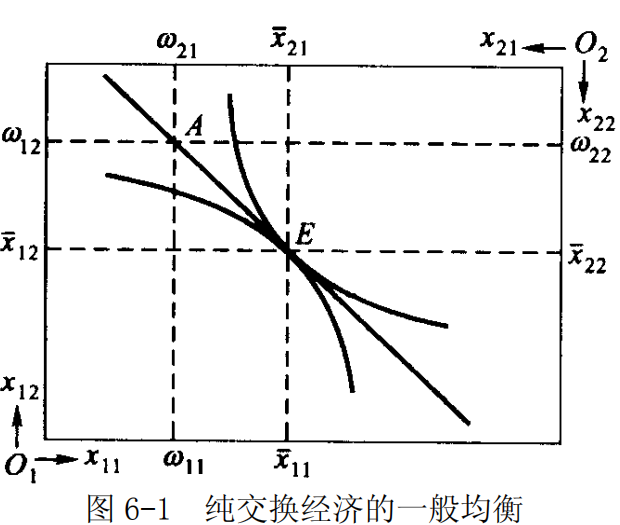

# 第 6 章 一般均衡论和福利经济学

> **本章核心问题**：所有市场能否同时达到均衡？什么样的资源配置才是「最优」的？效率与公平能否兼得？

## 本章脉络

前五章每次只看一个市场：一个商品市场、一个要素市场。但价格从来不是孤立决定的——牛肉涨价会把需求推向猪肉，猪肉涨价又推回羊肉。瓦尔拉斯在 1874 年迈出了大胆的一步：把**所有**市场写进一组联立方程，让全部价格同时解出。这就是一般均衡。它壮丽，也危险：一组方程有没有解，瓦尔拉斯自己只是含糊地用「方程数等于未知数数」搪塞过去——这个存在性问题悬了八十年，直到沃尔德（1930 年代）给出初步证明，阿罗与德布鲁（1954）用不动点定理才彻底解决（证明的技巧恰好借自纳什均衡）。

一般均衡说的是「能不能同时出清」，福利经济学接着问「出清了又如何」——均衡值得追求吗？帕累托给出了一个刻意保守的标准：不存在能让某人变好而无人变坏的改进余地，即为最优。这套标准之所以流行，正因为它回避了人际比较：不需要说 A 的效用抵得上 B 的几个，只需要问「还有没有白捡的改进」。本章先讲一般均衡（瓦尔拉斯定律、埃奇沃斯框图），再讲帕累托最优的三个条件，最后看二者如何接起来：完全竞争的一般均衡恰好是帕累托最优的——斯密的「看不见的手」在 1951 年之后才有了严格的定理形态（福利经济学两个基本定理）。

## 核心概念

### 局部均衡和一般均衡

- （1）局部均衡是指在假设其他市场不变的情况下，某一特定产品或要素的市场均衡。局部均衡分析研究的是单个（产品或要素）市场，其研究方法是把所考虑的某个市场从相互联系的整个经济体系的市场全体中「取出」来单独加以研究。

局部均衡是经济体系中单独一个消费者、一个商品市场或要素市场、一家厂商或一个行业的均衡状态。局部均衡分析即只考虑这个局部本身所包含的各因素的相互影响，相互作用，最终如何达到均衡状态。如在研究某产品市场的均衡时，就可假设其他各产品的供给、需求及价格不变，而只考虑该产品的价格和销售量如何由它本身的供给和需求两种相反力量的作用以达到均衡。

- （2）一般均衡是指在一个经济体系中，所有市场的供给和需求同时达到均衡的状态。一般均衡分析从微观经济主体行为的角度出发，考察每一种产品和每一个要素的供给和需求同时达到均衡状态所需具备的条件和相应的均衡价格以及均衡供销量应有的量值。

根据一般均衡分析，某种商品的价格不仅取决于它本身的供给和需求状况，而且还受到其他商品的价格和供求状况的影响。因此，某种商品的价格和供求均衡，只有在所有商品的价格和供求都同时达到均衡时，才能实现。

**【局部均衡 vs 一般均衡对比】**

| 比较维度 | 局部均衡 | 一般均衡 |
|----------|----------|----------|
| 研究范围 | 单个市场（产品或要素） | 所有市场（产品+要素） |
| 假设条件 | 假设其他市场不变 | 考虑市场间相互联系和相互影响 |
| 分析方法 | 把单个市场从整体中「取出」单独研究 | 将所有市场视为整体进行分析 |
| 价格决定 | 价格仅由自身供求决定 | 价格由所有市场的供求共同决定 |
| 均衡条件 | 单个市场：供给 = 需求 | 所有市场同时：供给 = 需求 |
| 复杂程度 | 简单，易于分析 | 复杂，需要联立方程组 |
| 现实性 | 近似分析，适用于市场间联系较弱时 | 更接近现实，但求解困难 |
| 应用场景 | 单个市场政策影响分析 | 全局政策、税制改革、贸易分析 |

**直观理解**：

```
局部均衡：                       一般均衡：
     牛肉市场                         牛肉市场 ←→ 猪肉市场
   供给 = 需求                      供给 = 需求   供给 = 需求
       ↑                               ↑           ↓
   其他市场不变                    羊肉市场 ←→ 鸡肉市场
                                  供给 = 需求   供给 = 需求
```

**举例说明**：

| 情况 | 局部均衡分析 | 一般均衡分析 |
|------|--------------|--------------|
| 牛肉价格上涨 | 只分析牛肉市场：需求↓ → 价格↑ | 同时分析：牛肉↑ → 猪肉需求↑ → 猪肉↑ → 羊肉需求↑… |
| 汽油征税 | 只分析汽油市场：价格↑ | 同时分析：汽油↑ → 汽车需求↓ → 钢铁需求↓ → … |

局部均衡是「只见树木」，一般均衡是「既见树木又见森林」。马歇尔的供求图是前者的工具，瓦尔拉斯的方程组是后者的工具——第 1 章到第 5 章用的都是前者，本章把它补全。

### 瓦尔拉斯定律

瓦尔拉斯定律也称为瓦尔拉斯法则，是由经济学家瓦尔拉斯在其完全竞争市场的一般均衡理论体系中提出的一个恒等关系式。
其基本内容是：在完全竞争的市场体系中，在任何价格水平下，整个经济社会中所有成员用于购买商品和劳务的支出一定等于出售商品和劳务所得到的收入，市场上对所有商品超额需求的总和为零。

$$\sum_{i=1}^{k+r} p_i \cdot x_i = \sum_{i=1}^{k+r} p_i \cdot y_i$$

这一恒等式对一般均衡的意义在于，它表明无论经济是否处于一般均衡，总有一种商品的价格可以由其他商品的价格表示出来，即当所有其他市场处于均衡状态时，另一个市场一定处于均衡。因而，一般均衡分析不可能得到所有市场的（绝对）价格。但是，如果规定一种商品为一般等价物，那该商品的价格就是 1，从而一般均衡才可能有确定的解。由此可见，该定律成立，意味着一般均衡分析只能得到相对价格。

由瓦尔拉斯定律可以推出，经济体系中存在 $n$ 个商品市场，若其中 $n-1$ 个商品市场处于均衡状态，那么，第 $n$ 个商品市场也必然是均衡的。瓦尔拉斯定律不仅表明在交换体系中任何价格水平消费者对所有商品的超额需求总和为零，同样可以证明，瓦尔拉斯定律不仅适用于纯经济交换体系，而且适用于生产与交换经济体系，也适用于货币经济体系。

### 帕累托最优状态

帕累托最优状态又称作经济效率，是指没有人可以在不使得他人境况变坏的条件下使得自身境况得到改善，此时的状态被称为帕累托最优状态。当经济系统的资源配置达到帕累托最优状态时，称此时的经济运行是有效率的。反之，不满足帕累托最优状态的经济运行结果就是缺乏效率的。

这个标准的聪明之处在于它的最低限度：它不声称最优配置「最好」，只声称已无「免费的午餐」——所有能让人变好的办法都用尽了，剩下的每一步改进都得有人付出代价。也正因为如此，它是效率标准而不是公平标准：把全部财富给一个人的分配同样可以是帕累托最优的。

### 交换符合帕累托最优的条件

交换符合帕累托最优条件是指在交换方面，任何一对商品之间的边际替代率对任何使用这两种商品的个人来说都相等，即 $RCS_{12}^{A} = RCS_{12}^B$，此时该社会达到了产品分配的帕累托最优状态，从而实现了交换的效率。在表示纯交换的埃奇沃斯框图中，当两个消费者的无差异曲线相切时，交换符合帕累托最优。

### 生产符合帕累托最优的条件

生产符合帕累托最优的条件指对于有多个个人、多种商品、多种生产要素的经济，达到均衡时要求在生产方面，任何一对生产要素之间的边际技术替代率在用这两种投入要素生产的所有商品的生产中都相等，即 $RTS_{LK}^{1} = RTS_{LK}^2$，此时该社会达到了帕累托最优状态，从而实现了生产的效率。当然，此时也就实现了生产的一般均衡。在表示生产的埃奇沃斯框图中，当两种产品生产的等产量曲线相切时，生产符合帕累托最优。

### 交换与生产同时符合帕累托最优的条件

交换与生产同时符合帕累托最优的条件是指所有产品中任意两种产品的边际替代率等于这两种产品在生产中的边际转换率，即 $RCS_{XY}=RPT_{XY}$。如果所有的市场（产品市场和生产要素市场）均是完全竞争的，则市场机制的最终作用将会使生产资源达到最优配置。在帕累托最优这种理想的状态下，有限的生产资源得到最有效率的配置，产量最高，产品的分配也使社会成员的总体福利最大。

如果经济中某种物品既可以用于生产也可以用于消费，那么经济达到帕累托最优状态的条件是，任意两种产品的边际转换率等于这两种产品的边际替代率。

### 产品转换率

边际转换率是指增加另一种商品产出的数量必须减少某种商品产出数量的比例。
如果设产出 $X$ 的变动量为 $\Delta{X}$，产出 $Y$ 的变动量为 $\Delta{Y}$，则它们的比率的绝对值 $\left|\Delta{Y}/\Delta{X}\right|$ 可以衡量 1 单位 X 商品转换为 Y 商品的比率。

该比率的极限则定义为 X 商品对 Y 商品的边际转换率 $MRT$，亦即：

$$M R T=\lim_{\Delta x \rightarrow 0}\left|\frac{\Delta Y}{\Delta X}\right|=\left|\frac{\mathrm{d} Y}{\mathrm{d} X}\right|$$

边际转换率反映了产品转换的机会成本。在生产可能性曲线上，边际产品转换率表现为生产可能性曲线的斜率的绝对值。

## 问题与分析

### 瓦尔拉斯一般均衡论的基本思想是什么？「存在性」问题卡在哪里？

- （1）一般均衡分析是将所有相互联系的各个市场看成一个整体来加以研究而进行的分析，它的基本思想是把单个市场的均衡条件推广到多个市场。一般均衡理论首要解决的问题是：是否存在一系列价格使所有市场同时处于均衡，即所谓的一般均衡的存在性问题。

- （2）法国经济学家瓦尔拉斯在 1874 年建立了被后人称为瓦尔拉斯一般均衡论的分析框架。该分析框架假定整个经济中有 $k$ 种产品和 $r$ 种生产要素。这样，整个经济中就有 $k$ 种产品市场和 $r$ 种生产要素市场。

- ①从产品市场均衡进行考察，产品的需求来源于消费者。
  对特定商品而言，消费者的需求取决于该商品本身的价格、其他商品价格以及消费者的收入等。但消费者的收入又来源于生产要素的价格。这样，一种商品的市场需求取决于所有产品及要素的价格，即：
    $$x_i=x_i(p_1,\cdots,p_k,p_{k+1},\cdots,p_{k+r}),\ (i=1,\cdots,k)$$

  产品的供给来源于厂商。厂商的供给同样取决于该商品的价格、其他商品的价格和成本，而厂商的成本又决定于要素价格。这样，一种产品的市场供给也取决于各种价格，即：

  $$y_i=y_i(p_1,\cdots,p_k,p_{k+1},\cdots,p_{k+r}),\ (i=1,\cdots,k)$$

  当市场需求等于市场供给时，一种产品的市场处于均衡，即：
  $$x_i=y_i,\ (i=1,\cdots,k)$$

- ②从要素市场均衡进行考察。要素的需求是厂商的引致需求，它不仅取决于各种要素的价格，也与其他产品价格有关，即：
  $$x_j=x_j(p_1,\cdots,p_k;p_{k+1},\cdots,p_{k+r}),\ j=k+1,\cdots,k+r$$

  要素的供给来源于消费者，并且是效用最大化的一个推广：
  $$y_j=y_j(p_1,\cdots,p_k;p_{k+1},\cdots,p_{k+r}),\ j=k+1,\cdots,k+r$$

  当市场需求等于市场供给时，要素市场处于均衡，即：
  $$x_j=y_j,\ j=k+1,\cdots,k+r$$

- ③如果存在着 $p_1,\cdots,p_k$ 和 $p_{k+1},\cdots,p_{k+r}$ 使得上述 $k+r$ 个市场的均衡条件成立，就意味着一般均衡存在。这一问题归结为 $k+r$ 个方程是否能解出 $k+r$ 个价格。当初，瓦尔拉斯认为，这取决于这 $k+r$ 个方程是否独立。但就整个经济系统而言，无论价格有多高，所有的收入之和一定等于所有的支出之和：
  $$\sum_{i=1}^{k+r}{p_i}{x_i}=\sum_{i=1}^{k+r}{p_i}{y_i}$$

  这一恒等式即被称为瓦尔拉斯定律。由于瓦尔拉斯定律成立，不可能存在 $k+r$ 个相互独立的均衡方程——$k+r$ 个市场里真正独立的只有 $k+r-1$ 个。但取某种商品为「一般等价物」（令其价格为 1），用相对价格代替绝对价格，问题便得到解决。据此，瓦尔拉斯一般均衡理论断言，使所有市场同时出清的相对价格体系是存在的。

  值得知道的是：瓦尔拉斯当年「数方程」式的论证在数学上并不严格，真正严格的存在性证明要等到八十年后（见本章「局限与后续」）。

### 利用埃奇沃斯框图说明纯交换经济的一般均衡。

（1）埃奇沃斯框图是以英国经济学家埃奇沃斯的名字命名的研究资源最优配置的一种盒子形状的图形。
该框图揭示了当所有消费的总量或经济活动中使用的投入品总量固定时，如何配置资源。假定经济中仅有消费者 1 和 2，以及商品 1 和 2，则其埃奇沃斯框图如图 6-1 所示。



（2）纯交换经济是指只有交换而没有生产的经济。假定在纯交换经济中两个消费者交换两种商品，第 $i$ 个消费者最初拥有的第 $j$ 种商品的数量为 $w_{ij}$，而选择的消费数量为 $x_{ij}$。

对于整个经济而言，社会拥有的两种商品的数量分别为：

$$w_1=w_{11} + w_{21}$$

和

$$w_2=w_{12}+w_{22}$$

假定两种商品的价格为 $p_1$ 和 $p_2$。效用最大化的消费者在既定的价格水平下决定最优的消费量。需要注意，此时消费者的收入来源于其初始财富拥有量。第一个消费者的行为可以概括为：

$$\begin{cases}
\max & u_{1}\left(x_{11}, x_{12}\right) \\
x_{11}, x_{12} & \\
\text { s. t. } & p_{1} x_{11}+p_{2} x_{12}=p_{1} \omega_{11}+p_{2} \omega_{12}
\end{cases}$$

该消费者消费不同商品的组合得到的效用满足可以由一系列凸向原点（左下角）的无差异曲线表示出来。其收入约束线 $p_{1}x_{11} +p_{2}x_{12}=p_{1}w_{11}+p_{2}w_{12}$ 是斜率为 $(-p_1/p_2)$ 并经过初始点 $(w_{11},w_{12})$ 的直线。在既定的价格下，消费者在这一预算约束线上选择效用最大化的商品组合，即预算约束线与无差异曲线的切点对应的消费组合 $(\bar{x_{11}},\bar{x_{12}})$，此时该消费者处于局部均衡状态。对于第二个消费者也有类似的局部均衡。

显然在埃奇沃斯框图中，第二个消费者的预算约束线与第一个消费者的重合。这样，当 $(\bar{x_{11}}-w_{11})+(\bar{x_{21}}-w_{21})=0$ 时，第一种商品的市场处于均衡。此时，两个消费者选择的最优点重合。第二种商品也同样。但在图中不难发现，只要第一种商品的市场处于均衡，第二种商品也一定处于均衡——这正是瓦尔拉斯定律在两商品情形下的体现。由此决定的价格（实际上是相对价格）即为一般均衡价格。

### 什么是帕累托最优配置？其主要条件是什么？

- （1）如果对于某种既定的资源配置状态，所有的帕累托改进均不存在，即在该状态上，任意改变都不可能使至少有一个人的状况变好而又不使其他任何人的状况变坏，则称这种资源配置状态为帕累托最优状态。

- （2）达到帕累托最优状态所必须满足的条件被称为帕累托最优条件，它包括交换的最优条件、生产的最优条件以及交换和生产的最优条件。

①交换的帕累托最优条件：在交换方面，任何一对商品之间的边际替代率对任何使用这两种商品的个人来说都相等，即 $RCS_{XY}^A = RCS_{XY}^{B}$。

②生产的帕累托最优条件：在生产方面，任何一对生产要素之间的边际技术替代率在用这两种投入要素生产的所有商品中都相等，即 $RTS_{LK}^{X}=RTS_{LK}^{Y}$。

③交换和生产的帕累托最优条件：任何一对商品之间的生产的边际转换率等于消费这两种商品的每个人的边际替代率，即 $RCS_{XY}=RPT_{XY}$。

三个条件分别管三件事：交换效率让商品流到最珍惜它的人手里，生产效率让要素流到最会用它的生产者手里，交换与生产的效率让经济的产出组合恰好是人们想要的组合。

### 为什么完全竞争市场可以处于帕累托最优状态？

- （1）帕累托最优状态是用于判断市场机制运行效率的一般标准。
帕累托最优状态是指，在既定资源配置状态下，任意改变都不可能使至少有一个人的状况变好而又不使其他任何人的状况变坏，即不存在帕累托改进，则称这种资源配置状态为帕累托最优状态。
一个经济实现帕累托最优状态，必须满足三个必要条件：
- ①任何两种商品的边际替代率对于所有使用这两种商品的消费者来说都必须是相等的；
- ②任何两种生产要素的边际技术替代率对于任何使用这两种生产要素的生产者来说都必须是相等的；
- ③任何两种商品对于消费者的边际替代率必须等于这两种商品对于生产者的边际转换率。

- （2）完全竞争市场之所以总可以实现帕累托最优状态，可以从满足帕累托最优状态的三个必要条件分别加以说明。关键机制只有一个：**完全竞争让所有人面对同一个价格**，于是每个人「按价格调整边际量」的结果，就自动变成了「所有人边际量相等」。
- ①从交换的最优条件来看，在完全竞争市场条件下，单个消费者都是价格的接受者，每个消费者都会调整对商品的需求以满足 $RCS_{XY}=\frac{P_X}{P_Y}$ 从而实现效用最大化。既然各消费者都是价格的接受者，那么各消费者购买任意两种商品的数量必使其边际替代率等于全体消费者所面对的共同的价格比率。因此，任何两种商品的边际替代率对所有的消费者都相等。

- ②从生产的最优条件来看，在完全竞争市场条件下，单个生产者都是要素价格的接受者，每个生产者都会调整要素的需求以满足 $RTS_{LK}=\frac{P_L}{P_K}$ 从而实现利润最大化。既然各生产者都是要素价格的接受者，那么各生产者购买并使用的任意两种要素的数量必使其边际技术替代率等于全体生产者所面对的共同的要素价格比。因此，任何两种要素的边际技术替代率对所有生产者都相等。

- ③从生产和交换的最优条件来看，任何两种产品生产的边际转换率即为两种商品的边际成本之比，每一消费者对任何两种商品的边际替代率等于其价格比。在完全竞争条件下，任何产品的价格等于边际成本，因此，任何两种产品的边际替代率等于它们的边际转换率。

- （3）综上所述，在完全竞争条件下，帕累托最优的三个必要条件都可以得到满足。换而言之，在完全竞争的市场机制作用下，整个经济可以达到帕累托最优状态，这样的经济必定是最优效率的经济。

### 西方微观经济学是如何论证「看不见的手」原理的？

从亚当·斯密开始，经济学家就认为在完全竞争的市场经济中，市场机制像一只「看不见的手」，时刻调整着人们的经济行为，从而使整个经济社会的资源配置达到帕累托最优状态。

- （1）产品市场

- ①对消费者而言，其行为目标是追求最大效用。消费者在追求最大效用的过程中，由于「看不见的手」的作用，最终将用有限的收入在商品中进行选择而获得最大效用，从而得到一条向右下方倾斜的需求曲线，曲线上的点都是消费者最大效用的均衡点。
- ②对生产者而言，其行为目标是利润最大化。生产者追求最大利润的过程中，必然导致他们能以最优的生产要素组合，从而以最低的成本生产，最终得到一条向右上方倾斜的供给曲线。供给曲线上的每一点都是市场上最大利润的均衡点。
- ③需求曲线和供给曲线的共同作用决定了产品市场的均衡价格和均衡数量。这时，消费者最大地满足了自己的欲望，厂商获得了最大的利润。

- （2）要素市场

- ①对厂商而言，为了追求最大利润，厂商以边际产品价值等于边际要素成本的原则来使用生产要素。根据这个原则，可以得到一条向右下方倾斜的要素需求曲线。
- ②对要素供给者，即消费者而言，为了追求效用最大化，在一定的要素价格水平下，要素供给者必然要使「要素供给」资源的边际效用等于「保留自用」资源的边际效用，根据这个原则，可以得到一条向右上方倾斜的要素供给曲线。
- ③要素供给曲线和需求曲线的交点决定了最优的要素价格和最优的要素使用量。

- （3）一般均衡理论

前面对产品市场和要素市场的分析，都是以单个的市场为基础，市场均衡状态是局部均衡。此时，一种产品或者生产要素的价格只受到自身的需求条件和供给条件的影响，其他商品和要素的价格被视为不变。在一般均衡理论中，所有商品或者生产要素的价格是相互影响的。依据一定的假定条件，完全竞争市场存在一般均衡，此时，所有的产品和生产要素市场同时达到均衡状态。

- （4）福利经济学

前面的论述只是说明了「看不见的手」的作用导致整个经济处于均衡状态，那么，这种均衡状态是否具有经济效率呢？福利经济理论提出了判断福利水平的帕累托标准。同时，完全竞争市场的一般均衡是帕累托最优的，所有人都没有了在不影响他人的条件下福利改进的可能。所以，在完全竞争的资本主义市场经济中，人们在追求自己的私人目的的时候，会在一只「看不见的手」的指导下，实现增进社会福利的社会目的。

从斯密的散文（1776）到帕累托的标准（1906 前后），再到这组定理的严格证明（1950 年代），「看不见的手」用了将近两百年才从直觉变成定理——而定理成立的每一个前提（完全竞争、无外部性、完全信息），也正是后来争论最激烈的地方。

## 推导与例题

### 纯交换经济符合帕累托最优状态的条件是什么？证明你的结论。

- （1）纯交换经济是指只有交换而没有生产的经济。
纯交换经济符合帕累托最优状态的条件是：任何一对商品之间的边际替代率对任何使用这两种商品的个人来说都相等，即：

$$RCS_{XY}^{A}=RCS_{XY}^{B}$$

- （2）如果上述条件得不到满足（即 $RCS_{XY}^{A} \ne RCS_{XY}^{B}$），那么在两种商品的总量既定的条件下，两个消费者还可以通过交换在不影响他人的条件下，至少使得一个人的情况得到改善。
假定 $RCS_{XY}^{A} =2$，而 $RCS_{XY}^{B} =1$。
这表明，在第一个消费者看来，1 单位 X 可以替换 2 单位 Y；而在第二个消费者看来，1 单位 X 可以替换 1 单位 Y。这时如果第二个消费者放弃一单位 X，他需要一单位 Y，即可与原有的效用水平相等。把这一单位 X 给予 A，这时 A 愿意拿出 2 单位 Y。这样，把其中一单位补偿给 B，则在 A 和 B 保持原有效用水平不变的条件下，还有 1 单位 Y 可供 A 和 B 分配。因此，存在一个帕累托改进的余地。这说明，只有两个消费者对任意两种商品的边际替代率都相等，才会实现帕累托最优状态，从而不存在帕累托改进的余地。

## 局限与后续

- **存在性证明了，收敛性没有。** 阿罗与德布鲁（1954）证明了完全竞争均衡在广泛条件下存在——前提是允许「期货市场」「或有商品」这类强假设。但存在不等于可达：理论中的均衡靠一个虚构的「拍卖人」反复报价试错（摸索过程）才能找到，而关于这个试错过程是否总是收敛到均衡，斯卡夫（1960）给出了不收敛的反例。均衡「存在」于数学上，市场如何「找到」它，至今没有完全令人满意的答案。
- **效率与公平被定理切开了，又被现实缝回去。** 福利经济学第二定理说：任何帕累托最优的配置都能通过一次性再分配加完全竞争达到——即效率与公平可以兼得。但一次性再分配需要知道每个人的禀赋与类型，现实中只能用扭曲性的税收，公平仍要付出效率的代价。更根本的是，帕累托标准对「谁该得到什么」完全沉默；而阿罗不可能定理（1951）表明，把个人偏好加总成社会偏好的完美规则根本不存在——「社会最优」注定要引入价值判断，经济学无法替社会做这个决定。
- **从黑板走向政策。** 一般均衡长期被视为漂亮的空中楼阁，直到可计算一般均衡（CGE）模型在 1970 年代后把它变成政策工具：税收改革、贸易自由化的全局影响评估，用的正是瓦尔拉斯方程组的数值版本。而日常政策分析仍然大量依赖局部均衡——市场间溢出效应越重要，一般均衡的账就越不可省。
