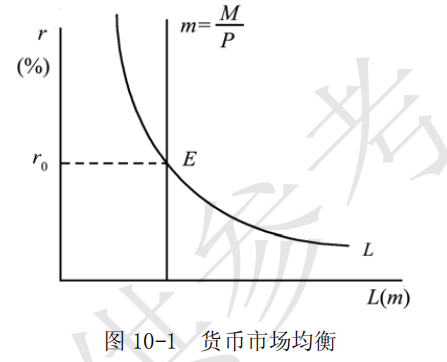

# 第 10 章 产品市场和货币市场的一般均衡

> **本章核心问题**：产品市场（IS曲线）和货币市场（LM曲线）如何同时达到均衡？利率和收入如何相互作用？货币政策如何影响经济？

## 核心概念

### 资本的边际效率

资本的边际效率是一种贴现率，这一贴现率恰好使一项资本品在使用期内各预期收益的贴现值之和等于该项资本品的供给价格和重置成本。

即：

$$R_0 = \frac{R_1}{1+r_c} + \frac{R_2}{(1+r_c)^2} + \cdots + \frac{R_n}{(1+r_c)^n}$$

**【符号说明】**
| 符号 | 英文全称 | 中文含义 |
|------|----------|----------|
| $R_0$ | Supply Price / Replacement Cost | 资本品的供给价格/重置成本 |
| $R_1, \cdots, R_n$ | Expected Returns | 未来各期的预期收益 |
| $r_c$ | Marginal Efficiency of Capital | 资本的边际效率（贴现率） |
| $n$ | Useful Life | 资本品的使用期限 |

资本的边际效率反映了投资者对预期收益的估计，因而也被称为**预期利润率**。由上式可知，预期收益的减少与重置成本的上升都会使资本边际效率递减。

### 投资函数

以资本的边际效率不变为条件，投资取决于利息率，并且是利率的减函数，投资与利息率呈反方向变动关系。

用公式表示为：

$$I = I(r)$$

**【符号说明】**
| 符号 | 英文全称 | 中文含义 |
|------|----------|----------|
| $I$ | Investment | 投资需求 |
| $r$ | Interest Rate | 利息率 |

**经济含义**：利率上升 → 投资成本增加 → 投资减少；利率下降 → 投资成本降低 → 投资增加。

### IS 曲线

**IS 曲线是将产品市场处于均衡的收入与利息率的组合描述出来的曲线。**

**【名称含义】**
| 字母 | 英文全称 | 中文含义 |
|------|----------|----------|
| **I** | **Investment** | **投资** |
| **S** | **Saving** | **储蓄** |

IS曲线表示：**投资（I）= 储蓄（S）**时，利率与收入的组合轨迹。

在两部门经济中，如果经济中的储蓄函数为 $S = S(Y)$，投资函数为 $I = I(r)$，那么 IS 曲线为：

$$S(Y) = I(r)$$

**【符号说明】**
| 符号 | 英文全称 | 中文含义 |
|------|----------|----------|
| $S$ | Saving / Savings Function | 储蓄/储蓄函数 |
| $Y$ | Income / National Income | 收入/国民收入 |
| $I$ | Investment / Investment Function | 投资/投资函数 |
| $r$ | Interest Rate | 利息率 |

由于均衡收入与利息率之间呈反方向变动，因而 IS 曲线向右下方倾斜。

### 流动偏好

流动偏好也称流动性偏好，是指人们持有货币的偏好。由于货币是流动性最大的资产，故人们会对货币产生偏好。

引起这种偏好的动机可以区分为：

| 动机 | 含义 | 决定因素 |
|------|------|----------|
| **交易动机** | 日常交易需要持有货币 | 收入水平 $Y$ |
| **谨慎/预防动机** | 应对意外支出需要持有货币 | 收入水平 $Y$ |
| **投机动机** | 等待有利投资机会而持有货币 | 利率水平 $r$ |

货币需求函数为：

$$L = L_1(Y) + L_2(r)$$

**【符号说明】**
| 符号 | 英文全称 | 中文含义 |
|------|----------|----------|
| $L$ | Liquidity Preference / Money Demand | 流动性偏好/货币需求 |
| $L_1(Y)$ | Transaction and Precautionary Demand | 交易和预防动机引起的货币需求 |
| $L_2(r)$ | Speculative Demand | 投机动机引起的货币需求 |
| $Y$ | Income / National Income | 收入/国民收入 |
| $r$ | Interest Rate | 利息率 |

- $L_1(Y)$ 与收入**同方向变动**（$Y↑ → L_1↑$）
- $L_2(r)$ 与利率**反方向变动**（$r↑ → L_2↓$）

### 流动偏好陷阱

流动性陷阱又称凯恩斯陷阱，是指当利率水平极低时，人们对货币的投机性需求趋于无限大，货币当局即使增加货币供给，也难以继续压低利率并刺激投资的一种经济状态。

### LM 曲线

**LM 是描述货币市场处于均衡的利息率和国民收入的组合曲线。**

**【名称含义】**
| 字母 | 英文全称 | 中文含义 |
|------|----------|----------|
| **L** | **Liquidity Preference** | **流动性偏好（货币需求）** |
| **M** | **Money Supply** | **货币供给** |

LM曲线表示：**货币需求（L）= 货币供给（M）**时，利率与收入的组合轨迹。

在货币市场上，对应于特定的收入，货币需求与货币供给相等决定均衡利息率。但不同收入水平对应着不同的货币需求，从而决定不同的均衡利息率。收入与均衡利息率的对应关系就是 LM 曲线，用公式表示为：

$$L_1(Y) + L_2(r) = m$$

**【符号说明】**
| 符号 | 英文全称 | 中文含义 |
|------|----------|----------|
| $L_1(Y)$ | Transaction and Precautionary Demand | 交易和谨慎动机引起的货币需求 |
| $L_2(r)$ | Speculative Demand | 投机动机引起的货币需求 |
| $m$ / $M$ | Real Money Supply / Money Supply | 实际货币供给/货币供给 |

---

**【产品市场 vs 货币市场：为什么IS=产品，LM=货币？】**

| 市场 | 本质问题 | 交易对象 | 均衡条件 | 为什么叫这个名字？ |
|------|----------|----------|----------|-------------------|
| **产品市场** | 实物产品如何生产和分配？ | **商品和劳务**<br>（消费品、机器、设备） | **储蓄 = 投资**<br>($S = I$) | **I**nvestment购买**机器设备**（实体经济） |
| **货币市场** | 货币（资金）如何融通？ | **货币本身**<br>（现金、存款） | **货币需求 = 货币供给**<br>($L = M$) | **L**iquidity偏好持有**现金**（金融经济） |

---

**【两个市场的相互关系】**

**1. 产品市场 → 货币市场**

$$收入(Y)↑ → 货币交易需求(L_1)↑ → 货币总需求(L)↑ → 利率(r)↑$$

**传导过程**：
- 产品市场繁荣 → 产出和收入增加
- 人们需要更多货币进行交易
- 货币需求上升
- 在货币供给不变时，利率被推高

**2. 货币市场 → 产品市场**

$$利率(r)↑ → 投资成本↑ → 投资(I)↓ → 总需求↓ → 收入(Y)↓$$

**传导过程**：
- 货币市场利率上升
- 企业贷款买设备的成本增加
- 投资需求下降
- 总需求减少，收入下降

---

**【IS-LM模型：两个市场同时均衡】**

| 变量 | 产品市场(IS) | 货币市场(LM) | 同时均衡 |
|------|--------------|--------------|----------|
| **内生变量** | 收入 $Y$ | 利率 $r$ | $Y^*, r^*$ |
| **外生变量** | 利率 $r$（影响投资） | 收入 $Y$（影响货币需求） | 政府支出 $G$、货币供给 $M$ |
| **均衡条件** | $S(Y) = I(r)$ | $L(Y,r) = M$ | IS与LM交点 |

**关键洞察**：

> **利率**是连接两个市场的**桥梁**：
> - 产品市场上，利率影响投资
> - 货币市场上，利率由供求决定

**图形示意**：

```
利率(r)
  ↑
  |       IS
  |      /
  |     /   ← 向右下方倾斜（r↑ → I↓ → Y↓）
  |    /   
  |   ·     ← 均衡点(E)：两个市场同时均衡
  |  / \    
  | /   \   ← 向右上方倾斜（Y↑ → L↑ → r↑）
  |/     LM
  +----------------→ 收入(Y)
          E点：IS与LM的交点
               决定均衡Y*和r*
```

**总结**：产品市场和货币市场通过利率和收入相互影响、相互制约，只有当两个市场同时达到均衡时，整个经济才能处于一般均衡状态。

## 问题与分析

### 简述货币市场的均衡条件并加以简要评论。

**【符号说明】**
| 符号 | 英文全称 | 中文含义 |
|------|----------|----------|
| $L_1(Y)$ | Transaction and Precautionary Demand | 交易和谨慎动机引起的货币需求 |
| $L_2(r)$ | Speculative Demand | 投机动机引起的货币需求 |
| $m$ | Real Money Supply | 实际货币供给 |
| $M$ | Nominal Money Supply | 名义货币供给 |
| $P$ | Price Level | 价格水平 |
| $r_0$ / $r$ | Interest Rate | 均衡利率水平/利息率 |
| $Y$ | Income / National Income | 国民收入 |

- （1）根据凯恩斯主义理论，当货币的供给等于货币的需求时，货币市场处于均衡，并相应地决定均衡的利率水平。

	- ①通常，货币供给被认为是由一国的货币当局发行并调节的一个外生变量，其大小与利息率无关，表示为 m 。故在以利息率为纵坐标，货币量为横坐标的坐标系内，货币供给曲线是一条垂直于横轴的直线。
	- ②凯恩斯主义的货币需求理论是建立在凯恩斯的流动偏好基础上的。交易动机（预防意外支出而持有一部分货币的动机）、预防动机（为应付各种意外发生的事情而形成的对货币的需求）和投机动机（为了抓住有利的购买有价证券的机会而持有一部分货币的动机）三种动机引起货币需求。其中，交易和谨慎动机所引起的货币需求与收入有关，并且随着收入的增加而增加，表示为 $L_1(Y)$ ；而投机动机引起的货币需求与利息率成反方向变动，表示为 $L_2(r)$ 。这样，货币需求可表示为：$$L=L_1(Y)+L_2(r)$$

	- ③货币市场的均衡条件可以表示为：$$L_1(Y) + L_2(r) = m = \frac{M}{P}$$
	 其中 $m = \frac{M}{P}$ 为实际货币供给。

**【名义货币供给 vs 实际货币供给】**

| 符号 | 英文全称 | 中文含义 | 公式 |
|------|----------|----------|------|
| $M$ | Nominal Money Supply | 名义货币供给 | 央行发行的货币总量（面值） |
| $P$ | Price Level | 价格水平 | 物价指数 |
| $m$ | Real Money Supply | 实际货币供给 | $m = \frac{M}{P}$ |

**直观理解**：
- 名义货币供给 $M$ = "你手里有多少钱"
- 实际货币供给 $m$ = "这些钱能买到多少东西"
- 价格上涨 → 同样的钱能买的东西变少 → 实际货币供给下降

在已知收入水平的情况下，上述均衡条件决定了均衡的利率水平 $r_0$ ，如图 10-1 所示。



- （2）凯恩斯的货币需求理论在一定程度上发展了庇古的货币数量论，特别是明确指出投机动机而突出了利息率的作用。
	但正如有些西方学者所指出的，凯恩斯的货币理论只注意到利率和收入对货币需求的影响，而忽略了人们对财富的持有量也是决定货币需求的重要因素。此外，西方学者认为，凯恩斯把财富的构成看得过于简单，好像在现实的社会中，只有货币和债券两种资产可供人们选择，这些都是有待改进的地方。

### 简述凯恩斯的货币理论。

**核心观点**：利率由货币供求决定，而货币需求取决于人们持有货币的三个动机。

---

**（1）人们为什么需要货币？——三大动机**

| 动机 | 通俗理解 | 取决于 | 与收入/利率的关系 |
|------|----------|--------|------------------|
| **交易动机** | 日常花钱买吃的喝的 | 收入 $Y$ | $Y↑$ → 需要**更多**钱 |
| **预防动机** | 存钱应急（看病、修车） | 收入 $Y$ | $Y↑$ → 需要**更多**钱 |
| **投机动机** | 持币等待投资机会 | 利率 $r$ | $r↑$ → 需要**更少**钱 |

**货币需求公式**：
$$L = L_1(Y) + L_2(r)$$

- $L_1(Y)$ = 交易 + 预防需求（随收入增）
- $L_2(r)$ = 投机需求（随利率减）

**特殊情况——凯恩斯陷阱**：
> 当利率极低时，人们预期利率只会上升不会下降（债券价格只会下跌），于是都把货币拿在手里，货币需求趋向无穷大。

---

**（2）货币供给由谁决定？——央行**

| 特点 | 说明 |
|------|------|
| **外生变量** | 由央行控制，与利率无关 |
| **图形** | 垂直线（供给量固定） |
| **分类** | 狭义（现金+活期）、广义（+定期存款） |

---

**（3）利率如何决定？——供求平衡**

$$货币需求 = 货币供给$$

| 情况 | 货币供求 | 人们的行为 | 利率变动 |
|------|----------|------------|----------|
| 供 > 求 | 钱太多了 | 买债券 | 利率**↓** |
| 供 < 求 | 钱不够用 | 卖债券 | 利率**↑** |
| 供 = 求 | 刚好 | 不动 | 利率**稳定** |

**简单记忆**：
> 利率是**钱的价格**。钱多了（供>求），价格跌（利率↓）；钱少了（供<求），价格涨（利率↑）。

---

**【详细阐述】**

凯恩斯的货币理论是指凯恩斯提出的名义利率是持有货币的机会成本，货币需求随利率上升而减少，利率的决定使货币供求相等的理论。

**（1）货币的需求**

凯恩斯的货币理论主要是货币需求理论。凯恩斯认为，人们需求货币是出于货币在所有资产形式中具有最高的流动性，具体由三种动机引起：

| 动机 | 详细说明 |
|------|----------|
| **交易动机** | 为日常交易而持有货币。收入越高，交易越多，所需货币越多。 |
| **预防动机** | 为应付意外支出而持有货币。收入越高，预防性货币需求越多。 |
| **投机动机** | 为抓住有利的购买有价证券的机会而持有货币。利率越高，持有货币的机会成本越大，投机需求越少。 |

货币需求函数为：
$$L = L_1(Y) + L_2(r)$$

其中 $L_1(Y)$ 取决于收入，$L_2(r)$ 取决于利率。当利率极低时，出现**凯恩斯陷阱**（流动性陷阱），货币需求趋向无穷大。

**（2）货币的供给**

货币供给是一个存量概念，有狭义和广义之分：
- **狭义货币供给**（$M_1$）：包括硬币、纸币和活期存款
- **广义货币供给**（$M_2$）：硬币、纸币、活期存款 + 定期存款
- **更广义货币供给**：还包括政府债券等流动资产

货币供给由国家用货币政策来调节，是一个**外生变量**，其大小与利息率无关。因此，货币供给曲线是一条垂直于横轴的直线。

**（3）利息率的决定**

货币供给与货币需求的均衡决定市场均衡利息率：

- 当市场利率 > 均衡利率时：货币供给 > 货币需求，人们持有超过意愿的货币量，会购买有价证券，证券价格上涨，利率下降
- 当市场利率 < 均衡利率时：货币供给 < 货币需求，人们感到货币太少，会卖出有价证券，证券价格下跌，利率上升
- 当货币供求相等时：利率不再变动，达到均衡

### 凯恩斯是如何解释资本主义经济的有效需求不足的？他所引申出的政策结论是什么？

按照凯恩斯的理论，在资本主义经济中，国民收入主要取决于社会的总需求，而社会的总需求由消费和投资构成。正是消费和投资的不足导致在总供给和总需求达到均衡状态时的社会需求不足以实现充分就业，即有效需求不足。对于消费不足和投资不足，凯恩斯运用三个基本规律，即边际消费倾向递减规律、资本边际效率递减规律以及流动性偏好来加以解释。

- （1）边际消费倾向递减规律。
>虽然人们的消费随收入的增加而增加，但在所增加的收入中用于增加消费的部分越来越少，凯恩斯认为边际消费倾向递减规律是由人类的储蓄天性所决定的。由于这一规律的作用，出现消费不足。

- （2）资本的边际效率递减规律。
>资本的边际效率是使得预期收益现值之和等于资本品价格的贴现率，它反映了厂商增加投资的预期利润率。资本的边际效率递减意味着厂商增加投资时预期利润率递减。凯恩斯认为，投资需求取决于资本边际效率与利率的对比关系。对应于既定的利息率，只有当资本边际效率高于这一利息率时才会有投资。但是，在凯恩斯看来，由于资本边际效率在长期中是递减的，除非利息率可以足够低，否则会导致经济社会中投资需求不足。

引起资本边际效率递减的原因主要有两个：
- ①投资的不断增加必然会引起资本品供给价格的上升，而资本品供给价格的上升意味着成本增加，从而会使投资的预期利润率下降；
- ②投资的不断增加，会使所生产出来的产品数量增加，而产品数量增加会使其市场价格下降，从而投资的预期利润率也会下降。资本边际效率的递减往往使资本家对未来缺乏信心，从而引起投资需求的不足。

- （3）流动偏好。
>流动偏好是指人们持有货币的心理偏好。凯恩斯认为人们之所以产生对持有货币的偏好，是由于货币是流动性或者说灵活性最大的资产，货币可随时作交易之用，可随时用于应付不测，可随时用作投机，因而人们有持有货币的偏好。当利息率降低到一定程度之后，人们预计有价证券的价格已经达到最大，从而愿意多持有货币，以致对货币的需求趋向于无穷大。结果，无论货币供给有多大，货币市场的利息率都不会再下降。由于这种心理规律的作用，利息率居高不下，当预期利润率低于或接近利息率时，厂商就不愿意进行投资，从而也导致投资需求不足。

从以上三个心理规律中可以看到，有效需求不足是导致资本主义社会出现经济萧条与失业的关键。由此，凯恩斯主张，为保持充分就业，需要用国家消费和国家投资来弥补社会中私人消费和私人投资的不足，刺激有效需求，在政策上政府应通过财政手段，如举债、增加政府购买支出、增加转移支出、减少税收等措施来刺激有效需求。凯恩斯论证了国家干预经济的必要性。

## 推导与例题

### 已知消费函数为 C = 100 + 0.6Y（或储蓄函数），投资函数为 I=520-r，货币需求为  L=0.2Y - 4r ，货币的供给为 m = 120。

**【符号说明】**
| 符号 | 英文全称 | 中文含义 |
|------|----------|----------|
| $C$ | Consumption | 消费 |
| $Y$ | National Income | 国民收入 |
| $I$ / $I(r)$ | Investment | 投资/投资函数 |
| $r$ | Interest Rate | 利息率 |
| $L$ / $L_1(Y) + L_2(r)$ | Money Demand | 货币需求/货币需求函数 |
| $m$ | Real Money Supply | 实际货币供给 |
| $M$ | Nominal Money Supply | 名义货币供给 |
| $P$ | Price Level | 价格水平 |
| $S$ / $S(Y)$ | Saving | 储蓄/储蓄函数 |
| $\alpha$ | Autonomous Consumption | 自主消费（截距项） |
| $\beta$ | Marginal Propensity to Consume | 边际消费倾向 |

- （1）写出 $IS$ 曲线方程。
- （2）写出 $LM$ 曲线方程。
- （3）写出 $IS-LM$ 模型的具体方程并求解均衡的国民收入（ $Y$ ）和均衡的利息率（ $r$ ）各是多少？
- （4）如果自主投资由 520 增加到 550，均衡国民收入会如何变动？你的结果 与乘数定理的结论相同吗？请给出解释。

解：
- （1）通过消费函数求解储蓄函数：

$$S=Y-C=-100+0.4Y$$

并带入到  $I = S$  中得：

$$-100+0.4Y=520-r$$

整理得 IS 曲线方程为：

$$Y=1550-2.5r$$

- （2）把已知条件带入到 $L=m$ 中得：

$$0.2Y-4r=120$$

整理得 LM 的曲线方程为： $$Y=600+20r$$ 。

- （3）把 $IS$ 曲线和 $LM$ 曲线的方程联立，可以得到 $IS-LM$ 模型的具体方程为：

$$\begin{cases}
Y=1550-2.5r \\
Y=600+20r
\end{cases}$$

解这个方程组可得：均衡国民收入  $Y = 1444.44$ ，均衡利息率 $r = 42.22$ 。

- （4）当自主支出从 520 增加到 550，投资函数变为 $I = 550 - r$ ，重复（1），（2）的计算过程，解得新均衡国

民收入为： $Y^{'}=1550$ ，则均衡国民收入增量为：

$$\Delta Y = 1550-1444.44=105.56$$

消费函数定义:   $$C=\alpha  + \beta Y_d$$

当前消费函数为:  $C=100 + 0.6Y$  可得到 $\beta = 0.6$

按照乘数定理 
$$\Delta Y=\frac{\Delta I}{1-\beta}$$
当自主投资增加量为 30，即 $\Delta I=30$  时，有：

$$\Delta Y^{'}=\frac{30}{1-0.6}=75<\Delta Y=105.56$$

可见，结论与乘数定理不相同，因为乘数理论是在产品市场分析中得到，因而并没有考虑到货币市场的影响，特别是利息率的影响，因此投资不随利率的变化而变化，即投资的增量即为自主投资的变化量；
而在产品市场和货币市场的一般均衡中，由于国民收入的增加引起利率的升高，而投资为利率的减函数，因此其增加量小于自主投资的增加量，导致达到重新均衡时的国民收入增加量较低。
因此，现实中乘数理论并不一定发挥如此大的作用。

---
