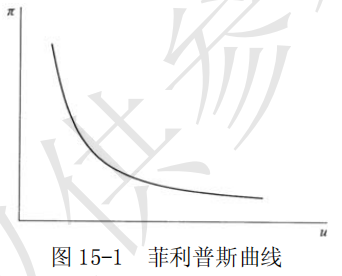

# 第 15 章 宏观经济学的意见分歧

> **本章核心问题**：凯恩斯主义、货币主义、供给学派等不同学派在政策主张上有何分歧？政府应否干预经济？规则与相机抉择如何选择？

## 核心概念

### 货币主义

**【基本信息】**
| 项目 | 内容 |
|------|------|
| **又称** | 货币学派 |
| **出现时间** | 20世纪50年代后期 |
| **发源地** | 美国 |
| **代表人物** | 弗里德曼、沃尔特斯、帕金、弗里希等 |
| **理论基础** | **现代货币数量论** |
| **政策主张** | **单一规则的货币政策** |

---

**【核心思想】**

$$货币供给量的变动 → 物价水平和经济活动变动$$

| 核心观点 | 解释 |
|----------|------|
| **货币最重要** | 货币的推动力是说明产量、就业和价格变化的最主要因素 |
| **货币供给是关键** | 货币供给量的变动是货币推动力的最可靠的度量标准 |
| **控制货币供给** | 通货膨胀、经济萧条或经济增长都可以通过控制货币供给量来调节 |
| **著名论断** | "通货膨胀随时随地都是一种**货币现象**" |

---

**【货币主义的基本命题】**

| 序号 | 命题 | 含义 |
|------|------|------|
| ① | 货币最重要 | 货币的推动力是说明产量、就业和价格变化的最主要的因素 |
| ② | 货币供给是度量标准 | 货币供给量的变动是货币推动力的最可靠的度量标准 |
| ③ | 货币当局控制 | 通货膨胀、经济萧条或经济增长都可以而且应当惟一地通过货币当局对货币供给量的控制来加以调节 |

---

**【与凯恩斯主义的区别】**

| 比较维度 | 凯恩斯主义 | 货币主义 |
|----------|------------|----------|
| **核心关注** | 总需求（消费、投资、政府支出） | **货币供应量** |
| **政策工具** | 财政政策为主 | **货币政策**为主 |
| **政策方式** | 相机抉择（逆经济风向行事） | **单一规则**（固定增长率） |
| **对市场看法** | 市场可能失灵，需要政府干预 | 市场自我调节，反对政府干预 |

---

**【政策指导思想】**

自由放任，反对政府干预。

> **简单理解**：市场上钱太多了 → 物价上涨 → 通货膨胀。控制通货膨胀 → 控制货币供给量。

### 自然率假说

自然率假说是指在没有货币因素干扰的情况下，劳动市场在竞争条件下达到均衡时所决定的就业率。
由于这一就业率与经济中的市场结构、社会制度、生活习惯等因素有关，因而被冠以“自然率”的名称。许多新自由主义经济学派都假定经济中存在着一个自然就业率，并运用各自的理论论证经济经常地处于这种状态。因而，自然率也被认为是一种假设。

### 菲利普斯曲线

菲利普斯曲线由英国经济学家 A.W. 菲利普斯首先提出，故得名。
他在 1958 年的原始研究考察的是英国失业率与货币工资增长率之间的负相关关系；后来经济学界才常将其引申为通货膨胀率与失业率之间的短期替代关系，并用于说明一般价格水平、失业率和总需求之间的关系，如图 15-1 所示。

对于菲利普斯曲线具体的形状，不同学派对此有不同的看法。
普遍接受的观点是：
- 在短期内，短期菲利普斯曲线向右下方倾斜
- 长期菲利普斯曲线是一条垂直线，表明失业率与通货膨胀率之间不存在替换关系。

### 单一货币规则

**【定义】**

单一货币规则是货币主义的政策主张，是货币主义经济学最重要的理论规则。

**核心含义**：为了防止货币成为经济混乱的原因，给经济提供稳定的运行环境，最优的货币政策是货币供应保持**固定的增长率**，**不论经济景气与否，都应维持不变**。

---

**【货币增长率的确定】**

$$货币增长率 = 经济增长率 + 通货膨胀率$$

**例子**：
- 如果经济增长率是 **3%**，期望通胀率是 **2%**
- 那么货币供应量每年增长 **5%**（固定不变）
- **无论经济过热还是衰退，都按5%增长**

---

**【相机抉择 vs 单一规则】**

| 比较维度 | **相机抉择**（凯恩斯主义） | **单一规则**（货币主义） |
|----------|---------------------------|-------------------------|
| **做法** | 经济热就紧缩，经济冷就扩张 | 货币增长率**固定不变** |
| **依据** | 判断当前经济状态 | 按预定增长率执行 |
| **灵活性** | 高 | 低 |
| **货币主义评价** | ❌ 会加剧波动（政策有滞后） | ✅ 给经济提供稳定环境 |

---

**【为什么要"单一规则"？】**

| 理由 | 说明 |
|------|------|
| **政策有滞后** | 今天采取的政策，可能1-2年后才生效，那时经济可能已经变了 |
| **政府不可靠** | 政府容易被短期利益诱惑，过度刺激经济 |
| **预期会调整** | 人们会形成理性预期，相机抉择政策最终无效 |

---

**【形象比喻】**

| 政策类型 | 形象比喻 | 结果 |
|----------|----------|------|
| **相机抉择** | 司机猛踩刹车和油门 | 晕车（经济波动加剧） |
| **单一规则** | 定速巡航 | 平稳（经济稳定增长） |

---

**【核心公式】**

$$\frac{\Delta M}{M} = \text{经济增长率} + \text{目标通货膨胀率}$$

| 符号 | 含义 |
|------|------|
| $\frac{\Delta M}{M}$ | 货币供应增长率 |
| 经济增长率 | 潜在GDP增长率 |
| 目标通货膨胀率 | 期望维持的通胀率 |

### 理性预期假设

理性预期假说是指经济当事人对价格、利率、利润或收入等经济变量未来的变动可以作出符合理性的估计。理性预期包含三个方面的特征：

- （1）预期平均说来是正确的；
- （2）经济当事人在充分利用所有有效信息的基础上对某个经济量作出预期；
- （3）经济当事人作出的预期与经济模型的预测相一致。

### 市场出清

市场出清是指，无论劳动市场上的工资还是产品市场上的商品价格都具有充分的灵活性，可以根据供求情况迅速进行调整，以达到供求相等的均衡状态。
有了这种灵活性，产品市场和劳动市场都不存在超额供给，每个市场都处于或趋于供求相抵的情况。

### 新古典宏观经济学

新古典宏观经济学，又称作“新古典主义”的一个经济学流派，这个学派的经济学遵循古典经济学的传统，相信市场力量的有效性；认为如果让市场机制自发地发挥作用，就可以解决失业、衰退等一系列宏观经济问题。新古典宏观经济学的代表人物有美国的经济学家罗伯特·卢卡斯、托马斯·萨金特、尼尔·华莱士、埃德渥德·普雷斯科特、罗伯特·巴罗，英国的P•明福尔德等。

新古典宏观经济学坚持市场出清假设。新古典宏观经济学家认为，工资和价格具有充分的伸缩性，可以迅速调整。这样，通过工资价格的不断调整，使供给量与需求量相等，市场连续地处于均衡之中，即被连续出清。因此，新古典宏观经济学家把表示供给量和需求量相等的均衡看作经常可以得到的情形。

在此假设基础之上，新古典宏观经济学反对政府对经济的干预。该派理论的目的是想证明宏观经济政策是无效的，甚至是有害的。卢卡斯等人的货币经济周期理论从不完全信息出发论证了货币政策无效。该论述的中心内容是，预期到的货币供给的变化只影响价格水平，而不影响产量；只有没有预期到的货币供给才影响产量。新一代的新古典宏观经济学家不满足于货币政策无效性命题，他们将新古典主义宏观经济学的研究方法应用到财政政策分析，得出了财政政策也无效的命题。

## 问题与分析

### 简要评论新古典宏观经济学对凯恩斯主义理论的批判。

新古典宏观经济学主要从经验检验和理论一致性两个方面展开对凯恩斯主义理论的批判。

- （1）从经验检验方面，新古典宏观经济学利用计量经济学的分析技术对菲利普斯曲线的形状进行了充分的检验，以便否定凯恩斯理论。由于滞涨现象的存在，检验结果对新古典宏观经济学有利。

- （2）从理论方面，首先，新古典宏观经济学指出了凯恩斯主义经济理论三大错误。
	- 第一，不合理性的预期。在凯恩斯理论中，经济当事人的预期通常被假定为不变，它主要取决于过去该变量的数值。这就意味着人们并不利用有关将来的信息来谋取最大的利益，因此违背了西方经济学中理性经济人的基本假设。
	- 第二，在一个理论体系中个人行为不一致。比如，微观经济学中分析劳动供给时，假定人们就收入和闲暇进行选择，但在宏观消费理论中又假定人们储蓄的目的是为了将来的消费，即劳动者要在现在和将来之间进行选择。但并没有一种理论说明二者的一致性。
	- 第三，以国内生产总值作为评价政策的标准不能反映人们的福利状况。

其次，在批判凯恩斯理论的基础上，新古典宏观经济学全盘否定宏观经济政策的有效性。根据基于理性预期假设和货币主义的自然率假说，新古典宏观经济学认为，凯恩斯主义政策的有效性是建立在欺骗公众基础上的。

经济中存在着一个由资源、制度、习惯、市场结果等因素决定的自然就业率水平，同时人们会以理性的方式形成预期，在自然因素保持不变的条件下，持续的政策效果是不可能的。不仅如此，由于政府不能预测经济当事人的行为，因而政策的后果可能是加剧经济波动。

上述结论主要来自于著名的“卢卡斯批判”。卢卡斯认为，凯恩斯主义政策的有效性大多是根据参数固定不变的计量经济学模型，但经济当事人的理性预期将使得这些参数发生改变，从而使得政策并不能达到预期的效果。

## 综合论述

### 评述货币主义的基本观点。

**【基本信息】**

| 项目 | 内容 |
|------|------|
| **学派名称** | 货币主义 / 货币学派 |
| **出现时间** | 20世纪50年代后期 |
| **发源地** | 美国 |
| **代表人物** | 弗里德曼、沃尔特斯、帕金、弗里希等 |
| **理论基础** | 现代货币数量论 |
| **核心主张** | 制止通货膨胀、反对国家干预 |

---

**【一、基本命题】**

| 序号 | 命题 | 含义 |
|------|------|------|
| ① | **货币最重要** | 货币的推动力是说明产量、就业和价格变化的最主要因素 |
| ② | **货币供给是度量标准** | 货币供给量的变动是货币推动力的最可靠的度量标准 |
| ③ | **控制货币供给** | 通货膨胀、经济萧条或经济增长都可以而且应当惟一地通过货币当局对货币供给量的控制来加以调节 |

**政策指导思想**：自由放任，反对政府干预。

---

**【二、理论特征】**

| 特征 | 说明 |
|------|------|
| **分析方法** | 预期量分析法 + 名义量分析法 |
| **思想基础** | 新自由主义思想贯穿始终 |

**新自由主义的四大自由观**：

| 序号 | 观点 |
|------|------|
| ① | 强调人们相互关系的自由和个人的自由 |
| ② | 经济活动中依靠私有制和市场经济，政治活动中通过少数服从多数 |
| ③ | 经济自由是达到政治自由的不可缺少的手段 |
| ④ | 人是”不完善的实体”，绝对自由不存在，自由需要政府保护 |

---

**【三、理论主要内容】**

| 理论 | 核心观点 |
|------|----------|
| **① 市场经济理论** | 政府干预应保留在有限范围内 |
| **② 持久收入理论** | 消费取决于持久性收入（非当前收入）；货币需求高度稳定 |
| **③ 货币数量论** | 价格总水平与货币供给量**同方向变动** |
| **④ 通胀与失业理论** | “通货膨胀随时随地都是一种**货币现象**”；长期菲利普斯曲线是**垂直线** |
| **⑤ 政策主张** | 单一规则的货币政策、收入指数化、负所得税 |

---

**【四、通货膨胀与失业理论详解】**

**核心论断**：”通货膨胀随时随地都是一种货币现象”

| 机制 | 说明 |
|------|------|
| **自然失业率假说** | 经济中存在一个自然的就业水平 |
| **短期权衡** | 提高就业率 → 必须以一定的通货膨胀为代价 |
| **预期调整** | 人们会不断调整通胀预期 → 政策效果递减 |
| **长期结论** | 长期菲利普斯曲线是**垂直线** → 通胀不影响失业 |

$$长期菲利普斯曲线：失业率与通货膨胀率无关$$

---

**【五、政策主张】**

| 政策类型 | 货币主义观点 | 理由 |
|----------|-------------|------|
| **相机抉择财政政策** | ❌ 反对 | 挤出效应，无效 |
| **相机抉择货币政策** | ❌ 反对 | 政策有滞后，会加剧波动 |
| **单一规则货币政策** | ✅ 主张 | 货币增长率固定不变 |
| **收入指数化** | ✅ 主张 | 消除通胀对收入分配的影响 |
| **负所得税** | ✅ 主张 | 保障低收入群体 |

**单一规则的具体内容**：
- 由货币当局公开宣布今后相当长时期内每年的货币增长率**不变**
- 增长率大致等于国民收入可能实现的增长率
- 以保证经济增长和物价稳定

---

**【六、评价】**

| 优点 | 局限 |
|------|------|
| ✅ 揭示了凯恩斯理论的某些缺陷 | ❌ 把所有问题归结为货币 |
| ✅ 财政政策挤出效应被认可 | ❌ 掩盖了生产过程中的矛盾 |
| ✅ 对通货膨胀的分析有价值 | ❌ 过分强调货币的作用 |
| ✅ 强调货币政策的重要性 | |

**总体评价**：货币主义是在与凯恩斯理论论战中发展起来的，对理解通货膨胀和货币政策有重要贡献，但存在片面强调货币作用的倾向。

### 新凯恩斯主义是如何解释价格、工资黏性的？请加以评论。

**【核心概念：黏性的分类】**

| 类型 | 定义 | 归因 |
|------|------|------|
| **名义黏性** | 名义价格和名义工资的调整不能按需求变动而相应变动 | 产品市场上的**不完全竞争** |
| **实际黏性** | 价格、工资相对于另一种价格、工资的黏性 | 企业的**成本加成定价** |

**目的**：说明**非市场出清**，为政府干预提供理论依据。

---

**【六大理论解释】**

| 理论 | 核心观点 | 作用机制 | 政策含义 |
|------|----------|----------|----------|
| **① 菜单成本论** | 调整价格有成本 → 厂商不愿频繁调价 | 利润增加 > 菜单成本时才调价 | 价格有黏性 |
| **② 交错调整论** | 价格/工资调整时间是**交错**的 | 交错调整 → 价格/工资具有**惯性** | 政府仍有积极作用 |
| **③ 不完全竞争论** | 垄断厂商定价对需求不敏感 | 总需求变动 → **产量变动**大于价格变动 | 需要政府干预 |
| **④ 市场协调失灵论** | 单个经济人无力协调整体行为 | 理性个体 → 市场失灵 | 需要国家干预 |
| **⑤ 劳动市场论** | 隐含合同、局外人压力、效率工资 | 实际工资出现黏性 | 失业存在 |
| **⑥ 信贷配给论** | 信息不对称 → 信贷配给 | 利率 + 配给机制共同作用 | 货币政策有效 |

---

**【详细解释】**

#### ① 菜单成本论

**菜单成本**：厂商每次调整价格要花费的成本

| 成本类型 | 包含内容 |
|----------|----------|
| **直接成本** | 研究和确定新价格、编印更改价目表 |
| **机会成本** | 调整价格带来的其他损失 |

**逻辑**：只有当（调整后利润增加）>（菜单成本）时，厂商才调价

**结论**：菜单成本存在 → 厂商不愿频繁变动价格 → **价格有黏性**

---

#### ② 交错调整论

**假设前提**：理性预期

**核心机制**：

$$经济当事人调整价格的时间交错进行 → 价格和工资具有惯性$$

**政策含义**：即使存在理性预期，政府政策仍有积极作用

---

#### ③ 不完全竞争论

**前提**：不完全竞争市场

**核心观点**：

| 现象 | 结果 |
|------|------|
| 厂商利用垄断力定价 | 价格不随总需求变动 |
| 价格对需求不敏感 | **产量随总需求变动** |
| 总需求变动有外部影响 | 经济波动被放大 |

**结论**：不存在自发趋向充分就业的机制 → **需要政府干预**

---

#### ④ 市场协调失灵论

**核心问题**：市场机制不能协调众多经济当事人的行为

| 事实 | 结果 |
|------|------|
| 每个经济人都理性 | 但无法协调整体 |
| 单个市场力量很小 | 无力协调整个经济行为 |

**结论**：市场协调失灵 → 市场不能确保有效均衡 → **需要国家干预**

---

#### ⑤ 劳动市场论

**工资黏性的三大原因**：

| 原因 | 解释 |
|------|------|
| **隐含合同** | 风险中性厂商与风险厌恶工人之间存在非正式协议 |
| **局内人压力** | 在职工人（局内人）对厂商形成压力，保护自身利益 |
| **效率工资** | 工资与劳动效率正相关，为保持效率支付高工资 |

**结论**：实际工资出现黏性 → 失业存在

---

#### ⑥ 信贷配给论

**前提**：不完全信息的信贷市场

**核心机制**：

$$信息不对称 → 供给不完全了解风险 → 信贷配给$$

**运作方式**：利率机制 + 配给机制共同作用

**政策含义**：政府货币政策能纠正信贷市场失灵 → 提高效率、增进福利

---

**【总结与评论】**

| 方面 | 内容 |
|------|------|
| **核心目标** | 建立价格和工资黏性的理论基础，说明非市场出清 |
| **理论假设** | 在**最大化**和**理性预期**假设下解释黏性 |
| **政策含义** | 政府干预是必要的，可以改善市场失灵 |
| **与原凯恩斯主义区别** | 为黏性提供了微观基础，更符合理性假设 |

**总体评价**：新凯恩斯主义通过六大理论为价格和工资黏性提供了微观解释，在坚持理性预期假设的同时，证明了政府干预的必要性，是对凯恩斯主义的重要发展。
