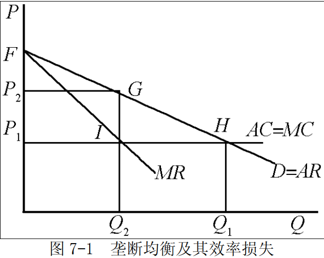

# 第 7 章 市场失灵和微观经济政策

> **本章核心问题**：为什么市场机制有时会失效？垄断、外部性、公共物品和不完全信息如何导致资源配置低效？政府应如何干预？

## 本章脉络

第 6 章的结论很漂亮：完全竞争的一般均衡是帕累托最优的。但它是假设的胜利——价格等于边际成本、私人成本等于社会成本、信息完全、产品都是私人物品，缺一条结论就塌。本章做的事，就是逐条检查这些前提：**垄断**打破「价格=边际成本」，**外部性**打破「私人成本=社会成本」，**公共物品**打破「排他性」，**不完全信息**打破「人人知道自己在买什么」。市场失灵不是市场的意外故障，而是福利定理前提清单的反面。

这套「找漏洞 + 开药方」的框架出自庇古的《福利经济学》（1920）：外部性可以用矫正税补齐私人与社会成本的差额（庇古税），公共物品该由政府提供。半个世纪后科斯在《社会成本问题》（1960）反问：外部性是相互的（污染与停产都有代价），只要产权清晰、交易成本足够低，当事人自己就能谈出有效率的结果——政府的角色从「矫正」退到「界定产权」。再过十年，阿克洛夫的《柠檬市场》（1970）打开了最后一块版图：信息不对称不是摩擦，而是能让市场整个消失的力量。三类争论——庇古传统、科斯传统、信息传统——至今界定着微观经济政策的地图。

## 核心概念

### 市场失灵

市场失灵是指市场机制不能有效地配置资源。
垄断、外部影响、公共物品以及不完全信息都是导致市场失灵的重要原因和主要表现。
西方经济学者认为，在现实社会中，种种原因将导致市场失灵，即市场机制的运转无法使社会资源达到最优配置，无法实现社会经济福利的最大化等社会目标。因此，市场机制的作用并不是万能的，必须通过政府对经济的干预来加以克服。

值得先说清楚的是逻辑关系：「市场失灵」证明了干预的**必要**，却没证明干预必然**更好**——这个不对称留给本章末尾的「局限与后续」。

### 公共物品

通常把不具备排他性或（和）竞争性，一旦生产出来就不可能把某些人排除在外的商品称为（纯）公共物品。商品的排他性是指商品的生产者或者购买者可以很容易地把他人排斥在获得该商品带来的利益之外；商品的竞争性是指消费商品的数量与生产这一数量的成本有关。

排他性与竞争性两两组合，把商品世界分成四格：私人品（都具备，市场最擅长）、公共物品（都不具备，如国防）、公共资源（竞争但不排他，如渔场——会被过度捕捞）、俱乐部物品（排他不竞争，如收费视频）。市场失灵集中在后三格。

### 免费乘车者问题

免费乘车者问题是指经济中由于存在不支付即可获得消费满足而产生的市场失灵问题。产生的原因是商品的非排他性。既然每个消费者都是经济上理性的，而公共物品又具有非排他性，那么每个消费者都将利用这一点，在不支付费用的条件下享受商品的效用。由于商品的非排他性，拥有或消费这种商品的人不能或很难把他人排除在获得该商品带来满足的范围之外。这一特征及其相应的问题被形象地称为搭便车。

搭便车的困境在于每个人单独看都是理性的：路灯照到所有路人，凭什么让我一个人付钱？但所有理性加总的结果是路灯没人装——个人理性与集体理性在此正面相撞。

### 外在性

外在性又称外部经济影响，是指一个经济行为主体的经济活动对另一个经济主体的福利所产生的效应，但这种效应并没有通过市场交易反映出来。外在性有正负之分，或称为外在经济和外在不经济。

「没有通过市场交易反映出来」是关键：工厂用河流排污，却没有为河流的洁净付过价——价格机制在这里失聪，这正是它被归入市场失灵的原因。

### 科斯定理

科斯定理是一种产权理论。
科斯本人并未将科斯定理写成文字，科斯定理的提出是由其好友斯蒂格勒首先根据科斯于 20 世纪 60 年代发表的《社会成本问题》这篇论文的内容概括出来的。
其内容是：只要财产权是明确的，并且其交易成本为零或者很小，则无论在开始时将财产权赋予谁，市场均衡的最终结果都是有效率的。

这一结论包含三个要素：
- ①交易费用为零；
- ②产权界定清晰；
- ③自由交易。

由此引申出来的第二定理是：
在交易费用不为零的条件下，不同的产权制度会影响到资源配置的效率。科斯定理现已成为制度经济学的一个重要结论。真正重要的其实是第二定理：现实世界交易成本无处不在，于是「产权怎样界定、制度怎样设计」不再是法学家的事，而成了资源配置问题本身。

### 逆向选择

逆向选择指在次品市场上出现的高质量产品遭淘汰而低质量产品生存下来的现象。
处于信息劣势的一方，往往按平均水平推测产品的质量，从而导致高质量产品的交易价格偏低，交易数量较少，甚至可能导致只有次品才能成交的逆向选择。

### 道德风险

道德风险是指交易双方在签订交易合约后，信息占优势的一方为了最大化自己的收益而损坏另一方，同时也不承担后果的一种行为，即是市场的一方不能查知另一方的行动的一种情形，又被称作隐藏行动问题。道德风险的存在不仅使得处于信息劣势的一方受到损失，而且会破坏原有的市场均衡，导致资源配置的低效率。

**【逆向选择 vs 道德风险 vs 委托—代理问题对比】**

| 比较维度 | 逆向选择 | 道德风险 | 委托—代理问题 |
|----------|--------------|--------------|------------------|
| 发生时间 | 签约前（交易发生前） | 签约后（交易发生后） | 签约后（合作关系中） |
| 信息问题类型 | 隐藏信息（Hidden Information） | 隐藏行动（Hidden Action） | 隐藏行动/努力程度 |
| 核心问题 | 不知对方**类型/质量** | 不知对方**行为** | 不知代理人**努力程度** |
| 信息优势方 | 卖方（如二手车卖家） | 买方（如被保险人） | 代理人（如员工、经理） |
| 信息劣势方 | 买方（如二手车买家） | 卖方（如保险公司） | 委托人（如股东、雇主） |
| 典型市场 | 二手车市场、保险市场、信贷市场 | 保险市场、劳动力市场 | 公司治理、劳动力市场 |
| 经典例子 | 柠檬市场（阿克洛夫） | 购买汽车保险后开车更鲁莽 | 股东无法监督经理是否努力工作 |
| 后果 | 高质量产品被驱逐，市场萎缩 | 风险增加，损失扩大 | 效率损失，利益冲突 |
| 解决方法 | 信号传递（保修、品牌）、政府介入 | 免赔额、共同分担风险 | 最优合约设计、激励机制 |

**【直观理解】**

| 问题 | 一句话概括 |
|------|------------|
| 逆向选择 | 「坏的驱逐好的」——签约前不知道谁是好人 |
| 道德风险 | 「有人变了」——签约后行为变了，更不负责 |
| 委托—代理 | 「代理人偷懒」——委托人无法监督代理人的努力程度 |

**【举例说明】**

**1. 逆向选择 —— 二手车市场**
```
买家：分不清好车坏车，只愿出「平均价」
好车卖家：平均价太低，不愿卖 → 退出市场
坏车卖家：平均价很划算，继续卖
结果：市场上只剩坏车（柠檬市场）
```

**2. 道德风险 —— 汽车保险**
```
投保前：小心驾驶，怕出事故
投保后：有保险兜底，开车更随意
保险公司：无法观察被保险人是否小心驾驶
结果：事故率上升，保险公司提高保费
```

**3. 委托—代理问题 —— 公司治理**
```
委托人（股东）：想利润最大化
代理人（经理）：想自己轻松/高薪
问题：股东无法每天监督经理是否努力工作
结果：经理可能偷懒或追求私利，损害股东利益
解决：股权激励、绩效奖金、独立董事
```

三个问题的时间线与信息结构一句话记住：逆向选择是**签约前**的隐藏信息，道德风险是**签约后**的隐藏行动，委托—代理是道德风险在组织内部的形态。

## 综合论述

### 市场为什么会出现失灵？政府应该采取哪些措施？

市场失灵是指市场机制不能有效地配置资源。垄断、外部影响、公共物品以及不完全信息都是导致市场失灵的重要原因和主要表现。

- （1）垄断及其矫正措施

实际上，只要市场不是完全竞争的（垄断、垄断竞争或寡头垄断），当价格大于边际成本时，就出现了低效率的资源配置状态。垄断的产生使得资源无法得到最优配置，从而导致市场失灵。由于垄断会导致资源配置缺乏效率，因此也就产生了对垄断进行公共管制的必要性。政府对垄断进行公共管制的方式或政策主要包括以下几种：

- ①控制市场结构，避免垄断的市场结构产生；
- ②对垄断企业的产品价格进行管制；
- ③对垄断企业进行税收调节；
- ④制定反垄断法或反托拉斯法；
- ⑤对自然垄断企业实行国有化。

- （2）外部影响及其矫正措施

外部影响是指一个经济活动的主体对他所处的经济环境的影响。
外部影响会造成私人成本和社会成本之间，或私人收益和社会收益之间的不一致，因此容易造成市场失灵。外部影响的存在造成了一个严重后果：市场对资源的配置缺乏效率。换句话说，即使假定整个经济仍然是完全竞争的，由于存在着外部影响，整个经济的资源配置也不可能达到帕累托最优状态。就外部影响所造成的资源配置不当，微观经济学理论提出以下政策建议：
- ①使用税收和津贴；
- ②使用企业合并的方法；
- ③使用规定财产权的办法。

- （3）公共物品及其矫正措施

对于公共物品而言，市场机制作用不大或难以发挥作用。
因为公共物品由于失去竞用性和排他性，增加消费并不会导致成本的增加，消费者对其支付的价格往往是不完全的，甚至根本无需付费。在此情况下，市场机制对公共物品的调节作用就是有限的，甚至是无效的。

由于公共物品的消费存在免费搭便车的问题，很难通过竞争的市场机制解决公共物品的有效生产问题。在此情况下，由政府来生产公共物品应是一种较好的选择。对于大多数有特殊意义的公共物品，由政府或政府通过组建国有企业来生产或向市场提供，是一种不错的选择，例如国防、公安等。

政府应提供多少公共物品才能较好地满足社会需要，使资源得到有效利用是问题的难点所在。现在更多的推荐采用非市场化的决策方式，例如投票，来表决公共物品的支出水平。显然，虽然用投票的方法决定公共物品的支出方案是调节公共物品生产的较好方法，但投票方式并不总能获得有效率的公共物品的支出水平。

- （4）不完全信息及其矫正措施

信息不完全是指经济当事人对信息不能全面地把握，不能完全利用交易有关的信息。
在现实生活中，供求双方的信息通常具有不对称性或不完全性。一旦供求双方所掌握的信息不完全，就会对市场机制配置资源的有效性产生负面影响，造成市场失灵。由信息不完全导致的后果通常包括逆向选择、道德风险和委托—代理问题。
信息的不对称性和信息的不完全性会给经济运行带来很多问题，而市场机制又很难有效地解决这些问题，在此情况下，就需要政府在市场信息方面进行调控。政府解决信息不对称和委托—代理问题的方法主要有：

- ①针对由于信息不对称产生的逆向选择问题，可以通过有效的制度安排或采取适当的措施来消除信息不充分所造成的影响；
- ②解决委托—代理问题最有效的办法是实施一种最优合约，即委托人花费最低限度的成本而使得代理人采取有效率的行动实现委托人目标的合约。

### 垄断厂商的均衡如何造成效率损失？政府有哪些对策？

（1）垄断是只有一个厂商提供全部市场供给的一种市场结构。
	垄断厂商的目标仍是利润最大化，故也会把产量选择在边际收益等于边际成本之点。



如图 7-1 所示，横轴表示厂商产量，纵轴表示价格，曲线 $D$ 和 $MR$ 分别表示厂商的需求曲线和边际收益曲线。
假定平均成本和边际成本相等且固定不变，由直线 $AC=MC$ 表示。为了使利润极大，厂商产量定在 $Q_2$，价格为 $P_2$，它高于边际成本，说明没有达到帕累托最优，因为这时消费者愿意为增加额外一单位所支付的数量（价格）超过生产该单位产量所引起的成本（边际成本）。显然，要达到帕累托最优，产量应增加到 $Q_1$，价格应降到 $P_1$，这时 $P=MC$。然而，垄断决定的产量和价格只能是 $Q_2$ 和 $P_2$。如果产量和价格是完全竞争条件下的产量 $Q_1$ 和价格 $P_1$，消费者剩余是 $\Delta F P_1 H$ 的面积，而当垄断者把价格提高到 $P_2$ 时，消费者剩余只有 $\Delta F P_2 G$ 的面积，所减少的消费者剩余的一部分（图 $P_1P_2GI$ 所代表的面积）转化为垄断者的利润，另一部分（$\Delta GIH$ 所代表的面积）就是由垄断所引起的社会福利的纯损失，它代表由于垄断造成的低效率带来的损失——被转移走的剩余只是分配问题，凭空消失的三角形才是效率问题。

- （2）由于垄断常常导致资源配置缺乏效率，另外垄断利润也被看成是不公平的，因而有必要对垄断进行政府干预。
政府对垄断的干预主要有反垄断法和价格与产量管制。为了消除垄断的影响，政府可以采取反垄断政策。针对不同形式的垄断，政府可以分别或同时采取行业的重新组合和处罚等手段，而这些手段往往是依据反垄断法来执行的。制止垄断行为可以借助于行政命令、经济处罚或法律制裁等手段。反垄断法则是上述措施的法律形式。

- ①行业的重新组合的基本思路是把一个垄断的行业重新组合成包含许多厂商的行业。采取的手段可以是分解原有的厂商，或扫除进入垄断行业的障碍。制止垄断行为可以借助于行政命令、经济处罚或法律制裁等手段。

- ②行业的管制主要是对那些不适合过度竞争的垄断行业，如航空航天、供水等行业所采取的补救措施。政府往往在保留垄断的条件下，对于垄断行业施行价格控制，或价格和产量的双重控制、税收或津贴以及国家直接经营等管治措施。由于政府经营的目的不在于最大利润，所以可以按照边际成本或者平均成本决定价格，以便部分地解决垄断所产生的产量低和价格高的低效率问题。

- ③管制自然垄断的做法还可以采用为垄断厂商规定一个接近于「竞争的」或「公正的」资本回报率，它相当于等量的资本在相似技术、相似风险条件下所能得到的平均市场报酬。由于资本回报率被控制在平均水平，也就在一定程度上控制住了垄断厂商的价格和利润。

### 外部性如何让完全竞争市场偏离帕累托最优？有哪些对策？

**核心结论**：无论正负外在性，都会导致资源配置偏离帕累托最优——即使市场是完全竞争的。原因只有一个：私人决策只考虑私人成本/收益，不考虑社会成本/收益。

**一、外在性的分类**

| 分类标准 | 类型 | 含义 | 例子 |
|----------|------|------|------|
| 按影响方向 | 正外在性（外在经济） | 给他人带来好处 | 教育、疫苗接种、研发 |
| | 负外在性（外在不经济） | 给他人带来损害 | 污染、噪音、二手烟 |
| 按产生来源 | 生产的外在性 | 生产活动影响他人 | 工厂排污 |
| | 消费的外在性 | 消费活动影响他人 | 吸烟、装修噪音 |

**二、外在性为什么导致低效率**

负外在性的情况（如污染）：

| 成本类型 | 含义 | 关系 |
|----------|------|------|
| 私人成本 (PMC) | 厂商自己承担的成本 | 小 |
| 社会成本 (SMC) | 私人成本 + 对他人的损害 | 大 |

$$SMC > PMC$$

厂商按 $PMC = PMR$ 决定产量，而社会最优要求 $SMC = SMR$——于是产量**过多**。

正外在性的情况（如教育）：

| 收益类型 | 含义 | 关系 |
|----------|------|------|
| 私人收益 (PMR) | 行为人自己获得的收益 | 小 |
| 社会收益 (SMR) | 私人收益 + 给他人的好处 | 大 |

$$SMR > PMR$$

个人按 $PMR = PMC$ 决定产量，而社会最优要求 $SMR = SMC$——于是产量**过少**。

| 外在性类型 | 私人决策 | 社会最优 | 结果 |
|------------|----------|----------|------|
| 负外在性 | 产量过多 | 产量应减少 | 供给过剩 |
| 正外在性 | 产量过少 | 产量应增加 | 供给不足 |

**三、解决对策**

| 对策 | 具体做法 | 适用场景 | 优点 | 缺点 |
|------|----------|----------|------|------|
| ①税收/补贴 | 对负外部性征税（如污染税、碳税）；对正外部性补贴（如教育补贴） | 政府可监管的领域 | 灵活，可调节力度 | 难以精确计量外部性大小 |
| ②企业合并 | 把产生外部性的企业与受影响的企业合并 | 相关企业可合并时 | 外部性内部化 | 适用范围有限 |
| ③明确产权 | 科斯定理：产权明晰 + 交易成本为零 → 市场自动解决 | 产权易界定、交易成本低 | 无需政府干预 | 现实中交易成本往往很高 |
| ④政府管制 | 直接规定排放标准、技术标准 | 污染严重、急需治理 | 效果直接 | 缺乏灵活性，成本可能较高 |

**科斯定理（第③种的依据）**：只要产权明晰且交易成本为零，无论初始产权如何分配，市场交易都能实现帕累托最优。

**举例**：

| 问题 | 税收/补贴方案 | 企业合并方案 | 产权方案 |
|------|---------------|--------------|----------|
| 工厂污染河流 | 征收污染税 | 工厂与下游渔民合并 | 明确河流清洁权 |
| 邻居装修噪音 | 征收噪音税 | 难以合并 | 明确安静权 |
| 教育投入不足 | 给予教育补贴 | 难以合并 | 人力资本产权 |

外在性的本质是市场失灵，根源在于私人成本/收益与社会成本/收益的分离。解决思路：要么让私人承担或获得全部社会成本/收益（税收、合并、管制），要么通过市场机制自动解决（科斯定理）。

### 信息不完全何以造成市场失灵？

信息不完全（或不对称）指市场的供求双方对于所交换的商品不具有充分的信息。信息非对称会导致资源配置不当，减弱市场效率，并且还会产生道德风险和逆向选择。在很多情况下，市场机制并不能解决非对称信息问题。

- （1）逆向选择

逆向选择指在买卖双方信息非对称的情况下，差的商品总是将好的商品驱逐出市场；或者说拥有信息优势的一方，在交易中总是趋向于做出尽可能有利于自己而不利于别人的选择。逆向选择的存在使得市场价格不能真实地反映市场供求关系，导致市场资源配置的低效率。一般在商品市场上卖者关于产品的质量、保险市场上投保人关于自身的情况等等都有可能产生逆向选择问题。解决逆向选择问题的方法主要有：政府对市场进行必要的干预和利用市场信号。

- （2）道德风险

道德风险指在双方信息非对称的情况下，人们享有自己行为的收益，而将成本转嫁给别人，从而造成他人损失的可能性。道德风险的存在不仅使得处于信息劣势的一方受到损失，而且会破坏原有的市场均衡，导致资源配置的低效率。道德风险分析的应用领域主要是保险市场。解决道德风险的主要方法是风险分担。

- （3）委托人—代理人问题

由于信息的不完全性，委托人往往不知道代理人要采取什么行动，或者即使知道代理人采取某种行动，也不能观察和测度代理人从事这一行动时的努力程度，同时两者之间存在的利益分割关系，通常会使得代理人不完全按照委托人的意图行事，这在经济学上被称为委托—代理问题。由委托人—代理人问题而导致的效率损失不可能通过政府的干预解决，而需要通过设计有效的激励措施加以解决。解决委托人—代理人问题最有效的办法是实施一种最优合约。最优合约是委托人花费最低限度的成本而使得代理人采取有效率的行动实现委托人目标的合约。

信息问题的三种形态有一个共同点：市场不是「失灵到低效」，而是可能**整个不存在**——柠檬太多时没有二手车市场，保费太高时没有保险市场。这也是 2001 年诺贝尔奖授给阿克洛夫、斯宾塞、斯蒂格利茨三人的理由所在：表彰他们对不对称信息市场的分析，包括对市场为何萎缩乃至消失的解释。

## 局限与后续

- **市场失灵不等于政府成功。** 干预的必要条件是市场失灵，充分条件还得是政府做得更好——而政府也有自己的失灵。公共选择学派（布坎南）把政治还原为交易：政治家追求选票、官僚追求预算最大化；斯蒂格勒（1971）的「管制经济理论」更指出管制常常被被管制者俘获，变成在位厂商挡住竞争者的工具。市场失灵与政府失灵对称存在，政策选择的真正问题是：哪种失灵的代价更小。
- **科斯的思路落地了：排污权交易。** 「为外部性造一个市场」从戴尔斯（1968）的构想变成美国 1990 年酸雨计划：政府设定二氧化硫排放总量、拍卖许可、企业之间自由交易。事后评估显示减排成本远低于命令式管制的预估——产权方案第一次拿到大规模实证支持。今天的碳市场沿同一逻辑运行；而庇古一脉则以碳税的形式复兴，两派在气候政策里正面竞争。
- **信息经济学长成了工具箱。** 阿克洛夫指出问题之后，斯宾塞（1973）给出信号发送——教育可以只是「证明自己聪明」的信号而不必提高生产率；罗斯柴尔德与斯蒂格利茨（1976）证明信息不对称的保险市场可能根本不存在均衡。反过来，既然信息结构决定市场存亡，就可以**设计**信息规则让市场运转——拍卖设计、匹配机制（肾交换、入学择校）这些「机制设计」工程，都是柠檬市场问题的正向应用。
