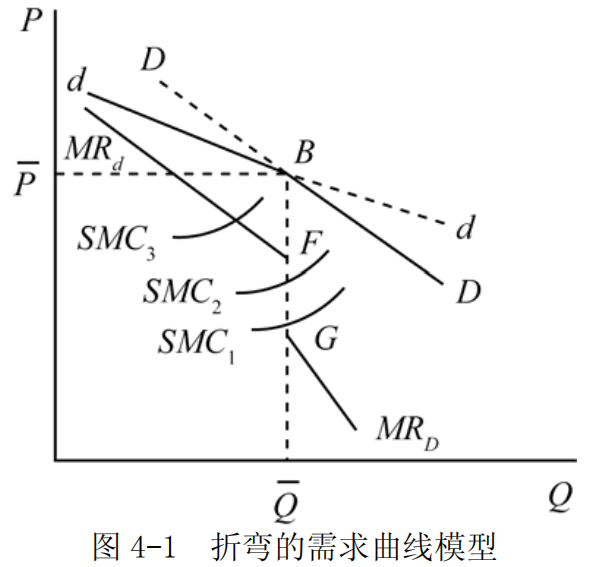

# 第 4 章 市场理论

> **本章核心问题**：不同市场结构（完全竞争、垄断、垄断竞争、寡头）下，厂商如何决定产量和价格？为什么不同市场中的厂商行为和效率存在差异？

## 本章脉络

供求图把市场当作一个整体，但「市场」和「市场」并不相同：农产品集市上的一个粮贩，和电信行业里的两家运营商，面对的根本不是同一种世界。市场理论要回答的问题是——**竞争的强度由什么决定，又如何改变厂商的行为与效率？**

推理链的起点是完全竞争这个极端。它把斯密「看不见的手」推到极限：厂商多到没有人能影响价格，于是价格等于边际成本，利润在长期被进入者磨平。这个基准在 1870 年代由边际主义者定型，但它的第一个严格版本其实更早——古诺 1838 年就用微积分解出了完全竞争和垄断两种情形。另一个极端是垄断：厂商就是整个行业，面对整条向下倾斜的需求曲线，价格被抬到边际成本之上。

现实几乎都落在这两个极端之间。斯拉法在 1926 年点破了尴尬：马歇尔的框架只能处理「要么完全竞争、要么垄断」，而现实里满是有差异的产品和为数不多的大厂商。回应在 1933 年同年到来：张伯伦的《垄断竞争理论》与罗宾逊的《不完全竞争经济学》各自把「产品差异」和「买方力量」装进模型。寡头则更棘手——每个厂商的最优选择取决于对手怎么选，古诺 1838 年的双头模型等了一百年才等到通用语言：纳什 1950 年的均衡概念。本章沿「完全竞争 → 垄断 → 垄断竞争 → 寡头」的顺序推进，每一步放宽一个假设。

## 核心概念

### 总收益、平均收益和边际收益

（1）厂商的总收益（ $TR$ ）是指厂商按照一定价格出售一定量产品所获得的全部收入，即： $$TR=p(y)\cdot{y}$$

式中的 $TR$ 为总收益， $p(y)$ 为厂商出售产品时面对的价格——在完全竞争中它是不随产量变的常数，在有定价权时则随销量增加而下降，$y$ 为销售总量。这一处差异正是本章所有分化的种子。

（2）平均收益（ $AR$ ）指厂商在平均每一单位产品销售上所获得的收入，即：

$$AR=TR/y=p(y)$$

平均收益等于产品价格，厂商所面临的需求曲线即为平均收益曲线。

（3）边际收益（ $MR$ ）指厂商增加一单位产品销售时所获得的收入增量，即：

$$MR=\frac{\Delta{TR}}{\Delta{y}}$$

当厂商面临着既定价格时，其边际收益等于价格；而当厂商面临着一条向右下方倾斜的需求曲线时，为了多卖一单位必须压低价格——且往往全部单位都要按新价格出售——所以其边际收益低于价格。垄断理论的全部特殊性都藏在这句话里。

### 厂商利润最大化原则

厂商利润最大化原则是厂商做生产决策时所遵循的一般原则，它要求每增加一单位产品（或要素）所增加的收益等于由此带来的成本增加量，即边际收益等于边际成本： $MR=MC$ 。

这也是厂商实现最大利润的均衡条件：在其他条件不变的情况下，厂商应该选择最优的产量，使得最后一单位产品所带来的边际收益等于所付出的边际成本。注意这个条件与市场结构无关——竞争厂商、垄断者、寡头统统适用，差别只在于各自的 $MR$ 长什么样。

### 完全竞争市场

完全竞争市场是指一种竞争不受任何阻碍和干扰的市场结构。
完全竞争市场的假设条件是：

- ①市场上，厂商生产同质的产品。
- ②市场上有众多的消费者和厂商，因而消费者和厂商都是市场价格的接受者。
- ③市场上的消费者和厂商拥有完全信息。
- ④厂商可以无成本地自由进入或退出市场。

事实上，这种理想的完全竞争市场很难在现实中存在。但是，完全竞争市场的资源利用最优、经济效率最高，可以作为经济政策的理想目标，所以，西方经济学家总是把完全竞争市场的分析当作市场理论的主要内容，并把它作为一个理想情况，以便和现实比较。基准的价值不在于真实，而在于给「现实偏离了多少、偏离的代价是什么」提供一把尺子——本章后面每种市场，都要拿回来和它对表。

### 外在经济和外在不经济

外在影响：某一经济主体的经济行为对社会上其他人的福利造成影响，但并不为此承担后果。

外在经济：某一经济个体的一项经济活动给社会其他成员带来好处，但并未获得相应的补偿，即个人获得的利益小于该活动中所带来的全部利益，也就是该经济个体的经济活动带来了正的外在影响；

外在不经济：某一经济个体的一项经济活动给社会其他成员带来成本，但并不需要自身去承担相应的全部成本，即个人所承受的成本小于该活动所带来的全部成本，也就是个人的经济活动带来了负的外在影响。

完全竞争市场中，随着厂商数目的增加，整个行业中的产量也会增加，如果行业中单个厂商的成本降低，则称该行业存在着外在经济；
如果厂商数量增加从而整个行业的产量增加使得单个厂商的成本增加，则称该行业存在着外在不经济。

### 价格歧视

统一定价会留下「本可以成交却没有成交」的遗憾：有人愿意出 20 元，定价 15 元就少收了 5 元。如果厂商能区分消费者、并阻止转售，它就会设法按每个人的支付意愿收费——这就是价格歧视：同一时期对同一种商品收取不同的价格。实行价格歧视的基本条件：

- ①市场的消费者具有不同偏好，且这些不同的偏好可以被区分开；
- ②不同的消费者群体或不同销售市场是相互隔离的。

价格歧视被划分为三类：
- 一级价格歧视是指垄断厂商对每一单位产品都按消费者愿意支付的最高价格出售，这种类型的价格歧视也被称为完全的价格歧视。
- 二级价格歧视是指对不同的消费数量段规定不同的价格；
- 三级价格歧视是垄断厂商在不同市场（或对不同的消费群）上收取不同的价格。

### 垄断竞争市场

垄断竞争市场是指一种由许多厂商生产和销售有差别的同种产品的市场，市场中既有垄断又有竞争，既不是完全竞争又不是完全垄断。

垄断竞争市场通常具有以下特征：
- 第一，行业中有大量的卖者和买者；
- 第二，厂商提供有差异但彼此接近的替代品；
- 第三，厂商进入或退出是自由的。

「差异」是这类市场的关键词：牌子、包装、口味、地段，让每个厂商都对自己那一小片市场有了一点定价权（垄断的来源），又时刻面临近似的替代品（竞争的来源）。张伯伦 1933 年正是用这个结构给现实中的零售业、餐饮业、轻工业画像。

### 寡头垄断市场

寡头垄断市场指那种在某一产业只存在少数几个卖者的市场组织形式。
典型的寡头市场具有以下一些特点：
- 第一，市场上存在少数厂商，单个厂商的产销量占整个市场相当大的份额，从而对市场价格具有明显的影响力；
- 第二，少数寡头之间的行为相互依存；
- 第三，寡头市场上的价格相对稳定，竞争大多是非价格形式；
- 第四，市场上存在进入障碍。

第二条是寡头的本质，也是分析的难点：我的最优产量取决于你怎么做，而你的又取决于我。这种相互依存让「把价格当作参数」的传统做法失效，也为博弈论埋下了入口。

### 古诺模型

古诺模型是一个只有两个寡头厂商的简单模型，即双头模型。古诺模型是早期的寡头模型，它通常被作为寡头理论分析的出发点。

假设两个面临同一市场的竞争厂商，它们生产无差异的产品，成本为 0。每个厂商把对手的产量当作给定，决定自己的利润最大化产量。最终，$n$ 个厂商各选择竞争产量的 $\frac{1}{n+1}$——当 $n=2$ 时即各占 $\frac{1}{3}$，剩下的 $\frac{1}{3}$ 是竞争没有磨掉的那部分稀缺——此时没有厂商再有变动产量的动力，市场处于均衡。这个 1838 年的模型里已经藏着八十年后才被命名的纳什均衡。

### 纳什均衡

纳什均衡指的是如果其他参与者不改变策略，任何一个参与者都不会改变自己的策略。也就是说，当其他参与者的策略给定的时候，自己的最优策略就是纳什均衡策略。

它的价值在于普适：古诺的产量均衡、伯特兰 1883 年提出的价格竞争均衡，都是纳什均衡的特例；此后产业组织、拍卖设计、贸易谈判的分析，都改用这套语言书写。

## 问题与分析

### 为什么厂商均衡的一般原则是 $MR=MC$？

**【符号说明】**
| 符号 | 英文全称 | 中文含义 |
|------|----------|----------|
| $MR$ | Marginal Revenue | 边际收益 |
| $MC$ | Marginal Cost | 边际成本 |

经济学中通常认为理性厂商行为的目的是为了获取最大化的利润。厂商在进行决策时试图使边际收益等于边际成本：每增加一单位产量，先问「多赚的还是多花的多」。下面以厂商的产量选择来说明，为什么这个朴素的对账逻辑会推出 $MR=MC$。

对于厂商而言，它提供产量一方面会带来收益，另一方面也会产生成本。
在既定产量的条件下增加产量：
- 如果厂商由此增加的收益大于生产这一单位产品所消耗的成本，即 $MR > MC$，那么生产该单位产品就有剩余，从而使得利润总额有所增加。因此，利润最大化厂商就会把它生产出来，即在这种条件下，厂商会增加产量，直到二者相等为止。
- 相反，如果多生产一单位产品所增加的收益小于生产这一单位产品所消耗的成本，即 $MR < MC$，就这一单位而言，厂商是亏损的，因而为了增加利润，厂商会减少该单位的生产。因此，在 $MR < MC$ 时，厂商会减少生产，直到 $MR=MC$。
- 在 $MR=MC$ 时，厂商获得最大化的利润。此时，厂商既不增加生产，也不减少生产——增产的最后一元和减产省下的最后一元恰好互相抵消，再动就是净损失。

因此， $MR=MC$ 是厂商均衡的一般原则，当 $MR=MC$ 时，厂商实现了利润最大化，从而没有动力去调整产量。

### 完全竞争厂商如何在短期与长期中达到均衡？为什么长期只能赚到正常利润？

**【符号说明】**
| 符号 | 英文全称 | 中文含义 |
|------|----------|----------|
| $MR$ | Marginal Revenue | 边际收益 |
| $AR$ | Average Revenue | 平均收益 |
| $p$ / $P$ | Price | 价格 |
| $MC$ | Marginal Cost | 边际成本 |
| $AVC$ | Average Variable Cost | 平均可变成本 |
| $LMC$ | Long-run Marginal Cost | 长期边际成本 |
| $LAC$ | Long-run Average Cost | 长期平均成本 |

**（1）短期均衡**

在完全竞争市场上，由于每个厂商都是价格接受者，因而厂商的边际收益等于平均收益，都等于市场价格，即 $MR=AR=p$ 。按边际收益等于边际成本进行生产的利润最大化厂商选择最优产量的条件是 $MR=MC=p$ 。

对应于上述条件，完全竞争厂商可以处于获得超额利润、获得正常利润和亏损状态的均衡。当市场价格低于平均可变成本最低点时，厂商生产要比不生产损失更大，这是厂商的停止营业点——固定成本反正收不回，可变成本才是「要不要开工」的门槛。

对应于高于平均可变成本最低点的市场价格，厂商会在边际成本曲线上确定相应的供给量。因此，平均可变成本之上的边际成本曲线是厂商的短期供给曲线。并且由于边际产量递减规律的作用，厂商的边际成本曲线递增，因而厂商的供给曲线是向右上方倾斜的——第 1 章那条「向右上方倾斜的供给曲线」，在这里第一次得到了推导。

**（2）长期均衡**

在长期中，厂商将不断调整固定投入的数量，使得在每个产量下，生产规模都是最优的。因此，长期成本曲线将是厂商决策的依据。与短期中的行为一样，追求利润最大化的厂商选择最优产量的必要条件是边际收益等于长期边际成本。同时，由于长期内厂商没有固定成本与不变成本之分，因而当价格高于平均成本时，厂商才提供供给；否则，厂商退出该行业。

假定厂商的进入和退出不影响单个厂商的成本，则行业中厂商的进入或退出只影响到市场供给，从而影响到市场价格。

如果完全竞争行业中的厂商获得超额利润，那么势必会引起其他行业中厂商的进入。结果将使得市场价格降低到厂商的平均成本最低点为止。因此，在这种情况下，单个厂商的长期均衡条件是 $P=LMC=LAC$，所有厂商都不能获得超额利润。超额利润在这里不是被谁没收的，而是被「进入」这个机制自己磨平的——只要还有利润，就会有新厂商来分，直到无利可图。

**【短期均衡 vs 长期均衡对比】**

| 比较维度 | 短期均衡 | 长期均衡 |
|----------|----------|----------|
| **均衡条件** | $P = MC$（或 $MR = MC$） | $P = LMC = LAC_{\min}$ |
| **成本类型** | 存在固定成本和可变成本 | 所有成本都可变 |
| **利润状况** | 可获得超额利润、正常利润或亏损 | 只能获得正常利润（超额利润为0） |
| **厂商数量** | 厂商数量固定 | 厂商可自由进入或退出行业 |
| **价格与成本关系** | 价格可能高于、等于或低于平均成本 | 价格等于平均成本最低点 |
| **供给曲线** | $MC$ 曲线位于 $AVC$ 最低点以上的部分 | 由行业类型决定（水平/上升/下降） |
| **停止营业/退出** | $P < AVC_{\min}$ 时停止生产 | $P < LAC_{\min}$ 时退出行业 |
| **效率** | 可能存在生产能力过剩或不足 | 实现生产效率和配置效率 |

### 完全竞争市场的长期行业供给曲线是如何得到的？

完全竞争市场的长期行业供给曲线是以行业中单个厂商的长期供给曲线为基础的。

在长期中，完全竞争厂商将不断调整固定投入的数量，使得在每个产量下，生产规模都是最优的。以长期成本为决策基础，厂商在价格高于平均成本时，按价格等于边际成本来提供产量。同时，行业在长期中存在着其他厂商的进入或退出，这将导致单个厂商的长期均衡处于价格等于长期平均成本最低点。

其他厂商进入或者退出不仅影响到市场供给从而影响到市场价格，而且也对行业中厂商的成本产生影响。根据这一影响，完全竞争行业被划分为成本不变、递增和递减三种情况。

- （1）成本不变行业：单个厂商的成本不随厂商的进入或退出而改变。最终结果只是厂商数目的增减而已。因此，成本不变行业的长期供给曲线是一条由厂商的长期平均成本曲线最低点决定的水平曲线。

- （2）成本递增行业：假定最初厂商和行业均处于长期均衡状态。此时若出现行业的市场需求增加，结果将会导致市场价格提高，使得每个厂商都获得超额利润。超额利润驱使其他厂商进入。行业的外在不经济使得单个厂商的成本增加，因而当行业再次处于均衡状态时，厂商的平均成本最低点升高。这样，由厂商的长期平均成本最低点决定的行业长期供给曲线向右上方倾斜。

- （3）成本递减行业：假设最初一个行业处于均衡状态，由于市场需求增加导致行业中的市场价格上升，从而行业中的厂商获得超额利润。这将引起其他厂商的进入。随着厂商的进入，一方面价格趋向于降低，另一方面外在经济也使得行业中厂商的长期平均成本曲线向下移动。市场价格再次与厂商的平均成本最低点相交，行业恢复到均衡状态。这时市场的均衡状态对应着更低的市场价格。结果该行业的长期供给曲线是一条向右下方倾斜的曲线。

三种情况对应着三种现实：几乎不占用特殊资源的行业（成本不变）、争夺稀缺要素的行业（成本递增，最常见）、进入本身带来基础设施与熟练劳动力的行业（成本递减）。

### 垄断竞争厂商如何决定产量与价格？这种市场结构的效率如何评价？

**（1）主观需求曲线与实际需求曲线**

在垄断竞争市场上，由于产品差异，厂商可以在一定程度上控制自己产品的价格，采取策略性行为。在认为其他厂商不改变价格的判断下，厂商预期通过降低价格增加更多的收益，这条曲线构成了厂商的主观需求曲线。但是，如果行业的所有厂商都依照各自的主观需求曲线行事，那么垄断竞争厂商所面临的实际需求曲线尽管也向右下方倾斜，但价格弹性小于相应的主观需求曲线。垄断竞争厂商依照主观需求曲线所决定的边际收益与其边际成本的交点确定生产量，但必须按实际需求曲线所对应的价格取得收益，从而得到实际的边际收益。如果主观的边际收益不等于实际的边际收益，那么，厂商将调整生产量直到二者相等为止。这样，垄断竞争厂商按主观需求曲线行事的结果是按实际需求曲线得到收益。

**（2）短期和长期均衡**

在短期内，垄断竞争厂商根据主观需求曲线所对应的边际收益等于边际成本的原则决定产量，在这一产量对应的实际价格与主观价格相等时，厂商处于短期均衡。在短期内，处于均衡的厂商可以获得超额利润、正常利润或亏损，但处于亏损时，所获得的收益必须能抵补厂商生产所支付的可变成本。在长期内，由于厂商的进入和相互模仿，短期内可以处于垄断地位的厂商渐渐失去了垄断地位，即它所面临的市场需求减少。当厂商根据主观需求所对应的边际收益与边际成本相等决定的产量所对应的平均收益等于平均成本时，行业中厂商的进入或退出停止，厂商处于长期均衡。即厂商处于长期均衡的条件为：长期（主观）边际收益等于边际成本，长期平均收益等于长期成本。在长期均衡时，垄断竞争厂商只获得正常利润——进入机制再次把超额利润磨平，只是「差异」让每个厂商留下一条自己面对的向下倾斜的需求曲线。

**（3）效率评价：和完全竞争对表**

由于垄断竞争厂商的需求曲线向右下方倾斜，所以在长期均衡时，垄断竞争市场上的价格高于完全竞争市场，而产量也低于完全竞争市场。并且，垄断竞争厂商为了强化产品的差异而进行的广告宣传，也未必不是一种资源的浪费。这表明垄断竞争市场缺乏效率的方面。但是，由于完全竞争市场在现实中很少见，而且也由于垄断竞争市场的竞争推进技术进步和产品的多样性，所以垄断竞争市场常被认为是一种较有效的市场结构。评价的关键在于：多样性本身是有价值的产出——一个只有同质面包的世界更「有效」，却更不值得生活。

**（4）理论的局限**

垄断竞争市场理论是以产品差异和自由竞争为主要条件的，在理论分析中很少涉及生产的集中所形成的垄断厂商的均衡。因而也就不能分析作为资本主义现代经济一种表现的垄断现象的深刻基础和对社会经济生活所产生的影响。此外，该理论把以产品差异为特征的垄断与生产集中所导致的垄断混为一谈，使得垄断竞争分析并不具有一般性。不过也应该看到，对于垄断竞争对竞争所起到的积极作用以及垄断的消极作用的分析是有意义的。

**四种市场结构对照：**

| 特征 | 完全竞争 | 垄断竞争 | 寡头垄断 | 完全垄断 |
|------|----------|----------|----------|----------|
| 厂商数量 | 极多 | 许多 | 少数 | 一家 |
| 产品差异 | 无差异 | 有差异 | 有/无差异 | 无替代品 |
| 进入壁垒 | 无 | 低 | 高 | 极高 |
| 定价权 | 无 | 有限 | 较强 | 完全 |
| 现实性 | 罕见 | 最常见 | 常见 | 罕见 |

### 折弯的需求曲线如何解释寡头市场的价格黏性？

折弯的需求曲线模型又称为斯威齐模型（斯威齐 1939 年提出），是用于寡头市场行为分析的一个理论模型。这一模型假定，对应于一个特定的价格，当一个寡头厂商提高价格时，其他厂商将不会跟随，但若它降低价格，其他厂商也会如此。结果，单个厂商面临的需求曲线具有一个折弯点。

对应于一条折弯的需求曲线，寡头厂商得到自身的边际收益。通过此边际收益，厂商根据边际收益等于边际成本的原则决定最优产量，并在需求曲线上索要价格。与通常厂商不同的是，折弯的需求曲线对应的边际收益曲线在折弯点处不连续，如图 4-1 所示。但是，我们注意到，当边际成本恰好与边际收益在边际收益的断点处相等时，只要边际成本的变化不超过一定幅度，就不会影响厂商的均衡产量和价格。这样，该模型对寡头市场的价格稳定性给予了充分的说明。

折弯的需求曲线模型的缺陷是没有说明最初的价格是如何决定的——它解释了价格为什么不动，却没有解释价格当初为什么停在那里。

### 为什么说古诺模型的均衡是一个纳什均衡？

- （1）在双寡头垄断市场中，各厂商根据自己的产量反应曲线制定产量，均衡产量水平在两条反应曲线的交点处得到，称这组产量水平为古诺均衡。

- （2）古诺均衡属于纳什均衡，处于纳什均衡中的每个厂商的行为是给定它的竞争对手行为时它能做得最好的行为，所以没有哪个厂商会有改变自身行为的冲动。同样，处于古诺均衡中的每个厂商的产量是给定竞争对手的产量时实现其最大利润的产量，所以没有哪个厂商会有改变自身产量的冲动，因此古诺均衡是稳定的。

这也说明了博弈论对寡头理论的意义：古诺在 1838 年凭直觉写下的「反应—收敛」过程，正是纳什均衡概念的一个特例——前者是后者的一个动态实现路径。

## 推导与例题

### 已知垄断厂商面临的需求曲线是 $Q=50-3p$，求边际收益函数，并在 $MC=4$ 时求利润最大化的产量和价格。

**【符号说明】**
| 符号 | 英文全称 | 中文含义 |
|------|----------|----------|
| $Q$ / $y$ | Quantity | 需求量/产量 |
| $P$ / $p$ | Price | 价格 |
| $TR$ | Total Revenue | 总收益 |
| $MR$ | Marginal Revenue | 边际收益 |
| $MC$ | Marginal Cost | 边际成本 |
| $\frac{dTR}{dQ}$ | Derivative | 总收益对产量的导数 |

（1）据题意，垄断厂商的需求函数为：

$$P=\frac{50}{3}-\frac{Q}{3}$$

所以，厂商的总收益函数为：

$$TR=PQ=\frac{50Q}{3}-\frac{Q^2}{3}$$

则其边际收益函数为：

$$MR=\frac{dTR}{dQ}=\frac{50}{3}-\frac{2Q}{3}$$

（2）由题可知，厂商的边际成本 $MC=4$。

根据厂商利润最大化的一般原则，有 $MR=MC$，即：

$$\frac{50}{3}-\frac{2Q}{3}=4$$

解得： $Q = 19$。

将 $Q = 19$ 代入反需求函数 $P=\frac{50}{3}-\frac{Q}{3}$，得 $P=\frac{50}{3}-\frac{19}{3}=10.3$。

即，厂商利润最大化的产量为 $Q=19$，价格为 $P=10.3$。

### 已知垄断厂商的需求函数为 $Q=50-P$。（1）求边际收益函数；（2）当 $MC=20$ 时求利润最大化的产量与价格；（3）同一需求下，垄断比完全竞争少卖多少？无谓损失有多大？一级价格歧视会把产量恢复到多少？

（1）已知垄断厂商的需求函数为 $Q=50-P$，则 $P=50-Q$。厂商总收益 $TR = P\cdot Q = 50 Q - Q^2$，则厂商边际收益函数为 $MR=50-2Q$。

（2）根据厂商的边际成本 $MC=20$，垄断厂商利润最大化的条件是 $MR=MC$，得 $50-2Q = 20$，即 $Q=15$，$P=50-Q = 35$。

（3）把（2）的垄断结果与完全竞争基准对比：

- **完全竞争**：价格被压到边际成本，$P=MC=20$，需求给出 $Q=50-20=30$。
- **垄断**：$Q=15$、$P=35$——产量只有竞争基准的一半，价格高出 15。

消费者剩余从竞争时的 $\frac{1}{2}\times(50-20)\times30=450$ 缩到 $\frac{1}{2}\times(50-35)\times15=112.5$；其中 225 变成了垄断利润（$(35-20)\times15$），剩下的 $\frac{1}{2}\times(35-20)\times(30-15)=112.5$ 谁也没拿到——这就是垄断的无谓损失：支付意愿高于成本的 15 单位产品没有被生产。

若该垄断者能实行一级价格歧视，它会对每一单位按需求曲线上的最高价收费，直到最后一单位的支付意愿等于边际成本——产量回到 $Q=30$，无谓损失消失，消费者剩余被生产者整体收走。这揭示了价格歧视的效率悖论：完全歧视在配置上有效率，分配上却把饼整个划给了厂商。

## 局限与后续

- **结构决定行为吗？——SCP 范式与它的批评者。** 本章按「结构 → 行为 → 绩效」的直觉展开：集中度高则价格高。哈佛学派（贝恩，1956）把它变成可检验的范式，用行业数据支持「集中有害」；芝加哥学派（斯蒂格勒、德姆塞茨）1960-70 年代反驳：高利润更可能来自大企业的效率而非合谋，高集中度是竞争的结果而非反例。鲍莫尔的「可竞争市场」（1982）更釜底抽薪：只要潜在进入者随时能进来，哪怕只剩一家厂商也不敢收垄断价。争论至今没有裁决，反垄断政策在两派之间摆了一个世纪。
- **垄断的代价到底有多大？——三角形的实证。** 哈伯格（1954）用美国数据估出垄断的福利损失仅约占 GNP 的 0.1%——所有垄断无谓损失加起来只是个小三角形。这个「小得尴尬」的结果催生了塔洛克（1967）的追问：垄断利润本身（那个大四边形）会诱使人们花费真实资源去争夺和守护它——寻租。损失不在三角形里，在为获得垄断地位而消耗掉的资源里。
- **博弈论改写了寡头理论。** 折弯需求曲线只描述了价格黏性，古诺模型则等来了迟到八十年的严格化：纳什（1950）之后，产量竞争、价格竞争（伯特兰）、串谋与背叛都成了同一个框架下的策略组合。重复博弈进一步表明：寡头无需开会合谋，只要彼此惦记着明天的生意，「默契合谋」就能维持高价——这把反垄断的注意力从「有没有协议」转向「有没有重复互动的结构」。
