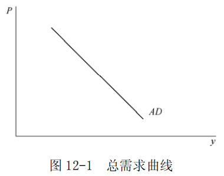
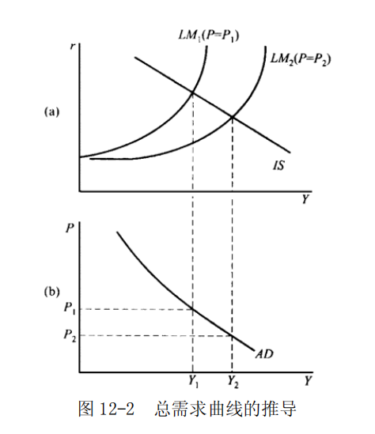
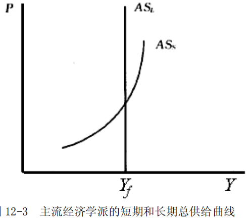

# 第 12 章 总需求和总供给分析

> **本章核心问题**：价格水平如何与总产出相互作用？总需求曲线和总供给曲线如何推导？三者（AD-AS-价格）如何共同决定国民收入？

## 核心概念

### 总需求曲线

**【名称含义】**
| 缩写 | 英文全称 | 中文含义 |
|------|----------|----------|
| **AD** | **Aggregate Demand** | **总需求** |

总需求是指经济社会对产品和劳务的需求总量。

表示经济当中的总需求量与价格总水平之间的对应关系的曲线就是总需求曲线。

随着价格总水平的提高，经济社会中的消费需求量和投资需求量减少，因而总需求量通常与价格总水平呈反向变动关系。总需求曲线向右下方倾斜，如图 12-1 所示。

### 总供给曲线

**【名称含义】**
| 缩写 | 英文全称 | 中文含义 |
|------|----------|----------|
| **AS** | **Aggregate Supply** | **总供给** |

总供给是指经济社会中可供使用的商品和劳务总量。
表示经济中的总供给量与价格总水平之间关系的曲线就是总供给曲线。随着价格总水平的提高，经济社会中的商品及劳务的供给量增加，因而总供给量通常与价格总水平呈同向变动关系。对应的，总供给曲线向右上方倾斜。

### 货币工资刚性

货币工资刚性是指货币工资不随劳动需求和供给的变化而迅速做出相应的调整的现象。
许多经济学家发现，即使存在迫使工资水平下降的因素，工资的绝对水平或相对水平也可能保持不变，特别是当劳动的需求量低于供给量时，货币工资下降出现刚性，即工资只能升高，不能降低。这主要是因为劳动者存在着对货币收入的幻觉。结果价格总水平的变动对劳动需求和供给的影响因货币工资不能自发波动而有所不同。货币工资刚性成为凯恩斯主义解释宏观经济波动的理论基础。工资如果不能及时调整，劳动力供求就不能实现均衡，从而出现失业现象。

## 问题与分析

### AD-AS 模型与 IS-LM 模型的区别是什么？

**【核心区别】**

| 模型 | 分析对象 | 包含市场 | 分析层次 |
|------|----------|----------|----------|
| **IS-LM** | 局部均衡分析 | 产品市场(IS) + 货币市场(LM) | **部分市场** |
| **AD-AS** | **一般均衡分析** | 产品市场 + 货币市场 + 劳动市场 | **整个宏观经济** |

---

**【直观理解】**

| 曲线 | 英文全称 | 描述范围 |
|------|----------|----------|
| **IS 曲线** | Investment-Saving | 只看产品市场（投资=储蓄） |
| **LM 曲线** | Liquidity-Money | 只看货币市场（货币需求=货币供给） |
| **AD 曲线** | Aggregate Demand | 综合 IS + LM，描述不同价格水平下的总需求 |
| **AS 曲线** | Aggregate Supply | 描述劳动市场和生产函数决定的总体供给能力 |

---

**【AD-AS 模型的三大用途】**

1. 解释**国民收入（$Y$）如何决定**
2. 解释**价格水平（$P$）如何决定**
3. 分析**通货膨胀**、**失业**、**经济波动**

> **简而言之**：AD-AS 是宏观经济的"大图景"，把产品市场、货币市场、劳动市场都整合在一起了。

---

### 主流经济学派的总需求曲线是如何得到的？

**【符号说明】**
| 符号 | 英文全称 | 中文含义 |
|------|----------|----------|
| $I(r)$ | Investment Function | 投资函数 |
| $S(Y)$ | Saving Function | 储蓄函数 |
| $L_1(Y)$ | Transaction and Precautionary Demand | 货币的交易和预防需求函数 |
| $L_2(r)$ | Speculative Demand | 货币的投机需求函数 |
| $M$ | Nominal Money Supply | 名义货币供给量 |
| $P$ | Price Level | 价格总水平 |
| $r$ | Interest Rate | 利息率 |
| $Y$ | Output / National Income | 总产出/国民收入 |

总需求是指对应于既定的价格总水平的社会总支出水平或总需求量，总需求曲线是表示经济中的需求总量与价格水平之间关系的曲线。在一个两部门的经济中，总需求由消费需求和投资需求构成。通过分析消费和投资二者的需求量与价格总水平之间的关系就可以得到总需求曲线。

依照主流经济学派的观点，在既定的价格总水平下，经济中的货币量是总需求量的货币反映。在经济处于均衡状态时，这些货币被用来满足交易和预防需求以及投机需求。交易和预防需求构成了消费需求，而用于投机的货币则通过金融市场转化为投资需求。因此不同的价格总水平与总需求量之间的对应关系可以由  $IS-LM$ 模型得到，即：

$$\begin{cases}
I(r) = S(Y) \\
L_1{(Y)} +L_2(r) = \frac{M}{P}
\end{cases}$$

从中消去利息率 r ，即得到总需求函数。

上述过程可以在图 12-2 中得到进一步说明。对应于不同的价格总水平，既定的名义货币量表示的实际货币量相应与价格总水平发生变动，从而 LM 曲线发生变动。对应于不同 LM 曲线，产品和货币市场的均衡将决定不同的总需求量。在 IS 曲线既定的条件下，价格总水平提高，实际货币量减少，利息率提高，投资减少，从而经济中的总需求量减少，即总需求曲线是一条向右下方倾斜的曲线。

### 主流经济学的短期和长期 AS 曲线是如何得到，相应的政策含义是什么？

**【符号说明】**
| 符号 | 英文全称 | 中文含义 |
|------|----------|----------|
| $W$ | Nominal Wage | 货币工资/名义工资 |
| $P$ | Price Level | 价格总水平 |
| $\frac{W}{P}$ | Real Wage | 实际工资 |
| $Y$ | Output / National Income | 总产出/国民收入 |

---

**【总供给曲线的推导逻辑】**

$$价格水平 → 实际工资 → 劳动供求 → 就业量 → 总产出$$

---

**【短期 vs 长期对比】**

| 比较维度 | **短期总供给曲线（SAS）** | **长期总供给曲线（LAS）** |
|----------|--------------------------|--------------------------|
| **货币工资** | **具有刚性**（只能升，不能降） | **完全伸缩**（可自由调整） |
| **工人特征** | 存在**货币幻觉**（只看名义工资） | 理性，关注**实际工资** |
| **曲线形状** | **向右上方倾斜** | **垂直线** |
| **原因** | 价格上升 → 实际工资下降 → 厂商多雇佣 → 产出增加 | 无论价格如何，经济始终处于**充分就业**水平 |

---

**【详细推导】**

**（1）短期总供给曲线（SAS）—— 向右上方倾斜**

**关键假设**：货币工资具有下降刚性（只能升高，不能降低）

**推导过程**：

| 情况 | 价格水平变化 | 实际工资 $\frac{W}{P}$ | 劳动需求 | 就业量 | 产出 $Y$ |
|------|-------------|------------------------|----------|--------|----------|
| **低于充分就业** | $P \uparrow$ | $\downarrow$ | $\uparrow$ | $\uparrow$ | $\uparrow$ |
| **达到充分就业** | $P \uparrow$ | $\downarrow$ | 需求 > 供给 | 货币工资 $\uparrow$ | 产出不变 |

**结论**：在低于充分就业时，价格水平与产出**同方向变动** → SAS 曲线向右上方倾斜。

---

**（2）长期总供给曲线（LAS）—— 垂直线**

**关键假设**：货币工资具有完全伸缩性

**推导过程**：

- 若 $P \uparrow$ → 实际工资 $\downarrow$ → 厂商想多雇人
- 但劳动者不愿在低实际工资下提供劳动
- 货币工资 $\uparrow$ → 实际工资恢复均衡水平
- **结果**：无论价格水平如何，经济始终处于充分就业

**结论**：长期产出由**充分就业水平**决定，与价格水平无关 → LAS 曲线是垂直线。

---

**【政策含义对比】**

| 政策类型 | 短期效果（SAS 倾斜） | 长期效果（LAS 垂直） |
|----------|---------------------|---------------------|
| **扩张性政策**（增加 AD） | 产出 $\uparrow$，价格温和 $\uparrow$ | **产出不变**，价格 $\uparrow\uparrow$ |
| **紧缩性政策**（减少 AD） | 产出 $\downarrow$，价格温和 $\downarrow$ | **产出不变**，价格 $\downarrow\downarrow$ |

**核心结论**：

> - **短期**：总需求管理**有效**，可影响产出和就业
> - **长期**：总需求管理**无效**，只影响价格水平，产出由潜在水平决定

## 推导与例题

### 假定一个经济的消费函数是 C=800+0.8Y ，投资函数为 I=2200-100r，经济中货币的需求函数为 L=0.5Y - 250r，若中央银行的名义货币供给量为 M = 600 ，求该经济的总需求函数。

**【符号说明】**
| 符号 | 英文全称 | 中文含义 |
|------|----------|----------|
| $C$ | Consumption | 消费 |
| $Y$ | Output / National Income | 总产出/国民收入 |
| $I$ / $I(r)$ | Investment / Investment Function | 投资/投资函数 |
| $r$ | Interest Rate | 利息率 |
| $L$ / $L_1(Y) + L_2(r)$ | Money Demand / Money Demand Function | 货币需求/货币需求函数 |
| $M$ | Nominal Money Supply | 名义货币供给量 |
| $P$ | Price Level | 价格总水平 |
| $S(Y)$ | Saving Function | 储蓄函数 |

解：

经济中的总需求来源于 $IS-LM$ 模型，即：

$$\begin{cases}
I(r)=S(Y) \\
L_1(Y) + L_2(r) = \frac{M}{P}
\end{cases}$$

代入已知条件，得到：

$$\begin{cases}
2200 - 100r = Y -800 -0.8Y \\
0.5Y - 250r = \frac{600}{P}
\end{cases}$$

解得： $$2Y-15000=\frac{1200}{P}$$ 
 。

因此，经济的总需求函数为： $$Y=7500+\frac{600}{P}$$ 
。

---
