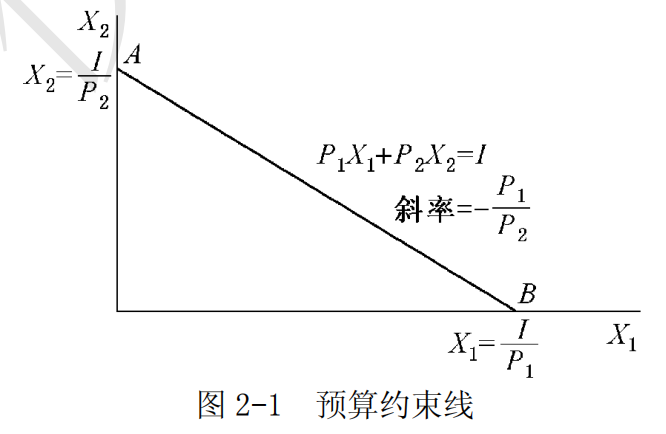
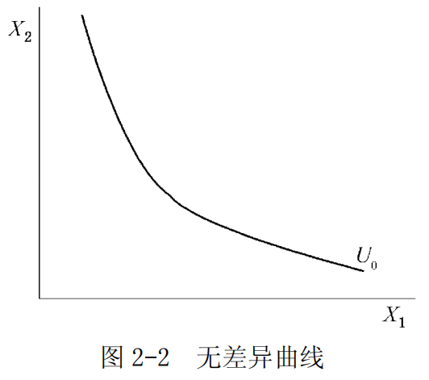
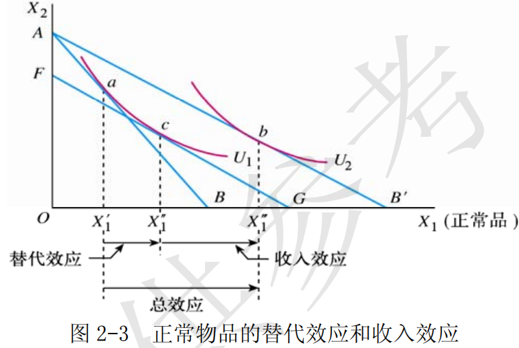
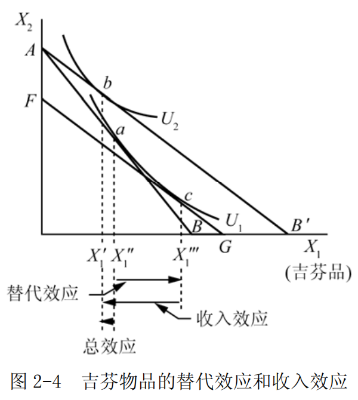

# 第 2 章 效用论

> **本章核心问题**：消费者如何在收入约束下实现效用最大化？为什么需求曲线向右下方倾斜？价格变动如何通过替代效应和收入效应影响消费者选择？

## 本章脉络

效用论要回答的其实是一个古老的问题：**东西的价值由什么决定？** 亚当·斯密留下过著名的「水与钻石悖论」——水对生存必不可少却几乎不值钱，钻石没什么用处却价格惊人。劳动价值论没能干净地解开它。1870 年代，杰文斯、门格尔、瓦尔拉斯三人几乎同时给出同一个答案：价值不取决于总量带来的满足，而取决于**最后一单位**的满足——边际效用。水太多了，最后一杯水不值钱；钻石太稀少，最后一颗仍然珍贵。边际革命由此得名，经济学也由此开始使用微积分。

但「效用可以被测量」这个前提本身后来也受到了挑战：效用是主观感受，凭什么用数字加总？帕累托与希克斯的应对是把理论改写为**序数**的——不需要测量效用，只需要消费者能对商品组合排出偏好次序，无差异曲线与边际替代率就是这套语言。本章先讲基数版本（边际效用递减 → 均衡条件 → 需求曲线的推导），再讲序数版本（偏好 → 无差异曲线 → 切点条件），最后用替代效应与收入效应的分解解释需求曲线的形状，以及它的著名反例——吉芬商品。

## 核心概念

### 效用

效用是指商品或劳务满足人的欲望的能力，即消费者在消费商品或劳务时所感受到的满足程度。

这个概念之所以必要，是因为价值理论需要一个统一的「砝码」来比较千差万别的商品：面包的饱腹、音乐的愉悦、保险的安心，都要折算成同一种东西才能谈论「最大化」。效用是消费者对商品主观上的偏好和评价——同一商品会因人、因时、因地之不同而有不同的效用，这正是它「主观价值论」的立场（与劳动价值论相对）。

### 边际效用递减规律

**【符号说明】**
| 符号 | 英文全称 | 中文含义 |
|------|----------|----------|
| $MU$ | Marginal Utility | 边际效用 |
| $TU$ | Total Utility | 总效用 |
| $Q$ | Quantity | 消费数量 |
| $\Delta$ | Delta | 变化量 |

边际效用递减规律是指特定时期内，在其他商品的消费保持不变的条件下，消费者不断地增加某种商品的消费量，每增加一单位该商品的消费所获得的效用增加量逐渐减少。

$$MU=\frac{\Delta{TU}}{\Delta{Q}}$$

这条规律之所以被当作基石，一是它符合心理事实（同样的刺激重复出现，反应会减弱），二是它是解开水与钻石悖论的钥匙：商品的边际（而非总）效用决定人们愿意支付的价格。基数效用论的整个需求理论都建立在这条假设上。

### 消费者均衡

**【符号说明】**
| 符号 | 英文全称 | 中文含义 |
|------|----------|------|
| $MU_i$ | Marginal Utility | 商品$i$的边际效用 |
| $P_i$ / $p_i$ | Price | 商品$i$的价格 |
| $x_i$ / $X_i$ | Quantity | 商品$i$的消费数量 |
| $m$ / $I$ | Income | 消费者收入 |
| $\lambda$ | Lambda | 货币的边际效用/货币效用比 |

「最大化满足」要成为一个可解的问题，必须变成一个可检验的条件。消费者均衡就是这种转化的产物：在其他条件不变的情况下，当消费者每单位货币支出的边际效用都等于货币的边际效用时，消费者处于均衡状态，即：

$$\begin{cases}
\frac{M U_{1}}{P_{1}}=\frac{M U_{2}}{P_{2}}=\cdots=\frac{M U_{n}}{P_{n}}=\lambda \\
p_{1} x_{1}+\cdots+p_{n} x_{n}=m
\end{cases}$$

直觉是「一元钱的边际效用处处相等」：若买面包的最后一元钱比买书的最后一元钱换来更多效用，就该把钱从书挪向面包，直到挪不动为止——均衡状态就是再怎么挪也无利可图的状态。在序数效用论中，同样的均衡表现为无差异曲线与预算约束线的切点。

#### 预算约束线

**【符号说明】**
| 符号 | 英文全称 | 中文含义 |
|------|----------|------|
| $P_1$, $P_2$ | Price | 商品1和商品2的价格 |
| $X_1$, $X_2$ | Quantity | 商品1和商品2的消费数量 |
| $I$ | Income | 消费者既定收入 |

预算约束线（又称预算线、消费可能线、价格线）表示在收入和价格给定的条件下，全部收入所能购买到的两种商品的各种组合。以 $I$ 表示既定收入，预算式为：

$$P_{1}X_{1}+P_{2}X_{2}=I$$

该式表示：消费者的全部收入等于他购买商品 1 和商品 2 的总支出。由该预算式作出的预算约束线为图 2-1 中的线段 AB。

图 2-1 中，预算线的横截距 $OB$ 和纵截距 $OA$ 分别表示全部收入用来购买商品 1 和商品 2 的数量。价格变动会旋转这条线，收入变动会平移这条线——后面所有关于需求量如何变化的讨论，都发生在这条线的移动与无差异曲线的重新相切之间。

### 无差异曲线

**【符号说明】**
| 符号 | 英文全称 | 中文含义 |
|------|----------|------|
| $U$ | Utility | 效用 |
| $X_1$, $X_2$ | Quantity | 商品1和商品2的消费数量 |
| $U_0$ | Utility Level | 常数，表示某个效用水平 |

无差异曲线是序数效用论的核心工具：既然效用无法测量，那就只要求消费者能排序——凡是给消费者带来相同满足程度的商品组合，落在同一条曲线上。埃奇沃思引入了这个工具，帕累托把它系统化，希克斯与艾伦 1934 年用它重写了整个价值理论。

无差异曲线表示能够给消费者带来相同效用水平的两种商品的所有数量组合：

图 2-2 中，横轴和纵轴分别表示商品 1 的数量 $X_1$ 和商品 2 的数量 $X_2$。对应的效用函数为

$$U=f(X_1,X_2)=U_0$$

其中 $X_1$、$X_2$ 分别为两种商品的消费数量，$U_0$ 是常数，表示某个效用水平。无差异曲线具有三个基本特征：

- 第一，由于通常假定效用函数是连续的，同一坐标平面上的任何两条无差异曲线之间可以有无数条无差异曲线；
- 第二，同一坐标平面图上的任何两条无差异曲线不会相交（相交意味着偏好排序自相矛盾）；
- 第三，无差异曲线是凸向原点的，即其斜率的绝对值是递减的——这个凸性正是边际替代率递减的几何表现。

### 商品的边际替代率

**【符号说明】**
| 符号 | 英文全称 | 中文含义 |
|------|----------|------|
| $MRS_{1,2}$ | Marginal Rate of Substitution | 商品1对商品2的边际替代率 |
| $x_1$, $x_2$ / $X_1$, $X_2$ | Quantity | 商品1和商品2的消费数量 |
| $\Delta$ | Delta | 变化量 |
| $\lim$ | Limit | 极限 |
| $\mathrm{d}$ | Differential | 微分符号 |

边际替代率回答的问题是：少买一单位商品 2，需要补多少商品 1 才能维持同样的满足？它把「偏好的强度」翻译成可操作的交换比率，其几何意义就是无差异曲线斜率的绝对值。以 $\Delta{x_1}$ 和 $\Delta{x_2}$ 分别表示两种商品消费量的变化，则商品 1 对商品 2 的边际替代率为：

$$MRS_{1,2}=-\frac{\Delta{x_2}}{\Delta{x_1}}$$

当商品数量的变化趋于无穷小时：

$$MRS_{1,2}=\lim_{\Delta X_{1} \rightarrow 0}-\frac{\Delta x_{2}}{\Delta x_{1}}=-\frac{\mathrm{d} x_{2}}{\mathrm{d} x_{1}}$$

### 替代效应与收入效应

价格变动对需求量的影响，可以分解为两个机制，这个分解是理解需求曲线形状的基本工具：

- **替代效应**：商品的价格变动引起相对价格变动，进而在实际收入（效用水平）保持不变的前提下引起的需求量变化——东西相对变便宜了，就多买它替代别的。
- **收入效应**：价格变动引起实际收入水平变动，进而引起的需求量变化——同样的钱现在更「值钱」了，购买力变化改变消费。

替代效应不改变效用水平（沿原无差异曲线移动），收入效应则移动到新的无差异曲线。正常物品两种效应方向一致，所以需求曲线稳定地向右下倾斜；低档物品两种效应方向相反，一般仍是替代效应占上风——除非收入效应大到反超，那就是吉芬商品的情形（见「问题与分析」）。

## 问题与分析

### 为什么消费者的需求曲线向右下方倾斜？用基数效用论说明。

**【符号说明】**
| 符号 | 英文全称 | 中文含义 |
|------|----------|------|
| $MU$ | Marginal Utility | 边际效用 |
| $p$ / $P$ | Price | 商品价格 |
| $\lambda$ | Lambda | 货币的边际效用 |

基数效用论从边际效用递减规律和均衡条件 $\frac{MU}{p}=\lambda$ 出发，推出需求曲线必然向右下方倾斜，推理链只有两步：

第一，需求价格取决于边际效用。某一单位的某种商品的边际效用越大，消费者为购买这一单位所愿意支付的价格就越高；反之则越低。由于边际效用递减，随着消费量连续增加，边际效用递减，消费者愿意支付的需求价格也越来越低——这正是需求曲线的形状。

第二，均衡条件要求「最后一元钱」的边际效用处处相等：$\frac{MU}{p}=\lambda$。由于任何商品的 $MU$ 随需求量增加而递减，在货币的边际效用 $\lambda$ 不变的前提下，商品的需求价格 $P$ 必然与 $MU$ 同比例递减。价格与数量反向变动由此得证。

### 对正常物品而言，为什么需求曲线向右下方倾斜？用收入效应和替代效应说明。

正常物品是消费数量随收入增加而增加的商品。价格下降对它的总效应可以分解为方向一致的两部分：

（1）总效应 = 替代效应 + 收入效应。替代效应由相对价格变动引起（不改变效用水平），收入效应由实际购买力变动引起（效用水平变化）。

（2）如图 2-3 所示，横轴 $OX_1$ 和纵轴 $OX_2$ 分别表示商品 1 和商品 2 的数量，商品 1 是正常商品。${X_{1}}^{'}$ 是价格变化前对商品 1 的需求量。商品 1 的价格下降后，需求量增加到 ${X_1}^{'''}$，总效应为 ${X_{1}}^{'}{X_{1}}^{'''}$。

作补偿线 $FG$：与价格变化后的预算线 $A{B}^{'}$ 平行，并与价格变化前的无差异曲线 $U_1$ 相切。切点 $c$ 对应的需求量 ${X_1}^{''}$ 就是剔除了收入效应之后的消费量。于是 ${X_1}^{'}{X_1}^{''}$ 是替代效应，${X_1}^{''}{X_1}^{'''}$ 是收入效应。

对正常物品来说，替代效应与价格反方向变动，收入效应也与价格反方向变动，两者叠加，总效应必然与价格反方向变动——需求曲线向右下方倾斜。

### 何为吉芬商品？它的需求曲线为什么向右上方倾斜？

吉芬商品是需求与价格呈反常变化的商品：价格越低买得越少，价格提高反而买得更多。这个观察来自 19 世纪爱尔兰饥荒中的土豆消费（罗伯特·吉芬注意到，马歇尔在《经济学原理》中记录了这个案例）：面包主食涨价使贫困家庭更穷，反而只能买更多土豆充饥。

（2）如图 2-4 所示，商品 1 是吉芬物品。价格 $P_1$ 下降前后的均衡点分别为 $a$ 和 $b$，商品 1 的需求量反而减少 ${X_1}^{'}{X_1}^{''}$，这就是总效应。通过补偿预算线 $FG$ 可分解出：

- ${X_1}^{''}{X_1}^{'''}$ 为替代效应（与价格反向，为正）；
- ${X_1}^{'}{X_1}^{'''}$ 为收入效应（与价格同向，为负）。

吉芬物品是一种特殊的低档物品：作为低档物品，它的替代效应与价格反方向变动、收入效应与价格同方向变动；它的特殊性在于**收入效应大到超过了替代效应**，总效应因此与价格同方向变动，需求曲线呈现向右上方倾斜的罕见形状。这也提醒我们：需求规律是一条以「其他条件不变」为前提的经验规律，不是逻辑必然。

## 局限与后续

- **效用可测吗？** 基数效用论要求效用可以加总比较，这在理论上很方便，却无法观测。希克斯与艾伦（1934）证明：只要偏好可以排序，同样的结论（需求曲线、均衡条件）用无差异曲线就能推出，不需要测量效用——序数革命让效用论建立在更弱、更可辩护的前提上。
- **偏好可观测吗？** 萨缪尔森（1938）更进一步：连「偏好」也不必假设，只观察实际购买行为——显示偏好理论用「选了 A 没选 B（A 在预算内）」定义「A 至少和 B 一样好」，把效用论还原为可操作的经验命题。
- **行为经济学的挑战**：卡尼曼与特沃斯基的前景理论（1979）表明，人们评估损益依赖参照点、对损失更敏感（损失厌恶），偏好在框架变化下并不稳定；跨期选择中的现时偏好也偏离指数贴现假设。效用论的「理性排序」仍是教科书基准，但已被当作近似而非公理。
