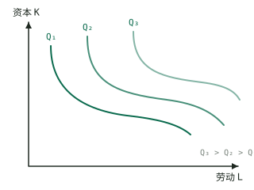
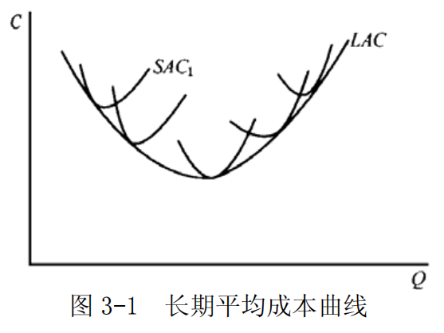
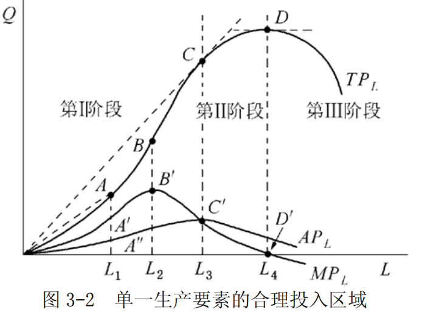
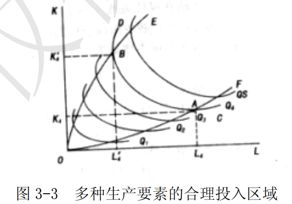

# 第 3 章 生产和成本论

> **本章核心问题**：厂商如何决定生产要素投入和产量，以实现利润最大化？为什么存在边际收益递减规律？短期成本与长期成本有何区别？

## 本章脉络

第 1 章的供求图里，供给曲线被当作已知；效用论解释了需求一侧「愿意付多少」，还缺一侧的「生产成本是多少」。生产与成本理论要做的，就是打开厂商这个黑箱：投入怎样变成产出、产出怎样变成成本，从而让供给曲线有了微观地基。

这条推理链的起点是一条朴素的经验规律：**边际报酬递减**。它的原始形态是 18 世纪末的土地收益递减争论（配第、安德森、马尔萨斯都参与过），马歇尔把它一般化——只要有一种要素固定不变，连续追加可变要素的收益终会递减。这条规律制造了短期与长期的区别：短期里总有改不动的东西（厂房、设备），于是成本先降后升、$MC$ 呈 U 形；长期里一切可调，形状交给规模经济与规模不经济决定。而等产量曲线与边际技术替代率，则是把第 2 章无差异曲线的几何语言原样搬进生产领域——成本最小化的切点条件与效用最大化的切点条件在数学上是同一个命题（对偶性）。

本章顺序：单一可变要素的生产规律（边际产量、三阶段）→ 两种可变要素的替代（等产量曲线、MRTS、要素最优组合）→ 由生产推出成本（短期成本族、长期成本包络线）。

## 核心概念

### 边际产量

边际产量是指在生产技术水平和其他投入要素不变的情况下，每增加一单位可变投入要素所得到的总产量的增加量。

例如，在生产中如果只有劳动 L 是可变投入，则劳动的边际产量可以表示为：

$$MP=\frac{\Delta{Q}}{\Delta{L}}$$

假设生产函数连续且可导，从而可以用总产量对可变投入量求导得出边际产量，即 $MP=\frac{dQ}{dL}$ 。
这样，在某一产量上的边际产量，就是该产量相对于总产量曲线上一点的斜率。

### 边际收益递减规律

在技术水平不变的条件下，在连续等量地把某一种可变生产要素增加到其他一种或几种数量不变的生产要素上去的过程中，当这种可变生产要素的投入量小于某一特定值时，增加该要素投入所带来的边际产量是递增的；当这种可变要素的投入量连续增加并超过这个特定值时，增加该要素投入所带来的边际产量是递减的。这就是边际收益递减规律。

这条规律又称边际报酬递减规律——「报酬」指的就是产量。它不是从更深的公理推出的，而是对「可变要素终将稀释固定要素」这一技术事实的概括：把越来越多的工人塞进同一间厂房，厂房不会随之变大。但它是整个短期理论的发动机：$MP$ 先升后降，经倒数关系翻转成 $MC$ 先降后升，后面所有的 U 形曲线都由此而来。

### 等产量曲线

等产量曲线是在技术水平不变的条件下，生产同一产量的两种生产要素投入量的各种不同组合的轨迹。
以 $Q$ 表示既定的产量水平，则与等产量曲线相对应的生产函数为：$Q=f(L,K)$
等产量曲线表示生产一定单位的产品，可以有很多劳动和资本数量组合。等产量曲线具有以下重要特点：
- ①等产量曲线是一条从左上方向右下方倾斜的曲线，具有负斜率。它表示增加一种生产要素的投入量，可以减少另一种生产要素的投入量。只有负斜率的等产量曲线，才表示劳动和资本互相代替是有效率的。
- ②坐标图上可以有无数条等产量曲线。它们按产量大小顺序排列，越接近原点的等产量曲线所代表的产量越少，越远离原点的等产量曲线所代表的产量越多。
- ③任何两条等产量曲线不能相交。
- ④等产量曲线向原点凸出。它表示随着一种生产要素每增加一个单位，可以代替的另一种生产要素的数量将逐次减少。这一点可由边际技术替代率递减规律来解释。

**等产量曲线图示：**



*图：等产量曲线示意*

**图解说明：**
- **纵轴（K轴）**：表示资本投入量
- **横轴（L轴）**：表示劳动投入量
- **曲线含义**：等产量曲线上的每一点代表不同的资本-劳动组合，但都能生产出**相同的产量**
- **曲线形状**：向右下方倾斜，凸向原点，反映边际技术替代率递减规律
- **重要特征**：等产量曲线**不与坐标轴相交**，因为生产需要两种要素共同作用

**关键性质：**
1. **负斜率**：增加一种要素必须减少另一种要素才能保持产量不变
2. **凸向原点**：边际技术替代率递减
3. **不相交**：两条等产量曲线永不相交
4. **离原点越远产量越高**：$Q_3 > Q_2 > Q_1$

### 边际技术替代率

在维持产量水平不变的条件下，增加一单位某种生产要素投入量时所减少的另一种要素的投入数量，被称为边际技术替代率，其英文缩写为 $MRTS$ 。用 $\Delta{K}$ 和 $\Delta{L}$ 分别表示资本投入量的变化量和劳动投入量的变化量，则劳动对资本的边际技术替代率的公式为：

$$MRTS_{LK}=-\frac{\Delta{K}}{\Delta{L}}$$

或 

$$MRTS_{LK}=-\frac{dK}{dL}$$

### 边际技术替代率递减规律
边际技术替代率递减规律是指，在维持产量不变的前提下，当一种生产要素的投入量不断增加时，每一单位的这种生产要素所能替代的另一种生产要素的数量是递减的。
边际技术替代率递减的主要原因在于：任何一种产品的生产技术都要求各要素投入之间有适当的比例，这意味着要素之间的替代是有限的。

以劳动和资本两种要素投入为例，在劳动投入量很少而资本投入量很多的情况下，减少一些资本投入量可以很容易地通过增加劳动投入量来弥补，以维持原有的产量水平，即劳动对资本的替代是很容易的。但是，在劳动投入增加到相当多的数量和资本投入量减少到相当少的数量的情况下，再用劳动去替代资本就将是很困难的了。

### 等成本方程

厂商的等成本方程是指在要素价格一定的条件下，表示厂商花费相同成本可以使用的所有不同的要素组合的代数式。

如以 $r_L$  和 $r_K$ 分别表示劳动和资本的价格，以 $c$ 表示厂商的成本，厂商的等成本方程可以表示为：

$$C=r_{L}L+r_{K}K$$
厂商面对的要素价格和所花费的成本总量变动都会使得等成本方程旋转或者平移。

### 生产要素最优组合

生产要素最优组合是指在生产技术和要素价格不变的条件下，生产者在成本既定时实现产量最大或在产量既定时实现成本最小目标时所使用的各种生产要素的数量组合。

为此，厂商将在既定的等成本方程和等产量线上寻求最高的产量组合点。无论是既定成本下的产量最大还是既定产量下的成本最小，利润最大化的厂商都将把生产要素的数量选择在每单位成本购买的要素所能生产的边际产量相等之点。

### 规模经济与规模不经济

规模经济和规模不经济用来说明厂商产量变动从而规模变动与成本之间的关系。
对于一个生产厂商而言，如果产量扩大一倍，生产成本的增加低于一倍，则生产存在着规模经济；如果产量增加一倍，而成本增加大于一倍，则生产存在着规模不经济。

规模经济的来源很具体：专业化分工、大设备的不可分性、固定成本摊薄到更多产出上；规模不经济则多来自管理——层次越多，信息传递越慢、协调成本越高。两股力量的此消彼长决定了长期平均成本先降后升的典型形状。

### 规模收益递增、不变和递减

作为规模经济与规模不经济的一种特殊的情况，如果产量的增加是借助于生产要素的同比例扩大实现的，
那么相应的可定义规模收益的概念：
- ①如果产量增加的比例大于生产要素增加的比例，则称生产是规模收益递增的；
- ②若产量增加的比例等于生产要素增加的比例则称生产是规模收益不变的；
- ③若产量增加的比例小于生产要素增加的比例，则称生产是规模收益递减的。

### 平均成本

平均成本是指厂商平均每生产一单位产品所消耗的成本。
用公式表示为： $AC=\frac{TC}{y}$ 。
- 在短期，厂商的平均成本呈现  $U$ 形。
- 在长期，规模经济的状况将决定厂商的长期平均成本曲线的形状。

### 边际成本

边际成本是指产量变动某一数量所引起的成本变动的数量，也即厂商在短期内增加一单位产量时所增加的总成本。
用公式表示为：

$$MC(Q)=\frac{\Delta{TC(Q)}}{\Delta{Q}}=\frac{TC(Q+\Delta{Q})-TC(Q)}{\Delta{Q}}$$

或 

$$MC(Q)=\lim_{\Delta Q \rightarrow 0} \frac{\Delta T C(Q)}{\Delta Q}=\frac{\mathrm{d} T C}{\mathrm{d} Q}$$

- 在短期内，由于边际产量递减规律的作用，厂商的边际成本呈现 U 形。
- 在长期内，规模经济的状况将决定厂商的长期边际成本形状。

### 长期平均成本曲线

长期平均成本曲线（ $LAC$ ）是用于描述长期平均成本与产量关系的一条曲线。
长期平均成本是长期内厂商平均每单位产量花费的总成本。
长期平均成本曲线是基于长期总成本曲线而得到的。
在生产由规模经济到规模不经济阶段，长期总成本曲线呈 U 形。
从图形关系来看，长期平均成本曲线又是所有短期平均成本曲线的包络线，如图 3-1 所示。这是因为对应于每一产量，厂商在长期内把生产要素调整到最优组合点，从而在这一产量下实现的平均成本为最小。



## 问题与分析

### 单一和多种生产要素的合理投入区是如何确定的？其间平均产量、边际产量各有什么特点？

**【符号说明】**

在回答本题之前，首先需要理解三个关键概念：

| 符号 | 英文全称 | 中文含义 | 公式 |
|------|----------|----------|------|
| $TP_L$ | Total Product of Labor | 劳动的总产量 | $TP_L = Q = f(L,\bar{K})$ |
| $AP_L$ | Average Product of Labor | 劳动的平均产量 | $AP_L = \frac{TP_L}{L} = \frac{Q}{L}$ |
| $MP_L$ | Marginal Product of Labor | 劳动的边际产量 | $MP_L = \frac{\Delta TP_L}{\Delta L} = \frac{dQ}{dL}$ |

- **$TP_L$（总产量）**：在资本投入不变的情况下，投入一定数量的劳动所获得的全部产量
- **$AP_L$（平均产量）**：平均每单位劳动所生产的产量
- **$MP_L$（边际产量）**：每增加一单位劳动所引起的总产量的增加量

生产要素的合理投入区是指追求利润最大化的生产者所选择的生产要素投入数量的范围。

**（1）短期：只有一种可变要素时，合理投入区位于平均产量最大值点与边际产量等于 0 的点之间**



短期生产的三个阶段是根据总产量曲线、平均产量曲线和边际产量曲线之间的关系来划分的。如图 3-2 所示：
- 第Ⅰ阶段，平均产量递增阶段，即劳动平均产量始终是上升的，且达到最大值。这一阶段是从原点到 $AP_L$  、$MP_L$ 两曲线的交点，即劳动投入量由 0 到 $L_3$ 的区间。
- 第Ⅱ阶段，平均产量的递减阶段，边际产量仍然大于 0，所以总产量仍然是递增的，直到总产量达到最高点。这一阶段是从 $AP_L$  、 $MP_L$  两曲线的交点到 $MP_L$  曲线与横轴的交点，即劳动投入量由 $L_3$  到 $L_4$ 的区间。
- 第Ⅲ阶段，边际产量为负，总产量也是递减的，这一阶段是 $MP_L$ 曲线和横轴的交点以后的阶段，即劳动投入量 $L_4$  以后的区间。

- 首先，厂商肯定不会在第Ⅲ阶段进行生产，因为这个阶段的边际产量为负值，生产不会带来任何的好处。
- 其次，厂商也不会在第Ⅰ阶段进行生产，因为平均产量在增加，投入的这种生产要素还没有发挥最大的作用，厂商没有获得预期的好处，继续扩大可变投入的使用量从而使产量扩大是有利可图的，至少使平均产量达到最高点时为止。因此，厂商通常会在第Ⅱ阶段进行生产。

**（2）长期：两种可变要素的合理投入区**

在长期内，所有要素的投入数量都是可变的。假定有两种投入要素 $K$ 和 $L$ 都是可变的，那么两种可变要素的合理投入区域是等产量曲线斜率为负的区域，即图 3-3 中脊线 $OE$ 和 $OF$ 之间包含的区域。若投入组合落在脊线之外（$OE$ 以上或 $OF$ 以下），保持产量不变的前提下可以同时减少 $L$ 和 $K$ 的投入量——这说明其中一种要素的边际产量已是负数，多投入反而减产。因此理性厂商会把投入组合限定在脊线之间的经济区域内。



**【脊线OE和OF的含义与作用】**

**什么是脊线？**

脊线（Ridge Lines）是连接等产量曲线上特殊点的两条线，用于界定生产要素投入的"经济区域"：

| 脊线 | 英文名称 | 定义 | 数学特征 |
|------|----------|------|----------|
| **$OE$（上脊线）** | Upper Ridge Line | 连接各等产量曲线上**资本边际产量为零**的点 | 等产量曲线在该点的切线**垂直**于横轴，$MP_K = 0$ |
| **$OF$（下脊线）** | Lower Ridge Line | 连接各等产量曲线上**劳动边际产量为零**的点 | 等产量曲线在该点的切线**平行**于横轴，$MP_L = 0$ |

**脊线的作用：**

1. **界定经济区域（生产的经济区）**
   - 两条脊线之间的区域称为**经济区域**（Economic Region）
   - 在此区域内，等产量曲线斜率为负，$MRTS_{LK} > 0$
   - 厂商只会在经济区域内选择要素投入组合

2. **排除非经济区域**
   - **$OE$以上区域**：$MP_K < 0$，资本边际产量为负，增加资本反而减少产量
   - **$OF$以下区域**：$MP_L < 0$，劳动边际产量为负，增加劳动反而减少产量
   - 理性厂商不会在这两个区域生产

3. **保证要素替代的有效性**
   - 在经济区域内，增加一种要素可以减少另一种要素而保持产量不变
   - 超出脊线后，要素替代关系失效，必须同时增加两种要素才能维持产量

**图形示意：**

```
        K（资本）
         ↑
         |   上脊线 OE
         |  /|  以上：非经济区（MP_K < 0）
         | / |
         |/  |   经济区域（合理投入区）
         +---|--------------→ L（劳动）
             |\
             | \  下脊线 OF
             |  \
                  以下：非经济区（MP_L < 0）
```

脊线把「替代有效」与「替代失效」分开：脊线之内，等产量曲线斜率为负，减少一种要素可以用增加另一种要素补回产量；脊线之外，等产量曲线斜率翻正，维持产量反而需要同时增加两种要素。

### 为什么边际技术替代率会是递减的？

- （1）边际技术替代率递减规律是指: 
	在维持产量不变的情况下，当一种生产要素的投入量不断增加时，每一单位的这种生产要素所能替代的另一种生产要素的数量是递减的。

- （2）边际技术替代率递减的主要原因在于：
	任何一种产品的生产技术都要求各要素投入之间有适当的比例，这意味着各要素之间的替代是有限度的，故随着一种要素投入的不断增加，它所能替代的另一种要素会不断减少。
	例如，对于劳动投入和资本投入而言，由于受到生产技术的限制，劳动投入和资本投入之间有适当的比例，在劳动投入量很少和资本投入量很多的情况下，减少一些资本投入量可以很容易地通过增加劳动来弥补，以维持原有的产量水平，即劳动对资本的替代是很容易的。但是，在劳动投入增加到相当多的数量和资本投入量减少到相当少的数量的情况下，再用劳动去替代资本就将是很困难的了。

### 生产要素最优组合是如何确定的，它与厂商的利润最大化有何关系？

**【符号说明】**

在讨论生产要素最优组合时，涉及以下关键符号：

| 符号 | 英文全称 | 中文含义 |
|------|----------|----------|
| $MP_L$ | Marginal Product of Labor | 劳动的边际产量 |
| $MP_K$ | Marginal Product of Capital | 资本的边际产量 |
| $r_L$ (或 $w$) | Price of Labor / Wage Rate | 劳动的价格（工资率） |
| $r_K$ (或 $r$) | Price of Capital / Rental Rate | 资本的价格（租金率） |
| $MRTS_{LK}$ | Marginal Rate of Technical Substitution | 劳动对资本的边际技术替代率 |
| $L$ | Labor | 劳动投入量 |
| $K$ | Capital | 资本投入量 |
| $c$ (或 $C$) | Cost | 成本 |
| $y$ (或 $Q$) | Output / Quantity | 产量 |
| $\pi$ | Profit | 利润 |

**【问题解答】**

**（1）生产要素最优组合的确定**

生产要素最优组合是指厂商在两种约束条件下实现最优决策：**既定成本下产量最大化**或**既定产量下成本最小化**。

以劳动 $L$ 和资本 $K$ 两种生产要素为例，厂商的生产技术由等产量曲线表示，成本约束由等成本线表示。要素最优组合点就是等产量曲线与等成本线的**切点**。

**情况一：既定成本下产量最大化**

厂商在成本 $c$ 既定的条件下，选择要素投入量应满足：

需同时满足以下两个条件：

$$MRTS_{LK} = \frac{r_L}{r_K}$$

$$r_{L}L + r_{K}K = c$$

或等价地表示为：

需同时满足以下两个条件：

$$\frac{MP_L}{r_L} = \frac{MP_K}{r_K}$$

$$r_{L}L + r_{K}K = c$$

**情况二：既定产量下成本最小化**

厂商在产量 $y$ 既定的条件下，选择要素投入量应满足：

需同时满足以下两个条件：

$$MRTS_{LK} = \frac{r_L}{r_K}$$

$$f(L,K) = y$$

或等价地表示为：

需同时满足以下两个条件：

$$\frac{MP_L}{r_L} = \frac{MP_K}{r_K}$$

$$f(L,K) = y$$

**核心结论**：无论哪种情况，厂商都将把要素数量选择在**每单位成本购买的要素所能生产的边际产量相等**之点，即：

$$\frac{MP_L}{r_L}=\frac{MP_K}{r_K}$$

---

**【这个条件为什么成立？从切点到等式】**

**经济学含义**：花 1 元钱买劳动能获得的边际产量，恰好等于花 1 元钱买资本能获得的边际产量。推导只需三步，全部来自切点的几何性质：

1. 等产量曲线的斜率（绝对值）= 边际技术替代率：
   $$MRTS_{LK} = \frac{MP_L}{MP_K}$$

2. 等成本线的斜率（绝对值）= 要素价格之比：
   $$\frac{r_L}{r_K}$$

3. 最优组合点是切点，两者斜率相等，交叉相乘即得：
   $$\frac{MP_L}{MP_K} = \frac{r_L}{r_K} \quad\Longleftrightarrow\quad \frac{MP_L}{r_L} = \frac{MP_K}{r_K}$$

---

**【为什么是 $\frac{MP_L}{r_L}$ 而不是 $MP_L$？】**

厂商比较的不是「1 单位劳动 vs 1 单位资本」，而是「花 1 元钱买劳动 vs 花 1 元钱买资本，哪个更划算」，所以必须把边际产量除以价格，折算到同一货币尺度上：

| 指标 | 公式 | 含义 | 单位 |
|------|------|------|------|
| $MP_L$ | $\frac{\partial y}{\partial L}$ | 每增加 1 单位劳动带来的产量增加 | 产量 / 劳动单位 |
| $\frac{MP_L}{r_L}$ | $\frac{MP_L}{r_L}$ | 花 1 元钱买劳动能获得的产量增加 | 产量 / 元 |

只比较 $MP$ 会得出错误结论。设 $MP_L = 10$、$r_L = 5$ 元，$MP_K = 6$、$r_K = 2$ 元：单看边际产量，$MP_L = 10 > MP_K = 6$，似乎应该多用劳动；但折算成每元钱的产出，劳动只能带来 $2$ 单位产量，资本却能带来 $3$ 单位——应该多用资本、少用劳动，直到两者相等为止。要素的物理生产力不等于货币效率，这正是最优条件「每一块钱花在哪里都一样值」的含义。

---

**（2）与厂商利润最大化的关系**

生产要素最优组合条件与厂商利润最大化目标是一致的。下面以成本既定的情形为例说明：

如果 $\frac{MP_L}{r_L} > \frac{MP_K}{r_K}$，这意味着花在劳动上的每单位成本带来的边际产量**大于**花在资本上的每单位成本带来的边际产量。

此时，厂商将一单位成本从资本 $K$ 转移到劳动 $L$，在总成本不变的条件下可以使总产量增加，从而增加利润。

反之，如果 $\frac{MP_L}{r_L} < \frac{MP_K}{r_K}$，厂商应将成本从劳动转移到资本。

只有当 $\frac{MP_L}{r_L} = \frac{MP_K}{r_K}$ 时，厂商无法通过调整要素组合来增加产量或利润，此时达到**最优状态**。

因此，追求要素最优组合恰好是实现利润最大化的必要条件，二者完全一致。

### 试说明短期总产量曲线与短期总成本曲线之间的关系。

**【符号说明】**
| 符号 | 英文全称 | 中文含义 |
|------|----------|----------|
| $Q$ / $y$ | Output / Total Product | 产量/总产量 |
| $TC$ | Total Cost | 总成本 |
| $TVC$ | Total Variable Cost | 短期可变成本 |
| $TFC$ | Total Fixed Cost | 固定成本/不可变成本 |
| $L$ | Labor | 劳动投入量 |
| $K$ | Capital | 资本投入量 |
| $W$ / $r_L$ | Wage Rate / Price of Labor | 劳动价格 |
| $MC$ | Marginal Cost | 边际成本 |
| $MP_L$ | Marginal Product of Labor | 劳动的边际产量 |
| $\frac{dTC}{dQ}$ | Derivative | 总成本对产量的导数 |
| $\frac{dQ}{dL}$ | Derivative | 产量对劳动的导数 |

短期总产量曲线和短期总成本曲线之间存在下述对应关系：
- ①短期总产量曲线边际报酬递增阶段对应的是短期总成本曲线边际成本递减阶段；
- ②短期总产量曲线边际报酬递减阶段对应的是短期总成本曲线边际成本递增阶段；
- ③短期总产量曲线边际报酬极大值点相对应的是短期总成本曲线边际成本的极小值点。下面对两者的对应关系进行详细说明：

假定该短期生产函数为：

$Q=f(L,K)$  ①   

短期总成本函数为：

$TC(Q)=TVC(Q)+TFC$  ②

$TVC(Q)$  : 短期可变成本
$TFC$ : 不可变成本

短期总可变成本函数为：

$TVC(Q)=W\cdot{L}(Q)$  ③

$W$ 或者 $r_L$ ：劳动价格 

并假定生产要素价格既定。

由②式可得：

$MC=\frac{dTC}{dQ}=\frac{dTVC}{dQ}+\frac{dTFC}{dQ}$  ④

因为 $TFC$ 为一常数，有  $\frac{dTFC}{dQ}=0$ 

所以，④式可写作：

$$MC=\frac{dTC}{dQ}=W\cdot\frac{dL}{dQ}$$
边际产量: $MP_L=\frac{dQ}{dL}$ 

所以

$MC=W\cdot\frac{1}{MP_L}$，或 $MC=\frac{r_L}{MP_L}$ ⑤

由此可知：

$MC$ 与 $MP_L$ 呈反向对应关系，由于边际报酬递减规律的作用，可变投入要素的边际产量 $MP_L$ 先上升后下降，成反 U 形，所以，边际成本 $MC$ 和总成本之间也存在着凸对应关系，当总产量曲线为凹的，总成本曲线是凸的，当总产量曲线为凸的，总成本曲线是凹的。当总产量曲线存在一个拐点时，总成本曲线相应也有一个拐点。

## 推导与例题

### 已知企业的生产函数为 $y=5L-L^{2}$，其中 L 为雇佣工人的数量。求企业劳动投入的合理区域。

**【符号说明】**
| 符号 | 英文全称 | 中文含义 |
|------|----------|----------|
| $y$ / $Q$ | Output / Total Product | 产量/总产量 |
| $L$ | Labor | 劳动投入量/雇佣工人数 |
| $AP_L$ | Average Product of Labor | 劳动的平均产量 |
| $MP_L$ | Marginal Product of Labor | 劳动的边际产量 |

由题意可知，厂商唯一可变的生产要素为劳动 L，因此厂商应选择在生产的第二阶段（合理投入区）进行生产。由生产函数 $y=5L-L^{2}$ 可得：

- 平均产量为： $AP_L=y/L=5-L$
- 边际产量为： $MP_L=\frac{dy}{dL}=5-2L$

第二阶段的左端点是平均产量最大的位置，由 $MP_L=AP_L$ 决定：

$$5-2L=5-L$$
解得： $L=0$

即从原点开始平均产量就已递减（对一切 $L>0$ 都有 $MP_L<AP_L$），第二阶段从 $L=0$ 起算。

第二阶段的右端点是边际产量为零的位置，越过它总产量开始下降：

$$5-2L=0$$
解得： $L=2.5$

所以，企业劳动投入的合理区域为 $L\in [0,2.5]$。

### 厂商的生产函数为 $y=AL^{\alpha}K^{\beta}$

**【符号说明】**
| 符号 | 英文全称 | 中文含义 |
|------|----------|----------|
| $y$ / $Q$ | Output | 产量 |
| $A$ | Technology Parameter | 技术参数/全要素生产率 |
| $L$ | Labor | 劳动投入量 |
| $K$ | Capital | 资本投入量 |
| $\alpha$, $\beta$ | Output Elasticity | 产出弹性 |
| $r_L$ | Price of Labor | 劳动的价格 |
| $r_K$ | Price of Capital | 资本的价格 |
| $c$ / $C$ | Cost | 成本 |

，生产要素  $L$  和 $K$  的价格分别为 $r_L$ 和 $r_K$  。

- （1）求厂商的生产要素最优组合。
- （2）如果资本的数量 $K = 1$ ，求厂商的短期成本函数。
- （3）求厂商的长期成本函数。

解：

**【推导前的知识准备】**

对于Cobb-Douglas生产函数 $y=AL^{\alpha}K^{\beta}$：

- $\alpha$ = 劳动的产出弹性（劳动投入增加1%时，产出增加$\alpha$%）
- $\beta$ = 资本的产出弹性（资本投入增加1%时，产出增加$\beta$%）

**第一步：计算边际产量**

对生产函数分别求偏导数：

$$MP_L=\frac{\partial y}{\partial L}=\alpha A L^{\alpha -1} K ^ \beta$$

$$MP_K=\frac{\partial y}{\partial K}=\beta A L^{\alpha} K ^{\beta-1}$$

**第二步：利用最优组合条件**

根据生产要素最优组合条件：

$$\frac{MP_L}{r_L} = \frac{MP_K}{r_K}$$

代入边际产量表达式：

$$\frac{\alpha A L^{\alpha -1} K ^ \beta}{r_L} = \frac{\beta A L^{\alpha} K ^{\beta-1}}{r_K}$$

**第三步：化简求解**

两边同时消去公共因子 $A L^{\alpha-1} K^{\beta-1}$：

$$\frac{\alpha \cdot K}{r_L} = \frac{\beta \cdot L}{r_K}$$

交叉相乘：

$$\alpha K \cdot r_K = \beta L \cdot r_L$$

整理得到最优要素投入比例：

$$\frac{K}{L}=\frac{\beta r_L}{\alpha r_K}$$

**【经济含义解释】**

这个结果揭示了最优要素投入比例的三大决定因素：

| 因素 | 影响 | 经济直觉 |
|------|------|----------|
| **劳动价格 $r_L$ ↑** | $K/L$ ↑ | 劳动变贵，多用资本替代劳动 |
| **资本价格 $r_K$ ↑** | $K/L$ ↓ | 资本变贵，多用劳动替代资本 |
| **资本产出弹性 $\beta$ ↑** | $K/L$ ↑ | 资本的边际贡献更大，多用资本 |

因此，厂商的生产要素最优组合为： $\frac{K}{L}=\frac{\beta r_L}{\alpha r_K}$ 。

- （2）在短期内
	当 $K = 1$ 时，$y=AL^{\alpha}$，所以 $L=(y/A)^{\frac{1}{\alpha}}$。
	代入厂商的成本函数表达式 $c=r_L L+r_K K$，
	可得短期成本函数为： $c=r_L (y/A)^{\frac{1}{\alpha}}+r_K$，此即为厂商短期成本函数。

- （3）长期中
	 $L$ 和 $K$ 均可变，厂商的长期成本函数由下列条件所决定：

$$y=f(L,K)$$

$$\frac{MP_L}{r_L}=\frac{MP_K}{r_K}$$

$$c=r_L L + r_K K$$

以上三个条件**同时满足**。

代入化简：

$$y=A L^{\alpha} K ^ {\beta}$$

$$c=r_L L + r_K K$$

$$\beta r_L L = \alpha r_K K$$

推导过程：

$$L=\frac{\alpha r_K K}{\beta r_L}$$

$${r_L L}=\frac{\alpha r_K K}{\beta}$$

$$y=A {\frac{\alpha r_K K}{\beta r_L} }^{\alpha} K ^ {\beta}$$
$${\frac{y}{A}}={\frac{\alpha r_K K}{\beta r_L} }^{\alpha} K ^ {\beta}$$

$${\frac{y}{A}}={\frac{\alpha r_K}{\beta r_L} }^{\alpha} K ^ {\alpha+\beta}$$

$$K= {\frac{y}{A}}^{\frac{1}{\alpha +\beta}}\cdot {\frac{\beta r_L}{\alpha r_K}}^{\frac{\alpha}{\alpha + \beta}}$$

$$c=\frac{\alpha r_K K}{\beta} + r_K K$$

$$c=(\frac{\alpha r_K}{\beta}\cdot{\frac{\beta r_L}{\alpha r_K}}^{\frac{\alpha}{\alpha+\beta}} + r_K (\frac{\beta r_L}{\alpha r_K})^{\frac{\alpha}{\alpha + \beta}})(\frac{y}{A})^{\frac{1}{\alpha+\beta}}$$

$$c=(\frac{\alpha r_K}{\beta}\cdot{\frac{\beta r_L}{\alpha r_K}}\cdot{\frac{\beta r_L}{\alpha r_K}}^{\frac{-\beta}{\alpha+\beta}} + r_K (\frac{\beta r_L}{\alpha r_K})^{\frac{\alpha}{\alpha + \beta}})(\frac{y}{A})^{\frac{1}{\alpha+\beta}}$$

$$c=({r_L}\cdot({\frac{\alpha r_K}{\beta r_L}})^{\frac{\beta}{\alpha+\beta}} + r_K (\frac{\beta r_L}{\alpha r_K})^{\frac{\alpha}{\alpha + \beta}})(\frac{y}{A})^{\frac{1}{\alpha+\beta}}$$

解得：

$$c=\left[r_{L}\left(\frac{\alpha r_{K}}{\beta r_{L}}\right)^{\frac{\beta}{\alpha+\beta}}+r_{K}\left(\frac{\beta r_{L}}{\alpha r_{K}}\right)^{\frac{\alpha}{\alpha+\beta}}\right]\left(\frac{y}{A}\right)^{\frac{1}{\alpha+\beta}}$$

，此即为厂商的长期成本函数。

### 证明：追求利润最大化的厂商必然会在生产扩展曲线上选择投入组合。

**【符号说明】**
| 符号 | 英文全称 | 中文含义 |
|------|----------|----------|
| $L$ | Labor | 劳动要素 |
| $K$ | Capital | 资本要素 |
| $Q$ / $f(L,K)$ | Output / Production Function | 总产出/生产函数 |
| $MP_L$ | Marginal Product of Labor | 劳动的边际产量 |
| $MP_K$ | Marginal Product of Capital | 资本的边际产量 |
| $TC$ | Total Cost | 总成本 |
| $TR$ | Total Revenue | 总收益 |
| $\pi$ | Profit | 利润 |
| $P$ | Price | 产品价格 |
| $r_L$ | Price of Labor | 劳动的价格 |
| $r_K$ | Price of Capital | 资本的价格 |

证明：

假设厂商仅用劳动 $L$ 和资本 $K$ 两种要素，那么 
总产出:

$$Q=f(L,K)$$
边际产量:

$$MP_L=\frac{dQ}{dL}$$

$$MP_K=\frac{dQ}{dK}$$

总成本:
$$TC=r_L L + r_K K$$

厂商的利润:
$$\pi=TR-TC=PQ-TC$$
为了追求利润最大化，归结为:
1. 既定成本下产量最大化
2. 既定产量下成本最小化

将其对生产要素 $L$  和 $K$  分别求一阶导数并令其为零以寻求利润最大化的条件，

$$P\cdot{MP_L}-r_L=0$$

$$P=\frac{r_L}{MP_L}$$

$$P\cdot{MP_K}-r_K=0$$
$$P=\frac{r_K}{MP_K}$$

$$\frac{r_L}{MP_L}=\frac{r_K}{MP_K}$$

可得 $\frac{MP_L}{MP_K}=\frac{r_L}{r_K}$ ，此即厂商追求利润最大化的投入组合。

又因生产扩展线为一系列等成本线与等产量线的切点的连线，等产量线上任意一点切线的斜率为边际技术替代率 $RTS_{L,K}=\frac{MP_L}{MP_K}$ ，而等成本线为 $c=r_L L + r_K K$ ，其斜率为 $\frac{r_L}{r_K}$ ，因此可得生产扩展线的方程为 $\frac{MP_L}{MP_K}=\frac{r_L}{r_K}$ ，与厂商追求利润最大化的投入组合相同。故追求利润最大化的厂商必然会在生产扩展曲线上选择投入组合。

## 局限与后续

- **企业为什么存在？** 本章把厂商当作一个「生产函数」——投入进、产出出的黑箱，至于企业的边界为什么存在、市场为什么不直接协调所有生产，它不置一词。科斯在《企业的性质》（1937）给出回答：使用市场本身有成本（寻找交易对象、谈判、监督执行），企业是对市场的替代，边界划在「内部组织的边际成本等于市场的边际成本」之处。这一问后来长成了新制度经济学。
- **总资本可加总吗？** 用一个数 $K$ 把厂房、机器、存货加总，隐含假设资本能用独立于分配的价格来计量。罗宾逊与斯拉法在 1950-60 年代指出其中的循环：资本的「数量」依赖利润率，利润率又依赖资本数量——英国剑桥与 MIT（「两个剑桥」）为此争论了近二十年。总量层面的质疑没有推翻微观分析，但提醒人们：宏观拟合的成功不等于「资本」真实可测。
- **验证与替代的极限。** 柯布与道格拉斯（1928）用美国 1899-1922 年的数据拟合 $y=AL^{\alpha}K^{\beta}$，发现 $\alpha$ 与劳动收入份额高度吻合，这一经验规律让该形式成为标准设定；阿罗、切纳里、米纳斯与索洛（1961）的 CES 生产函数把替代弹性从 1 放宽为可估参数。另一头，列昂惕夫固定比例技术的等产量曲线呈 L 形、替代弹性为零，是「要素平滑替代」假设的极限反例——真实技术的替代能力介于两者之间，替代弹性本身因此成了需要估计的参数。
