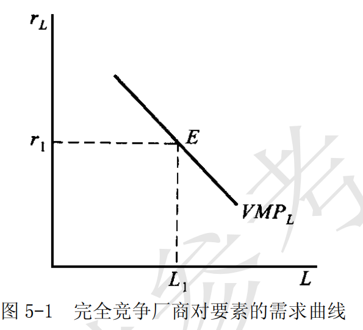
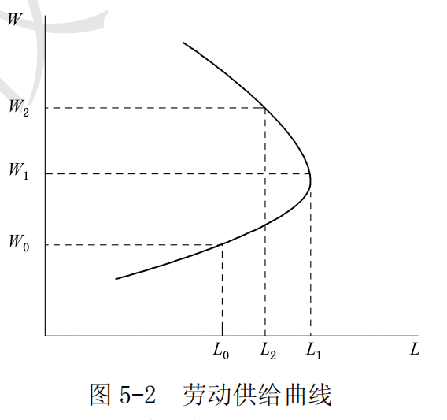
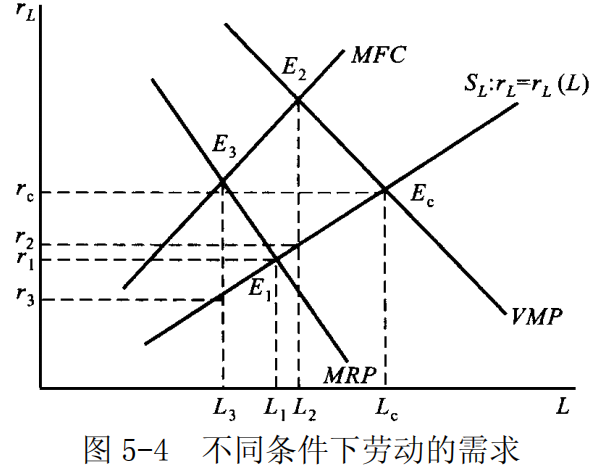

# 第 5 章 生产要素市场

> **本章核心问题**：生产要素的价格（工资、利息、地租、利润）如何决定？厂商对要素的需求与消费者对产品的需求有何不同？

## 核心概念

### 引致需求

引致需求又称“派生需求”，指由于消费者对产品的需求而引起的企业对生产要素的需求。引致需求来自厂商，是厂商对生产要素的需求，不同于消费者对商品的需求。

在产品市场上，需求来自消费者，而消费者购买产品是为了自己的消费，从中获得满足，一次购买过程到此结束。与此不同，在生产要素市场上，需求来自企业，而企业购买生产要素是为了生产，从中获得利润。企业购买生产要素并不是一次经济行为的终结。一个企业能否获得利润并不取决于其自身，而是取决于消费者对其所生产的产品的需求，取决于消费者是否愿意为其产品支付足够的价格。如果不存在消费者对产品的需求，那么厂商就无法从生产和销售中获得收益，从而也不会去购买生产资料和生产产品。或者说，消费者对产品的直接需求，引致和派生了厂商对生产要素的需求。某一种生产要素的需求曲线的形态，是从使用这种生产要素的最终产品的需求曲线派生出来的。

### 边际产品价值

边际产品价值指增加一单位生产要素所增加的产量的价值，它等于边际产量与产品价格的乘积，即： $VMP=P\cdot{MP_L}$ 。在完全竞争市场上，要素的边际产品价值反映了要素的边际收益，它是厂商对要素的需求曲线。

由于边际产量服从递减规律，因而完全竞争厂商对要素的需求曲线向右下方倾斜。

### 边际收益产品

边际收益产品是指在其他生产要素的投入量固定不变时追加一单位的某种生产要素投入所带来的收益。它等于边际产品（ $MP$ ）与边际收益（ $MR$ ）的乘积，即：

$$MRP=MR \cdot MP$$

在产品卖方垄断市场，由于厂商出售既定产量可以索要的价格与厂商的产量有关，通常呈相反方向变动，因而，一种要素的边际产量为厂商增加的收益不等于原有的价格与边际产量之积，而是边际产量与边际收益之积。

### 平均要素成本

平均要素成本是厂商购买每单位生产要素平均支付的成本。

在完全竞争市场上，平均要素成本由于生产要素的价格既定，因而厂商的平均要素成本就等于该要素的市场价格。在生产要素市场买方垄断的条件下，平均要素成本曲线就是厂商面对的要素供给曲线。厂商使用要素的边际成本高于要素价格。这是因为这时厂商面对的是一条向右上方倾斜的要素供给曲线。因而，厂商使用要素的数量影响到要素的价格。这时，平均要素成本曲线随着要素使用量的增加而增加。

### 边际要素成本

边际要素成本是指厂商增加一单位生产要素投入量所带来的成本增加量。记为 $MFC$ 。

厂商利润最大化原则:  $$MRP=MFC$$

在完全竞争市场上，由于生产要素价格不变，因而增加一单位要素的成本就等于该要素的价格。在要素的买方垄断市场上，厂商使用要素的边际要素成本高于要素的价格。

### 向后弯曲的劳动供给曲线

根据劳动者的最优化行为，对应于一个特定的工资率，劳动者在效用最大化点上确定最优劳动供给量，从而得到劳动的供给曲线。在工资水平较低时，工资率上升对劳动所产生的替代效应大于收入效应，因而人们愿意提供更多的劳动，减少闲暇；而当工资水平上升到一定程度以后，替代效应小于收入效应，因而人们增加闲暇时间，而减少劳动时间。因此，劳动的供给曲线向（左）后方弯曲。

## 问题与分析

### 简要说明完全竞争厂商对生产要素的需求曲线是如何得到的。

**【符号说明】**
| 符号 | 英文全称 | 中文含义 |
|------|----------|----------|
| $VMP$ | Value of Marginal Product | 边际产品价值 |
| $P$ | Price | 产品价格 |
| $MP$ / $MP_L$ | Marginal Product | 边际产量/劳动的边际产量 |
| $r$ | Rental Rate | 要素的价格 |

- （1）与产品市场一样，完全竞争要素市场上有众多的厂商和众多的要素供给者，它们都按照既定的要素价格来选择最优的要素使用量和供给量。在产品市场上，厂商也是完全竞争者，即产品的市场价格是厂商决策的依据。就厂商而言，厂商选择要素使用量的原则是利润最大化，即要素的”边际收益”和”边际成本”必须相等。

- （2）在完全竞争市场上，厂商使用要素的“边际收益”为该要素的边际产品价值，即边际产量与价格的乘积。这是因为，增加一单位要素可以增加的产量等于该要素的边际产量，而这些产量以不变的产品价格出售，所以，增加该要素一个单位给厂商带来的收益就等于产品价格乘以边际产量，即：$VMP= P\times MP$ 。

	从要素的“边际成本”考察，由于厂商面对的要素价格由市场供求所决定，不随厂商使用要素数量的多少而改变，因此增加一单位的要素所增加的成本等于该要素的价格。由此可知厂商的使用要素利润最大化原则表现为：

	$$VMP=P \times MP =r$$ 。其中， $r$  为要素的价格。

- （3）对应于由市场所决定的要素价格  $r$  ，厂商选择利润最大化的要素使用量，因此要素的边际产品价值构成了厂商对该要素的需求曲线。由于要素的边际产量  $MP$ 服从递减规律，而产品在完全竞争市场上的产品价格保持不变，因而要素的边际产品价值 $VMP$  也随着要素使用量的增加而递减，即完全竞争厂商对要素的需求曲线向右下方倾斜，如图 5-1 所示。



### 为什么劳动供给曲线向后弯曲？试用收入效应和替代效应加以说明。

- （1）劳动力供给曲线向后弯曲是指随着劳动价格即工资率的提高，最初劳动的供给量逐渐增加，但当劳动价格上升到一定程度之后，劳动供给量反而减少的情况。假设每一个劳动力的供给只取决于工资，则向后弯曲

的劳动供给曲线可用图 5-2 表示。



- （2）劳动供给曲线向后弯曲可以从以下三方面来分析：

- ①劳动的供给曲线向后弯曲，是劳动工资率产生的替代效应和收入效应综合影响的结果。劳动者在不同的工资率下愿意供给的劳动数量取决于劳动者对工资收入和闲暇所带来效用的评价。消费者的总效用由收入和闲暇提供。收入通过消费品的购买为消费者带来满足：收入越多，消费水平越高，效用满足越大。同样，闲暇也是一种特殊的消费，闲暇时间越长，效用水平越高。然而，可供劳动者支配的时间是既定的，所以劳动者的劳动供给行为可以表述为：在既定的时间约束条件下，合理地安排劳动和闲暇时间，以实现最大的效用满足。

- ②一般而论，工资率越高，对牺牲闲暇的补偿也就越大，劳动者宁愿放弃闲暇而提供劳动的数量也就越多。换言之，工资率提高，闲暇的机会成本相应也就越大，劳动者的闲暇时间也就越短。因此，工资率的上升所产生的替代效应使得劳动数量增加。同时，工资率的提高，使得劳动者收入水平提高。这时，劳动者就需要更多的闲暇时间。也就是说，当工资率提高以后，劳动者不必提供更多的劳动就可提高生活水平。这说明，工资率提高的收入效应使得劳动数量减少。

- ③替代效应和收入效应是工资率上升的影响的两个方面，如果替代效应大于收入效应，则闲暇需求量随其价格上升而下降；反之，如果收入效应大于替代效应，则闲暇需求量随其价格的上升而上升。这就意味着劳动供给曲线向后弯曲。如果原来的工资即闲暇价格较低，则此时的劳动供给量较小，工资上涨的收入效应不能抵消替代效应；但如果工资率已经处于较高水平，此时劳动供给量也相对较大，则工资上涨引起的整个劳动收入增量就很大，从而收入效应超过替代效应。这就是说，当工资的提高使人们富足到一定的程度以后，人们会更加珍视闲暇。因此，当工资达到一定高度而又继续提高时，人们的劳动供给量不但不会增加，反而会减少。因此，当工资率提高到一定程度之后，劳动供给曲线开始向后弯曲。

### 试说明欧拉定理在要素收入分配理论中的含义。

**【符号说明】**
| 符号 | 英文全称 | 中文含义 |
|------|----------|----------|
| $Q$ | Output / Total Product | 总产量 |
| $L$ | Labor | 劳动要素 |
| $K$ | Capital | 资本要素 |
| $MP_L$ / $\frac{\partial Q}{\partial L}$ | Marginal Product of Labor | 劳动的边际产品 |
| $MP_K$ / $\frac{\partial Q}{\partial K}$ | Marginal Product of Capital | 资本的边际产品 |

- （1）欧拉定理又称为**产量分配净尽定理**，是对应于齐次函数的一个数学定理。

**核心含义**：在完全竞争且规模收益不变的条件下，全部产品正好足够分配给各个要素，不多也不少。

假设有两种生产要素劳动 $L$ 和资本 $K$ ，生产函数为 $Q=Q(L,K)$ ，若生产规模收益不变，则有：

$$Q=L\cdot\frac{\partial Q}{\partial L}+K\cdot\frac{\partial Q}{\partial K}$$

这就是欧拉定理。其中：
- $\frac{\partial Q}{\partial L} = MP_L$（劳动的边际产品）
- $\frac{\partial Q}{\partial K} = MP_K$（资本的边际产品）

**经济学解释**：全部产品 $Q$ 恰好等于劳动获得的收入加上资本获得的收入。

---

**（2）欧拉定理的收入分配含义**

欧拉定理也可以表示为：

$$Q=L\cdot MP_L+K\cdot MP_K$$

**直观理解**：

| 要素 | 投入量 | 边际产品 | 获得的收入 |
|------|--------|----------|------------|
| 劳动 | $L$ | $MP_L$ | $L \times MP_L$ |
| 资本 | $K$ | $MP_K$ | $K \times MP_K$ |
| **合计** | — | — | **$= Q$（总产量）****

在完全竞争市场上：
- 要素价格 = 边际产品价值（$w = P \times MP_L$，$r = P \times MP_K$）
- 每种要素按其边际贡献获得收入
- **总收入恰好分完，没有剩余**

**举例**：

假设一个工厂：
- 投入：100个工人、10台机器
- 产出：1000件产品
- 工人边际产品：5件/人 → 劳动收入 = $100 \times 5 = 500$件
- 机器边际产品：50件/台 → 资本收入 = $10 \times 50 = 500$件
- 总计：$500 + 500 = 1000$件 ✓ 恰好分完

**为什么重要**：

欧拉定理证明了**按边际贡献分配是合理的**——在规模收益不变时，这种分配方式能够恰好分完全部产出，既不多也不少。这为收入分配的公平性提供了理论基础。

### 以劳动市场为例，说明产品卖方垄断而要素市场买方垄断的条件下的生产要素价格决定。

- （1）生产要素的价格是由生产要素的供给和需求所决定的。劳动市场由劳动的供给和劳动的需求两方面构成。劳动的供给来源于劳动者，而劳动的需求来源生产者。劳动这种要素的价格是由劳动市场的供给和需求所决定的一个市场均衡价格，但是它受到市场条件的限制。

- （2）在生产要素市场上，厂商决定使用劳动等生产要素数量的一般原则是边际收益产品等于边际要素成本。

为了利润最大化，厂商每使用一单位数量的劳动所花费的成本必须等于该单位劳动所带来的收益：如果前者大于后者，厂商会减少该单位生产要素的使用；如果前者小于后者，厂商则增加使用。依照定义，厂商使用最后一单位劳动所花费的成本就是该单位要素的边际要素成本，而因使用该单位劳动所生产的产品卖出后获得的收益就是劳动的边际收益。它等于要素的边际产品的边际价值，即边际产品乘边际收益。

在要素市场买方垄断的条件下，厂商雇佣劳动力的原则仍然是劳动的边际收益产品等于边际要素成本。劳动市场上的买方垄断意味着市场上只有一家厂商购买劳动这一生产要素。所以，该厂商面临的劳动的供给曲线是市场的供给曲线，向右上方倾斜，厂商使用劳动的边际要素成本不再是不变的量，它因劳动的平均要素成本增加而以更快的速度增加，即劳动的边际要素成本高于劳动的供给。

- （3）在产品市场卖方垄断条件下，厂商卖出使用劳动生产出的产品时所面临的市场需求曲线是向下倾斜。这就使得产品的边际收益小于市场价格，从而使得劳动的边际收益产品低于边际产品价值。

- （4）厂商根据该边际要素成本等于边际产品价值决定劳动的使用量，把劳动的价格确定在比边际要素成本更低的劳动供给曲线上。由于买方垄断条件下厂商决定劳动价格，因此，在这一市场结构下没有明显的劳动需求曲线，厂商根据要素的边际产品价值与边际要素成本相等的条件决定要素使用量，同时在要素供给曲线上支付这一使用量下可能的最低价格。如图 5-4 所示，在完全竞争下，劳动的均衡价格为 re ；但是在产品卖方垄断而要素市场买方垄断的条件下，劳动的价格为 $r3$  。



由以上分析可以看出，与完全竞争厂商相比，由于买方垄断厂商使用要素的边际要素成本高于要素的供给曲线，而要素的边际产品价值相等，因而其要素使用量更少，支付的价格更低。

---

**【产品卖方垄断 + 要素买方垄断总结】**

**基本概念：**

| 概念 | 含义 | 数学表达 |
|------|------|----------|
| **边际收益产品 (MRP)** | 增加一单位要素带来的收益增加 | $MRP = MP_L \times MR$ |
| **边际要素成本 (MFC)** | 增加一单位要素带来的成本增加 | $MFC = \frac{\Delta TC}{\Delta L}$ |
| **边际产品价值 (VMP)** | 边际产品的市场价值 | $VMP = MP_L \times P$ |

**双重垄断的影响：**

| 市场 | 厂商地位 | 面临的曲线 | 关系 |
|------|----------|------------|------|
| **产品市场** | 卖方垄断 | 需求曲线向下倾斜 | $MR < P$ → $MRP < VMP$ |
| **要素市场** | 买方垄断 | 供给曲线向上倾斜 | $MFC > \text{要素价格}$ |

**决策原则：**

$$MRP = MFC$$

即：边际收益产品 = 边际要素成本

**市场结构对比：**

| 市场类型 | 产品市场 | 要素市场 | 均衡条件 | 要素价格 | 要素使用量 |
|----------|----------|----------|----------|----------|------------|
| **完全竞争** | 完全竞争 | 完全竞争 | $VMP = \text{要素价格}$ | 最高 | 最多 |
| **产品卖方垄断** | 卖方垄断 | 完全竞争 | $MRP = \text{要素价格}$ | 中等 | 中等 |
| **要素买方垄断** | 完全竞争 | 买方垄断 | $VMP = MFC$ | 中等 | 中等 |
| **双重垄断** | **卖方垄断** | **买方垄断** | **$MRP = MFC$** | **最低** | **最少** |

**双重垄断的图形示意：**

```
工资(W)
  ↑
  |           S (供给曲线)
  |          /
  |         / MFC (边际要素成本) > S
  |        /
  |       /   ← MFC在S上方
  |      /
  |     ·  ← 均衡点：MRP = MFC
  |    /|
  |   / |
  |  /  |
  | /   |
  |/    | ← 实际工资在供给曲线上
  +----------------→ 劳动量(L)
      L*  (比完全竞争少)
```

**结论**：双重垄断导致要素价格最低、雇佣量最少，这是最不利于劳动者的市场结构。

## 推导与例题

### 在生产要素市场上，厂商的利润最大化原则是什么？证明你的结论。

**【符号说明】**
| 符号 | 英文全称 | 中文含义 |
|------|----------|----------|
| $\pi$ | Profit | 利润 |
| $TR$ | Total Revenue | 总收益 |
| $TC$ | Total Cost | 总成本 |
| $MRP$ | Marginal Revenue Product | 边际收益产品 |
| $VMP$ | Value of Marginal Product | 边际产品价值 |
| $MFC$ | Marginal Factor Cost | 边际要素成本 |
| $MR$ | Marginal Revenue | 边际收益 |
| $P$ | Price | 产品价格 |
| $MPP$ / $MP$ | Marginal Physical Product | 边际物质产品/边际产量 |
| $L$ | Labor | 劳动投入量 |
| $w$ | Wage | 工资率（要素价格） |

---

**【核心概念辨析】**

在开始证明前，需要区分两个容易混淆的概念：

| 概念 | 英文 | 定义 | 公式 | 适用条件 |
|------|------|------|------|----------|
| **边际产品价值** | VMP | 边际产量的市场价值 | $VMP = P \times MP_L$ | 产品市场完全竞争 |
| **边际收益产品** | MRP | 增加要素带来的收益增量 | $MRP = MR \times MP_L$ | 任何产品市场 |

**关键关系**：

- 完全竞争产品市场：$P = MR$，故 $VMP = MRP$
- 卖方垄断产品市场：$MR < P$，故 $MRP < VMP$

---

**【利润最大化原则】**

**结论**：要素市场上利润最大化的一般原则是：

$$MRP = MFC$$

即：**边际收益产品 = 边际要素成本**

---

**【证明过程】**

**第一步：设定利润函数**

假定除劳动 $L$ 外，其他要素不变。厂商利润为：

$$\pi = TR - TC$$

**第二步：求一阶导数**

利润最大化要求对 $L$ 的一阶导数为零：

$$\frac{d\pi}{dL} = \frac{dTR}{dL} - \frac{dTC}{dL} = 0$$

即：

$$\frac{dTR}{dL} = \frac{dTC}{dL}$$

**第三步：分析边际收益（左边）**

增加一单位劳动带来的总收益增加：

$$\frac{dTR}{dL} = \frac{dTR}{dQ} \times \frac{dQ}{dL} = MR \times MP_L = MRP$$

这就是**边际收益产品（MRP）**。

**第四步：分析边际成本（右边）**

增加一单位劳动带来的总成本增加：

$$\frac{dTC}{dL} = MFC$$

这就是**边际要素成本（MFC）**。

**第五步：得出结论**

$$MRP = MFC$$

**【经济学含义】**

| 情况 | 条件 | 厂商决策 |
|------|------|----------|
| $MRP > MFC$ | 增加要素的收益 > 成本 | **增加**要素投入 |
| $MRP < MFC$ | 增加要素的收益 < 成本 | **减少**要素投入 |
| $MRP = MFC$ | 增加要素的收益 = 成本 | **达到最优**，不再调整 |

---

**【不同市场结构下的具体形式】**

| 产品市场 | 要素市场 | 均衡条件 | 说明 |
|----------|----------|----------|------|
| 完全竞争 | 完全竞争 | $VMP = w$ | $MRP = VMP$，$MFC = w$ |
| 卖方垄断 | 完全竞争 | $MRP = w$ | $MRP < VMP$，$MFC = w$ |
| 完全竞争 | 买方垄断 | $VMP = MFC$ | $MRP = VMP$，$MFC > w$ |
| 卖方垄断 | 买方垄断 | $MRP = MFC$ | $MRP < VMP$，$MFC > w$ |

其中 $w$ 为工资率（劳动价格）。

**【总结】**

要素市场的利润最大化原则 $MRP = MFC$ 与产品市场的 $MR = MC$ 是完全对称的：

- 产品市场：多生产一单位产品，边际收益 = 边际成本
- 要素市场：多雇佣一单位要素，边际收益产品 = 边际要素成本

两者本质上都是**边际分析**在利润最大化决策中的应用。

---
