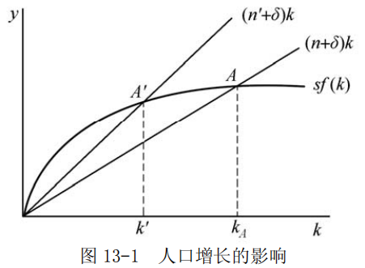

# 第 13 章 经济增长

> **本章核心问题**：为什么有些国家经济增长快而有些慢？资本、劳动、技术如何推动经济增长？经济增长能否持续？

## 本章脉络

前面各章都在解释收入的短期波动，本章换一个问题：为什么有的国家人均收入几十年翻了几番，有的国家却原地踏步？增长理论诞生于凯恩斯之后的第一代人之手：哈罗德（1939）与多马（1946）试图把《通论》的短期分析拉长成动态故事——投资不仅创造需求，还创造生产能力，经济必须在增长中保持两者的平衡。他们的结论是悲观的：稳定增长要求三个由不同力量决定的增长率恰好相等，经济像走在「刃锋」上，稍有偏离就发散。

1956 年，索洛与斯旺用新古典武器拆掉了这个悲观结论：只要资本与劳动可以相互替代，价格机制就会把经济拉回稳定状态——刃锋换成了碗底。但新的代价是：在没有技术进步的稳态里，人均收入不再增长，长期人均增长的唯一引擎被推到了模型之外。索洛（1957）随即用增长核算去测量这个「余值」，发现美国人均产出增长的大部分无法用资本与劳动解释——技术进步从假设变成了谜题。罗默与卢卡斯在 1980 年代中期接过这个谜题，把技术进步内生化，于是有了本章最后一节的新增长理论。

## 核心概念

### 哈罗德-多马模型

**【符号说明】**
| 符号 | 英文全称 | 中文含义 |
|------|----------|----------|
| $G$ | Economic Growth Rate | 经济增长率 |
| $s$ / $S$ | Savings Rate | 储蓄率 |
| $v$ | Capital-Output Ratio | 资本—产出比 |

---

哈罗德-多马模型是 20 世纪 40 年代由哈罗德和多马相继提出的分析经济增长问题的模型。由于基本分析思路相同，因而被合称为哈罗德-多马模型。基本形式为：

$$G=\frac{s}{v}$$

**核心结论**：
- 经济增长率与储蓄率成正比
- 经济增长率与资本—产出比成反比

它为什么存在？因为它是把凯恩斯长期化的第一次尝试：《通论》只回答「今年的就业由什么决定」，哈罗德与多马追问「投资既创造需求、也创造生产能力，明年的就业又由什么决定」。$G=\frac{s}{v}$ 正是投资这双重身份的代数。战后它一度成为发展计划的标准工具——想要多高的增长，就需要相应比例的储蓄来支撑。

---

**【为什么会出现人口增长率？】**

**注意**：基本公式 $G=\frac{s}{v}$ 中**没有人口增长率**变量。

人口增长率出现在**稳定增长条件**中：

$$G_A = G_W = G_N$$

| 符号 | 英文全称 | 中文含义 |
|------|----------|----------|
| $G_A$ | Actual Growth Rate | 实际增长率 |
| $G_W$ | Warranted Growth Rate | 有保证的增长率 |
| $G_N$ | Natural Growth Rate | 人口增长率（自然增长率） |

**为什么要等于人口增长率？**

| 条件 | 含义 | 不满足的后果 |
|------|------|-------------|
| $G_A = G_N$ | 经济增长率 = 人口增长率 | $G_A > G_N$ → 劳动力短缺 $G_A < G_N$ → 失业增加 |

**直观理解**：
- 如果经济增长快于人口增长 → 劳动力不够用
- 如果经济增长慢于人口增长 → 找不到工作

因此，人口增长率是作为**稳定增长的约束条件**出现，而非基本公式的一部分。

---

当实际经济增长率等于资本家意愿的经济增长率、并且等于人口增长率时，经济才能处于稳定增长状态。哈罗德同时认为，这一增长路径很难达到，因而是一种「刃锋」式的存在。

### 有保证的增长率

**【符号说明】**
| 符号 | 英文全称 | 中文含义 |
|------|----------|----------|
| $G_A$ | Actual Growth Rate | 实际增长率 |
| $G_W$ / $G_w$ | Warranted Growth Rate | 有保证的增长率 |
| $G_N$ | Natural Growth Rate | 自然增长率（人口增长率） |
| $s$ | Actual Savings Rate | 实际储蓄率 |
| $s_d$ / $S_d$ | Desired Savings Rate | 合意的储蓄率 |
| $v$ | Actual Capital-Output Ratio | 实际资本—产出比 |
| $v_r$ | Desired Capital-Output Ratio | 意愿的资本—产量比率 |

---

**【哈罗德-多马模型的三种增长率】**

| 增长率 | 公式 | 含义 | 决定因素 |
|--------|------|------|----------|
| **实际增长率 $G_A$** | $G_A = \frac{s}{v}$ | 实际发生的增长率 | 实际储蓄率、实际资本-产出比 |
| **有保证的增长率 $G_W$** | $G_W = \frac{s_d}{v_r}$ | 让企业家满意的增长率 | **合意**储蓄率、**合意**资本-产出比 |
| **自然增长率 $G_N$** | $G_N = n$ | 人口增长率（+技术进步） | 人口增长、技术进步 |

---

**【三者之间的关系】**

$$稳定增长条件：G_A = G_W = G_N$$

| 情况 | 条件 | 结果 |
|------|------|------|
| **理想状态** | $G_A = G_W = G_N$ | 充分就业的稳定增长（「刃锋」） |
| **经济扩张** | $G_A > G_W$ | 厂商增加投资 → 产出进一步增加 → 累积性扩张 |
| **经济收缩** | $G_A < G_W$ | 厂商减少投资 → 产出进一步减少 → 累积性收缩 |
| **劳动力短缺** | $G_A > G_N$ | 经济增长快于人口增长 → 劳动力不足 |
| **失业增加** | $G_A < G_N$ | 经济增长慢于人口增长 → 失业 |

---

**【有保证的增长率的含义】**

$$G_W = \frac{s_d}{v_r}$$

**核心含义**：使企业家**预期**的投资需求恰好等于本期储蓄供给的增长率。

| 要点 | 说明 |
|------|------|
| **与什么相适应？** | 与企业家意愿中所需要的资本—产量比率 $v_r$ 相适应 |
| **满足什么条件？** | 能满足投资等于储蓄的稳定的增长率 |
| **企业家行为** | 在此增长率下，企业家既不会增加也不会减少投资 |
| **稳定条件** | 当合意储蓄率和合意资本—产量比率决定的增长率实现时，经济可以稳定增长 |

### 新古典增长模型

**【符号说明】**
| 符号 | 英文全称 | 中文含义 |
|------|----------|----------|
| $s$ | Savings Rate | 储蓄率 |
| $k$ / $\frac{K}{L}$ | Capital per Worker | 人均资本 |
| $\Delta k$ | Change in Capital per Worker | 人均资本增量 |
| $n$ | Population Growth Rate | 人口增长率 |
| $f(k)$ | Output per Worker | 人均产出函数 |
| $sf(k)$ | Savings per Worker | 人均储蓄 |

---

**基本假设**：
| 序号 | 假设内容 |
|------|----------|
| ① | 全社会使用劳动和资本两种生产要素只生产一种产品 |
| ② | 劳动与资本之间可以相互替代（但不能完全替代） |
| ③ | 生产的规模收益不变 |
| ④ | 储蓄率保持不变 |
| ⑤ | 不存在技术进步，也不存在资本折旧 |
| ⑥ | 人口按照固定速度增长 |

---

**基本公式**：

$$sf(k)=\Delta k+nk$$

**各项含义**：
| 项目 | 公式 | 含义 |
|------|------|------|
| **人均储蓄** | $sf(k)$ | 社会的人均储蓄量 |
| **资本深化** | $\Delta k$ | 为每一个人配备更多的资本设备 |
| **资本广化** | $nk$ | 为新增加的人口配备按原有的人均资本配备设备 |

---

**均衡条件**（人均资本不变，$\Delta k = 0$）：

$$sf(k)=nk$$

此时：
- 产量（或收入）的增长率等于劳动力的增加率
- 经济均衡增长
- 经济总产量以人口增长率增长，人均产量和人均资本不变

索洛（1956）的回答之所以叫「新古典」，是因为它用新古典的价格机制拆掉了哈罗德的刃锋：资本与劳动可以替代——资本稀缺时回报率高、吸引投资，充足时回报率低、投资放缓——经济像落进碗底的球，自动滚回稳态。代价是：没有技术进步的稳态里，人均收入不再增长。

---

**黄金分割率**：

$$f'(k)=n$$

如果一个经济的目标是使人均消费最大化，那么在技术和劳动增加率固定不变时，经济中的资本—劳动比率应使得资本的边际产品等于劳动的增长率，此即黄金分割率。

这一法则由费尔普斯在 1961 年命名为「黄金律」。资本并非越多越好：超过黄金律水平之后，维持庞大资本存量所需的储蓄会吃掉太多产出，人均消费反而下降——社会为自己积累了「过多」的资本。

---

**【哈罗德-多马模型 vs 新古典增长模型】**

| 比较维度 | **哈罗德-多马模型** | **新古典增长模型（索洛）** |
|----------|---------------------|---------------------------|
| **提出时间** | 20世纪40年代 | 20世纪50年代 |
| **核心公式** | $G = \frac{s}{v}$ | $sf(k) = \Delta k + nk$ |
| **资本-产出比 $v$** | **固定不变** | **可变**（资本-劳动可替代） |
| **生产函数** | 固定系数生产函数 | 资本和劳动**可相互替代** |
| **调节机制** | **无自动调节** | **价格自动调节** |
| **稳态性质** | **「刃锋」**（很难达到） | **自动趋向稳态** |
| **长期增长** | 取决于**人口增长率 $n$** | 取决于**技术进步** |
| **政策含义** | 需要政府干预 | 市场自动调节 |

---

**【核心区别1：资本-产出比是否可变】**

| 模型 | 资本-产出比 | 后果 |
|------|-------------|------|
| 哈罗德-多马 | **固定** | 增长率容易偏离，无法自动恢复 |
| 新古典 | **可变** | 资本和劳动可替代，自动调节恢复稳态 |

---

**【核心区别2：稳态能否自动实现】**

$$哈罗德-多马：G_A = G_W = G_N \quad（几乎不可能 → 「刃锋」）$$

$$新古典：经济会自动趋向稳态 \quad（必然实现）$$

| 模型 | 稳态性质 | 形象比喻 |
|------|----------|----------|
| 哈罗德-多马 | **「刃锋」** | 像走钢丝，稍有不慎就掉下去 |
| 新古典 | **自动稳定** | 像弹簧，偏离后自动弹回 |

**原因**：新古典假设**资本和劳动可以相互替代**，当资本稀缺时，资本回报率高，会吸引投资；当资本充足时，资本回报率低，投资减少。这种调节机制使经济自动趋向稳态。

---

**【核心区别3：长期增长的源泉】**

| 模型 | 长期增长率取决于什么？ |
|------|------------------------|
| 哈罗德-多马 | **人口增长率 $n$** |
| 新古典 | **技术进步**（没有技术进步，人均收入停滞） |

**新古典的重要结论**：只有技术进步才能带来长期的人均收入增长，提高储蓄率只能暂时提高增长率，最终会回到稳态。

---

## 问题与分析

### 哈罗德-多马模型的基本公式与假设是什么？它的稳定增长为何难以实现？

**【符号说明】**
| 符号 | 英文全称 | 中文含义 |
|------|----------|----------|
| $G$ | Economic Growth Rate | 经济增长率 |
| $s$ / $S$ | Savings Rate | 储蓄率 |
| $v$ | Capital-Output Ratio | 资本—产出比 |
| $G_A$ | Actual Growth Rate | 实际增长率 |
| $G_W$ | Warranted Growth Rate | 有保证的增长率 |
| $G_N$ | Natural Growth Rate | 人口增长率 |

（1）哈罗德-多马经济增长模型是英国经济学家哈罗德和美国经济学家多马于 1948 年分别提出的关于经济增长的分析模型的统称。
因基本分析思路相同，故被合称。该模型主要研究在保持充分就业的条件下，储蓄和投资的增长与收入增长之间的关系。统一的基本公式表达式为：

$$G=\frac{s}{v}$$

式中：$v$ 为资本—产出比； $s$ 为储蓄率。模型表示，经济增长率与储蓄率成正比，与资本—产出比成反比。

- （2）哈罗德—多马经济增长假设前提包括：
	- ①全社会使用劳动和资本两种生产要素只生产一种产品；
	- ②储蓄率即储蓄在收入中所占的比重保持不变；
	- ③资本—产出比保持不变；
	- ④不存在技术进步，也不存在资本折旧；
	- ⑤人口按照一个固定不变的比率增长。

- （3）模型的充分就业稳定增长条件是：实际经济增长率等于意愿的或者有保证的经济增长率，并且与人口增长率保持相等。第一个条件表明，只有实际的与意愿的经济增长率相等，经济才处于均衡状态。实际经济增长等于人口增长率意味着经济增长不会受到劳动力的制约，也不会产生失业。因此，哈罗德—多马模型的充分就业下的稳定增长条件表示为：

$$G_A=G_W=G_N$$

其中， $G_A$ 、 $G_W$ 和 $G_N$ 分别表示经济中的实际增长率、有保证的增长率和人口增长率。

经济并不能自发地实现稳定增长。这是因为，如果实际的经济增长率大于有保证的增长率（$G_A > G_W$），那么在储蓄率既定的条件下，实际资本—产出比就会小于资本家意愿的资本—产出比。这样，厂商就会增加投资以便提高资本—产出比。投资增加使得产出量增加，实际经济增长率进一步提高。结果 $G_A>G_W$ 将导致实际经济增长率不断扩大，直到这种扩大受到劳动力限制为止。如果实际的经济增长率小于有保证的经济增长率，即  $G_A < G_W$  ，结果恰好相反。实际经济增长率将不断地下降，直到出现大量失业。

由此可见，哈罗德—多马模型的稳定均衡增长是很难达到的，因此哈罗德将它形象地称为「刃锋」。

### 新增长理论为什么把技术进步搬进模型内部？它主张什么政策？

新经济增长理论是 20 世纪 80 年代中期以后在西方出现的新理论。80 年代中期以来，以美国经济学家罗默和卢卡斯为代表的一批西方学者另辟蹊径，在经济增长理论方面取得重大突破，形成「新经济增长理论」。

该理论的基本观点是以内生技术进步、人力资本投资和知识积累等来解释经济长期增长的源泉，因而该理论也被称为「内生经济增长理论」。

- （1）新经济增长理论的基本思想

新经济增长理论目前还不能用一个简单的模型加以概括，严格说来，新经济增长理论是一些持类似观点或使用相同方法的增长模型。新经济增长理论的基本观点包括以下几个方面：
	- ①经济增长是经济系统内部因素相互作用而不是外部力量推动的结果，这些内生因素也可以实现经济的持续均衡增长。
	- ②在众多的因素中，技术进步是经济增长的决定因素。与其他推动经济增长的内生因素一样，技术进步是经济中追求利益最大化的经济当事人自主最优选择的结果，从而技术进步是由内生决定的。
	- ③技术、知识积累和人力资本投资等都具有外部效应，这种外部效应使得生产呈现出规模收益递增的趋势，而且正是这种外部性构成了经济实现持续增长所不可缺少的条件。
	- ④由于外部效应的作用，经济在处于均衡增长状态时，通常不能达到社会最优状态，即经济的均衡增长率通常低于社会最优增长率。
	- ⑤影响经济当事人最优选择行为的政策，例如税收政策、产业政策等可以影响经济的长期增长率。

在新古典增长理论的基础上，新经济增长理论使得稳态增长率内生化的基本途径主要有两条：
- ①在收益递增和外部性条件下考察经济增长因素中的技术因素，技术受到经济中用于研究和开发的投入量的影响，而这种投入则又是由模型内生所决定的；
- ②可积累的生产要素具有固定的报酬，则稳态增长率就是由这些生产要素的积累率所决定。

到 20 世纪 90 年代，新经济增长理论进一步放弃了完全竞争假设，开始在垄断竞争的框架下分析产品品种和质量提高对经济增长的影响，由于分析框架是垄断竞争式的，因而诸如模仿和创新等行为也被纳入到了经济增长模型之中。

- （2）新经济增长理论的政策含义

由于经济增长率不仅取决于人口增长率，而且也与储蓄率和技术进步有关，因而政府采取促进积累和提高技术水平的政策对经济增长也将起到重要的作用。因此，新经济增长理论建议政府对物质资本、设备投资和基础设施增加投资，同时鼓励人力资本的积累，加大科技投入。例如，通过减少预算赤字对私人投资的挤出和提供税收激励来增加投资；鼓励对人力资本的投资，即在教育和培训上花费更多的资源；增加基础设施的投资；为研究与开发支出提供税收激励等。

## 综合论述

### 新古典增长模型说了什么？它对发展中国家有什么启示？

**【符号说明】**
| 符号 | 英文全称 | 中文含义 |
|------|----------|----------|
| $n$ / $n^{'}$ | Population Growth Rate | 人口增长率 |
| $\delta$ | Depreciation Rate | 资本折旧率 |
| $k$ | Capital per Worker | 人均资本 |
| $s$ / $S$ | Savings Rate | 储蓄率 |
| $y$ | Output per Worker | 人均产出 |
| $Y$ | Total Output | 总产出 |
| $K$ | Capital | 资本 |
| $L$ | Labor | 劳动 |

- （1）新古典增长模型是 20 世纪 50 年代由索洛等人提出的一个增长模型。
由于它的基本假设和分析方法沿用了新古典经济学的思路，故被称为新古典增长模型。

- （2）新古典增长模型具有明显的政策含义，它表明要实现人均产出量的增加，有三种途径：
	- ①在人均资本占有量既定的条件下提高技术水平，从而增加产出。通过提高技术水平，改变资本—劳动比率，从而实现经济均衡增长；
	- ②提高储蓄率，使得人均资本增加。我国广大农村地区收入低，用于储蓄部分也较低，因而有必要通过提高农民收入来增加积累；
	- ③降低人口增长速度，使得人均资本增加。控制人口以提高人均资本存量这一点，对于许多人口增长较快的发展中国家具有重要的借鉴意义。

新古典增长理论虽然假定劳动力按一个不变的比率 $n$ 增长，但当把 $n$ 作为参数时，就可以说明人口增长对产量增长的影响。如图 13-1 所示。

图中，经济最初位于 $A$ 点的稳态均衡。现在假定人口增长率从 $n$ 增加到 $n^{'}$ ，则图 13-1 中 $(n+\delta)k$ 线便移动到 $(n^{'} +\delta)k$ 线，这时，新的稳态均衡为 $A^{'}$ 点。比较 $A^{'}$ 点与 $A$ 点，可知，人口增长率的增加降低了人均资本的稳态水平（从原来的 $k_A$ 减少到 $k^{'}$ ），进而降低了人均产量的稳态水平，这是从新古典增长理论得出的又一重要结论。

人口增长率上升所导致的人均产量下降，正是许多发展中国家面临的问题。两个有着相同储蓄率的国家仅仅由于其中一个国家比另一个国家的人口增长率高，就可以有非常不同的人均收入水平。因此发展中国家可以通过控制人口增长来增加人均资本。

## 局限与后续

- **索洛余值：对无知的度量。** 索洛（1957）用增长核算检查美国 1909—1949 年的数据，发现人均产出增长的八分之七无法用资本与劳动解释——他把这块「余值」记在技术进步的账上。阿布拉莫维茨的评语流传至今：这个余值是「对我们无知的度量」。后来的研究不断从余值里拆出新东西——人力资本、规模经济、资源配置改善、测量误差——「技术进步」更像一个装满未解之物的口袋。
- **收敛之争。** 索洛模型预言穷国增长快于富国（收敛），但跨国数据里绝对收敛并不成立，穷国与富国的差距在 20 世纪反而拉大。鲍莫尔（1986）发现工业国之间确实在收敛，德朗（1988）指出这是样本选择偏差；曼昆、罗默与韦尔（1992）把人力资本加进模型，条件收敛才大体成立。增长实证从此变成一场关于「控制哪些变量」的持久战。
- **内生增长的规模效应之败与东亚的教训。** 早期内生增长模型预言「经济体越大增长越快」（规模效应），琼斯（1995）用时间序列否定了它：研究投入持续上升，增长率却不见抬升。另一面，扬（1995）的核算显示东亚「奇迹」的大部分来自要素积累而非技术进步——高储蓄、高教育投入、劳动力转移，而非灵感的迸发。增长理论开出的政策清单（教育、研发、基础设施）因此更像必要条件的集合，而不是充分条件的配方。
