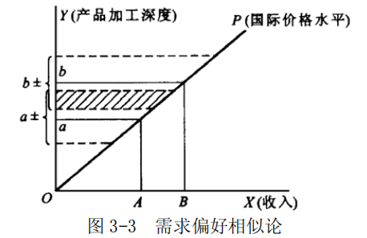

## 第 3 章 国际贸易的现代与当代理论

### 一、简述题

#### 1．简述列昂惕夫反论的主要内容。

答：
- （1）列昂惕夫反论的提出

$H-O$ 模型自提出后逐渐成为国际贸易理论的主流理论。
第二次世界大战后一些学者开始利用经验数字对该模型予以检验，以考察它是否能够反映国际贸易的实际情况，由于有若干检验的结果不支持 H-O 模型，出现了与该模型相悖的结论，列昂惕夫反论便是在这样的情况下出现的。

- （2）列昂惕夫反论的基本内容

列昂惕夫（投入—产出模型的创造者，并因此获得诺贝尔经济学奖），用投入—产出模型对美国 20 世纪 40年代和 50 年代的对外贸易情况进行了分析，考察了美国出口产品的资本—劳动比和美国进口替代产品（即美国既进口又自己生产的产品）中的资本—劳动比，发现美国参加国际分工是建立在劳动密集型专业分工基础之上的（即出口产品中的资本一劳动比低于进口替代产品），而不是建立在资本密集型专业化分工基础之上的，即美国是通过对外贸易安排剩余劳动力和节约资本的。这一结论引起了经济学界和国际贸易界的巨大争议。

- （3）围绕列昂惕夫反论展开的争论

列昂惕夫反论与 $H-O$ 模型的原理是相悖的，许多人用同样的方法对美国和其他国家的贸易进行了检验。列昂惕夫认为，美国工人具有其他国家工人 3 倍的劳动生产率，因此应该用工人数乘以 3，故是劳动相对丰富的国家。持要素密集度逆转观点的人认为，某种商品在资本相对丰富的国家属于资本密集型产品，而在劳动力相对丰富的国家则属于劳动密集型产品（如小麦在非洲与美国的生产）；另外，还有诸如资本密集型产品需求偏好论、关税结构说和自然资源稀缺等理论来对列昂惕夫反论的现象予以解释。

#### 2．试画出技术差距论的图形并予以简要分析。

答：

- （1）技术差距论认为贸易国之间技术差异的存在是解释某类贸易发生的原因。

由于各国技术革新的进展情况不一致，新产品总是在发达国家首先诞生，其他国家由于技术差距，要等一段时间以后才能进行模仿生产，在这一段时间内便存在着贸易的机会与可能。如图 3-1 所示。

- （2）对技术差距论的图形分析

图 3-1 中，A 国为技术创新国，B 国为技术模仿国。

- ① $T_0 \sim T_1$ 叫做需求滞后，A 国发明了一项新的技术，由于收入、模仿国消费者对新产品的认识等因素，使得该种产品的生产和消费仅在 A 国国内进行；

- ② $T_1 \sim T_2$ 叫做反应滞后，这一时期，A 国开始将产品出口到 B 国，也就是 B 国开始进口，反应滞后取决于模仿国厂商的反应，以及规模经济、价格、市场、关税等情况；

- ③ $T_2 \sim T_3$ 为掌握滞后，这一时期，B 国开始自行生产产品，但是由于取得技术的渠道、消化技术的能力等因素，B 国生产小于消费，也就意味着 B 国继续向 A 国进口以满足国内需求。

- ④ $T_3$ 时期以后，B 国完全掌握了该技术，生产量大大增加，最终成为产品的出口国。
	$T_0 \sim T_3$ 时期也叫做模仿滞后，
	$T_1\sim T_3$ 为两国贸易期间，这就是技术差距论者从技术差距的角度出发对国际贸易的原因做出的解释。

#### 3．试说明国际贸易中要素密集度逆转的情况。

答：
- （1）要素密集度逆转是这样一种情况：
某种商品在资本丰富的国家属于资本密集型产品，而在劳动力相对丰富的国家则属于劳动密集型产品，如小麦在非洲是劳动密集型生产过程的产品，而在美国则是资本密集型的产品，也就是大机器和高效化肥生产的产品。

- （2）如果两种要素在行业间的替代弹性差异很大，以至于两种等产量曲线相交两次，那么，可能产生生产要素密集度逆转的现象。
即一种产品在 A 国是劳动密集型产品在 B 国是资本密集型产品。可能就无法根据 $H-O$ 的模式预测贸易模式了。这样可能导致两个国家出口相同的产品；也会使得 A 国出口本国要素禀赋稀缺而密集使用的产品，因为如果 B 国的要素密集度逆转的商品相对价格低的话。这样，两国的要素价格同向发展，而不是要素价格均等化。

### 二、论述题

#### 1．试述 H-0 模型的主要内容并予以评价。

答：
- （1）H-O 模型的假设前提

①假设两个国家（A、B）、两种要素（劳动与资本）、两种产品（ X 、Y ）。
②两国在生产同一产品时，方法相同，技术水平一样，投入系数相同，即具有同样的生产函数，产量只是要素投入量的因变量。
③商品、要素市场属于完全竞争市场，要素在一国内可以完全流动，在国际间不完全流动。
④两个国家中一个是资本存量相对丰富的国家，因而利息率相对较低；一个是劳动存量相对丰富的国家，因而工资率较低。
⑤影响贸易的一些其他因素，如运输、需求、贸易壁垒等被排除。

- （2）H-O 模型的基本论点

①每个国家以自己相对丰富的生产要素从事商品的专业化生产和国际交换，就会处于比较有利的地位；相反，如果以自己相对稀缺的生产要素从事专业化生产和国际交换，就会处于相对不利的地位。因此，在国际贸易体系中，一国出口的总是那些以自己相对丰富的要素生产的产品，而进口的则总是那些需要用本国相对稀缺的要素生产的产品。

- ②如果两个国家生产要素存量（如劳动与资本）的比例不同，即使两个国家相同生产要素的生产率完全一样，也会产生生产成本的差异，从而使两国发生商品流动，即贸易关系。

- ③国际贸易的结果是使各贸易参与国之间的要素报酬（利息、地租、工资）差异缩小，出现要素价格均等化趋势。

- （3）H-O 模型的基本内在逻辑关系

- 同样产品的价格绝对差是国际贸易的直接基础；
- 价格绝对差是由成本绝对差决定的；
- 成本的绝对差是由要素价格差决定的；
- 要素价格绝对差是由要素存量比率不同决定的；
- 要素存量比率差异是由要素供求决定的；
- 要素的供给则是由要素禀赋决定的。

- （4）对 H-O 模型的评价

- ① $H-O$ 模型与比较利益说的异同点

从基本层面看，H-O 模型是建立在相对优势基础上的，要素流动假设也基本一致，但 H-O 模型认为一种要素（劳动）无法进行生产，至少应为两种，国内、国际贸易均为不同区域间的商品贸易，本质是相同的，交换的原则也是相同的。李嘉图则认为国内等量劳动相交换的原则不能应用于国际贸易，李嘉图认为劳动生产率差异是国际贸易发生的原因。$H-O$ 模型则将劳动生产率一致作为自己分析的出发点。

- ②H-O 模型的政策含义与案例分析

发挥一个国家固有的优势，从优势出发进行贸易，是各国在进行对外贸易时必须考虑的。马来西亚出口锡，中东国家出口石油，中国和东南亚出口劳动密集型的服装、轻工产品，便是发挥自己优势的典型案例。

- ③对 H-O 模型的评价

从一国基本经济资源优势解释国际贸易发生的原因，从实际优势出发决定贸易模式（产品结构、地理格局），从贸易对经济的影响分析贸易的作用，是 H-O 理论有益的方面；但禀赋并非贸易发生的充分条件，同时比较强调静态结果，排除了技术进步的因素以及许多实际存在的情况，影响了理论的广泛适用性，另外对于需求因素并未予以充分的重视，也影响了该理论对于实际情况的分析。

#### 2．试述国际贸易产品生命周期学说的主要内容并予以评价。

答：
- （1）产品生命周期学说的主要内容

产品生命周期指的是产品要经历投入、成长、成熟和衰退等时期。国际贸易的产品生命周期，是将周期理论与国际贸易理论结合起来，认为国际贸易的发生是由于不同国家之间生产技术方面存在着差距，技术差距的产生与缩小会改变国际贸易中的比较利益，从而使国际贸易的比较利益从静态发展到动态，即比较利益从一个或一类国家转移到另一个或一类国家，一类产品的生产优势因而从一国转移到另外的国家，国际贸易的格局也因此发生变化。

产品生命周期理论的四阶段为：
- 第一阶段，创新国由于具有广大的市场、高水平的科技人员、科技投入高，且企业将创新转化为产品的能力强，因此创新发生在创新国，并对该产品有生产和市场的垄断；
- 第二阶段，外国开始模仿，创新国产品在该国的竞争力下降；
- 第三阶段，外国模仿者开始向第三国出口，创新国出口受到影响，且大幅度下降；
- 第四阶段，外国产品进入创新国市场，创新国开始从出口国转变为进口国，该种商品在创新国完成周期，而在模仿国开始类似创新国一样的周期。

- （2）国际贸易产品生命周期理论的图形说明

如图 3-2 所示，
在 $T_0$ 点创新国开始在国内生产并消费某种产品，当生产超过消费，即在 $T_1$ 时创新国开始出口该种新产品。
创新国在 $T_2$ 时达到出口高峰，之后由于其他国家的模仿生产，自我供给消费，创新国出口下降，而到T3 时出口下降为 0，即创新国在该产品生产上已经失去了比较优势。
$T_3$ 点之后该创新国开始进口。模仿国在 $T_1^{'}$ 点之前对创新产品或者没有认识，或者由于其他原因而进行消费，在 $T_1^{'}$ 时开始进口、消费该种产品。
到 $T_2^{'}$ 时模仿国的厂商认识到这种产品可以带来利润，开始模仿生产这种产品。在 $T_3^{'}$ 时，该种商品在模仿国的生产，消费达到自给，模仿国开始停止进口该种商品。
$T_3^{'}$ 之后模仿国由于规模生产或其他比较优势开始以低成本出口。

在实践中，$T_1$ 与 $T_1^{'}$ 之间的水平距离取决于创新、模仿国之间的收入差距，而 $T_3$ 与 $T_3^{'}$  之间的水平距离表明模仿国会先向别的国家出口，然后再向创新国出口。这种产品生命周期过程就像接力棒传递一样，从先进国家的创新、生产开始，然后转移到其他相对落后的国家，再转移、传导到更为相对落后的国家进行生产与经营，在生命周期的延长过程中，该产品能够尽量创造利润收入。

- （3）产品生命周期模型的动态意义

- ①产品生命周期理论考察了当周期发生变化时，由于不同国家之间存在的技术差距，比较利益是怎样从一个国家转移到另一个国家的，这样使得解释国际贸易的比较利益学说、H-O 模型摆脱了静态分析，进入了动态分析阶段，这是理论的进步。

- ②该理论隐含着一种产品在生命周期的不同阶段，其含有的要素密集度也在发生变化，如在生命周期的第一阶段，技术、产品的创新要求大量的研究与开发成本的投入，在第二阶段，由于生产已经成熟化、标准化，成本具有重要地位，生产规模要急剧扩大，则要求大量的资金投入，等等。这种要素密集度随产品生命周期不同阶段而相应变化的状况，对相对落后国家在国际分工中确定自己的地位和参与格局具有指导性意义，可以使其确定在产品生命周期的一定阶段参与相应的国际分工，并且关注在发展过程中应该如何进行生产结构的升级、改造。

- ③相对落后国家也不断检讨本国要素优势的变化以应付新的挑战。随着发展中国家的经济进步，原有的比较优势会发生变化，如果不从动态角度适应本国的比较优势的变化，进而加入国际分工，发展中国家的经济发展就会受到影响。

- （4）对国际贸易产品生命周期理论的评价

生命周期理论使得比较利益、$H-O$ 模型从静态发展为动态，把管理、科技、外部经济因素等引入贸易模型，比传统理论进了一步。但由于经济生活中存在着各种不确定性因素，各国面临的产业发展方向和环境不同，故生命周期的循环并不是国际贸易普遍的、必然的现象。而且在这种动态中创新与模仿者的地位却有某种程度的固定（如美国常常被认为是创新者）。

#### 3．试述产业内贸易理论并予以评价。

答：

产业内贸易是一国的某种产业既出口又进口该产业产品的现象。产业内贸易理论是现代贸易理论的重要组成部分。

- （1）产业内贸易理论的假设前提

- ①理论分析基本上是从静态出发的，简化的模型分析只侧重于产业内贸易发生的原因、结果而非过程。
- ②分析以不完全竞争市场，而非完全竞争市场为前提，这样更接近现代世界经济的现实。
- ③经济中具有规模收益，并将其分析为国际贸易发生后的重要利益来源。
- ④在分析中要考虑需求不相同与相同的情况，即比较其他理论，产业内贸易理论更加重视需求方面的影响。

- （2）同质产品的产业内贸易

产品同质性是指产品间可以完全相互替代，即商品需求的交叉弹性极高，消费者对这类产品的消费偏好完全一样。这类商品在一般情况下大多数属于产业间贸易的对象，即用它们去交换其他商品而非相同的商品，但由于市场区位不同，进入市场的时间不同等，现实中也存在着相同产品间的贸易。同质产品的产业内贸易主要包括国家大宗产品的交叉型产业内贸易、合作或技术因素的贸易、转口贸易、进出口同种产品贸易、季节性产品贸易、跨国公司内部产业内贸易等等。

- （3）异质产品的产业内贸易

产品的异质性或差异产品是指产品相似但又不完全一样，存在着一定的差异，产品彼此之间不能完全替代但尚可进行一定程度的代替，交叉弹性小于同质产品，在生产中要素投入具有相似性，产业内贸易的大多数情况都属于异质产品的贸易。差异产品在国际贸易实践中被分为三种:
- 即水平差异（商品相同属性的不同组合而产生的差异性）
- 技术差异（用新技术制造的新产品带来的差异）
- 垂直差异（产品质量方面的差异）的产品。

- （4）基于需求偏好相似论的产业内贸易

需求偏好相似论从需求方面解释了产业内贸易发生的动因：即需求偏好相似。
该理论认为，国际贸易是国内贸易的延伸，因厂商首先满足的是国内熟悉的市场；人均收入决定一个国家的需求结构，收入相似则市场之间的隔阂较小，易于发生贸易。如图 3-3 所示。

图 3-3 中，在一定的国际价格水平下，收入相似的国家之间，由于需求发生重叠，因而易于产生贸易。图中 A 、 B 点是两国不同的收入水平，OP 是世界价格线， a 、b 是在 A 国和 B 国收入水平下消费的典型的加工深度，由于人们的消费是多样的，因此加工深度是一个区域，便可能产生消费交叉，它们之间的交叉区域便是双方都消费的加工深度，即需求发生重叠，这种重叠便是产业内贸易的基础。

- （5）基于规模经济的产业内贸易

具有相似禀赋的不同国家，其中若有一国因规模经济而使成本降低（源于固定资本的分摊和专业分工的利益），它便会因此产生新的比较优势，而在贸易中受益。如图 3-4 所示。

图 3-4 中，A、B 两国具有相同的生产可能性曲线，并凸向原点，意味着具有规模经济，且 A、B 两国的分工是完全随意的。如 A 国专业化生产 X 产品，B 国专业化生产Y 产品，产量为OA 和OB 。B 国出口C'D 的Y 产品，换取 BD 的 X 产品，A 国出口C'E 的 X 产品，换取 AE 的Y 产品，无差异曲线从Ⅰ移至Ⅱ，福利水平得到提高。

但这种提高源于规模生产，而非资源禀赋等差异。

- （6）对产业内贸易理论的评价

产业内贸易是对传统贸易理论的批判，尤其是其假定更符合实际，扩大了探讨的内容；理论从需求角度对国际贸易进行了考察；规模经济是当代经济重要的内容，它是各国都在追求的利益，将规模经济的利益作为产业内贸易的利益来源，这样的分析较为贴近实际；产业内贸易理论是对比较利益的补充和发展，但是该理论基本是静态分析。

---

