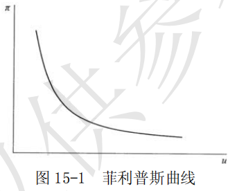

# 第 15 章 宏观经济学的意见分歧

## 一、名词解释

### 1．货币主义

货币主义又称货币学派，它以制止通货膨胀和反对国家干预为主旨，以现代货币数量论为理论基础，坚信货币供给量的变动是物价水平和经济活动变动的最根本原因；强调货币及货币政策的重要性，主张实行单一规则的货币政策。该学派于 20 世纪 50 年代后期在美国出现，主要代表人物的弗里德曼、沃尔特斯、帕金和弗里希等。

货币主义的基本命题是：
- ①货币要最紧，货币的推动力是说明产量、就业和价格变化的最主要的因素；
- ②货币供给量的变动是货币推动力的最可靠的度量标准；
- ③货币当局的行为支配着货币量的变动，从而通货膨胀、经济萧条或经济增长都可以而且应当惟一地通过货币当局对货币供给量的控制来加以调节。其政策指导思想是自由放任，反对政府干预。

### 2．自然率假说

自然率假说是指在没有货币因素干扰的情况下，劳动市场在竞争条件下达到均衡时所决定的就业率。
由于这一就业率与经济中的市场结构、社会制度、生活习惯等因素有关，因而被冠以“自然率”的名称。许多新自由主义经济学派都假定经济中存在着一个自然就业率，并运用各自的理论论证经济经常地处于这种状态。因而，自然率也被认为是一种假设。

### 3．菲利普斯曲线

菲利普斯曲线由英国经济学家菲利普斯首先提出，故得名。
它描述了通货膨胀率与失业率之间存在的交替关系。后来被新古典综合派用于说明一般价格水平、失业率和总需求之间的关系，如图 15-1 所示。

对于菲利普斯曲线具体的形状，不同学派对此有不同的看法。
普遍接受的观点是：
- 在短期内，短期菲利普斯曲线向右下方倾斜
- 长期菲利普斯曲线是一条垂直线，表明失业率与通货膨胀率之间不存在替换关系。

### 4．单一货币规则

单一货币规则是货币主义的政策主张，是货币主义经济学最重要的理论规则。
它认为，为了防止货币成为经济混乱的原因，给经济提供稳定的运行环境，最优的货币政策是货币供应保持固定的增长率，不论经济景气与否，都应维持不变。货币主义建议，货币以经济增长率加上通货膨胀率的速度增长。

### 5．理性预期假设

理性预期假说是指经济当事人对价格、利率、利润或收入等经济变量未来的变动可以作出符合理性的估计。理性预期包含三个方面的特征：

- （1）预期平均说来是正确的；
- （2）经济当事人在充分利用所有有效信息的基础上对某个经济量作出预期；
- （3）经济当事人作出的预期与经济模型的预测相一致。

### 6．市场出清

市场出清是指，无论劳动市场上的工资还是产品市场上的商品价格都具有充分的灵活性，可以根据供求情况迅速进行调整，以达到供求相等的均衡状态。
有了这种灵活性，产品市场和劳动市场都不存在超额供给，每个市场都处于或趋于供求相抵的情况。

### 7．新古典宏观经济学

新古典宏观经济学，又称作“新古典主义”的一个经济学流派，这个学派的经济学遵循古典经济学的传统，相信市场力量的有效性；认为如果让市场机制自发地发挥作用，就可以解决失业、衰退等一系列宏观经济问题。新古典宏观经济学的代表人物有美国的经济学家罗伯特·卢卡斯、托马斯·萨金特、尼尔·华莱士、埃德渥德·普雷斯科特、罗伯特·巴罗，英国的P•明福尔德等。

新古典宏观经济学坚持市场出清假设。新古典宏观经济学家认为，工资和价格具有充分的伸缩性，可以迅速调整。这样，通过工资价格的不断调整，使供给量与需求量相等，市场连续地处于均衡之中，即被连续出清。因此，新古典宏观经济学家把表示供给量和需求量相等的均衡看作经常可以得到的情形。

在此假设基础之上，新古典宏观经济学反对政府对经济的干预。该派理论的目的是想证明宏观经济政策是无效的，甚至是有害的。卢卡斯等人的货币经济周期理论从不完全信息出发论证了货币政策无效。该论述的中心内容是，预期到的货币供给的变化只影响价格水平，而不影响产量；只有没有预期到的货币供给才影响产量。新一代的新古典宏观经济学家不满足于货币政策无效性命题，他们将新古典主义宏观经济学的研究方法应用到财政政策分析，得出了财政政策也无效的命题。

## 二、简述题

### 简要评论新古典宏观经济学对凯恩斯主义理论的批判。

答：

新古典宏观经济学主要从经验检验和理论一致性两个方面展开对凯恩斯主义理论的批判。

- （1）从经验检验方面，新古典宏观经济学利用计量经济学的分析技术对菲利普斯曲线的形状进行了充分的检验，以便否定凯恩斯理论。由于滞涨现象的存在，检验结果对新古典宏观经济学有利。

- （2）从理论方面，首先，新先古典宏观经济学指出了凯恩斯主义经济理论三大错误。
	- 第一，不合理性的预期。在凯恩斯理论中，经济当事人的预期通常被假定为不变，它主要取决于过去该变量的数值。这就意味着人们并不利用有关将来的信息来谋取最大的利益，因此违背了西方经济学中理性经济人的基本假设。
	- 第二，在一个理论体系中个人行为不一致。比如，微观经济学中分析劳动供给时，假定人们就收入和闲暇进行选择，但在宏观消费理论中又假定人们储蓄的目的是为了将来的消费，即劳动者要在现在和将来之间进行选择。但并没有一种理论说明二者的一致性。
	- 第三，以国内生产总值作为评价政策的标准不能反映人们的福利状况。

其次，在批判凯恩斯理论的基础上，新古典宏观经济学全盘否定宏观经济政策的有效性。根据基于理性预期假设和货币主义的自然率假说，新古典宏观经济学认为，凯恩斯主义政策的有效性是建立在欺骗公众基础上的。

经济中存在着一个由资源、制度、习惯、市场结果等因素决定的自然就业率水平，同时人们会以理性的方式形成预期，在自然因素保持不变的条件下，持续的政策效果是不可能的。不仅如此，由于政府不能预测经济当事人的行为，因而政策的后果可能是加剧经济波动。

上述结论主要来自于著名的“卢卡斯批判”。卢卡斯认为，凯恩斯主义政策的有效性大多是根据参数固定不变的计量经济学模型，但经济当事人的理性预期将使得这些参数发生改变，从而使得政策并不能达到预期的效果。

## 三、论述题

### 1．评述货币主义的基本观点。

答：
- （1）货币主义又称货币学派，是 20 世纪 50 年代后期在美国出现的一个学派，主要代表人物的弗里德曼、沃尔特斯、帕金和弗里希等。该学派以制止通货膨胀和反对国家干预为主旨，以现代货币数量论为理论基础，坚信货币供给量的变动是物价水平和经济活动变动的最根本原因；强调货币及货币政策的重要性，主张实行单一规则的货币政策。

- （2）货币主义的基本命题
	- ①货币要最紧，货币的推动力是说明产量、就业和价格变化的最主要的因素；
	- ②货币供给量的变动是货币推动力的最可靠的度量标准；
	- ③货币当局的行为支配着货币量的变动，从而通货膨胀、经济萧条或经济增长都可以而且应当惟一地通过货币当局对货币供给量的控制来加以调节。其政策指导思想是自由放任，反对政府干预。

- （3）货币学派有两大理论特征

- 一是运用了预期量分析法和名义量分析法，
- 二是新自由主义思想贯穿始终。

表现在：

- ①强调两种意义的自由，即人们相互关系的自由和个人的自由；
- ②强调人们互相关系的自由在经济活动中主要依靠私有制和市场经济来完成，在政治活动中则通过少数服从多数来实现，经济自由是达到政治自由的一个不可缺少的手段；
- ③强调人是一种“不完善的实体”，绝对的自由是不存在的；
- ④两种意义的自由都只有在政府的保护下才能实现。

- （4）货币学派理论的主要内容

- ①市场经济理论。他们提出了市场经济的理想模式，认为政府的干预只应保留在有限的范围内。
- ②持久收入理论。他们认为消费水平不取决于当前或暂时性收入，而决定于持久性收入。由于持久收入具有高度稳定性，所以受它支配的货币需求也是高度稳定的，因而货币供给量的变动将影响经济稳定。
- ③价格总水平与货币供给量同方向变动。
- ④通货膨胀与失业理论。
他们认为通货膨胀是由货币供给量过度增加所导致，“随时随地都有一种货币现象”；
他们提出了自然失业率假说，利用自然率假说说明货币数量的变动对通货膨胀的传导机制。认为经济中存在着一个自然的就业水平。如果政府希望提高就业率，就必须以一定的通货膨胀为代价。但是，人们会根据现实的通货膨胀率不断地调整对通货膨胀的预期，从而政府旨在提高就业水平的政策只能以不断加剧的通货膨胀为代价。结果，长期中，通货膨胀率提高将不会对就业率产生太大的影响，即长期的菲利普斯曲线是一条垂直线。
- ⑤政策主张：自由主义的宏观经济政策。
- 第一，反对相机抉择的财政政策，认为扩张性的财政政策会导致对私人总需求的挤出效应，从而是无效的；也不主张逆经济方向行事的货币政策，因为货币政策往往产生各种滞后，反而会加剧经济波动；主张实行单一规则的货币政策，即由货币当局公开宣布今后相当长时期内每年的货币增长率不变，大致等于这段时期国民收入可能实现的增长率，以保证经济增长和物价稳定。
- 第二，主张推行“收入指数化”方案和负所得税方案。

（4）评价

货币主义是在与凯恩斯理论论战中发展起来的，透过它可以发现凯恩斯理论存在的某些缺陷。例如，财政政策的效果以及货币政策的挤出效应等都被西方经济学界所认可。此外，货币主义对通货膨胀的分析也值得我们注意。但是，把所有问题都归于货币，掩盖了生产过程中所暴露的矛盾。

### 2．新凯恩斯主义是如何解释价格、工资黏性的？请加以评论。

答：
- （1）价格、工资黏性分为名义黏性和实际黏性两种。
名义黏性指名义价格和名义工资的调整不能按照需求的变动而相应变动，新凯恩斯主义将其归因于产品市场上的不完全竞争。实际黏性是一种价格、工资相对于另一种价格、工资的粘性，新凯恩斯主义认为它起因于企业的成本加成定价。

- （2）为了说明非市场出清，新凯恩斯主义者必须集中力量建立价格和工资黏性的理论基础。
为此区分了名义黏性和实际黏性。新凯恩斯主义对名义黏性和实际黏性在最大化和理性预期假设下提出了各种各样的解释。这些解释包括菜单成本论、交错调整价格和交错调整工资论、不完全竞争论、市场协调论、劳动市场论和信贷配给论等。
-  ①菜单成本论认为，菜单成本的存在阻碍厂商调整价格，所以价格有黏性。
	菜单成本是指厂商每次调整价格要花费的成本，包括研究和确定新价格、编印更改价目表等所费的成本。另外，菜单成本也包括调整价格的机会成本。厂商只有在调整价格后的利润增加量大于菜单成本时，才会调价。因此，菜单成本的存在，使厂商不愿意经常地变动价格，所以价格水平有黏性。
- ②交错调整价格及交错调整工资论以理性预期为假设前提，认为经济当事人调整价格的时间是交错进行的。
交错调整导致价格和工资具有惯性。因而，即使存在理性预期，政府政策仍有积极作用。
- ③不完全竞争论认为，在不完全竞争市场中，厂商利用垄断力定价时，价格通常不会随着总需求的变动而变动，价格对总需求变动不敏感，导致产量随着总需求而变动。另一方面，总需求变动具有外部影响，可以通过宏观经济中各经济当事人之间的相互作用而放大，导致经济波动。在不完全竞争条件下，经济不存在自发趋向于充分就业的机制，因而需要通过政府干预才能提高效率，增进社会福利。
- ④市场协调失灵论是新凯恩斯主义为解释非市场出清原因而提出的一种新理论。
	市场协调失灵论从市场机制不能协调众多经济当事人的行为来说明市场失灵。他们认为，在一个由许多经济当事人构成的经济中，尽管每个经济当事人都是理性的，他们之间的行为相互联系、相互制约。然而，每个经济人的市场力量都很小，单个经济人无力协调整个经济行为，从而导致市场失灵。市场协调失灵，使市场机制不能确保经济处于有效率的均衡状态，只有通过国家干预，才能改变协调失灵的状况，使资源得到优化配置。
- ⑤劳动市场论多侧面地探讨了工资黏性和失业的原因。在新凯恩斯主义看来，隐含合同、局内人的压力、效率工资等都是工资黏性的原因。隐含合同是指风险中性的厂商与风险厌恶的工人之存在着非正式的协议；局内人与局外人之间的差别使得厂商面临着来自于厂商内部在职工人的压力；效率工资则说明，劳动的效率并不总是常数，它与厂商的工资呈正方向变动。为了保持效率，工资是以高效率工人的标准制定的。所有这些，使得实际工资出现黏性。
-  ⑥信贷配给论认为，在不完全信息的信贷市场上，利率和配给机制都在起作用。由于信息的不对称性，供给不完全了解风险程度，因而可能存在信贷配给。政府货币政策能成功地纠正信贷市场失灵，提高信贷市场效率，降低市场风险，增进社会福利。

