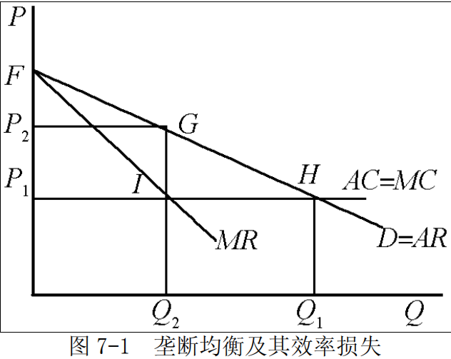

# 第 7 章 市场失灵和微观经济政策

## 一、名词解释

### 1．市场失灵

市场失灵是指市场机制不能有效地配置资源。
垄断、外部影响、公共物品以及不完全信息都是导致市场失灵的重要原因和主要表现。
西方经济学者认为，在现实社会中，种种原因将导致市场失灵，即市场机制的运转无法使社会资源达到最优配置，无法实现社会经济福利的最大化等社会目标。因此，市场机制的作用并不是万能的，必须通过政府对经济的干预来加以克服。

### 2．公共物品

通常把不具备排他性或（和）竞争性，一旦生产出来就不可能把某些人排除在外的商品称为（纯）公共物品。商品的排他性是指商品的生产者或者购买者可以很容易地把他人排斥在获得该商品带来的利益之外；商品的竞争性是指消费商品的数量与生产这一数量的成本有关。

### 3．免费乘车者问题

免费乘车者问题是指经济中由于存在不支付即可获得消费满足而产生的市场失灵问题。产生的原因是商品的非排他性。既然每个消费者都是经济上理性的，而公共物品又具有非排他性，那么每个消费者都将利用这一点，在不支付费用的条件下享受商品的效用。由于商品的非排他性，拥有或消费这种商品的人不能或很难把他人排除在获得该商品带来满足的范围之外。这一特征及其相应的问题被形象地称为搭便车。

### 4．外在性

外在性又称外部经济影响，是指一个经济行为主体的经济活动对另一个经济主体的福利所产生的效应，但这种效应并没有通过市场交易反映出来。外在性有正负之分，或称为外在经济和外在不经济。

### 5．科斯定理

科斯定理是一种产权理论。
科斯本人并未将科斯定理写成文字，科斯定理的提出是由其好友斯蒂格勒首先根据科斯于 20 世纪 60 年代发表的《社会成本问题》这篇论文的内容概括出来的。
其内容是：只要财产权是明确的，并且其交易成本为零或者很小，则无论在开始时将财产权赋予谁，市场均衡的最终结果都是有效率的。

这一结论包含三个要素：
- ①交易费用为零；
- ②产权界定清晰；
- ③自由交易。

由此引申出来的第二定理是：
在交易费用不为零的条件下，不同的产权制度会影响到资源配置的效率。科斯定理现已成为制度经济学的一个重要结论。

### 6．逆向选择

逆向选择指在次品市场上出现的高质量产品遭淘汰而低质量产品生存下来的现象。
处于信息劣势的一方，往往按平均水平推测产品的质量，从而导致高质量产品的交易价格偏低，交易数量较少，甚至可能导致只有次品才能成交的逆向选择。

### 7．道德风险

道德风险是指交易双方在签订交易合约后，信息占优势的一方为了最大化自己的收益而损坏另一方，同时也不承担后果的一种行为，即是市场的一方不能查知另一方的行动一种情形，又被称作隐藏行动问题。道德风险的存在不仅使得处于信息劣势的一方受到损失，而且会破坏原有的市场均衡，导致资源配置的低效率。

## 二、论述题

### 1．市场为什么会出现失灵？政府应该采取哪些措施？

市场失灵是指市场机制不能有效地配置资源。垄断、外部影响、公共物品以及不完全信息都是导致市场失灵的重要原因和主要表现。

- （1）垄断及其矫正措施

实际上，只要市场不是完全竞争的（垄断、垄断竞争或寡头垄断），当价格大于边际成本时，就出现了低效率的资源配置状态。垄断的产生使得资源无法得到最优配置，从而导致市场失灵。由于垄断会导致资源配置缺乏效率，因此也就产生了对垄断进行公共管制的必要性。政府对垄断进行公共管制的方式或政策主要包括以下几种：

- ①控制市场结构，避免垄断的市场结构产生；
- ②对垄断企业的产品价格进行管制；
- ③对垄断企业进行税收调节；
- ④制定反垄断法或反托拉斯法；
- ⑤对自然垄断企业实行国有化。

-（2）外部影响及其矫正措施

外部影响是指一个经济活动的主体对他所处的经济环境的影响。
外部影响会造成私人成本和社会成本之间，或私人收益和社会收益之间的不一致，因此容易造成市场失灵。外部影响的存在造成了一个严重后果：市场对资源的配置缺乏效率。换句话说，即使假定整个经济仍然是完全竞争的，由于存在着外部影响，整个经济的资源配置也不可能达到帕累托最优状态。就外部影响所造成的资源配置不当，微观经济学理论提出以下政策建议：
- ①使用税收和津贴；
- ②使用企业合并的方法；
- ③使用规定财产权的办法。

- （3）公共物品及其矫正措施

对于公共物品而言，市场机制作用不大或难以发挥作用。
因为公共物品由于失去竞用性和排他性，增加消费并不会导致成本的增加，消费者对其支付的价格往往是不完全的，甚至根本无需付费。在此情况下，市场机制对公共物品的调节作用就是有限的，甚至是无效的。

由于公共物品的消费存在免费搭便车的问题，很难通过竞争的市场机制解决公共物品的有效生产问题。在此情况下，由政府来生产公共物品应是一种较好的选择。对于大多数有特殊意义的公共物品，由政府或政府通过组建国有企业来生产或向市场提供，是一种不错的选择，例如国防、公安等。

政府应提供多少公共物品才能较好地满足社会需要，使资源得到有效利用是问题的难点所在。现在更多的推荐采用非市场化的决策方式，例如投票，来表决公共物品的支出水平。显然，虽然用投票的方法决定公共物品的支出方案是调节公共物品生产的较好方法，但投票方式并不总能获得有效率的公共物品的支出水平。

- （4）不完全信息及其矫正措施

信息不完全是指经济当事人对信息不能全面地把握，不能完全利用交易有关的信息。
在现实生活中，供求双方的信息通常具有不对称性或不完全性。一旦供求双方所掌握的信息不完全，就会对市场机制配置资源的有效性产生负面影响，造成市场失灵。由信息不完全导致的后果通常包括逆向选择、道德风险和委托—代理问题。
信息的不对称性和信息的不完全性会给经济运行带来很多问题，而市场机制又很难有效地解决这些问题，在此情况下，就需要政府在市场信息方面进行调控。政府解决信息不对称和委托—代理问题的方法主要有：

- ①针对由于信息不对称产生的逆向选择问题，可以通过有效的制度安排或采取适当的措施来消除信息不充分所造成的影响；
- ②解决委托—代理问题最有效的办法是实施一种最优合约，即委托人花费最低限度的成本而使得代理人采取有效率的行动实现委托人目标的合约。

### 2．结合垄断厂商的均衡，论垄断的效率及其政府对策。

（1）垄断是只有一个厂商提供全部市场供给的一种市场结构。
	垄断厂商的目标仍是利润最大化，故也会把产量选择在边际收益等于边际成本之点。

如图 7-1 所示，横轴表示厂商产量，纵轴表示价格，曲线 $D$ 和 $MR$  分别表示厂商的需求曲线和边际收益曲线。
假定平均成本和边际成本相等且固定不变，由直线 $AC=MC$ 表示。为了使利润极大，厂商产量定在$Q_2$ ，价格为 $P_2$ ，它高于边际成本，说明没有达到帕累托最优，因为这时消费者愿意为增加额外一单位所支付的数量（价格）超过生产该单位产量所引起的成本（边际成本）。显然，要达到帕累托最优，产量应增加到 $Q_1$ ，价格应降到  $P_1$ ，这时 $P=MC$ 。然而，垄断决定的产量和价格只能是 $Q_2$ 和 $P_2$ 。如果产量和价格是完全竞争条件下的产量 $Q_1$ 和价格 $P_1$ ，消费者剩余是 $\Delta F P_1 H$ 的面积，而当垄断者把价格提高到 $P_2$  时，消费者剩余只有 $\Delta F P_2 G$ 的面积，所减少的消费者剩余的一部分（图 $P_1P_2GI$ 所代表的面积）转化为垄断者的利润，另一部分（ $\Delta GIH$ 所代表的面积）就是由垄断所引起的社会福利的纯损失，它代表由于垄断造成的低效率带来的损失。

- （2）由于垄断常常导致资源配置缺乏效率，另外垄断利润也被看成是不公平的，因而有必要对垄断进行政府干预。
政府对垄断的干预主要有反垄断法和价格与产量管制。为了消除垄断的影响，政府可以采取反垄断政策。针对不同形式的垄断，政府可以分别或同时采取行业的重新组合和处罚等手段，而这些手段往往是依据反垄断法来执行的。制止垄断行为可以借助于行政命令、经济处罚或法律制裁等手段。反垄断法则是上述措施的法律形式。

- ①行业的重新组合的基本思路是把一个垄断的行业重新组合成包含许多厂商的行业。采取的手段可以是分解原有的厂商，或扫除进入垄断行业的障碍。制止垄断行为可以借助于行政命令、经济处罚或法律制裁等手段。

- ②行业的管制主要是对那些不适合过度竞争的垄断行业，如航空航天、供水等行业所采取的补救措施。政府往往在保留垄断的条件下，对于垄断行业施行价格控制，或价格和产量的双重控制、税收或津贴以及国家直接经营等管治措施。由于政府经营的目的不在于最大利润，所以可以按照边际成本或者平均成本决定价格，以便部分地解决垄断所产生的产量低和价格高的低效率问题。

- ③管制自然垄断的做法还可以采用为垄断厂商规定一个接近于“竞争的”或“公正的”资本回报率，它相当于等量的资本在相似技术、相似风险条件下所能得到的平均市场报酬。由于资本回报率被控制在平均水平，也就在一定程度上控制住了垄断厂商的价格和利润。

### 3．论外在性对经济效率的影响及其对策。

- （1）无论是消费的外在性还是生产的外在性，无论是正向外在性还是负向外在性，它们产生的影响都是在完全竞争条件下，资源配置将偏离帕累托最优状态。
	换句话说，即使整个经济仍然是完全竞争的，但由于存在着外部影响，整个经济的资源配置也不可能达到帕累托最优状态。外在性之所以产生这样严重的后果，其主要原因是外部影响导致决定社会最优的边际收益和边际成本与决定私人最优的边际收益和边际成本出现不同。以生产中出现负向外在性为例。假定某私人厂商对经济社会中的他人产生负向的外部经济影响，并且该厂商并未在其决策中考虑这一点，则社会边际成本大于私人边际成本。在需求既定从而边际收益既定的条件下，私人厂商将会按私人边际成本等于私人边际收益决定产量，而社会最优的产量则取决于社会边际成本等于边际收益。因此，社会需要的产量小于私人的最优产量，即在负向外在性存在的条件下，完全竞争市场的供给过剩。同样的道理，在存在正向外在性的条件下，与社会最优产量相比，私人厂商的生产量不足。由此可见，外在性的存在导致资源配置失当。

- （2）外在性的解决对策

为了纠正由于外部影响所造成的资源配置不当，政府通常可采取以下政策：

- ①使用税收和津贴。对造成外在不经济的企业，国家应该征税，其数额应该等于该企业给社会其他成员造成的损失，从而使该企业的私人成本恰好等于社会成本。

- ②使用企业合并的方法。把产生外在经济影响的经济单位与受到外在影响的经济单位合并在一起，则外在影响就变成为一个单位的内部问题了。合并后的单个企业在边际成本等于边际收益处进行生产，将会符合社会要求的社会边际成本等于社会边际收益决定的量，即此时资源配置达到帕累托最优状态。

- ③使用规定财产权的办法。在许多情况下，外在影响之所以导致资源配置失当，是由于财产权不明确。如果财产权是完全确定的并得到充分保障，则有些外在影响就可能会通过产权的交易得到解决。这一思想体现在科斯定理之中：只要产权明晰，那么在交易成本为零的条件下，无论初始产权的规定如何，市场均衡的最终结果都是有效率的。这样，对外在性问题，只要规定产生外在性的经济单位有权制造它，或者规定受到外在性影响的单位有权拒绝它，则通过这项权利的自由交换，经济当事人会以最低的成本寻求解决方案。

以上纠正外在性的方法在实践中针对不同的情况加以使用。

### 4．信息不完全何以会造成市场失灵？

信息不完全（或不对称）指市场的供求双方对于所交换的商品不具有充分的信息。信息非对称会导致资源配置不当，减弱市场效率，并且还会产生道德风险和逆向选择。在很多情况下，市场机制并不能解决非对称信息问题。

- （1）逆向选择

逆向选择指在买卖双方信息非对称的情况下，差的商品总是将好的商品驱逐出市场；或者说拥有信息优势的一方，在交易中总是趋向于做出尽可能有利于自己而不利于别人的选择。逆向选择的存在使得市场价格不能真实地反映市场供求关系，导致市场资源配置的低效率。一般在商品市场上卖者关于产品的质量、保险市场上投保人关于自身的情况等等都有可能产生逆向选择问题。解决逆向选择问题的方法主要有：政府对市场进行必要的干预和利用市场信号。

- （2）道德风险
道德风险指在双方信息非对称的情况下，人们享有自己行为的收益，而将成本转嫁给别人，从而造成他人损失的可能性。道德风险的存在不仅使得处于信息劣势的一方受到损失，而且会破坏原有的市场均衡，导致资源配置的低效率。道德风险分析的应用领域主要是保险市场。解决道德风险的主要方法是风险分担。

- （3）委托人—代理人问题

由于信息的不完全性，委托人往往不知道代理人要采取什么行动或者即使知道代理人采取某种行动，也不能观察和测度代理人从事这一行动时的努力程度，同时两者之间存在的利益分割关系，通常会使得代理人不完全按照委托人的意图行事，这在经济学上被称为委托—代理问题。由委托人—代理人问题而导致的效率损失不可能通过政府的干预解决，而需要通过设计有效的激励措施加以解决。解决委托人—代理人问题最有效的办法是实施一种最优合约。最优合约是委托人花费最低限度的成本而使得代理人采取有效率的行动实现委托人目标的合约。

---

