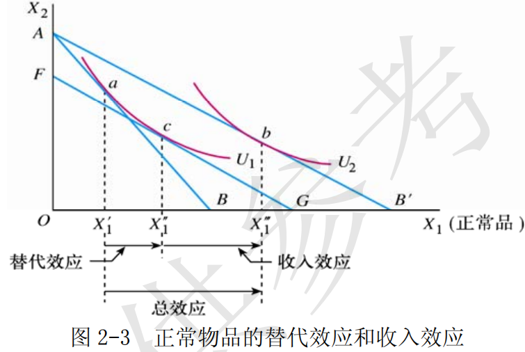
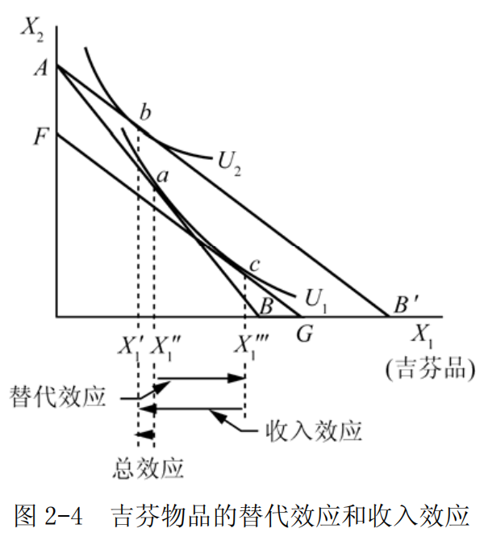

# 第 2 章 效用论

## 一、名词解释

### 1．效用

效用是指商品或劳务满足人的欲望的能力，即指消费者在消费商品或劳务时所感受到的满足程度。

效用是消费者对商品主观上的偏好和评价。一种商品对消费者是否具有效用，取决于消费者消费这种商品或劳务的欲望，以及这种商品或劳务是否具有满足这种商品或劳务是否具有满足消费者欲望的能力。因此，同一商品会因人、因时、因地之不同而有不同的效用。

### 2．边际效用递减规律

边际效用递减规律是指特定时期内，在其他商品的消费保持不变的条件下，消费者不断地增加某种商品的消费量，随着该商品消费数量的增加，消费者每增加一单位该商品的消费所获得的效用增加量逐渐减少。

$$MU=\frac{\Delta{TU}}{\Delta{Q}}$$

边际效用递减规律是基数效用论的基本假设。导致边际效用递减的原因主要是随着商品数量的增加，商品对人们的刺激降低，并且重要程度也趋于下降。

### 3．消费者均衡

消费者均衡是指在其他条件不变的情况下，消费者实现效用最大化并将保持不变的一种状态。在基数效用论中，在既定的收入约束条件下，当消费者每单位货币支出的边际效用都等于货币的边际效用时，消费者处于

均衡状态，即：

$$\begin{cases}
\frac{M U_{1}}{P_{1}}=\frac{M U_{2}}{P_{2}}=\cdots=\frac{M U_{n}}{P_{n}}=\lambda \\
p_{1} x_{1}+\cdots+p_{n} x_{n}=m
\end{cases}$$

$P_1,\cdots,P_n$ 为 $n$ 种的商品价格
$m$ 为消费者的收入
$x_1,\cdots,x_n$ 为消费者消费 $n$ 种商品的数量
$\lambda$  货币效用比
$MU$ 边际效用

在序数效用论中，消费者均衡即为无差异曲线与预算约束线的切点。

#### 4．预算约束线

预算约束线又称为预算线、消费可能线和价格线，表示在消费者的收入和商品的价格给定的条件下，消费者的全部收入所能购买到的两种商品的各种组合。假定以 $I$  表示消费者的既定收入，以 $P_1$  和 $P_2$  分别表示商品 1和商品 2 的价格，以 $X_1$ 和 $X_2$ 分别表示商品 1 和商品 2 的数量，则相应的预算式为：

$$P_{1}X_{1}+P_{2}X_{2}=I$$

该式表示：消费者的全部收入等于他购买商品 1 和商品 2 的总支出。
由该预算式作出的预算约束线为图 2-1 中的线段 AB 。

图 2-1 中，预算线的横截距 $OB$ 和纵截距 $OA$ 分别表示全部收入用来购买商品 1 和商品 2 的数量。

### 5．无差异曲线

无差异曲线是序数效用论的一种分析方法，是用来表示消费者偏好相同的两种商品的所有的数量组合。
或者说，它是表示能够给消费者带来相同的效用水平或满足程度的两种商品的所有的数量组合。无差异曲线如图

图 2-2 中，横轴和纵轴分别表示商品 1 的数量 $X_1$ 和商品 2 的数量 $X_2$  。
图 2-2 中的曲线表示商品 1 和商品 2的不同组合给消费者带来的效用水平是相同的。与无差异曲线相对应的效用函数为

$$U=f(X_1,X_2)=U_0$$

。其中，$X_1$ 、$X_2$ 分别为商品 1 和商品 2 的消费数量；$U_0$ 是常数，表示某个效用水平。
无差异曲线具有以下三个基本特征：
- 第一，由于通常假定效用函数是连续的，所以，在同一坐标平面上的任何两条无差异曲线之间，可以有无数条无差异曲线；
- 第二，在同一坐标平面图上的任何两条无差异曲线不会相交；
- 第三，无差异曲线是凸向原点的，即无差异曲线的斜率的绝对值是递减的。

### 6．商品的边际替代率

商品的边际替代率指在效用水平保持不变的前提条件下，消费者增加一单位第一种商品的消费可以代替的另外一种商品的消费数量。
边际替代率的几何意义是无差异曲线斜率的绝对值。
以 $MRS$ 代表商品的边际替代率， $\Delta{x_1}$ 和 $\Delta{x_2}$ 分别是商品 1 和商品 2 的消费变化量，则商品 1 对商品 2 的边际替代率的公式为：

$$MRS_{1,2}=-\frac{\Delta{x_2}}{\Delta{x_1}}$$

当商品数量的变化趋于无穷小时，则商品的边际替代率公式为：

$$MRS_{1,2}=\lim_{\Delta X_{1} \rightarrow 0}-\frac{\Delta x_{2}}{\Delta x_{1}}=-\frac{\mathrm{d} x_{2}}{\mathrm{dx} x_{1}}$$

### 7．替代效应

由商品的价格变动所引起的商品相对价格的变动，进而由商品的相对价格变动所引起的商品需求量的变动，称为替代效应。
即是指在消费者的实际收入（或效用水平）保持不变的前提下，由于商品价格的相对变化所引起的商品需求量的变化。

### 8．收入效应

收入效应是因商品价格变动引起消费者实际收入水平变动，进而引起消费者改变消费数量而对商品需求量产生的影响。

## 二、简述题

### 1．为什么消费者的需求曲线向右下方倾斜？试利用基数效用论加以说明。

基数效用论者以边际效用递减规律和建立在该规律上的消费者效用最大化的均衡条件为基础推导出消费者的需求曲线是向右下方倾斜的。

- （1）基数效用论者认为，商品的需求价格取决于商品的边际效用。
某一单位的某种商品的边际效用越大，则消费者为购买这一单位的该种商品所愿意支付的价格就越高；
反之，某一单位的某种商品的边际效用越小，则消费者为购买这一单位的该种商品所愿意支付的价格就越低。
由于边际效用递减规律的作用，随着消费者对某一种商品消费量的连续增加，该商品的边际效用是递减的，相应地，消费者为购买这种商品所愿意支付的价格即需求价格也是越来越低的。

（2）在基数效用论下，消费者效用最大化的均衡条件为：$\frac{MU}{p}=\lambda$  。
它表示：消费者对任何一种商品的最优购买量应该是使最后一元钱购买该商品所带来的边际效用和所付出的这一元钱的货币的边际效用相等。
该式还意味着：由于对于任何一种商品来说，随着需求量的不断增加，边际效用 $MU$ 是递减的，于是，为了保证均衡条件的实现，在货币的边际效用 $\lambda$ 不变的前提下，商品的需求价格 P 必然与 MU 同比例递减。

### 2．对正常物品而言，为什么消费者的需求曲线向右下方倾斜？请运用收入效应和替代效应加以说明。

正常物品是指消费者对其消费数量随着自身收入增加而增加的商品。正常物品的需求曲线通常向右下方倾斜。这一点可以借助于收入效应和替代效应加以说明。

（1）一种商品价格变动引起对该商品需求量变动的总效应可以分为替代效应和收入效应：
- 替代效应是由商品的价格变动引起商品相对价格变动，进而由商品的相对价格变动所引起的商品需求量的变动；
- 收入效应是由商品的价格变动引起实际收入水平变动，进而由实际收入水平变动所引起的商品需求量的变动。
- 替代效应不改变消费者的效用水平，而收入效应则表示消费者的实际效用水平发生了变化。

（2）如图 2-3 所示，横轴 $OX_1$ 和纵轴 $OX_2$ 分别表示商品 1 和商品 2 的数量，其中，商品 1 是正常商品。 ${X_{1}}^{'}$ 是价格变化前消费者对商品 1 的需求量。商品 1 的价格下降后，商品需求量增加到 ${X_1}^{'''}$  。商品 1 需求量的增加量为 ${X_{1}}^{'}{X_{1}}^{'''}$ ，这便是商品 1 的价格下降所引起的总效应。

如果作一补偿线 $FG$ ，使该线与价格变化后的预算线 $A{B}^{'}$ 平行，并与价格变化前的无差异曲线 $U_1$ 相切，则切点处 $c$  对应的对商品 1 的需求量 ${X_1}^{'''}$  就是在商品价格变化后，剔除了收入效应的消费量。因此， ${X_1}^{'}{X_{1}}^{''}$  就是商品1 价格下降后的替代效应， 就是商品 1 价格下降后的收入效应。

可以看出，对于正常物品来说，替代效应与价格呈反方向的变动。收入效应也与价格呈反方向的变动，在它们的共同作用下，总效应必定与价格呈反方向的变动。正因为如此，正常物品的需求曲线是向右下方倾斜的。

### 3．何为吉芬商品，其需求曲线形状如何？试利用收入效应和替代效应加以说明。

（1）吉芬商品指由英国统计学家罗伯特·吉芬发现，因而以他的姓氏命名的一种需求与价格之间呈反常变化的商品。
	吉芬商品的价格与需求量的变动关系违反了需求规律，即：价格越低，购买的越少；价格提高反而购买得更多。因此，吉芬商品的需求量与其价格成正比关系。

（2）如图 2-4 所示，横轴 $OX_1$ 和纵轴 $OX_2$  分别表示商品 1 和商品 2 的数量，其中，商品 1 是吉芬物品。
商品 1 的价格 $P_1$ 下降前后的消费者的效用最大化的均衡点分别为 a 点和b 点，相应的商品 1 的需求量的减少量为 ${X_1}^{'}{X_1}^{''}$ ，这就是总效应。通过补偿预算线 $FG$  可得： 
- ${X_1}^{''}{X_1}^{'''}$ 为替代效应；
- ${X_1}^{'}{X_1}^{'''}$ 是收入效应。

而且，负的收入效应 ${X_1}^{'}{X_1}^{'''}$ 的绝对值大于正的替代效应 ${X_1}^{''}{X_1}^{'''}$ 的绝对值，所以，最后形成的总效应 ${X_1}^{'}{X_1}^{''}$ 为负值。

吉芬物品是一种特殊的低档物品。
作为低档物品，吉芬物品的替代效应与价格呈反方向的变动，收入效应则与价格呈同方向的变动。
吉芬物品的特殊性就在于：它的收入效应的作用很大，以至于超过了替代效应的作用，从而使得总效应与价格呈同方向的变动。这也就是吉芬物品的需求曲线呈现出向右上方倾斜的特殊形状的原因。

---

