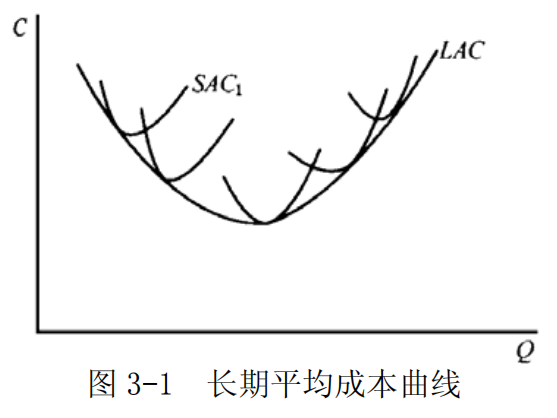
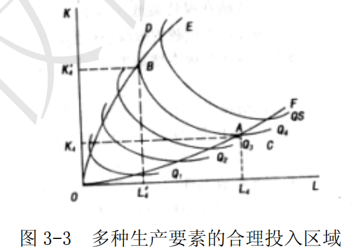

# 第 3 章 生产和成本论

## 一、名词解释

#### 1．边际产量

边际产量是指在生产技术水平和其他投入要素不变的情况下，每增加一单位可变投入要素所得到的总产量的增加量。

例如，在生产中如果只有劳动 L 是可变投入，则劳动的边际产量可以表示为：

$$MP=\frac{\Delta{Q}}{\Delta{L}}$$

假设生产函数连续且可导，从而可以用总产量对可变投入量求导得出边际产量，即 $MP=\frac{dQ}{dL}$ 。
这样，在某一产量上的边际产量，就是该产量相对于总产量曲线上一点的斜率。

### 2．边际收益递减规律

在技术水平不变的条件下，在连续等量地把某一种可变生产要素增加到其他一种或几种数量不变的生产要素上去的过程中，当这种可变生产要素的投入量小于某一特定值时，增加该要素投入所带来的边际产量是递增的；当这种可变要素的投入量连续增加并超过这个特定值时，增加该要素投入所带来的边际产量是递减的。这就是边际收益递减规律。

### 3．等产量曲线

等产量曲线是在技术水平不变的条件下，生产同一产量的两种生产要素投入量的各种不同组合的轨迹。
以 $Q$ 表示既定的产量水平，则与等产量曲线相对应的生产函数为： $$Q=f(L,K)$$
等产量曲线表示生产一定单位的产品，可以有很多劳动和资本数量组合。等产量曲线具有以下重要特点：
- ①等产量曲线是一条从左上方向右下方倾斜的曲线，具有负斜率。它表示增加一种生产要素的投入量，可以减少另一种生产要素的投入量。只有负斜率的等产量曲线，才表示劳动和资本互相代替是有效率的。
- ②坐标图上可以有无数条等产量曲线。它们按产量大小顺序排列，越接近原点的等产量曲线所代表的产量越少，越远离原点的等产量曲线所代表的产量越多。
- ③任何两条等产量曲线不能相交。
- ④等产量曲线向原点凸出。它表示随着一种生产要素每增加一个单位，可以代替的另一种生产要素的数量将逐次减少。这一点可由边际技术替代率递减规律来解释。

### 4．边际技术替代率

在维持产量水平不变的条件下，增加一单位某种生产要素投入量时所减少的另一种要素的投入数量，被称为边际技术替代率，其英文缩写为 $MRTS$ 。用 $\Delta{K}$ 和 $\Delta{L}$ 分别表示资本投入量的变化量和劳动投入量的变化量，则劳动对资本的边际技术替代率的公式为：

$$MRTS_{LK}=-\frac{\Delta{K}}{\Delta{L}}$$

或 

$$MRTS_{LK}=-\frac{dK}{dL}$$

### 5．边际技术替代率递减规律
边际技术替代率递减规律是指，在维持产量不变的前提下，当一种生产要素的投入量不断增加时，每一单位的这种生产要素所能替代的另一种生产要素的数量是递减的。
边际技术替代率递减的主要原因在于：任何一种产品的生产技术都要求各要素投入之间有适当的比例，这意味着要素之间的替代是有限的。

以劳动和资本两种要素投入为例，在劳动投入量很少而资本投入量很多的情况下，减少一些资本投入量可以很容易地通过增加劳动投入量来弥补，以维持原有的产量水平，即劳动对资本的替代是很容易的。但是，在劳动投入增加到相当多的数量和资本投入量减少到相当少的数量的情况下，再用劳动去替代资本就将是很困难的了。

### 6．等成本方程

厂商的等成本方程是指在要素价格一定的条件下，表示厂商花费相同成本可以使用的所有不同的要素组合的代数式。

如以 $r_L$  和 $r_K$ 分别表示劳动和资本的价格，以 $c$ 表示厂商的成本，厂商的等成本方程可以表示为：

$$C=r_{L}L+r_{K}K$$
厂商面对的要素价格和所花费的成本总量变动都会使得等成本方程旋转或者平移。

### 7．生产要素最优组合

生产要素最优组合是指在生产技术和要素价格不变的条件下，生产者在成本既定时实现产量最大或在产量既定时实现成本最小目标时所使用的各种生产要素的数量组合。

为此，厂商将在既定的等成本方程和等产量线上寻求最高的产量组合点。无论是既定成本下的产量最大还是既定产量下的成本最小，利润最大化的厂商都将把生产要素的数量选择在每单位成本购买的要素所能生产的边际产量相等之点。

### 8．规模经济与规模不经济

规模经济和规模不经济用来说明厂商产量变动从而规模变动与成本之间的关系。
对于一个生产厂商而言，如果产量扩大一倍，生产成本的增加低于一倍，则生产存在着规模经济；如果产量增加一倍，而成本增加大于一倍，则生产存在着规模不经济。

### 9．规模收益递增、不变和递减

作为规模经济与规模不经济的一种特殊的情况，如果产量的增加是借助于生产要素的同比例扩大实现的，
那么相应的可定义规模收益的概念：
- ①如果产量增加的比例大于生产要素增加的比例，则称生产是规模收益递增的；
- ②若产量增加的比例等于生产要素增加的比例则称生产是规模收益不变的；
- ③若产量增加的比例小于生产要素增加的比例，则称生产是规模收益递减的。

### 10．平均成本

平均成本是指厂商平均每生产一单位产品所消耗的成本。
用公式表示为： $AC=\frac{TC}{y}$ 。
- 在短期．厂商的平均成本呈现  $U$ 形。
- 在长期．规模经济的状况将决定厂商的长期平均成本曲线的形状。

### 11．边际成本

边际成本是指产量变动某一数量所引起的成本变动的数量，也即厂商在短期内增加一单位产量时所增加的总成本。
用公式表示为：

$$MC(Q)=\frac{\Delta{TC(Q)}}{\Delta{Q}}=\frac{TC(Q+\Delta{Q})-TC(Q)}{\Delta{Q}}$$

或 

$$MC(Q)=\lim_{\Delta Q \rightarrow 0} \frac{\Delta T C(Q)}{\Delta Q}=\frac{\mathrm{d} T C}{\mathrm{d} Q}$$

- 在短期内，由于边际产量递减规律的作用，厂商的边际成本呈现 U 形。
- 在长期内，规模经济的状况将决定厂商的长期边际成本形状。

### 12．长期平均成本曲线

长期平均成本曲线（ $LAC$ ）是用于描述长期平均成本与产量关系的一条曲线。
长期平均成本是长期内厂商平均每单位产量花费的总成本。
长期平均成本曲线是基于长期总成本曲线而得到的。
在生产由规模经济到规模不经济阶段，长期总成本曲线呈 U 形。
从图形关系来看，长期平均成本曲线又是所有短期平均成本曲线的包络线，如图 3-1 所示。这是因为对应于每一产量，厂商在长期内把生产要素调整到最优组合点，从而在这一产量下实现的平均成本为最小。

## 二、简述题

### 1．单一和多种生产要素的合理投入区是如何确定的？其间平均产量、边际产量各有什么特点？

生产要素的合理投入区是指追求利润最大化的生产者所选择的生产要素投入数量的范围。

大值点和边际产量等于 0 的点之间，如图 3-2 所示。

短期生产的三个阶段是根据总产量曲线、平均产量曲线和边际产量曲线之间的关系来划分的。如图 3-2 所示：
- 第Ⅰ阶段，平均产量递增阶段，即劳动平均产量始终是上升的，且达到最大值。这一阶段是从原点到 $AP_L$  、$MP_L$ 两曲线的交点，即劳动投入量由 0 到 $L_3$ 的区间。
- 第Ⅱ阶段，平均产量的递减阶段，边际产量仍然大于 0，所以总产量仍然是递增的，直到总产量达到最高点。这一阶段是从 $AP_L$  、 $MP_L$  两曲线的交点到 $MP_L$  曲线与横轴的交点，即劳动投入量由 $L_3$  到 $L_4$ 的区间。
- 第Ⅲ阶段，边际产量为负，总产量也是递减的，这一阶段是 $MP_L$ 曲线和横轴的交点以后的阶段，即劳动投入量 $L_4$  以后的区间。

- 首先，厂商肯定不会在第Ⅲ阶段进行生产，因为这个阶段的边际产量为负值，生产不会带来任何的好处。
- 其次，厂商也不会在第Ⅰ阶段进行生产，因为平均产量在增加，投入的这种生产要素还没有发挥最大的作用，厂商没有获得预期的好处，继续扩大可变投入的使用量从而使产量扩大是有利可图的，至少使平均产量达到最高点时为止。因此，厂商通常会在第Ⅱ阶段进行生产。

- （2）在长期内，所有要素的投入数量都是可变的。

假定有两种投入要素 $K$ 和 $L$ 都是可变的，那么，两种可变投入要素的合理投入区域是等产量曲线斜率为负的区域。
如图 3-3 中 $OE$  和 $OF$ 之间包含的区域。
以一条等产量曲线为例，要素 $K$ 的投入量超过 $OE$ 和要素 $L$ 的投入量超过 $OF$ ，那么在保持产量不变的前提下可以通过同时减少  $L$  和 $K$  的投入量来实现。因此理性的厂商会把投入组合限定在要素  $L$  和  $K$  的边际替代率为负的区域。

### 2．为什么边际技术替代率会是递减的？

- （1）边际技术替代率递减规律是指: 
	在维持产量不变的情况下，当一种生产要素的投入量不断增加时，每一单位的这种生产要素所能替代的另一种生产要素的数量是递减的。

- （2）边际技术替代率递减的主要原因在于：
	任何一种产品的生产技术都要求各要素投入之间有适当的比例，这意味着各要素之间的替代是有限度的，故随着一种要素投入的不断增加，它所能替代的另一种要素会不断减少。
	例如，对于劳动投入和资本投入而言，由于受到生产技术的限制，劳动投入和资本投入之间有适当的比例，在劳动投入量很少和资本投入量很多的情况下，减少一些资本投入量可以很容易地通过增加劳动来弥补，以维持原有的产量水平，即劳动对资本的替代是很容易的。但是，在劳动投入增加到相当多的数量和资本投入量减少到相当少的数量的情况下，再用劳动去替代资本就将是很困难的了。

### 3．生产要素最优组合是如何确定的，它与厂商的利润最大化有何关系？

（1）生产要素最优组合是指既定成本下产量最大化或者既定产量下成本最小化的生产要素投入组合。
在多种生产要素投入变动（比如两种）的情况下，厂商的生产技术可以由等产量曲线加以表示。而厂商的成本方程的切点。在成本既定的条件下，生产要素投入量需要满足的条件为：

$$
\begin{cases}
MRTS_{L,K}=\frac{r_L}{r_K} \\
r_{L}L + r_{K}K = c
\end{cases}
$$

或者：

$$\begin{cases}
\frac{MP_L}{r_L}=\frac{MP_K}{r_K} \\
r_{L}L + r_{K}K= c
\end{cases}$$

在产量既定的条件下，生产要素投入量需要满足的条件为：

$$\begin{cases}
MRTS_{L,K}=\frac{r_L}{r_K} \\
f(L,K) =y
\end{cases}$$

或者：

$$\begin{cases}
\frac{MP_L}{r_L}=\frac{MP_K}{r_K} \\
f(L,K)=y
\end{cases}$$

以上论述说明，无论是既定成本下的产量最大还是既定产量下的成本最小，寻求生产要素最优组合的厂商都将把生产要素的数量选择在每单位成本购买的要素所能生产的边际产量相等之点。

- （2）生产要素最优组合也是厂商利润最大化的选择。
下面以成本既定的情形为例。如果每单位成本获得的边际产量不相等，比如

$$\frac{MP_L}{r_L}>\frac{MP_K}{r_K}$$

，这时把用 $K$ 的一单位成本用于购买 $L$ 将会在保持成本不变的条件下增加总产量，从而增加利润。因此，追求技术上的最优恰好与厂商的利润最大化相一致。

### 4．试说明短期总产量曲线与短期总成本曲线之间的关系。

短期总产量曲线和短期总成本曲线之间存在下述对应关系：
- ①短期总产量曲线边际报酬递增阶段对应的是短期总成本曲线边际成本递减阶段；
- ②短期总产量曲线边际报酬递减阶段对应的是短期总成本曲线边际成本递增阶段；
- ③短期总产量曲线边际报酬极大值点相对应的是短期总成本曲线边际成本的极小值点。下面对两者的对应关系进行详细说明：

假定该短期生产函数为：

$Q=f(L,K)$  ①   

短期总成本函数为：

$TC(Q)=TVC(Q)+TFC$  ②

$TVC(Q)$  : 短期可变成本
$TFC$ : 不可变成本

短期总可变成本函数为：

$TVC(Q)=W\cdot{L}(Q)$  ③

$W$ 或者 $r_L$ ：劳动价格 

并假定生产要素价格既定。

由②式可得：

$Mc=\frac{dTC}{dQ}=\frac{dTVC}{dQ}+\frac{dTFC}{dQ}$  ④

因为 $TFC$ 为一常数，有  $\frac{dTFC}{dQ}=0$ 

所以，④式可写作：

$$MC=\frac{dTC}{dQ}=W\cdot\frac{dL}{dQ}$$
边际产量: $MP_L=\frac{dQ}{dL}$ 

所以

$MC=W\cdot\frac{1}{MP_L} 或 MC=\frac{r_L}{MP_L}$⑤

由此可知：

$MC$ 与 $MP_L$ 呈反向对应关系，由于边际报酬递减规律的作用，可变投入要素的边际产量 $MP_L$ 先上升后下降，成反 U 形，所以，边际成本 $MC$ 和总成本之间也存在着凸对应关系，当总产量曲线为凹的，总成本曲线是凸的，当总产量曲线为凸的，总成本曲线是凹的。当总产量曲线存在一个拐点时，总成本曲线相应也有一个拐点。

## 三、计算与证明

### 1．已知企业的生产函数为了： $y=5L-L^{2}$ ，其中 L 为雇佣工人的数量。求企业劳动投入的合理区域。

由题意可知，厂商唯一可变的生产要素为劳动 L ，因此厂商应选择在生产的第二阶段进行生产。由于生产函数为

$$y=5L-{L}^{2}$$

，则有：

- 平均产量为： $AP_L=y/L=5-L$
- 边际产量为： $MP_L=\frac{dy}{dL}=5-2L$

当平均产量与边际产量相交时，决定最低的劳动投入量，即有 $MP_L=AP_L$ ，代入得：

$$5-L=5-2L$$
解得： $L = 0$

当 $MP_L=0$ 时， $AP_L$ 达到最大值，生产进入第三阶段，决定了劳动投入量的最大值。即： $5-2L=0$ 
解得： $L= 2.5$  。

所以，企业劳动投入的合理区域为 $L\in [0,2.5]$ 。

### 2．厂商的生产函数为 $y=AL^{\alpha}K^{\beta}$ 

，生产要素  $L$  和 $K$  的价格分别为 $r_L$ 和 $r_K$  。

- （1）求厂商的生产要素最优组合。
- （2）如果资本的数量 $K = l$ ，求厂商的短期成本函数。
- （3）求厂商的长期成本函数。

解：
- （1）由于厂商的生产函数为 $y=AL^{\alpha}K^{\beta}$ ,有:

$$MP_L=\alpha A L^{\alpha -1} K ^ \beta$$

$$MP_K=\beta A L^{\alpha} K ^{\beta-1}$$

当有

$$MRTS_{L,K}=\frac{MP_L}{MP_K}=\frac{r_L}{r_K}$$

时，厂商生产要素组合达到最优。即：

$$\frac{\alpha A L^{\alpha -1} K ^ \beta}{\beta A L^{\alpha} K ^{\beta-1}}=\frac{r_L}{r_K}$$

整理得： $\beta r_L L = \alpha r_K K$  。即厂商的生产要素最优组合为： $\frac{K}{L}=\frac{\beta r_L}{\alpha r_K}$ 。

- （2）在短期内
	当 $K = 1$ 时, $y=AL^{\alpha}$ ，所以， $L=(y/A)^{\frac{1}{a}}$   
	代入厂商的成本函数表达式： $c=rL L +r_K K$
	可得短期成本函数为： $c=r_L (y/A)^{\frac{1}{a}}+r_K$ 
	此即为厂商短期成本函数。

- （3）长期中
	 $L$ 和 $K$ 均可变，厂商的长期成本函数由下列条件所决定：

$$\begin{cases}
y=f(L,K) \\
\frac{MP_L}{r_L}=\frac{MP_K}{r_K} \\
c=r_L L + r_K K
\end{cases}$$

带入化简:

$$\begin{cases}
y=A L^{\alpha} K ^ {\beta} \\
c=r_L L + r_K K \\
\beta r_L L = \alpha r_K K
\end{cases}$$

推导过程:

$$L=\frac{\alpha r_K K}{\beta r_L}$$

$${r_L L}=\frac{\alpha r_K K}{\beta}$$

$$y=A {\frac{\alpha r_K K}{\beta r_L} }^{\alpha} K ^ {\beta}$$
$${\frac{y}{A}}={\frac{\alpha r_K K}{\beta r_L} }^{\alpha} K ^ {\beta}$$

$${\frac{y}{A}}={\frac{\alpha r_K K}{\beta r_L} }^{\alpha} K ^ {\beta}$$

$${\frac{y}{A}}={\frac{\alpha r_K}{\beta r_L} }^{\alpha} K ^ {\alpha+\beta}$$

$$K= {\frac{y}{A}}^{\frac{1}{\alpha +\beta}}\cdot {\frac{\beta r_L}{\alpha r_K}}^{\frac{\alpha}{\alpha + \beta}}$$

$$c=\frac{\alpha r_K K}{\beta} + r_K K$$

$$c=(\frac{\alpha r_K}{\beta}\cdot{\frac{\beta r_L}{\alpha r_K}}^{\frac{\alpha}{\alpha+\beta}} + r_K (\frac{\beta r_L}{\alpha r_K})^{\frac{\alpha}{\alpha + \beta}})(\frac{y}{A})^{\frac{1}{\alpha+\beta}}$$

$$c=(\frac{\alpha r_K}{\beta}\cdot{\frac{\beta r_L}{\alpha r_K}}\cdot{\frac{\beta r_L}{\alpha r_K}}^{\frac{-\beta}{\alpha+\beta}} + r_K (\frac{\beta r_L}{\alpha r_K})^{\frac{\alpha}{\alpha + \beta}})(\frac{y}{A})^{\frac{1}{\alpha+\beta}}$$

$$c=({r_L}\cdot({\frac{\alpha r_K}{\beta r_L}})^{\frac{\beta}{\alpha+\beta}} + r_K (\frac{\beta r_L}{\alpha r_K})^{\frac{\alpha}{\alpha + \beta}})(\frac{y}{A})^{\frac{1}{\alpha+\beta}}$$

解得：

$$c=\left[r_{L}\left(\frac{\alpha r_{K}}{\beta r_{L}}\right)^{\frac{\beta}{\alpha+\beta}}+r_{K}\left(\frac{\beta r_{L}}{\alpha r_{K}}\right)^{\frac{\alpha}{\alpha+\beta}}\right]\left(\frac{y}{A}\right)^{\frac{1}{\alpha+\beta}}$$

，此即为厂商的长期成本函数。

### 3．证明：追求利润最大化的厂商必然会在生产扩展曲线上选择投入组合。

证明：

假设厂商仅用劳动 $L$ 和资本 $K$ 两种要素，那么 
总产出:

$$Q=f(L,K)$$
边际产量:

$$MP_L=\frac{dQ}{dL}$$

$$MP_K=\frac{dQ}{dK}$$

总成本:
$$TC=r_L L + r_K K$$

厂商的利润:
$$\pi=TR-TC=PQ-TC$$
为了追求利润最大化，归结为:
1. 既定成本下产量最大化
2. 既定产量下成本最小化

将其对生产要素 $L$  和 $K$  分别求一阶导数并令其为零以寻求利润最大化的条件，

$$P\cdot{MP_L}-r_L=0$$

$$P=\frac{r_L}{MP_L}$$

$$P\cdot{MP_K}-r_K=0$$
$$P=\frac{r_K}{MP_K}$$

$$\frac{r_L}{MP_L}=\frac{r_K}{MP_K}$$

可得 $\frac{MP_L}{MP_K}=\frac{r_L}{r_K}$ ，此即厂商追求利润最大化的投入组合。

又因生产扩展线为一系列等成本线与等产量线的切点的连线，等产量线上任意一点切线的斜率为边际技术替代率 $RTS_{L,K}=\frac{MP_L}{MP_K}$ ，而等成本线为 $c=r_L L + r_K K$ ，其斜率为 $\frac{r_L}{r_K}$ ，因此可得生产扩展线的方程为 $\frac{MP_L}{MP_K}=\frac{r_L}{r_K}$ ，与厂商追求利润最大化的投入组合相同。故追求利润最大化的厂商必然会在生产扩展曲线上选择投入组合。

---

