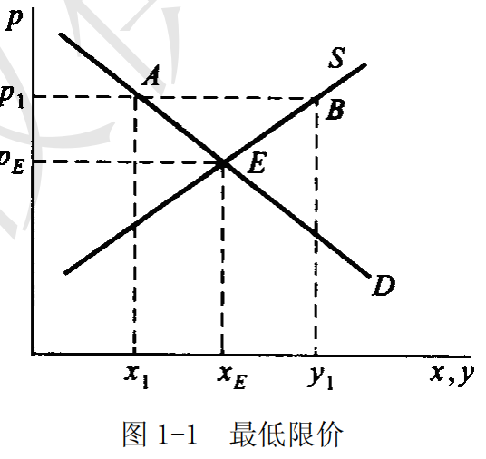
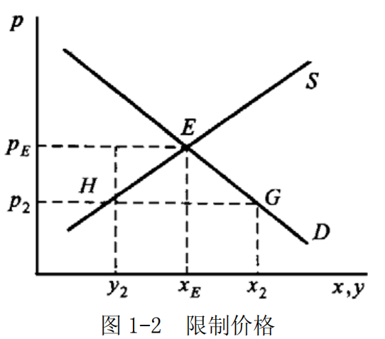
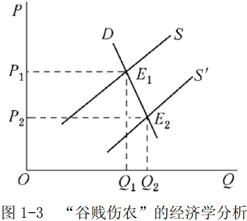
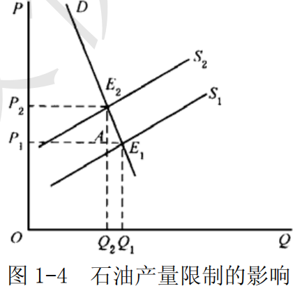

# 第 1 章 需求与供给

> **本章核心问题**：市场价格如何由供求双方共同决定？为什么需求曲线向右下方倾斜而供给曲线向右上方倾斜？弹性如何影响价格变动对买卖双方的影响？

## 摘要

### 第一节 需求曲线

#### 一、需求的概念

- **需求的定义**

消费者对一种商品的需求，是指在一个特定时期内消费者在各种可能的价格下愿意而且能购买的该商品的数量。

- **需求的两个特征**
1. 具备意愿
2. 购买能力

- 需求的表达方式
1. 需求表
2. 需求曲线
3. 需求函数

#### 二、需求规律和需求曲线

1. 需求规律的表达与需求曲线的形状

#### 三、需求的变动

#### 四、市场需求曲线

## 一、名词解释

### 1．需求

消费者对一种商品的需求，是指在一个特定时期内消费者在各种可能的价格下愿意而且能够购买的该商品的数量。

需求既强调消费者的购买欲望又要求消费者具备购买能力。由于需求规律的作用，消费者对商品的需求量与其价格呈反方向变动。

### 2．需求规律

需求规律也称为需求定理、需求法则或需求原则，指消费者的需求量与商品价格之间呈反方向变化的规律。

具体而言，在其他条件不变的情况下，一般而论，随着商品价格的升高，消费者愿意并且能够购买的商品数量减少；
相反，随着商品价格的降低，消费者愿意并且能够购买的商品数量增加。
需求规律成立，意味着消费者的需求曲线向右下方倾斜，因而需求曲线向右下方倾斜是需求规律的直观表现。

### 3．供给

供给是指在其他条件不变的情况下，在一定时期内生产者在各种可能的价格下愿意而且能够提供的该商品的数量。

生产者对某种商品的供给必须具备意愿和能力两个特征。如果生产者对某种商品只有提供出售的愿望，而没有提供出售的能力，则不能形成有效供给，也不能算作供给。
一种商品的供给数量取决于多种因素的影响，其中主要的因素有：
- 该商品的价格
- 生产的成本
- 生产的技术水平
- 相关商品的价格
- 生产者对未来的预期

### 4．供给规律

供给规律也称为供给定理、供给法则或供给原则，是指生产者的供给量与商品价格之间呈同方向变化的规律。

具体而言，在其他条件不变的情况下，一般而论，随着商品价格的升高，生产者愿意并且能够提供的商品数量增加；相反，随着商品价格的降低，生产者愿意并且能够提供的商品数量减少。
如果供给规律成立，那么生产者的供给曲线向右上方倾斜。

### 5．均衡价格

均衡价格是指商品的市场需求量与市场供给量相等时的价格。

在市场上，由于供给和需求力量的相互作用，市场价格趋向于均衡价格。如果市场价格高于均衡价格，那么，供给数量大于需求数量，一部分生产者就会因商品卖不出去而被迫降价，从而市场价格下降；
反之，如果市场价格低于均衡价格，那么需求数量大于供给数量，一部分消费者因购买不到所需求的商品而愿意出高价，结果市场价格提高。因此，市场竞争的结果是市场稳定于均衡价格。

### 6．比较静态分析

比较静态分析是比较分析不同静态均衡状态的方法。

当一个经济模型的外生变量发生变化时将对内生变量均衡数值产生影响。比较静态分析考察这种影响的程度和方向。比较静态分析与静态分析一样抽象掉了时间。
与动态分析不同，比较静态分析忽略内生变量的变动过程，而只考察当原有的条件发生变化时，新的均衡与原有均衡之间的差异。

### 7．需求的价格弹性

需求的价格弹性反映了相应于价格的变动，需求量变动的敏感程度，用弹性系数加以衡量，被定义为需求量变动的百分比除以价格变动的百分比。

#### （一）基本公式与推导过程

**1. 一般定义公式**

设需求函数为 $Q = f(P)$，其中 $Q$ 为需求量，$P$ 为价格。

需求价格弹性系数 $E_d$ 定义为需求量变动率与价格变动率之比：

$$E_d = \frac{\text{需求量变动的百分比}}{\text{价格变动的百分比}} = \frac{\Delta Q/Q}{\Delta P/P} = \frac{\Delta Q}{\Delta P} \cdot \frac{P}{Q}$$

**2. 推导过程**

**第一步：从定义出发**

弹性概念源于对两个变量相对变动关系的度量。设价格从 $P_1$ 变动到 $P_2$，需求量从 $Q_1$ 变动到 $Q_2$。

- 价格的绝对变动：$\Delta P = P_2 - P_1$
- 需求量的绝对变动：$\Delta Q = Q_2 - Q_1$

但绝对变动无法直接比较（因为单位不同），需要转化为相对变动（百分比）：

- 价格变动的百分比：$\frac{\Delta P}{P} = \frac{P_2 - P_1}{P_1}$
- 需求量变动的百分比：$\frac{\Delta Q}{Q} = \frac{Q_2 - Q_1}{Q_1}$

**第二步：弹性系数的定义**

弹性系数 $E_d$ 是需求量变动百分比与价格变动百分比之比：

$$E_d = \frac{\Delta Q/Q}{\Delta P/P} = \frac{\Delta Q}{\Delta P} \cdot \frac{P}{Q}$$

**第三步：符号处理**

由于需求规律，$\frac{dQ}{dP} < 0$（价格上升，需求下降）。为便于比较，通常在公式前加负号：

$$E_d = -\frac{dQ}{dP} \cdot \frac{P}{Q}$$

这样 $E_d$ 为正值，便于分类讨论。

**3. 点弹性公式**

当价格变动趋于无穷小时，使用点弹性：

$$E_d = \lim_{\Delta P \to 0} -\frac{\Delta Q/\Delta P}{P/Q} = -\frac{dQ}{dP} \cdot \frac{P}{Q}$$

**4. 弧弹性公式**

当价格变动较大时，为避免因起点不同产生差异，使用弧弹性（中点公式）：

$$E_d = -\frac{\Delta Q}{\Delta P} \cdot \frac{(P_1 + P_2)/2}{(Q_1 + Q_2)/2} = -\frac{\Delta Q}{\Delta P} \cdot \frac{P_1 + P_2}{Q_1 + Q_2}$$

#### （二）弹性分类与性质

| 弹性值 | 类型 | 含义 | 图形特征 |
|--------|------|------|----------|
| $E_d > 1$ | 富有弹性 | 需求量变动率大于价格变动率 | 需求曲线较平缓 |
| $E_d = 1$ | 单位弹性 | 需求量变动率等于价格变动率 | 双曲线型 |
| $E_d < 1$ | 缺乏弹性 | 需求量变动率小于价格变动率 | 需求曲线较陡峭 |
| $E_d = 0$ | 完全无弹性 | 价格变动不影响需求量 | 垂直线 |
| $E_d \to \infty$ | 完全弹性 | 价格微小变动导致需求量无限变动 | 水平线 |

**弹性类型图示：**

**(1) 完全弹性 $E_d \to \infin$**

<svg width="400" height="250" viewBox="0 0 400 250" style="border: 1px solid #ddd; background: #f9f9f9; display: block; margin: 10px auto;">
  <line x1="50" y1="200" x2="380" y2="200" stroke="#333" stroke-width="2"/>
  <line x1="50" y1="200" x2="50" y2="30" stroke="#333" stroke-width="2"/>
  <text x="35" y="25" font-size="16">P</text>
  <text x="385" y="205" font-size="16">Q</text>
  <line x1="50" y1="80" x2="350" y2="80" stroke="#e74c3c" stroke-width="3"/>
  <line x1="350" y1="80" x2="350" y2="200" stroke="#666" stroke-width="1" stroke-dasharray="5,5"/>
  <text x="355" y="85" font-size="14">D</text>
  <text x="340" y="220" font-size="14">Q₀</text>
  <text x="15" y="85" font-size="14">P₀</text>
  <text x="200" y="240" font-size="14" font-weight="bold" fill="#2c3e50" text-anchor="middle">完全弹性：水平需求曲线</text>
</svg>

**(2) 完全无弹性 $E_d = 0$**

<svg width="400" height="250" viewBox="0 0 400 250" style="border: 1px solid #ddd; background: #f9f9f9; display: block; margin: 10px auto;">
  <line x1="50" y1="200" x2="380" y2="200" stroke="#333" stroke-width="2"/>
  <line x1="50" y1="200" x2="50" y2="30" stroke="#333" stroke-width="2"/>
  <text x="35" y="25" font-size="16">P</text>
  <text x="385" y="205" font-size="16">Q</text>
  <line x1="200" y1="40" x2="200" y2="200" stroke="#e74c3c" stroke-width="3"/>
  <line x1="200" y1="200" x2="50" y2="200" stroke="#666" stroke-width="1" stroke-dasharray="5,5"/>
  <text x="205" y="50" font-size="14">D</text>
  <text x="185" y="220" font-size="14">Q₀</text>
  <text x="15" y="45" font-size="14">P</text>
  <text x="200" y="240" font-size="14" font-weight="bold" fill="#2c3e50" text-anchor="middle">完全无弹性：垂直需求曲线</text>
</svg>

**(3) 富有弹性 $E_d > 1$（曲线平缓）**

<svg width="400" height="250" viewBox="0 0 400 250" style="border: 1px solid #ddd; background: #f9f9f9; display: block; margin: 10px auto;">
  <line x1="50" y1="200" x2="380" y2="200" stroke="#333" stroke-width="2"/>
  <line x1="50" y1="200" x2="50" y2="30" stroke="#333" stroke-width="2"/>
  <text x="35" y="25" font-size="16">P</text>
  <text x="385" y="205" font-size="16">Q</text>
  <line x1="60" y1="50" x2="350" y2="150" stroke="#e74c3c" stroke-width="3"/>
  <text x="60" y="40" font-size="14">D</text>
  <line x1="50" y1="80" x2="50" y2="120" stroke="#27ae60" stroke-width="2"/>
  <line x1="100" y1="200" x2="280" y2="200" stroke="#27ae60" stroke-width="2"/>
  <text x="15" y="105" font-size="12" fill="#27ae60">ΔP小</text>
  <text x="170" y="195" font-size="12" fill="#27ae60">ΔQ大</text>
  <text x="200" y="240" font-size="14" font-weight="bold" fill="#2c3e50" text-anchor="middle">富有弹性：曲线较平缓</text>
</svg>

**(4) 缺乏弹性 $E_d < 1$（曲线陡峭）**

<svg width="400" height="250" viewBox="0 0 400 250" style="border: 1px solid #ddd; background: #f9f9f9; display: block; margin: 10px auto;">
  <line x1="50" y1="200" x2="380" y2="200" stroke="#333" stroke-width="2"/>
  <line x1="50" y1="200" x2="50" y2="30" stroke="#333" stroke-width="2"/>
  <text x="35" y="25" font-size="16">P</text>
  <text x="385" y="205" font-size="16">Q</text>
  <line x1="100" y1="40" x2="180" y2="190" stroke="#e74c3c" stroke-width="3"/>
  <text x="95" y="35" font-size="14">D</text>
  <line x1="50" y1="60" x2="50" y2="160" stroke="#27ae60" stroke-width="2"/>
  <line x1="110" y1="200" x2="160" y2="200" stroke="#27ae60" stroke-width="2"/>
  <text x="15" y="115" font-size="12" fill="#27ae60">ΔP大</text>
  <text x="125" y="195" font-size="12" fill="#27ae60">ΔQ小</text>
  <text x="200" y="240" font-size="14" font-weight="bold" fill="#2c3e50" text-anchor="middle">缺乏弹性：曲线较陡峭</text>
</svg>

**(5) 单位弹性 $E_d = 1$（等轴双曲线）**

<svg width="400" height="250" viewBox="0 0 400 250" style="border: 1px solid #ddd; background: #f9f9f9; display: block; margin: 10px auto;">
  <line x1="50" y1="200" x2="380" y2="200" stroke="#333" stroke-width="2"/>
  <line x1="50" y1="200" x2="50" y2="30" stroke="#333" stroke-width="2"/>
  <text x="35" y="25" font-size="16">P</text>
  <text x="385" y="205" font-size="16">Q</text>
  <path d="M 70 180 Q 130 120, 180 90 Q 260 50, 350 40" fill="none" stroke="#e74c3c" stroke-width="3"/>
  <text x="65" y="195" font-size="14">D</text>
  <rect x="80" y="50" width="150" height="130" fill="rgba(52, 152, 219, 0.1)" stroke="#3498db" stroke-width="1" stroke-dasharray="3,3"/>
  <text x="140" y="120" font-size="12" fill="#3498db">P×Q=常数</text>
  <text x="200" y="240" font-size="14" font-weight="bold" fill="#2c3e50" text-anchor="middle">单位弹性：等轴双曲线</text>
</svg>

**图解说明：**

| 类型 | 曲线形态 | 经济含义 | 典型例子 |
|------|----------|----------|----------|
| 完全弹性 | 水平线 | 价格稍有变动，需求量无限变动 | 完全竞争市场中的单个厂商 |
| 完全无弹性 | 垂直线 | 无论价格如何变动，需求量不变 | 急救药品、棺材 |
| 富有弹性 | 曲线平缓 | ΔQ% > ΔP%，对价格敏感 | 奢侈品、替代品多的商品 |
| 缺乏弹性 | 曲线陡峭 | ΔQ% < ΔP%，对价格不敏感 | 必需品、食盐 |
| 单位弹性 | 等轴双曲线 | ΔQ% = ΔP%，P×Q = 常数 | 理论情况 |

#### （三）弹性与总收益的关系

**总收益（Total Revenue，TR）**：指厂商出售一定数量产品所获得的全部收入，等于价格乘以销售量。

| 符号 | 英文 | 含义 |
|------|------|------|
| TR | Total Revenue | 总收益 |
| P | Price | 价格 |
| Q | Quantity | 需求量/销售量 |

设总收益 $TR = P \cdot Q$，对 $P$ 求导：

$$\frac{d(TR)}{dP} = \frac{d(P \cdot Q)}{dP} = Q + P \cdot \frac{dQ}{dP} = Q\left(1 + \frac{dQ}{dP} \cdot \frac{P}{Q}\right) = Q(1 - E_d)$$

- **当 $E_d > 1$ 时**：$1 - E_d < 0$，$\frac{d(TR)}{dP} < 0$，降价可增加总收益
- **当 $E_d < 1$ 时**：$1 - E_d > 0$，$\frac{d(TR)}{dP} > 0$，提价可增加总收益
- **当 $E_d = 1$ 时**：$\frac{d(TR)}{dP} = 0$，总收益达到最大

### 8．需求的收入弹性

需求的收入弹性是指相应于消费者收入的变动，需求量变动的敏感程度，其弹性系数定义为需求量变动的百分比除以收入变动的百分比。

#### （一）公式

设需求函数为 $Q = f(I)$，其中 $Q$ 为需求量，$I$ 为消费者收入。

**一般定义公式：**

$$E_m = \frac{\text{需求量变动的百分比}}{\text{收入变动的百分比}} = \frac{\Delta Q/Q}{\Delta I/I} = \frac{\Delta Q}{\Delta I} \cdot \frac{I}{Q}$$

**点弹性公式：**

$$E_m = \frac{dQ}{dI} \cdot \frac{I}{Q}$$

**弧弹性公式：**

$$E_m = \frac{\Delta Q}{\Delta I} \cdot \frac{I_1 + I_2}{Q_1 + Q_2}$$

#### （二）收入弹性与商品分类

根据收入弹性的符号和大小，可将商品分为以下几类：

| $E_m$ 的值 | 商品类型 | 含义 | 例子 |
|-----------|----------|------|------|
| $E_m > 0$ | 正常品 | 收入增加，需求增加 | 大部分商品 |
| $E_m > 1$ | 奢侈品 | 需求增加率大于收入增加率 | 名牌包、珠宝 |
| $0 < E_m < 1$ | 必需品 | 需求增加率小于收入增加率 | 粮食、基本日用品 |
| $E_m < 0$ | 劣等品/低档品 | 收入增加，需求反而减少 | 二手衣物、方便面 |

#### （三）恩格尔定律

恩格尔定律：随着收入水平的提高，食物支出在总支出中所占的比重逐渐下降。

用收入弹性表示：食物的收入弹性 $E_m < 1$，即食物需求增长慢于收入增长。

### 9．需求的交叉弹性

需求的交叉弹性是指在某特定时间内，某种商品或劳务需求量变动的百分比与另一种相关商品或劳务的价格变动百分比之比。

它被用来测度某种商品或劳务需求量的相对变动对于另一种商品或劳务的价格的相对变动反应的敏感程度。相关商品价格是决定商品需求量的一个重要因素，相关商品价格的变化会引起商品需求量的变化。

需求的交叉价格弧弹性计算公式为：

$$E_{XY}=\frac{\Delta{Q_{X}/Q_{X}}}{\Delta{P_{Y}}/P_{Y}}=\frac{\Delta{Q_X}}{\Delta{P_Y}}\cdot\frac{P_Y}{Q_X}$$

需求的交叉价格点弹性计算公式为： 

$$E_{XY}=\frac{dQ_{X}}{dP_{Y}}\cdot\frac{P_{Y}}{Q_{X}}$$

需求的交叉价格弹性系数的符号取决于所考察的两种商品的相关关系。
交叉弹性系数的性质如下：
- ①当 $E_{XY}>0$ 时，X 与Y 两种产品间有替代关系。
- ②当 $E_{XY}<0$  时，X 与Y 两种产品间有互补关系。
- ③当 $E_{XY}=0$ 时，X与Y 两种产品间无关系。

### 10．供给的价格弹性

供给的价格弹性是指，在一定时期内，一种商品的供给量的变动对于该商品的价格的变动的反应程度。

它是商品的供给量变动率与价格变动率之比。供给的价格弹性可分为弧弹性和点弹性。供给的价格弧弹性表示某商品供给曲线上两点之间的弹性。供给的价格点弹性表示某商品供给曲线上某一点的弹性。

### 11．支持价格

支持价格又称为最低限价，是指政府为了扶植某一行业的生产而规定的该行业产品的最低价格。支持价格总是高于市场决定的均衡价格。

如图 1-1 所示，假设，政府为了扶植该行业的发展，规定了该行业产品最低价格为 $p_1$ 。在  $p_1$ 水平上，供给量大于需求量，其差额为 $(y_1 - x_1)$ 。由于供大于求，按市场供求规律的自发作用，价格存在下降的趋势。因此，为了使价格不下跌，政府在规定最低价格的同时，必须对过剩供给的部分实行收购。

### 12．限制价格

答：限制价格是指政府为了防止某些生活必需品的价格上涨而规定的这些产品的最高价格。限制价格是政府管制物价的措施之一，总是低于市场均衡价格。

如图 1-2 所示，市场均衡价格为 $P_E$ ，政府实施限制价格为 $P_2$  ，在限制价格下将导致经济中存在 $HG$  的超额需求。
限制价格往往在战争或自然灾害时期加以使用，有些国家对某些生活必需品也长期采取限制价格政策。
限制价格有利于社会稳定，但有许多弊端。
由于商品短缺，政府为了维持这种限制价格，往往采取配给制，限定消费者购买的数量，这时市场上往往会出现抢购、黑市交易、投机现象；而且它不利于刺激生产，造成长期亏损；造成价格扭曲，产生浪费现象。

## 二、简述题

### 1．分析并说明引起需求变动的因素是什么。

需求表示在其他条件不变的情况下，消费者在一定时期内，对应于各种可能的价格，愿意而且能够购买的商品的数量。上述定义假定除了商品的价格以外，影响需求量的其他因素不发生变动。
如果价格之外的任何因素发生变动，消费者的需求就会发生变动。这些因素主要包括以下几个方面：

- （1）消费者的收入水平。
消费者的收入水平提高时，会增加对正常品的需求量，减少对劣等品的需求量。
相反，消费者收入水平下降时，会减少对正常品的需求量，增加对劣等品的需求量。

- （2）相关商品的价格。
如果两种商品之间是替代品，另外一种商品价格上升将导致原商品需求量增加；
如果两种商品具有互补关系，则另外一种商品价格上升导致原商品需求量减少。

- （3）消费者的偏好。
当消费者对某种商品的偏好程度增强时，该商品的需求量就会增加。
相反，偏好程度减弱，需求量就会减少。

- （4）消费者对商品的价格预期。
当消费者预期某种商品的价格在将来某一时期会上升时，就会增加对该商品的现期需求量；
当消费者预期某商品的价格在将来某一时期会下降时，就会减少对该商品的现期需求量。

### 2．引起供给变动的因素是什么？它们是如何影响供给的？

供给表示在其他条件不变的情况下，生产者在一定时期内，对应于各种可能的价格，愿意而且能够提供出售的商品的数量。
上述定义是在其他条件不变的情况下得到的。供给量不仅受到价格的影响，也受到其他因素的影响。除了商品的价格以外，影响供给量的其他因素之一发生变动，生产者的供给就会发生变动。这些因素主要包括：

- （1）生产的成本。
在商品自身价格不变的条件下，生产成本上升会减少利润，从而使商品的供给量减少。相反，生产成本下降会增加利润，从而使商品的供给量增加。

- （2）生产的技术水平。
在一般的情况下，生产技术水平的提高可以降低生产成本，增加生产者的利润，生产者会提供更多的产量。

- （3）相关商品的价格。
如果一个厂商生产两种在原料上具有竞争性的商品，那么相关商品价格提高导致一种商品供给量减少；相反，如果另一种商品是一种联合的副产品，相关商品价格提高将导致一种商品的供给量增加。

- （4）生产者对未来的预期。
如果生产者对未来的预期看好，如预期商品的价格会上涨，生产者在制定生产计划时就会增加产量供给。如果生产者对未来的预期是悲观的，如预期商品的价格会下降，生产者在制定生产计划时就会减少产量供给。

### 3．运用供求分析说明：

- （1）“谷贱伤农”的道理何在？
- （2）为什么 20 世纪 70 年代石油输出国组织要限制石油产量？

“谷贱伤农”指风调雨顺时，农民收获的粮食数量增加，但是卖粮收入反而减少的现象。

该现象的经济学逻辑是：在其他因素不变的条件下，粮食丰收使得粮食价格下降，并且粮食价格下降的程度大于粮食产量增加的程度。

造成“谷贱伤农”这种经济现象的根本原因在于：农产品的需求价格弹性往往是小于 1 的，即当农产品的价格发生变化时，农产品的需求往往是缺乏弹性的。其分析如图 1-3 所示。

图 1-3 中，农产品的需求曲线 D 是缺乏弹性的。农产品的丰收使供给曲线由 $S$ 的位置向右平移至 $S^{'}$ 的位置，在缺乏弹性的需求曲线的作用下，农产品的均衡价格大幅度地由 $P_1$ 下降为 $P_2$  。由于农产品均衡价格的下降幅度大于农产品的均衡数量的增加幅度，最后致使农民总收入量减少。总收入的减少量相当于图中矩形 $OP_{1}E_{1}Q_{1}$ 和 $OP_{2}E_{2}Q_{2}$ 的面积之差。

（2）同样的道理，由于石油为各国的重要能源，其需求价格弹性较小。
在石油的需求没有变化的情况下，石油输出国组织限制石油的供给，会使得石油的价格将上涨。由于各国对石油的需求缺乏弹性，因而石油价格上涨将使得石油输出国组织的总收益增加、若不限制石油供给，供给增加将导致石油价格下降，而供给量的增加不能弥补价格下降对收益所造成的损失，故而他们要限制石油产量。

石油输出国组织限制石油产量，是因为在石油的需求没有变化的情况下，石油的价格将上涨。如图 1-4 所示。
限制石油产量的政策使供给曲线由 $S_1$ 向左平移至 $S_2$ ，均衡点由 $E_1$ 移动到 $E_2$ ，价格从 $P_1$ 上升为 $P_2$ 。价格上升后，需求量由 $Q_1$ 减少为 $Q_2$ ，但 $Q_{2}AE_{1}Q_{1}$ 小于 $P_{1}AE_{2}P_{2}$ ，即总收益增加。

## 三、计算与证明

### 若某厂商面对的市场需求曲线为Q=20-3P，求价格 P=2 时需求的点弹性值。该厂商如何调整价格才能使得总收益增加？

- （1）点弹性表示的是需求曲线上某一点的弹性，其计算公式为：

$$E_d=-\frac{dQ}{dP}\cdot\frac{P}{Q}$$

当价格 $P = 2$ 时，市场需求为： $Q=20-3\times2=14$ ，而 $\frac{dQ}{dP}=-3$ 。

因此，当价格  $P = 2$  时需求的点弹性值为：

$$E_d=-(-3)\times{2/14}=\frac{3}{7}$$

- （2）由（1）可知，

$$E_d=\frac{3}{7}<1$$

，即该厂商生产的产品的需求相当缺乏弹性。因此，根据需求理论，厂商应该提价以使其收入增加。因为对需求缺乏弹性的商品来说，其销售总收入与价格成正方向变动，即它随价格的提高而增加，随价格的降低而减少。所以，为了提高厂商的收入，对需求缺乏弹性的商品提价可以使得总收益增加。

---
## 历年真题

### 2020年
**[计算题]** 已知某商品的需求价格弹性系数为 0.5，当价格为 10 元时，需求量为 1000 单位。请分析该厂商应提价还是降价以增加总收入，并说明理由。
**答案：** 需求价格弹性 Ed=0.5<1，缺乏弹性。对缺乏弹性的商品，总收入与价格同方向变动，因此厂商应提价以增加总收入。

### 2025年
**[计算题]** 某商品的需求函数 Qd=500-50p，供给函数 Qs=-100+50p。求：(1) 均衡价格和均衡数量；(2) p=2 时价格的点弹性。
**答案：** (1) 令 Qd=Qs，500-50p=-100+50p，解得 P=6，Q=200。(2) p=2 时 Qd=400，点弹性 Ed=(-50)×(2/400)=-0.25，缺乏弹性。
