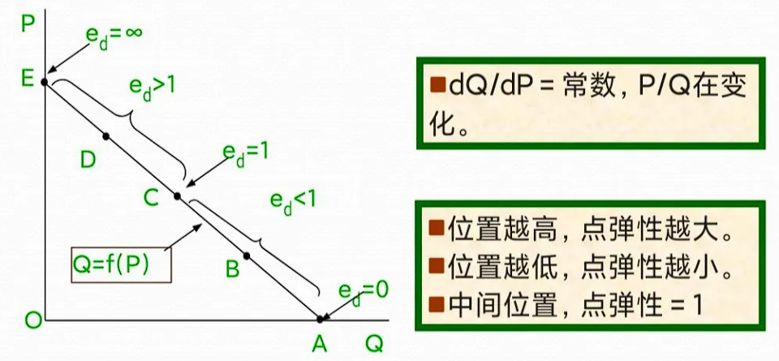

## 计算公式

### 需求函数

$$
Q^d = f(p)
$$
demand：需求
$Q^d$ 为商品的需求数量 
$P$ 为商品的价格

需求函数的通常形式:

$$
Q^d = \alpha - \beta \cdot P
$$

其中: 
$\alpha$ 、$\beta$ 为常数 且 $\alpha$ 、$\beta$ > 0 。

### 供给函数

$$
Q^s = f(p)
$$

supply： 供给
$P$ 为商品的价格
$Q^s$ 为商品的供给数量

供给函数的一般形式：

$$
Q^s = - \delta + \gamma \cdot P 
$$

 $\delta$ 、 $\gamma$ 为常数，且 $\delta$ 、 $\gamma$ > 0 。
 
### 均衡价格

$$
Q^s = Q^d
$$

$$
\left\{\begin{matrix}
Q^d = \alpha - \beta \cdot P
 \\
Q^s = - \delta + \gamma \cdot P 
\end{matrix}\right.
$$

### 弹性

$$
弹性系数 = \frac{因变量的变动比例}{自变量的变动比例}
$$

#### 需求的价格弹性:

$$
e_d = - \frac{\frac{\Delta Q}{Q}}{\frac{\Delta P}{P}} =  - \frac{\Delta Q}{\Delta P}\cdot \frac{P}{Q}
$$

#### 需求的价格点弹性:

$$
e_d = \lim_{\Delta P \to 0} - \frac{\Delta Q}{\Delta P}\cdot \frac{P}{Q} = -\frac{dQ}{dP}\cdot\frac{P}{Q}
$$

####  供给的价格弹性

$$
e_s = \frac{\frac{\Delta Q}{Q}}{\frac{\Delta P}{P}} = \frac{\Delta Q}{\Delta P}\cdot \frac{P}{Q}
$$

#### 供给的价格的点弹性

$$
e_s = \lim_{\Delta P \to 0}\frac{\Delta Q}{\Delta P}\cdot \frac{P}{Q} = \frac{dQ}{dP} \cdot \frac{P}{Q}
$$

#### 供给的价格孤弹性中点公式

$$
e_s = \frac{\Delta Q}{\Delta P} \cdot \frac{\frac{P_1 + P_2}{2}}{\frac{Q_1 + Q_2}{2}}
$$

#### 需求的交叉价格弹性

需求的交叉价格弹性表示在一定时期内一种商品的需求量变动对于它的相关商品的价格变动的反应程度。或者说，它表示在一定时期内一种商品的价格变化百分之一时所引起的另一种商品的需求量变化的百分比。

$$
e_{XY} = \frac{\frac{\Delta Q_X}{Q_X}}{\frac{\Delta P_Y}{P_Y}} = \frac{\Delta Q_X}{\Delta P_Y} \cdot \frac{P_Y}{Q_X}
$$

$$
e_{X Y}=\lim _{\Delta P_{Y} \rightarrow 0} \frac{\Delta Q_{X}}{\Delta P_{Y}} \cdot \frac{P_{Y}}{Q_{X}}=\frac{\mathrm{d} Q_{X}}{\mathrm{~d} P_{Y}} \cdot \frac{P_{Y}}{Q_{X}}
$$
#### 需求的收入弹性

$$
e_{M}=\frac{\frac{\Delta Q}{Q}}{\frac{\Delta M}{M}}=\frac{\Delta Q}{\Delta M} \cdot \frac{M}{Q}
$$

means: 收入

$$
e_{M}=\lim _{\Delta M \rightarrow 0} \frac{\Delta Q}{\Delta M} \cdot \frac{M}{Q}=\frac{\mathrm{d} Q}{\mathrm{~d} M} \cdot \frac{M}{Q}
$$

### 效用

#### 总效用

total utility

$$
TU = f(Q)
$$

#### 边际效应函数

$$
MU = \frac{\Delta TU(Q)}{\Delta Q}
$$

$$
M U=\lim _{\Delta Q \rightarrow 0} \frac{\Delta T U(Q)}{\Delta Q}=\frac{\mathrm{d} T U(Q)}{\mathrm{d} Q}
$$

#### 边际量

$$
边际量 = \frac{因变量的变化量}{自变量的变化量}
$$

#### 消费者效用最大化均衡

$$
\left\{\begin{matrix}
P_1 X_1 + P_2 X_2 = I
 \\
\frac{MU_1}{P_1} = \frac{MU_2}{P_2} = \lambda 
\end{matrix}\right.
$$

#### 消费者剩余

$$
C S=\int_{0}^{Q_{0}} f(Q) \mathrm{d} Q-P_{0} Q_{0}
$$

### 无差异曲线和效用函数

$$
U = f(X_1,X_2)
$$

### 商品的边际替代率

在维持效用水平不变的前提下，消费者增加一单位某种商品的消费数量时所需要放弃的另一种商品的消费数量，被称为商品的边际替代率。

$$
MRS_{12}= -\frac{\Delta X_2}{\Delta X_1}
$$

$$
MRS_{12} = \lim_{\Delta X_1 \to 0}- \frac{\Delta X_2}{\Delta X_1} = -\frac{dX_2}{dX_1}
$$

#### 完全替代品的边际替代率

$$
U(x_1,x_2) = ax_1 + bx_2
$$

#### 完全互补的边际替代率

$$
U\left(x_{1}, x_{2}\right)=\min \left\{a x_{1}, b x_{2}\right\}
$$

### 效用最大化与选择

#### 预算线

$$
P_1 X_1 + P_2 X_2 = I
$$

$$
X_2 = -\frac{P_1}{P_2}X_1 + \frac{I}{P_2}
$$

#### 效用最大化和选择

$$
MRS_{12} = -\frac{\Delta X_2}{\Delta X_1} = \frac{MU_1}{MU_2}
$$

$$
P_1 X_1 + P_2 X_2 = I
$$
最大效用:
$$
MRS_{12} = \frac{MU_1}{MU_2} = \frac{P_1}{P_2}
$$

$$
\frac{MU_1}{P_1} = \frac{MU_2}{P_2} = \lambda 
$$

### 市场需求曲线

$$
D(P)=\sum_{i=1}^{n} D_{i}(P) \quad i=1,2, \cdots, n
$$

市场需求曲线是单个消费者的需求曲线的水平加总

### 不确定性和选择

#### 期望效用

$$
E\left(U\left(p ; W_{1}, W_{2}\right)\right)=p U\left(W_{1}\right)+(1-p) U\left(W_{2}\right)
$$

$p$ 为概率

简写：

$$
E\left(U\left(W_{1}, W_{2}\right)\right)=p U\left(W_{1}\right)+(1-p) U\left(W_{2}\right)
$$

#### 期望值的效用

对于一张彩票 $L=(p;W_1,W_2)$ ，彩票的期望值为:

$$
pW_1 + (1-p)W_2
$$

期望值的效用为:

$$
U(pW_1 + (1-p)W_2)
$$

### 生产

### 生产函数

$$
Q= f(L,K)
$$
$Q$ : 最大产量
$L$ : 劳动投入量
$K$ : 资本的投入量

#### 短期生产函数

$$
Q = f(L,\bar{K})
$$

$\bar{K}$ 表示固定资本

##### 劳动的总产量 

$$
TP_L = f(L,\bar{K})
$$

#### 劳动的平均产量

$$
AP_L = \frac{TP_L(L,\bar{K})}{L}
$$

##### 劳动的边际产量

$$
MP_L = \frac{\Delta TP_L(L,\bar{K})}{\Delta L} = \lim_{\Delta K \to 0}\frac{\Delta TP_L(L,\bar{K})}{\Delta L} = \frac{dTP_L(L,\bar{K})}{\Delta L}
$$

##### 劳动固定资本变动

$$
\begin{array}{l}
\begin{aligned}
T P_{K} & =f(\bar{L}, K) \\
A P_{K} & =\frac{T P_{K}(\bar{L}, K)}{K} \\
M P_{K} & =\frac{\Delta T P_{K}(\bar{L}, K)}{\Delta K}
\end{aligned}\\
M P_{K}=\lim _{\Delta K \rightarrow 0} \frac{\Delta T P_{K}(\bar{L}, K)}{\Delta K}=\frac{\mathrm{d} T P_{K}(\bar{L}, K)}{\mathrm{d} K}
\end{array}
$$

#####  总产量、平均产量和边际产量的相互关系

### 长期生产函数

#### 等产量曲线

$$
Q=f(L,K) = Q^0
$$

##### 边际技术替代率

$$
MRTS_{LK} = -\frac{\Delta K}{\Delta L} = \lim_{\Delta L \to 0} - \frac{\Delta K}{\Delta L}= -\frac{dK}{dL}=\frac{MP_L}{MP_K}
$$

##### 固定替代率比例的生产函数

$$
Q = aL + bK
$$

##### 固定投入比例的生产函数

$$
Q=\min \left\{\frac{L}{u}, \frac{K}{v}\right\}
$$

$u$、$v$ > 0

$L$ 、$K$ 满足最小的要素投入组合

$$
Q = \frac{L}{u} = \frac{K}{v}
$$

#####  柯布-道格拉斯生产函数

$$
Q = AL^{\alpha }K^{\beta}
$$

等产量曲线:

$$
Q = AL^{\alpha }K^{\beta} = Q^0
$$
规模报酬不变
$$
\alpha + \beta = 1  

$$

规模递增

$$
\alpha + \beta  > 1
$$

规模递减

$$
\alpha + \beta  < 1
$$

$$

$$
### 成本

#### 等成本线

$$
C = wL + rK 
$$

$$
K = -\frac{w}{r}L + \frac{C}{r}
$$

#### 成本最小化

$$
MRTS_{LK} = \frac{w}{r} = \frac{MP_L}{MP_K}
$$

$$
\frac{MP_L}{w} = \frac{MP_K}{r}
$$

#### 短期成本曲线

###### 短期生产函数

$$
Q = f(L,\bar{K})
$$

###### 短期可变成本

$$
\Phi (Q) = w \cdot L(Q) 
$$
###### 短期固定成本

$$
b = r \cdot \bar{K}
$$
###### 短期总成本

$$
STC(Q) = w \cdot L(Q) + r \cdot \bar{K}
$$

$$
STC(Q) = \Phi (Q) + b
$$

###### 总不变成本

$TFC$ 

###### 总可变成本

$TVC = TVC(Q)$

###### 总成本

$$
TC(Q) = TFC +TVC(Q)
$$
###### 平均不变成本

$$
AFC(Q) = \frac{TFC}{Q}
$$
###### 平均可变成本

$$
AVC(Q) = \frac{TVC(Q)}{Q}
$$

###### 平均总成本 

$$
AC(Q) = \frac{TC(Q)}{Q} = AFC(Q) + AVC(Q)
$$

###### 边际成本

$$
\begin{array}{l}
M C(Q)=\frac{\Delta T C(Q)}{\Delta Q} \\
M C(Q)=\lim _{\Delta Q \rightarrow 0} \frac{\Delta T C(Q)}{\Delta Q}=\frac{\mathrm{d} T C}{\mathrm{~d} Q}
\end{array}
$$

###### 边际产量和边际成本之间的关系

$$
\begin{array}{l}
T C(Q)=T V C(Q)+T F C=w \cdot L(Q)+T F C \\
M C=\frac{\mathrm{d} T C}{\mathrm{~d} Q}=w \frac{\mathrm{d} L}{\mathrm{~d} Q}+0 \\
M C=w \cdot \frac{1}{M P_{L}}
\end{array}
$$

######   平均产量和平均可变成本之间的关系

$$
AVC = \frac{TVC}{Q} = w\frac{L}{Q}
$$

$$
AVC = w\cdot \frac{1}{AP_L}
$$

### 长期成本

###### 长期总成本

$$
LTC = LTC(Q)
$$

###### 长期平均成本

$$
LAC(Q) = \frac{LTC(Q)}{Q}
$$

###### 长期边际成本

$$
LMC(Q) = \frac{\Delta LTC(Q)}{\Delta Q}=\lim_{\Delta Q \to 0} \frac{\Delta LTC(Q)}{\Delta Q} = \frac{dLTC(Q)}{dQ}
$$

### 完全竞争市场

revenue： 收益

###### 总收益

$$
TR(Q) = P\cdot Q
$$
###### 平均收益

$$
AR(Q) = \frac{TR(Q)}{Q}
$$
###### 边际收益

$$
MR(Q) = \frac{\Delta TR(Q)}{Q} = \lim_{\Delta Q \to 0}\frac{\Delta TR(Q)}{\Delta Q} = \frac{dTR(Q)}{dQ}
$$

###### 完全竞争的收益

$$
MR = AR = \frac{dTR}{dQ} = \frac{d(P \cdot Q)}{dQ} = P
$$

###### 利润最大化的均衡条件

$MRC$ 短期生产的边际成本曲线

$$
MR=SMC
$$

|      条件       |                     效果                     |
| :-----------: | :----------------------------------------: |
|   $AR=p>AC$   |               厂商获得超额利润 $\pi$               |
|   $AR=P=AC$   |           厂商盈亏相抵 $\pi=0$,仍然有正常利润           |
| $AVC<AR=P<AC$ |           厂商亏损，但仍可以补偿部分可变成本，继续生产           |
|  $AR=P=AVC$   | 厂商停止生产，由此看出 AC曲线最低点位收支相抵点，AVC 曲线最低点为停止生产点。 |

长期 当边际收益 $MR=MC$ 时，厂商获得最大利润。

$P=AR=LAC=LMC=SAC=SMC$ 厂商达到长期均衡

### 不完全竞争市场

###### 需求的价格弹性

$$
MR(Q) = \frac{dTR(Q)}{dQ} = P + Q\frac{dP}{dQ}= p(1+\frac{dP}{dQ}\cdot \frac{Q}{P})
$$
$$
MR = P (1-\frac{1}{e_d})
$$
###### 垄断厂商的短期均衡

$$
MR=SMC
$$

######  垄断厂商的长期均衡

$$
MR=LMC=SMC
$$

###### 垄断竞争厂商短期均衡

$$
MR=SMC
$$

###### 垄断竞争厂商的长期均衡

$$
MR=LMC=SMC
$$

$$
AR=LAC=SAC
$$

###### 寡头

- 古诺均衡
$$
每个寡头厂商的产量= 市场总容量\cdot \frac{1}{m+1}
$$

$$
行业的总产量=市场总容量\cdot \frac{m}{m+1}
$$
厂商的数量为 $m>=2$

### 生产要素价格的决定

- 边际产品价值
$$
R(Q) = Q\cdot P
$$

- 边际产品（边际产量或边际生产率）

$$
MP_L = \frac{dQ(L)}{dL}
$$

- 边际产品价值
$$
VMP = \frac{dR(L)}{dL}
$$

$$
VMP = MP_L \cdot P
$$

- 产量函数

$$
C = C(Q)
$$

$$
C = w\cdot L
$$

- 劳动价格

$$
\frac{dC(L)}{d L} = w
$$

### 宏观经济的基础指标

$G$  : government 购买
$M$ : import 进口
$X$  : export 出口
$C$   ：cost 支出
$I$ : invest 投资
$S$ : savings 储蓄

支出法核算:
$$
GDP=C+I+G+(X-M)
$$

收入法核算:

$$
国内总收入= 工资 + 利息 + 利润 + 租金 + 间接税和企业转移支付 + 折旧
$$

##### 两部门的收入构成及储蓄-投资恒等式

- 消费者
- 企业

国内生产总值（Y）支出:

$$
Y = C + I
$$

国内生产总值（Y）收入:

$$
Y=C+S
$$

$$
C+I=Y=C+S 
$$
储蓄-投资恒等式
$$
I=S
$$

##### 三部门经济的收入构成及储蓄-投资恒等式

- 消费者
- 企业
- 政府

$T$ : 政府净收入 $T_0$ 表示全部税金收入，$t_r$ 表示政府转移支付 $T = T_0 - t_r$

收入核算:

$$
Y=C+S+T
$$

支出核算:

$$
Y=C+I+G
$$

$$
I+G=S+T
$$

$$
I=S+(T-G)
$$
##### 四部门经济的收入构成及储蓄-投资恒等式

- 消费者
- 企业
- 政府
- 国外

$$
Y=C+I+G+(X-M)
$$

$$
Y=C+S+T+K_r
$$

$$
I+G+(X-M) = S+T+K_r
$$
##### 失业衡量

$$
劳动力数量 = 就业人数 + 失业人数
$$

$$
失业率 = \frac{失业人数}{劳动力数量} 100\%
$$
$$
劳动力参与率 = \frac{劳动力数量}{成年人口总数} 100\%
$$

##### 物价水平衡量

$$
价格指数=\frac{按现期价格计算的市场篮子费用额}{按基期价格计算的市场篮子费用额}100
$$

### 国民收入

###### 边际消费倾向($MPC$)
$$
MPC=\frac{\Delta c}{\Delta y} 
$$

或者
$$
\beta = \frac{\Delta c}{\Delta y}
$$

平均消费倾向:

$$
APC=\frac{c}{y}
$$

###### 消费函数

$$
c=\alpha+\beta y
$$
$\alpha$ 为比不可少的自发消费部分
$\beta$ 为边际消费倾向
$\beta$ 和 $y$ 的乘积表示收入引致的消费

###### 储蓄函数

$$
s=s(y)
$$
边际储蓄倾向:
$$
MPS=\frac{\Delta s}{\Delta y}
$$

$$
MPS=\frac{ds}{dy}
$$

平均储蓄倾向:

$$
APS=\frac{s}{y}
$$

###### 消费函数和储蓄函数的关系

$$
s= y -c 
$$

$$
c= \alpha + \beta y
$$

$$
s=y-c= y-\alpha - \beta y = - \alpha + (1-\beta)y
$$

##### 两部门经济中收入的决定-消费函数决定收入

$$
y=c+i
$$

$$
c=\alpha + \beta y
$$

$$
y=\frac{\alpha + i}{1-\beta}
$$

##### 使用储蓄函数决定收入

$$
i=s=y-c
$$

$$
s=-\alpha+(1-\beta)y
$$

$$
y=\frac{\alpha + i}{1-\beta}
$$

##### 三部门经济中收入的决定

$$
c+i+g = c +s +t 
$$
$$
i+g = s+t
$$

##### 三部门经济中各种乘数

$$
y=c+i+g = \alpha + \beta(y-t) +i =g
$$
$$
y=\frac{a+i+g-\beta t}{1-\beta}
$$

###### 政府购买乘数

$$
k_g = \frac{\Delta y}{\Delta g} = \frac{1}{1-\beta}
$$

###### 税收乘数

$$
k_t = \frac{-\beta}{1-\beta}
$$

###### 政府转移支付乘数

$$
k_{tr} = \frac{\beta}{1-\beta}
$$
### $IS-LM$ 模型

$r$: 利率

$$
i=i(r)
$$
$$
i=e -dr
$$

$e$ 为自发投资 为正数
$d$ 为投资对利率反应程度参数

#### $IS$ 曲线

$$
i(r) = s(y)
$$

在产品市场达到均衡时，表示收入(或产出)水平$y$ 和 利率$r$之间函数关系曲线。

$$
y=\frac{\alpha+e+g_{0}-\beta t+\beta t_{r}}{1-\beta}-\frac{d r}{1-\beta}
$$

### 货币市场和$LM$曲线

$\pi^e$ 代表预期通货膨胀
$r_名$ 代表名义利率
$r_实$ 代表实际利率

$$
r_名 = r_实 + \pi^{e}
$$
$$
r_实 = r_名 - \pi^e
$$

###### 现值和贴现

$r$: 年利率
$R_0$ : 本金
$R_n$: n 年后的$R_n$ 现值

$$
R_0 = \frac{R_n}{(1+r)^n}
$$

###### 利率和债券价格的关系

## 计算题
### 弹性

需求的价格弹性(Price elasticity of demand)

#### 点弹性

$$
e_{x,p} = -\frac{dQ}{dP}\cdot\frac{P}{Q}
$$

其中 $\frac{dQ}{dP}$ 为需求量在价格 $P$ 时的变动率

参考:
1. [旺旺经济学考研](https://zhuanlan.zhihu.com/p/372603253)

|  需求弹性             |  解释  | 影响 |
|:-------------------:|:-----------------:|:----------------:|
| $e_{x,p} = 0$ | 需求完全没有弹性 | 售价同比例于价格变动，价格上涨收益同比例上涨;价格下降收益同比例下降 |
| $0 < e_{x,p} < 1$ | 需求缺乏弹性 | 价格下降收益下降，价格上涨收益上涨 |
| $e_{x,p} = 1$ | 需求具有单位弹性 | 价格上涨或下降对收益没有影响 |
| $1 < e_{x,p} < \infty$ | 需求富有弹性 | 价格下降收益上升，价格上升收益下降 |
| $e_{x,p} = \infty$ | 需求完全弹性 | 价格下降收益上升，价格上升收益下降 |

#### 孤弹性

$$
e_{x,p} = \frac{\Delta{X}}{\Delta{P}}\cdot\frac{P_1+P_2}{X_1+X_2}
$$

#### 需求的收入弹性

| 弹性  |  分类    |
|:-----:|:-------:|
| $e_m < 1$ | 必需品 |
| $e_m >1$ | 奢侈品 |
| $e_m$ < 0 | 低档品 |

#### 需求函数

$$
Q_d = \alpha - \beta\cdot{P}
$$

$$
-\beta = \frac{\Delta{Q}}{\Delta{P}}
$$

$-\beta$  表示需求曲线相对价格轴的斜率。

#### 供给函数

$$
Q_{s} = -\delta + \gamma\cdot{P}
$$

$\gamma$  表示供给曲线相对价格轴的斜率 

#### 计算题：

##### 若某厂商面对的市场需求曲线为 Q＝20–3P ，求价格P＝2 时需求的点弹性值。该厂商如何调整价格才能使得总收益增加。

点弹性公式:

$$
E_d = - \frac{dQ}{dP}\cdot\frac{P}{Q}
$$

根据需求曲线 $Q=20-3P$  ,当P=2时，Q=14。对需求曲线求导

$$
\frac{dQ}{dP} = -3 
$$
$$
E_d = -(-3)\cdot\frac{2}{14} = \frac{3}{7} = 0.43
$$

由于价格弹性系数 $0.43 < 1$ ,即缺乏弹性，故提高产品价格会使总收益增加。

##### 若市场需求曲线为Q＝120–5P，求价格P＝4 时需求价格的点弹性，并说明怎样调整价格才能使得总收益增加。

点弹性公式:

$$
E_d = - \frac{dQ}{dP}\cdot\frac{P}{Q}
$$

当价格P=4时，Q=100。

对需求函数求导得到:

$$\frac{dQ}{dP} = -5$$

$$E_d = - (-5)\cdot\frac{4}{100} = 0.2$$

由于价格弹性系数小于1，缺乏弹性，提高价格会使总收益增加。

###  生产和成本

#### 生产函数

$$
y = f(L,K)
$$

$L$  : 劳动投入量
$K$  : 资本投入量

平均产量:

$$
AP_L = \frac{TP}{L} = \frac{y}{L}
$$

TP : 总产量

边际产量:

$$MP_{L} = \frac{\Delta{TP}}{\Delta{L}} = \frac{\Delta{y}}{\Delta{L}}$$

#### 计算题

##### 已知企业的生产函数为 $У＝5L–L^2$，其中L为雇佣工人的数量。求企业劳动投入的合理区域。

合理的区间为: $MP_L=AP_L$ 到 $MP_L=0$ 之间
1.  平均产量: 
		$$AP_L=\frac{TP_L}{L}=\frac{5L-L^{2}}{L}=5-L$$
2. 边际产量:
	
	$$MP_{L}=\frac{\Delta{TP_L}}{\Delta{L}}=\frac{\Delta{y}}{\Delta{L}}=5-2L$$
  
  
1、当AP 与MP 相交时，厂商决定最低的劳动投入量，即合理区域的起始点。此时 $MP_L ＝AP_L$  求得  $L=0$  。

2、当边际产量为0 时，厂商决定最大的劳动投入量，即合理区域的终点。此时 $MP_L＝0$ 。$L=2.5$

因此，企业劳动投入的合理区域为 $[0，2.5]$ 。

### 效用论-无差别曲线推导

---

## 宏观经济学

