## 第 1 章 需求与供给

### 一、名词解释

#### 1．需求

消费者对一种商品的需求，是指在一个特定时期内消费者在各种可能的价格下愿意而且能够购买的该商品的数量。

需求既强凋消费者的购买欲望又要求消费者具备购买能力。由于需求规律的作用，消费者对商品的需求量与其价格呈反方向变动。

#### 2．需求规律

需求规律也称为需求定理、需求法则或需求原则，指消费者的需求量与商品价格之间呈反方向变化的规律。

具体而言，在其他条件不变的情况下，一般而论，随着商品价格的升高，消费者愿意并且能够购买的商品数量减少；
相反，随着商品价格的降低，消费者愿意并且能够购买的商品数量增加。
需求规律成立，意味着消费者的需求曲线向右下方倾斜，因而需求曲线向右下方倾斜是需求规律的直观表现。

#### 3．供给

供给是指在其他条件不变的情况下，在一定时期内生产者在各种可能的价格下愿意而且能够提供的该商品的数量。

生产者对某种商品的供给必须具备意愿和能力两个特征。如果生产者对某种商品只有提供出售的愿望，而没有提供出售的能力，则不能形成有效供给，也不能算作供给。
一种商品的供给数量取决于多种因素的影响，其中主要的因素有：
- 该商品的价格
- 生产的成本
- 生产的技术水平
- 相关商品的价格
- 生产者对未来的预期

#### 4．供给规律

供给规律也称为供给定理、供给法则或供给原则，是指生产者的供给量与商品价格之间呈同方向变化的规律。

具体而言，在其他条件不变的情况下，一般而论，随着商品价格的升高，生产者愿意并且能够提供的商品数量增加；相反，随着商品价格的降低，生产者愿意并且能够提供的商品数量减少。
如果供给规律成立，那么生产者的供给曲线向右上方倾斜。

#### 5．均衡价格

均衡价格是指商品的市场需求量与市场供给量相等时的价格。

在市场上，由于供给和需求力量的相互作用，市场价格趋向于均衡价格。如果市场价格高于均衡价格，那么，供给数量大于需求数量，一部分生产者就会因商品卖不出去而被迫降价，从而市场价格下降；
反之，如果市场价格低于均衡价格，那么需求数量大于供给数量，一部分消费者因购买不到所需求的商品而愿意出高价，结果市场价格提高。因此，市场竞争的结果是市场稳定于均衡价格。

#### 6．比较静态分析

比较静态分析是比较分析不同静态均衡状态的方法。

当一个经济模型的外生变量发生变化时将对内生变量均衡数值产生影响。比较静态分析考察这种影响的程度和方向。比较静态分析与静态分析一样抽象掉了时间。
与动态分析不同，比较静态分析忽略内生变量的变动过程，而只考察当原有的条件发生变化时，新的均衡与原有均衡之间的差异。

#### 7．需求的价格弹性

需求的价格弹性反映了相应于价格的变动，需求量变动的敏感程度，用弹性系数加以衡量，被定义为需求量变动的百分比除以价格变动的百分比。

在实践中，可以由点弹性或弧弹性来衡量弹性系数的大小。

#### 8．需求的收入弹性

需求的收入弹性是指相应于消费者收入的变动，需求量变动的敏感程度，其弹性系数定义为需求量变动的百分比除以收入变动的百分比。

利用收入弹性可以对商品进行分类。特别地，食物的收入弹性值反映了一个国的富裕程度。

#### 9．需求的交叉弹性

需求的交叉弹性是指在某特定时间内，某种商品或劳务需求量变动的百分比与另一种相关商品或劳务的价格变动百分比之比。

它被用来测度某种商品或劳务需求量的相对变动对于另一种商品或劳务的价格的相对变动反应的敏感程度。相关商品价格是决定商品需求量的一个重要因素，相关商品价格的变化会引起商品需求量的变化。

需求的交叉价格弧弹性计算公式为：

$$E_{XY}=\frac{\Delta{Q_{X}/Q_{X}}}{\Delta{P_{Y}}/P_{Y}}=\frac{\Delta{Q_X}}{\Delta{P_Y}}\cdot\frac{P_Y}{Q_X}$$

需求的交叉价格点弹性计算公式为： 

$$E_{XY}=\frac{dQ_{X}}{dP_{Y}}\cdot\frac{P_{Y}}{Q_{X}}$$

需求的交叉价格弹性系数的符号取决于所考察的两种商品的相关关系。
交叉弹性系数的性质如下：
- ①当 $E_{XY}>0$ 时，X 与Y 两种产品间有替代关系。
- ②当 $E_{XY}<0$  时，X 与Y 两种产品间有互补关系。
- ③当 $E_{XY}=0$ 时，X与Y 两种产品间无关系。

#### 10．供给的价格弹性

供给的价格弹性是指，在一定时期内，一种商品的供给量的变动对于该商品的价格的变动的反应程度。

它是商品的供给量变动率与价格变动率之比。供给的价格弹性可分为弧弹性和点弹性。供给的价格弧弹性表示某商品供给曲线上两点之间的弹性。供给的价格点弹性表示某商品供给曲线上某一点的弹性。

#### 11．支持价格

支持价格又称为最低限价，是指政府为了扶植某一行业的生产而规定的该行业产品的最低价格。支持价格总是高于市场决定的均衡价格。

如图 1-1 所示，假设，政府为了扶植该行业的发展，规定了该行业产品最低价格为 $p_1$ 。在  $p_1$ 水平上，供给量大于需求量，其差额为 $(y_1 - x_1)$ 。由于供大于求，按市场供求规律的自发作用，价格存在下降的趋势。因此，为了使价格不下跌，政府在规定最低价格的同时，必须对过剩供给的部分实行收购。

#### 12．限制价格

答：限制价格是指政府为了防止某些生活必需品的价格上涨而规定的这些产品的最高价格。限制价格是政府管制物价的措施之一，总是低于市场均衡价格。

如图 1-2 所示，市场均衡价格为 $P_E$ ，政府实施限制价格为 $P_2$  ，在限制价格下将导致经济中存在 $HG$  的超额需求。
限制价格往往在战争或自然灾害时期加以使用，有些国家对某些生活必需品也长期采取限制价格政策。
限制价格有利于社会稳定，但有许多弊端。
由于商品短缺，政府为了维持这种限制价格，往往采取配给制，限定消费者购买的数量，这时市场上往往会出现抢购、黑市交易、投机现象；而且它不利于刺激生产，造成长期亏损；造成价格扭曲，产生浪费现象。

### 二、简述题

#### 1．分析并说明引起需求变动的因素是什么。

需求表示在其他条件不变的情况下，消费者在一定时期内，对应于各种可能的价格，愿意而且能够购买的商品的数量。上述定义假定除了商品的价格以外，影响需求量的其他因素不发生变动。
如果价格之外的任何因素发生变动，消费者的需求就会发生变动。这些因素主要包括以下几个方面：

- （1）消费者的收入水平。
消费者的收入水平提高时，会增加对正常品的需求量，减少对劣等品的需求量。
相反，消费者收入水平下降时，会减少对正常品的需求量，增加对劣等品的需求量。

- （2）相关商品的价格。
如果两种商品之间是替代品，另外一种商品价格上升将导致原商品需求量增加；
如果两种商品具有互补关系，则另外一种商品价格上升导致原商品需求量减少。

- （3）消费者的偏好。
当消费者对某种商品的偏好程度增强时，该商品的需求量就会增加。
相反，偏好程度减弱，需求量就会减少。

- （4）消费者对商品的价格预期。
当消费者预期某种商品的价格在将来某一时期会上升时，就会增加对该商品的现期需求量；
当消费者预期某商品的价格在将来某一时期会下降时，就会减少对该商品的现期需求量。

#### 2．引起供给变动的因素是什么？它们是如何影响供给的？

供给表示在其他条件不变的情况下，生产者在一定时期内，对应于各种可能的价格，愿意而且能够提供出售的商品的数量。
上述定义是在其他条件不变的情况下得到的。供给量不仅受到价格的影响，也受到其他因素的影响。除了商品的价格以外，影响供给量的其他因素之一发生变动，生产者的供给就会发生变动。这些因素主要包括：

- （1）生产的成本。
在商品自身价格不变的条件下，生产成本上升会减少利润，从而使商品的供给量减少。相反，生产成本下降会增加利润，从而使商品的供给量增加。

- （2）生产的技术水平。
在一般的情况下，生产技术水平的提高可以降低生产成本，增加生产者的利润，生产者会提供更多的产量。

- （3）相关商品的价格。
如果一个厂商生产两种在原料上具有竞争性的商品，那么相关商品价格提高导致一种商品供给量减少；相反，如果另一种商品是一种联合的副产品，相关商品价格提高将导致一种商品的供给量增加。

- （4）生产者对未来的预期。
如果生产者对未来的预期看好，如预期商品的价格会上涨，生产者在制定生产计划时就会增加产量供给。如果生产者对未来的预期是悲观的，如预期商品的价格会下降，生产者在制定生产计划时就会减少产量供给。

#### 3．运用供求分析说明：

- （1）“谷贱伤农”的道理何在？
- （2）为什么 20 世纪 70 年代石油输出国组织要限制石油产量？

“谷贱伤农”指风调雨顺时，农民收获的粮食数量增加，但是卖粮收入反而减少的现象。

该现象的经济学逻辑是：在其他因素不变的条件下，粮食丰收使得粮食价格下降，并且粮食价格下降的程度大于粮食产量增加的程度。

造成“谷贱伤农”这种经济现象的根本原因在于：农产品的需求价格弹性往往是小于 1 的，即当农产品的价格发生变化时，农产品的需求往往是缺乏弹性的。其分析如图 1-3 所示。

图 1-3 中，农产品的需求曲线 D 是缺乏弹性的。农产品的丰收使供给曲线由 $S$ 的位置向右平移至 $S^{'}$ 的位置，在缺乏弹性的需求曲线的作用下，农产品的均衡价格大幅度地由 $P_1$ 下降为 $P_2$  。由于农产品均衡价格的下降幅度大于农产品的均衡数量的增加幅度，最后致使农民总收入量减少。总收入的减少量相当于图中矩形 $OP_{1}E_{1}Q_{1}$ 和 $OP_{2}E_{2}Q_{2}$ 的面积之差。

（2）同样的道理，由于石油为各国的重要能源，其需求价格弹性较小。
在石油的需求没有变化的情况下，石油输出国组织限制石油的供给，会使得石油的价格将上涨。由于各国对石油的需求缺乏弹性，因而石油价格上涨将使得石油输出国组织的总收益增加、若不限制石油供给，供给增加将导致石油价格下降，而供给量的增加不能弥补价格下降对收益所造成的损失，故而他们要限制石油产量。

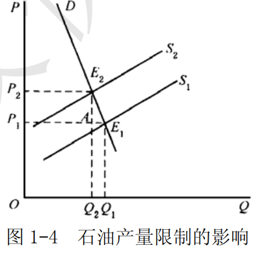

石油输出国组织限制石油产量，是因为在石油的需求没有变化的情况下，石油的价格将上涨。如图 1-4 所示。
限制石油产量的政策使供给曲线由 $S_1$ 向左平移至 $S_2$ ，均衡点由 $E_1$ 移动到 $E_2$ ，价格从 $P_1$ 上升为 $P_2$ 。价格上升后，需求量由 $Q_1$ 减少为 $Q_2$ ，但 $Q_{2}AE_{1}Q_{1}$ 小于 $P_{1}AE_{2}P_{2}$ ，即总收益增加。

### 三、计算与证明

#### 若某厂商面对的市场需求曲线为Q=20-3P，求价格 P=2 时需求的点弹性值。该厂商如何调整价格才能使得总收益增加？

- （1）点弹性表示的是需求曲线上某一点的弹性，其计算公式为：

$$E_d=-\frac{dQ}{dP}\cdot\frac{P}{Q}$$

当价格 $P = 2$ 时，市场需求为： $Q=20-3\times2=14$ ，而 $\frac{dQ}{dP}=-3$ 。

因此，当价格  $P = 2$  时需求的点弹性值为：

$$E_d=-(-3)\times{2/14}=\frac{3}{7}$$

- （2）由（1）可知，

$$E_d=\frac{3}{7}<1$$

，即该厂商生产的产品的需求相当缺乏弹性。因此，根据需求理论，厂商应该提价以使其收入增加。因为对需求缺乏弹性的商品来说，其销售总收入与价格成正方向变动，即它随价格的提高而增加，随价格的降低而减少。所以，为了提高厂商的收入，对需求缺乏弹性的商品提价可以使得总收益增加。

---

## 第 2 章 效用论

### 一、名词解释

#### 1．效用

效用是指商品或劳务满足人的欲望的能力，即指消费者在消费商品或劳务时所感受到的满足程度。

效用是消费者对商品主观上的偏好和评价。一种商品对消费者是否具有效用，取决于消费者消费这种商品或劳务的欲望，以及这种商品或劳务是否具有满足这种商品或劳务是否具有满足消费者欲望的能力。因此，同一商品会因人、因时、因地之不同而有不同的效用。

#### 2．边际效用递减规律

边际效用递减规律是指特定时期内，在其他商品的消费保持不变的条件下，消费者不断地增加某种商品的消费量，随着该商品消费数量的增加，消费者每增加一单位该商品的消费所获得的效用增加量逐渐减少。

$$MU=\frac{\Delta{TU}}{\Delta{Q}}$$

边际效用递减规律是基数效用论的基本假设。导致边际效用递减的原因主要是随着商品数量的增加，商品对人们的刺激降低，并且重要程度也趋于下降。

#### 3．消费者均衡

消费者均衡是指在其他条件不变的情况下，消费者实现效用最大化并将保持不变的一种状态。在基数效用论中，在既定的收入约束条件下，当消费者每单位货币支出的边际效用都等于货币的边际效用时，消费者处于

均衡状态，即：

$$\begin{cases}
\frac{M U_{1}}{P_{1}}=\frac{M U_{2}}{P_{2}}=\cdots=\frac{M U_{n}}{P_{n}}=\lambda \\
p_{1} x_{1}+\cdots+p_{n} x_{n}=m
\end{cases}$$

$P_1,\cdots,P_n$ 为 $n$ 种的商品价格
$m$ 为消费者的收入
$x_1,\cdots,x_n$ 为消费者消费 $n$ 种商品的数量
$\lambda$  货币效用比
$MU$ 边际效用

在序数效用论中，消费者均衡即为无差异曲线与预算约束线的切点。

#### 4．预算约束线

预算约束线又称为预算线、消费可能线和价格线，表示在消费者的收入和商品的价格给定的条件下，消费者的全部收入所能购买到的两种商品的各种组合。假定以 $I$  表示消费者的既定收入，以 $P_1$  和 $P_2$  分别表示商品 1和商品 2 的价格，以 $X_1$ 和 $X_2$ 分别表示商品 1 和商品 2 的数量，则相应的预算式为：

$$P_{1}X_{1}+P_{2}X_{2}=I$$

该式表示：消费者的全部收入等于他购买商品 1 和商品 2 的总支出。
由该预算式作出的预算约束线为图 2-1 中的线段 AB 。

图 2-1 中，预算线的横截距 $OB$ 和纵截距 $OA$ 分别表示全部收入用来购买商品 1 和商品 2 的数量。

#### 5．无差异曲线

无差异曲线是序数效用论的一种分析方法，是用来表示消费者偏好相同的两种商品的所有的数量组合。
或者说，它是表示能够给消费者带来相同的效用水平或满足程度的两种商品的所有的数量组合。无差异曲线如图

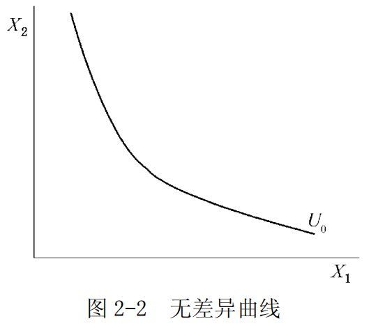

图 2-2 中，横轴和纵轴分别表示商品 1 的数量 $X_1$ 和商品 2 的数量 $X_2$  。
图 2-2 中的曲线表示商品 1 和商品 2的不同组合给消费者带来的效用水平是相同的。与无差异曲线相对应的效用函数为

$$U=f(X_1,X_2)=U_0$$

。其中，$X_1$ 、$X_2$ 分别为商品 1 和商品 2 的消费数量；$U_0$ 是常数，表示某个效用水平。
无差异曲线具有以下三个基本特征：
- 第一，由于通常假定效用函数是连续的，所以，在同一坐标平面上的任何两条无差异曲线之间，可以有无数条无差异曲线；
- 第二，在同一坐标平面图上的任何两条无差异曲线不会相交；
- 第三，无差异曲线是凸向原点的，即无差异曲线的斜率的绝对值是递减的。

#### 6．商品的边际替代率

商品的边际替代率指在效用水平保持不变的前提条件下，消费者增加一单位第一种商品的消费可以代替的另外一种商品的消费数量。
边际替代率的几何意义是无差异曲线斜率的绝对值。
以 $MRS$ 代表商品的边际替代率， $\Delta{x_1}$ 和 $\Delta{x_2}$ 分别是商品 1 和商品 2 的消费变化量，则商品 1 对商品 2 的边际替代率的公式为：

$$MRS_{1,2}=-\frac{\Delta{x_2}}{\Delta{x_1}}$$

当商品数量的变化趋于无穷小时，则商品的边际替代率公式为：

$$MRS_{1,2}=\lim_{\Delta X_{1} \rightarrow 0}-\frac{\Delta x_{2}}{\Delta x_{1}}=-\frac{\mathrm{d} x_{2}}{\mathrm{dx} x_{1}}$$

#### 7．替代效应

由商品的价格变动所引起的商品相对价格的变动，进而由商品的相对价格变动所引起的商品需求量的变动，称为替代效应。
即是指在消费者的实际收入（或效用水平）保持不变的前提下，由于商品价格的相对变化所引起的商品需求量的变化。

#### 8．收入效应

收入效应是因商品价格变动引起消费者实际收入水平变动，进而引起消费者改变消费数量而对商品需求量产生的影响。

### 二、简述题

#### 1．为什么消费者的需求曲线向右下方倾斜？试利用基数效用论加以说明。

基数效用论者以边际效用递减规律和建立在该规律上的消费者效用最大化的均衡条件为基础推导出消费者的需求曲线是向右下方倾斜的。

- （1）基数效用论者认为，商品的需求价格取决于商品的边际效用。
某一单位的某种商品的边际效用越大，则消费者为购买这一单位的该种商品所愿意支付的价格就越高；
反之，某一单位的某种商品的边际效用越小，则消费者为购买这一单位的该种商品所愿意支付的价格就越低。
由于边际效用递减规律的作用，随着消费者对某一种商品消费量的连续增加，该商品的边际效用是递减的，相应地，消费者为购买这种商品所愿意支付的价格即需求价格也是越来越低的。

（2）在基数效用论下，消费者效用最大化的均衡条件为：$\frac{MU}{p}=\lambda$  。
它表示：消费者对任何一种商品的最优购买量应该是使最后一元钱购买该商品所带来的边际效用和所付出的这一元钱的货币的边际效用相等。
该式还意味着：由于对于任何一种商品来说，随着需求量的不断增加，边际效用 $MU$ 是递减的，于是，为了保证均衡条件的实现，在货币的边际效用 $\lambda$ 不变的前提下，商品的需求价格 P 必然与 MU 同比例递减。

#### 2．对正常物品而言，为什么消费者的需求曲线向右下方倾斜？请运用收入效应和替代效应加以说明。

正常物品是指消费者对其消费数量随着自身收入增加而增加的商品。正常物品的需求曲线通常向右下方倾斜。这一点可以借助于收入效应和替代效应加以说明。

（1）一种商品价格变动引起对该商品需求量变动的总效应可以分为替代效应和收入效应：
- 替代效应是由商品的价格变动引起商品相对价格变动，进而由商品的相对价格变动所引起的商品需求量的变动；
- 收入效应是由商品的价格变动引起实际收入水平变动，进而由实际收入水平变动所引起的商品需求量的变动。
- 替代效应不改变消费者的效用水平，而收入效应则表示消费者的实际效用水平发生了变化。

（2）如图 2-3 所示，横轴 $OX_1$ 和纵轴 $OX_2$ 分别表示商品 1 和商品 2 的数量，其中，商品 1 是正常商品。 ${X_{1}}^{'}$ 是价格变化前消费者对商品 1 的需求量。商品 1 的价格下降后，商品需求量增加到 ${X_1}^{'''}$  。商品 1 需求量的增加量为 ${X_{1}}^{'}{X_{1}}^{'''}$ ，这便是商品 1 的价格下降所引起的总效应。

如果作一补偿线 $FG$ ，使该线与价格变化后的预算线 $A{B}^{'}$ 平行，并与价格变化前的无差异曲线 $U_1$ 相切，则切点处 $c$  对应的对商品 1 的需求量 ${X_1}^{'''}$  就是在商品价格变化后，剔除了收入效应的消费量。因此， ${X_1}^{'}{X_{1}}^{''}$  就是商品1 价格下降后的替代效应， 就是商品 1 价格下降后的收入效应。

可以看出，对于正常物品来说，替代效应与价格呈反方向的变动。收入效应也与价格呈反方向的变动，在它们的共同作用下，总效应必定与价格呈反方向的变动。正因为如此，正常物品的需求曲线是向右下方倾斜的。

#### 3．何为吉芬商品，其需求曲线形状如何？试利用收入效应和替代效应加以说明。

（1）吉芬商品指由英国统计学家罗伯特·吉芬发现，因而以他的姓氏命名的一种需求与价格之间呈反常变化的商品。
	吉芬商品的价格与需求量的变动关系违反了需求规律，即：价格越低，购买的越少；价格提高反而购买得更多。因此，吉芬商品的需求量与其价格成正比关系。

（2）如图 2-4 所示，横轴 $OX_1$ 和纵轴 $OX_2$  分别表示商品 1 和商品 2 的数量，其中，商品 1 是吉芬物品。
商品 1 的价格 $P_1$ 下降前后的消费者的效用最大化的均衡点分别为 a 点和b 点，相应的商品 1 的需求量的减少量为 ${X_1}^{'}{X_1}^{''}$ ，这就是总效应。通过补偿预算线 $FG$  可得： 
- ${X_1}^{''}{X_1}^{'''}$ 为替代效应；
- ${X_1}^{'}{X_1}^{'''}$ 是收入效应。

而且，负的收入效应 ${X_1}^{'}{X_1}^{'''}$ 的绝对值大于正的替代效应 ${X_1}^{''}{X_1}^{'''}$ 的绝对值，所以，最后形成的总效应 ${X_1}^{'}{X_1}^{''}$ 为负值。

吉芬物品是一种特殊的低档物品。
作为低档物品，吉芬物品的替代效应与价格呈反方向的变动，收入效应则与价格呈同方向的变动。
吉芬物品的特殊性就在于：它的收入效应的作用很大，以至于超过了替代效应的作用，从而使得总效应与价格呈同方向的变动。这也就是吉芬物品的需求曲线呈现出向右上方倾斜的特殊形状的原因。

---

## 第 3 章 生产和成本论

### 一、名词解释

##### 1．边际产量

边际产量是指在生产技术水平和其他投入要素不变的情况下，每增加一单位可变投入要素所得到的总产量的增加量。

例如，在生产中如果只有劳动 L 是可变投入，则劳动的边际产量可以表示为：

$$MP=\frac{\Delta{Q}}{\Delta{L}}$$

假设生产函数连续且可导，从而可以用总产量对可变投入量求导得出边际产量，即 $MP=\frac{dQ}{dL}$ 。
这样，在某一产量上的边际产量，就是该产量相对于总产量曲线上一点的斜率。

#### 2．边际收益递减规律

在技术水平不变的条件下，在连续等量地把某一种可变生产要素增加到其他一种或几种数量不变的生产要素上去的过程中，当这种可变生产要素的投入量小于某一特定值时，增加该要素投入所带来的边际产量是递增的；当这种可变要素的投入量连续增加并超过这个特定值时，增加该要素投入所带来的边际产量是递减的。这就是边际收益递减规律。

#### 3．等产量曲线

等产量曲线是在技术水平不变的条件下，生产同一产量的两种生产要素投入量的各种不同组合的轨迹。
以 $Q$ 表示既定的产量水平，则与等产量曲线相对应的生产函数为： $$Q=f(L,K)$$
等产量曲线表示生产一定单位的产品，可以有很多劳动和资本数量组合。等产量曲线具有以下重要特点：
- ①等产量曲线是一条从左上方向右下方倾斜的曲线，具有负斜率。它表示增加一种生产要素的投入量，可以减少另一种生产要素的投入量。只有负斜率的等产量曲线，才表示劳动和资本互相代替是有效率的。
- ②坐标图上可以有无数条等产量曲线。它们按产量大小顺序排列，越接近原点的等产量曲线所代表的产量越少，越远离原点的等产量曲线所代表的产量越多。
- ③任何两条等产量曲线不能相交。
- ④等产量曲线向原点凸出。它表示随着一种生产要素每增加一个单位，可以代替的另一种生产要素的数量将逐次减少。这一点可由边际技术替代率递减规律来解释。

#### 4．边际技术替代率

在维持产量水平不变的条件下，增加一单位某种生产要素投入量时所减少的另一种要素的投入数量，被称为边际技术替代率，其英文缩写为 $MRTS$ 。用 $\Delta{K}$ 和 $\Delta{L}$ 分别表示资本投入量的变化量和劳动投入量的变化量，则劳动对资本的边际技术替代率的公式为：

$$MRTS_{LK}=-\frac{\Delta{K}}{\Delta{L}}$$

或 

$$MRTS_{LK}=-\frac{dK}{dL}$$

#### 5．边际技术替代率递减规律
边际技术替代率递减规律是指，在维持产量不变的前提下，当一种生产要素的投入量不断增加时，每一单位的这种生产要素所能替代的另一种生产要素的数量是递减的。
边际技术替代率递减的主要原因在于：任何一种产品的生产技术都要求各要素投入之间有适当的比例，这意味着要素之间的替代是有限的。

以劳动和资本两种要素投入为例，在劳动投入量很少而资本投入量很多的情况下，减少一些资本投入量可以很容易地通过增加劳动投入量来弥补，以维持原有的产量水平，即劳动对资本的替代是很容易的。但是，在劳动投入增加到相当多的数量和资本投入量减少到相当少的数量的情况下，再用劳动去替代资本就将是很困难的了。

#### 6．等成本方程

厂商的等成本方程是指在要素价格一定的条件下，表示厂商花费相同成本可以使用的所有不同的要素组合的代数式。

如以 $r_L$  和 $r_K$ 分别表示劳动和资本的价格，以 $c$ 表示厂商的成本，厂商的等成本方程可以表示为：

$$C=r_{L}L+r_{K}K$$
厂商面对的要素价格和所花费的成本总量变动都会使得等成本方程旋转或者平移。

#### 7．生产要素最优组合

生产要素最优组合是指在生产技术和要素价格不变的条件下，生产者在成本既定时实现产量最大或在产量既定时实现成本最小目标时所使用的各种生产要素的数量组合。

为此，厂商将在既定的等成本方程和等产量线上寻求最高的产量组合点。无论是既定成本下的产量最大还是既定产量下的成本最小，利润最大化的厂商都将把生产要素的数量选择在每单位成本购买的要素所能生产的边际产量相等之点。

#### 8．规模经济与规模不经济

规模经济和规模不经济用来说明厂商产量变动从而规模变动与成本之间的关系。
对于一个生产厂商而言，如果产量扩大一倍，生产成本的增加低于一倍，则生产存在着规模经济；如果产量增加一倍，而成本增加大于一倍，则生产存在着规模不经济。

#### 9．规模收益递增、不变和递减

作为规模经济与规模不经济的一种特殊的情况，如果产量的增加是借助于生产要素的同比例扩大实现的，
那么相应的可定义规模收益的概念：
- ①如果产量增加的比例大于生产要素增加的比例，则称生产是规模收益递增的；
- ②若产量增加的比例等于生产要素增加的比例则称生产是规模收益不变的；
- ③若产量增加的比例小于生产要素增加的比例，则称生产是规模收益递减的。

#### 10．平均成本

平均成本是指厂商平均每生产一单位产品所消耗的成本。
用公式表示为： $AC=\frac{TC}{y}$ 。
- 在短期．厂商的平均成本呈现  $U$ 形。
- 在长期．规模经济的状况将决定厂商的长期平均成本曲线的形状。

#### 11．边际成本

边际成本是指产量变动某一数量所引起的成本变动的数量，也即厂商在短期内增加一单位产量时所增加的总成本。
用公式表示为：

$$MC(Q)=\frac{\Delta{TC(Q)}}{\Delta{Q}}=\frac{TC(Q+\Delta{Q})-TC(Q)}{\Delta{Q}}$$

或 

$$MC(Q)=\lim_{\Delta Q \rightarrow 0} \frac{\Delta T C(Q)}{\Delta Q}=\frac{\mathrm{d} T C}{\mathrm{d} Q}$$

- 在短期内，由于边际产量递减规律的作用，厂商的边际成本呈现 U 形。
- 在长期内，规模经济的状况将决定厂商的长期边际成本形状。

#### 12．长期平均成本曲线

长期平均成本曲线（ $LAC$ ）是用于描述长期平均成本与产量关系的一条曲线。
长期平均成本是长期内厂商平均每单位产量花费的总成本。
长期平均成本曲线是基于长期总成本曲线而得到的。
在生产由规模经济到规模不经济阶段，长期总成本曲线呈 U 形。
从图形关系来看，长期平均成本曲线又是所有短期平均成本曲线的包络线，如图 3-1 所示。这是因为对应于每一产量，厂商在长期内把生产要素调整到最优组合点，从而在这一产量下实现的平均成本为最小。

### 二、简述题

#### 1．单一和多种生产要素的合理投入区是如何确定的？其间平均产量、边际产量各有什么特点？

生产要素的合理投入区是指追求利润最大化的生产者所选择的生产要素投入数量的范围。

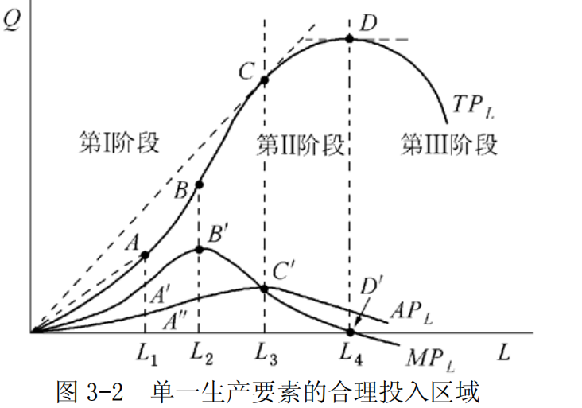

大值点和边际产量等于 0 的点之间，如图 3-2 所示。

短期生产的三个阶段是根据总产量曲线、平均产量曲线和边际产量曲线之间的关系来划分的。如图 3-2 所示：
- 第Ⅰ阶段，平均产量递增阶段，即劳动平均产量始终是上升的，且达到最大值。这一阶段是从原点到 $AP_L$  、$MP_L$ 两曲线的交点，即劳动投入量由 0 到 $L_3$ 的区间。
- 第Ⅱ阶段，平均产量的递减阶段，边际产量仍然大于 0，所以总产量仍然是递增的，直到总产量达到最高点。这一阶段是从 $AP_L$  、 $MP_L$  两曲线的交点到 $MP_L$  曲线与横轴的交点，即劳动投入量由 $L_3$  到 $L_4$ 的区间。
- 第Ⅲ阶段，边际产量为负，总产量也是递减的，这一阶段是 $MP_L$ 曲线和横轴的交点以后的阶段，即劳动投入量 $L_4$  以后的区间。

- 首先，厂商肯定不会在第Ⅲ阶段进行生产，因为这个阶段的边际产量为负值，生产不会带来任何的好处。
- 其次，厂商也不会在第Ⅰ阶段进行生产，因为平均产量在增加，投入的这种生产要素还没有发挥最大的作用，厂商没有获得预期的好处，继续扩大可变投入的使用量从而使产量扩大是有利可图的，至少使平均产量达到最高点时为止。因此，厂商通常会在第Ⅱ阶段进行生产。

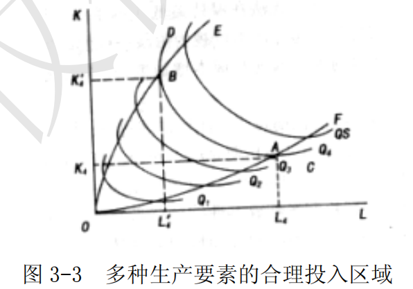

- （2）在长期内，所有要素的投入数量都是可变的。

假定有两种投入要素 $K$ 和 $L$ 都是可变的，那么，两种可变投入要素的合理投入区域是等产量曲线斜率为负的区域。
如图 3-3 中 $OE$  和 $OF$ 之间包含的区域。
以一条等产量曲线为例，要素 $K$ 的投入量超过 $OE$ 和要素 $L$ 的投入量超过 $OF$ ，那么在保持产量不变的前提下可以通过同时减少  $L$  和 $K$  的投入量来实现。因此理性的厂商会把投入组合限定在要素  $L$  和  $K$  的边际替代率为负的区域。

#### 2．为什么边际技术替代率会是递减的？

- （1）边际技术替代率递减规律是指: 
	在维持产量不变的情况下，当一种生产要素的投入量不断增加时，每一单位的这种生产要素所能替代的另一种生产要素的数量是递减的。

- （2）边际技术替代率递减的主要原因在于：
	任何一种产品的生产技术都要求各要素投入之间有适当的比例，这意味着各要素之间的替代是有限度的，故随着一种要素投入的不断增加，它所能替代的另一种要素会不断减少。
	例如，对于劳动投入和资本投入而言，由于受到生产技术的限制，劳动投入和资本投入之间有适当的比例，在劳动投入量很少和资本投入量很多的情况下，减少一些资本投入量可以很容易地通过增加劳动来弥补，以维持原有的产量水平，即劳动对资本的替代是很容易的。但是，在劳动投入增加到相当多的数量和资本投入量减少到相当少的数量的情况下，再用劳动去替代资本就将是很困难的了。

#### 3．生产要素最优组合是如何确定的，它与厂商的利润最大化有何关系？

（1）生产要素最优组合是指既定成本下产量最大化或者既定产量下成本最小化的生产要素投入组合。
在多种生产要素投入变动（比如两种）的情况下，厂商的生产技术可以由等产量曲线加以表示。而厂商的成本方程的切点。在成本既定的条件下，生产要素投入量需要满足的条件为：

$$
\begin{cases}
MRTS_{L,K}=\frac{r_L}{r_K} \\
r_{L}L + r_{K}K = c
\end{cases}
$$

或者：

$$\begin{cases}
\frac{MP_L}{r_L}=\frac{MP_K}{r_K} \\
r_{L}L + r_{K}K= c
\end{cases}$$

在产量既定的条件下，生产要素投入量需要满足的条件为：

$$\begin{cases}
MRTS_{L,K}=\frac{r_L}{r_K} \\
f(L,K) =y
\end{cases}$$

或者：

$$\begin{cases}
\frac{MP_L}{r_L}=\frac{MP_K}{r_K} \\
f(L,K)=y
\end{cases}$$

以上论述说明，无论是既定成本下的产量最大还是既定产量下的成本最小，寻求生产要素最优组合的厂商都将把生产要素的数量选择在每单位成本购买的要素所能生产的边际产量相等之点。

- （2）生产要素最优组合也是厂商利润最大化的选择。
下面以成本既定的情形为例。如果每单位成本获得的边际产量不相等，比如

$$\frac{MP_L}{r_L}>\frac{MP_K}{r_K}$$

，这时把用 $K$ 的一单位成本用于购买 $L$ 将会在保持成本不变的条件下增加总产量，从而增加利润。因此，追求技术上的最优恰好与厂商的利润最大化相一致。

#### 4．试说明短期总产量曲线与短期总成本曲线之间的关系。

短期总产量曲线和短期总成本曲线之间存在下述对应关系：
- ①短期总产量曲线边际报酬递增阶段对应的是短期总成本曲线边际成本递减阶段；
- ②短期总产量曲线边际报酬递减阶段对应的是短期总成本曲线边际成本递增阶段；
- ③短期总产量曲线边际报酬极大值点相对应的是短期总成本曲线边际成本的极小值点。下面对两者的对应关系进行详细说明：

假定该短期生产函数为：

$Q=f(L,K)$  ①   

短期总成本函数为：

$TC(Q)=TVC(Q)+TFC$  ②

$TVC(Q)$  : 短期可变成本
$TFC$ : 不可变成本

短期总可变成本函数为：

$TVC(Q)=W\cdot{L}(Q)$  ③

$W$ 或者 $r_L$ ：劳动价格 

并假定生产要素价格既定。

由②式可得：

$Mc=\frac{dTC}{dQ}=\frac{dTVC}{dQ}+\frac{dTFC}{dQ}$  ④

因为 $TFC$ 为一常数，有  $\frac{dTFC}{dQ}=0$ 

所以，④式可写作：

$$MC=\frac{dTC}{dQ}=W\cdot\frac{dL}{dQ}$$
边际产量: $MP_L=\frac{dQ}{dL}$ 

所以

$MC=W\cdot\frac{1}{MP_L} 或 MC=\frac{r_L}{MP_L}$⑤

由此可知：

$MC$ 与 $MP_L$ 呈反向对应关系，由于边际报酬递减规律的作用，可变投入要素的边际产量 $MP_L$ 先上升后下降，成反 U 形，所以，边际成本 $MC$ 和总成本之间也存在着凸对应关系，当总产量曲线为凹的，总成本曲线是凸的，当总产量曲线为凸的，总成本曲线是凹的。当总产量曲线存在一个拐点时，总成本曲线相应也有一个拐点。

### 三、计算与证明

#### 1．已知企业的生产函数为了： $y=5L-L^{2}$ ，其中 L 为雇佣工人的数量。求企业劳动投入的合理区域。

由题意可知，厂商唯一可变的生产要素为劳动 L ，因此厂商应选择在生产的第二阶段进行生产。由于生产函数为

$$y=5L-{L}^{2}$$

，则有：

- 平均产量为： $AP_L=y/L=5-L$
- 边际产量为： $MP_L=\frac{dy}{dL}=5-2L$

当平均产量与边际产量相交时，决定最低的劳动投入量，即有 $MP_L=AP_L$ ，代入得：

$$5-L=5-2L$$
解得： $L = 0$

当 $MP_L=0$ 时， $AP_L$ 达到最大值，生产进入第三阶段，决定了劳动投入量的最大值。即： $5-2L=0$ 
解得： $L= 2.5$  。

所以，企业劳动投入的合理区域为 $L\in [0,2.5]$ 。

#### 2．厂商的生产函数为 $y=AL^{\alpha}K^{\beta}$ 

，生产要素  $L$  和 $K$  的价格分别为 $r_L$ 和 $r_K$  。

- （1）求厂商的生产要素最优组合。
- （2）如果资本的数量 $K = l$ ，求厂商的短期成本函数。
- （3）求厂商的长期成本函数。

解：
- （1）由于厂商的生产函数为 $y=AL^{\alpha}K^{\beta}$ ,有:

$$MP_L=\alpha A L^{\alpha -1} K ^ \beta$$

$$MP_K=\beta A L^{\alpha} K ^{\beta-1}$$

当有

$$MRTS_{L,K}=\frac{MP_L}{MP_K}=\frac{r_L}{r_K}$$

时，厂商生产要素组合达到最优。即：

$$\frac{\alpha A L^{\alpha -1} K ^ \beta}{\beta A L^{\alpha} K ^{\beta-1}}=\frac{r_L}{r_K}$$

整理得： $\beta r_L L = \alpha r_K K$  。即厂商的生产要素最优组合为： $\frac{K}{L}=\frac{\beta r_L}{\alpha r_K}$ 。

- （2）在短期内
	当 $K = 1$ 时, $y=AL^{\alpha}$ ，所以， $L=(y/A)^{\frac{1}{a}}$   
	代入厂商的成本函数表达式： $c=rL L +r_K K$
	可得短期成本函数为： $c=r_L (y/A)^{\frac{1}{a}}+r_K$ 
	此即为厂商短期成本函数。

- （3）长期中
	 $L$ 和 $K$ 均可变，厂商的长期成本函数由下列条件所决定：

$$\begin{cases}
y=f(L,K) \\
\frac{MP_L}{r_L}=\frac{MP_K}{r_K} \\
c=r_L L + r_K K
\end{cases}$$

带入化简:

$$\begin{cases}
y=A L^{\alpha} K ^ {\beta} \\
c=r_L L + r_K K \\
\beta r_L L = \alpha r_K K
\end{cases}$$

推导过程:

$$L=\frac{\alpha r_K K}{\beta r_L}$$

$${r_L L}=\frac{\alpha r_K K}{\beta}$$

$$y=A {\frac{\alpha r_K K}{\beta r_L} }^{\alpha} K ^ {\beta}$$
$${\frac{y}{A}}={\frac{\alpha r_K K}{\beta r_L} }^{\alpha} K ^ {\beta}$$

$${\frac{y}{A}}={\frac{\alpha r_K K}{\beta r_L} }^{\alpha} K ^ {\beta}$$

$${\frac{y}{A}}={\frac{\alpha r_K}{\beta r_L} }^{\alpha} K ^ {\alpha+\beta}$$

$$K= {\frac{y}{A}}^{\frac{1}{\alpha +\beta}}\cdot {\frac{\beta r_L}{\alpha r_K}}^{\frac{\alpha}{\alpha + \beta}}$$

$$c=\frac{\alpha r_K K}{\beta} + r_K K$$

$$c=(\frac{\alpha r_K}{\beta}\cdot{\frac{\beta r_L}{\alpha r_K}}^{\frac{\alpha}{\alpha+\beta}} + r_K (\frac{\beta r_L}{\alpha r_K})^{\frac{\alpha}{\alpha + \beta}})(\frac{y}{A})^{\frac{1}{\alpha+\beta}}$$

$$c=(\frac{\alpha r_K}{\beta}\cdot{\frac{\beta r_L}{\alpha r_K}}\cdot{\frac{\beta r_L}{\alpha r_K}}^{\frac{-\beta}{\alpha+\beta}} + r_K (\frac{\beta r_L}{\alpha r_K})^{\frac{\alpha}{\alpha + \beta}})(\frac{y}{A})^{\frac{1}{\alpha+\beta}}$$

$$c=({r_L}\cdot({\frac{\alpha r_K}{\beta r_L}})^{\frac{\beta}{\alpha+\beta}} + r_K (\frac{\beta r_L}{\alpha r_K})^{\frac{\alpha}{\alpha + \beta}})(\frac{y}{A})^{\frac{1}{\alpha+\beta}}$$

解得：

$$c=\left[r_{L}\left(\frac{\alpha r_{K}}{\beta r_{L}}\right)^{\frac{\beta}{\alpha+\beta}}+r_{K}\left(\frac{\beta r_{L}}{\alpha r_{K}}\right)^{\frac{\alpha}{\alpha+\beta}}\right]\left(\frac{y}{A}\right)^{\frac{1}{\alpha+\beta}}$$

，此即为厂商的长期成本函数。

#### 3．证明：追求利润最大化的厂商必然会在生产扩展曲线上选择投入组合。

证明：

假设厂商仅用劳动 $L$ 和资本 $K$ 两种要素，那么 
总产出:

$$Q=f(L,K)$$
边际产量:

$$MP_L=\frac{dQ}{dL}$$

$$MP_K=\frac{dQ}{dK}$$

总成本:
$$TC=r_L L + r_K K$$

厂商的利润:
$$\pi=TR-TC=PQ-TC$$
为了追求利润最大化，归结为:
1. 既定成本下产量最大化
2. 既定产量下成本最小化

将其对生产要素 $L$  和 $K$  分别求一阶导数并令其为零以寻求利润最大化的条件，

$$P\cdot{MP_L}-r_L=0$$

$$P=\frac{r_L}{MP_L}$$

$$P\cdot{MP_K}-r_K=0$$
$$P=\frac{r_K}{MP_K}$$

$$\frac{r_L}{MP_L}=\frac{r_K}{MP_K}$$

可得 $\frac{MP_L}{MP_K}=\frac{r_L}{r_K}$ ，此即厂商追求利润最大化的投入组合。

又因生产扩展线为一系列等成本线与等产量线的切点的连线，等产量线上任意一点切线的斜率为边际技术替代率 $RTS_{L,K}=\frac{MP_L}{MP_K}$ ，而等成本线为 $c=r_L L + r_K K$ ，其斜率为 $\frac{r_L}{r_K}$ ，因此可得生产扩展线的方程为 $\frac{MP_L}{MP_K}=\frac{r_L}{r_K}$ ，与厂商追求利润最大化的投入组合相同。故追求利润最大化的厂商必然会在生产扩展曲线上选择投入组合。

---

## 第 4 章 市场理论

### 一、名词解释

#### 1．总收益、平均收益和边际收益

（1）厂商的总收益（ $TR$ ）是指厂商按照一定价格出售一定量产品所获得的全部收入，即： $$TR=p(y)\cdot{y}$$

式中的 $TR$ 为总收益， $p(y)$  为既定的市场价格， $y$  为销售总量。

（2）平均收益（ $AR$ ）指厂商在平均每一单位产品销售上所获得的收入，即：

$$AR=TR/y=p(y)$$

平均收益等于产品价格，厂商所面临的需求曲线即为平均收益曲线。

（3）边际收益（ $MR$ ）指厂商增加一单位产品销售时所获得的收入增量，即：

$$MR=\frac{\Delta{TR}}{\Delta{y}}$$

当厂商面临着既定价格时，其边际收益等于价格；而当厂商面临着一条向右下方倾斜的需求曲线时，其边际收益低于价格。

#### 2．厂商利润最大化原则

厂商利润最大化原则是厂商做生产决策时所遵循的一般原则，它要求每增加一单位产品（或要素）所增加的收益等于由此带来的成本增加量，即边际收益等于边际成本： $MR =MC$ 。
这也是厂商实现最大利润的均衡条件：在其他条件不变的情况下，厂商应该选择最优的产量，使得最后一单位产品所带来的边际收益等于所付出的边际成本。

#### 3．完全竞争市场

完全竞争市场是指一种竞争不受任何阻碍和干扰的市场结构。
完全竞争市场的假设条件是：

- ①市场上，厂商生产同质的产品。
- ②市场上有众多的消费者和厂商，因而消费者和厂商都是市场价格的接受者。
- ③市场上的消费者和厂商拥有完全信息。
- ④厂商可以无成本地自由进入或退出市场。
 
事实上，这种理想的完全竞争市场很难在现实中存在。但是，完全竞争市场的资源利用最优、经济效率最高，可以作为经济政策的理想目标，所以，西方经济学家总是把完全竞争市场的分析当作市场理论的主要内容，并把它作为一个理想情况，以便和现实比较。

#### 4．外在经济和外在不经济

外在影响: 某一经济主体的经济行为对社会上其他人的福利造成影响，但并不为此承担后果。
外在经济: 某一经济个体的一项经济活动给社会其他成员带来好处，但并未获得相应的补偿，即个人获得的利益小于该活动中所带来的全部利益，也就是该经济个体的经济活动带来了正的外在影响；
外在不经济: 某一经济个体的一项经济活动给社会其他成员带来成本，但并不需要自身去承担相应的全部成本，即个人所承受的成本小于该活动所带来的全部成本，也就是个人的经济活动带来了负的外在影响。

完全竞争市场中，随着厂商数目的增加，整个行业中的产量也会增加，如果行业中单个厂商的成本降低，则称该行业存在着外在经济；
如果厂商数量增加从而整个行业的产量增加使得单个厂商的成本增加，则称该行业存在着外在不经济。

#### 5．价格歧视

价格歧视是指垄断厂商在同一时期内，以不同的价格销售同一种商品。垄断厂商实行价格歧视的基本条件：

- ①市场的消费者具有不同偏好，且这些不同的偏好可以被区分开；
- ②不同的消费者群体或不同销售市场是相互隔离的。

价格歧视被划分为三类：
- 一级价格歧视是指垄断厂商对每一单位产品都按消费者愿意支付的最高价格出售，这种类型的价格歧视也被称为完全的价格歧视。
- 二级价格歧视是指对不同的消费数量段规定不同的价格；
- 三级价格歧视是垄断厂商在不同市场（或对不同的消费群）上收取不同的价格。

#### 6．垄断竞争市场

垄断竞争市场是指一种由许多厂商生产和销售有差别的同种产品的市场，市场中既有垄断又有竞争，既不是完全竞争又不是完全垄断。

垄断竞争市场通常具有以下特征：
- 第一，行业中有大量的卖者和买者；
- 第二，厂商提供有差异但彼此接近的替代品；
- 第三，厂商进入或退出是自由的。

#### 7．寡头垄断市场

寡头垄断市场指那种在某一产业只存在少数几个卖者的市场组织形式。
典型的寡头市场具有以下一些特点：
- 第一，市场上存在少数厂商，单个厂商的产销量占整个市场相当大的份额，从而对市场价格具有明显的影响力；
- 第二，少数寡头之间的行为相互依存；
- 第三，寡头市场上的价格相对稳定，竞争大多是非价格形式；
- 第四，市场上存在进入障碍。

#### 8．古诺模型

古诺模型是一个只有两个[寡头](https://zh.wikipedia.org/wiki/%E5%AF%A1%E5%A4%B4 "寡头")厂商的简单模型，即[双头模型](https://zh.wikipedia.org/wiki/%E5%8F%8C%E5%A4%B4%E5%9E%84%E6%96%AD "双头垄断")。古诺模型是早期的寡头模型，它通常被作为寡头理论分析的出发点。
假设两个面临同一市场的竞争厂商．它们生产无差异的产品．成本为 0。最终，两（ n ）个厂商各选择 $\frac{1}{n+1}$ 的产量，当 n=2 即 $\frac{1}{3}$ 的产量，我  而且它们没有进一步变动产量的动力，从而市场处于均衡。

#### 9．纳什均衡

纳什均衡指的是如果其他参与者不改变策略，任何一个参与者都不会改变自己的策略。也就是说，当其他参与者的策略给定的时候，自己的最优策略就是纳什均衡策略。

### 二、简述题

#### 1．为什么说厂商均衡的一般原则是 $MR=MC$

经济学中通常认为理性厂商行为的目的是为了获取最大化的利润。为了获得最大化的利润，厂商在进行决策时都试图使得边际收益等于边际成本，即增加一单位决策量，厂商增加的收益大于增加的成本。经济学中通常称这一原则为利润最大化原则。利润最大化原则适用于所有以利润为目标的经济单位对所有决策变动进行的选择。下面以厂商的产量选择来说明这一点。

对于厂商而言，它提供产量一方面会带来收益，另一方面也会产生成本。
在既定产量的条件下增加产量:
- 如果厂商由此增加的收益大于生产这一单位产品所消耗的成本，即   $MR > MC$  ，那么生产该单位产品就有剩余，从而使得利润总额有所增加。因此，利润最大化厂商就会把它生产出来，即在这种条件下，厂商会增加产量，直到二者相等为止。
- 相反，如果多生产一单位产品所增加的收益小于生产这一单位产品所消耗的成本，即  $MR < MC$  ，就这一单位而言，厂商是亏损的，因而为了增加利润，厂商会减少该单位的生产。因此，在  $MR < MC$  时，厂商会减少生产，直到 $MR=MC$ 。
- 在  $MR=MC$  时，厂商获得最大化的利润。此时，厂商即不增加生产，也不减少生产。

因此， $MR=MC$ 是厂商均衡的一般原则，当 $MR=MC$ 时，厂商实现了利润最大化，从而没有动力去调整产量。

#### 2．简要分析完全竞争厂商的短期（或长期）均衡。

- （1）完全竞争厂商的短期均衡

在完全竞争市场上，由于每个厂商都是价格接受者，因而厂商的边际收益等于平均收益，都等于市场价格，即 $MR=AR=p$ 。按边际收益等于边际成本进行生产的利润最大化厂商选择最优产量的条件是 $MR=MC=p$ 。

对应于上述条件，完全竞争厂商可以处于获得超额利润、获得正常利润和亏损状态的均衡。当市场价格低于平均可变成本最低点时，厂商生产要比不生产损失更大，这是厂商的停止营业点。

对应于高于平均可变成本最低点的市场价格，厂商会在边际成本曲线上确定相应的供给量。因此，平均可变成本之上的边际成本曲线是厂商的短期供给曲线。并且由于边际产量递减规律的作用，厂商的边际成本曲线递增，因而厂商的供给曲线是向右上方倾斜的。

- （2）完全竞争厂商的长期均衡

在长期中，厂商将不断调整固定投入的数量，使得在每个产量下，生产规模都是最优的。因此，长期成本曲线将是厂商决策的依据。与短期中的行为一样，追求利润最大化的厂商选择最优产量的必要条件是边际收益等于长期边际成本。同时，由于长期内厂商没有固定成本与不变成本之分，因而当价格高于平均成本时，厂商才提供供给；否则，厂商退出该行业。

假定厂商的进入和退出不影响单个厂商的成本，则行业中厂商的进入或退出只影响到市场供给，从而影响到市场价格。

如果完全竞争行业中的厂商获得超额利润，那么势必会引起其他行业中厂商的进人。结果将使得市场价格降低到厂商的平均成本最低点为止。因此，在这种情况下，单个厂商的长期均衡条件是 $P=LMC=LAC$ ，所有厂商都不能获得超额利润。

#### 3．完全竞争市场的长期行业供给曲线是如何得到的？

完全竞争市场的长期行业供给曲线是以行业中单个厂商的长期供给曲线为基础的。

在长期中，完全竞争厂商将不断调整固定投入的数量，使得在每个产量下，生产规模都是最优的。以长期成本为决策基础，厂商在价格高于平均成本时，按价格等于边际成本来提供产量。同时，行业在长期中存在着其他厂商的进入或退出，这将导致单个厂商的长期均衡处于价格等于长期平均成本最低点。

其他厂商进入或者退出不仅影响到市场供给从而影响到市场价格，而且也对行业中厂商的成本产生影响。根据这一影响，完全竞争行业被划分为成本不变、递增和递减三种情况。

- （1）成本不变行业：单个厂商的成本不随厂商的进入或退出而改变。最终结果只是厂商数目的增减而已。因此，成本不变行业的长期供给曲线是一条由厂商的长期平均成本曲线最低点决定的水平曲线。

- （2）成本递增行业：假定最初厂商和行业均处于长期均衡状态。此时若出现行业的市场需求增加，结果将会导致市场价格提高，使得每个厂商都获得超额利润。超额利润驱使其他厂商进入。行业的外在不经济使得单个厂商的成本增加，因而当行业再次处于均衡状态时，厂商的平均成本最低点升高。这样，由厂商的长期平均成本最低点决定的行业长期供给曲线向右上方倾斜。

- （3）成本递减行业：假设最初一个行业处于均衡状态，由于市场需求增加导致行业中的市场价格上升，从而行业中的厂商获得超额利润。这将引起其他厂商的进入。随着厂商的进入，一方面价格趋向于降低，另一方面外在经济也使得行业中厂商的长期平均成本曲线向下移动。市场价格再次与厂商的平均成本最低点相交，行业恢复到均衡状态。这时市场的均衡状态对应着更低的市场价格。结果该行业的长期供给曲线是一条向右下方倾斜的曲线。

#### 4．评述垄断竞争理论。

- （1）垄断竞争市场及其特点

垄断竞争市场是指那些有许多厂商生产有一定差别的产品的市场结构。在这类市场中，既有垄断的因素，又有竞争的成分，因而单个厂商所面临的需求曲线向右下方倾斜，并且由于厂商的进入和退出，使得每个厂商的需求曲线时常发生变动，并具有较大的价格弹性。

垄断竞争市场是介于垄断和完全竞争市场之间而又比较接近于完全竞争的一种市场结构。其形成条件主要有四点：
- ①大量的厂商生产有差异的替代品；
- ②每个厂商的市场份额很小，其行为不会引起其他厂商的报复；
- ③厂商进入或退出生产较为容易；
- ④行业中存在着模仿。

- （2）垄断竞争市场上的厂商行为

在垄断竞争市场上，由于产品差异，厂商可以在一定程度上控制自己产品的价格，采取策略性行为。在认为其他厂商不改变价格的判断下，厂商预期通过降低价格增加更多的收益，这条曲线构成了厂商的主观需求曲线。但是，如果行业的所有厂商都依照各自的主观需求曲线行事，那么垄断竞争厂商所面临的实际需求曲线尽管也向右下方倾斜，但价格弹性小于相应的主观需求曲线。垄断竞争厂商依照主观需求曲线所决定的边际收益与其边际成本的交点确定生产量，但必须按实际需求曲线所对应的价格取得收益，从而得到实际的边际收益。如果主观的边际收益不等于实际的边际收益，那么，厂商将调整生产量直到二者相等为止。这样，垄断竞争厂商按主观需求曲线行事的结果是按实际需求曲线得到收益。

- （3）垄断竞争市场的短期和长期均衡

在短期内，垄断竞争厂商根据主观需求曲线所对应的边际收益等于边际成本的原则决定产量，在这一产量对应的实际价格与主观价格相等时，厂商处于短期均衡。在短期内，处于均衡的厂商可以获得超额利润、正常利润或亏损，但处于亏损时，所获得的收益必须能抵补厂商生产所支付的可变成本。在长期内，由于厂商的进入和相互模仿，短期内可以处于垄断地位的厂商渐渐失去了垄断地位，即它所面临的市场需求减少。当厂商根据主观需求所对应的边际收益与边际成本相等决定的产量所对应的平均收益等于平均成本时，行业中厂商的进入或退出停止，厂商处于长期均衡。即厂商处于长期均衡的条件为：长期（主观）边际收益等于边际成本，长期平均收益等于长期成本。在长期均衡时，垄断竞争厂商只获得正常利润。

由于垄断竞争厂商的需求曲线向右下方倾斜，所以在长期均衡时，垄断竞争市场上的价格高于完全竞争市场，而产量也低于完全竞争市场。并且，垄断竞争厂商为了强化产品的差异而进行的广告宣传，也未必不是一种资源的浪费。这表明垄断竞争市场缺乏效率的方面。但是，由于完全竞争市场在现实中很少见，而且也由于垄断竞争市场的竞争推进技术进步和产品的多样性，所以垄断竞争市场常被认为是一种较有效的市场结构。

- （4）垄断竞争理论的局限性

垄断竞争市场理论是以产品差异和自由竞争为主要条件的，在理论分析中很少涉及生产的集中所形成的垄断厂商的均衡。因而也就不能分析作为资本主义现代经济一种表现的垄断现象的深刻基础和对社会经济生活所产生的影响。此外，该理论把以产品差异为特征的垄断与生产集中所导致的垄断混为一谈，使得垄断竞争分析并不具有一般性。从垄断竞争理论本身来看，这一理论体系仍然建立在较严格的假设之上。不过也应该看到，对于垄断竞争对竞争所起到的积极作用以及垄断的消极作用的分析是有意义的。

#### 5．折弯的需求曲线模型是如何对寡头市场上的价格较少变动作出解释的？

折弯的需求曲线模型又称为斯威齐模型，是用于寡头市场行为分析的一个理论模型。这一模型假定，对应于一个特定的价格，当一个寡头厂商提高价格时，其他厂商将不会跟随，但若它降低价格，其他厂商也会如此。结果，单个厂商面临的需求曲线具有一个折弯点。

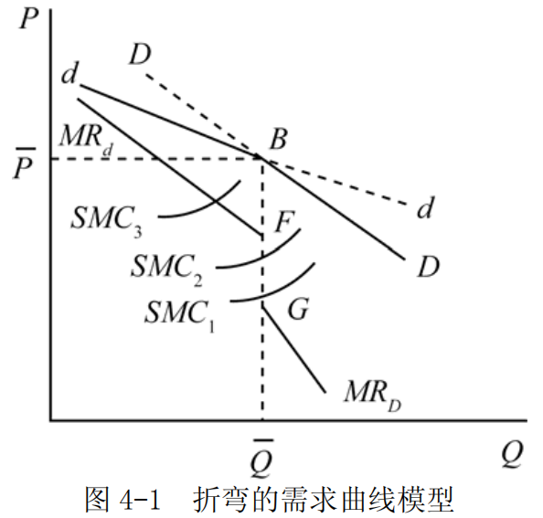

对应于一条折弯的需求曲线，寡头厂商得到自身的边际收益。通过此边际收益，厂商根据边际收益等于边际成本的原则决定最优产量，并在需求曲线上索要价格。与通常厂商不同的是，折弯的需求曲线对应的边际收益曲线在折弯点处不连续，如图 4-1 所示。但是，我们注意到，当边际成本恰好与边际收益在边际收益的断点处相等时，只要边际成本的变化不超过一定幅度，就不会影响厂商的均衡产量和价格。这样，该模型对寡头市场的价格稳定性给予了充分的说明。

折弯的需求曲线模型的缺陷是没有说明最初的价格是如何决定的。

#### 6．为什么说古诺模型的均衡是一个纳什均衡？

- （1）在双寡头垄断市场中，各厂商根据自己的产量反应曲线制定产量，均衡产量水平在两条反应曲线的交点处得到，称这组产量水平为古诺均衡。

- （2）古诺均衡属于纳什均衡，处于纳什均衡中的每个厂商的行为是给定它的竞争对手行为时它能做得最好的行为，所以没有哪个厂商会有改变自身行为的冲动。同样，处于古诺均衡中的每个厂商的产量是给定竞争对手的产量时实现其最大利润的产量，所以没有哪个厂商会有改变自身产量的冲动，因此古诺均衡是稳定。

### 三、计算与证明

#### 已知垄断厂商面临的需求曲线是 Q=50-3p。

- （1）求厂商的边际收益函数。
- （2）若厂商的边际成本等于 4，求厂商利润最大化的产量和价格。

解：
- （1）据题意，垄断厂商的需求函数为： 

$$P=\frac{50}{3}-\frac{Q}{3}$$

 ，所以，厂商的总收益函数为：

$$TR=PQ=\frac{50Q}{3}-\frac{Q^2}{3}$$

则其边际收益函数为： $$MR=\frac{dTR}{dQ}=\frac{50}{3}-\frac{2Q}{3}$$

。

-（2）由题可知，厂商的边际成本 $MC= 4$  。

根据厂商利润最大化的一般原则，有： $MR= MC$ ，即：

$$\frac{50}{3}-\frac{2Q}{3}=4$$

解得： $Q = 19$ 。

将 $Q = 19$ 代入反需求函数 $P=\frac{50}{3}-\frac{Q}{3}$ ，得： $P=\frac{50}{3}-frac{19}{3}=10.3$  。

即，厂商利润最大化的产量为 $Q=19$ ，价格为  $P=10.3$ 。

#### 已知垄断厂商的需求函数为 Q=50 - P。

- （1） 求厂商的边际收益函数
- （2）求厂商的边际成本等于20时，求厂商利润最大化的产量和价格。
-   (3)  说明垄断的价格歧视

答:

1. 已知垄断厂商的需求函数为 $Q=50-P$ ,则 $P=50-Q$ 。厂商总收益 $TR = P\cdot Q = 50 Q - Q^2$  则厂商边际收益函数为 $MR=50-2Q$ 。
2. 根据厂商的边际成本 $MC=20$ ,垄断厂商利润最大化的条件是 $MR=MC$ ,得 $50-2Q = 20$ ,即 $Q=15 ,P=50-Q = 35$ 。
3. 厂商对相同的商品制定不同销售价格的现象被称为价格歧视。
	价格歧视可以分为三种:
	- 第一阶段歧视，垄断厂商按照不同的购买量索要不同的价格，以至于每单位商品索要的价格恰好等于此时的需求价格。
	- 第二阶段歧视，垄断厂商按不同购买量分组，并对不同的组别索要不同的价格，如数量折扣。
	- 第三阶段歧视，垄断厂商根据不同类型的消费者索要不同的价格。

---

## 第 5 章 生产要素市场

### 一、名词解释

#### 1．引致需求

引致需求又称“派生需求”，指由于消费者对产品的需求而引起的企业对生产要素的需求。引致需求来自厂商，是厂商对生产要素的需求，不同于消费者对商品的需求。

在产品市场上，需求来自消费者，而消费者购买产品是为了自己的消费，从中获得满足，一次购买过程到此结束。与此不同，在生产要素市场上，需求来自企业，而企业购买生产要素是为了生产，从中获得利润。企业购买生产要素并不是一次经济行为的终结。一个企业能否获得利润并不取决于其自身，而是取决于消费者对其所生产的产品的需求，取决于消费者是否愿意为其产品支付足够的价格。如果不存在消费者对产品的需求，那么厂商就无法从生产和销售中获得收益，从而也不会去购买生产资料和生产产品。或者说，消费者对产品的直接需求，引致和派生了厂商对生产要素的需求。某一种生产要素的需求曲线的形态，是从使用这种生产要素的最终产品的需求曲线派生出来的。

#### 2．边际产品价值

边际产品价值指增加一单位生产要素所增加的产量的价值，它等于边际产量与产品价格的乘积，即： $VMP=P\cdot{MP_L}$ 。在完全竞争市场上，要素的边际产品价值反映了要素的边际收益，它是厂商对要素的需求曲线。

由于边际产量服从递减规律，因而完全竞争厂商对要素的需求曲线向右下方倾斜。

#### 3．边际收益产品

边际收益产品是指在其他生产要素的投入量固定不变时追加一单位的某种生产要素投入所带来的收益。它等于边际产品（ $MP$ ）与边际收益（ $MR$ ）的乘积，即：

$$MRP=MR \cdot MP$$

在产品卖方垄断市场，由于厂商出售既定产量可以索要的价格与厂商的产量有关，通常呈相反方向变动，因而，一种要素的边际产量为厂商增加的收益不等于原有的价格与边际产量之积，而是边际产量与边际收益之积。

#### 4．平均要素成本

平均要素成本是厂商购买每单位生产要素平均支付的成本。

在完全竞争市场上，平均要素成本由于生产要素的价格既定，因而厂商的平均要素成本就等于该要素的市场价格。在生产要素市场买方垄断的条件下，平均要素成本曲线就是厂商面对的要素供给曲线。厂商使用要素的边际成本高于要素价格。这是因为这时厂商面对的是一条向右上方倾斜的要素供给曲线。因而，厂商使用要素的数量影响到要素的价格。这时，平均要素成本曲线随着要素使用量的增加而增加。

#### 5．边际要素成本

边际要素成本是指厂商增加一单位生产要素投入量所带来的成本增加量。记为 $MFC$ 。

厂商利润最大化原则:  $$MRP=MFC$$

在完全竞争市场上，由于生产要素价格不变，因而增加一单位要素的成本就等于该要素的价格。在要素的买方垄断市场上，厂商使用要素的边际要素成本高于要素的价格。

#### 6．向后弯曲的劳动供给曲线

根据劳动者的最优化行为，对应于一个特定的工资率，劳动者在效用最大化点上确定最优劳动供给量，从而得到劳动的供给曲线。在工资水平较低时，工资率上升对劳动所产生的替代效应大于收入效应，因而人们愿意提供更多的劳动，减少闲暇；而当工资水平上升到一定程度以后，替代效应小于收入效应，因而人们增加闲暇时间，而减少劳动时间。因此，劳动的供给曲线向（左）后方弯曲。

### 二、简述题

#### 1．简要说明完全竞争厂商对生产要素的需求曲线是如何得到的。

- （1）与产品市场一样，完全竞争要素市场上有众多的厂商和众多的要素供给者，它们都按照既定的要素价格来选择最优的要素使用量和供给量。在产品市场上，厂商也是完全竞争者，即产品的市场价格是厂商决策的依据。就厂商而言，厂商选择要素使用量的原则是利润最大化，即要素的“边际收益”和“边际成本”必须相等。

- （2）在完全竞争市场上，厂商使用要素的“边际收益”为该要素的边际产品价值，即边际产量与价格的乘积。这是因为，增加一单位要素可以增加的产量等于该要素的边际产量，而这些产量以不变的产品价格出售，所以，增加该要素一个单位给厂商带来的收益就等于产品价格乘以边际产量，即：$VMP= P\times MP$ 。

	从要素的“边际成本”考察，由于厂商面对的要素价格由市场供求所决定，不随厂商使用要素数量的多少而改变，因此增加一单位的要素所增加的成本等于该要素的价格。由此可知厂商的使用要素利润最大化原则表现为：

	$$VMP=P \times MP =r$$ 。其中， $r$  为要素的价格。

- （3）对应于由市场所决定的要素价格  $r$  ，厂商选择利润最大化的要素使用量，因此要素的边际产品价值构成了厂商对该要素的需求曲线。由于要素的边际产量  $MP$ 服从递减规律，而产品在完全竞争市场上的产品价格保持不变，因而要素的边际产品价值 $VMP$  也随着要素使用量的增加而递减，即完全竞争厂商对要素的需求曲线向右下方倾斜，如图 5-1 所示。

#### 2．为什么劳动供给曲线向后弯曲？试用收入效应和替代效应加以说明。

- （1）劳动力供给曲线向后弯曲是指随着劳动价格即工资率的提高，最初劳动的供给量逐渐增加，但当劳动价格上升到一定程度之后，劳动供给量反而减少的情况。假设每一个劳动力的供给只取决于工资，则向后弯曲

的劳动供给曲线可用图 5-2 表示。

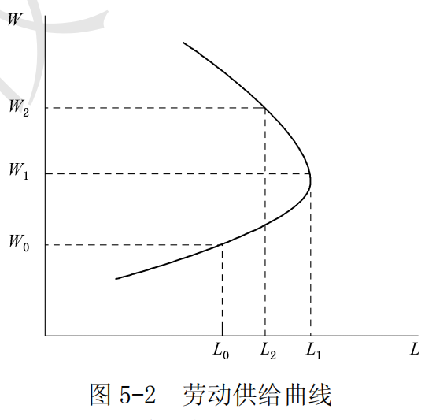

- （2）劳动供给曲线向后弯曲可以从以下三方面来分析：

- ①劳动的供给曲线向后弯曲，是劳动工资率产生的替代效应和收入效应综合影响的结果。劳动者在不同的工资率下愿意供给的劳动数量取决于劳动者对工资收入和闲暇所带来效用的评价。消费者的总效用由收入和闲暇提供。收入通过消费品的购买为消费者带来满足：收入越多，消费水平越高，效用满足越大。同样，闲暇也是一种特殊的消费，闲暇时间越长，效用水平越高。然而，可供劳动者支配的时间是既定的，所以劳动者的劳动供给行为可以表述为：在既定的时间约束条件下，合理地安排劳动和闲暇时间，以实现最大的效用满足。

- ②一般而论，工资率越高，对牺牲闲暇的补偿也就越大，劳动者宁愿放弃闲暇而提供劳动的数量也就越多。换言之，工资率提高，闲暇的机会成本相应也就越大，劳动者的闲暇时间也就越短。因此，工资率的上升所产生的替代效应使得劳动数量增加。同时，工资率的提高，使得劳动者收入水平提高。这时，劳动者就需要更多的闲暇时间。也就是说，当工资率提高以后，劳动者不必提供更多的劳动就可提高生活水平。这说明，工资率提高的收入效应使得劳动数量减少。

- ③替代效应和收入效应是工资率上升的影响的两个方面，如果替代效应大于收入效应，则闲暇需求量随其价格上升而下降；反之，如果收入效应大于替代效应，则闲暇需求量随其价格的上升而上升。这就意味着劳动供给曲线向后弯曲。如果原来的工资即闲暇价格较低，则此时的劳动供给量较小，工资上涨的收入效应不能抵消替代效应；但如果工资率已经处于较高水平，此时劳动供给量也相对较大，则工资上涨引起的整个劳动收入增量就很大，从而收入效应超过替代效应。这就是说，当工资的提高使人们富足到一定的程度以后，人们会更加珍视闲暇。因此，当工资达到一定高度而又继续提高时，人们的劳动供给量不但不会增加，反而会减少。因此，当工资率提高到一定程度之后，劳动供给曲线开始向后弯曲。

#### 3．试说明欧拉定理在要素收入分配理论中的含义。

- （1）欧拉定理又称为产量分配净尽定理，是对应于齐次函数的一个数学定理，指在完全竞争的条件下，假设长期中规模收益不变，则全部产品正好足够分配给各个要素。

假设有两种生产要素劳动 $L$ 和资本 $K$ ，生产函数为 $Q=Q(L,K)$ ，若生产规模不变，则有： $$Q=L\cdot\frac{\partial Q}{\partial L}+K\cdot\frac{\partial Q}{\partial K}$$

这就是欧拉定理，它表明在所给条件下，全部产品 $Q$ 恰好足够分配给劳动要素 $L$ 和资本要素 $K$ 。其中 $\frac{\partial Q}{\partial K}$ 为资本的边际产品即 $MP_K$ ，  $\frac{\partial Q}{\partial L}$ 为劳动的边际产品即 $MP_L$ 。

（2）欧拉定理说明了如果生产函数是规模收益不变的，即一次齐次的，那么每种生产要素按照边际产品获

得收入恰好等于它们的总产量。因而欧拉定理也可以表示为：

$$Q=K\cdot MP_K+L\cdot MP_L$$

这一结论对于边际分配论具有很强的解释意义。在完全竞争市场上，当所有的要素市场处于均衡状态的时候，厂商对要素的均衡使用量所对应的边际产品价值恰好等于此时的要素价格。根据欧拉定理，当厂商的生产规模收益不变的时候，要素按照这个价格取得的收入恰好等于所有的产量的价值。因此，按照要素的边际产品进行分配是合理的。

#### 4．以劳动市场为例，说明产品卖方垄断而要素市场买方垄断的条件下的生产要素价格决定。

- （1）生产要素的价格是由生产要素的供给和需求所决定的。劳动市场由劳动的供给和劳动的需求两方面构成。劳动的供给来源于劳动者，而劳动的需求来源生产者。劳动这种要素的价格是由劳动市场的供给和需求所决定的一个市场均衡价格，但是它受到市场条件的限制。

- （2）在生产要素市场上，厂商决定使用劳动等生产要素数量的一般原则是边际收益产品等于边际要素成本。

为了利润最大化，厂商每使用一单位数量的劳动所花费的成本必须等于该单位劳动所带来的收益：如果前者大于后者，厂商会减少该单位生产要素的使用；如果前者小于后者，厂商则增加使用。依照定义，厂商使用最后一单位劳动所花费的成本就是该单位要素的边际要素成本，而因使用该单位劳动所生产的产品卖出后获得的收益就是劳动的边际收益。它等于要素的边际产品的边际价值，即边际产品乘边际收益。

在要素市场买方垄断的条件下，厂商雇佣劳动力的原则仍然是劳动的边际收益产品等于边际要素成本。劳动市场上的买方垄断意味着市场上只有一家厂商购买劳动这一生产要素。所以，该厂商面临的劳动的供给曲线是市场的供给曲线，向右上方倾斜，厂商使用劳动的边际要素成本不再是不变的量，它因劳动的平均要素成本增加而以更快的速度增加，即劳动的边际要素成本高于劳动的供给。

- （3）在产品市场卖方垄断条件下，厂商卖出使用劳动生产出的产品时所面临的市场需求曲线是向下倾斜。这就使得产品的边际收益小于市场价格，从而使得劳动的边际收益产品低于边际产品价值。

- （4）厂商根据该边际要素成本等于边际产品价值决定劳动的使用量，把劳动的价格确定在比边际要素成本更低的劳动供给曲线上。由于买方垄断条件下厂商决定劳动价格，因此，在这一市场结构下没有明显的劳动需求曲线，厂商根据要素的边际产品价值与边际要素成本相等的条件决定要素使用量，同时在要素供给曲线上支付这一使用量下可能的最低价格。如图 5-4 所示，在完全竞争下，劳动的均衡价格为 re ；但是在产品卖方垄断而要素市场买方垄断的条件下，劳动的价格为 $r3$  。

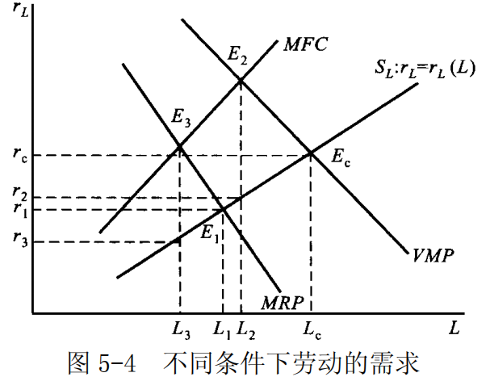

由以上分析可以看出，与完全竞争厂商相比，由于买方垄断厂商使用要素的边际要素成本高于要素的供给曲线，而要素的边际产品价值相等，因而其要素使用量更少，支付的价格更低。

### 三、计算与证明

#### 在生产要素市场上，厂商的利润最大化原则是什么？证明你的结论。

- （1）厂商使用生产要素的原则是它所使用的生产要素能够给它带来最大化的利润，而利润最大化要求任何经济活动的“边际收益”和“边际成本”必须相等。具体说来，就是使用要素的边际收益要等于使用要素的边际成本，即 $MRP=MFC$ 。

例如在劳动要素市场上，厂商应把雇佣的劳动投入量调整到一定数量，使得这一雇佣劳动总量下的最后一个单位劳动带来的总收益的增加量（边际收益产品 MRP ），恰好等于增加这最后一个单位劳动雇佣量引起的总成本

的增加量（边际要素成本 MFC ）。

- （2）假定除了劳动这一要素之外，其他生产要素都不会发生变动。这样厂商的利润可以表示为： $\pi=TR-TC$ 。所以厂商利润最大化的条件为：

$$\frac{d\pi}{dL}=\frac{dTR}{dL}-\frac{dTC}{dL}$$

- ①从厂商使用要素的“边际收益”方面来考察，当厂商增加一种生产要素劳动的投入数量时，一方面，带来产品的增加，另一方面增加产量又带来收益增加量。结果，增加一单位要素投入所增加的总收益为：

$$\frac{dTR}{dL}=\frac{dTR}{dQ}\times \frac{dQ}{dL}=MR\times MPP=MRP$$

，即要素（劳动）的边际收益产品 $MRP$ 。

②从使用要素的边际成本方面考察，如果其他投入数量保持不变，则厂商的总成本取决于变动投入的数量。

经济学中增加一单位要素的边际成本被定义为边际要素成本，表示为： $\frac{dTC}{dL}=MFC$

③于是，厂商使用要素的利润最大化原则表示为： $MRP-MFC=0$ ，即 $MRP=MFC$ 。当 $MRP>MFC$  时，这表示每增加一个单位的劳动投入带来的总收益的增加量超过雇佣这个劳动单位引起的总成本增加量，也就意味着继续增加劳动投入量可使总利润有所增加；反之，当 $MRP<MFC$ 时，这意味着最后增加雇佣的那个单位劳动反而造成损失，从而导致总利润较前减少。所以，如果厂商把投入要素如雇佣的劳动量作为选择变量，实现利润极大化的条件便是它雇佣的劳动量满足 $MRP=MFC$ 。即：要素市场上利润最大化的一般原则是要素的边际收益产品等于边际要素成本。特别地，如果厂商是产品市场上的完全竞争者，则产品的边际收益等于产品的价格，从而要素的边际收益产品等于边际产品价值；如果厂商是要素市场的完全竞争者，则要素的边际成本就等于该要素的价格。

---

## 第 6 章 一般均衡论和福利经济学

### 一、名词解释

#### 1．局部均衡和一般均衡

- （1）局部均衡是指在假设其他市场不变的情况下，某一特定产品或要素的市场均衡。局部均衡分析研究的是单个（产品或要素）市场，其研究方法是把所考虑的某个市场从相互联系的整个经济体系的市场全体中“取出”来单独加以研究。

局部均衡是经济体系中单独一个消费者、一个商品市场或要素市场、一家厂商或一个行业的均衡状态。局部均衡分析即只考虑这个局部本身所包含的各因素的相互影响，相互作用，最终如何达到均衡状态。如在研究某产品市场的均衡时，就可假设其他各产品的供给、需求及价格不变，而只考虑该产品的价格和销售量如何由它本身的供给和需求两种相反力量的作用以达到均衡。

- （2）一般均衡是指在一个经济体系中，所有市场的供给和需求同时达到均衡的状态。一般均衡分析从微观经济主体行为的角度出发，考察每一种产品和每一个要素的供给和需求同时达到均衡状态所需具备的条件和相应的均衡价格以及均衡供销量应有的量值。

根据一般均衡分析，某种商品的价格不仅取决于它本身的供给和需求状况，而且还受到其他商品的价格和供求状况的影响。因此，某种商品的价格和供求均衡，只有在所有商品的价格和供求都同时达到均衡时，才能实现。

#### 2．瓦尔拉斯定律

瓦尔拉斯定律也称为瓦尔拉斯法则，是由经济学家瓦尔拉斯在其完全竞争市场的一般均衡理论体系中提出一个恒等关系式。
其基本内容是：在完全竞争的市场体系中，在任何价格水平下，整个经济社会中所有成员用于购买商品和劳务的支出一定等于出售商品和劳务所得到的收入，市场上对所有商品超额需求的总和为零。

$$\sum_{i=1}^{k+r} p_i \cdot x_i = \sum_{i=1}^{k+r} p_i \cdot y_i$$

这一恒等式对一般均衡的意义在，它表明无论经济是否处于一般均衡，总有一种商品的价格可以由其他商品的价格表示出来，即当所有其他市场处于均衡状态时，另一个市场一定处于均衡。因而，一般均衡分析不可能得到所有市场的价格。但是，如果规定一种商品为一般等价物，那该商品的价格就是 1，从而一般均衡才可能有确定的解。由此可见，该定律成立，意味着一般均衡分析只能得到相对价格。

由瓦尔拉斯定律可以推出，经济体系中存在几个商品市场，若其中 $n-1$ 个商品市场处于均衡状态，那么，第 $n$ 个商品市场也必然是均衡的。瓦尔拉斯定律不仅表明在交换体系中任何价格水平消费者对所有商品的超额需求总和为零，同样可以证明，瓦尔拉斯定律不仅适用于纯经济交换体系，而且适用于生产与交换经济体系，也适用于货币经济体系。

#### 3．帕累托最优状态

帕累托最优状态又称作经济效率，是指没有人可以在不使得他人境况变坏的条件下使得自身境况得到改善，此时的状态被称为帕累托最优状态。当经济系统的资源配置达到帕累托最优状态时，称此时的经济运行是有效率的。反之，不满足帕累托最优状态经济运行结果就是缺乏效率的。

#### 4．交换符合帕累托最优的条件

交换符合帕累托最优条件是指在交换方面，任何一对商品之间的边际替代率对任何使用这两种商品的个人来说都相等，即 $RCS_{12}^{A} = RCS_{12}^B$ ，此时该社会达到了产品分配的帕累托最优状态，从而实现了交换的效率。在表示纯交换的埃奇沃斯框图中，当两个消费者的无差异曲线相切时，交换符合帕累托最优。

#### 5．生产符合帕累托最优的条件

生产符合帕累托最优的条件指对于有多个个人、多种商品、多种生产要素的经济，达到均衡时要求在生产方面，任何一对生产要素之间的边际技术替代率在用这两种投入要素生产的所有商品的生产中都相等，即 $RTS_{LK}^{1} = RTS_{LK}^2$ ，此时该社会达到了帕累托最优状态，从而实现了生产的效率。当然，此时也就实现了生产的一般均衡。在表示生产的埃奇沃斯框图中，当两种产品生产的等产量曲线相切时，生产符合帕累托最优。

#### 6．交换与生产同时符合帕累托最优的条件

交换与生产同时符合帕累托最优的条件是指所有产品中任意两种产品的边际替代率等于这两种产品在生产中的边际转换率，即 $RCS_{12}^{A} = RCS_{12}^B$ 。如果所有的市场（产品市场和生产要素市场）均是完全竞争的，则市场机制的最终作用将会使生产资源达到最优配置。在帕累托最优这种理想的状态下，有限的生产资源得到最有效率的配置，产量最高，产品的分配也使社会成员的总体福利最大。

如果经济中某种物品既可以用于生产也可以用于消费，那么经济达到帕累托最优状态的条件是，任意两种产的无差异曲线相切。

#### 7．产品转换率

边际转换率是指增加另一种商品产出的数量必须减少某种商品产出数量的比例。
如果设产出 $X$ 的变动量为  $\Delta{X}$ ，产出 $Y$ 的变动量为 $\Delta{Y}$ ，则它们的比率的绝对值 $\left|\Delta{Y}/\Delta{X}\right|$ 可以衡量 1 单位 X 商品转换为Y 商品的比率。

该比率的极限则定义为 X 商品对Y 商品的边际转换率 $MRT$ ，亦即：

$$M R T=\lim_{\Delta x \rightarrow 0}\left|\frac{\Delta Y}{\Delta X}\right|=\left|\frac{\mathrm{d} Y}{\mathrm{d} X}\right|$$

边际转换率反映了产品转换的机会成本。在生产可能性曲线上，边际产品转换率表现为生产可能性曲线的斜率的绝对值。

### 二、简述题

#### 1．简要说明瓦尔拉斯一般均衡论的基本思想。

- （1）一般均衡分析是将所有相互联系的各个市场看成一个整体来加以研究而进行的分析，它的基本思想是把单个市场的均衡条件推广到多个市场。一般均衡理论首要解决的问题是：是否存在一系列价格使所有市场同时处于均衡，即所谓的一般均衡的存在性问题。

- （2）法国经济学家瓦尔拉斯在 1874 年建立了被后人称为瓦尔拉斯一般均衡论的分析框架。该分析框架假定整个经济中有 $k$ 种产品和 $r$ 种生产要素。这样，整个经济中就有 k 种产品市场和 r 种生产要素市场。

- ①从产品市场均衡进行考察，产品的需求来源于消费者。
	对特定商品而言，消费者的需求取决于该商品本身的价格、其他商品价格以及消费者的收入等。但消费者的收入又来源于生产要素的价格。这样，一种商品的市场需求取决于所有产品及要素的价格，即：
    $$x_i=xi(p_1,\cdots,p_k,p_{k+1},\cdots,p_{k+r}),(i=1,\cdots,k)$$

	产品的供给来源于厂商。厂商的供给同样取决于该商品的价格、其他商品的价格和成本。而厂商的成本又决

	定于要素价格。这样，一种产品的市场供给也取决于各种价格，即：

	$$y_i=yi(p_1,\cdots,p_k,p_{k+1},\cdots,p_{k+r}),(i=1,\cdots,k)$$

	当市场需求等于市场供给时，一种产品的市场处于均衡，即：
	$$x_i=y_j,(i=1,\cdots,k)$$

- ②从要素市场均衡进行考察。要素的需求是厂商的引致需求，它不仅取决于各种要素的价格，也与其他产品价格有关，即：
	$$x_j=x_j(p_1,\cdots,p_k;p_{k+1},\cdots,p_{k+r}),j=k+1,\cdots,k+r$$

	要素的供给来源于消费者，并且是效用最大化的一个推广：
	$$y_j=y_j(p_1,\cdots,p_k;p_{k+1},\cdots,p_{k+r}),j=k+1,\cdots,k+r$$
	当市场需求等于市场供给时，要素市场处于均衡，即：
	$$x_j=y_j,j=k+1,\cdots,k+r$$

- ③如果存在着 $p1,\cdots,p_k$  和  $p_{k+1},\cdots,p_{k+r}$  使得上述 $k+r$ 个市场的均衡条件成立，就意味着一般均衡存在。这一问题归结为 $k+r$ 个方程是否能得到 $k+ r$ 个价格的问题。当初，瓦尔拉斯认为，这取决于这 $k+r$ 个方程是否独立。但就整个经济系统而言，无论价格有多高，所有的收入之和一定等于所有的支出之和：
	$$\sum_{i=1}^{k+r}{p_i}{x_i}=\sum_{i=1}^{k+r}{p_i}{y_i}$$

这一恒等式即被称为瓦尔拉斯定律。由于瓦尔拉斯定律成立，不可能存在 $k+r$ 个相互独立的均衡价格。但取某种商品为“一般等价物”，则问题得到解决。据此，瓦尔拉斯一般均衡理论断言，基于局部均衡分析的一般均衡价格存在。

#### 2．利用埃奇沃斯框图说明纯交换经济的一般均衡。

（1）埃奇沃斯框图是以英国经济学家埃奇沃斯的名字命名的研究资源最优配置的一种盒子形状的图形。
该框图揭示了当所有消费的总量或经济活动中使用的投入品总量固定时，如何配置资源。假定经济中仅有消费者1 和 2，以及商品 1 和 2，则其埃奇沃斯框图如图 6-1 所示。

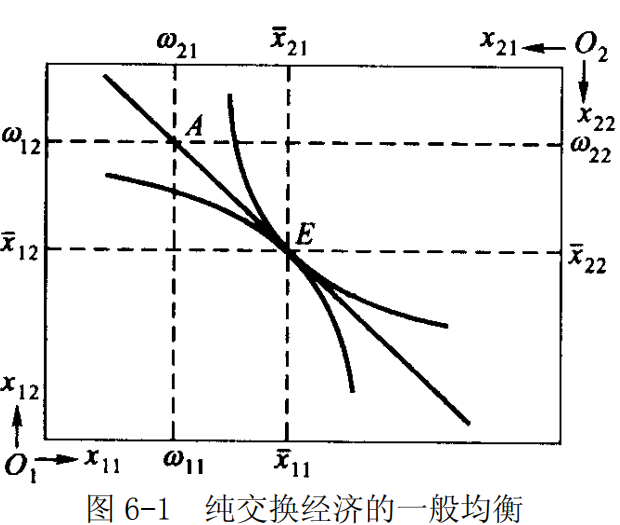

（2）纯交换经济是指只有交换而没有生产的经济。假定在纯交换经济中两个消费者交换两种商品，第 i 个

消费者最初拥有的第 j 种商品的数量为 $w_{ij}$ ，而选择的消费者数量为 $x_{ij}$  。

对于整个经济而言，社会拥有的两种商品的数量分别为：

$$w_1=w_{11} + w_{21}$$

和  $$w_2=w_{12}+w_{22}$$

假定两种商品的价格为 $p_1$ 和 $p_2$ 。效用最大化的消费者在既定的价格水平下决定最优的消费量。需要注意，
此时消费者的收入来源于其初始财富拥有量。第一个消费者的行为可以概括为：

$$\begin{cases}
\max & u_{1}\left(x_{11}, x_{12}\right) \\
x_{11}, x_{12} & \\
\text { s. t. } & p_{1} x_{11}+p_{2} x_{12}=p_{1} \omega_{11}+p_{2} \omega_{12}
\end{cases}$$

该消费者消费不同商品的组合得到的效用满足可以由一系列凸向原点（左下角）的无差异曲线表示出来。其收入约束线 $p_{1}x_{11} +p_{2}x_{12}=p_{1}w_{11}+p_{2}w_{12}$ 是斜率为 $(-p_1/p_2)$ 并经过初始点 $(w_{11},w_{12})$ 的直线。在既定的价格下，消费者在这一预算约束线上选择效用最大化的商品组合，即预算约束线与无差异曲线的切点对应的消费组合 $(\bar{x_{11}},\bar{x_{12}})$ ,此时该消费者处于局部均衡状态。对于第二个消费者也有类似的局部均衡。

显然在埃奇沃斯框图中，第二个消费者的预算约束线与第一个消费者的重合。这样，当 $(\bar{x_{11}}-w_{11})+(\bar{x_{21}}-w_{21})=0$ 时，第一种商品的市场处于均衡。此时，两个消费者选择的最优点重合。第二种商品也同样。但在图中不难发现，只要第一种商品的市场处于均衡，第二种商品也一定处于均衡。由此决定的价格（实际上是相对价格）即为一般均衡价格。

#### 3．什么是帕累托最优配置？其主要条件是什么？

- （1）如果对于某种既定的资源配置状态，所有的帕累托改进均不存在，即在该状态上，任意改变都不可能使至少有一个人的状况变好而又不使其他任何人的状况变坏，则称这种资源配置状态为帕累托最优状态。

- （2）达到帕累托最优状态所必须满足的条件被称为帕累托最优条件，它包括交换的最优条件、生产的最优条件以及交换和生产的最优条件。

①交换的帕累托最优条件：在交换方面，任何一对商品之间的边际替代率对任何使用这两种商品的个人来说都相等，即 $RCS_{XY}^A = RCS_{XY}^{B}$ 。

②生产的帕累托最优条件：在生产方面，任何一对生产要素之间的边际技术替代率在用这两种投入要素生产的所有商品中都相等，即 $RTS_{LK}^{X}=RTS_{LK}^{Y}$ 。

③交换和生产的帕累托最优条件：任何一对商品之间的生产的边际转换率等于消费这两种商品的每个人的边际替代率，即 $RCS_{XY}=RPT_{XY}$ 。

#### 4．为什么说完全竞争市场可以处于帕累托最优状态？

- （1）帕累托最优状态是用于判断市场机制运行效率的一般标准。
帕累托最优状态是指，在既定资源配置状态下，任意改变都不可能使至少有一个人的状况变好而又不使其他任何人的状况变坏，即不存在帕累托改进，则称这种资源配置状态为帕累托最优状态。
一个经济实现帕累托最优状态，必须满足三个必要条件：
	- ①任何两种商品的边际替代率对于所有使用这两种商品的消费者来说都必须是相等的；
	- ②任何两种生产要素的边际技术替代率对于任何使用这两种生产要素的生产者来说都必须是相等的；
	- ③任何两种商品对于消费者的边际替代率必须等于这两种商品对于生产者的边际转换率。

- （2）完全竞争市场之所以总可以实现帕累托最优状态，可以从满足帕累托最优状态的三个必要条件分别加以说明。
- ①从交换的最优条件来看，在完全竞争市场条件下，单个消费者都是价格的接受者，每个消费者都会调整对商品的需求以满足 $RSC_{XY}=\frac{P_X}{P_Y}$ 从而实现效用最大化。既然各消费者都是价格的接受者，那么各消费者购买任意两种商品的数量必使其边际替代率等于全体消费者所面对的共同的价格比率。因此，任何两种商品的边际替代率对所有的消费者都相等。

- ②从生产的最优条件来看，在完全竞争市场条件下，单个生产者都是要素价格的接受者，每个生产者都会调整要素的需求以满足 $RTS_{LK}=\frac{P_L}{P_K}$ 从而实现利润最大化。既然各生产者都是要素价格的接受者，那么各生产者购买并使用的任意两种要素的数量必使其边际技术替代率等于全体生产者所面对的共同的要素价格比。因此，任何两种要素的边际技术替代率对所有生产者都相等。

- ③从生产和交换的最优条件来看，任何两种产品生产的边际转换率即为两种商品的边际成本之比，每一消费者对任何两种商品的边际替代率等于其价格比。在完全竞争条件下，任何产品的价格等于边际成本，因此，任何两种产品的边际替代率等于它们的边际转换率。

- （3）综上所述，在完全竞争条件下，帕累托最优的三个必要条件都可以得到满足。换而言之，在完全竞争的市场机制作用下，整个经济可以达到帕累托最优状态，这样的经济必定是最优效率的经济。

#### 5．西方微观经济学是如何论证“看不见的手”原理的？

答：从亚当·斯密开始，经济学家就认为在完全竞争的市场经济中，市场机制像一只“看不见的手”，时刻调整着人们的经济行为，从而使整个经济社会的资源配置达到帕累托最优状态。

- （1）产品市场

- ①对消费者而言，其行为目标是追求最大效用。消费者在追求最大效用的过程中，由于“看不见的手”的作用，最终将用有限的收入在商品中进行选择而获得最大效用，从而得到一条向右下方倾斜的需求曲线，曲线上的点都是消费者最大效用的均衡点。
- ②对生产者而言，其行为目标是利润最大化。生产者追求最大利润的过程中，必然导致他们能以最优的生产要素组合，从而以最低的成本生产，最终得到一条向右上方倾斜的供给曲线。供给曲线上的每一点都是市场上最大利润的均衡点。
- ③需求曲线和供给曲线的共同作用决定了产品市场的均衡价格和均衡数量。这时，消费者最大地满足了自己的欲望，厂商获得了最大的利润。

- （2）要素市场

- ①对厂商而言，为了追求最大利润，厂商以边际产品价值等于边际要素成本的原则来使用生产要素。根据这个原则，可以得到一条向右下方倾斜的要素需求曲线。
- ②对要素供给者，即消费者而言，为了追求效用最大化，在一定的要素价格水平下，要素供给者必然要使“要素供给”资源的边际效用等于“保留自用”资源的边际效用，根据这个原则，可以得到一条向右上方倾斜的要素供给曲线。
- ③要素供给曲线和需求曲线的交点决定了最优的要素价格和最优的要素使用量。

- （3）一般均衡理论

前面对产品市场和要素市场的分析，都是以单个的市场为基础，市场均衡状态是局部均衡。此时，一种产品或者生产要素的价格只受到自身的需求条件和供给条件的影响，其他商品和要素的价格被视为不变。在一般均衡理论中，所有商品或者生产要素的价格是相互影响的。依据一定的假定条件，完全竞争市场存在一般均衡，此时，所有的产品和生产要素市场同时达到均衡状态。

- （4）福利经济学

前面的论述只是说明了“看不见的手”的作用导致整个经济处于均衡状态，那么，这种均衡状态是否具有经济效率呢？福利经济理论提出了判断福利水平的帕累托标准。同时，完全竞争市场的一般均衡是帕累托最优的，所有人都没有了在不影响他人的条件下福利改进的可能。所以，在完全竞争的资本主义市场经济中，人们在追求自己的私人目的的时候，会在一只“看不见的手”的指导下，实现增进社会福利的社会目的。

### 三、计算与证明

#### 纯交换经济符合帕累托最优状态的条件是什么？证明你的结论。

- （1）纯交换经济是指只有交换而没有生产的经济。
纯交换经济符合帕累托最优状态的条件是：任何一对商品之间的边际替代率对任何使用这两种商品的个人来说都相等，即：

$$RCS_{XY}^{A}=RCS_{XY}^{B}$$

- （2）如果上述条件得不到满足（即 $MRCS_{XY}^{A} \ne  MRCS_{XY}^{B}$ ），那么在两种商品的总量既定的条件下，两个消费者还可以通过交换在不影响他人的条件下，至少使得一个人的情况得到改善。
假定 $RCS_{XY}^{A} =2$  ，而 $RCS_{XY}^{B} =1$  。
这表明，在第一个消费者看来，1 单位 X 可以替换 2 单位Y ；而在第二个消费者看来，1 单位 X 可以替换 1 单位Y 。这时如果第二个消费者放弃一单位 X ，他需要一单位Y ，即可以与原有的效用水平相等。把一单位 X 给予 A，这时 A 愿意拿出 2 单位Y 。这样，把其中一单位补偿给 B，则在 A 和B 保持原有效用水平不变的条件下，还有 1 单位Y 可供 A 和 B 分配。因此，存在一个帕累托改进的余地。这说明，只有两个消费者对任意两种商品的边际替代率都相等，才会实现帕累托最优状态，从而不存在帕累托改进的余地。

---

## 第 7 章 市场失灵和微观经济政策

### 一、名词解释

#### 1．市场失灵

市场失灵是指市场机制不能有效地配置资源。
垄断、外部影响、公共物品以及不完全信息都是导致市场失灵的重要原因和主要表现。
西方经济学者认为，在现实社会中，种种原因将导致市场失灵，即市场机制的运转无法使社会资源达到最优配置，无法实现社会经济福利的最大化等社会目标。因此，市场机制的作用并不是万能的，必须通过政府对经济的干预来加以克服。

#### 2．公共物品

通常把不具备排他性或（和）竞争性，一旦生产出来就不可能把某些人排除在外的商品称为（纯）公共物品。商品的排他性是指商品的生产者或者购买者可以很容易地把他人排斥在获得该商品带来的利益之外；商品的竞争性是指消费商品的数量与生产这一数量的成本有关。

#### 3．免费乘车者问题

免费乘车者问题是指经济中由于存在不支付即可获得消费满足而产生的市场失灵问题。产生的原因是商品的非排他性。既然每个消费者都是经济上理性的，而公共物品又具有非排他性，那么每个消费者都将利用这一点，在不支付费用的条件下享受商品的效用。由于商品的非排他性，拥有或消费这种商品的人不能或很难把他人排除在获得该商品带来满足的范围之外。这一特征及其相应的问题被形象地称为搭便车。

#### 4．外在性

外在性又称外部经济影响，是指一个经济行为主体的经济活动对另一个经济主体的福利所产生的效应，但这种效应并没有通过市场交易反映出来。外在性有正负之分，或称为外在经济和外在不经济。

#### 5．科斯定理

科斯定理是一种产权理论。
科斯本人并未将科斯定理写成文字，科斯定理的提出是由其好友斯蒂格勒首先根据科斯于 20 世纪 60 年代发表的《社会成本问题》这篇论文的内容概括出来的。
其内容是：只要财产权是明确的，并且其交易成本为零或者很小，则无论在开始时将财产权赋予谁，市场均衡的最终结果都是有效率的。

这一结论包含三个要素：
- ①交易费用为零；
- ②产权界定清晰；
- ③自由交易。

由此引申出来的第二定理是：
在交易费用不为零的条件下，不同的产权制度会影响到资源配置的效率。科斯定理现已成为制度经济学的一个重要结论。

#### 6．逆向选择

逆向选择指在次品市场上出现的高质量产品遭淘汰而低质量产品生存下来的现象。
处于信息劣势的一方，往往按平均水平推测产品的质量，从而导致高质量产品的交易价格偏低，交易数量较少，甚至可能导致只有次品才能成交的逆向选择。

#### 7．道德风险

道德风险是指交易双方在签订交易合约后，信息占优势的一方为了最大化自己的收益而损坏另一方，同时也不承担后果的一种行为，即是市场的一方不能查知另一方的行动一种情形，又被称作隐藏行动问题。道德风险的存在不仅使得处于信息劣势的一方受到损失，而且会破坏原有的市场均衡，导致资源配置的低效率。

### 二、论述题

#### 1．市场为什么会出现失灵？政府应该采取哪些措施？

市场失灵是指市场机制不能有效地配置资源。垄断、外部影响、公共物品以及不完全信息都是导致市场失灵的重要原因和主要表现。

- （1）垄断及其矫正措施

实际上，只要市场不是完全竞争的（垄断、垄断竞争或寡头垄断），当价格大于边际成本时，就出现了低效率的资源配置状态。垄断的产生使得资源无法得到最优配置，从而导致市场失灵。由于垄断会导致资源配置缺乏效率，因此也就产生了对垄断进行公共管制的必要性。政府对垄断进行公共管制的方式或政策主要包括以下几种：

- ①控制市场结构，避免垄断的市场结构产生；
- ②对垄断企业的产品价格进行管制；
- ③对垄断企业进行税收调节；
- ④制定反垄断法或反托拉斯法；
- ⑤对自然垄断企业实行国有化。

-（2）外部影响及其矫正措施

外部影响是指一个经济活动的主体对他所处的经济环境的影响。
外部影响会造成私人成本和社会成本之间，或私人收益和社会收益之间的不一致，因此容易造成市场失灵。外部影响的存在造成了一个严重后果：市场对资源的配置缺乏效率。换句话说，即使假定整个经济仍然是完全竞争的，由于存在着外部影响，整个经济的资源配置也不可能达到帕累托最优状态。就外部影响所造成的资源配置不当，微观经济学理论提出以下政策建议：
- ①使用税收和津贴；
- ②使用企业合并的方法；
- ③使用规定财产权的办法。

- （3）公共物品及其矫正措施

对于公共物品而言，市场机制作用不大或难以发挥作用。
因为公共物品由于失去竞用性和排他性，增加消费并不会导致成本的增加，消费者对其支付的价格往往是不完全的，甚至根本无需付费。在此情况下，市场机制对公共物品的调节作用就是有限的，甚至是无效的。

由于公共物品的消费存在免费搭便车的问题，很难通过竞争的市场机制解决公共物品的有效生产问题。在此情况下，由政府来生产公共物品应是一种较好的选择。对于大多数有特殊意义的公共物品，由政府或政府通过组建国有企业来生产或向市场提供，是一种不错的选择，例如国防、公安等。

政府应提供多少公共物品才能较好地满足社会需要，使资源得到有效利用是问题的难点所在。现在更多的推荐采用非市场化的决策方式，例如投票，来表决公共物品的支出水平。显然，虽然用投票的方法决定公共物品的支出方案是调节公共物品生产的较好方法，但投票方式并不总能获得有效率的公共物品的支出水平。

- （4）不完全信息及其矫正措施

信息不完全是指经济当事人对信息不能全面地把握，不能完全利用交易有关的信息。
在现实生活中，供求双方的信息通常具有不对称性或不完全性。一旦供求双方所掌握的信息不完全，就会对市场机制配置资源的有效性产生负面影响，造成市场失灵。由信息不完全导致的后果通常包括逆向选择、道德风险和委托—代理问题。
信息的不对称性和信息的不完全性会给经济运行带来很多问题，而市场机制又很难有效地解决这些问题，在此情况下，就需要政府在市场信息方面进行调控。政府解决信息不对称和委托—代理问题的方法主要有：

- ①针对由于信息不对称产生的逆向选择问题，可以通过有效的制度安排或采取适当的措施来消除信息不充分所造成的影响；
- ②解决委托—代理问题最有效的办法是实施一种最优合约，即委托人花费最低限度的成本而使得代理人采取有效率的行动实现委托人目标的合约。

#### 2．结合垄断厂商的均衡，论垄断的效率及其政府对策。

（1）垄断是只有一个厂商提供全部市场供给的一种市场结构。
	垄断厂商的目标仍是利润最大化，故也会把产量选择在边际收益等于边际成本之点。

如图 7-1 所示，横轴表示厂商产量，纵轴表示价格，曲线 $D$ 和 $MR$  分别表示厂商的需求曲线和边际收益曲线。
假定平均成本和边际成本相等且固定不变，由直线 $AC=MC$ 表示。为了使利润极大，厂商产量定在$Q_2$ ，价格为 $P_2$ ，它高于边际成本，说明没有达到帕累托最优，因为这时消费者愿意为增加额外一单位所支付的数量（价格）超过生产该单位产量所引起的成本（边际成本）。显然，要达到帕累托最优，产量应增加到 $Q_1$ ，价格应降到  $P_1$ ，这时 $P=MC$ 。然而，垄断决定的产量和价格只能是 $Q_2$ 和 $P_2$ 。如果产量和价格是完全竞争条件下的产量 $Q_1$ 和价格 $P_1$ ，消费者剩余是 $\Delta F P_1 H$ 的面积，而当垄断者把价格提高到 $P_2$  时，消费者剩余只有 $\Delta F P_2 G$ 的面积，所减少的消费者剩余的一部分（图 $P_1P_2GI$ 所代表的面积）转化为垄断者的利润，另一部分（ $\Delta GIH$ 所代表的面积）就是由垄断所引起的社会福利的纯损失，它代表由于垄断造成的低效率带来的损失。

- （2）由于垄断常常导致资源配置缺乏效率，另外垄断利润也被看成是不公平的，因而有必要对垄断进行政府干预。
政府对垄断的干预主要有反垄断法和价格与产量管制。为了消除垄断的影响，政府可以采取反垄断政策。针对不同形式的垄断，政府可以分别或同时采取行业的重新组合和处罚等手段，而这些手段往往是依据反垄断法来执行的。制止垄断行为可以借助于行政命令、经济处罚或法律制裁等手段。反垄断法则是上述措施的法律形式。

- ①行业的重新组合的基本思路是把一个垄断的行业重新组合成包含许多厂商的行业。采取的手段可以是分解原有的厂商，或扫除进入垄断行业的障碍。制止垄断行为可以借助于行政命令、经济处罚或法律制裁等手段。

- ②行业的管制主要是对那些不适合过度竞争的垄断行业，如航空航天、供水等行业所采取的补救措施。政府往往在保留垄断的条件下，对于垄断行业施行价格控制，或价格和产量的双重控制、税收或津贴以及国家直接经营等管治措施。由于政府经营的目的不在于最大利润，所以可以按照边际成本或者平均成本决定价格，以便部分地解决垄断所产生的产量低和价格高的低效率问题。

- ③管制自然垄断的做法还可以采用为垄断厂商规定一个接近于“竞争的”或“公正的”资本回报率，它相当于等量的资本在相似技术、相似风险条件下所能得到的平均市场报酬。由于资本回报率被控制在平均水平，也就在一定程度上控制住了垄断厂商的价格和利润。

#### 3．论外在性对经济效率的影响及其对策。

- （1）无论是消费的外在性还是生产的外在性，无论是正向外在性还是负向外在性，它们产生的影响都是在完全竞争条件下，资源配置将偏离帕累托最优状态。
	换句话说，即使整个经济仍然是完全竞争的，但由于存在着外部影响，整个经济的资源配置也不可能达到帕累托最优状态。外在性之所以产生这样严重的后果，其主要原因是外部影响导致决定社会最优的边际收益和边际成本与决定私人最优的边际收益和边际成本出现不同。以生产中出现负向外在性为例。假定某私人厂商对经济社会中的他人产生负向的外部经济影响，并且该厂商并未在其决策中考虑这一点，则社会边际成本大于私人边际成本。在需求既定从而边际收益既定的条件下，私人厂商将会按私人边际成本等于私人边际收益决定产量，而社会最优的产量则取决于社会边际成本等于边际收益。因此，社会需要的产量小于私人的最优产量，即在负向外在性存在的条件下，完全竞争市场的供给过剩。同样的道理，在存在正向外在性的条件下，与社会最优产量相比，私人厂商的生产量不足。由此可见，外在性的存在导致资源配置失当。

- （2）外在性的解决对策

为了纠正由于外部影响所造成的资源配置不当，政府通常可采取以下政策：

- ①使用税收和津贴。对造成外在不经济的企业，国家应该征税，其数额应该等于该企业给社会其他成员造成的损失，从而使该企业的私人成本恰好等于社会成本。

- ②使用企业合并的方法。把产生外在经济影响的经济单位与受到外在影响的经济单位合并在一起，则外在影响就变成为一个单位的内部问题了。合并后的单个企业在边际成本等于边际收益处进行生产，将会符合社会要求的社会边际成本等于社会边际收益决定的量，即此时资源配置达到帕累托最优状态。

- ③使用规定财产权的办法。在许多情况下，外在影响之所以导致资源配置失当，是由于财产权不明确。如果财产权是完全确定的并得到充分保障，则有些外在影响就可能会通过产权的交易得到解决。这一思想体现在科斯定理之中：只要产权明晰，那么在交易成本为零的条件下，无论初始产权的规定如何，市场均衡的最终结果都是有效率的。这样，对外在性问题，只要规定产生外在性的经济单位有权制造它，或者规定受到外在性影响的单位有权拒绝它，则通过这项权利的自由交换，经济当事人会以最低的成本寻求解决方案。

以上纠正外在性的方法在实践中针对不同的情况加以使用。

#### 4．信息不完全何以会造成市场失灵？

信息不完全（或不对称）指市场的供求双方对于所交换的商品不具有充分的信息。信息非对称会导致资源配置不当，减弱市场效率，并且还会产生道德风险和逆向选择。在很多情况下，市场机制并不能解决非对称信息问题。

- （1）逆向选择

逆向选择指在买卖双方信息非对称的情况下，差的商品总是将好的商品驱逐出市场；或者说拥有信息优势的一方，在交易中总是趋向于做出尽可能有利于自己而不利于别人的选择。逆向选择的存在使得市场价格不能真实地反映市场供求关系，导致市场资源配置的低效率。一般在商品市场上卖者关于产品的质量、保险市场上投保人关于自身的情况等等都有可能产生逆向选择问题。解决逆向选择问题的方法主要有：政府对市场进行必要的干预和利用市场信号。

- （2）道德风险
道德风险指在双方信息非对称的情况下，人们享有自己行为的收益，而将成本转嫁给别人，从而造成他人损失的可能性。道德风险的存在不仅使得处于信息劣势的一方受到损失，而且会破坏原有的市场均衡，导致资源配置的低效率。道德风险分析的应用领域主要是保险市场。解决道德风险的主要方法是风险分担。

- （3）委托人—代理人问题

由于信息的不完全性，委托人往往不知道代理人要采取什么行动或者即使知道代理人采取某种行动，也不能观察和测度代理人从事这一行动时的努力程度，同时两者之间存在的利益分割关系，通常会使得代理人不完全按照委托人的意图行事，这在经济学上被称为委托—代理问题。由委托人—代理人问题而导致的效率损失不可能通过政府的干预解决，而需要通过设计有效的激励措施加以解决。解决委托人—代理人问题最有效的办法是实施一种最优合约。最优合约是委托人花费最低限度的成本而使得代理人采取有效率的行动实现委托人目标的合约。

---

## 第 8 章 宏观经济活动与宏观经济学

### 一、名词解释

#### 1．国内生产总值

国内生产总值（GDP）是指经济社会（一国或一个地区）在一定时期内运用生产要素所生产的全部最终产品和劳务的市场价值总和。
GDP 常用于衡量一国的经济产出水平和经济发展程度。GDP 通常采用支出法和收入法这两种方法来进行核算。用支出法计算的国内生产总值等于消费、投资、政府支出和净出口之和；用收入法计算的国内生产总值等于工资、利息、租金、利润、间接税和企业转移支付和折旧之和。

#### 2．国民生产总值

国民生产总值（GNP）是指某国国民在一个既定的时期内所拥有的全部生产要素所生产的最终产品的市场价值总和，即本国常住居民所生产的最终产品市场价值的总和。
无论劳动力和其他生产要素处于国内还是国外，只要是本国国民生产的产品和劳务的价值都计入国民生产总值。这项综合经济指标未扣除生产过程中资本损耗的折旧费用，所以称为“总值”。

#### 3．个人可支配收入

个人可支配收入是指居民家庭全部现金收入中能用于安排家庭日常生活的那部分收入，即用家庭中得到的全部现金收入减去个人所得税、减去记账补贴及家庭从事副业生产支出的费用。
个人收入不能全归个人支配，因为还要缴纳个人所得税，因此，税后的个人收入才是个人可支配收入，即人们可随意用来消费和储蓄的收入。

#### 4．失业率

失业率是指一定时期内失业人数占劳动力总数（就业人数与失业人数之和）的比率。失业率有登记失业率和调查失业率两类。失业率用公式表示为：

$$失业率=\frac{失业人数}{劳动力总数}\times 100\%$$

#### 5．名义的和实际的国民收入

（1）名义的国民收入是按物品和劳务当年的价格计算所得的国民收入，它没有考虑通货膨胀因素。由于通货膨胀等原因，价格可能会发生强烈变化，故为方便比较而引入了实际国民收入的概念。

（2）实际的国民收入是以从前某一年为基年，按基年价格计算所得的国民收入，或者说是用价格指数折算之后的国民收入。

名义国民收入和实际国民收入二者之间的关系式为：$$实际国民收入=名义国民收入 \div 价格折算指数$$ 。

### 二、简述题

#### 1．使用收入和支出方法进行国民收入核算时应注意哪些问题？

使用收入和支出法核算国民收入需要注意以下问题：

- （1）国民生产总值是以一定时间为条件的，因而当期发生的其他时期的产品支出或收入不应该计入本期的GDP 中，避免重复计算。
- （2）国内生产总值以最终商品及劳务的市场价值，因而，中间投入不应计算在内，避免重复计算。
- （3）核算出的国内生产总值是以货币量表示的，因而有名义和实际国内生产总值之分。
- （4）在理论分析中，核算的目的在于说明经济中生产量的大小，即商品和劳务的实际价值。因而，以当期价格测算的 GDP 要经过价格指数的折算：$实际 GDP＝名义 GDP／GDP 折算指数$ 。作为 $GDP$ 折算指数的通常是价格总水平。

#### 2．国民收入核算与总需求和总供给分析的关系如何？

- （1）国民收入核算是对一国经济在一定时期内经济运行的一个结算。国民收入核算为宏观经济均衡分析（总需求和总供给均衡分析）提供了某种启示。

- ①国民收入核算可以运用支出法和收入法来衡量。从事后的角度来看，如果忽略统计误差，用支出法与收入法核算的国民收入必然恒等。事后，支出与收入恒等所对应的国民收入越大，经济运行越好。从另一个角度来看，为了说明经济运行结果，则可以考察经济运行之外的支出和收入状况。这样，国民收入核算恒等式反映了最初的支出与收入相互作用的均衡条件。

- ②如果经济处于均衡（总需求等于总供给），经济运行的结果将是核算的结果。因此，为了分析国民收入的决定因素，把经济中的支出和收入分别置于事先加以考察，则恒等式恰好为这些因素运行的均衡条件。

- （2）对应于任意给定的一个价格总水平，一国经济的总需求则由消费需求、投资需求、政府需求和来自于国外的需求构成，作为总供给的消费品和投资品供给则表现为持有这些商品和劳务的所有者的消费、也就是说，构成经济均衡条件的两种力量以事先计划的形式加以考察，就演变为分析中的总需求和总供给。

---

## 第 9 章 简单国民收入决定理论

### —、名词解释

#### 1．消费函数

消费函数又称消费倾向，是描述消费与收入水平之间关系的函数。
在价格总水平不变的条件下，家庭部门的消费支出主要取决于收入水平，因此，消费函数可以用公式表示为：

$$C=C(Y)$$

通常，随着收入的增加，消费支出也会增加，但不及收入增加的快，即边际消费倾向递减。

#### 2．边际消费倾向

边际消费倾向指增加 1 单位收入中用于增加消费部分的比率，其公式为：

$$MPC=\frac{\Delta C}{\Delta Y}$$

式中， $\Delta C$ 表示增加的消费， $\Delta Y$ 表示增加的收入。按照凯恩斯的观点，收入和消费之间存在着一条心理规律：随着收入的增加，消费也会增加，但消费的增加不及收入增加多。因此，一般而言，边际消费倾向在 0 和 1之间波动。

#### 3．储蓄函数

储蓄是收入中未被消费的部分，因而它取决于收入。储蓄函数是用于表示储蓄的数量随着收入的数量变化而发生变化的关系式。储蓄函数的一般形式为：

$$S=Y-C$$

式中， $S$ 代表储蓄数量；$Y$  代表收入数量；$C$ 代表消费数量。

#### 4．边际储蓄倾向

边际储蓄倾向是指当人们的收入每变动（增加或减少）1 个单位时，其储蓄所发生的相应的变动额，也可以理解为在增加的收入中储蓄所占的比例。
用公式表示为： $$MPS=\frac{\Delta S}{\Delta Y}$$

，且总大于 0 而小于 1。

#### 5．投资乘数

在其他条件不变的情况下，假定自主投资增加 1 个单位，那么均衡国民收入将增加  $\frac{1}{1-\beta}$ 倍，其中 $\beta$ 表示边际消费倾向。即如果投资增加 $\Delta I$ ，则均衡国民收入增加量为：$\Delta Y=\frac{\Delta I}{1 - \beta}$ ，这一结论被称为投资乘数定理。

#### 6．税收乘数

在其他条件不变的情况下，假定定量税收增加 1 个单位，那么根据均衡收入决定的条件，均衡国民收入将增加 $-\frac{\beta}{1- \beta}$ 倍。如果税收增加 $\Delta T$ ，则均衡国民收入增加量为 $\Delta Y=-\frac{\beta \Delta I}{1-\beta}$ ，这一结论被称为税收乘数定理。

#### 7．平衡预算乘数

平衡预算乘数指在保持政府财政预算平衡的条件下，政府收入和支出同时以相等数量增加或减少时国民收入变动相对于支出变动的比率，如果政府购买支出和税收同时增加一单位，因支出增加国民收入增加  $\frac{1}{1-\beta}$ ，因税收增加国民收入增加 $(-\frac{\beta}{1-\beta})$ 。因此，政府支出及税收同时变动 $\Delta G(\Delta T)$时，均衡国民收入的变动量为：

$${\Delta Y}=\frac{\Delta G}{1-\beta}-\frac{\beta \Delta T}{1-\beta}=\Delta G(=\Delta T)$$

### 二、简述题

#### 1．为什么说投资等于储蓄（I = S ）是简单国民收入决定的基本均衡条件？国民收入的变动机制是什么？

- （1）一般而言，经济中的均衡国民收入由社会的总支出与总收入均等时所决定。在社会总收入既定的条件下，当社会总需求变动时，会引起产量变动。经济社会的产量或国民收入决定于总支出或总需求，总需求决定的产出就是均衡产出。当产出水平等于总需求水平时，企业生产就会稳定下来。

- （2）简单的国民收入决定理论仅包括对产品市场的分析。在简单国民收入决定理论中，假定经济社会中只有家庭和企业两个部门。在两部门经济中，总支出（或总需求）由消费和投资构成，若用 $AE$ 表示总支出，$Y$ 表示收入，$C$ 和 $I$ 分别表示消费和投资，用支出方法核算国民收入，则均衡产出可用公式表示为 $AE=C+I$  。在两部门经济中，总收入又可由消费和储蓄构成，用收入方法核算国民收入，即有 $Y= C+S$ 。因此，收入与支出相等的均衡条件可以表示 $AE= Y$ ，即 $I = S$ 。由此可见，投资等于储蓄是均衡条件的基本形式。

- （3）国民收入变动的机制是靠经济中的企业部门调整其产量来实现的：

- ①若社会的收入超过需求，企业的产品就会出现积压，从而导致库存增加。为了适应市场，企业就会减少生产。
- ②若社会收入低于社会总需求，企业的库存就会减少，从而企业增加生产。因此，企业根据社会总需求来安排生产，最终将导致社会处于总收入等于总支出的均衡状态。

#### 2．简述产品市场的均衡条件并加以简要评论。

- （1）在国民收入中，总支出由消费支出和投资支出构成。如果表示总支出，那么 $AE=C+I$ 。总收入 $Y$ 有两个用途：消费 $C$ 和储蓄 $S$ ，所以 $Y= C+S$  。产品市场均衡条件是总支出等于总收入。于是有 $C+I= C+S$  ，那么投资等于消费，即  $I =S$ 。只要这个均衡条件得到满足，产品市场的实现问题就能解决，社会总产品的流通就能顺利进行。

- （2）凯恩斯的有关产品市场的均衡条件存在以下不足：

	- ①产品市场的均衡条件混淆了储蓄和资本积累。资本积累是剩余价值的资本化，它发生在企业内部而不是发生家庭部门。信用制度固然打破了企业货币资本量的限制，然而即使在信贷关系相当发达的现代资本主义条件下，投资仍然主要源于资本积累。至于家庭储蓄，这不过是补充。

	- ②产品市场均衡条件中的投资和储蓄，是经济主体依据自己的心理规律进行决策的结果，因而它们都是捉摸不定的东西，很难对二者真正加以讨论。

#### 3．在简单的国民收入决定模型中加入政府变动将如何影响均衡国民收入的决定？

- （1）宏观经济学把包括家庭部门、企业部门和政府部门的经济称为三部门的经济。三部门经济是在原来两部门（家庭部门和企业部门）的基础上加入政府部门得到的。

- （2）加入政府部门之后，经济的总支出和总收入的构成都会发生变动。从总支出角度来看，总支出包括消费、投资和政府购买。
	- 首先，假定政府购买是政府控制量，在决定国民收入时可以认为是一个常数，即 $G=G_0$ 。
	- 其次，政府的税收影响了居民的可支配收入，从而对私人消费产生影响。政府的税收可以是比例税，也可以是定量税。前者根据税基的大小征收，后者则与税基大小无关。

	为了简化分析，假定政府只对收入征收定量税。假定政府征收的定量税为 $T_0$ ，于是消费者的个人可支配收入 $Y_d=Y-T_0$ 。因此，消费函数为：
	$$C=\alpha + \beta Y_d= \alpha + \beta(Y -T_0)$$

	从而，由计划支出与计划收入的均衡所决定的国民收入可以由下列条件得到：
	$$C+I+G=\alpha + \beta(Y-T_0)+I_0+G_0=Y$$

即：  $$Y=(\alpha - \beta T_0 +I_0 +G_0)/(1-\beta)$$
。

从均衡结果可以看出，投资和政府购买增加将导致均衡收入增加，而税收增加将导致均衡收入减少。

#### 4．简述凯恩斯的乘数理论，并指出其发挥作用的条件。

- （1）乘数原理指各种支出的变动所引起的国民收入数倍变动的效应。
其中支出的变动既包括私人投资和政府购买的变动，也包括税收和政府转移支付的变动。如果是支出中投资的增加，则乘数是投资乘数；如果是支出中政府支出的增加，则乘数是政府支出乘数。凯恩斯的乘数理论说明了经济中各种支出变动对国民收入变动的影响。

- （2）这里以投资乘数定理来说明这一点。
投资乘数指收入变化与带来这种变化的投资支出的变化之间的比率。用公式表示为：

$${\Delta Y}=\frac{\Delta I}{1-\beta}$$

其中， $\beta$ 为家庭部门的边际消费倾向，$\frac{1}{1-\beta}$ 即为投资乘数，说明国民收入的改变量与引起这种改变的投资（政府购买）改变量成正比，与边际储蓄倾向成反比。投资乘数说明在其他条件不变的情况下，当经济中投资增加后，由于总需求增加会导致产出量的增加，但这种增加可以引起连锁反应：收入的增加又会引起消费者消费数量的增加，从而进一步增加总需求，以至于最终将会使得总收入成倍增加。总之，乘数理论提示了现代经济的特点，即由于经济中各部门之间的密切联系，某一部门支出（需求）的增加不仅会使该部门的生产和收入相应增加，而且还会引起其他部门的生产、收入和支出的增加，从而使国民收入增加量数倍于最初增加的支出。

- （3）乘数原理发挥作用的条件
	- ①社会中存在闲置资源，即社会中存在过剩生产能力。如果没有过剩生产能力，没有闲置资源，则投资增加及由此造成的消费支出增加，并不会引起生产增加，只会刺激物价水平上升。
	- ②投资和储蓄决定的相互独立性。要假定它们相互独立，否则，乘数作用要小得多，因为增加投资所引起的对货币资金需求的增加会使利率上升，而利率上升会鼓励储蓄，削弱消费，从而会部分地抵消由于投资增加引起收入增加进而使消费增加的趋势。
	- ③货币供给量增加能否适应支出增加的需要。假使货币供给受到限制，则投资和消费支出增加时，货币需求的增加就得不到货币供给相应增加的支持，利率会上升，不但会抑制消费，还抑制投资，使总需求降低。
	- ④增加的收入不能用于购买进口货物，否则收入增加会受到限制。

### 三、计算与证明

#### 已知消费函数为 C = 100 + 0.6Y
，投资为自主投资， $I = 60$ ，求：
- （1）均衡的国民收入（Y ）为多少？
- （2）均衡的储蓄量（ S ）为多少？
- （3）如果充分就业的国民收入水平为 $Y_f = 1000$ ，那么，为使该经济达到充分就业的均衡状态，投资量应如何变化？
- （4）本题中投资乘数（ k ）为多少？

答：

- （1）根据国民收入的构成：

$$Y=C+I=100+0.6Y+60$$

解得均衡的国民收入为： $Y = 400$ 。

- （2）当 $S=I$  时，产品市场处于均衡状态。因此，均衡储蓄量 $S=I=60$ 。
- （3）充分就业的国民收入水平为 $Y_f = 1000$ ，则当经济实现充分就业均衡时，消费为：

$$C=100+0.6\times 1000=700$$

那么储蓄为：

$$S=Y_f -C = 1000 - 700 = 300 $$

。因此，在充分就业均衡状态时，投资量为：

$$I=S=300$$

可见，均衡国民收入增加，投资增加。

- （4）投资乘数为：$$k=\frac{\Delta Y}{\Delta I}=\frac{1000-400}{300-60}=2.5$$ 。

---

## 第 10 章 产品市场和货币市场的-般均衡

### 一、名词解释

#### 1．资本的边际效率

资本的边际效率是一种贴现率，这一贴现率恰好使一项资本品在使用期内各预期收益的贴现值之和等于

该项资本品的供给价格和重置成本。即：

$$R_0=\frac{R_1}{1+r_c}+\frac{R_2}{(1+r_c)^{2}}+\cdots+\frac{R_n}{(1+r_c)^{n}}$$

式中： $R_0$ 为一项资本品的价格； $R_1,\cdots,R_n$  分别为该项资本品在未来使用期内所有的预期收益； $r_c$ 即为该项资本品的边际效率。由于资本的边际效率反映了投资者对预期收益的估计，因而资本的边际效率也被称为预期利润率。由上式可知，预期收益的减少与重置成本的上升都会使资本边际效率递减。

#### 2．投资函数

以资本的边际效率不变为条件，投资取决于利息率，并且是利率的减函数，投资与利息率呈反方向变动关系，用公式表示为：

$$I=I(r)$$

#### 3． IS 曲线

答： IS 曲线是将产品市场处于均衡的收入与利息率的组合描述出来的曲线。在两部门经济中，如果经济中的储蓄函数为 $S=S(Y)$ ，投资函数为 $I = I(r)$ ，那么 IS 曲线为 $S(Y)= I(r)$ 。由于均衡收入与利息率之间呈反方向变动，因而， $IS$ 曲线向右下方倾斜。

#### 4．流动偏好

流动偏好又称灵活偏好，也称流动性偏好，是指人们持有货币的偏好。由于货币是流动性最大的资产，故人们会对货币产生偏好。引起这种偏好的动机可以区分为交易动机、谨慎或预防动机和投机动机。前两种动机引起的货币需求与收入同方向变动，表示成 $L_1 (Y)$ ；而投机动机引起的货币需求则与利息率呈反方向变动，表示 $L_2{(r)}$。这样，货币需求可以概括为
$$L=L_1(Y)+L_2(r)$$。

#### 5．流动偏好陷阱

流动性陷阱又称凯恩斯陷阱或灵活陷阱，具体是指当利率水平极低时，人们对货币需求趋于无限大，货币当局即使增加货币供给也不能降低利率，从而不能增加投资引诱的一种经济状态。

#### 6． LM 曲线

LM 是描述货币市场处于均衡的利息率和国民收入的组合曲线。
在货币市场上，对应于特定的收入，货币需求与货币供给相等决定均衡利息率。但不同收入水平对应着不同的货币需求．从而决定不同的均衡利息率。收入与均衡利息率的对应关系就是 LM 曲线，用公式表示为

$$L_1{(Y)}+L_2{(r)}=m$$ 。

### 二、简述题

#### 1．简述货币市场的均衡条件并加以简要评论。

- （1）根据凯恩斯主义理论，当货币的供给等于货币的需求时，货币市场处于均衡，并相应地决定均衡的利率水平。

	- ①通常，货币供给被认为是由一国的货币当局发行并调节的一个外生变量，其大小与利息率无关，表示为 m 。故在以利息率为纵坐标，货币量为横坐标的坐标系内，货币供给曲线是一条垂直于横轴的直线。
	- ②凯恩斯主义的货币需求理论是建立在凯恩斯的流动偏好基础上的。交易动机（预防意外支出而持有一部分货币的动机）、预防动机（为应付各种意外发生的事情而形成的对货币的需求）和投机动机（为了抓住有利的购买有价证券的机会而持有一部分货币的动机）三种动机引起货币需求。其中，交易和谨慎动机所引起的货币需求与收入有关，并且随着收入的增加而增加，表示为 $L_1(Y)$ ；而投机动机引起的货币需求与利息率成反方向变动，表示为 $L_2(r)$ 。这样，货币需求可表示为：$$L=L_1(Y)+L_2(r)$$

	- ③货币市场的均衡条件可以表示为：$$L_1(Y)+L_2(r)=m$$
	 在已知收入水平的情况下，上述均衡条件决定了均衡的利率水平 $r_0$ ，如图 10-1 所示。

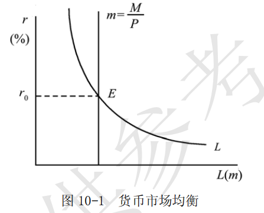

- （2）凯恩斯的货币需求理论在一定程度上发展了庇古的货币数量论，特别是明确指出投机动机而突出了利息率的作用。
	但正如有些西方学者所指出的，凯恩斯的货币理论只注意到利率和收入对货币需求的影响，而忽略了人们对财富的持有量也是决定货币需求的重要因素。此外，西方学者认为，凯恩斯把财富的构成看得过于简单，好像在现实的社会中，只有货币和债券两种资产可供人们选择，这些都是有待改进的地方。

#### 2．简述凯恩斯的货币理论。

凯恩斯的货币理论是指凯恩斯提出的名义利率是持有货币的机会成本，货币需求随利率上升而减少，利率的决定使货币供求相等的理论。
其主要内容包括：

- （1）货币的需求

凯恩斯的货币理论主要是货币需求理论。凯恩斯认为，人们需求货币是出于货币在所有资产形式中具有最高的流动性，货币需求是由人们的交易动机（预防意外支出而持有一部分货币的动机）、预防动机（为应付各种意外发生的事情而形成的对货币的需求）和投机动机（人们为了抓住有利的购买有价证券的机会而持有一部分货币的动机）三种动机引起的。
交易和预防动机引起的货币需求主要取决于人们的收入水平（同方向变动），投机动机引起的货币需求取决于利息率（反方向变动），即 $L=L_1(Y)+L_2(r)$ 。特别是，当利息率足够低时，人们预计有价证券价格不会再继续上升，因而会把货币留在手中。这时，人们对货币的需求趋向于无穷大，这种情况称为“凯恩斯陷阱”。

- （2）货币的供给

货币供给是一个存量概念，有狭义和广义之分。
- 狭义货币供给包括硬币、纸币和活期存款；
- 广义货币供给是硬币、纸币和活期存款再加上定期存款；更广义的货币供给还包括政府债券等流动资产。

货币供给是由国家用货币政策来调节的，因而是一个外生变量，其大小与利息率无关。因此，货币供给曲线是一条垂直于横轴的直线。

- （3）利息率的决定

货币供给与货币需求的均衡决定市场均衡利息率的大小。
市场利息率高于均衡利息率时，说明货币供给大于货币需求，即人们持有了超过意愿的货币量。因而，人们会将手中的货币换成有价证券，从而利息率下降。相反，如果市场利息率低于均衡利息率，则货币供给小于货币需求，这时人们感到持有的货币太少，就会卖出有价证券，证券价格下跌，亦即利率上升。只有当货币供求相等时，利率才不再变动。

#### 3．凯恩斯是如何解释资本主义经济的有效需求不足的？他所引申出的政策结论是什么？

按照凯恩斯的理论，在资本主义经济中，国民收入主要取决于社会的总需求，而社会的总需求由消费和投资构成。正是消费和投资的不足导致在总供给和总需求达到均衡状态时的社会需求不足以实现充分就业，即有效需求不足。对于消费不足和投资不足，凯恩斯运用三个基本规律，即边际消费倾向递减规律、资本边际效率递减规律以及流动性偏好来加以解释。

- （1）边际消费倾向递减规律。
>虽然人们的消费随收人的增加而增加，但在所增加的收人中用于增加消费的部分越来越少，凯恩斯认为边际消费倾向递减规律是由人类的储蓄天性所决定的。由于这一规律的作用，出现消费不足。

- （2）资本的边际效率递减规律。
>资本的边际效率是使得预期收益现值之和等于资本品价格的贴现率，它反映了厂商增加投资的预期利润率。资本的边际效率递减意味着厂商增加投资时预期利润率递减。凯恩斯认为，投资需求取决于资本边际效率与利率的对比关系。对应于既定的利息率，只有当资本边际效率高于这一利息率时才会有投资。但是，在凯恩斯看来，由于资本边际效率在长期中是递减的，除非利息率可以足够低，否则会导致经济社会中投资需求不足。

引起资本边际效率递减的原因主要有两个：
- ①投资的不断增加必然会引起资本品供给价格的上升，而资本品供给价格的上升意味着成本增加，从而会使投资的预期利润率下降；
- ②投资的不断增加，会使所生产出来的产品数量增加，而产品数量增加会使其市场价格下降，从而投资的预期利润率也会下降。资本边际效率的递减往往使资本家对未来缺乏信心，从而引起投资需求的不足。

- （3）流动偏好。
>流动偏好是指人们持有货币的心理偏好。凯恩斯认为人们之所以产生对持有货币的偏好，是由于货币是流动性或者说灵活性最大的资产，货币可随时作交易之用，可随时用于应付不测，可随时用作投机，因而人们有持有货币的偏好。当利息率降低到一定程度之后，人们预计有价证券的价格已经达到最大，从而愿意多持有货币，以致对货币的需求趋向于无穷大。结果，无论货币供给有多大，货币市场的利息率都不会再下降。由于这种心理规律的作用，利息率居高不下，当预期利润率低于或接近利息率时，厂商就不愿意进行投资，从而也导致投资需求不足。

从以上三个心理规律中可以看到，有效需求不足是导致资本主义社会出现经济萧条与失业的关键。由此，凯恩斯主张，为保持充分就业，需要用国家消费和国家投资来弥补社会中私人消费和私人投资的不足，刺激有效需求，在政策上政府应通过财政手段，如举债、增加政府购买支出、增加转移支出、减少税收等措施来刺激有效需求。凯恩斯论证了国家干预住房市场的必要性。

### 三、计算与证明

#### 已知消费函数为 C = 100 + 0.6Y（或储蓄函数），投资函数为 I=520-r，货币需求为  L=0.2Y - 4r ，货币的供给为 m = 120。

- （1）写出 $IS$ 曲线方程。
- （2）写出 $LM$ 曲线方程。
- （3）写出 $IS-LM$ 模型的具体方程并求解均衡的国民收入（ $Y$ ）和均衡的利息率（ $r$ ）各是多少？
- （4）如果自主投资由 520 增加到 550，均衡国民收入会如何变动？你的结果 与乘数定理的结论相同吗？请给出解释。

解：
- （1）通过消费函数求解储蓄函数：

$$S=Y-C=-100+0.4Y$$

并带入到  $I = S$  中得：

$$-100+0.4Y=520-r$$

整理得 IS 曲线方程为：

$$Y=1550-2.5r$$

- （2）把已知条件带入到 $L=m$ 中得：

$$0.2Y-4r=120$$

整理得 LM 的曲线方程为： $$Y=600+20r$$ 。

- （3）把 $IS$ 曲线和 $LM$ 曲线的方程联立，可以得到 $IS-LM$ 模型的具体方程为：

$$\begin{cases}
Y=1550-2.5r \\
Y=600+20r
\end{cases}$$

解这个方程组可得：均衡国民收入  $Y = 1444.44$ ，均衡利息率 $r = 42.22$ 。

- （4）当自主支出从 520 增加到 550，投资函数变为 $I = 550 - r$ ，重复（1），（2）的计算过程，解得新均衡国

民收入为： $Y^{'}=1550$ ，则均衡国民收入增量为：

$$\Delta Y = 1550-1444.44=105.56$$

消费函数定义:   $$C=\alpha  + \beta Y_d$$

当前消费函数为:  $C=100 + 0.6Y$  可得到 $\beta = 0.6$

按照乘数定理 
$$\Delta Y=\frac{\Delta I}{1-\beta}$$
当自主投资增加量为 30，即 $\Delta I=30$  时，有：

$$\Delta Y^{'}=\frac{30}{1-0.6}=75<\Delta Y=105.56$$

可见，结论与乘数定理不相同，因为乘数理论是在产品市场分析中得到，因而并没有考虑到货币市场的影响，特别是利息率的影响，因此投资不随利率的变化而变化，即投资的增量即为自主投资的变化量；
而在产品市场和货币市场的一般均衡中，由于国民收入的增加引起利率的升高，而投资为利率的减函数，因此其增加量小于自主投资的增加量，导致达到重新均衡时的国民收入增加量较低。
因此，现实中乘数理论并不一定发挥如此大的作用。

---

## 第 11 章 宏观经济政策

### —、名词解释

#### 1．财政制度

财政制度是国家对财政工作规定的一种行为规范，它是财政收支规律的反映，是一种指令性文件，具有法律效力。
财政制度包括政府的支出和收入制度。

#### 2．自动稳定器

财政制度自动稳定器，亦称内在稳定器，是指经济系统本身存在的一种会减少各种干扰对国民收入冲击的机制，能够在经济繁荣时期自动抑制通胀，在经济衰退时期自动减轻萧条，无需政府采取任何行动。

在社会经济生活中，通常具有自动稳定器作用的因素主要包括：
- 个人和公司所得税
- 失业补助和其他福利转移支付
- 农产品维持价格以及公司储蓄和家庭储蓄等。

例如，在萧条时期，个人收入和公司利润减少，政府所得税收入自动减少，从而相应增加了消费和投资。同时，随着失业人数的增加，政府失业救济金和各种福利支出必然要增加，又将刺激个人消费和促进投资。

但是，自动稳定器的作用是有限的。它只能配合需求管理来稳定经济，而本身不足以完全维持经济的稳定；它只能缓和或减轻经济衰退或通货膨胀的程度，而不能改变它们的总趋势。因此，还必须采用更有力的财政和货币政策措施。

#### 2．财政政策

财政政策是指为促进就业水平提高、减轻经济波动、防止通货膨胀、实现稳定增长而对政府支出、税收和借债水平所进行的选择，或对政府收入和支出水平所作出的决策。

财政政策工具包括变动政府购买支出、改变政府转移支付、变动税收和公债等。财政政策利用政府预算（包括税收和政府支出）来影响总需求，从而达到稳定经济的目的。其特点是政府用行政预算来直接控制消费总量和投资总量，调节国家的需求水平，使总需求和总供给达到理想的均衡状态，从而促进充分就业和控制通货膨胀。

财政政策是需求管理的一种主要手段。从内容上看，财政政策包括财政收入政策和财政支出政策。前者的政策手段主要是税率，后者的政策手段主要是政府购买（支出）。

#### 3．充分就业预算盈余

充分就业预算盈余是指既定的政府预算在充分就业的国民收入水平，即潜在的国民收入水平上所产生的政府预算盈余，即潜在的国民收入对应的财政收入与政府预算支出之间的差额。它是基于凯恩斯主义的功能财政而设立的。以此为标准，可以消除收入的周期性波动对预算状况的影响，从而更准确地反映财政政策态势。若充分就业预算盈余增加了或赤字减少了，财政政策就是紧缩的。反之，政策是扩张的。另外，还可以使政策制定者以充分就业为目标确定财政政策。

#### 4．货币政策

货币政策是指通过银行制度规定，中央银行通过控制货币供给量，进而调节利率，以便影响投资和整个经济以达到经济目标的行为。

货币政策一般也分为扩张性的和紧缩性的。在执行过程中也是逆经济风向行事的。
主要手段包括变动法定存款准备金率、变更再贴现率和公开市场业务，以及道义劝告、放宽信贷条件、放松抵押贷款数量和信贷配额等辅助性手段。

#### 5．法定准备金制度

法定准备金制度是指中央银行要求商业银行和其他储蓄机构将一定比例的储蓄存款作为准备金，防止储蓄人兑现的时候出现流动性困难的制度。

在法定准备金制度中，存款准备金占其存款总额的比例称为法定准备金率。法定准备金率因银行类型、存款种类、存款期限和数额的不同而有所差异。中央银行可以通过调整准备金率，影响金融机构的信贷资金供应能力，从而间接调控货币供应量。提高法定准备金率，是一种信用收缩的措施；降低法定准备金率，是一种信用扩张的措施，最终都会影响货币供应量的多少。法定准备金率是中央银行调节货币供应量的三大传统政策工具之一，是最猛烈的货币政策工具。

#### 6．再贴现制度

再贴现制度是指中央银行制定的用于规范其自身对商业银行及其他金融机构进行放款行为的制度。
在需要现金时，商业银行可以持合格的有价证券到中央银行进行再贴现或进行抵押贷款。这时，中央银行可以利用再贴现率执行货币政策。中央银行通过变动再贴现率影响贷款的数量和基础货币。

再贴现率变动影响商业银行贷款数量的机制是：
再贴现率提高，商业银行从中央银行借款的成本提高，商业银行向中央银行借款就会减少，从而货币供给量就会减少；再贴现率下降，商业银行从中央银行的借款成本降低，商业银行向中央银行借款就会增加，从而货币供给量增加。

#### 7．公开市场业务

公开市场业务是指中央银行在证券市场上公开买卖政府债券以控制货币供给和利率的政策行为。
在经济萧条时，中央银行买进政府债券，以增加商业银行的准备金和社会货币供应量；反之，中央银行可以卖出政府债券，以便执行紧缩性的货币政策。它是目前西方国家中央银行调节货币供应量、实现政策目标中最重要和最常用的工具。

#### 8．货币创造乘数

货币创造乘数又称为货币乘数或货币扩张乘数，是指一笔存款通过银行系统而对货币供给量所产生的倍数作用。
根据银行体系的制度规定，商业银行吸收的存款中必须以法定存款准备金率提取一定比例留作准备金，而另一部分可以由银行向客户放款，从而进一步增加货币供给量。如此继续下去，整个银行系统中最多可以创造出的货币量为：

$${\Delta M}=\frac{\Delta D}{r_d}$$

。式中： $\Delta{D}$ 为银行系统中最初增加的存款； $r_d$ 为法定存款准备金率。

### 二、简述题

### 1．商业银行体系为什么能使原始存款扩大若干倍，通过什么方式？

- （1）商业银行吸收的存款中必须以一定的比例留作准备金。这一比例是由中央银行依法规定的，故称为法定准备率。法定准备率使得银行体系可以成倍地创造货币供给。

- （2）假定法定准备率为 10%。若有一家商业银行增加了 100 元的存款，那它就可以贷款 90 元。客户将这 90元存入自己的账户，则为他开户的银行就可以放款 81 元。如此等等，银行系统中增加的存款额为：$$100+100(1-10\%)+100(1-10\%)^2+\cdots =1000（元）$$

（3）商业银行创造的存款货币被称为派生存款，指商业银行以原始存款为基础发放贷款而引伸出来超过最初部分存款的存款。它是商业银行在其超额储备的基础上，将负债贷款转化为存款货币，这是商业银行货币的主要部分。

商业银行创造派生存款的能力，受其掌握的原始存款（商业银行掌握的部分基础货币）的限制，即支付能力或清偿能力的限制。因而，中央银行经常根据货币政策需要松紧银根，通过调整法定存款准备金率，再贴现政策和公开市场业务等手段，吞吐基础货币，改变货币派生存款的能力。派生存款创造理论极限公式为：
$$派生存款＝原始存款×（1/存款准备率）$$ ，所以派生存款倍数理论上（不考虑现金漏损率等因素）等于存款准备率的倒数。

一般地，如果银行系统中最初增加了存款 $\Delta D$ ，那么以法定准备率 $r_d$ 留有准备金，整个银行系统中最多可以创造出的货币量为

$$\Delta M = \frac{\Delta D}{r_d}$$

上述存款扩大的倍数是以所有增加的存款在银行系统内全额流动为条件的。

#### 2．按照西方学者的观点，财政政策和货币政策是如何调节宏观经济运行的？

按照凯恩斯主义的观点，通过改变政府的收支水平以及经济中的货币供给量，可以影响总支出水平，从而影响就业、价格总水平、经济增长和国际收支平衡等宏观经济运行目标。在实践中，表现为财政政策和货币政策对宏观经济的调节。

- （1）财政政策是政府为促进就业水平提高，减轻经济波动，防止通货膨胀，实现稳定增长而对政府支出、税收和借债水平所作出的决策。财政政策通过变动政府的收支，对国民收入产生乘数作用，进而达到调节宏观经济运行的目的。

财政政策是逆经济风向行事的，其主要调控手段包括：

- ①税率。
	>在经济萧条时，政府降低税率，使个人和企业的可支配收入增加，消费与投资增加，总需求与国民收入扩张，消除衰退；在通货膨胀严重时，政府提高税率，使个人和企业的可支配收入减少，消费与投资减少，总需求与国民收入收缩，消除通货膨胀。

- ②政府购买。
	>在经济萧条时，政府增加政府购买，消费与投资增加，总需求与国民收入扩张，消除衰退；在通货膨胀严重时政府减少政府购买，消费与投资减少，总需求与国民收入收缩，消除通货膨胀。

- ③转移支付。
	>在经济萧条时，政府增加转移支付，使个人和企业的可支配收入增加，消费与投资增加，总需求与国民收入扩张，消除衰退；在通货膨胀严重时，政府减少转移支付，使个人和企业的可支配收入减少，消费与投资减少，总需求与国民收入收缩，消除通货膨胀。

- （2）货币政策是中央银行通过控制货币供应量来调节利率进而影响投资和整个经济达到一定经济目标的行为。其主要调控手段包括：

- ①公开市场业务。
>所谓公开市场业务，是指中央银行在公开市场上买进或卖出政府债券以增加或减少商业银行准备金的一种政策手段。公开市场业务是中央银行稳定经济的最经常使用的政策手段，也是最灵活的政策手段。公开市场业务是逆经济风向行事的。

- ②再贴现率政策。
>通常把中央银行给商业银行的贷款称为再贴现，把中央银行对商业银行的贷款利率称为再贴现率。中央银行可以根据经济情况改变再贴现率。当货币当局认为总支出不足、失业有持续增加的趋势时，就降低再贴现率，扩大再贴现的数量以鼓励商业银行发放贷款，刺激投资。

- ③改变银行准备金率。
>银行准备金率是银行准备金对存款的比例，由于这一比例是法定的，因而又名法定准备金率。中央银行可以在法定的范围内改变商业银行活期存款的准备率来调节货币和信用供给，如果要突破法定准备率的最高限或最低限，就必须请求立法机构授予这项权力。改变法定准备率被认为是一项强有力的手段，这种手段由于影响太强烈而不常使用。中央银行逆经济风向改变银行准备率。

除了上述公开市场业务、改变再贴现率和改变银行准备率三种重要政策手段外，西方国家的中央银行有时还采用一些次要手段，例如，道义上的劝告、选择性控制和证券信贷的控制，以及分期付款信贷控制和抵押信贷控制等。

### 三、论述题

#### 试论西方需求管理的政策。

答：
- （1）需求管理是指通过调节宏观经济的总需求来稳定或刺激经济，实现充分就业与物价稳定的宏观经济政策。其理论基础是凯恩斯主义国民收入总需求决定论。依照凯恩斯主义理论，经济出现萧条的关键在于总需求不足，解决宏观经济运行中出现的问题也应借用于总需求管理政策。

- （2）需求管理的基本原则是：
	- 当总需求小于充分就业的总供给时，采取扩张性的财政政策或货币政策，以刺激经济、消除失业；
	- 当总需求大于充分就业的总供给时，采取紧缩性的财政政策或货币政策，以抑止通货膨胀。

各个经济学流派对需求管理政策的态度是不一样的。凯恩斯学派重视需求管理政策，同时认为需求政策应和供给政策或其他政策相结合。货币主义者和理性预期学派则主张利用市场本身的调节实现经济稳定，反对需求管理政策。

- （3）总需求管理政策的目标一般被认为是充分就业、价格稳定、经济持续均衡增长和国际收支平衡，在封闭经济中，短期内则主要是实现充分就业和价格稳定。在短期内，由于总需求的原因，经济可以处于萧条和高涨状态。
这时，政府可以通过调整总需求使得经济处于潜在产出水平。在长期中，经济稳定在潜在产出水平上，政府的需求管理政策无效。这就是说，虽然资本主义经济在长期内可以处在充分就业的均衡状态，但短期内的萧条和过度繁荣都是不可避免的。因此，有必要执行凯恩斯主义的需求管理政策，以熨平经济波动。在凯恩斯看来，针对有效需求不足的总需求管理政策是相机抉择的短期政策。

- （4）总需求管理的政策也存在着一系列的限制条件：
	- ①经济态势和程度判断方面的困难；
	- ②政策实施过程中的时滞；
	- ③宏观经济政策作用的不确定性。
	不过，尽管西方的需求管理政策并非万能的，但不可否认它对经济运行的稳定性有一定的作用。在我国社会主义市场经济条件下借鉴这些理论和政策将是有益的。

---

## 第 12 章 总需求和总供给分析

### 一、名词解释

#### 1．总需求曲线

总需求是指经济社会对产品和劳务的需求总量。
表示经济当中的总需求量与价格总水平之间的对应关系的曲线就是总需求曲线。
随着价格总水平的提高，经济社会中的消费需求量和投资需求量减少，因而总需求量通常与价格总水平呈反向变动关系。总需求曲线向右下方倾斜，如图 12-1 所示。

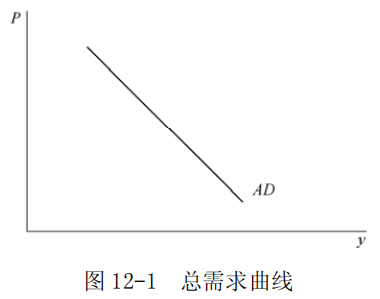

#### 2．总供给曲线

总供给是指经济社会中可供使用的商品和劳务总量。
表示经济中的总供给量与价格总水平之间关系的曲线就是总供给曲线。随着价格总水平的提高，经济社会中的商品及劳务的供给量增加，因而总供给量通常与价格总水平呈同向变动关系。对应的，总供给曲线向右上方倾斜。

#### 3．货币工资刚性

货币工资刚性是指货币工资不随劳动需求和供给的变化而迅速做出相应的调整的现象。
许多经济学家发现，即使存在迫使工资水平下降的因素，工资的绝对水平或相对水平也可能保持不变，特别是当劳动的需求量低于供给量时，货币工资下降出现刚性，即工资只能升高，不能降低。这主要是因为劳动者存在着对货币收入的幻觉。结果价格总水平的变动对劳动需求和供给的影响因货币工资不能自发波动而有所不同。货币工资刚性成为凯恩斯主义解释宏观经济波动的理论基础。工资如果不能及时调整，劳动力供求就不能实现均衡，从而出现失业现象。

### 二、简述题

#### 1．主流经济学派的总需求曲线是如何得到的？

答：

总需求是指对应于既定的价格总水平的社会总支出水平或总需求量，总需求曲线是表示经济中的需求总量与价格水平之间关系的曲线。在一个两部门的经济中，总需求由消费需求和投资需求构成。通过分析消费和投资二者的需求量与价格总水平之间的关系就可以得到总需求曲线。

依照主流经济学派的观点，在既定的价格总水平下，经济中的货币量是总需求量的货币反映。在经济处于均衡状态时，这些货币被用来满足交易和预防需求以及投机需求。交易和预防需求构成了消费需求，而用于投机的货币则通过金融市场转化为投资需求。因此不同的价格总水平与总需求量之间的对应关系可以由  $IS-LM$ 模型得到，即：

$$\begin{cases}
I(r) = S(Y) \\
L_1{(Y)} +L_2(r) = \frac{M}{P}
\end{cases}$$

从中消去利息率 r ，即得到总需求函数。

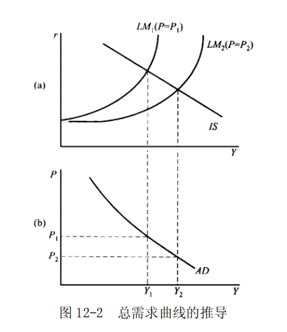

上述过程可以在图 12-2 中得到进一步说明。对应于不同的价格总水平，既定的名义货币量表示的实际货币量相应与价格总水平发生变动，从而 LM 曲线发生变动。对应于不同 LM 曲线，产品和货币市场的均衡将决定不同的总需求量。在 IS 曲线既定的条件下，价格总水平提高，实际货币量减少，利息率提高，投资减少，从而经济中的总需求量减少，即总需求曲线是一条向右下方倾斜的曲线。

#### 2．主流经济学的短期和长期 AS 曲线是如何得到，相应的政策含义是什么？

答：总供给曲线是表示总供给量与一般价格总水平之间关系的曲线。价格水平影响总供给量的基本过程是，价格总水平影响实际工资，实际工资影响劳动的需求和供给，从而影响劳动市场的均衡就业量，就业量通过厂商的生产影响经济中的商品和劳务的总产量。因此，总供给曲线是根据价格总水平的变动、劳动市场的均衡分析、生产函数再到总产出量的过程而得到的。不同派别在推导总供给曲线过程中的区别在于价格总水平如何影响劳动市场。按照主流经济学派的观点，价格总水平对短期和长期的劳动需求和供给具有不同的影响，因而总供给曲线有短期和长期之分。

- （1）在短期内
由于工人具有货币幻觉，只注重货币工资，并且经济中货币工资通常具有下降刚性，即只能升高，不能降低。结果价格总水平对劳动市场的影响在充分就业前和充分就业后有着很大的不同。在货币工资既定的条件下，如果价格总水平使得实际工资高于劳动市场的均衡水平，那么，在劳动市场上，需求量小于供给量。此时，如果货币工资不能下降，均衡的劳动量将对应着劳动的需求量，因此，就业量低于充分就业水平。并且，如果价格水平提高，需求量增加，从而就业量增加。这就是说，在低于充分就业状态时，价格总水平与就业量从而与总产出量呈同方向变动。

如果价格总水平决定的实际工资低于劳动市场的均衡水平，那么劳动的需求量超过充分就业量，因而势必造成货币工资提高，从而使得实际工资趋向于劳动市场的均衡水平。这说明，当经济达到充分就业时，劳动量处于充分就业水平。

综合上述两个方面，可以得到主流经济学派的短期总供给曲线 AS ，在达到充分就业的潜在产量水平前的区域内是向右上方倾斜的，而当产出超出潜在水平时，曲线就变得很陡。如图 12-3 所示。

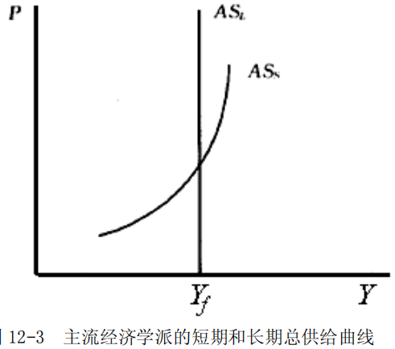

- （2）在长期内货币工资具有完全的伸缩性。

如果价格总水平提高，实际工资下降，那么厂商愿意雇用更多的劳动力，但劳动者并不愿意在这一实际工资下提供厂商所需要的劳动。结果，货币工资必然会升高直到劳动市场再次处于均衡状态为止。如果价格总水平下降，实际工资随之提高，厂商会减少劳动使用量。这时，劳动者会降低货币工资，以促使实际工资下降，直到实现充分就业为止。这表明，无论价格总水平多高，经济总处于充分就业水平，即长期总供给曲线是一条垂直的直线。如图 12-3 所示。

- （3）短期和长期总供给曲线与总需求的均衡具有明显的政策含义。
在短期内，总供给曲线向右上方倾斜意味着经济可以处于低于充分就业的水平，此时增加总需求，导致均衡产出水平增加。长期内，总供给曲线是一条垂直的直线，增加总需求只会影响价格而不增加总产出。

### 三、计算与证明

#### 假定一个经济的消费函数是 C=800+0.8Y ，投资函数为 I=2200-100r，经济中货币的需求函数为 L=0.5Y - 250r，若中央银行的名义货币供给量为 M = 600 ，求该经济的总需求函数。

解：

经济中的总需求来源于 $IS-LM$ 模型，即：

$$\begin{cases}
I(r)=S(Y) \\
L_1(Y) + L_2(r) = \frac{M}{P}
\end{cases}$$

代入已知条件，得到：

$$\begin{cases}
2200 - 100r = Y -800 -0.8Y \\
0.5Y - 250r = \frac{600}{P}
\end{cases}$$

解得： $$2Y-15000=\frac{1200}{P}$$ 
 。

因此，经济的总需求函数为： $$Y=7500+\frac{600}{P}$$ 
。

---

## 第 13 章 经济增长

### 一、名词解释

#### 1．哈罗德-多马模型

哈罗德-多马模型是 20 世纪 40 年代由哈罗德和多马相继提出的分析经济增长问题的模型。由于基本分析思路相同，因而被合称为哈罗德-多马模型。基本形式为： $G=\frac{S}{v}$  。式中： v 为资本一产出比； s 为储蓄率。

哈罗德-多马模型表示，经济增长率与储蓄率成正比，与资本一产出成反比。
哈罗德-多马模型得出的结论是，当实际经济增长等于资本家意愿的经济增长率并且等于人口增长率时，经济才能处于稳定增长状态，但同时认为，这一增长路径很难达到，因而是一“刃锋”。

#### 2．有保证的增长率

有保证的增长率 $G_w$ ，其公式为 $G_w=\frac{S_d}{v_r}$，式中， $S_d$ 是合意的储蓄率（假设既定），$v_r$ 是企业家意愿中所需的资本—产量比率。有保证的增长率是指与企业家意愿中所需要的资本—产量比率 $v_r$ 相适应的国民收入增长率，即能满足投资等于储蓄的稳定的增长率。这一公式表明，当既定的合意储蓄率（符合居民意愿的储蓄率）和合意的资本一产量比率（符合企业家意愿投资需求）所决定的增长率是有保证的增长率时，经济可以实现稳定的增长。在此增长率下，企业家预期的投资需求恰好等于本期的储蓄供给。

#### 3．新古典增长模型

答：
新古典经济增长模型是指由美国经济学家索洛等提出的国民经济增长模型。
由于其基本假设和分析方法沿用了新古典经济学的思路，故被称为新古典增长模型。
新古典增长模型主要包含以下假定：
- ①全社会使用劳动和资本两种生产要素只生产一种产品；
- ②劳动与资本之间可以相互替代，但并不能完全替代；
- ③生产的规模收益不变；
- ④储蓄率即储蓄在收入中所占的比重保持不变；
- ⑤不存在技术进步，也不存在资本折旧；
- ⑥人口按照一个固定速度增长。

由以上假定，可以推导出新古典增长模型的基本公式：

$$sf(k)=k+nk$$
，这里，$sf(k)$  为社会的人均储蓄，$k$ 为人均资本的增加（即资本的深化）， $nk$ 为新增人口所配备的资本数量（即资本的广化）。

该模型表明，一个经济社会在单位时期内（比如 1 年）按人口平均的储蓄量被用于两个部分：
- 一部分为人均资本的增加 $k$ ，即为每一个人配备更多的资本设备；
- 另一部分是为新增加的人口配备按原有的人均资本配备设备 $nk$ 。

当人均资本不变，即 $k=0$  时，产量（或收入）的增长率等于劳动力的增加率，经济均衡增长，这时有

$$sf(k)=nk$$
 。
 如果一个经济的目标是使人均消费最大化，那么在技术和劳动增加率固定不变时，经济中的资本—劳动比率应达到这样的数量，即使得资本的边际产品等于劳动的增长率，即 $f^{'}(k)=n$ ，此即黄金分割率。

该模型得出的结论是：经济可以处于稳定增加，条件是 $k=0$  ，此时经济总产量以人口增长率增长，人均产量和人均资本不变。

### 二、简述题

#### 1．哈罗德-多马模型的基本公式是什么？它包括哪些基本假设前提？其主要结论如何？

答：
（1）哈罗德-多马经济增长模型是英国经济学家哈罗德和美国经济学家多马于 1948 年分别提出的关于经济增长的分析模型的统称。
因基本分析思路相同，故被合称。该模型主要研究在保持充分就业的条件下，储蓄和投资的增长与收入增长之间的关系。统一的基本公式表达式为：

$$G=\frac{s}{v}$$

式中：$v$ 为资本一产出比； $s$ 为储蓄率。模型表示，经济增长率与储蓄率成正比，与资本一产出比成反比。

- （2）哈罗德—多马经济增长假设前提包括：
	- ①全社会使用劳动和资本两种生产要素只生产—种产品；
	- ②储蓄率即储蓄在收入中所占的比重保持不变；
	- ③资本—产出比保持不变；
	- ④不存在技术进步，也不存在资本折旧；
	- ⑤人口按照一个固定不变的比率增长。

意愿的或者有保证的经济增长率，并且与人口增长率保持相等。第一个条件表明，只有实际的与意愿的经济增长率相等，经济才处于均衡状态。实际经济增长等于人口增长率意味着经济增长不会受到劳动力的制约，也不会产生失业。因此，哈罗德—多马模型的充分就业下的稳定增长条件表示为：

$$G_A=G_W=G_N$$

其中， $G_A$ 、 $G_W$ 和 $G_N$ 分别表示经济中的实际增长率、有保证的增长率和人口增长率。

经济并不能自发地实现稳定增长。这是因为，如果实际的经济增长大于有保证的经济增长率，即  $G_A > G_W$ 。
那么社会所提供的既定的储蓄率下，实际资本—产出比小于资本家意愿的资本—产出比。这样，厂商就会增加投资以便提高资本—产出比。投资增加使得产出量增加，实际经济增长率进一步提高。结果 $G_A>G_W$ 将导致实际经济增长率不断扩大，直到这种扩大受到劳动力限制为止。如果实际的经济增长率小于有保证的经济增长率，即  $G_A < G_W$  ，结果恰好相反。实际经济增长率将不断地下降，直到出现大量失业。

由此可见，哈罗德—多马模型的稳定均衡增长是很难达到的，因此哈罗德将它形象地称为“刃锋”。

#### 2．简要说明新经济增长理论的基本思想和政策含义。

答：
新经济增长理论是 20 世纪 80 年代中期以后在西方出现的新理论。80 年代中期以来，以美国经济学家罗默和卢卡斯为代表的一批西方学者另辟蹊径，在经济增长理论方面取得重大突破，形成“新经济增长理论”。

该理论的基本观点是以内生技术进步、人力资本投资和知识积累等来解释经济长期增长的源泉，因而该理论也被称为“内生经济增长理论”。

- （1）新经济增长理论的基本思想

新经济增长理论目前还不能用一个简单的模型加以概括，严格说来，新经济增长理论是一些持类似观点或使用相同方法的增长模型。新经济增长理论的基本观点包括以下几个方面：
	- ①经济增长是经济系统内部因素相互作用而不是外部力量推动的结果，这些内生因素也可以实现经济的持续均衡增长。
	- ②在众多的因素中，技术进步是经济增长的决定因素。与其他推动经济增长的内生因素一样，技术进步是经济中追求利益最大化的经济当事人自主最优选择的结果，从而技术进步是由内生决定的。
	- ③技术、知识积累和人力资本投资等都具有外部效应，这种外部效应使得生产呈现出规模收益递增的趋势，而且正是这种的外部性构成了经济实现持续增长所不可缺少的条件。
	- ④由于外部效应的作用，经济在处于均衡增长状态时，通常不能达到社会最优状态，即经济的均衡增长率通常低于社会最优增长率。
	- ⑤影响经济当事人最优选择行为的政策，例如税收政策、产业政策等可以影响经济的长期增长率。

在新古典增长理论的基础上，新经济增长理论使得稳态增长率内生化的基本途径主要有两条：
- ①在收益递增和外部性条件下考察经济增长因素中的技术因素，技术受到经济中用于研究和开发的投入量的影响，而这种投入则又是由模型内生所决定的；
- ②可积累的生产要素具有固定的报酬，则稳态增长率就是由这些生产要素的积累率所决定。

到 20 世纪 90 年代，新经济增长理论进一步放弃了完全竞争假设，开始在垄断竞争的框架下分析产品品种和质量提高对经济增长的影响，由于分析框架是垄断竞争式的，因而诸如模仿和创新等行为也被纳入到了经济增长模型之中。

- （2）新经济增长理论的政策含义

由于经济增长率不仅取决于人口增长率，而且也与储蓄率和技术进步有关，因而政府采取促进积累和提高技术水平的政策对经济增长也将起到重要的作用。因此，新经济增长理论建议政府对物质资本、设备投资和基础设施增加投资，同时鼓励人力资本的积累，加大科技投入。例如，通过减少预算赤字对私人投资的挤出和提供税收激励来增加投资；鼓励对人力资本的投资，即在教育和培训上花费更多的资源；增加基础设施的投资；为研究与开发支出提供税收激励等。

### 三、论述题

#### 试述新古典增长模型及其对发展中国家经济增长的借鉴意义。

答：
- （1）新古典增长模型是 20 世纪 50 年代由索洛等人提出的一个增长模型。
由于它的基本假设和分析方法沿用了新古典经济学的思路，故被称为新古典增长模型。

- （2）新古典增长模型具有明显的政策含义，它表明要实现人均产出量的增加，有三种途径：
	- ①在人均资本占有量既定的条件下提高技术水平，从而增加产出。通过提高技术水平，改变资本—劳动比率，从而实现经济均衡增长；
	- ②提高储蓄率，使得人均资本增加。我国广大农村地区收入低，用于储蓄部分也较低，因而有必要通过提高农民收入来增加积累；

人均资本存量这一点，对于许多人口增长较快的发展中国家具有重要的借鉴意义。

新古典增长理论虽然假定劳动力按一个不变的比率 $n$ 增长，但当把 $n$ 作为参数时，就可以说明人口增长对产量增长的影响。如图 13-1 所示。

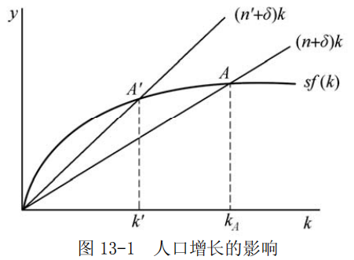

图中，经济最初位于 $A$ 点的稳态均衡。现在假定人口增长率从 $n$ 增加到 $n^{'}$ ，则图 13-1 中 $(n+\delta)k$ 线便移动到 $(n^{'} +\delta)k$ 线，这时，新的稳态均衡为 $A^{'}$ 点。比较 $A^{'}$ 点与 $A$ 点，可知，人口增长率的增加降低了人均资本的稳态水平（从原来的 $k_A$ 减少到 $k^{'}$ ），进而降低了人均产量的稳态水平，这是从新古典增长理论得出的又一重要结论。

作为人口增长率上升产生的人均产量下降正是许多发展中国家面临的问题。两个有着相同储蓄率的国家仅仅由于其中一个国家比另一个国家的人口增长率高，就可以有非常不同的人均收入水平。因此发展中国家可以通过控制人口增长来增加人均资本。

---

## 第 14 章 通货膨胀理论

### 一、名词解释

#### 1．消费物价指数

消费物价指数是消费者物价指数的简称，它反映消费品（包括劳务）价格水平变动状况，一般用加权平均法来编制。

消费物价指数用公式来表示即为：

$$CPI=\frac{一组固定商品按当期价格计算的价值}{一组固定商品按基期价格计算的价值}\times 100\%$$

消费物价指数是用来衡量通货膨胀和通货紧缩程度的指标之一。其优点是能及时反映消费品供给与需求的对比关系，资料容易搜集，能够迅速直接地反映影响居民生活的价格趋势。其缺点是范围较窄，只包括社会最终产品中的居民消费品的这一部分，因而不足以说明全面的情况。

#### 2．需求拉动的通货膨胀

需求拉动通货膨胀是指由总需求增加所引起的一般价格水平的持续和显著的上涨。
由于总需求表现为货币数量，因而需求拉动的通货膨胀又被解释为“过多的货币追逐过少的商品”。消费需求、投资需求、政府需求和国外需求增加以及政府政策对上述需求的刺激都会对总需求增加产生影响，并不同程度地拉动通货膨胀率上升。总需求持续增加引发需求拉动的通货膨胀。

#### 3．成本推动的通货膨胀

成本推动通货膨胀又称成本通货膨胀或供给通货膨胀，指由于供给成本的提高而引起的一般价格水平持续和显著的上涨。成本推动因素主要包括工资和利润推动。无论是工资还是利润，如果超过价格总水平的上涨速度，则会对商品和劳务价格的进一步上涨形成压力。来自于工会对工资和垄断厂商对利润的过分追求以及货币工资价格的刚性，都被认为可以促成成本推动的通货膨胀。

#### 4．价格调整方程

价格调整方程指用来表示通胀率与产生通胀压力之间关系的方程。用公式表示为：

$$\pi={\pi}_{t}^{e}+h\frac{(Y_t -Y_f)}{Y_f}$$

式中，
- $\pi_t$ 为第t 期的通胀率，
- $\pi_t^e$ 为人们对第t 期通胀率的预期
- $\frac{Y_t-Y_f}{Y_f}$ 为第 $t$ 期总需求与潜在产出水平的偏离，
- $Y_t$ 为 $t$ 期的总需求,
- $Y_f$ 为潜在的产出量,
- $h$ 为这种偏离对通胀率的影响系数。

该方程表明，通胀率与人们的预期呈同向变动，且也受到来自于需求压力的正向影响。
由于总需求与潜在产出水平的偏离与失业率成反向变动，价格调整方程也被表示成通胀率与失业率之间的交替关系。
- 当总需求高于潜在产出水平时，存在使价格上涨的压力；
- 当需求低于潜在产量时，存在使价格下跌的压力。

#### 5．收入指数化

答：
收入指数化是指政府对付成本推动的通货膨胀时采取的一项措施。
所谓收入指数化是指以条文规定的形式把工资和某种物价指数联系起来，当物价上升时，工资也随之上升。比如政府规定，工人工资的增长率等于通货膨胀率加上经济增长率。在实践中，收入指数化的作用在于降低通货膨胀在收入分配上的影响。

### 二、简述题

#### 1．按照西方学者的观点，如何利用制造衰退来逆转通货膨胀？

答：
- （1）在西方学者看来，造成通货膨胀的一个重要原因是过度的总需求。
因此，降低通货膨胀率的一个方法是人为地制造一次经济衰退。制造衰退一方面可以减少总需求对价格总水平的压力，另一方面也可以促使人们对通货膨胀的预期下降。

- （2）假定一个经济最初的通货膨胀率为 10%，政府希望把它降下来，于是人为地制造 5%的衰退。
进一步假定人们习惯地按照上一年的通货膨胀率形成下年度的预期，而衰退对通货膨胀率的影响系数 0.4，那么该经济的价格调整方程可以一般地表示为：

$$\pi_t=\pi_t^e + h\frac{(Y_t -Y_f)}{Y_f}$$

式中， $\pi_t$ 为第 $t$ 期的通胀率， $\pi_t^e$  为人们对第 $t$ 期通胀率的预期，其值为 $\pi_{t-1}$ ， $\frac{(Y_t - Y_f)}{Y_f}$  为第 $t$ 期总需求与潜在产出水平的偏离，其值为 5%， $h$  等于 0.4。

这样，在政府政策的作用下，第一年，尽管人们对通货膨胀率的预期为 10%，但衰退使得通货膨胀率下降。到第二年，人们对通货膨胀率的预期由原来的 10%下降到 8%。若政府继续人为地制造 5%的衰退，则该年度的通货膨胀率为如此继续下去，政府通过每年制造 5%的衰退可以在 5 年内把通货膨胀率降到零。

- （3）通过上述例子还可以看到，政府制造的衰退越大，通货膨胀率下降的速度越快。
这涉及到政府医治通货膨胀的指导思想。通过大规模制造衰退来实现低通货膨胀率的方案被形象地称为“冷火鸡”；通过逐渐制造衰退来逆转通货膨胀的做法则被称为渐近主义。

### 三、论述题

#### 试论通货膨胀的成因及其对策。

答：

按照西方学者的观点，主要有三类原因导致通货膨胀的发生：

- （1）需求拉动通货膨胀

需求拉动通货膨胀又称超额需求通货膨胀，指总需求超过总供给所引起的价格水平的持续显著的上涨。在商品市场上在现有的价格水平下，如果经济的总需求超过总供给水平，就会导致一般物价水平的上升，引起通货膨胀。

引起总需求扩大的因素有两大类：
- 一类因素被称为实际因素，诸如消费需求和投资需求扩大、政府支出增加、减税以及一国净出口水平的增加都会使得产品市场上 IS 曲线向右移动，从而使总需求曲线向右移动，使经济在现有的价格水平下总需求超过总供给。
- 另一类是货币因素，即货币供给量的增加或实际货币需求的减少。这会使得 $LM$ 曲线向右移动，也会导致总需求水平在现有价格水平下扩大。在经济的总供给没有达到完全就业水平的总供给水平之前，总需求的增加在使价格水平上升的同时，还会使产量增加。随着经济接近充分就业的产量水平，总需求再增加，产出不能随之增加，而只会导致价格水平的上升。

对于需求拉动的通货膨胀，可供政府采取的方案是人为地制造衰退。既然通货膨胀是由于超额总需求所致，那么降低总需求水平，从而增加失业、减少产出，则会使得通货膨胀率降低。制造的衰退幅度越大，通货膨胀率下降的速度也就越快。

- （2）成本推动通货膨胀

成本推动通货膨胀，又称成本通货膨胀或供给通货膨胀，指在没有超额需求的情况下由于供给方面成本的提高所引起的一般价格水平持续和显著的上涨。这是指由于生产成本的提高而引起的一般价格水平的上升。生产成本的提高一方面可表现为工资水平上升，原材料和能源等涨价；另一方面也表现为厂商为追逐垄断利润而限制产量，从而引起价格水平的普遍上涨。在现有的价格水平下，工人如果要求提高实际工资，厂商能够雇佣的工人就会减少，其产量就随之减少，导致供给曲线向左移动，总需求水平超过总供给，价格水平上升。与需求拉动的通货膨胀不同的是，在短期，成本推动的通货膨胀将减少经济的产出水平。

对成本推动的通货膨胀，政府主要采取收入政策来治理。收入政策是政府为了降低通货膨胀率而对货币收入和价格采取的强制性或非强制性的政策，往往借助于工资价格管制、收入指数化和一定的税收政策来实现。

政府采取的工资价格管制手段主要有：
- 对工资和价格进行直接控制；
- 对工资和价格规定作指导性指标；
- 对厂商和工会进行道义劝告。

通过以上手段达到限制产品价格和工资上涨幅度的目的。这种手段一般在短期内较为有效，但在长期内会对市场机制起到限制作用。

收入指数化是指以条文规定的形式把工资等收入与某种物价指数联系起来，当物价上升时，收入也随之上升。例如政府规定，工人工资的增长率等于通货膨胀率加上经济增长率。收入指数化政策限制了要素所有者过分追逐收入的上涨，但这种要求往往出现在通货膨胀之后，因而收入指数化政策更侧重于消除通货膨胀对收入的影响。

- （3）结构性通货膨胀

结构性通货膨胀指由于特定的经济制度、控制系统、信息系统和决策系统的结构因素或这些结构的变化而引起的通货膨胀。西方学者通常用生产率提高快慢不同的两个部门说明结构性通货膨胀。由于生产率提高的快慢不同，两个部门的工资增长的快慢也应当有区别。但是，生产率提高慢的部门要求工资增长向生产率提高快的部门看齐，结果使全社会工资增长速度超过生产率增长速度，因而引起通货膨胀。

一般情况下，通货膨胀的成因往往是多种因素交织在一起，因而政府逆转通货膨胀的政策也并非是单一的，往往是各种政策搭配便用。

### 四、计算与证明

#### 假设某一经济最初的通货膨胀率为 18%，如果衰退对通货膨胀的影响系数为政府 $H = 0.4$ ，那么政府通过制造10%的衰退如何实现通货膨胀率不超过 4%的目标。

解：

假设潜在货币收入为 100 货币单位，因为政府制造了 10%的衰退，即把实际收入压低到 90 货币单位，

根据 价格调整方程:  $$\pi_t=\pi_t^e + h\frac{(Y_t -Y_f)}{Y_f}$$

有：

$$\pi_2=18\% + 0.4(90-100)/100=14\%$$

$$\pi_3=14\%+0.4(90-100)/100=10\%$$

$$\pi_4=10\%+0.4(90-100)/100=6\%$$

$$\pi_5=6\%+0.4(90-100)/100=2\%$$

所以，经济社会经过 4 年的时间，即到第 5 年，就可以把通货膨胀率降低到 4%以下。

---

## 第 15 章 宏观经济学的意见分歧

### 一、名词解释

#### 1．货币主义

货币主义又称货币学派，它以制止通货膨胀和反对国家干预为主旨，以现代货币数量论为理论基础，坚信货币供给量的变动是物价水平和经济活动变动的最根本原因；强调货币及货币政策的重要性，主张实行单一规则的货币政策。该学派于 20 世纪 50 年代后期在美国出现，主要代表人物的弗里德曼、沃尔特斯、帕金和弗里希等。

货币主义的基本命题是：
- ①货币要最紧，货币的推动力是说明产量、就业和价格变化的最主要的因素；
- ②货币供给量的变动是货币推动力的最可靠的度量标准；
- ③货币当局的行为支配着货币量的变动，从而通货膨胀、经济萧条或经济增长都可以而且应当惟一地通过货币当局对货币供给量的控制来加以调节。其政策指导思想是自由放任，反对政府干预。

#### 2．自然率假说

自然率假说是指在没有货币因素干扰的情况下，劳动市场在竞争条件下达到均衡时所决定的就业率。
由于这一就业率与经济中的市场结构、社会制度、生活习惯等因素有关，因而被冠以“自然率”的名称。许多新自由主义经济学派都假定经济中存在着一个自然就业率，并运用各自的理论论证经济经常地处于这种状态。因而，自然率也被认为是一种假设。

#### 3．菲利普斯曲线

菲利普斯曲线由英国经济学家菲利普斯首先提出，故得名。
它描述了通货膨胀率与失业率之间存在的交替关系。后来被新古典综合派用于说明一般价格水平、失业率和总需求之间的关系，如图 15-1 所示。

对于菲利普斯曲线具体的形状，不同学派对此有不同的看法。
普遍接受的观点是：
- 在短期内，短期菲利普斯曲线向右下方倾斜
- 长期菲利普斯曲线是一条垂直线，表明失业率与通货膨胀率之间不存在替换关系。

#### 4．单一货币规则

单一货币规则是货币主义的政策主张，是货币主义经济学最重要的理论规则。
它认为，为了防止货币成为经济混乱的原因，给经济提供稳定的运行环境，最优的货币政策是货币供应保持固定的增长率，不论经济景气与否，都应维持不变。货币主义建议，货币以经济增长率加上通货膨胀率的速度增长。

#### 5．理性预期假设

理性预期假说是指经济当事人对价格、利率、利润或收入等经济变量未来的变动可以作出符合理性的估计。理性预期包含三个方面的特征：

- （1）预期平均说来是正确的；
- （2）经济当事人在充分利用所有有效信息的基础上对某个经济量作出预期；
- （3）经济当事人作出的预期与经济模型的预测相一致。

#### 6．市场出清

市场出清是指，无论劳动市场上的工资还是产品市场上的商品价格都具有充分的灵活性，可以根据供求情况迅速进行调整，以达到供求相等的均衡状态。
有了这种灵活性，产品市场和劳动市场都不存在超额供给，每个市场都处于或趋于供求相抵的情况。

#### 7．新古典宏观经济学

新古典宏观经济学，又称作“新古典主义”的一个经济学流派，这个学派的经济学遵循古典经济学的传统，相信市场力量的有效性；认为如果让市场机制自发地发挥作用，就可以解决失业、衰退等一系列宏观经济问题。新古典宏观经济学的代表人物有美国的经济学家罗伯特·卢卡斯、托马斯·萨金特、尼尔·华莱士、埃德渥德·普雷斯科特、罗伯特·巴罗，英国的P•明福尔德等。

新古典宏观经济学坚持市场出清假设。新古典宏观经济学家认为，工资和价格具有充分的伸缩性，可以迅速调整。这样，通过工资价格的不断调整，使供给量与需求量相等，市场连续地处于均衡之中，即被连续出清。因此，新古典宏观经济学家把表示供给量和需求量相等的均衡看作经常可以得到的情形。

在此假设基础之上，新古典宏观经济学反对政府对经济的干预。该派理论的目的是想证明宏观经济政策是无效的，甚至是有害的。卢卡斯等人的货币经济周期理论从不完全信息出发论证了货币政策无效。该论述的中心内容是，预期到的货币供给的变化只影响价格水平，而不影响产量；只有没有预期到的货币供给才影响产量。新一代的新古典宏观经济学家不满足于货币政策无效性命题，他们将新古典主义宏观经济学的研究方法应用到财政政策分析，得出了财政政策也无效的命题。

### 二、简述题

#### 简要评论新古典宏观经济学对凯恩斯主义理论的批判。

答：

新古典宏观经济学主要从经验检验和理论一致性两个方面展开对凯恩斯主义理论的批判。

- （1）从经验检验方面，新古典宏观经济学利用计量经济学的分析技术对菲利普斯曲线的形状进行了充分的检验，以便否定凯恩斯理论。由于滞涨现象的存在，检验结果对新古典宏观经济学有利。

- （2）从理论方面，首先，新先古典宏观经济学指出了凯恩斯主义经济理论三大错误。
	- 第一，不合理性的预期。在凯恩斯理论中，经济当事人的预期通常被假定为不变，它主要取决于过去该变量的数值。这就意味着人们并不利用有关将来的信息来谋取最大的利益，因此违背了西方经济学中理性经济人的基本假设。
	- 第二，在一个理论体系中个人行为不一致。比如，微观经济学中分析劳动供给时，假定人们就收入和闲暇进行选择，但在宏观消费理论中又假定人们储蓄的目的是为了将来的消费，即劳动者要在现在和将来之间进行选择。但并没有一种理论说明二者的一致性。
	- 第三，以国内生产总值作为评价政策的标准不能反映人们的福利状况。

其次，在批判凯恩斯理论的基础上，新古典宏观经济学全盘否定宏观经济政策的有效性。根据基于理性预期假设和货币主义的自然率假说，新古典宏观经济学认为，凯恩斯主义政策的有效性是建立在欺骗公众基础上的。

经济中存在着一个由资源、制度、习惯、市场结果等因素决定的自然就业率水平，同时人们会以理性的方式形成预期，在自然因素保持不变的条件下，持续的政策效果是不可能的。不仅如此，由于政府不能预测经济当事人的行为，因而政策的后果可能是加剧经济波动。

上述结论主要来自于著名的“卢卡斯批判”。卢卡斯认为，凯恩斯主义政策的有效性大多是根据参数固定不变的计量经济学模型，但经济当事人的理性预期将使得这些参数发生改变，从而使得政策并不能达到预期的效果。

### 三、论述题

#### 1．评述货币主义的基本观点。

答：
- （1）货币主义又称货币学派，是 20 世纪 50 年代后期在美国出现的一个学派，主要代表人物的弗里德曼、沃尔特斯、帕金和弗里希等。该学派以制止通货膨胀和反对国家干预为主旨，以现代货币数量论为理论基础，坚信货币供给量的变动是物价水平和经济活动变动的最根本原因；强调货币及货币政策的重要性，主张实行单一规则的货币政策。

- （2）货币主义的基本命题
	- ①货币要最紧，货币的推动力是说明产量、就业和价格变化的最主要的因素；
	- ②货币供给量的变动是货币推动力的最可靠的度量标准；
	- ③货币当局的行为支配着货币量的变动，从而通货膨胀、经济萧条或经济增长都可以而且应当惟一地通过货币当局对货币供给量的控制来加以调节。其政策指导思想是自由放任，反对政府干预。

- （3）货币学派有两大理论特征

- 一是运用了预期量分析法和名义量分析法，
- 二是新自由主义思想贯穿始终。

表现在：

- ①强调两种意义的自由，即人们相互关系的自由和个人的自由；
- ②强调人们互相关系的自由在经济活动中主要依靠私有制和市场经济来完成，在政治活动中则通过少数服从多数来实现，经济自由是达到政治自由的一个不可缺少的手段；
- ③强调人是一种“不完善的实体”，绝对的自由是不存在的；
- ④两种意义的自由都只有在政府的保护下才能实现。

- （4）货币学派理论的主要内容

- ①市场经济理论。他们提出了市场经济的理想模式，认为政府的干预只应保留在有限的范围内。
- ②持久收入理论。他们认为消费水平不取决于当前或暂时性收入，而决定于持久性收入。由于持久收入具有高度稳定性，所以受它支配的货币需求也是高度稳定的，因而货币供给量的变动将影响经济稳定。
- ③价格总水平与货币供给量同方向变动。
- ④通货膨胀与失业理论。
他们认为通货膨胀是由货币供给量过度增加所导致，“随时随地都有一种货币现象”；
他们提出了自然失业率假说，利用自然率假说说明货币数量的变动对通货膨胀的传导机制。认为经济中存在着一个自然的就业水平。如果政府希望提高就业率，就必须以一定的通货膨胀为代价。但是，人们会根据现实的通货膨胀率不断地调整对通货膨胀的预期，从而政府旨在提高就业水平的政策只能以不断加剧的通货膨胀为代价。结果，长期中，通货膨胀率提高将不会对就业率产生太大的影响，即长期的菲利普斯曲线是一条垂直线。
- ⑤政策主张：自由主义的宏观经济政策。
- 第一，反对相机抉择的财政政策，认为扩张性的财政政策会导致对私人总需求的挤出效应，从而是无效的；也不主张逆经济方向行事的货币政策，因为货币政策往往产生各种滞后，反而会加剧经济波动；主张实行单一规则的货币政策，即由货币当局公开宣布今后相当长时期内每年的货币增长率不变，大致等于这段时期国民收入可能实现的增长率，以保证经济增长和物价稳定。
- 第二，主张推行“收入指数化”方案和负所得税方案。

（4）评价

货币主义是在与凯恩斯理论论战中发展起来的，透过它可以发现凯恩斯理论存在的某些缺陷。例如，财政政策的效果以及货币政策的挤出效应等都被西方经济学界所认可。此外，货币主义对通货膨胀的分析也值得我们注意。但是，把所有问题都归于货币，掩盖了生产过程中所暴露的矛盾。

#### 2．新凯恩斯主义是如何解释价格、工资黏性的？请加以评论。

答：
- （1）价格、工资黏性分为名义黏性和实际黏性两种。
名义黏性指名义价格和名义工资的调整不能按照需求的变动而相应变动，新凯恩斯主义将其归因于产品市场上的不完全竞争。实际黏性是一种价格、工资相对于另一种价格、工资的粘性，新凯恩斯主义认为它起因于企业的成本加成定价。

- （2）为了说明非市场出清，新凯恩斯主义者必须集中力量建立价格和工资黏性的理论基础。
为此区分了名义黏性和实际黏性。新凯恩斯主义对名义黏性和实际黏性在最大化和理性预期假设下提出了各种各样的解释。这些解释包括菜单成本论、交错调整价格和交错调整工资论、不完全竞争论、市场协调论、劳动市场论和信贷配给论等。
-  ①菜单成本论认为，菜单成本的存在阻碍厂商调整价格，所以价格有黏性。
	菜单成本是指厂商每次调整价格要花费的成本，包括研究和确定新价格、编印更改价目表等所费的成本。另外，菜单成本也包括调整价格的机会成本。厂商只有在调整价格后的利润增加量大于菜单成本时，才会调价。因此，菜单成本的存在，使厂商不愿意经常地变动价格，所以价格水平有黏性。
- ②交错调整价格及交错调整工资论以理性预期为假设前提，认为经济当事人调整价格的时间是交错进行的。
交错调整导致价格和工资具有惯性。因而，即使存在理性预期，政府政策仍有积极作用。
- ③不完全竞争论认为，在不完全竞争市场中，厂商利用垄断力定价时，价格通常不会随着总需求的变动而变动，价格对总需求变动不敏感，导致产量随着总需求而变动。另一方面，总需求变动具有外部影响，可以通过宏观经济中各经济当事人之间的相互作用而放大，导致经济波动。在不完全竞争条件下，经济不存在自发趋向于充分就业的机制，因而需要通过政府干预才能提高效率，增进社会福利。
- ④市场协调失灵论是新凯恩斯主义为解释非市场出清原因而提出的一种新理论。
	市场协调失灵论从市场机制不能协调众多经济当事人的行为来说明市场失灵。他们认为，在一个由许多经济当事人构成的经济中，尽管每个经济当事人都是理性的，他们之间的行为相互联系、相互制约。然而，每个经济人的市场力量都很小，单个经济人无力协调整个经济行为，从而导致市场失灵。市场协调失灵，使市场机制不能确保经济处于有效率的均衡状态，只有通过国家干预，才能改变协调失灵的状况，使资源得到优化配置。
- ⑤劳动市场论多侧面地探讨了工资黏性和失业的原因。在新凯恩斯主义看来，隐含合同、局内人的压力、效率工资等都是工资黏性的原因。隐含合同是指风险中性的厂商与风险厌恶的工人之存在着非正式的协议；局内人与局外人之间的差别使得厂商面临着来自于厂商内部在职工人的压力；效率工资则说明，劳动的效率并不总是常数，它与厂商的工资呈正方向变动。为了保持效率，工资是以高效率工人的标准制定的。所有这些，使得实际工资出现黏性。
-  ⑥信贷配给论认为，在不完全信息的信贷市场上，利率和配给机制都在起作用。由于信息的不对称性，供给不完全了解风险程度，因而可能存在信贷配给。政府货币政策能成功地纠正信贷市场失灵，提高信贷市场效率，降低市场风险，增进社会福利。

