#  第一章 导言

## 第一节  西方经济学的研究对象

### 一、 经济学的产生

1.  经济学产生与客观存在的稀缺性及由此所引起的选择需要。
2.  满足人类欲望的物品
	 -  自由取用物品(无限)
	 -  经济物品(有限)
	 
### 二、 经济学的定义 

- 经济学是一门科学，她把人类行为作为目的的与可以有其他用途的稀缺资源之间的关系来研究 -- 英国经济学加罗宾斯
- 按广泛接受的定义，经济学是研究稀缺资源在无限而又有竞争的用途中间配置的问题。它是一门研究人与社会寻求满足他们的物质需求与欲望的方法的社会科学，这是因为他们所支配的东西不允许他们去满足一切愿望。 -- 《国际社会科学百科全书》
- 经济学研究人和社会如何做出最终抉择，在使用或不使用货币的情况下，使用可以有其他用途的喜鹊的产生性资源来在现在或将来生产各种商品，并把商品分配给社会各个成员或集团以供消费之用。

经济学应该研究的问题:
1.  生产什么产品与劳务和生产多少？（微观经济学）
2. 用什么方法生产这些产品与劳务？（微观经济学）
3. 产品的供给如何在社会成员中进行分配？（微观经济学）
4. 一国的资源是充分利用了，还是有一些呗闲置，从而造成浪费？（宏观经济学）
5. 货币和储蓄的购买力是不变呢，还是由于通胀而下降呢？（宏观经济学）
6. 一个社会生产物品的能力是一直增长呢，还是仍然没有变呢？（宏观经济学）

经济学十大原理:
1. 人们面临权衡取舍，说明稀缺性的存在与选择的必要。（选择原则）
2. 某些东西的成本是为了得到它所放弃的东西。这种放弃的东西成为机会成本，是选择时要付出的代价。（选择原则）
3. 理性人考虑边际量。说明人们在做出选择时的思考方式。边际量就是增加量，这就是使人们在做出选择时要考虑增加的成本与增加的收益。（选择原则）
4. 人们会对激励做出反应。说明人在选择时会从自己的利益出发，对不同的刺激做出不同的反应。（选择原则）
5. 贸易可以使每个人的状况都变得更好。说明人与人在经济中的关系。
6. 市场通常是组织经济活动的一种好方法。说明市场机制的时效性。
7. 政府有时可以改善市场结果，即可以克服市场机制固有的缺点。
8. 一国的生活水平取决于它生产物品与劳务的能力。
9. 当政府发行过多货币时，物价上升。
10. 社会面临通货膨胀之间的短期权衡取舍。

## 第二节 微观经济学与宏观经济学

### 一、微观经济学

微观经济学以单个经济单位为研究对象，研究单个经济单位的经济行为，以及相应的经济变量的单项数值如何决定。

### 二、 宏观经济学

宏观经济学以整个国民经济学活动为考察对象，研究经济中国各有关总量的决定及其变化。

## 第三节 实证经济学与规范经济学

### 一、实证经济学与规范经济学

#### 实证经济学 （positive economics）

实证经济学是企图超脱或排斥一切价值判断，只考虑建立经济事物之间关系的规 律，并在这些规律的作用之下，分析和预测人们经济行为的效果。

特点:
1. 它要回答的是“是什么”的问题。
2. 它所研究的内容具有客观性，它的结论是否 正确可以通过经验事实来进行检验。

#### 规范经济学 (normative economics)

规范经济学是以一定的价值判断为基础，提出某些标准作为分析处理经济问题的 标准，作为树立经济理论的前提，作为制定经济政策的依据，并研究如何才能符合这些 标准。

特点:
1. 它要回答的是“应该是什么”的问题。
2. 它所 研究的内容没有客观性，所得出的结论无法通过经验事实进行检验。

西方经济学家所说的价值判断(value judgement)中的价值不是商品价值那种意义上的价值，而是指经济事物的社会价值，即某一事物是好还是坏的问题，所谓的价值判 断是要判断某一经济事物是好还是坏，即对社会有无价值。

西方经济学家认为，要使经济学成为真正的科学就必须抛开价值判断问题，使经济学实证化。
1. 关于所追求的目标 是正确还是错误的基本问题，不是作为科学的经济学本身所能解决的。
2. 实证经济学 与规范经济学相互关联，我们做出决策要以实证经济学为基础，但要以规范经济学为 指导。这就是说，要以一定的价值判断指导决策，但决策要以实证经济学为基础。

微观经济学与宏观经济学的基 本内容都属于实证经济学。

### 二、实证经济学的研究方法

西方经济学家认为，在运用实证经济学的方法研究经济问题时，就是要提出用于 解释经济现象的理论，用事实来检验理论，并根据理论做出预测。

理论组成:
1. 定义
2. 假设
3. 预测

名词:
1. 定义，是对经济学所研究的各种变量规定出的明确的含义。
2. 变量，是一些可以取不同数值的量。
	1. 内生变量，由经济力量所决定的变量。
	2. 外生变量，由非经济因素决定的变量。（政治）
	3. 存量，指一定时点上存在的变量的数值。
	4. 流量，指一定时期内发生的变量变动的数值。
 3. 假设，是理论所适用的条件。
 4. 假说，对两个或更多的变量之间关系的阐述，即未经证明的理论。
 5. 预测，是根据假说对未来进行预测。

---

# 第二章 需求、供给和均衡价格

> 微观经济学所要解决的是资源配置问题。在市场经济中，这一问题是通过价格机制来解决的，因此微观经济学的核心是价格理论。

## 第一节 需求与供给

### 一、需求的基本理论

#### 需求

需求是指居民户(消费者)在某一特定时期内，在每一价格水平上愿意而且能够购买的商品量。

作为需求要具备两个条件:
1. 有购买欲望
2. 有购买能力

#### 需求表

商品价格与需求之间的关系表成为需求表（demand schedule）

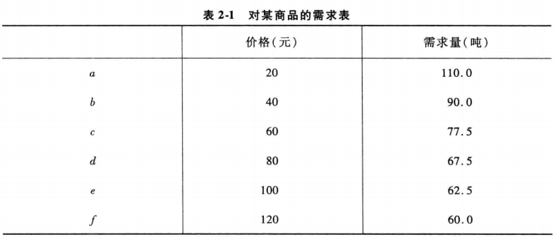

#### 需求曲线

横轴代表需求量，纵轴代表价格，D即为需求曲线(demand curve)。

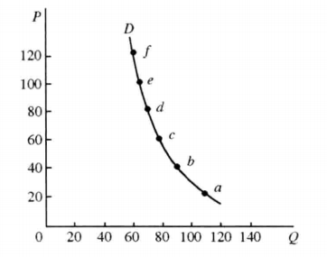

需求曲线：
1. 需求曲线是一条向右下方倾斜的线，这表明价格与需求 量之间存在着反方向变动的关系，即在其他条件不变的情况下，需求量随着价格的 上升而减少，随着价格的下降而增加，这就是西方经济学中所说的需求定理。
2. 需求 定理是对一般商品而言的，对某些特殊商品而言，需求定理则不一定适用。

影响需求的其他因素:. 
1. 相关商品价格
2. 消费者的收入水平
3. 消费时尚的变动
4. 消费者对未来的看法

#### 需求函数:

如果假定其他因素不变，只考虑商品本身的价格与对该商品的需求的关系，并以 P代表价格，则需求函数为：

$$
D = f(P)
$$

#### 需求量的变动

当影响需求的其他因素不变时，商品本身价格的变动所引起的需求量的变动是在 同一条需求曲线上的移动。这种变动称为需求量的变动。

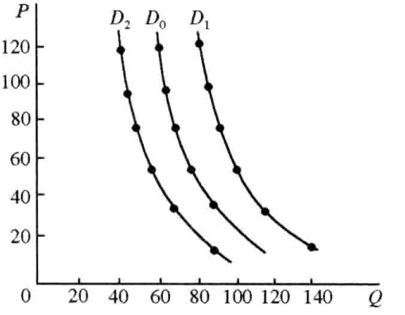

### 二、供给的基础理论

西方经济学中所说的供给(supply)是指厂商(生产者)在某一特定时期内，在每一 价格水平上愿意而且能够出卖的商品量。

两个必要条件：
1. 有出售 愿望
2. 有供应能力

#### 供给表

表明商品的价格与供给量之间关系的表称为供给表(supply schedule)

#### 供给曲线(supply curve)

横轴代表供给量，纵轴代表价格，S即为供给曲线。

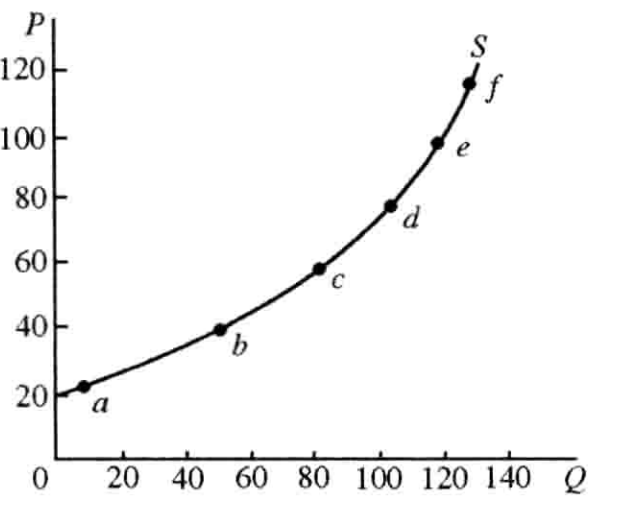

#### 供给函数

假定其他因素不变，只考虑商品本身的价格与该商品的供给量的关系，并以P代表价格:

$$
S = f(P)
$$

#### 供给变动

 当商品本身的价格不变时，其他因素的变动所引起的供给量的变动时整个供给曲线的移动。

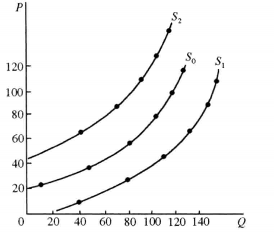

## 第二节 均衡价格的决定与变动

### 一、均衡价格的决定

均衡(equuilibrium)是物理学中的名词。当一物体同事收到方向相反的两个外力的作用，这两种力量恰好相等时，该物体由于受力相等处于静止的状态，这种状态就是均衡。

西方经济学中的均衡:
1. 局部均衡(partial equilibrium) 局部均衡是假定在其他条件不变的情况下分析一种商品或一种生产要素的供给与需求达到均衡时的价格决定。
2. 一般均衡(general equilibrium)  一般均衡是假定在各种商品和生产要素的供给、需求、价格相互影响的情况下分析所有商品和生产要素的供给和需求同时达到均衡的价格决定。

均衡价格的形成

1. 市场价格高于均衡价格
 
 

2. 市场价格低于均衡价格
 
 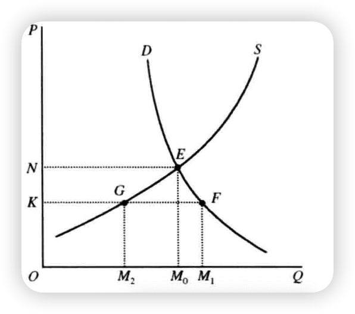
 

### 需求与供给的变动对均衡的影响

市场上价格与数量的均衡是由需求与供给这两种力量所决定的，因此任何一方变动都会引起均衡的变动。

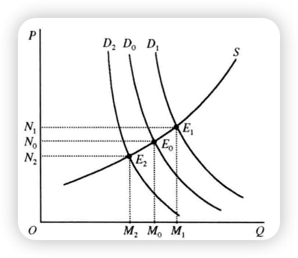

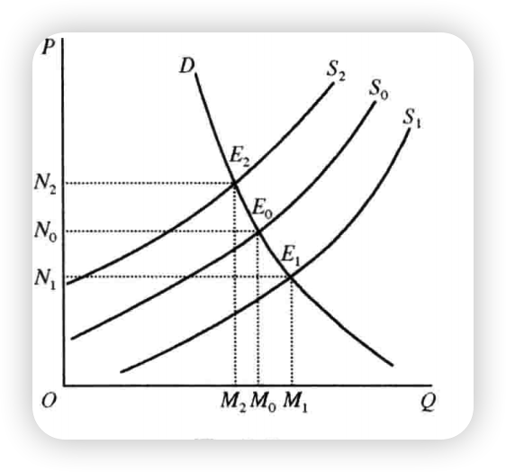

 需求的变动引起均衡价格与均衡数量同方向变动。
1. 第一，需求的增加引起均衡价格上升，需求的减少引起均衡价格下降。
2. 第二，需求的增加引起均衡量增加，需求的减少引起均衡量减少。

供给的变动引起均衡价格反方向变动，供给的变动引起均衡数量同方向变动。
3. 第三，供给的增加引起均衡价格下降，供给的减少引起均衡价格上升。
4. 第四，供给的增加引起均衡数量增加，供给的减少引起均衡数量减少。

### 均衡价格理论的运用：支持价格与限制价格

#### 支持价格(support-price)

支持价格(support-price)是政府为了扶持某一行业的生产二规定的该产业产品的最低价格。

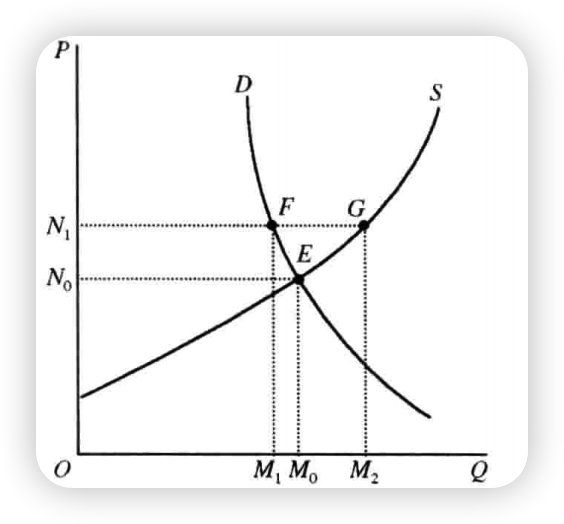

#### 限制价格(ceiling-price)

限制价格(ceiling-price)是政府为了限制某些生活必须品的物价上涨而规定的这些产品的最高价格。

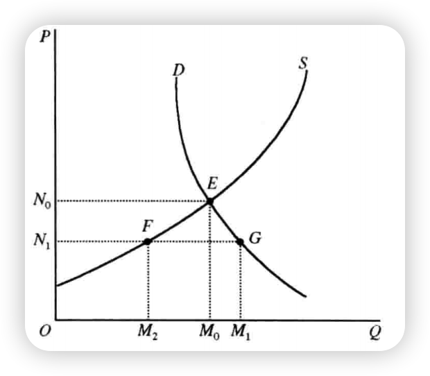

## 第三节 弹性理论

弹性理论要说明价格的变动比率与需求量（或供给量）的变动比率之间的关系。

### 一、需求弹性

需求弹性(elasticity of demand ):
1. 需求的价格弹性--需求量变动与价格变动之间的关系
2. 需求的收入弹性--需求量变动与收入变动之间的关系
3. 需求的交叉弹性--需求量变动与其他商品价格变动之间的关系

需求的价格弹性(price elasticity of demand)是用来衡量价格变动的比率所引起的需求量变动的比率，即衡量需求量变动对价格变动的反应程度。

$$
需求弹性的弹性系数 = \frac{需求量变动的百分比}{价格变动的百分比}  
$$

弹性系数公式:

$$
E_d = \frac{\Delta{Q}}{Q}/\frac{\Delta{P}}{P} = \frac{\Delta{Q}}{\Delta{P}}/\frac{Q}{P} = \frac{\Delta{Q}}{\Delta{p}}\cdot\frac{P}{Q}
$$

$Ed$ 代表需求弹性的弹性系数。
$P$ 代表价格。
$\Delta{P}$ 代表价格变动
$Q$ 代表需求量。
$\Delta{Q}$ 代表需求的变动量。

根据需求弹性系数的大小可以分为五种情况：
1. 需求完全无弹性(perfectly inelastic) $E_d = 0$ 。在这种情况下，无论价格如何变动，需求量不会变动。这时的需求曲线是一条与横轴垂直的线。（ $D_1$曲线 ）
2. 单位需求弹性(unit elasticity) $E_d = 1$ 。在这种情况下，需求量变动的幅度与价格变动的幅度相等。这时的需求曲线是一条正双曲线。（ $D_2$ 曲线 ）
3. 需求完全有弹性(perfectly elastic), $E_d \to \infty$  ( $D_3$ 曲线 )

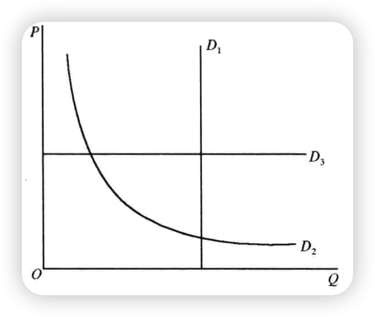
以上现实很少出现。

4. 需求缺乏弹性 $1 > E_d  > 0$ 。需求量变动的幅度小于价格变动的幅度。

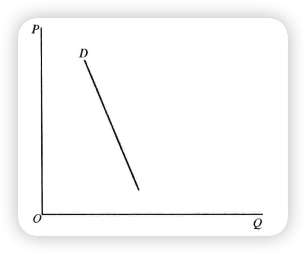
5. 需求富有弹性 $\infty > E_d > 1$ 。在这种情况下，需求量变动的幅度大于价格变动的幅度。

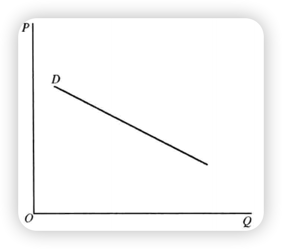

影响需求弹性的因素:
1. 人们对这种商品的需求程度的大小，一般来说生活必需品的需求弹性小，而奢侈品的需求弹性大。
2. 这种商品本身的可替代程度，一般来说越易于被替代的商品其需求弹性越大，而越不易被替代的商品其需求弹性越小。
3. 这种商品的用途是否广泛，一般来说用途广泛的商品需求弹性大，而用途少的商品需求弹性小。
4. 这种商品使用时间长短，一般来说非耐用品的需求弹性大，而耐用品的需求弹性小。

某种商品的价格变动时，它的需求弹性的大小与价格变动所引起的出售该商品所得到的总收益的变动情况是密切相关的。

如果某商品的需求是富有弹性的，则价格与总收益呈反方向变化。即价格上升，总收益减少，价格下降，总收益增加。

如果某商品的需求是缺乏弹性的，则价格与总收益呈同方向变化。即价格上升，总收益增加，价格下降，总收益减少。

需求的收入弹性(income elasticity of demand )是用来衡量收入变动的比率所引起的需求量变动的比率，即需求变动对收入变动的反应程度。

$$
需求的收入弹性的弹性系数 = \frac{需求量变动的百分比}{收入变动的百分比}
$$
需求的收入弹性系数公式:

$$
E_m = \frac{\Delta{Q}}{Q}/\frac{\Delta{Y}}{Y} = \frac{\Delta{Q}}{\Delta{Y}}/\frac{Q}{Y} = \frac{\Delta{Q}}{\Delta{Y}}\cdot\frac{Y}{Q}
$$

$E_m$ 代表需求的收入弹性的弹性系数
$Y$ 代表收入
$\Delta{Y}$ 代表收入的变动量
$Q$ 代表需求量
$\Delta{Q}$ 代表需求的变动量

### 二、供给弹性

供给弹性(supply elasticity) 就是指供给的价格弹性，即用来衡量价格变动比率所起的供给量变动的比率，即衡量供给量变动对价格变动的反应程度。

$$
供给弹性的弹性系数 = \frac{供给量变动的百分比}{价格变动的百分比}
$$

$$
E_s = \frac{\Delta{Q}}{Q}/\frac{\Delta{P}}{P} = \frac{\Delta{Q}}{\Delta{p}}/\frac{Q}{P} = \frac{\Delta{Q}}{\Delta{P}}\cdot\frac{P}{Q}
$$

价格与供给量同方向变动，所以供给弹性的弹性系数为正值。

供给弹性的五种情况:
1. 供给完全无弹性( $E_s = 0$ ,无论价格如何变动，供给量不会发生变化)
2. 供给完全有弹性( $E_s \to \infty$ ,价格既定，供给量无限)
3. 单位供给弹性( $E_s = 1$ ,供给量变动的幅度等于价格变动的幅度 )
4. 供给富有弹性( $\infty > E_s > 1$ ,供给量变动的幅度大于价格变动的幅度)
5. 供给缺乏弹性( $1 > E_s > 0$ ,供给量变动的幅度小于价格变动的幅度)

一般情况是供给富有弹性或供给缺乏弹性

影响商品供给弹性大小的因素，主要是时间的长短:
1. 在短期中，当有些产生要素不能根据市场需求来调整时，各种商品的供给都缺乏弹性
2. 在长期中，当所有生产要素都可以根据市场需求来调整时，各种商品的供给都富有弹性

### 弹性理论的运用：蛛网理论

静态均衡分析: 在均衡分析中，如果不引入时间因素来考察均衡形成和稳定的条件，则是静态均衡分析

动态均衡分析：如果在均衡分析中，引入时间因素来考察均衡状态的变动过程，则为动态均衡分析

蛛网理论是一种动态均衡分析。它是运动弹性理论来考察价格波动对下一个周期产量的影响，及由此产生的均衡的变动。

蛛网理论所研究的商品具有特征：
1. 他们开始生产后，要经过一定时间才能生产出来，在此期间生产不能变更。
2. 本期价格取决于本期的产量 $P_t = f( Q_t )$
3. 本期的产量取决于上期的价格 $Q_t = f\left(P_{t-1}\right)$

蛛网理论根据商品供给弹性与需求弹性的关系，分三种情况来研究均衡变动情况：
1. 第一种情况： 供给弹性小于需求弹性$E_{s}<E_{d}$ ,收敛型蛛网

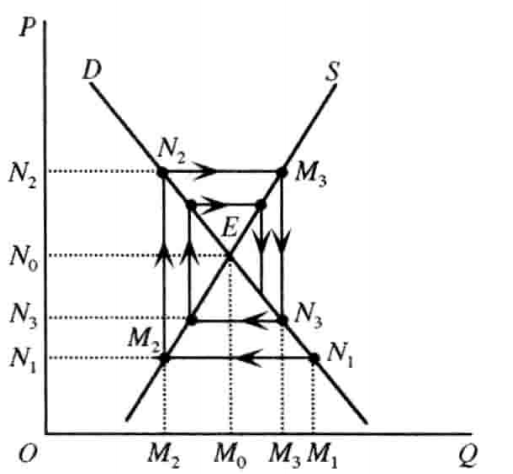

2. 第二种情况: 供给弹性大于需求弹性($E_{s} > E_{d}$), 发散型蛛网

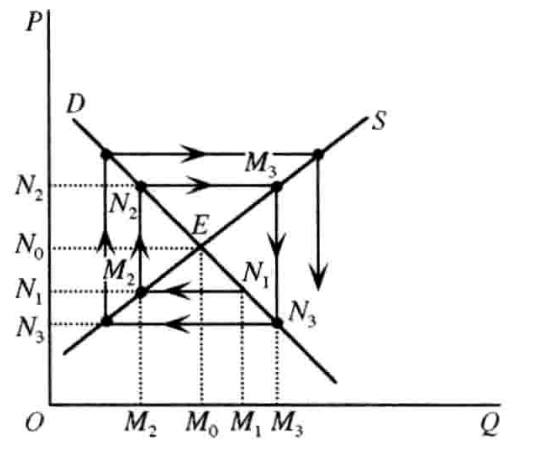

3. 第三种情况: 供给弹性等于需求弹性($E_s = E_d$ ),封闭型蛛网

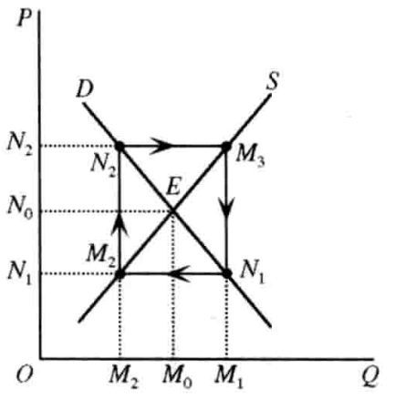

---

# 第三章 消费者行为理论

研究对象-消费者，又称居民户(household)，是指能够做出统一的消费决策的经济单位，它可能是一个人，也可能是一个由某些人组成的家庭。居民户提供生产要素，获得收入，目的是要达到最大的满足程度--即效用最大化。消费者行为理论既定自己的收入来达到效用最大化。

消费者行为:
1.  基数效用(cardinal utility)论 - 效用是可以计量并加总求和的，所以效用的大小可以用基数表示。用边际效用分析消费者行为。
2. 序数效用(ordinal utility)论 - 效用是不可计量并加总求和的，所以只能用序数来表达满足程度的高低与顺序。用无差异曲线分析研究消费者行为。

## 第一节边际效用分析

### 一、欲望与效用

研究消费者行为的出发点是欲望，归宿是欲望的满足，即效用。

 欲望(want)是一种缺乏感与求得满足的愿望。西方经济学家认为欲望是一种心理现象。

美国心理学家马斯洛五层模型：
1. 生理需求
2. 安全需求
3. 归属和爱的需求
4. 尊重的需求
5. 自我实现的需求

德国经济学家戈㚞两条欲望规律：
1. 欲望强度递减规律，即在一定时期内，一个人对物品的欲望强度随着该物品的增加而减少
2. 享受递减规律，即随着欲望的满足，人所得到的享受是递减的。

效用(utility) 是指个人从消费某种物品中所得到的满足。

西方经济学家强调了效用的主观性，效用本身没有伦理意义，又没有客观标准。

###  二、边际效用理论

总效用(total utility) 是指从消费一定量某种物品中所得到的总满足程度。

边际效用(marginal utility) 是指消费量每增加一个单位所增加的满足程度。

消费者愿意对某物品所支付的价格与他实际付出的价格的差额就是消费者剩余(consummers' surplus)

### 三、消费者均衡

消费者均衡(consumer equilibrium) 的原则:
如果消费者的货币收入是固定的，市场上各种物品的价格是已知的，那么消费者一定要使其所购买的各种物品的边际效用与他所付出的价格呈比例，也就是要使每一单位货币所获得的边际效用都相等。

设:
$M$ 为收入
$X,Y$为所消费的商品
$P_X,P_Y$为 $X$ 商品与 $Y$ 商品的价格
$MU_X,MU_Y$$X$ 商品与 $Y$ 商品的边际效用
$Q_X,Q_Y$为 $X$ 商品与 $Y$ 商品的购买量。

$$
P_X \cdot Q_X + P_Y \cdot Q_Y = M
$$

说明收入是有限的，购买各种商品的支出不能超过收入，也不能小于收入，小于收入达不到效用最大化。

$$
\frac{MU_X}{P_X} = \frac{MU_Y}{P_X}
$$

各种商品的边际效用与价格之比相等，即每一单位货币不论用于购买$X$商品，还是购买$Y$商品，所得到的边际效用都相等。

## 第二节 无差异曲线分析

### 一，无差异曲线

无差异曲线(indifference curve)是用来表示两种商品或两组商品的不同数量的组合对消费者所提供的效用是相同的。

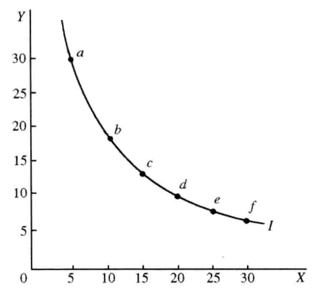

无差异曲线特征：
1. 第一，无差异曲线是一条向右下方倾斜的曲线，其斜率为负值。
2. 第二，在同一平面上可以有无数条无差异曲线。离原点越远的无差异曲线所代表的满足程度越高，离原点越近的无差异曲线所代表的满足程度越低。
3. 第三，在同一平面图上，任意两条无差异曲线绝不能相交，否则在交点上两条无差异曲线代表了相同的满足程度，与第二个特征相矛盾。
4. 第四，无差异曲线是一条凸向原点的线 (MRS)。

边际替代率(marginal rate of subsititution 简称 MRS)是消费者在保持相同的满足程度时，增加一种商品的数量与必须放弃另一种商品的数量之比。

$$
	MRS_{XY} = \frac{\Delta{Y}}{\Delta{X}}
$$

边际替代率是递减的，在连续增加某一种商品时，人们所愿意牺牲的另一种商品的数量是递减的，这就是边际替代率递减规律。

边际替代率实际上就是无差异曲线的斜率。

### 二，消费者均衡

消费可能线又成为预算线或等支出线，它表明了在收入与商品价格既定的条件下，消费者所能购买到的各种商品数量的最大组合。

消费者均衡的条件是:

$$
\frac{MU_X}{MU_Y} = \frac{P_X}{P_Y}
$$

---

# 第四章 生产理论

生产者称为厂商(firm)，厂商是指能做出统一的生产决策的经济单位，包括个人企业、合伙企业和公司。
在生产理论中假设厂商的目的是实现利润最大化，即在既定的产量下实现成本最小，或在既定的成本下达到产量最大。

利润最大化涉及两个问题：
1. 一是投入的生产要素与产出的产量之间的物质技术关系
2. 二是生产中使用的成本与技术与收益之间的经济关系

## 第一节 生产与生产的基本规律

### 一，生产函数

生产是对各种生产要素进行组合以制成产品的行为，生产也是把投入(input)变为(output)的过程。

生产要素是指生产中所使用的各种资源。
1. 劳动 $L$
2. 资本 $K$
3. 土地或自然资源 $N$
4. 企业家才能 $E$

$Q$ 代表总产量

$$
Q = f(L,K,N,E)
$$

只考虑劳动与资本

$$
Q = f(L,K)
$$

如果两种投入都按 $\lambda$ 倍增加，则产量也增加 $\lambda$ 倍。
线性齐次生产函数公式：

$$
\lambda{Q} = f(\lambda{L},\lambda{K})
$$

### 二，边际收益递减规律与生产要素的合理投入

生产要素投入量的变动对产量的影响：
1. 一种是所有的生产要素投入量都按同一比例变动
2. 一种是其他生产要素投入量都不变，只有一种生产要素的投入量变动。（边际收益递减规律研究的情况）

西方经济学家根据边际收益递减规律来分析某一种生产要素的合理投入问题。

$Q$ 代表某种生产要素的量

$\Delta{Q}$ 代表某种生产要素的增量

总产量(total product) : $TP$

平均产量(average product): $AP$

边际产量(marginal product): $MP$

$$
TP = AP\cdot{Q} 
$$

$$
AP = \frac{TP}{Q}
$$

$$
MP = \frac{\Delta{TP}}{\Delta{Q}}
$$

1. 第一，随着劳动量的增加，最初总产量、平均产量和边际产量都是递减的，但各自增加到一定程度之后就开始分别递减。
2. 第二，边际产量曲线与平均产量曲线一定要在平均产量曲线的最高点相交。在相交钱，平均产量是递增的，这是边际产量大于平均产量；在相交之后，平均产量是递减的，这时边际产量小于平均产量；在相交时，平均产量达到最大，这时边际产量等于平均产量。
3. 第三，当边际产量为零时，总产量达到最大；之后边际产量为负数时，总产量就会绝对减少。

### 三，规模经济

规模经济(economies of scale) 是指所有生产要素同时变动，从而生产规模变动时所引起的产量变动的情况。

随着各种生产要素的增加，生产规模的扩大，收益的变动大致要经过三个阶段：
1. 第一阶段，收益增加的幅度大于规模扩大的幅度，这是规模收益递增阶段
2. 第二阶段，收益增加的幅度与规模扩大的幅度相等，这时由规模收益递增到规模收益的短暂过渡阶段，称为规模收益不变阶段
3. 第三阶段，收益增加的幅度小于规模扩大的幅度，甚至收益绝对减少，这就是规模收益递减阶段。

内在经济(internal economies)是指一个厂商在生产规模扩大时从自身内部所引起的收益增加。

外在经济(extenal econmies)是指整个行业规模扩大时给个别厂商所带来的收益增加。

## 第二节 成本与收益分析

### 一、成本

成本(cost)也称为生产费用。

西方经济学家把成本分为两种:
1. 一种是生产中使用各种生产要素的实际支出，称为会计成本。
2. 为了得到某种东西放弃的其他东西，称为机会成本。

在西方经济学中成本既包含会计成本和机会成本，这两种成本之和称为经济成本。

会计利润： 总收益减去会计成本所得到的利润称为会计利润
经济利润： 总收益减去经济成本，即减去会计成本又减去机会成本而得到的利润称为经济利润。

$$
经济利润 = 总收益 - 机会成本 - 会计成本
会计利润 = 总收益 - 会计成本
$$

企业所追求的的利润最大化也是经济利润最大化。

成本：
1. 总成本(total cost $TC$ )
2. 平均成本(average cost $AC$ )
3. 边际成本(marginal cost $MC$ )

$Q$ 代表产品的量
$\Delta{Q}$ 代表产品的增量
$$
TC =AC \cdot Q 
$$

$$
AC =\frac{TC}{Q} 
$$

$$
MC =\frac{\Delta{TC}}{\Delta Q}
$$

成本:
1. 短期成本(short run)，短期不能根据市场需求调整全部生产要素。
2. 长期成本(long run)，指可以根据市场需求来调整全部生产要素。
3. 特短期(very short run),不能调整任何一种生产要素。
4. 特长期(very long run),不仅能调整全部生产要素，而且技术状况发生了变化。

短期成本:
1. 固定成本(fixed cost ，$FC$ ): 厂商在短期内必须支付的固定生产要素的费用，这种成本不随变量的变动而变动，在短期内是固定的。
2. 可变成本(variable cost,$VC$ ): 厂商在短期内支付的可变生产要素的费用，它随着产量的变动而变动。
3. 短期总成本(short-run total cost,$STC$ ): 即固定成本与可变成本之和。
4. 平均固定成本(average fixed cost,$AFC$ ):平均每单位产品所消费的固定成本。它变动规则是，随着产量的增加，平均固定成本一直在减少，最初减少的幅度很大，以后减少的幅度越来越小。
5. 平均可变成本(average variable cost $AVC$ ): 平均每单位产品所消耗的可变成本。
6. 短期平均成本(short-run average cost $SAC$ ): 即平均固定成本与平均可变成本之和。
7. 短期边际成本(short-run margial cost ,$SMC$ ): 短期内，每增加一单位产量所增加的总成本量。
8. 长期总成本(long-run total cost ,$LTC$ ) 随着产量的变动而变动，当没有产量时就没有总成本。
9. 长期平均成本曲线(long-run average cost ,$LAC$ ) : 是一条与无数条短期平均成本曲线相切的线。
10. 长期边际成本(long-run marginal cost ,$LMC$ ):是一条先降后升的变动较平缓的U型曲线。

### 二、收益

收益（revenue）指厂商卖出产品得到的收入，即价格与销量的乘积。

分类：
1. 总收益(total revenue,$TR$ ) 全部收入
2. 平均收益(average revenue ,$AR$ ) 每一单位产品平均所得收入
3. 边际收益(marginal revenue ,$MR$ ) 每增加一个单位销售所增加的收入

$Q$ 代表销售量，$\Delta{Q}$ 代表销售量增量
$$
TR = AR \cdot Q 
$$

$$
AR =\frac{\mathrm{TR}}{Q}
$$

$$
MR =\frac{\Delta{TR}}{\Delta Q}
$$
$P$ 代表价格

$$
TP \cdot P = TR
$$
$$
AP \cdot P = AR
$$
$$
MP \cdot P = MR
$$

### 三、利润最大化原则

$P$ 代表利润，$X$ 代表产量， $R$ 代表收益，$C$ 代表成本

$$
P = R(X) - C(X)
$$
利润最大化条件
$$
\frac{dP}{dX} = \frac{dR}{dX} - \frac{dC}{dX} = 0
$$

边际收益： $\frac{dR}{dX}$ 
边际成本：$\frac{dC}{dX}$

利润最大化的条件是边际收益等于边际成本：

$$
MR = MC
$$

## 第三节 生产要素的最合适组合

生产要素的最适组合就是要解决如何实现利润最大化，即如何在产量既定的情况下实现成本最小或在成本既定的情况下达到产量最大的问题。

### 一、生产要素最合适组合的原则

生产要素最适组合的原则是，在成本既定的情况下，要使所购买的各种生产要素的边际产量与价格的比例相等，即要使每一单位货币无论购买何种生产要素都能得到相等的边际产量。

劳动: $L$
资本: $K$
劳动的边际产量为: $MP_L$
价格为: $P_L$
购买量为: $Q_L$
资本的边际产量为: $MP_K$
价格为: $P_K$
购买量为: $Q_K$
成本为: $C$

$$
P_L \cdot Q_L + P_K \cdot Q_K = C
$$

$$
\frac{MP_L}{P_L} = \frac{MP_K}{P_K}
$$

### 二、等产量线与生产要素最适组合的确定

等产量线(iso-quant) 表示某一固定数量的产品可以用所需的各种生产要素的不同数量的组合生产出来。

特征：
1. 第一，等产量线是一条向右下方倾斜的线，其斜率为负值。
2. 第二，在通一平面图上可以有无数条等产量线。
3. 第三，在同一平面图上，任意两条等产量线决不能相交，否则在交点上两条等产量线代表了相同的产量水平，与第二个特征相矛盾。
4. 第四，等产量线是一条凸向原点的线。

## 第四节 生产可能性曲线与机会成本

### 一、生产可能性曲线

生产可能性曲线(production-possibilty curve) 是指在既定的资源之下所能达到的两种产品最大产量的组合。

边际转换率(marginalrate of transformation,$MRT$ ) 在既定的资源下，为了增加一种产品就必须减少另一种产品，增加的某种产品的数量与减少的另一种产品的数量之比称为边际转换率。

$\Delta{X}$ 代表所增加的$X$ 产品，$\Delta{Y}$ 代表所减少的 $Y$ 产品。
$$
MRT_{XY} = \frac{\Delta{Y}}{\Delta{X}}
$$

### 二、机会成本

机会成本： 当把一定资源用于生产某种产品时所放弃的另一种产品的数量就是这个产品的机会成本。

在运用机会成本这一概念时，需要满足以下三个条件:
1. 第一，资源本身要有多种用途
2. 第二，资源可以自由流动而不受限制
3. 第三，资源要能够得到充分利用

---
# 第五章 厂商均衡理论

均衡价格理论解决了完全竞争条件下价格与产量的决定，说明了市场机制如何调节经济。

厂商均衡理论把市场经济结构分为四种类型：
1. 完全竞争
2. 垄断竞争
3. 寡头垄断
4. 完全垄断

## 第一节 完全竞争下的厂商均衡

### 一、完全竞争的条件

完全竞争(perfect competition) 或纯粹竞争(pure competition) 是指一种竞争不受任何阻碍和干扰的市场结构。

条件：
1. 市场上有许多生产者与消费者。每个人都是既定价格的接受者(price taker),而不是价格的决定者(price maker)。
2. 不存在产品差别，厂商无法通过自己的产品差别来控制价格。
3. 第三，各种生产资源都可以完全自由流动而不受任何限制。
4. 第四，市场信息是畅通的，双方不存在相互的欺骗。

### 二、完全竞争下的收益规律

在完全竞争之下，市场价格是由整个行业的供需关系所决定的。市场价格等于平均收益。

### 三、完全竞争下的厂商均衡

短期边际成本曲线: $SMC$
短期平均成本曲线: $SAC$
边际收益曲线: $MR$
长期边际成本曲线: $LMC$
长期平均成本曲线：$LAC$
平均收益: $AR$

短期均衡条件:

$$
SMC = MR
$$

长期均衡的条件:

$$
LMC = MR = LAC = AR
$$

## 第二节 完全垄断下的厂商均衡

### 一、完全垄断的含义

完全垄断(monopoly)，是指整个行业的市场完全处于一家厂商所控制的状态。

形成条件：
1. 自然条件
2. 立法条件

### 二、完全垄断下的收益规律

垄断厂商是价格决定者，它的供给影响着价格，价格与需求量呈反方向变动，因此，需求曲线是一条向右下方倾斜的线。需求曲线与平均曲线重叠为一条线。

### 三、完全垄断下的厂商均衡

在完全垄断条件下，短期均衡与长期均衡是同样的，均衡的条件都是 $MR = MC$,而且无论长期或短期都有超额的垄断利润存在。

## 第三节 垄断竞争下的厂商均衡

### 一、垄断竞争的条件

垄断竞争(monopolistic competition) 是指一种既有垄断又有竞争、既不是完全竞争又不是完全垄断的市场结构。

条件：
1. 第一，产品之间存在着差别。
2. 第二，厂商的数量仍然比较多。

### 二、垄断竞争下的厂商均衡

垄断竞争条件下，长期均衡的条件是: $MC = MR$,$AC = AR$

## 第四节 寡头垄断下的厂商均衡

### 一、寡头垄断的含义

寡头垄断又称为寡头(oligopoly)，指为数不多的销售者。

寡头分类：
1.  生产相同产品的纯粹寡头
2. 生产有差别产品的有产品差别寡头

### 二、寡头理论

寡头市场上价格变动的最高限等于完全垄断下的垄断价格，而低价等于完全竞争下长期均衡时的竞争价格。

寡头市场上，价格的确定往往不是由市场供求关系直接决定，而是由少数寡头垄断者通过协议或默契作为行政措施而指定的，这种价格称为操纵价格。

---
# 第六章 分配理论

分配理论是要解决为谁生产的问题，即生产出来的产品如何在社会各阶层中分配的问题。
解决分配问题就是解决生产要素的价格决定问题。

## 第一节 以边际生产力理论为基础的分配理论

### 一、边际生产力

在其他条件不变的情况下，追加一单位某种生产要素所增加的产量时该要素的边际生产力（marginal productivity）。

以实物来表示某要素的边际生产力，则可以称为该要素的边际生产实物量或边际物质产品(marginal physical product 简称为$MPP$ )

如果以收益来表示某要素的边际生产力，则可以称为该要素的边际收益产量(marginal revenue product 简称 $MRP$ )

$$
MRP = MPP \cdot P
$$

### 二、边际产生力决定工资与利息

经济分类：
1. 静态经济师指一切因素都不发生变动的经济，静态经济学正式要研究这种经济中的自然规律。
2. 动态经济是指一切因素都发生变动的经济，研究这些变动及其对经济的影响则属于动态经济的范畴。

根据边际生产力理论，工资取决于劳动的边际生产力。利息取决于资本的边际生产力。

分配理论是要论证市场经济社会的分配制度是合理公正的。

## 第二节 以均衡价格理论为基础的分配理论

### 一、生产要素的需求与供给

### 二、工资理论

### 三、利息理论

### 四、地租理论

### 五、利润理论

## 第三节 洛伦斯曲线和基尼系数

### 一、洛伦斯曲线

### 二、洛伦斯曲线的运用

### 三、基尼系数

---

# 第七章 国民收入核算理论

## 第一节 国内产生总值

### 一、国内生产总值的含义

### 二、国内生产总值的计算方法

### 三、国民收入核算中五个总量之间的关系

### 四、其他国内生产总值

### 五、国内生产总值计算中的缺陷

## 第二节 物价指数与失业率

### 一、物价指数

### 二、失业率

---

# 第八章 国民收入的决定

## 第一节 总需求

### 一、总需求的构成

### 二、总需求曲线

### 三、总需求曲线的移动

## 第二节 总供给

### 一、长期总供给曲线

### 二、短期总供给曲线

## 第三节 总需求--总供给模型

### 一、基本模型

### 二、国民收入均衡的不同状况

### 三、总需求对国民收入均衡的影响

### 四、总供给对国民收入均衡的影响

---

# 第九章 失业与通货膨胀

## 第一节 失业

### 一、自然失业

### 二、周期性失业

### 三、失业的影响

## 第二节 通货膨胀

### 一、金融体系

### 二、货币的基本知识

### 三、通货膨胀的基本知识

## 第三节 失业与通货膨胀的关系：菲利普斯曲线

---

# 第十章 经济周期理论

## 第一节 经济周期理论概况

### 一、经济周期的含义

### 二、经济周期的分类

### 三、对经济周期原因的解释

## 第二节 乘数与加速原理相结合的理论

### 一、加速原理

### 二、乘数与加速原理相结合的理论

---

# 第十一章 经济增长理论

## 第一节 经济增长理论的概况

### 一、经济增长的含义

### 二、经济增长理论的主要内容

## 第二节 哈罗德--多马模型

### 一、哈罗德--多马模型的基本公式

### 二、经济稳定增长的条件

### 三、经济中短期波动的原因

### 四、经济中长期波动的原因

## 第三节 对经济增长因素的分析

### 一、肯德里克对全部要素产生率的分析

### 二、丹尼森对经济增长因素的分析

## 第四节  零经济增长理论

### 一、增长极限论

### 二、增长价值怀疑论

---

# 第十二章 宏观经济政策

## 第一节 宏观经济政策

---

# 第十三章 当代西方经济学流派的概况

---

# 第十七章 新制度学派

在当代西方经济学中，新制度学派即反对后凯恩斯主义各派，又反对货币主义、自由主义各派。

## 第一节 制度学派的概况

### 一、制度学派的历史

- 第一阶段： 从19世纪末到20世纪30年代，以凡勃伦为代表的制度学派的形成时期。
	 特点：
	- 批判正统经济学，建立以研究制度演进过程为基本内容的经济理论。他认为经济是整个社会制度的一个组成部分，因此，经济学应该研究人类经济生活借以实现的各种制度。他还把社会看做一个动态的过程，认为经济是社会制度演进中的一环，所以，经济学还要研究制度的形成和变化。凡勃伦用心理分析来解释制度的形成，又用进化论来解释制度的发展与演变，这样就建立了以经济制度之累积的进化历程为基础的经济理论。
	- 批评资本主义社会的弊病，主张从制度或结构上来改革资本主义社会。他认为，在人类经济生活中有两种制度，即满足人的物质生活的生产技术制度和私有财产制度。资本主义社会的问题正在于这两种制度之间的矛盾。解决的办法则是建立由工程师、科学家和技术人员组成的"技术人员委员会"来代替企业经营者的统治。
- 第二阶段： 从20世纪30年代到50年代，这是制度学派从凡勃伦的旧传统到加尔布雷斯的新理论之间的过渡阶段。
- 第三阶段： 从20世纪50年代到80年代，这是新制度经济学的形成与发展时期。

### 二、制度学派的基本特点

- 第一，把经济学研究的对象确定为制度。
- 第二，用演进的、整体的分析法来研究制度问题。
- 第三，对资本主义社会弊病进行一定的揭露与批评，并主张用结构改革的方法去解决这些问题。

### 三、新制度学派的特点

- 新制度学派与旧制度学派所处的时代不同，所要解决的问题也不同。在当前，滞涨的出现、多种社会经济问题的并发都是历史上从未有过的。在这样的形势之下，新制度学派的理论研究就与现实有更密切的关系，更要对这些问题提出新的解释寻求新的解决办法。
- 制度经济学经历了长期的发展，今天的新制度学派理论更加完整、系统，所提出的政策目的和政策措施也更加具体和广泛。
- 新制度学派在一定程度上受到凯恩斯主义的影响。当然，他们认为，凯恩斯主义没有从制度结构问题入手，因此，就无法从根本上解决资本主义社会的问题。

## 第二节 新制度学派的理论

### 一、二元体系理论：加尔布雷斯对当代资本主义社会的制度分析

