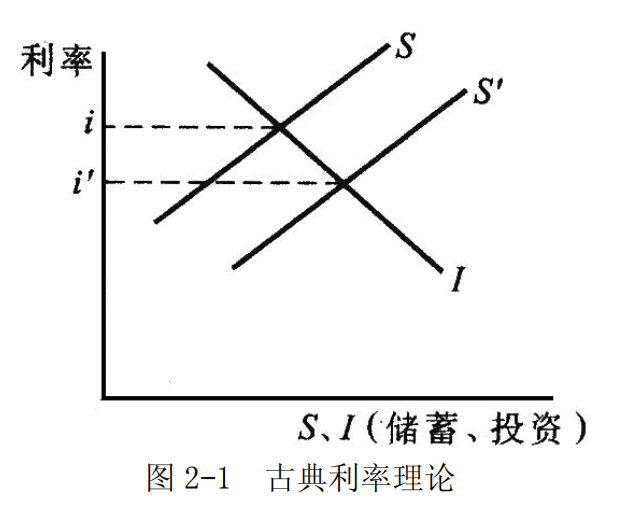
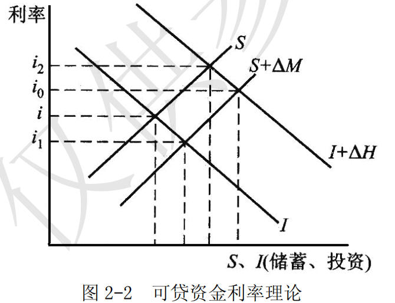
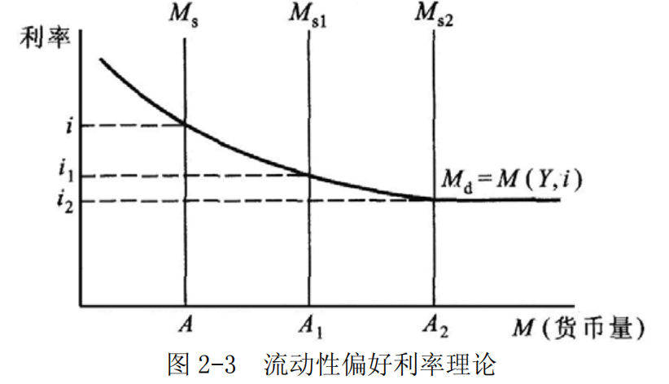
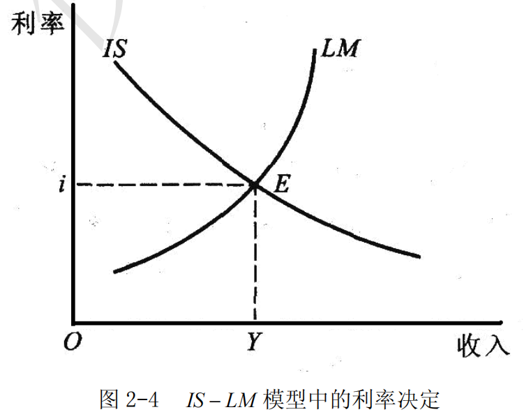
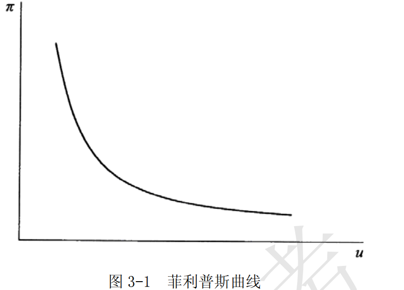
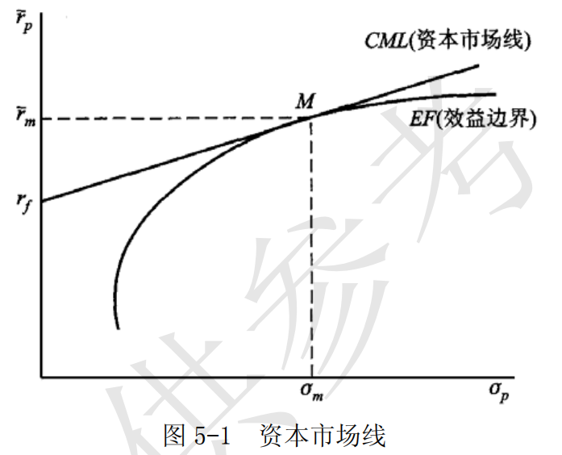
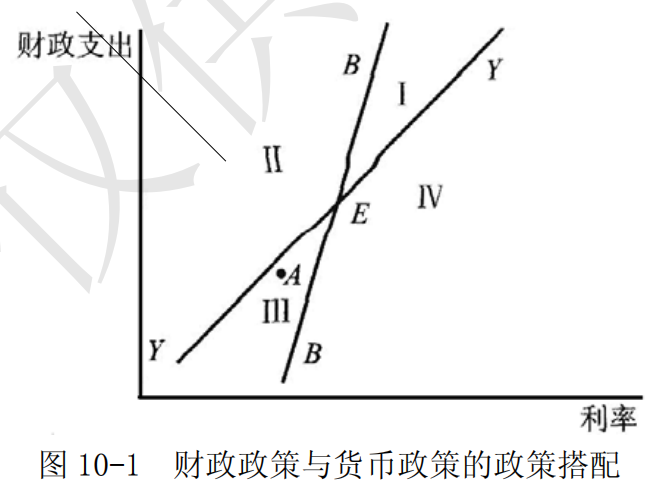

## 第 1 章 货币供求理论

## 摘要

### 第一节 货币的供给

#### 第一节 货币的供给

##### 一、货币的概念与统计
###### 1. 货币的概念

交易的媒介。

历史上人们对于货币的信心是建立在货币本身具有价值这一前提下的。

“法币” 由各国的中央银行或货币当局垄断发行的，人们对货币的信心在于它由国家信用作担保。

###### 2. 货币的统计

主要标准: 流通性，即一种资产以较小的代价转换为实际购买力的便利性。

- $M_{0}$  ：现金流通量；
- $M_{1}$  ： $M_{0}$  + 各种活期存款；
- $M_{2}$  ： $M_{1}$  +  各种定期存款。

##### 二、信用货币的创造过程

现代经济中的信用货币是由银行体系供应的。
- 中央银行垄断货币的发行，提供原始货币，形成货币供应的源头。
- 商业银行体系则通过对原始货币的辗转存贷，可以将其数量多倍扩张。

###### 1. 商业银行的信用货币扩张

中央银行将贷款的一个固定比例当做提款准备，称为法定准备（RR）。

$$
D=\frac{R}{RR_r}
$$

$D$ : 整个商业银行体系中的存款货币总量
$R$ : 原始存款
$RR_r$ :法定准备比率
$L$ : 贷款

单次扩张：
$$
D = L + R
$$

###### 2. 中央银行与基础货币供应

|   资产    |   负债   |
| :-----: | :----: |
| 对商业银行贷款 |   现金   |
|  对财政贷款  | 商业银行存款 |
| 外汇、黄金储备 |  财政存款  |

商业银行是先有负债，后有资产运用
中央银行则是资产决定负债

这种特权的来源在于中央银行对货币的垄断发行权。

###### 3. 货币供应的完整模型

整个社会的货币共有三种形态：
- 1. 现金 $C$ 由中央银行发行和管理
- 2. 商业银行在中央银行的存款准备 $R$, 包括中央银行要求的法定准备金 （$RR$）和商业银行自行决定的超额准备金 ($ER$)
- 3. 存款货币 $D$

$$
C + R  = 基础货币（B）
$$

它直接表现为中央银行的负债，并县是由中央银行资产业务创造的；它是信用货币创造的源头。

$$
C + D = 货币供应量(M)
$$
它是基础货币在商业银行体系中经过多倍扩张（m 倍数）形成的。

$$
M = mB
$$
$$
m = \frac{M}{B} = \frac{C+D}{C+R} 
$$

##### 三、货币供给的内生性与外生性

“内生性”：指的是货币供应量是在一个经济体系内部由多种因素和主体共同决定的，中央银行只是其中一部分，因此，并不能单独决定货币供应量。

“外生性”：指的是货币供应量由中央银行在经济体系之外，独立控制。

####  第二节 货币需求

利率是经济体系中非常重要的价格信号。
它决定了储蓄向投资转化的规模和效率。
利率是货币资金的供求关系决定的。

##### 一、传统的货币数量理论

##### 1. 费雪的现金交易说

### 一、名词解释

#### 1．基础货币

基础货币也称为“高能货币”、“强力货币”，是指中央银行所发行的现金货币和商业银行在中央银行的准备金存款的总和。
基础货币直接表现为中央银行的负债，它是由中央银行资产业务创造的，并且是信用货币的源头。

#### 2．货币层次

货币层次是指各国中央银行在确定货币供给的统计口径时以金融资产流动性的大小作为标准，并根据自身政策目的的特点和需要对货币所划分的层次。
其粗略的分类为: 
- $M_{0}$  ：现金流通量；
- $M_{1}$  ： $M_{0}$  + 各种活期存款；
- $M_{2}$  ： $M_{1}$  +  各种定期存款。

货币层次的划分有利于中央银行进行宏观经济运行监测和货币政策操作。

#### 3．流动性偏好

凯恩斯在分析影响货币需求的因素时认为，货币需求主要由个人对收入支配的心理因素决定。
个人对收入支配有消费和储蓄两种形式。其中储蓄部分是以现金货币形式持有还是以有价证券形式持有，取决于人们对金融资产流动性的偏好程度，即流动性偏好。
凯恩斯认为影响流动性的偏好程度即影响货币需求的因素主要有：
- 交易动机
- 预防动机
- 投机动机。

### 二、简答题

#### 1．简要说明货币供应的内生性与外生性。

货币供给的内生性与外生性的争论，实际上是讨论中央银行能否完全独立控制货币供应量。
- （1）内生性指的是货币供应量是在一个经济体系内部由多种因素和主体共同决定的。
	中央银行只是其中的一部分，因此，并不能单独决定货币供应量。微观经济主体对现金的需求程度、经济周期状况、商业银行、财政和国际收支等因素均影响货币供应。

- （2）外生性指的是货币供应量由中央银行在经济体系之外独立控制。
	其理由是，从本质上看，现代货币制度是完全的信用货币制度，中央银行的资产运用决定负债规模，从而决定基础货币数量，只要中央银行在体制上具有足够的独立性，不受政治因素等的干扰，就等于从源头上控制了货币数量。

事实上，无论从现代货币供应的基本模型，还是从货币供给理论的发展来看，货币供给在相当大程度上是“内生性”的，而“外生性”理论则依赖于过于严格的假设。

#### 2．简要比较费雪方程与剑桥方程。

- (1) 定义：
	- 1. 费雪方程为： 
		 $$MV=PY$$
		  ，其中， $M$  为货币数量， $V$  为货币流通速度， $P$  为价格水平， $Y$  为产出。
		变形:
		$$M=\frac{1}{\bar{V}}\cdot{P\bar{Y}}$$
		
		
	
	费雪方程表明，由一定水平的名义收入引起的交易水平决定了人们的货币需求。

	- 2. 剑桥方程为： $$M_{d} = kPY$$  ，其中，PY  是名义收入，它可以体现在多种资产形式上，货币是其中的一种，因此，货币需求是名义收入的比率为  k  的部分，k的大小则取决于持有货币的机会成本，或者说取决于其它类型金融资产的预期收益率。

- (2) 两方程的相同点

	- ①形式相同，其中 k 与v 是倒数关系；

	- ②结论相同，都说明货币数量决定物价水平。

- （3）两方程的不同点

①分析的侧重点不同：
费雪方程从货币的交易功能着手，而剑桥方程则从货币的价值储藏手段功能着手，从个人资产选择的角度进行分析。

②费雪方程把货币需求与支出流量，重视货币支出的数量和速度，而剑桥方程则从货币形式保有资产存量的角度考虑货币需求，重视这个存量占收入的比例。所以费雪方程也称之为现金交易说，而剑桥方程式则被称为现金余额说。

③两个方程式所强调的货币需求决定因素有所不同。
费雪方程式从宏观角度出发，认为货币需求仅为收入的函数，利率对货币需求没有影响；而剑桥方程式则从微观角度，将货币需求看作是一种资产选择的结果，这就隐含着利率会影响货币的需求，这种看法极大的影响了以后的货币需求研究。

#### 3．简要说明货币主义“单一规则”货币政策的理论基础。

- （1）单一规则是指由货币主义提出的主张保证货币供给有一个长期稳定的增长率的货币政策主张。
	弗里德曼认为控制货币供给量的最佳选择是公开宣布并长期采用一个固定不变的货币供给增长率，货币供给增长率与经济增长率大体相适应，而且该增长率一经确定和公布在年度内和季度内不应任意变动。

- （2）货币主义“单一规则”货币政策的理论基础
	弗里德曼按照微观经济学需求函数分析方法，主要考虑收入与持有货币的各项机会成本，构建了一个描述性的货币需求函数，该函数可以简化为：

	$$\frac{M_{d}}{P} = f(Y_{p},(r_{b} - r_{m}),(r_{e} - r_{m}),({\pi}^{e}-r_{m}))$$
  
	其中，
	$\frac{M_{d}}{P}$ 为对真实货币余额的需求，
	$Y_{p}$  为永久收入， $r_{m}$ ， $r_{b}$ ， $r_{e}$  分别为货币、债券、股票的预期回报率，
	${\pi}^{e}$  为预期通货膨胀率。

	根据上述货币需求函数，弗里德曼认为：

①在货币需求中，利率的影响很小，因为利率变化后， $r_{m}$  与 $r_{b}$  、 $r_{e}$  、 ${\pi}^{e}$  发生相应的变动，相互之间有抵消作用，或者说，货币需求函数中的各项机会成本会保持相对稳定。

②由于利率对货币需求没有影响，因此，货币的流通速度稳定的、可以预期的。依据经验，它与收入水平保持“正的一致性”。

③永久收入是货币需求的决定因素。永久收入意指预期未来年度的平均收入，它是一个相对稳定的变量，在很大程度上不受短期经济因素的影响。因此，弗里德曼认为货币需求函数也是相对稳定的，并且据此得出了著名的“规则货币供应”的政策主张。

### 三、论述题

#### 1．试述货币需求理论发展的内在逻辑。

- （1）西方货币需求理论沿着货币持有动机和货币需求决定因素这一脉络，经历了传统货币数量学说、凯恩斯学派货币需求理论和货币学派理论的主流沿革。

- （2）西方早期的货币需求理论为传统货币数量说，主要研究货币数量对物价水平和货币价值的影响。
	代表性理论为：
	- 费雪的现金交易数量说
	- 剑桥学派的现金余额说
	
	两个理论的结论和方程式的形式基本相同，都认为货币数量决定物价水平。
	但是，两者分析的出发点不同。传统货币数量说的缺陷是没有分析货币数量对产出量的影响，对影响货币持有量的效用和成本的因素没有详细分析。

- （3）凯恩斯的流动性偏好货币需求理论
	沿着现金余额分析的思路，同样从货币作为一种资产的角度开始分析，指出货币需求就是人们特定时期能够而且愿意持有的货币量，这种货币需求量的大小取决于流动性偏好心理。
	而人们对流动性偏好来源于三种动机：
	- 交易动机
	- 谨慎动机
	- 投机动机
	
	这三种动机可归结为 $L_1$ （交易动机）和  $L_2$ （投机动机）， $L_1$ 取决于收入，与收入成正比， $L_2$  取决于市场利率，与市场利率成反比 $M=L_{1}{(Y)}+L_{2}{(r)}$ 。由于短期内人们投机动机需求及不稳定，导致市场利率波动，进而影响投资，影响产出量和经济增长量。凯恩斯的货币需求理论虽然弥补了传统货币数量说认为货币量不影响货币流通速度和产出量的理论局限，但由于过度强调需求管理而忽视了货币供给量变动对物价的影响。此外凯恩斯的货币需求理论是短期分析，其中影响货币需求的收入和利率变量都是短期变量，进而得出货币需求是不稳定的结论。

- （4）凯恩斯的货币需求理论的发展。
	- ①鲍莫尔对交易性货币需求的修正，深入分析了交易性货币需求与利率之间的关系。
	- ②托宾对投机性货币需求的修正。托宾讨论了在利率预期不确定前提下，作为风险回避者的投资者最优金融资产的组合，和人们的调整资产组合行为对货币投机需求的影响。
	- ③新剑桥学派对凯恩斯货币需求动机理论的发展。将凯恩斯的三大货币需求动机扩展为七个动机，将凯恩斯的三大货币需求动机具体化，并提出了公共权利动机，即政府实施扩张性需求政策所产生的扩张性货币需求动机。

- （5）货币主义学派的现代货币数量论。
	以弗里得曼为首的货币主义学派一方面采纳凯恩斯将货币作为一种资产的思想，采纳了相同的需求动机和影响因素的分析方法，并利用它把传统的货币数量论改写为货币需求函数。
	另一方面又基本肯定货币数量论的结论，即货币量的变动影响物价水平。但由于其把凯恩斯的短期分析变为长期分析，提出了有别于凯恩斯短期收入变量的恒久收入变量，并认为恒久收入是一个稳定的变量，同时用实证分析指出货币需求对利率缺乏弹性，从而其重要结论是，因为影响货币需求的各因素是稳定的变量，所以，货币需求是一个稳定的函数。既然货币需求是稳定的，中央银行就能够客观准确地制定货币供应量增长目标，实施稳定的货币政策。他反对凯恩斯需求管理的政策主张，将管理的重点放在货币供给上，通过控制货币供给量使供给与需求相一致，以保证经济的稳定发展，控制通货膨胀。

#### 2．试述现代经济中信用货币的供应与扩展过程。

现代经济中信用货币是通过以中央银行为核心的银行体系通过信贷扩张过程被供应和扩展的。因而可以通过对银行体系信贷机制的实证分析，来揭示信用货币供应和扩展的过程。具体体现在以下两个相互联系的过程。

- 1. 中央银行信用创造与基础货币供应的过程
由于中央银行是一国惟一的货币发行机构，因而经济活动中的新增货币供给量首先是由中央银行根据经济增长的需要发行出来的。
其基本过程是：
当经济活动主体需要更多的货币时，会增加对信贷资金的需求，当商业银行的信贷不能满足这一需求时，商业银行就会将客户[贴现](经济学-术语.md#贴现)和抵押的资产如汇票、抵押凭证、外汇等抵押给中央银行，以取得贷款；同时当财政出现赤字时，也会从中央银行透支，或中央银行从政府债券二级市场上购政府债券。这样中央银行的各项资产就会增加，从而使商业银行的存款增加，商业银行可以据此增发贷款，同时增加其在中央银行交纳的准备金存款，最终，整个商业银行体系的存款准备金总和在数量上等于商业银行在中央银行的存款。此外，商业银行在经营经营中需要面对客户提取现金的需要，因此，在中央银行的存款准备金进一步分解为准备金存款和流通中的现金两部分，这两部分的和称作基础货币。
中央银行货币发行的过程可简单概括为中央银行资产增加使其负债——基础货币供应增加的过程。

- 2. 商业银行的信用扩张与派生存款的创造过程
在中央银行扩张基础货币的同时，商业银行也在扩张其信贷，并创造出存款货币增量。这一过程可概括为商业银行体系通过其获得的原始存款发放贷款，通过原始存款在体系内的辗转存贷，从而成倍创造派生存款的过程。

在上述两个过程中，商业银行的原始存款来源于中央银行的新增基础货币发行，它表现为中央银行资产增加使其负债——基础货币供应增加的过程，基础货币的增加成为商业银行成倍扩张信用货币的基础。当商业银行的原始存款正好等于其在中央银行的存款准备金时，商业银行的信贷扩张能力达到最大。这一过程可用以下公式表示：

$$
M_{s} =KB
$$
 
 。其中 B 表示基础货币，表明中央银行对信用货币的扩张；K 为货币乘数，表示商业银行扩张货币量的倍数。

#### 3．试述货币均衡与市场均衡间的关系。

货币均衡是指货币供给与货币需求大致相等的状况，市场均衡则是产品市场中供求相等的状态。

- （1）货币均衡与市场均衡间的关系表现为：
	- ①总供给决定货币需求，但同等的总供给可有偏大或偏小的货币需求。
	- ②货币需求引出货币供给，但也绝非是等量的。
	- ③货币供给成为总需求的载体，同样，同等的货币供给可有偏大或偏小的总需求。
	- ④总需求的偏大、偏小，会对总供给产生巨大的影响：
		- 总需求不足，则总供给不能充分实现；
		- 总需求过多，在一定条件下有可能推动总供给增加，但并不一定可以因此消除：差额。
	- ⑤总需求的偏大、偏小也可以通过紧缩或扩张的政策予以调节，但单纯控制需求也难以保证实现均衡的目标。

- （2）如果以  $M_{s}$ 、 $M_d$ 、 AS 、 AD 分别代表货币的供与求、市场的供与求，它们的关系可表示为图 。它们之间的作用都是相互的，箭头不过表示其主导的方向。

	

由图可以看出，货币均衡与市场均衡有着紧密的联系，货币均衡有助于市场均衡的实现。但是，二者之间又有明显的区别，即货币均衡并不必然意味着市场均衡。原因在于：
- ①市场需求是以货币为载体，但并非所有的货币供给都构成市场需求。
	满足交易需求而作为流通手段（包括流通手段的准备）的货币，即现实流通的货币，形成市场需求；
	而作为保存价值的现实不流通的货币则不构成市场需求，或者说它是潜在的需求而不是当期的需求。
	这种差别可表示如下：
	
	$$货币供给=现实流通的货币+现实不流通的货币$$
	
$$ 市场需求＝现实流通的货币×货币流通速度$$

- ②市场供给要求货币使之实现，或使之出清，因此提出对货币的需求。
	但这方面的货币需求也并非对货币需求的全部。对积蓄财富所需的价值保存手段则并不单纯取决于市场供给，或至少不单纯取决于当期的货币供给—用于保存财富的货币显然有很大部分是多年的积累。这种差别可表示如下：

$$
市场供给\div货币流通速度=对现实流通货币的需求
$$

$$
货币需求＝对现实流通货币的需求 + 对现实不流通货币的需求
$$

如果简单理解，可以说市场总供需的均衡关系是与处在现实流通状态的货币的供需关系一一地对应着。但也应该注意，现实流通的货币与现实不流通的货币之间是可以而且事实上也是在不断转化的。

#### 4．试析货币供给的产出效应及其扩张界限。

在货币量能否推动实际产出的论证中，现在已被广泛认可的是联系潜在资源、可利用资源的状况进行分析的方法：

- （1）只要经济体系中存在着现实可用做扩大再生产的资源，且其数量又比较充分，那么，在一定时期内增加货币供给就能够提高实际产出水平而不会推动价格总水平的上涨。

- （2）待潜在资源的利用持续一段时期而且货币供给仍在继续增加后，经济中可能出现实际产出水平同价格水平都在提高的现象。

- （3）当潜在资源已被充分利用但货币供给仍在继续扩张，经济体系中就会产生价格总水平上涨但实际产出水平不变的情况。

这三个阶段可用图 1-2 表示。

图 1-2 中，横轴代表产出增长率，纵轴代表物价上涨率，A 和 B 两个拐点分别代表由货币供给增加形成的产出率和物价上涨率不同组合阶段的界限。
- A 是货币供给只具有实际产出效应而无物价上涨效应的临界点 
- B 是货币供给增加既有实际产出效应又有物价上涨效应阶段的终点，也是货币供给增加只具有物价效应而无实际产出效应阶段的起点。
- B 点实际上是一定时期产出增长的极限点。
	达到这一点，意味着经济体系中的现实可利用资源都得到了充分利用；如果没有达到，则可以表述为，在实际 GNP 水平与潜在 GNP 水平之间还存在缺口。一般说来，存在实际GNP 和潜在 GNP 之间的缺口是对多数国家经济成长状态的描述。换言之，在现实生活中，实际经济增长率很难达到使潜在资源被全部利用的程度，因此总会存在一定的潜在 GNP 损失。之所以如此，一个重要原因是：当货币供给扩张的作用超越了 A 点之后，由于产出增加的同时还伴随着物价的上涨，公众对物价上涨的心理承受力等因素就会对政策选择产生重要的影响。

---

## 第 2 章 利率理论

### 一、名词解释

#### 1．收益的资本化

收益的资本化是指，由于利息已转化为收益的一般形态，于是任何有收益的事物，即使它并不是一笔贷放出去的货币，甚至不是真正有一笔实实在在的资本存在，也可以通过收益与利率的对比而倒过来算出它相当于多大的资本金额。

#### 2．名义利率和实际利率

名义利率是指以名义货币表示的利率，是借贷契约和有价证券上载明的利息率，也就是金融市场表现出的利率。
实际利率是指名义利率剔除了物价变动（币值变动）因素之后的利率，是债务人使用资金的真实成本。
当一般物价水平不变时，名义利率与实际利率是等量的。在名义利率不变的情况下，物价水平的波动会导致实际利率的反向变动。
关系式为：
$$名义利率=实际利率+通货膨胀率$$或者：
$$实际利率=名义利率-通货膨胀率$$

#### 3．基准利率

基准利率是指带动和影响其他利率的利率，也称为“中心利率”。
基准利率主要表现为中央银行的再贴现率，即中央银行向其借款的银行收取的利率。基准利率的变动是货币政策的主要手段之一，是各国利率体系的核心。中央银行一般通过改变该利率影响银行的借贷成本，进而影响市场利率。

#### 4．利率与收益率

利率是利息率的简称，是一定时期内利息额与贷出资本额的比率。利率体现着生息资本额的增殖程度，是衡量利息量与本金之比的尺度。
收益率是向证券持有者支付的利息加上以购买价格百分比表示的价格变动率。持有债券从时间 $t$  到时间 $t+1$ 的收益率公式为：

$RET = \frac{C + P_{t+1} -P_{t}}{P_{t}}$

其中, $RET$  为债券持有时间 $t$  到时间 $t +1$ 的回报率，
$P_{t}$  为 $t$  时该债券的价格；
$P_{t+1}$  为 $t +1$ 时该证券的价格; 
$C$ 为息票利息。

利率是利息与本金的比率，但这不能准确衡量在一定时期内投资人持有证券所能得到的收益状况。收益率能准确衡量在一定时期内投资人持有证券所能得到的收益状况。

#### 5．短期利率和长期利率

金融市场上的利率种类根据期限可分为短期利率和长期利率。
短期利率反映的是货币市场上各种借贷利率，长期利率反映的是资本市场上各种借贷利率，因此利率在两个市场上形成不同的利率水平，短期利率一般低于长期利率。但是，由于两个市场是密切联系的，利率的变动会导致资金在各个市场间的流动，同时资金的流动又会引起利率的变动，因而，利率在两个市场是被联系在一起的，短期利率和长期利率同时升降，但短期利率的波动幅度往往大于长期利率。

### 二、简答题

#### 1．简要说明古典利率理论的主要内容。

古典利率理论的主要思想为：利率由投资需求与储蓄意愿的均衡所决定。
投资是对资金的需求，随利率上升而减少，储蓄是对资金的供应，随利率上升而增加，利率就是资金需求和供给相等时的价格，如图 2-1 所示。

一般情况下，一方面，利率越高，储蓄越多。储蓄是利率的递增函数： $S=f(i)$ 。
另一方面，利率越低，投资量越大，投资是利率的递减函数： $I=q(i)$  。
储蓄和投资都是利率的函数。
i 为储蓄与投资相等时所表示的均衡利率水平。
如果储蓄增加，而投资不变，均衡利率水平就会降低至  $i^{'}$  。

#### 2．简要说明可贷资金利率理论的主要内容。

可贷资金利率理论是古典利率理论的逻辑延伸和理论发展，创立于 20 世纪三四十年代。可贷资金利率理论一方面继承了古典利率理论基于长期实际经济因素分析的理论传统，另一方面开始注意货币因素的短期作用，并以流量分析为线索。

可贷资金利率理论认为，利率由可贷资金的供求决定。可贷资金的供给包括：
	- 总储蓄 $S$ 
	- 银行新创造的货币量 $\Delta{M}$ 。
	
可贷资金的需求包括：
	- 总投资 $I$ ；
	- 因投机动机而发生的休闲货币所储存金额的增加 $\Delta{H}$ 。

而利率会使资金供需相等，即：

$$I+\Delta{H}=S+\Delta{M}$$

图 2-2 中的 $i$ 为古典利率均衡水平。
当可贷资金供给增加，而可贷资金需求不变时，利率下降至 $i_t$  ；
当可贷资金需求增加，而可贷资金供给不变时，利率上升至 $i_2$  。
$i_0$  为全部可贷资金供给与可贷资金需求的新的均衡利率水平。
可贷资金总量在很大程度上受中央银行的控制，因此政府的货币政策便成为利率的决定因素而必须考虑。

#### 3．简要说明流动性偏好利率理论的主要内容。

流动性偏好利率理论是由凯恩斯在 20 世纪 30 年代提出的，是一种偏重短期货币因素分析的货币利率理论。

- （1）根据流动性偏好利率理论，货币需求分为三部分：
	- ①交易性货币需求，是收入的函数，随收入的增加而增加；
	- ②预防性货币需求，随着收入的增加而增加，随着利率的提高而减少；
	- ③投机性货币需求，是利率的递减函数。货币需求 Md 可表示为收入Y 和利率i 的函数，即 $M_d=M(Y,i)$  。
	
	货币供给为政策变量，取决于货币政策。

如图 2-3 所示，在未达到充分就业条件下，增加货币供应量，利率将从 $i$  降至 $i_1$ 。
当货币供应量为 $A_2$  时，利率为 $i_2$ ，此时货币需求曲线呈水平状，货币需求无限大，即处于流动性陷阱。此时即使货币供给不断增加，利率也不会再降低。

- （2）流动性偏好利率理论与可贷资金利率理论之间的区别是：
	- ①流动性偏好利率理论是短期货币利率理论，强调短期货币供求因素的决定作用；可贷资金利率理论是长期实际利率理论，强调实际经济变量对利率的决定作用。
	- ②流动性偏好利率理论中的货币供求是存量；而可贷资金利率理论则注重对某一时期货币供求流量变化的分析。
	- ③流动性偏好利率理论主要分析短期市场利率；而可贷资金利率理论则将研究的重点放在实际利率的长期波动上。

流动性偏好利率理论与可贷资金利率理论之间并不矛盾。可贷资金利率理论中使利率变动的全部因素，在流动性偏好理论中也会促使利率变动。同样，流动性偏好理论中的货币供求构成了可贷资金利率理论的一部分。

### 三、论述题

#### 1．试述新古典综合学派对于利率决定的分析。

利率水平是研究利率量的决定，即利率究竟是多少的问题。英国著名经济学家希克斯和美国经济学家汉森，在总结古典利率理论和可贷资金利率理论以及凯恩斯的利率理论基础上提出了著名的 $IS-LM$ 分析法。

西方经济学家在运用 $IS-LM$ 型分析法分析经济时，是将国民经济的均衡看成是实物方面的均衡与货币方面的均衡，即市场被划分为商品市场及货币市场。 $IS$  线表示使商品市场的供求相均衡的利率与收入组合； $LM$  线表示货币市场的供求均衡时的利率与收入组合； $IS$  线与 $LM$ 线的交点就是同时使商品市场和货币市场相均衡时的利率与收入组合。在这点所决定的利率为均衡利率，所决定的收入为均衡收入，在均衡利率和均衡收入支配下，整个国民经济实现了均衡。

图 2-4 中， $IS$  线表示商品市场的均衡 $I = S$ ； $LM$  曲线表示货币市场的均衡 $L=M$ ；将这两条曲线放在同一坐标系内，两条曲线相交的均衡点 $E$  同时满足两个条件：
	- $I=S$
	- $L=M$ 

因此，只有在 $E$  点上两个市场才能同时达到均衡，此点决定的利率 $i$ 是同耐满足两个市场均衡条件的均衡利率； $Y$  是同时考虑两个市场均衡条件下的均衡国民收入。

当  $IS$  和  $LM$  曲线发生移动时，均衡利率必然也发生相应变动。由于 $IS$  的变动是由投资或储蓄的变动引起的，$LM$  动是由货币供给或货币需求的变化引起的，因此，这些变量的改变都将改变均衡利率的。

#### 2．利率对一国经济会产生怎样的影响？其制约条件是什么？

利率是一定时期内利息额与贷出资本额的比率，是金融活动中的一个重要变量。它的变化可以通过影响借贷双方的利益影响经济活动的其他变量，而对经济活动产生影响。

- （1）利率对一国经济的影响具体表现为：
	- ①利率对消费和储蓄的影响
		由于利率是储蓄者提供生息资产的收益，当货币利率较高时，生息资产的收益提高，即期消费的机会成本增加，居民就会减少即期消费，增加储蓄；同时，也会减少手持现金量，增加生息资产的供给。而高利率也会缩减企业的生产规模，这会导致居民收入下降，购买力减少，消费减少。

	- ②利率对投资的影响
		 利率是企业投资的成本，利率越高，成本越大，生产和投资收益越低，投资规模会缩小。反之，低利率则会减少投资成本，使投资量增加。

	- ③利率对通货膨胀的影响
		 在一个市场化程度较高的社会中，运用高利率可抑制投资的过度，因此可以防止通货膨胀的发生；当经济萧条时，通过降低利率，可防止过度紧缩。

	- ④利率与金融机构
		利率的变动会促使银行等金融机构调整其资产负债结构，以求在利率变动的情况下增加收益或控制成本。这种影响使中央银行利用利率影响信贷量和流向进而调控宏观经济成为可能。

	- ⑤利率与对外经济活动
		在一个对外开放的国家中，经济是与世界市场紧密相联的，利率的变动将影响一国对外经济活动，这表现在两个方面：
		- 一是对进出口的影响；
		- 二是对资本输出输入的影响。
		
		当利率水平较高时，企业生产成本增加，产品价格提高，出口竞争能力下降，出口量减少，从而会引起一国对外贸易的逆差。
		相反，降低利率会增强出口生产企业的竞争能力，改善一国对外贸易收支状况。从资本输出输入看，在高利率的诱惑下，外国资本会迅速地流人，特别是短期套利资本，这虽然可以暂时缓解一国国际收支的紧张状况，但在高利率情况下的外国资本注入也会带来许多不良后果。如通货膨胀的输入、沉重的还本付息负担等，有可能会造成国际收支状况的恶化。利率对经济的调控和影响作用由于其决定因素的复杂多样性而难以用以上几个方面给予全面解释，只能择其要点而概之。

- （2）制约利率发挥作用的条件

	利率以上作用的发挥及作用的大小，取决于是否具备或在多大程度上具备利率有效发挥作用的条件。这些条件是复杂的，可概括为以下主要方面：

	- ①一国经济中微观主体的独立性程度，及其对利率的敏感程度。
		利率调节是通过影响微观主体的利益来实现的，因而微观主体是否是独立决策的经济实体，关系到它们预算约束的有效性，对及利率变动能否做出及时快速反映。

	- ②金融市场的发达程度。
		一国金融市场的发达程度是利率能否在各市场间迅速传导信息并引导资金流动的前提。

	- ③利率结构和利率决定的市场化程度，以及中央银行是否以利率作为宏观调控的工具等因素也会影响利率作用的发挥。
		利率能否直接真实反映市场供求，中央银行能否借助工具影响市场利率，决定利率是否可以作为调节宏观经济工具，和发挥调节作用的程度。

---

## 第 3 章 通货膨胀与通货紧缩

### 一、名词解释

#### 1．菲利普斯曲线

菲利普斯曲线由英国经济学家菲利普斯首先提出，故得名。它描述了通货膨胀率与失业率之间存在的交替关系。后来被新古典综合派用于说明一般价格水平、失业率和总需求之间的关系。

对于菲利普斯曲线具体的形状，不同学派对此有不同的看法。
普遍接受的观点是：
- 在短期内，短期菲利普斯曲线向右下方倾斜
- 长期菲利普斯曲线是一条垂直线,表明失业率与通货膨胀率之间不存在替换关系。

#### 2．通货膨胀

在西方经济学教科书中，通常将通货膨胀定义为商品和服务的货币价格总水平持续上涨的现象。
这个定义包含以下几个要点：
- （1）强调把商品和服务的价格作为考察对象，目的在于与股票、债券以及其他金融资产的价格相区别。
- （2）强调“货币价格”，即每单位商品、服务用货币数量标出的价格，是要说明通货膨胀分析中关注的是商品、服务与货币的关系，而不是商品、服务与商品、服务相互之间的对比关系。
- （3）强调“总水平”，说明这里关注的是普遍的物价水平波动，而不仅仅是地区性的或某类商品及服务的价格波动。
- （4）关于“持续上涨”，是强调通货膨胀并非偶然的价格跳动，而是一个“过程”，并且这个过程具有上涨的趋势。

### 3．居民消费物价指数

居民消费物价指数是综合反映一定时期内居民生活消费品和服务项目价格变动的趋势和程度的价格指数。由于直接与公众的日常生活相联系，这个指数在检验通货膨胀效应方面有其他指标难以比拟的优越性。

#### 4．强制储蓄效应

政府如果通过向中央银行借债，从而引起货币增发这类办法筹措建设资金，就会强制增加全社会的投资需求，结果将是物价上涨。在公众名义收入不变的条件下，按原来的模式和数量进行的消费和储蓄，两者的实际额均随物价的上涨而相应减少，其减少的部分大体相当于政府运用通货膨胀实现政府收入的部分。如此实现的政府储蓄是强制储蓄。

#### 5．收入分配效应

由于社会各阶层收入来源极不相同，因此，在物价总水平上涨时，有些人的实际收入水平会下降，有些人的实际收入水平却反而会提高。这种由物价上涨造成的收入再分配，就是通货膨胀的收入分配效应。

#### 6．滞涨

滞胀是指经济过程所呈现的并不是失业和通货膨胀之间的相互“替代”，而是经济停滞和通货膨胀相伴随，高的通货膨胀率与高的失业率相伴随。这就说明，菲利普斯曲线的描述和推导并非总能成立。

#### 7．资产结构调整效应

资产结构调整效应也称财富分配效应，是指由物价上涨所带来的家庭财产不同构成部分的价值有升有降的现象。
一个家庭的财富或资产由两部分构成：
- 实物资产
- 金融资产

许多家庭同时还有负债，如借有汽车抵押贷款、房屋抵押贷款和银行消费贷款等。
因此，一个家庭的财产净值是它的资产价值与债务价值之差。
在通货膨胀环境下，实物资产的货币值大体随通货膨胀率的变动而相应升降；
金融资产则比较复杂，如其中的股票与通货膨胀的相关关系极不确定。货币债权债务的各种金融资产，其共同特征是有确定的货币金额。
物价上涨，实际的货币额减少；物价下跌，实际的货币额增多。在这一领域之中，防止通货膨胀损失的办法，通常是提高利息率或采用浮动利率。一般地说，小额存款人和债券持有人最易受通货膨胀的打击。至于大的债权人，不仅可以采取各种措施避免通货膨胀带来的损失，而且，他们往往同时是大的债务人，可以享有通货膨胀带来的巨大好处。

### 二、简述题

#### 1．简述需求拉上型通货膨胀的成因及其治理对策。

- （1）需求拉上型通货膨胀的成因

需求拉上或需求拉动型通货膨胀假说，是用经济体系存在对产品和服务的过度需求来解释通货膨胀形成的机理。其基本要点是当总需求与总供给的对比处于供不应求状态时，过多的需求拉动价格水平上涨。由于在现实生活中，供给表现为市场上的商品和服务，而需求则体现在用于购买和支付的货币上，所以对这种通货膨胀也有通俗的说法：“过多的货币追求过少的商品”。

- （2）需求拉上型通货膨胀的治理对策

	- ①针对需求拉动型通货膨胀的成因，治理对策无疑是宏观紧缩政策：
		>紧缩性货币政策和紧缩性财政政策。紧缩性货币政策，在银行业中的行业术语叫抽紧银根或紧缩银根。至于紧缩性财政政策的基本内容是削减政府支出和增加税收。

	- ②面对需求拉动型通货膨胀，增加有效供给也是治理之途。
		>有些国家采取的“供给政策”，其主要措施是减税，即降低边际税率以刺激投资，刺激产出。

#### 2．简述成本推动型通货膨胀的成因及其治理对策。

成本推动型通货膨胀也称成本推进型通货膨胀，是一种侧重从供给或成本方面分析通货膨胀形成机理的假说。
其成因可以归结为两点：

- （1）工资推进型通货膨胀
	>工资推进型通货膨胀是以存在强大的工会组织，从而存在不完全竞争的劳动力市场为假定前提的。当工资是由工会和雇主集体议定时，这种工资则会高于竞争的工资。面对高工资，企业就会因人力成本的加大而提高产品价格，以维持盈利水平。这就是从工资提高开始丽引发的物价上涨。工资提高引起物价上涨，价格上涨又引起工资的提高，在西方经济学中将此称为工资—价格螺旋上升。

	>针对工资推进型通货膨胀的成因，治理对策是紧缩性的收入政策：确定工资一物价指导线并据以控制每个部门工资增长率；管制或冻结工资；按工资超额增长比率征收特别税等。如果把工资提高的原因从“存在不完全竞争的劳动力市场”扩展为不论任何原因，则这一说法更具有普遍意义。

- （2）利润推进型通货膨胀
	>利润推进型通货膨胀的前提条件是存在着物品和服务销售的不完全竞争市场。如在煤气、电力、电话、铁路、通信等公用事业领域，卖方有可能操纵价格，以赚取垄断利润，这就会增大一般部门的成本开支。不少发达工业国家的价格政策，就包括制定反托拉斯法以限制垄断高价的基本内容。无论是工资推进型还是利润推进型通货膨胀，提出这类理论模型，目的都在于解释在不存在需求拉上的条件下也能产生物价上涨。

### 三、论述题

#### 试论述通货紧缩的经济效应。

通货紧缩是指经济过程大多是伴随有经济负增长的物价水平持续下降，通货紧缩也是不稳定的，物价疲软趋势将从以下几个方面影响实体经济：

- （1）对投资的影响

	>通货紧缩会使得实际利率有所提高，社会投资的实际成本随之增加，从而产生减少投资的影响。同时在价格趋降的情况下，投资项目预期的未来重置成本会趋于下降，就会推迟当期的投资。这对许多新开工项目所产生的制约较大。
	
	>另一方面，通货紧缩使投资的预期收益下降。在通货紧缩情况下，理性的投资者预期价格会进一步下降，公司的预期利润也将随之下降。这就使投资倾向降低。通货紧缩还经常伴随着证券市场的萎缩。公司利润的下降使股价趋于下探，而证券市场的萎缩又反过来加重了公司筹资的困难。

- （2）对消费的影响

物价下跌对消费有两种效应：
- 一是价格效应。
	>物价的下跌使消费者可以用较低的价格得到同等数量和质量的商品和服务，而将来价格还会下跌的预期促使他们将推迟消费。
- 二是收入效应。
	>就业预期和工资收入因经济增幅下降而趋于下降，收入的减少将使消费者缩减消费支出。

- （3）对收入再分配的影响

	>通货紧缩时期的财富分配效应与通货膨胀时期正好相反。在通货紧缩情况下，虽然名义利率很低，但由于物价呈现负增长，实际利率会比通货膨胀时期高出许多。高的实际利率有利于债权人，不利于债务人。

- （4）对工人工资的影响

	>在通货紧缩情况下，如果工人名义工资收入的下调滞后于物价下跌，那么实际工资并不会下降；如果出现严重的经济衰退，往往会削弱企业的偿付能力，也会迫使企业下调工资。

- （5）通货紧缩与经济成长

	>大多情况下，物价疲软、下跌与经济成长乏力或负增长是结合在一起的，但也非必然。如中国就存在通货紧缩与经济增长并存的现象。

---

## 第 4 章 金融中介体系

### 一、名词解释

#### 1．表外业务

表外业务是指凡未列入银行资产负债表内且不影响资产负债总额的业务。
广义的表外业务既包括传统的中间业务，又包括金融创新中产生的一些有风险的业务，如互换、期权、期货、远期利率协议、票据发行便利、贷款承诺、备用信用证等业务。
通常提及的表外业务专指后一类有风险的业务，属狭义表外业务。

#### 2．资产证券化

资产证券化是指将已经存在的信贷资产集中起来并重新分割为证券进而转卖给市场上的投资者，从而使此项资产在原持有者的资产负债表上消失的融资形式。作为直接信贷资产的主要持有者，商业银行和储蓄信贷机构最适合开展此类业务。资产证券化的本质含义是将贷款或应收账款转为可流通的金融工具的过程。
资产证券化体系包括以下内容：普通型资产支持证券、信用卡支持证券、资产支持债务、资产支持优先股和资产支持商业票据。

#### 3．最终贷款人

最终贷款人是指在危机时刻中央银行应尽的融通责任，它应满足对高能货币的需求，以防止由恐慌引起的货币存量的收缩。
最终贷款人的作用:
- 一是支持陷入资金周转困难的商业银行及其他金融机构，以免银行挤兑风潮的扩大而最终导致整个银行业的崩溃；
- 二是通过为商业银行办理短期资金融通，调节信用规模和货币供给量，传递和实施宏观调控的意图。

#### 4．存款保险制度

存款保险制度是一种对存款人利益提供保护、稳定金融体系的制度安排。
在这一制度安排下，吸收存款的金融机构根据其吸收存款的数额，按规定的保费率向存款保险机构投保，当存款机构破产而无法满足存款人的提款要求时，由存款保险机构承担支付法定保险金的责任。

#### 5．全能型商业银行

全能型商业银行是指商业银行可以经营一切金融业务，包括各种期限和种类的存贷款，各种证券买卖以及信托，支付清算等金融业务。

### 二、简述题

### 1．简述商业银行的作用。

商业银行区别于一般工商业企业的地方，在于它的特定经营活动内容和职能作用。

- （1）充当企业之间的信用中介

通过吸收存款，动员和集中社会上闲置的货币资本，再通过贷款或投资方式将这些货币资本提供给经营产业的资本家使用，银行成为货币资本贷出者（lender）与借人者（borrower）之间的中介人。这有助于充分利用现有的货币资本。

- （2）充当企业之间的支付中介

通过为各个企业开立账户，充当企业之间货币结算与货币收付的中间人。在这里，银行是以企业的账户和出纳的资格出现的，由此可加速企业资本周转。

- （3）变社会各阶层的积蓄和收入为资本

将原来预定用于消费的积蓄和收入，通过银行汇集起来，提供给企业家作为资本运用。这可以扩大社会资本总额。

- （4）创造信用流通工具

在上述各项业务的基础上，商业银行成为银行券和存款货币的创造者。商业银行发行银行券的权利后来被取消了，但其在组织支票转账基础上对存款货币的创造，则在经济生活中发挥着日益重要的作用。

#### 2．简述商业银行的资产与负债业务。

- （1）商业银行的资产业务

商业银行的资产业务是指将自己通过负债业务所聚集的货币资金加以运用的业务。这是取得收益的主要途径。对于所聚集的资金，除了必须保留一定部分的现金和在中央银行的存款以应付客户提存和转账结算的需求外，其余部分主要是以贴现、贷款和证券投资等方式加以运用。

- （2）商业银行的资产业务

商业银行的负债业务是指形成其资金来源的业务。其全部资金来源包括自有资本和吸收的外来资金两部分。

自有资本包括其发行股票所筹集的股份资本以及公积金和未分配的利润。这一部分也称权益资本。存款货币银行

的资金来源中自有资金所占比重很小，不过却是吸收外来资金的基础。外来资金主要是吸收存款，向中央银行借款，向其他银行和货币市场拆借，以及发行中长期金融债券等。

#### 3．简要说明商业银行经营模式的两种类型及其发展趋势。

- （1）商业银行经营模式的两种类型

按经营模式划分，商业银行分为:
- 职能分工型银行
- 全能型银行
职能分工其基本特点是，法律限定金融机构须分门别类各有专司：有专营长期金融的，有专营短期金融的，有专营有价证券买卖的，有专营信托业务的，等等。
职能分工体制下的商业银行，与其他金融机构的最大差别在于：
- ①只有商业银行能够吸收使用支票的活期存款；
- ②商业银行一般以发放 1 年以下的短期工商信贷为其主要业务。全能型商业银行，又有综合型商业银行之称，它们可以经营包括各种期限和种类的存款与贷款的一切银行业务，同时直至可以经营全面的证券业务等。职能分工型模式称之为分业经营、分业监管模式；相对应地，全能型模式则称之为混业经营、混业监管模式。

- （2）商业银行经营模式的发展趋势

自 20 世纪 70 年代以来，特别是近十多年来，伴随迅速发展的金融自由化浪潮和金融创新的层出不穷，在执行分业经营的国家中，商业银行经营日趋全能化、综合化.

### 三、论述题

#### 1．阐明引发金融创新的直接原因。

金融创新是西方金融业中迅速发展的一种趋势。
这个趋势从 20 个世纪 60 年代后期即已开始，70 年代各种创新活动日益活跃，到 80 年代已形成全球趋势和浪潮。金融创新浪潮的兴起及迅猛发展，给整个金融体制、金融宏观调节乃至整个经济都带来了深远的影响。
引发金融创新的直接原因有：

- （1）规避风险的创新

从 20 世纪 60 年代开始，西方银行经营面临经济环境的巨大变化。长期的高通货膨胀率带来了市场利率的上升，并且波动剧烈。利率的剧烈波动使投资收益具有极大的不稳定性。这降低了长期投资的吸引力，同时也使持有这类资产的金融机构陷于窘境。银行为了保住存款等负债业务而必须负担更多的利息支出，却面对着长期资产业务由于原定契约利率的限制而无足够的收益来支撑的困境。于是，银行通过创新，创造可变利率的债权债务工具，如可变利率债券、可变利率存款单、可变利率抵押契约、可变利率贷款等，开发债务工具的远期市场，发展债务工具的期货交易，开发债务工具的期权市场等，来规避风险。

- （2）技术进步推动的创新

20 世纪六七十年代以来，以计算机技术为核心的现代信息技术、通信技术得以迅猛发展、广泛应用，有力地支撑和推动了金融创新的兴起和蓬勃发展。

首先，技术进步引起银行结算、清算系统和支付制度的创新，进而引起金融服务的创新。如形形色色的银行卡、ATM 以及 ATS、NOW，等一系列新兴账户的推出，自助银行、电话银行、网络银行的出现，银行间电子资金转账系统和售货点终端机的转账系统，等等。如无电子化、网络化和信息技术作为依托，这一切是难以想象的。

其次，新技术为日益复杂的金融工具的创新提供了技术保障条件。

此外，新技术的运用使金融交易快速地突破了时间和空间的限制，几乎使全球各个角落的交易主体都联结在一个世界性的金融市场之中。

- （3）规避行政管理的创新

规避不合理的、过时的金融行政管理法规也导致了金融创新。前面述及，20 世纪 30 年代大危机之后，西方各国纷纷立法，对银行业经营施行极为严格的管理和限制。在激烈的竞争中，金融业为了求得自身的发展，利用法规的漏洞，推出很多新的业务形式。

#### 2．试述中央银行产生的原因及其功能。

- （1）中央银行产生的原因
	- ①统一发行银行券的必要。
	在银行业发展的初期，众多的银行均从事银行券的发行。
	但存在如下问题：
		- a．为数众多的小银行信用实力薄弱，它们所发行的银行券往往不能兑现，尤其在危机时期，很容易使货币流通陷于混乱。
		- b．许多分散的小银行，其信用活动领域有着地、区的限制，因此它们所发行的银行券只能在有限的地区内流通。随着资本主义经济的发展，要求有更加稳定的通货，也要求银行券成为能在全国市场广泛流通的一般信用流通工具。事实上，在发展过程中，已经出现了一些信誉卓著的大银行，它们所发行的银行券在流通中排挤着小银行的银行券。在这样的基础上，国家遂以法令形式限制或取消一般银行的发行权，并把发行权集中于专司发行银行券的中央银行。

	- ②银行林立，银行业务不断扩大，债权债务关系错综复杂，票据交换及清算若不能得到及时、合理处置，会阻碍经济顺畅运行。于是客观上需要建立一个全国统一而有权威的、公正的清算机构为之服务。

	- ③在经济周期的发展过程中，商业银行往往陷于资金调度不灵的窘境，有时则会因而破产。于是客观上需要一个强大的金融机构作为其他众多银行的后盾，在必要时为它们提供货币资金，也即提供流动性的支持。

	- ④同其他行业一样，银行业经营竞争也很激烈，而且它们在竞争中的破产、倒闭给经济造成的动荡，较之非银行行业要大得多。因此，客观上需要有一个代表政府意志的专门机构专司金融业管理、监督、协调的工作。

- （2）中央银行的功能

	- ①发行的银行
	发行的银行就是垄断银行券的发行权，成为全国唯一的现钞发行机构。目前，世界上几乎所有国家的现钞都由中央银行发行。硬辅币的铸造、发行，也多由中央银行经管。银行券的发行是中央银行的重要资金来源，为中央银行调节金融活动提供了资金实力。

	- ②银行的银行
	银行固有的业务——办理“存、放、汇”，同样是中央银行的主要业务内容，只不过业务对象不是一般企业和个人而是商业银行与其他金融机构。作为银行的银行，其职能具体表现在三个方面：

	 - a．集中存款准备。通常法律规定，商业银行及有关金融机构必须向中央银行存入一部分存款准备金。其目的在于，一方面保证存款机构的清偿能力，另一方面有利于中央银行调节信用规模和控制货币供应量。存入准备金的多少，通常是对商业银行及有关金融机构所吸收的存款确定一个法定比例；有时还分别不同种类的存款确定几个比例。同时，中央银行有权根据宏观调节 的需要，变更、调整存款准备金的存入比率。不同国家对这一制度的重视程度差异颇大。

	- b．最终的贷款人。19 世纪中叶前后，连续不断的经济动荡和金融危机使人们认识到，金融恐慌或支付链条的中断往往是触发经济危机的导火线，因此提出应由中央银行承担“最终贷款人”的责任。最终贷款人的作用，
		- 一是支持陷入资金周转困难的商业银行及其他金融机构，以免银行挤兑风潮的扩大而最终导致整个银行业的崩溃；
		- 二是通过为商业银行办理短期资金融通，调节信用规模和货币供给量，传递和实施宏观调控的意图。

	- c．组织全国的清算。现代支付清算体系是伴随着中央银行制度的发展而发展的。各国中央银行大多有明文规定，负有组织支付清算的职责。

	- ③国家的银行

	国家的银行是指中央银行代表国家贯彻执行财政金融政策，代理国库收支以及为国家提供各种金融服务。
		- a．代理国库。
		- b．代理国家债券的发行。
		- c．对国家财政给予信贷支持。主要是采取以下两种方式：
				- 直接给国家财政以贷款；
				- 购买国家公债。
		- d．保管外汇和黄金储备，进行外汇、黄金的买卖和管理。
		- e．制定和实施货币政策。
		- f．制定并监督执行有关金融管理法规。

	此外，中央银行作为国家的银行，还代表政府参加国际金融组织，出席各种国际性会议，从事国际金融活动以及代表政府签订国际金融协定；在国内外经济金融活动中，充当政府的顾问，提供经济、金融情报和决策建议。

---

## 第 5 章 金融市场

### 一、名词解释

#### 1．金融工具

金融工具又称金融资产，它是一种能够证明金融交易的金额、期限以及价格的书面文件，对于债权、债务双方的权利和义务具有法律上的约束意义。
金融工具一般应具有流动性、风险性和收益率等基本特征。
流动性是指一种金融工具在不遭受损失的情况下迅速变现的能力；
风险性是指金融工具在受信用风险和市场风险的影响下导致金融工具的购买者在经济上受到损失的可能性；
收益率则是指持有金融工具所取得的收益与本金的比率。

#### 2．货币市场

货币市场是一年和一年以内短期资金融通的市场，包括同业拆借市场、银行间债券市场、大额可转让存单市场、商业票据市场和国库券市场等子市场。这一市场的金融工具期限很短，近似货币，所以称之为货币市场。货币市场是金融机构调节流动性的重要场所，是中央银行货币政策操作的基础。

#### 3．资本市场

资本市场一般指交易期限在一年以上的市场，主要包括股票市场和债券市场，满足工商企业的中长期投资需求和政府财政赤字的需要。
由于交易期限长，资金主要用于形成实际资本，所以称之为资本市场。

#### 4．远期

远期是指在确定的未来某一时期，按照确定的价格买卖一定数量的某种资产的协议。
在远期合约中，双方约定买卖的资产称为标的资产，约定的价格称为协议价格，同意以约定的价格卖出标的资产的一方称为空头，同意以约定的价格买人标的资产的一方称为多头。远期合约在外汇市场应用非常广泛，因为它能够比较有效地防止汇率波动的风险。

#### 5．期货

期货合约是在远期合约的基础上发展起来的一种标准化的买卖合约。
两者的主要区别在于，期货合约是由交易所推出的标准化合约，在交易所集中交易，并且由交易所保证合约的履行。

#### 6．互换

互换是指互换双方达成协议并在一定的期限内转换彼此货币种类、借贷利率基础及其他资产的一种交易。
互换协议主要有货币互换和利率互换两种。货币互换是指交易双方按照既定的汇率交换两种货币，并约定在将来一定期限内按照该汇率相互购回原来的货币。利率互换是指交易双方将自己所拥有的债权（债务）的利息收入（支出）相交换。这两笔债权（债务）的本金价值是相同的，但利息支付条款却是不同的，通过交换可以满足双方的不同需要。

#### 7．期权

期权合约赋予其持有者（即期权的购买者）一种权利，使其可以（但不必须）在未来约定的时期内以议定的价格向期权合约的出售者买入（看涨期权）或卖出（看跌期权）一定数量的资产。
合约的持有人为获得这一权利，需要支付一定的期权费。

### 二、简答题

#### 1．简要分析风险资本的投资过程。

风险资本指由风险投资基金所运作的资本，风险资本的投资过程大致分五个步骤：

- （1）交易发起，即风险资本家获知潜在的投资机会。
- （2）筛选投资机会，即在众多的潜在投资机会中初选出小部分做进一步分析。
- （3）评价，即对选定项目的潜在风险与收益进行评估。如果评价结果是可以接受的，风险资本家与企业家一道进入第四步交易设计。
- （4）交易设计。交易设计包括确定投资的数量、形式和价格等。一旦交易完成，则进入最后一步——投资管理。
- （5）投资后管理。投资后管理的关键是将企业带入资本市场运作以顺利实现必要的兼并收购和发行上市。

#### 2．简述风险与收益的关系。

- （1）风险和收益是任何投资者决策时必须考虑的一对矛盾，投资和收益是对称的，高风险高收益，低风险低收益，所有收益都是要经过风险来调整的。
	1952 年经济学家马可柯维茨首先用比较精确的数学语言描述了风险于收益的关系，为资产定价理论奠定了基础。

-（2）每个投资者在进行投资之前都要对收益进行预期，因而从数学角度分析，收益预期往往以投资的预期收益率来表示。
	因为投资面临着未来的不确定性，所以，预期收益率就是投资者在投资之前对未来各种不确定情况下收益率的综合估计。从数学的角度看，预期收益率实际上是收益率这个随机变量的数学期望值，计算公式为: $$E(r)=\sum_{i=1}^{n}r_{i}P(i)$$

其中， $E(r)$  表示某种资产的预期收益率； $i=1,2,3,\cdots,n$   ； $n$  表示可能遇到的  $n$  种情况， $r_j$  表示该资产在第 $i$ 种情况下的收益率； $P(i)$  表示第 $i$  种情况出现的概率， $n$  种情况出现的概率之和等于 1。

-（3）风险是指投资价值损失的可能性，它实际上反映未来收益的不确定性，可以用对预期收益的偏离来反映风险的大小。
	数学上可用方差概念进行定量分析。引入数学上的方差概念，就可以对风险进行定量分析。方差的公式为：  $$\sigma^{2}=\sum_{i=1}^{n}\left(r_{i}-E(r)\right)^{2} P(i)$$
在实践中，通常习惯用方差的平方根既标准差来衡量风险，即： 

$${标准差 }=\sigma=\sqrt{\sigma^{2}}$$

#### 3．简要分析为什么分散投资可以减少风险。

- （1）金融学的一个基本假设是投资者是风险的厌恶者，控制风险的一种有效的方法是分散投资，即投资者可以通过构建多样化的投资的资产组合来降低风险，这一原理可以通过资产组合的预期收益率和资产组合的风险协方差公式来说明。

- （2） 资产组合的预期收益率是资产组合中所有资产预期收益率的加权平均数。
	资产组合的预期收益率的计算公式为：
	
	$$E(r_p)=\sum_{i=1}^{m}E(r_{i})A_{j}$$
其中 $E(r_p)$ 是 $j$  种资产的预期收益率；
$A_{j}$ 是  $j$  资产在总资产中所占比重； 
$m$ 是资产组合中的资产种类数。

资产组合中，在资产总数一定情况下，单个资产占的比重小，资产组合的预期收益率越小，风险越小，这个原理说明投资资产数量多可以减低风险。

- （3） 风险协方差公式说明：资产组合的风险不仅与单个资产的风险有关，不仅是单个资产标准差的简单加权平均，而且与各种资产的相互关系有关。投资者通过选择彼此相关性小的资产进行组合时风险更小。

	资产组合收益率的标准差公式为：
	
	$$\sigma_{\mathrm{P}}=\sqrt{\sum_{j=1}^{m} \sum_{k=1}^{m} A_{\mathrm{j}} A_{\mathrm{k}} \sigma_{\mathrm{jk}}}$$

 $m$  是资产组合中的资产种类数； 
 $A_j$  是组合中  $j$  资产所占比重； 
 $A_k$ 是组合中 $k$ 资产所占比重；
 $\sigma_{jk}$  是  $j$ 和 $k$ 两种资产收益率的协方差。所谓协方差，反映的是两种资产共同变化的程度，其公式是:
 
 $$\sigma_{jk}=r_{jk}\sigma_{j}\sigma_{k}$$
 
 其中， $r_{jk}$ 是资产 $j$  和资产 $k$  收益率的相关系数。

资产组合的协方差反映组合资产共同变化的程度，因而资产组合的协方差越小组合资产投资的风险越小。资产组合的协方差又取决于组合资产之间的相关系数，组合资产之间的相关性越小系数越小，组合资产风险越低。

这个原理说明通过多样化投资组合可以降低风险。

#### 4．简述 CAPM 的基本内容。

- （1）CAPM 即资本资产定价模型是在投资组合理论的基础上，寻求当资本市场处于均衡状态下，各资本资产的均衡价格。即假设人们对预期收益率和风险的预期相同，并且都根据分散化原则选择最优资产组合，达到均衡状态时，证券的风险溢价是多少。

- （2）在以上假设前提下，在资本市场均衡状态下，通过对投资者集体行为的分析，可以求出所有有效证券和证券组合的均衡价格，即资本市场线，如图 5-1 所示。

图 5-1 中， $r_{f}$   表示无风险借贷利率，切点 $M$ 是市场证券组合，理论上应包括所有上市的有价证券。射线 $r_{f}M$ 就是资本市场线，表示投资者在证券市场上所有的有效投资机会，或者说对所有投资者而言最好的风险－收益组合。尽管每个人都希望达到高于资本市场线，但竞争力量将推动资产价格变动，使每个人都达到直线上的某点。
资本市场线的公式为：
CML 的公式为：

$$E(r_{p})=r_{f}+\frac{E(r_m)-r_f}{\sigma_{m}}\sigma_{p}$$

$${CML的斜率}=\frac{E(r_m)-r_f}{\sigma_m}$$

CAPM 的基本思想是：达到均衡时人们承受风险的报酬，由于投资者是风险厌恶者，所以，所有风险资产的风险溢价总值必然为正。

（3）单个证券的风险溢价与它对市场风险贡献程度成正比，用来衡量单个证券风险的是它的 $\beta$  值。 $\beta$ 值反映了单个证券对市场波动的敏感度。根据 CAPM，在均衡状态下，任何资产的风险溢价等于其 $\beta$  值乘以市场投资组合的风险溢价。方程式为：
$$E(r_j)-r_f=\beta_j[E(r_m)-r_f]$$

或:

$$E(r_j)=r_f + \beta_j[E(r_m)-r_f]$$

- （4）CAPM 运用均衡方法，为金融市场的资产定价提供了理论依据。这一模型在投资管理和公司财务实践中被广泛应用，但是也存在一些问题，主要是模型中的市场组合包括了所有的资产，在实证研究中难以准确模拟。

### 三、论述题

#### 1．试述金融市场在经济运行中的功能。

- （1）金融市场的发展促进了储蓄向投资转化的规模和效率，为金融资产提供了充分的流动性，并促进了金融工具的不断创新

在专业分工不断深化和规模经济日益重要的现代经济中，储蓄向投资的顺利转化，关系到整个实体经济能否良性循环。传统金融体系依赖以商业银行为主体的金融中介或间接金融来发挥其功能，但是，随着信息技术的发展和竞争加剧，资本市场在降低交易成本、处理信息能力方面都呈现出强大的生命力。而且，金融市场能够通过灵活的交易，增加传统金融工具的流动性。

金融市场的发展不仅为金融资产规模的扩大创造了条件，而且促进了金融工具的创新。金融工具是一组预期收益和风险相结合的标准化合约，多样化金融工具通过对一种经济的生产技术中所固有的风险进行更精细的划分，使得对风险和预期收益持不同态度的投资者能够寻找到最符合其需求的投资，同时金融工具发行者的多样化融资需求也同样能够尽可能地得到满足，从而有利于提高储蓄向投资转化的效率。

-（2）金融市场的资产定价机制能够引导资金合理流动，反馈经济实际运行状况，从而提高资源运用效率

以企业为代表的微观经济主体的投资活动，一个基本的原则是追求“净现值大于零”，即一项投资的未来现金流的贴现值之和应当大于当期的投资支出；金融市场的交易可以反映金融市场资金的供求关系，反映不同投资主体的风险偏好，从而确定不同金融资产的收益率即对未来收益的贴现率，形成资产价格，引导资金和实际资源更合理的流动。

- （3）金融市场的发展为金融间接调控体系的建立提供了基础

金融间接调控体系的建立必须依靠发达的金融市场传导中央银行的政策信号，才能通过金融市场的价格变化引导各微观主体的行为。在中央银行货币政策工具中，以短期国债为主要交易工具的公开市场操作是最主要的手段，中央银行据以吞吐基础货币，影响商业银行的超额储备和同业拆借市场利率，进而影响金融机构信用扩展能力。同时，发达的金融市场内部，由于套利的作用，各子市场之间存在高度的相关性，货币市场的变化将会迅速地在资本市场得到反映，通过资本市场的行市变化进一步扩大货币政策的影响范围。随着各类金融资产在金融机构储备头寸和流动性准备中比例的提高，金融机构会更加广泛地介入金融市场运行，中央银行的公开市场操作影响的范围和力度，将会伴随金融市场的发展而不断得到加强。

- （4）股票市场的发展提供了有效评价企业经营状况的窗口，为企业实施资本运营战略提供了场所

股票市场的发展则提供上市公司的市值。上市公司市值的变化不仅能反映公司净资产的水平，而且能反映未来的盈利能力。市值的变化具有连续性，投资者通过连续的观察，可以更准确地判断公司的经营状况，通过股票的买卖，对公司经营形成外部市场压力。此外，股票市场的发展，促使企业产权的细分化，有助于上市公司资产重组，实现经济资源的高效流动和整合。

#### 2．试述金融工程的方法论背景。

金融工程是指自 20 世纪 80 年代以来，金融部门将现代金融理论和工程技术方法相结合，针对投资者不同的风险偏好，创造性地设计开发和应用新的金融产品的过程。

金融工程是一门新兴的交叉学科，它的理论与方法建立在现代金融理论、信息技术和工程方法基础之上。

- （1）1952 年马柯维茨提出的投资组合理论，从数学的角度界定了风险与收益，把数理工具引入了金融研究；

1958 年莫迪利安尼和米勒提出了 MM 定理，为现代金融理论提供了有别于传统经济学供求分析的“无套利均衡”方法。所谓“无套利均衡”指的是，当某种资产的价格违背了“同值同价”的“一价定律”时，市场处于不均衡状态，出现了套利机会，市场参与者的套利动机促使市场达到均衡；在市场均衡状态下，不存在套利机会，因此称为“无套利均衡”。金融分析基本方法，就是将某项金融资产的“头寸”（即对某种资产的持有或短缺）与市场中其他金融资产的头寸组合起来，构建一个在市场均衡时不能产生不承受风险的利润的组合头寸，并由此计算该项头寸在市场均衡时的价值即均衡价格。

- （2）信息技术的发展为金融工程提供了必需的物质基础条件。例如计算机的普及和大规模运算和数据处理

能力的提高，为投资组合理论的实际应用和金融工程提供了开发和实施各种新型金融产品、解决金融和财务问题的有效手段；通讯技术的发展使得信息能够在全国、全球迅速传播，金融市场联为一体。所有这些都极大地降低了金融市场的交易成本，提高了市场的效率。

- （3）“金融工程师”们在上述理论和技术条件支持下，针对市场投资者不同的风险偏好和风险承受能力，借鉴现代工程技术方法，创造性地设计出了各种新的金融工具，使其具有特定的流动性和风险—收益组合。

---

## 第 6 章 金融监管体系

### 一、名词解释

####  1. 金融监管成本

金融监管成本，大致分为显性成本和隐性成本两个部分。一般来说，金融监管越严格，其成本也就越高。
金融监管成本包括：
- （1）执法成本。
	它是指金融监管当局在具体实施监管的过程中产生的成本。
	它表现为监管机关的行政预算，也就是以上提到的显性成本或直接成本。
- （2）守法成本。
	它是指金融机构为了满足监管要求而额外承担的成本损失，通常属隐性成本。
	它主要表现为金融机构在遵守监管规定时造成的效率损失。如为了满足法定准备金要求而降低了资金的使用效率；由于监管对金融创新的抑制从而限制了新产品的开发和服务水平的提高等。

### 二、简述题

#### 1．简要说明金融监管的基本原则。

金融监管的基本原则主要有：

- （1）依法管理原则。
- （2）合理、适度竞争原则——监管重心应放在保护、维持、培育、创造一个公平、高效、适度、有序的竞争环境上。
- （3）自我约束和外部强制相结合的原则。
- （4）安全稳定与经济效率相结合的原则。此外，金融监管应该注意顺应变化了的市场环境，对过时的监管内容、方式、手段等及时进行调整。

#### 2．简述社会利益论关于金融监管必要性的分析。

社会利益论认为，金融监管的基本出发点首先就是要维护社会公众的利益，而社会公众利益的高度分散化，决定了只能由国家授权的机构来履行这一职责。
历史经验表明，在其他条件不变的情况下，一家银行可以通过其资产负债的扩大、资产对资本比例的扩大来增加盈利能力。这必然伴随着风险的增大。但由于全部的风险成本并不是完全由该银行自身承担，而是由整个金融体系乃至整个社会经济体系来承担，这就会使该银行具有足够的动力通过增加风险来提高其盈利水平。如果不对其实施必要的监管和限制，社会公众的利益就很可能受到损害。

也可这样概括：
市场缺陷的存在，有必要让代表公众利益的政府在一定程度上介入经济生活，通过管制来纠正或消除市场缺陷，以达到提高社会资源配置效率、降低社会福利损失的目的。

#### 3．简述金融风险论关于金融监管必要性的分析。

金融风险论认为金融风险的特性，决定了必须实施监管，以确保整个金融体系的安全与稳定。

- （1）银行业的资本只占很小的比例，大量的资产业务都要靠负债来支撑。
	在其经营过程中，利率、汇率、负债结构、借款人偿债能力等因素的变化，使得银行业时刻面临着种种风险，成为风险集聚的中心。而且，金融机构为获取更高收益而盲目扩张资产的冲动，更加剧了金融业的高风险和内在不稳定性。当社会公众对其失去信任而挤提存款时，银行就会发生支付危机甚至破产。

- （2）金融业具有发生支付危机的连锁效应。
	在市场经济条件下，社会各阶层以及国民经济的各个部门，都通过债权债务关系紧密联系在一起。因而，金融体系任一环节出问题，都极易造成连锁反应，进而引发普遍的金融危机。更进一步，一国的金融危机还会影响到其他国家，并可能引发区域性甚至世界性的金融动荡。

- （3）金融体系的风险，直接影响着货币制度和宏观经济的稳定。

### 三、论述题

#### 1．试述《巴塞尔协议》的目的和主要内容。

1988 年 7 月巴塞尔银行监管委员会通过了《关于统一国际银行的资本计算和资本标准的协议》，即著名的《巴塞尔协议》。

- （1）《巴塞尔协议》的目的

	- ①通过制定银行的资本与其资产间的比例，定出计算方法和标准，以加强国际银行体系的健康发展；
	- ②制定统一的标准，以消除国际金融市场上各国银行之问的不平等竞争。

- （2）《巴塞尔协议》的主要内容

	①关于资本的组成。
		把银行资本划分为核心资本和附属资本两档：
		- 第一档核心资本包括股本和公开准备金，这部分至少占全部资本的 50%；
		- 第二档附属资本包括未公开的准备金、资产重估准备金、普通准备金或呆账准备金。
	
	②关于风险加权的计算。
		该协议定出对资产负债表上各种资产和各项表外科目的风险度量标准，并将资本与加权计算出来的风险挂钩，以评估银行资本所应具有的适当规模。
	
	③关于标准比率的目标。
		协议要求银行经过 5 年过渡期逐步建立和调整所需的资本基础。到 1992 年年底，银行的资本对风险加权化资产的标准比率为 8%，其中核心资本至少为 4%。这个协议的影响广泛而深远，面世以来，不仅跨国银行的资本金监管需视协议规定的标准进行，就是各国国内，其货币当局也要求银行遵循这一准则，甚至以立法的形式明确下来。

#### 2．试述《新巴塞尔协议》出台的背景及其三大支柱。

2001 年 1 月 16 日，巴塞尔委员会公布了新资本协议草案第二稿，并再次在全球范围内征求银行界和监管部门的意见。这年年中决定新资本协议草案于 2002 年定稿，2005 年实施，并全面取代 1988 年的《巴塞尔协议》，成为新的国际金融环境下各国银行进行风险管理的最新法则。

- （1）《新巴塞尔协议》出台的背景

自 20 世纪 90 年代以来，国际银行业的运行环境和监管环境发生了很大变化，主要表现在以下三个方面。

- ①《巴塞尔协议》中风险权重的确定方法遇到了新的挑战。
	这表现为在信用风险依然存在的情况下，市场风险和操作风险等对银行业的破坏力日趋显现。在银行资本与风险资产比率基本正常的情况下，以金融衍生商品交易为主的市场风险频频发生，诱发了国际银行业中多起重大银行倒闭和巨额亏损事件。而《巴塞尔协议》主要考虑的是信用风险，对市场风险和操作风险的考虑不足。

- ②危机的警示。
	亚洲金融危机的爆发和危机蔓延所引发的金融动荡，使得金融监管当局和国际银行业迫切感到重新修订现行的国际金融监管标准已刻不容缓。
	- 一方面，要尽快改进以往对资本金充足的要求；
	- 另一方面，需要加强金融监管的国际合作，以维护国际金融体系的稳定。

- ③技术可行性。
	学术界以及银行业自身都在银行业风险的衡量和定价方面做了大量细致的探索性工作，建立了一些较为科学而可行的数学模型。现代风险量化模型的出现，在技术上为巴塞尔委员会重新制定新资本框架提供了可能性。新协议草案较之 1988 年的《巴塞尔协议》复杂得多，但也较为全面。它把对资本充足率的评估和银行面临的风险进一步地紧密结合在一起，使其能够更好地反映银行的真实风险状况。新协议不仅强调资本充足率标准的重要性，还通过互为补充的“三大支柱”以期有效地提高金融体系的安全性和稳定性。

- （2）《新巴塞尔协议》的三大支柱

- ①第一大支柱——最低资本要求。
	最低资本要求由三个基本要素构成：受规章限制的资本的定义、风险加权资产以及资本对风险加权资产的最小比率。其中有关资本的定义和 8％的最低资本比率没有发生变化。但对风险加权资产的计算问题，新协议在原来只考虑信用风险的基础上，进一步考虑了市场风险和操作风险。

- ②第二大支柱——监管当局的监管。
	这是为了确保各银行建立起合理有效的内部评估程序，用于判断其面临的风险状况，并以此为基础对其资本是否充足做出评估。监管当局要对银行的风险管理和北解状况、不同风险间相互关系的处理情况、所处市场的性质、收益的有效性和可靠性等因素进行监督检查，以全面判断该银行的资本是否充足。

- ③第三大支柱——市场纪律。
	市场纪律的核心是信息披露。市场约束的有效性，直接取决于信息披露制度的健全程度；只有建立健全的银行业信息披露制度，各市场参与者才可能估计银行的风险管理状况和清偿能力。为了提高市场纪律的有效性，巴塞尔委员会致力于推出标准统一的信息披露框架。

人们普遍支持新的资本协议框架，赞同采用风险敏感度较高的资本管理制度。但同时也普遍认为新协议太复杂，难以立即统一实施。实际上，各国实施时间各有差异。考虑到中国是发展中的国家，尤其是正处于由计划经济向市场经济转轨的过程之中，中国银监会决定推迟到 2010 年实施这项新资本协议。

---

## 第 7 章 货币政策

### 一、名词解释

#### 1．通货膨胀目标制

通货膨胀目标制是一套用于货币政策决策的框架，是中央银行直接以通货膨胀为目标并对外公布该目标的货币政策制度。
在通货膨胀目标制下，传统的货币政策体系发生了重大变化，在政策工具与最终目标之间不再设立中间目标，货币政策的决策依据主要依靠定期对通货膨胀的预测。
政府或中央银行根据预测提前确定本国未来一段时期内的中长期通货膨胀目标，中央银行在公众的监督下运用相应的货币政策工具使通货膨胀的实际值和预测目标相吻合。

#### 2．货币政策时滞

货币政策时滞是指政策从制定到获得主要的或全部的效果所经历的时间。货币政策时滞是影响政策效果的主要因素。
货币政策时滞由两部分组成：
- 内部时滞
	- 认识时滞
	- 行动时滞
- 外部时滞

内部时滞可再分为认识时滞和行动时滞，外部时滞又称影响时滞。

#### 3．泰勒规则

泰勒规则是根据产出和通货膨胀的相对变化而调整利率的操作方法。
这一规则体现了中央银行的短期利率工具按照经济状态进行调整的方法。
泰勒认为，保持实际短期利率稳定和中性政策立场，当产出缺口为正（负）和通胀缺口超过（低于）目标值时，应提高（降低）实际利率。

### 二、简答题

#### 1．简述货币政策中介指标应具备的条件。

在货币政策的运用上，政策指标必须具备下列条件：
- （1）货币政策的中介目标必须能为货币当局加以控制。
- （2）政策指标与最后目标之间必须存在稳定的关系。
- （3）可测性
	- 一是央行能及时获取有关指标的准确数据
	- 二是有较明确的定义便于分析、观察和监测
- （4）政策指标受外来因素或非政策因素干扰程度较低。
- （5）与经济体制、金融体制有较好的适应性。

一般地，在一个自由的信用市场交易里，货币当局只能就货币供给量与利率任选其一为政策指标。
如果当局选择利率水准为政策指标，则货币供给量变成内生变量，货币供给量将由经济体系内部的关系加以决定；
如果选择货币供给量为政策指标，则利率变成内生变量。究竟选择货币供给量抑或利率为政策指标，依据是经济不稳定的各种来源。
为维持经济的稳定，货币当局应慎重地选择政策指标。

#### 2．如何看待微观主体预期对货币政策效应的对消作用?

- （1）微观主体的预期是影响货币政策效果的重要因素，这是因为微观主体的预期对实施的货币政策效应具有对消作用。
	这种对消作用表现在：微观主体出于对自身经济利益的考虑，会对货币政策进行合理的预期，在预期的基础上广泛地实施有利于自身经济利益的对策行为，而这些行为会对货币政策具有对消作用，从而货币政策不能发挥预计的效应。

- （2）鉴于微观主体的预期，似乎只有在货币政策的取向和力度没有或没有完全被公众知晓的情况下才能生效或达到预期效果。
	但实际上，社会公众的预期是非常准确的，要实施对策也要有个过程。这样，货币政策仍可奏效，但公众的预期行为会使货币政策效应打打折扣。

- （3）对消作用的博弈论分析。
	按理性预期学派的观点，如果公众是理性的预期，那么只有未被公众预期到的货币政策才能发挥效力。同理，如果政府的预期是理性的，那么，只有未被政府预期到的公众行为才会对货币政策产生抵消作用。所以，政府和公众根据预期来制定其行动的过程是可以用对策论加以解释的，即存在政府和公众的博弈。

### 三、论述题

#### 1．试述三大货币政策工具及其特点。

- （1）存款准备金政策

	- ①存款准备金政策是指中央银行在法律所赋予的权利范围内，通过规定或调整商业银行交存中央银行的存款准备金比率，以改变货币乘数，从而控制商业银行的信用创造能力，间接地控制社会货币供应量的政策措施。
	
	- ②存款准备金政策的主要内容包括：
		- 第一，规定存款准备金比率。
		- 第二，规定可充当法定存款准备金的资产种类。
		- 第三，规定存款准备金的计提基础。
		- 第四，规定存款准备金比率的调整幅度等。
	
	- ③该政策作用过程是：当中央银行提高法定存款准备金比率时，
		- 一方面增加了商业银行应上缴中央银行的法定存款准备金，减少了商业银行的超额存款准备金，降低了商业银行的贷款及创造信用的能力；
		- 另一方面，法定存款准备金率的提高，使货币乘数变小，从而降低了整个商业银行体系创造信用和扩大信用规模的能力，其结果是社会的银根紧缩，货币供应量减少，利率提高，投资及社会支出相应缩减。反之，过程则相反。
	
	- ④存款准备金政策对于市场利率、货币供应量、公众预期等都会产生强烈的影响，这既是它的优点，也是它的缺点。

- （2）再贴现政策

- ①再贴现政策是中央银行通过制定或调整再贴现利率，来干预和影响市场利率以及货币市场的供给和需求，从而调节市场货币供应量的一种金融政策。

- ②再贴现政策内容包括两方面：
	- 一是再贴现率的调整。
	- 二是规定何种票据具有向中央银行申请再贴现的资格。

- ③其作用过程是：当中央银行认为有必要紧缩银根，减少市场货币供应量时，就提高再贴现率，使之高于市场利率，这样就会提高商业银行向中央银行再贴现的成本，于是商业银行就会减少向中央银行借款或贴现的数量，使其准备金缩减。商业银行就只能收缩对客户的贷款和投资，从而减少市场货币供应量，使银根紧缩，市场利率上升，社会对货币的需求也相应减少。反之，过程相反。

- ④再贴现政策运用的效果：
	- 一是能影响商业银行的资金成本和超额准备，从而影响到商业银行的融资决策，使其改变贷款和投资行为；
	- 二是能产生告示性效果，从而影响到商业银行和社会大众的预期；
	- 三是能决定对谁开放贴现窗口，可以影响商业银行的资金运用方向，还能避免商业银行利用贴现窗口进行套利行为。

- ⑤再贴现政策的缺陷：
	- 一是中央银行在使用这一工具控制货币供应量时处于被动地位；
	- 二是再贴现率只能影响利率的总水平，而不能改变利率结构；
	- 三是再贴现政策缺乏弹性。

- （3）公开市场政策

- ①公开市场政策就是中央银行在金融市场上公开买卖各种有价证券，以控制货币供应量，影响市场利率水平的政策措施。

- ②其作用过程是：
	- 当金融市场上资金缺乏时，中央银行通过公开市场业务买进有价证券，这实际上相当于投放了一笔基础货币。
	- 这些基础货币如果流入社会大众手中，则会直接地增加社会货币供应量；如果流入商业银行，会使商业银行的超额准备金增加，并通过货币乘数作用，使商业银行的信用规模扩大，社会的货币供应量成倍数增加。反之，当金融市场上货币过多时，中央银行就可卖出有价证券，以减少基础货币，使货币供应量减少，信用紧缩。

- ③与前两种政策相比，公开市场政策优越性十分明显，表现在：主动性强；灵活性高；调控效果平缓、震动性小；影响范围广。

#### 2．试分析货币传导机制的信用传导渠道。

西方学者的研究表明，在信用市场上存在着两个基本的货币传导渠道，那就是：银行贷款渠道和资产负债表渠道。

-（1）银行贷款渠道

货币政策通过银行贷款渠道传导的机制是建立在这样的认识之上，即银行在金融体系中扮演着特殊的角色，因为它们特别适宜于处理特定类型的借款者，特别是小企业，那里不对称信息问题特别突出。当然，大企业可以不必通过银行而通过股票和债券市场直接与信用市场发生联系。这样，减少银行储备和银行存款的紧缩货币政策将通过对这些借款者的作用产生影响。货币供给下降，使得银行存款（ D ）减少，进而使得银行贷放出的贷款下降。银行贷款（ L ）下降，使企业投资减少，从而使总产出下降。这一货币政策效果可以表示为：

$$M ↓→ D ↓→ L ↓→ I ↓→Y ↓$$

（2）资产负债表渠道

资产负债表通过企业资本净值发挥货币传导的作用，是建立在下面的认识之上，即很低的资本净值意味着贷款者实际上对他们的贷款获得很低的担保，同样，来自逆向选择的损失增大。资本净值的下降，引起逆向选择问题，因而导致减少作为投资支出资金来源的贷款。企业很低的资本净值也增加了道德风险问题，因为那意味着所有者在他们的企业中拥有更低的股本回报，便刺激他们投资于风险项目。由于从事高风险事业使得贷款者收回借款更不可能，企业资本净值的减少导致贷款的减少从而投资支出减少。

货币政策能通过几种方式影响企业的资产负债表。紧缩的货币政（ M ↓），引起证券价格下降 $P_e ↓$ ，这进一步使企业的资本净值下降。由于逆向选择和道德风险问题的增多，因而导致投资支出 $(I ↓)$ 和总需求下降 $（Y ↓）$ 。这便引出了货币传导资产负债表渠道的下述图式：

$$M ↓→ Pe →逆向选择↑和道德风险↑→贷款 L ↓→ I ↓→Y ↓$$
提高利率的紧缩政策也引起企业资产负债表的恶化，因为它减少了现金流。这就为资产负债表渠道引出了以下附加图式：

$$M ↓→ r ↑→现金流↓→道德风险↑→和逆向选择↑→贷款 L ↓→ I ↓→Y ↓$$
信用渠道不仅限于对企业的支出起作用，同样也适用于消费支出。由货币紧缩引起的银行贷款下降势必引起消费者对耐用消费品和住房购买的下降，他们没有其他的信用来源。同样，利率的提高引起家庭收支表的恶化，因为他们的现金流受到相反的影响。

另一个考察平衡表通过消费者发生作用的方法是关于对耐用消费品和住房消费支出的流动性效果的研究。按照流动性效果的观点，平衡表效应通过对消费者消费欲望而不是对贷款者贷出意愿的影响而起作用。在这个模型中，如果消费者预期他们有更大的可能处于金融萧条之中，他们会更愿意持有较少的像耐用消费品和住房这样的非流动性资产和更多的流动性金融资产。其根本的原因是，如果消费者需要卖出他们的耐用消费品和住房以筹集货币，他们预期会遭受很大的损失，因为在廉价抛售中他们不会获得其全部价值。相反，金融资产如股票和债权，会更容易以完整的市场价值变为现金。

这就引出另一个通过联系货币和资产价值而起作用的货币政策传导机制。当下降的股票价格降低金融资产的价值时，对耐用消费品和住房的消费支出也将下降，因为消费者认为这类耐用消费品金融安全性差，更易遭受金融损失。以图式的形式表示：

$$M ↓→ Pe →金融资产↓→金融损失可能性↑→耐用消费品支出和住房支出↓→Y ↓$$

为什么提高利率进而减少对消费者现金流的货币紧缩导致在耐用消费品和住房开支上的下降，耐用消费品和住房的非流动性提供了另一个理由。消费者现金流的下降增加了金融损失的可能性，这降低了消费者持有耐用消费品和住房的愿望，这就减少了在这些方面的开支以至总产出。

#### 3．试述货币政策与财政政策配合的基础与模式。

- （1）财政政策与货币政策配合的基础

财政政策与货币政策是政府宏观调控的两大政策，都是需求管理的政策。国家干预经济的宏观调控，其焦点在于推动市场的总供给与总需求恢复均衡状态，以实现成长、就业、稳定和国际收支平衡等目标。要使总供给与总需求从失衡恢复均衡，或是调节总供给，或是调节总需求，或是调节总供求双方。就短期均衡来说，关键是调节短期内易于调节的总需求，使之与短期内比较难以调节的总供给达到均衡状态。这就是需求管理政策的含义。由于市场需求的载体是货币，所以调节市场需求也就是调节货币供给。换言之，需求管理政策的运作离不开对货币供给的调节——或是使之增加，或是使之缩减。货币政策是这样，财政政策也是这样。这就是它们两者应该配合、也可能配合的基础。至于它们的区别，就调节货币供给这个角度来说，只是在于：一是通过银行系统，一是通过财政系统；一是运用金融工具，一是运用财税工具；一是由金融传导机制使之生效，一是由财政传导机制使之生效。

- （2）财政政策与货币政策配合的模式

- ①在 20 世纪 30 年代以前，占统治地位的经济理论均不主张政府对经济进行过多的干预。除非战时，各国政府一直遵循平衡收支的财政原则。在货币领域，以曾存在过的金本位为最高境界。30 年代的经济大危机和“凯恩斯革命”推出了宏观经济干预政策。由于金融体系扩张乏力，遂把财政政策推崇到反危机政策的首位。

- ②进入 20 世纪 40 年代，长期的萧条局面暂时被战争带来的繁荣所代替。有效需求不足不再是主要矛盾，应付巨额的预算赤字和严重的通货膨胀反而成为迫切的要求。在这一新形势下，凯恩斯主义者进而提出“补偿性财政货币政策”，即根据经济的冷热，交替实行紧缩和扩张政策。

- ③后凯恩斯学派的代表人物萨缪尔森强调财政政策和货币政策“松紧搭配”的功效。其含义是权衡经济中最需要注意的紧迫问题，并根据财政政策与货币政策各自适用性的特点，或采用松财政政策与紧货币政策的搭配，或采用紧财政政策与松货币政策的搭配。当然，特定的．经济形势也会要求“双松”或“双紧”。我国自 20 世纪90 年代中期之后，根据不同经济形势，曾接替提出过好几种财政政策与货币政策搭配的方针。在经济疲软、萧条的形势下，要想通过扩张的宏观经济政策克服需求不足，以促使经济转热，货币政策不如财政政策。在过冷的经济形势下，商业银行缺乏扩大信贷业务的积极性，厂商缺乏扩大投资支出的积极性，消费者也同样缺乏扩大消费支出的积极性。不仅他们的行为意向与货币当局不必一致，而且也不听命于货币当局。所以，即使中央银行执行扩张性的货币政策，也不易收到扩张的实际效果。财政政策则不同，财政扩大投资是私人厂商无需自己冒投资风险却可以获得维持乃至扩大经营的好机会。投资支出以及带动的消费支出，再加上增加财政性社会保障和社会福利支出所直接引出的消费支出，对于扭转经济发展的颓势往往起着关键的作用。

- ④可是，在经济过热的形势下，要想通过紧缩的宏观经济政策抑制需求过旺，以克服通货膨胀和虚假繁荣，财政政策不如货币政策。中央银行在抑制货币供给增长方面的作用是强而有力的：
	- 其一，有很多可以运用的工具；
	- 其二，对于创造存款货币的商业银行能够起强而有力的制约作用。而财政政策要紧缩，就有颇大的难度。对所有国家来说，财政支出有极强的刚性，不仅难以绝对压缩，甚至压缩增幅也并非易事。税收和支出政策的调整均需通过立法程序，而增税和减少福利支出这类问题，是很难获准通过的。

同时，不管是货币政策还是财政政策，在用其积极有利一面时，总会伴随有不可避免的消极的副作用。相互搭配使用，有可能使副作用有所减弱。

---

## 第 8 章 汇率理论

### 一、名词解释

#### 1．购买力平价

购买力平价是由瑞典经济学家卡塞尔在 20 世纪初提出的，用来解释长期汇率决定的基础。
他认为两国货币的购买力（或两国物价水平）可以决定两国货币汇率，实际是从货币所代表的价值量这个层次上去分析汇率决定的。同时认为汇率的变动也取决于两国货币购买力的变动。购买力平价有两种形式：绝对形式和相对形式。
绝对形式说明的是某一时点上汇率的决定；
相对形式说明的是两个时点内汇率的变动。其中相对购买力平价更有实际意义。

#### 2．汇率制度

汇率制度是指一个国家、一个经济体或一个经济区域或国际社会对于确定、维持、调整与管理汇率的原则、依据、方法和机构等所作出的系统规定。汇率制度是货币制度的重要组成部分。汇率制度的内容包括：
- （1）确定汇率的原则和依据。例如一个国家的汇率由官方决定还是由市场决定，其货币本身的价值以什么作为依据等。
- （2）维持和调整汇率的方法。例如一个国家对本国货币升值或贬值采取什么样的调整方法，对汇率变动采取固定、自由浮动还是管理浮动的方法。
- （3）管理汇率的法令、体制和政策。例如一个国家对汇率管理采取严格、松动或不干预的办法，其法令政策的适用范围、管理对象等。
- （4）制定、维持与管理汇率的机构。例如一个国家把管理汇率的权责交给中央财政还是货币当局或专门机构等。

#### 3．货币局制度

货币局制度是指从法律上隐含地承诺本国或地区货币按固定汇率兑换某种特定的外币，同时限制官方的货币发行，以确保履行法定义务，如阿根廷和我国香港特别行政区。

### 二、简述题

#### 1．简述购买力平价理论的主要贡献。

- （1）购买力平价是由瑞典经济学家卡塞尔在 20 世纪初提出的，用来解释长期汇率决定的基础。他认为两国货币的购买力（或两国物价水平）可以决定两国货币汇率，实际是从货币所代表的价值量这个层次上去分析汇率决定的。同时认为汇率的变动也取决于两国货币购买力的变动。

- （2）购买力平价说产生 80 多年来，无论在理论上还是实践上都具有广泛的国际影响，这使它成为 20 世纪最重要的汇率理论之一。购买力平价说的贡献主要体现在以下几个方面：

①卡塞尔认为两国货币的购买力（或两国物价水平）可以决定两国货币汇率，实际是从货币所代表的价值量这个层次上去分析汇率决定的，这就抓住了汇率决定的主要方面。因而其方向是正确的。

②作为一种换算工具，通过购买力平价可以将一国的国民经济主要指标，如 CDP、CNP 等，由本国货币表示转换成用另一国货币表示，以便进行国际间的经济比较，可以避免一国现行汇率偏高或偏低时，对用外币表示的本国经济指标造成的扭曲。所以，一般认为，用购买力平价来换算比用现行实际汇率换算更为科学和可靠。

③购买力平价决定汇率的长期趋势。不考虑短期内影响汇率波动的各种短期因素的话，从长期来看，汇率的走势与购买力平价的趋势基本上是一致的。

④购买力平价把物价指数、汇率水平相联系，这实际上也就是从商品交易出发来讨论货币交易，这对讨论一国汇率政策与发展进出口贸易的关系不无参考意义。

#### 2．简述国际借贷说的主要思想。

国际借贷说也称国际收支说，是在金本位制度盛行时期流行的一种阐释外汇供求与汇率形成的理论。

由于存在铸币平价，所以该学说专注于外汇供求。其主要思想是：外汇供求状况取决于由国际商品进出口和资本流动所引起的债权债务关系——国际收支。当一国的流动债权，即外汇应收，多于流动负债，即外汇应付时，外汇的供给大于需求，因而外汇汇率下跌；反之，则外汇汇率上升。

### 三、论述题

#### 1．试述西方汇率理论发展的历史脉络。

西方经济学家长期以来对汇率的决定进行了深入的研究，并提出了多种学说，从不同角度阐述了汇率决定及波动。

- （1）国际借贷说

国际借贷说也称国际收支说，是在金本位制度盛行时期流行的一种阐释外汇供求与汇率形成的理论。由于存在铸币平价，所以该学说专注于外汇供求。外汇供求状况取决于由国际商品进出口和资本流动所引起的债权债务关系——国际收支。当一国的流动债权，即外汇应收，多于流动负债，即外汇应付时，外汇的供给大于需求，因而外汇汇率下跌；反之，则外汇汇率上升。

- （2）购买力平价说

购买力平价说，是一种有很长历史且影响深远的汇率理论。其中心思想是，人们所以需要外国货币，无非是因为外国货币具有在国外购买商品的能力。而货币购买力实际上是物价水平的倒数，所以，汇率实际是由两国物价水平之比决定的。这个比被称为购买力平价，可表示为以下两个公式。绝对购买力平价：

$$r=\frac{P_A}{P_B}$$

式中， $P_A$  为 A 国物价总指数； $P_B$  为 B 国物价总指数；汇率 r 为两国物价总指数之比。相对购买力平价：

$$r_1=r_0\frac{\frac{P_{A1}}{P_{B1}}}{\frac{P_{A0}}{P_{B0}}}$$

式中， $r_0$  为基期汇率； $r_1$  为某一时期汇率； $P_{A0}$ 、$P_{B0}$  和 $P_{A1}$  、 $P_{B1}$  分别为 A、B 两国在基期和某一时期的物价指数。在这里，汇率  $r_1$  反映两国相对物价指数变化之比。这一学说与铸币平价说是同时存在的。该学说之所以在那时能够存在，是因为含金量同等的铸币并不必然有同等的“购买力”。至于在现代不兑现的信用货币制度下，一国货币所代表的价值就是以它所代表的购买力来表明。所以，在铸币平价说退出之后，购买力平价说则依然存在。这一学说核心的矛盾是：其成立的前提条件以两国的生产结构、消费结构以及价格体系大体相仿为限制条件。具备这些条件，两国货币购买力的可比性较为充分；否则可比性则较小。

- （3）汇兑心理说

汇兑心理说是从人的主观心理角度对汇率进行分析。这一学说提出，在经济混乱的情况下，汇价变动与外汇收支、与购买力平价的变动并不一致；这时，决定汇率的最重要因素是人们的心理判断及预测。人们心理预期确有一定的影响作用，不过过分强调主观心理因素，则失之于偏颇。

- （4）货币分析说

货币分析说是以购买力平价理论为基础加以发展的。货币分析说认为汇率要受两国货币供给量的制约，从而把汇率与货币政策联系起来。这一学说强调货币的供求对于决定货币购买力的作用，因此有一定意义，但失之于过分依赖货币数量理论。

- （5）金融资产说

金融资产说是在 20 世纪 70 年代兴起的。这一时期国际资本大量流动，金融市场向国际化发展，金融资产也日趋多样化。特别是实行浮动汇率制以后，由于利率、国际收支、通货膨胀等各种因素的变动，各国货币的汇率经常变化不定。这样，投资者选择持有哪一种外币金融资产（包括货币和有价证券等）就成为至关重要的问题。
投资者根据经济形势和预期，经常调整其外币资产的比例，从而往往引起货币资本在国际的大量流动，并对汇率产生很大影响。这两种汇率学说的局限性都在于低估了贸易收支和商品市场对汇率变动的长期趋势依然有着重要影响作用。

#### 2．试述经济论关于汇率制度选择的分析。

汇率制度是货币制度的重要组成部分，是指一个国家、一个经济体、一个经济区域或国际社会对于确定、维持、调整与管理汇率的原则、方法、方式和机构等所作出的系统规定。

- （1）汇率制度的种类

国际货币基金组织把汇率制度分为三大类：一是固定汇率；二是有管理的浮动汇率；三是自由浮动汇率。固定汇率是货币行政当局把本国货币对其他货币的汇率基本固定，将波动幅度限制在较小的范围之内。有管理的浮动汇率是货币行政当局通过各种措施和手段干预市场，使汇率向有利于本国的方向浮动，或维持在对本国有利的水平上。自由浮动汇率是指货币行政当局对外汇市场很少干预，汇率由外汇市场的供求状况自发决定。

新兴市场国家金融危机的频频爆发，特别是 1997 年亚洲金融危机的发生，令国际社会对汇率制度安排问题引起了高度重视。从 1999 年起，国际货币基金组织进一步将上述三大汇率制度细分为以下八类：
- ①无法定货币的汇率安排；
- ②货币局制度；
- ③传统的钉住汇率安排；
- ④平行钉住的汇率安排；
- ⑤爬行钉住的汇率安排；
- ⑥爬行区间浮动的汇率安排；
- ⑦无区间的有管理浮动汇率；
- ⑧自由浮动的汇率安排。

- （2）各种汇率安排的优劣

- ①浮动汇率制度可以发挥汇率杠杆对国际收支的自动调节作用，减少国际经济状况变化和外国经济政策的影响，降低国际游资冲击的风险。其特点是发挥“市场修正市场”的作用，让市场参与者自己承担风险。但是，汇率的频繁、剧烈波动所带来的不确定性，也会给本国经济发展带来不利影响。而且，在当今世界中，所谓完全自由浮动的汇率制度也是不存在的。

- ②固定汇率制度避免了汇率频繁的剧烈波动，给市场提供了一个明确的价格信号，稳定了预期，有利于对外贸易结算和资本的正常流动。其特点是发挥政府主导市场的作用，由政府来承担市场变化的风险。但是，市场参与者则丧失了风险意识和抵抗风险的能力，并容易诱导短期资本大量流入。在资本大量流入的情况下，往往迫使货币行政当局对货币实行升值或贬值政策，引发金融动荡。

- ③介于固定汇率和浮动汇率之间的是有管理的浮动汇率制度，它兼顾了固定汇率和浮动汇率的优点，汇率由市场供求关系生成，基本上能够克服固定汇率制度的缺陷，使本国保持相对独立的宏观经济政策。同时，当汇率严重偏离经济基本面并给本国带来的不确定性和交易成本上升时，该制度又保留了政府对“市场缺陷”及时进行纠正的权利，避免了汇率波动过大对实质经济造成损害。但是，这种汇率制度既要固定，又要浮动，在操作中有一定难度。

- （3）汇率制度选择的经济论分析

汇率制度选择的“经济论”，主要是由美国前总统肯尼迪的国际经济顾问罗伯特·赫勒提出来的，他认为，一国汇率制度的选择，主要由经济方面因素决定。
这些因素是：
- ①经济开放程度；
- ②经济规模；
- ③进出口贸易的商品结构和地域分布；
- ④国内金融市场的发达程度及其与国际金融市场的一体化程度；
- ⑤相对的通货膨胀率。

这些因素具体与汇率制度选择的关系是：
- 经济开放程度高，经济规模小，或者进出口集中在某几种商品或某一些国家，一般倾向于实行固定汇率制度或钉住汇率制度。
- 经济开放程度低，进出口商品多样化或地域分布分散化，同国际金融市场联系密切，资本流出入较为可观和频繁，或国内通货膨胀与其他主要国家不一致的国家，则倾向于实行浮动汇率制度或弹性汇率制度。
- 根据赫勒对一些国家汇率政策的比较，浮动汇率制明显趋于同一国进出口对 GNP 的低比率（即开放程度低）、进出口贸易商品结构和地域分布的高度多样化、相对较高的通货膨胀率以及金融国际化的高度发展相联系。

---

## 第 9 章 国际货币体系

### 一、名词解释

#### 1．国际货币体系

国际货币体系是指国际间的货币安排。
具体而言，国际货币体系包括以下三个方面的内容：
- 国际汇率体系
- 国际收支和国际储备资产
- 国别经济政策与国际间经济政策的协调

理想的国际金融体系，应能够保障国际贸易的发展、世界经济的稳定与繁荣。国际货币体系形成至今，先后经历了国际金本位体系、布雷顿森林体系和牙买加体系。

#### 2．特里芬难题

特里芬难题是指在布雷顿森林体系下，美元承担的两个责任，即保证美元按官价兑换黄金、维持各国对美元的信心和提供足够的国际清偿力（即美元）之间的矛盾。
它由美国经济学家特里芬在 1960 年指出，故称之为“特里芬难题”。在布雷顿森林体系下，要满足世界经济增长之需要，国际储备必须有相应的增长，而这必须有储备货币供应国——美国的国际收支赤字才能完成。但各国手中持有的美元数量越多，则对美元与黄金之间的兑换关系越缺乏信心，并且越要将美元兑换成黄金，这个被称为“特里芬难题”的矛盾最终促使布雷顿森林体系无法维持。

#### 3．布雷顿森林体系

布雷顿森林体系是指第二次世界大战后以固定汇率制为基本特征的国际货币体系。
布雷顿森林体系的主要内容有：
- 建立以美元为中心的汇率平价体系（双挂钩机制）美元与黄金挂钩（每盎司黄金＝35 美元），其他货币与美元挂钩是布雷顿森林体系的两大支柱；
- 美元充当国际货币；
- 建立一个永久性的国际金融机构，即国际货币基金组织；
- 多种渠道调节国际收支不平衡。
由于“特里芬难题”、汇率体系僵化和 IMF 协调解决国际收支不平衡的能力有限，1971 年 8 月 15 日，美国总统尼克松被迫宣布实行“新经济政策”，停止美元兑换黄金，终止每盎司 35 美元的官方兑换关系。至此，布雷顿森林体系固定汇率制宣告崩溃。

### 二、简答题

#### 1．国际金本位体系的特点。

金本位制是以一定成色及重量的黄金为本位货币的一种货币制度，黄金是货币体系的基础。在国际金本位制度下，黄金充分发挥世界货币的职能。一般认为，1880 年至 1914 年的 35 年间是国际金本位体系的黄金时代。国际金本位的特点主要有：

- （1）黄金充当国际货币

在金本位下，金币可以自由铸造、自由兑换，黄金自由进出口。由于金币可以自由铸造，金币的面值与黄金含量就能保持一致，金币的数量就能自发地满足流通中的需要；由于金币可自由兑换，各种金属辅币和纸币就能够稳定地代表一定数量的黄金进行流通，从而保持币值的稳定；由于黄金可以自由进出口，因而本币汇率能够保持稳定。

国际金本位体系名义上要求黄金充当国际货币，但是由于黄金运输不方便，风险大，而且黄金不能生息，还需支付保管费用，再加上当时英国在国际金融、贸易中占据绝对的主导地位，因而人们通常以英镑代替黄金，由英镑充当国际货币的角色。

- （2）严格的固定汇率制

金本位制下，各国货币之间的汇率由它们各自的含金量比例——金平价决定。当然汇率并非正好等于铸币平价，而是受供求关系的影响，围绕铸币平价上下窄幅波动，其幅度不超过两国间黄金输送点，否则，黄金将取代货币在两国间流动。实际上，英国、美国、法国和德国等主要国家的货币汇率平价在 1880 年至 1914 年间一直没有变动，从未升值或贬值。

- （3）国际收支的自动调节机制

其机理即由美国经济学家休谟提出的“价格—铸币流动机制”：

$$一国国际收支逆差→黄金输出→货币减少→物价和成本下降→出口竞争力增强→出口扩大，如果进口减少→国际收支转为顺差→黄金输入$$
。相反，

$$一国国际收支顺差→黄金输入→货币增加→物价和成本上升→出口竞争力减弱→进口增加。如果出口减少→国际收支转为逆差→黄金输出$$
。
为了实现上述的自动调节机制，各国必须严格遵守三个原则：
- ①本国货币和一定数量的黄金固定下来，并随时可以兑换黄金；
- ②黄金可以自由输出输入，各国金融当局应随时按官方比价无限制买卖黄金和外汇；
- ③货币发行必须持有相应的黄金准备。

但是，在实际的运行中，这三个条件并没有被各国丝毫不差地执行下来，因而金本位的自动调节机制并没有解决各国的国际收支不平衡问题。

#### 2．牙买加体系下国际收支如何调节？

牙买加体系是指布雷顿森林体系崩溃后，根据 1976 年 IMF“国际货币制度临时委员会”达成《牙买加协定》，形成了新的国际货币制度。牙买加体系的基本内容包括：
- 浮动货币合法化
- 黄金非货币化
- 增强特别提款权的作用
- 提高 IMF 清偿力
- 扩大融资

在牙买加体系下，调节国际收支的途径主要有以下五种：

- （1）运用国内经济政策。
	国际收支是宏观调控目标之一，是各国政府宏观调控的主要内容。各国政府可通过实施财政和货币等宏观政策的协调运用，调节影响国际收支的各经济变量，从而消除国际收支不平衡。在实施国内经济政策调节时应注意内外均衡问题，当国内经济目标与外部均衡矛盾时，应将内部政策与汇率政策协调运用。

- （2）汇率政策。
	通过本币贬值或升值的政策，和汇率制度的选择，影响经常项目和资本项目收支，进而使国际收支趋于均衡。但在实际实施汇率政策时，往往会受到罗宾逊—勒纳条件的制约，所以，要辅之以外汇管制或贸易管制等行政手段。

- （3）通过国际融资平衡国际收支。
	可通过向国际和区域性国际货币基金组织融资，和在国际金融市场融资，解决短期国际收支不均衡。

- （4）加强国际协调。
	各国可通过国际货币基金组织、西方七国首脑会议和各种世界性和区域性的政治经济组织和定期协调会议等渠道，通过政府间的协调磋商和沟通，共同采取一些有效的措施，干预和影响国际市场和各国的经济政策，以消除国际收支不均衡的不良影响，促进各国国际收支均衡。

- （5）通过外汇储备的增减来调节。
	一国外汇储备的盈余和赤字会影响一国的货币供给结构，从而导致国际收支不均衡。因此，各国可以通过外汇储备的增减，并采用中和政策，在不影响货币供应量的情况下，相应改变货币供应结构，以调整国际收支。

### 三、论述题

#### 1．对比布雷顿森林体系与金本位体系下两种固定汇率制的异同。

- （1）两种体系下固定汇率的决定机制
	- ①金本位制下，由于金币可自由铸造、兑换，黄金可自由带出入国境；各国货币之间的汇率由它们各自的含金量比例——金平价决定，因而，汇率为固定汇率，汇率围绕金平价上下窄幅波动，幅度不超过两国间黄金输送点，同时国际收支的自动调节机制。
	- ②布雷顿森林体系下，建立的是以美元为中心的双挂钩机制下的汇率平价体系。美元与黄金挂钩（每盎司黄金＝35 美元），其他货币与美元挂钩是布雷顿森林体系的两大支柱。各国中央银行或政府可以随时用美元向美国按官价兑换黄金。各国货币与美元的法定平价一经国际货币基金组织（简称 IMF）确认，便不可更改，其波动幅度不得超过平价的±1％。只有当成员国基本国际收支不平衡时，经 IMF 批准才能改变汇兑平价。

- （2）布雷顿森林体系与金本位体系下两种固定汇率制的相同点
	- ①各国对本国货币都规定有金平价，中心汇率是以金平价为基础的来确定的。
	- ②外汇市场汇率相对稳定，围绕中心汇率在很小的限度内波动。

- （3）布雷顿森林体系与金本位体系下两种固定汇率制的不同点
	金本位制下的固定汇率是典型的固定汇率，而布雷顿森林体系下的固定汇率严格地说只能称为调整的钉住汇率制。具体表现在：
	- ①金本位制下的固定汇率是自发形成和调整的；布雷顿森林体系下的固定汇率是人为建立起来的，各国当局通过规定虚设的金平价来制定中心汇率，并通过外汇干预、管制等政策措施维持汇率在人为规定的狭小的范围内波动。
	- ②金本位制下各国货币的金平价不会变动，因此各国之间的汇率能够保持真正的稳定；布雷顿森林体系下各国货币的金平价是可调整的，当一国国际收支出现根本性失衡时，金平价可以经过国际货币基金组织的核准而予以改变。

#### 2．试述现行国际金融体系的脆弱性及其改革的重点。

现存的国际金融体系发端于 1971 年 12 月的《史密森协定》，其核心是以浮动汇率制度为主的国际货币安排。为了消除过度的经济波动，国际货币基金组织继续充当各国之间经济政策的协调人和危机时的“最后贷款人”。在这个“无制度的体系”下，汇率波动剧烈，资本流动日益频繁，金融危机频发，暴露出现存国际金融体系的脆弱性和改革的必要性。

- （1）国际金融体系的脆弱性主要集中在以下几个方面：

	- ①汇率制度的脆弱性
	牙买加体系确立以后，表面上看，大多数国家以浮动汇率制取代了固定汇率制。事实上，真正实行浮动汇率制度的只是少数发达国家，大部分发展中国家由于经济发展的滞后和依赖性，往往让本国货币钉住美元等国际货币。在主要货币汇率保持基本稳定的情况下，这种混合型的国际汇率安排基本上可以比较平稳地运行，而在主要货币汇率水平大幅度波动的情况下，则会引起一系列的问题，直接导致一些发展中国家的竞争力调整和经济失衡。
		- a．钉住汇率制度降低了发展中国家调节经济的能力。理论上讲，一国政府可以运用的政策工具有财政政策、货币政策和汇率政策，但在钉住汇率制度下，本应作为政策工具的汇率反而成为了政策的目标，加之发展中国家往往由于本国金融市场不完善和经济主体缺乏市场意识等固有问题，利率、货币供求等工具运用效果差，难以实现内外部同时均衡。在很多时候，发展中国家要在一定程度上牺牲内部均衡来换取外部均衡，甚至采用与本国经济发展要求背道而驰的政策。
		- b．相对稳定的汇率水平，导致发展中国家在利用外资的过程中累积了大量风险。钉住汇率制度下，政府有维持固定汇率的义务，事实上等于政府为国内外投资者的汇率风险做了担保。发展中国家低成本的劳动力资源、高速的经济增长和对为维持高估汇率而出现的高利率吸引了大量国际资本。国内投资者在缺乏风险约束的前提下，对外资的利用是盲目和低效的。期限和币种的错配为发展中国家带来了风险的隐患。
		- c．从理论上讲，钉住汇率制度加大了发展中国家遭受投机攻击的可能性。钉住汇率制度下的汇率水平无法反映本国货币的真实购买力，汇率的浮动趋势被人为抑制。一旦发生投机攻击，保卫汇率的中央银行在与国际投机资本的较量中就存在着严重的信息不对称。因为在市场交易中，央行维持一个相对固定的公开目标，而国际投机力量则随时可以利用可能的机会发起攻击。

- ②多元化货币储备体系的不稳定性
	- a．各国货币当局对储备结构的调整加剧了国际金融市场的不稳定性。国际金融市场瞬息万变，储备货币的风险和收益在不断变化，迫使各国货币当局要根据这些变化来调整储备货币的构成。但这种储备货币之间的转换行为却会引起并加剧外汇市场上汇率的剧烈波动。更何况还有每天数以万亿美元的巨额游资为寻求较高的利率和外汇投机收益也在储备货币之间频繁流动，更对外汇市场的波动起了推波助澜的作用。
	- b．储备体系的多元化加剧了发展中国家对发达国家的依赖。各个储备货币发行国根据国内的经济状况制定货币政策，必然影响到发展中国家外汇储备的价值和稳定性。因此，发展中国家只能被动的接受发达国家的货币政策。尤其是那些钉住某个储备货币的发展中国家更是深受其害。

- ③国际货币基金组织缺乏独立性和权威性

现行货币体系下，全球经济政策协调和管理的最高机构仍然是国际货币基金组织。由于国际货币基金组织独立性的缺失，导致其无法捍卫全球的金融安全。
	- a．国际货币基金组织无法通过政策监督来发现危机隐患。在全球化趋势进一步加强的今天，国际资本市场进一步膨胀，金融衍生工具快速发展并成为高风险的投资工具，国际货币基金组织传统的监督机制显然已经是力不从心，不仅无法预见危机的潜在可能，反而经常造成误导。
	- b．国际货币基金组织无法通过最后贷款人职能的实施来降低危机的破坏性影响。国际货币基金组织作为保障全球多边自由支付体系的监督者，在成员国丧失清偿力和支付能力时，有义务对成员国提供资金援助。因此，国际货币基金组织事实上充当了国际最终贷款人的角色。但是，国际货币基金组织在亚洲金融危机中的表现证明其最后贷款人的功能未能有效发挥。

- （2）亚洲金融危机以来，以美元为主导的现存国际金融体系的各种弊端逐渐暴露出来，改革国际金融体系的努力由此展开。这种改革主要集中在国际和地区两个层次上：

- ①国际货币基金组织的改革

- a．扩大资金实力。国际货币基金组织的资金已经严重不足。亚洲货币危机时，国际货币基金组织就表现出捉襟见肘，力量十分有限。目前，主要国家已经达成了一致，新增 900 亿美元的基金份额的计划已经确定。
- b．加强信息交流和发布功能，督促成员国信息披露。国际货币基金组织提出了进一步推广关于数据公布的特殊标准，建立国际收支危机预警系统的政策，旨在增强成员国的经济信息披露。1998 年以来，国际货币基金组织还陆续提出了关于《财政透明度手册》、《货币与金融良好行为准则》的报告，用于实施关于提高成员国公开信息和改善政策透明度的工作，并对成员国提出了更多的监管和披露的要求。
- c．改革资金援助的限制条件。国际货币基金组织已经放松了发展中国家政策承诺的范围，不再对发展中国家实施援助时强调紧缩性的财政货币政策，政策指导已转向结构调整和金融机构重组。

- ②区域合作机制的建立

区域合作机制是国际货币基金组织的补充，目的是为了维护区域各国的经济和金融安全，确保经济的稳定发展。
区域合作通过以下几个方面，可以在危机管理方面大有作为：

- a．汇率制度合作。
	无论是共同钉住一揽子货币，还是创建共同货币，都可以在很大程度上增加本地区的免疫性。通过本地区货币同美元或其他单一国际货币之间联系的弱化，降低了汇率波动的频率和幅度，增强了汇率的稳定性，减少了发达国家通过货币途径向发展中国家传播经济衰退或通货膨胀的渠道，稳定了国内经济，增强了抵御外来攻击实力。

- b．区域监督机制。
	通过对成员国的经济发展、经济结构、金融市场和经济政策进行长期跟踪监督，并进行调查研究，及时发现危机隐患。在此基础上，建立一种地区性磋商机制，定期和不定期地交换宏观经济、经济政策和金融市场的信息。通过对成员国施加压力，阻止成员国实行可能会导致危机的政策，克服经济和金融的脆弱性。

- c．威慑机制。可以增强区域的整体形象，增强普通投资者的信心，确保资本市场的稳定，避免危机的再次发生。

- d．危机防范和互助机制。通过为危机国提供必要的国际流动性，既可以为该国赢得时间采取必要措施纠正政策上的失误，又可以阻断该国向其他国家传染危机的途径。

---

## 第 10 章 内外均衡理论

### 一、名词解释

#### 1．支出调整政策

支出调整政策是指通过影响国内收入和国内总支出，或者通过控制货币供给量、收缩或扩张国内投资和消费总需求来调控国内总供给与总需求以达到内部均衡目标的宏观经济政策。
支出调整政策主要由凯恩斯理论所表明的需求管理政策，即财政政策和货币政策组成。通过实施支出调整政策可达到相对于收入而改变支出水平的目的。
若为调节国际收支，财政政策与货币政策仍需通过改变整个宏观经济来影响进出口需求和出口供给，以达到外部的均衡目标。显然，支出调整政策为实现外部均衡所做的努力将会对国内经济形成较大的冲击，调整的代价过大。

#### 2．支出转换政策

支出转换政策是指能够影响贸易商品的国际竞争力通过改变支出构成而使本国收入相对于支出增加的政策。
主要包括：汇率政策和关税、出口补贴、进口配额限制等直接管制措施。狭义的支出转换政策指汇率政策。转换政策指能够影响贸易商品的国际竞争力，通过改变支出构成而使本国收入相对于支出增加的政策，如汇率调整、关税、出口补贴、进口配额限制等都属于支出转换政策范畴。狭义的支出转换政策则专指汇率政策。

#### 3．丁伯根法则

丁伯根法则是指由丁伯根（荷兰经济学家丁伯根——首届诺贝尔经济学奖得主）提出的关于国家经济调节政策和经济调节目标之间关系的法则。
其基本内容是，为达到一个经济目标，政府至少要运用一种有效的政策；为达到几个目标，政府至少要运用几个独立、有效的经济政策。这一经济政策理论又被称作丁伯根法则该法则为用不同政策配合同时实现内外均衡提供了依据。

#### 4．米德冲突

米德冲突是指在某些情况下，单独使用支出调整政策——货币政策和财政政策追求内、外部均衡，将会导致一国内部均衡与外部均衡之间的冲突。在开放的经济环境中，宏观经济政策不仅要实现内部均衡，即稳定通货，还须实现外部均衡，即保持国际收支平衡，以实现经济增长和充分就业。一般地，是以财政政策和货币政策实现内部均衡，以汇率政策实现外部均衡。固定汇率制度下，汇率工具无法使用。要运用财政政策和货币政策来达到内外部同时均衡，在政策取向上，常常存在冲突。但国际收支逆差与国内经济疲软并存，或是国际收支顺差与国内通货膨胀并存时，财政、货币政策都会左右为难，经济学上称之为米德冲突。为避免米德冲突，需要为不同的目标制定不同的政策，即满足所谓的丁伯根法则：要实现 n 个经济目标，必须具备 n 种政策工具。则为解决米德冲突，同时实现内外均衡，两种政策工具必须配合使用。

## 5．内外均衡

内外均衡是指经济的对内与对外均衡。
所谓实现经济的对内均衡，主要是指国内的总供给等于总需求，既实现资源的充分配置、物价稳定，同时可以获得有保证的经济增长。
所谓实现经济的对外均衡，主要是指一国与外部经济体之间的经济流入量和流出量相等，国际收支处于平衡状态。但一国同时实现内外均衡是较为困难的。
当一国经济失衡时就需要调整，以恢复经济的对内和对外的均衡，以求经济的平稳增长。

### 二、简述题

#### 1. 简述内外均衡理论的基本思想。

内外均衡理论，是指英国米德的“两种目标，两种工具”的理论模式，即一国如果希望同时达到内部均衡和外部均衡的目标，则必须同时运用支出调整政策和支出转换政策两种工具。

- （1）内部均衡和外部均衡的含义

假设一国经济分为生产贸易品的贸易部门和生产非贸易品的非贸易部门，则内部均衡被定义为国内商品和劳务的需求足以保证非通货膨胀下的充分就业，也即非贸易市场处于供求相等的均衡状态；外部均衡指经常项目收支平衡，也即贸易商品的供求处于均衡状态。

- （2）要实现内外均衡，两种政策工具必须配合

央行调控的最终目标在于内部均衡和外部均衡的实现。然而，宏观政策有可能导致内外均衡的冲突。为避免“米德冲突”，需要为不同的目标制定不同的政策，即满足丁伯根法则，要实现几个经济目标，必须具备几种政策工具，并相互配合。

- （3）支出调整政策和支出转换政策的组合

支出调整政策主要由凯恩斯理论所表明的需求管理政策组成，用于调整支出水平。支出转换政策指能够影响贸易品竞争力、能够通过调整支出构成而增加本国收入的政策，如汇率、关税、出口补贴、进口配额限制等。狭义的支出转换政策专指汇率政策。

- （4）实践中的操作

多数国家以货币政策维持内部均衡，用汇率政策和直接管制的结合来维持外部均衡。因为：
- ①财政与货币政策相对于支出转换政策于达到内部均衡更有利，而汇率政策与直接控制对外部均衡的调节更有效。
- ②直接控制与汇率政策的结合能够实现总量与结构调整的统一。

- （5）评价

应当注意的是，汇率、利率作为经济杠杆调节内外均衡，能否实现预期的效果取决于诸多因素。其中进出口商品的价格弹性、利率市场化程度、资本市场开放程度是比较关键的三个因素。一国货币的升贬值能否改善贸易收支，利率的变动能否引起投资需求的变动以及国际资本的流动对于上述政策和效力具有决定性作用。在市场不发达、经济中行政干预较多的国家，上述以市场传导机制为基础的政策搭配的效力将大打折扣。

### 三、论述题

#### 1. 试分析蒙代尔政策配合说的主要内容。

1962 年，在蒙代尔向国际货币基金组织提交的题为《恰当运用财政货币政策以实现内外稳定》的报告中，正式提出了“政策配合说”。其特色在于它强调以货币政策促进外部均衡，以财政政策促进内部均衡的政策主张。

- （1）政策配合说的主要内容

蒙代尔认为，财政政策与货币政策对国际收支与名义收入有着相对不同的影响。因此，在固定汇率制度下，一国也存在两种独立的政策工具来实现内外两方面的经济目标。比如，紧缩性财政政策趋于降低利率，而紧缩性货币政策则会提高利率。在其他条件不变的情况下，本国利率提高会改善资本账户收支，而本国利率下降则会恶化资本账户收支。由此可见，财政政策与货币政策的取向如果都是紧缩的，对国际收支也会分别有不同的作用。所以，只要对财政政策与货币政策合理搭配使用，就有可能同时实现内外均衡。

- （2）政策搭配原理的图形分析

政策搭配原理如图 10-1 所示，横轴表示利率水平，代表货币政策；纵轴表示政府财政支出水平，代表财政政策。 BB 线为外部均衡线，该线上任意一点都代表由一定的利率水平与财政支出的组合而达成的国际收支均衡状态。YY 为内部均衡线，线上任意一点都代表使国内均衡得以实现的利率水平与财政支出的组合。在图 10-1 中Ⅰ：国际收支盈余、通货膨胀；Ⅱ：国际收支赤字、通货膨胀；Ⅲ：国际收支赤字、失业；Ⅳ：国际收支盈余、失业。

现假定一国经济处于 A 点，即处于失业与国际收支赤字并存的失衡状态——内外部都不均衡。有一种政策搭配方案，可以将经济调整到内外部均衡状态。即以货币政策来解决国际收支赤字问题，以财政政策来解决失业问题。从 A 点开始，先实行紧缩性货币政策，提高利率，使之逼近 BB 线，国际收支平衡；接着，实行扩张性财政政策，增加财政支出，使之逼近YY ，缓解国内失业。如此交替使用紧缩性货币政策和扩张性财政政策，就可以一步一步地向内外全面均衡状态逼近，并最终达到全面均衡点。

（3）最佳政策配合设计

由此，蒙代尔得出了他的政策“分派原则”：在固定汇率制下，只有把内部均衡目标分派给财政政策，外部均衡目标分派给货币政策，方能达到经济的全面均衡。这即是蒙代尔的“政策搭配理论”（见表 10-1）。依据这样的思路，有一个最佳政策配合的设计：

| 经济失衡状态 | 通货膨胀国际收支盈余 | 失业国际收支盈余 | 通货膨胀国际收支赤字 | 失业国际收支赤字 |
|:-----------:|:------------------:|:---------------:|:------------------:|:---------------:|
| 最佳政策配合 | 1.紧缩性财政政策 2.扩张性货币政策 | 1.扩张性财政政策 2.扩张性货币政策 | 1.紧缩性财政政策 2.紧缩性货币政策 | 1.扩张性财政政策 2.紧缩性货币政策 |

